# `.\MetaGPT\metagpt\actions\action.py` 详细设计文档

该文件定义了一个名为`Action`的核心基类，它是MetaGPT框架中所有具体动作（如编码、测试、总结等）的抽象。它通过集成Pydantic模型、序列化混入和上下文管理功能，提供了统一的动作执行接口，支持通过LLM（大语言模型）驱动的节点（`ActionNode`）来执行任务，并管理动作的上下文、配置和提示词前缀。

## 整体流程

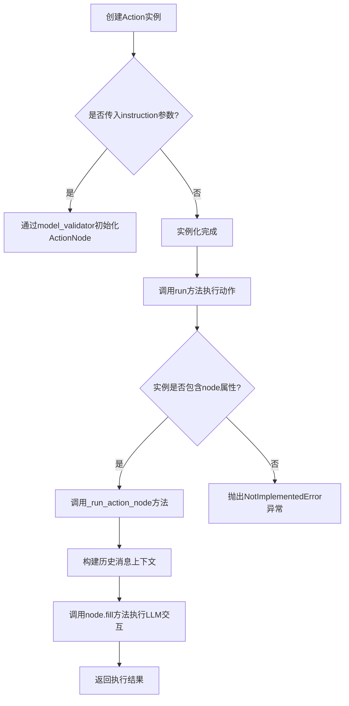

## 类结构

```
Action (核心动作基类)
├── 继承自: SerializationMixin (序列化功能)
├── 继承自: ContextMixin (上下文管理功能)
└── 继承自: BaseModel (Pydantic数据验证与配置)
```

## 全局变量及字段


### `Action.name`
    
动作的名称，用于标识具体的动作实例。

类型：`str`
    


### `Action.i_context`
    
动作的输入上下文，可以是多种类型的上下文对象或字典，用于传递执行动作所需的信息。

类型：`Union[dict, CodingContext, CodeSummarizeContext, TestingContext, RunCodeContext, CodePlanAndChangeContext, str, None]`
    


### `Action.prefix`
    
系统消息的前缀，在调用aask*方法时会添加到系统消息中，用于指导语言模型的行为。

类型：`str`
    


### `Action.desc`
    
动作的描述信息，主要用于技能管理器（skill manager）中对动作进行管理和分类。

类型：`str`
    


### `Action.node`
    
动作节点，用于封装具体的动作逻辑和执行流程，支持基于节点的结构化操作。

类型：`ActionNode`
    


### `Action.llm_name_or_type`
    
语言模型（LLM）的名称或API类型，用于指定或覆盖配置文件中默认的LLM设置。

类型：`Optional[str]`
    


### `Action.model_config`
    
Pydantic模型的配置字典，用于设置模型的行为，例如允许任意类型（arbitrary_types_allowed）。

类型：`ConfigDict`
    
    

## 全局函数及方法

### `Action._update_private_llm`

这是一个Pydantic模型验证器方法，用于在`Action`类实例化后，根据`llm_name_or_type`字段的值动态更新其内部的`llm`实例。如果`llm_name_or_type`指定了一个有效的模型配置，它会创建一个新的LLM实例并替换掉原有的`llm`，同时保留原`llm`的成本管理器。

参数：

- `cls`：`Any`，类方法隐含的类参数。
- `data`：`Any`，经过Pydantic初步验证后的`Action`类实例数据。

返回值：`Any`，返回更新了`llm`字段后的`Action`类实例数据。

#### 流程图

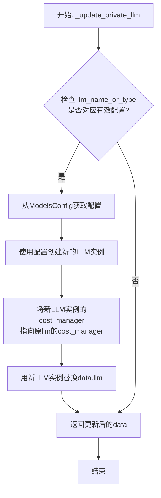

#### 带注释源码

```python
    @model_validator(mode="after")
    @classmethod
    def _update_private_llm(cls, data: Any) -> Any:
        # 1. 根据实例的 llm_name_or_type 字段，从默认的 ModelsConfig 中获取对应的配置。
        config = ModelsConfig.default().get(data.llm_name_or_type)
        # 2. 如果找到了对应的配置（config不为None），则执行更新逻辑。
        if config:
            # 3. 使用获取到的配置创建一个新的 LLM 实例。
            llm = create_llm_instance(config)
            # 4. 将新创建的 LLM 实例的成本管理器（cost_manager）设置为原实例（data.llm）的成本管理器。
            #    这确保了成本追踪的连续性。
            llm.cost_manager = data.llm.cost_manager
            # 5. 用新创建的、带有正确配置和原成本管理器的 LLM 实例替换掉 data 中的 llm 字段。
            data.llm = llm
        # 6. 返回更新后的 data 对象（即 Action 实例）。
        return data
```

### `Action.prompt_schema`

这是一个属性访问器（getter），用于获取当前 `Action` 实例关联的配置对象中的 `prompt_schema` 属性。它本身不接受任何参数，直接返回配置中定义的提示词模式。

参数：
- 无

返回值：`Any`，返回 `self.config.prompt_schema` 的值，其具体类型取决于 `config` 对象中 `prompt_schema` 字段的定义。

#### 流程图

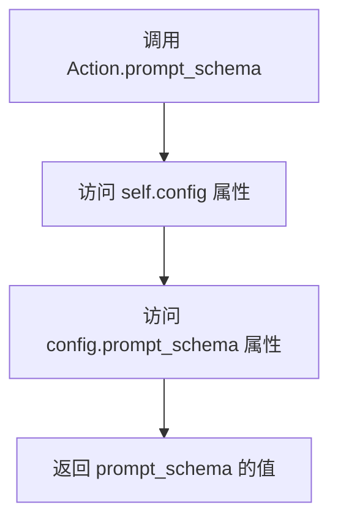

#### 带注释源码

```python
@property
def prompt_schema(self):
    # 这是一个属性装饰器，将方法转换为只读属性。
    # 当访问 `action_instance.prompt_schema` 时，会执行此方法。
    # 它返回当前 Action 实例的配置对象（self.config）中的 `prompt_schema` 字段。
    # 这通常用于获取与当前 Action 相关的提示词模板或模式。
    return self.config.prompt_schema
```

### `Action.project_name`

这是一个属性（property），用于获取和设置当前Action实例关联的配置对象中的项目名称。它提供了对`self.config.project_name`字段的便捷访问和修改接口。

参数：
- 无显式参数。作为属性，其getter和setter方法通过`self`隐式访问实例数据。

返回值：
- Getter: `str`，返回当前配置中存储的项目名称字符串。
- Setter: `None`，该方法用于设置项目名称，不返回有意义的值。

#### 流程图

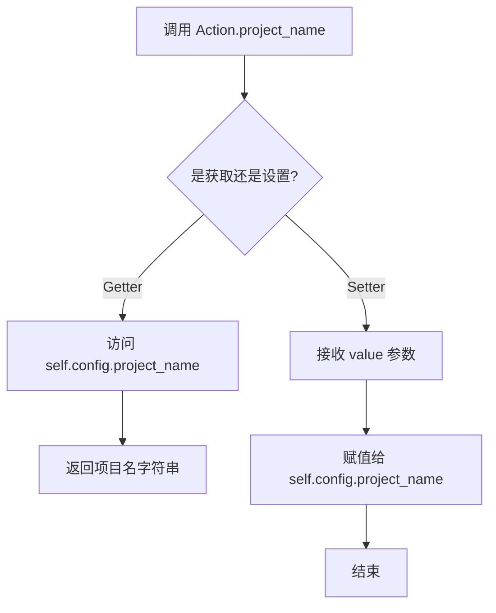

#### 带注释源码

```python
@property
def project_name(self):
    # Getter方法：返回配置对象中的项目名称
    return self.config.project_name

@project_name.setter
def project_name(self, value):
    # Setter方法：将传入的值设置到配置对象的项目名称字段
    self.config.project_name = value
```

### `Action.project_name.setter`

这是一个属性设置器（setter）方法，用于设置 `Action` 类实例的 `project_name` 属性。它通过更新实例的 `config` 对象中的 `project_name` 字段来实现。

参数：

- `value`：`Any`，要设置的新项目名称。

返回值：`None`，此方法不返回任何值，仅执行赋值操作。

#### 流程图

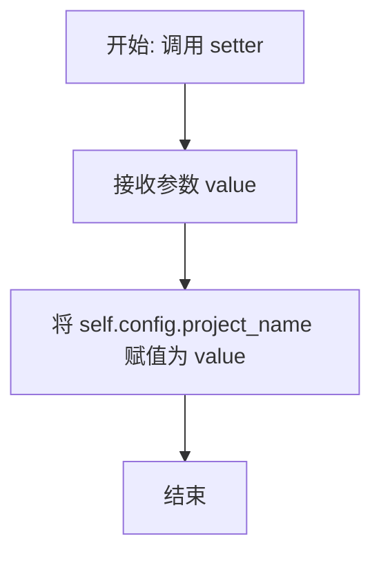

#### 带注释源码

```python
    @project_name.setter
    def project_name(self, value):
        # 将传入的 value 赋值给当前 Action 实例的 config 对象的 project_name 属性
        self.config.project_name = value
```

### `Action.project_path`

`project_path` 是 `Action` 类的一个只读属性（property getter），用于获取当前项目的工作目录路径。它从 `Action` 实例的 `config` 属性中读取 `project_path` 字段的值并返回。

参数：
- 无

返回值：`str`，返回当前项目的工作目录路径字符串。

#### 流程图

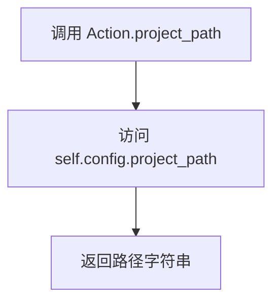

#### 带注释源码

```python
@property
def project_path(self):
    # 属性获取器，返回当前配置中的项目路径
    return self.config.project_path
```

### `Action.set_name_if_empty`

这是一个类方法，用于在创建 `Action` 类实例时，如果传入的 `values` 字典中没有 `"name"` 键或其值为空，则自动将类的名称（`cls.__name__`）设置为 `name` 的值。这是一个 `pydantic` 的 `model_validator`，在模型数据验证之前执行。

参数：
- `cls`：`type[Action]`，指向 `Action` 类本身的引用。
- `values`：`dict`，包含传入的、用于初始化模型实例的原始数据字典。

返回值：`dict`，返回处理后的 `values` 字典，其中 `"name"` 键已被确保有值。

#### 流程图

```mermaid
flowchart TD
    A[开始: set_name_if_empty(cls, values)] --> B{values 中是否存在 'name' 键且其值非空?}
    B -- 是 --> C[保持 values 不变]
    B -- 否 --> D[将 values['name'] 设置为 cls.__name__]
    C --> E[返回 values]
    D --> E
```

#### 带注释源码

```python
    @model_validator(mode="before")
    @classmethod
    def set_name_if_empty(cls, values):
        # 检查传入的初始化字典中是否没有'name'键，或者'name'键对应的值为空（如空字符串）
        if "name" not in values or not values["name"]:
            # 如果条件满足，则将当前类（Action或其子类）的名称设置为'name'的值
            values["name"] = cls.__name__
        # 返回处理后的字典，供后续的模型验证和实例化使用
        return values
```

### `Action._init_with_instruction`

这是一个 Pydantic 模型验证器，用于在创建 `Action` 实例时，如果传入 `instruction` 参数，则自动创建一个 `ActionNode` 实例并将其赋值给 `node` 字段。它处理了从旧版 API（使用 `instruction`）到新版 API（使用 `node`）的兼容性转换。

参数：

-   `cls`：`class`，当前类（`Action`）的引用。
-   `values`：`dict`，包含待验证和初始化的模型字段值的字典。

返回值：`dict`，返回处理后的字段值字典，供后续的模型初始化流程使用。

#### 流程图

```mermaid
flowchart TD
    A[开始: _init_with_instruction(cls, values)] --> B{values中是否包含<br>“instruction”键?};
    B -- 是 --> C[从values中弹出<br>“instruction”的值];
    C --> D[使用弹出的instruction<br>创建ActionNode实例];
    D --> E[将ActionNode实例<br>赋值给values['node']];
    E --> F[返回处理后的values字典];
    B -- 否 --> F;
    F --> G[结束];
```

#### 带注释源码

```python
@model_validator(mode="before")
@classmethod
def _init_with_instruction(cls, values):
    # 检查传入的字段值字典中是否包含 'instruction' 键
    if "instruction" in values:
        # 获取 'name' 字段的值，用于作为 ActionNode 的 key
        name = values["name"]
        # 从字典中弹出（移除并获取）'instruction' 的值
        i = values.pop("instruction")
        # 使用弹出的 instruction 创建一个 ActionNode 实例。
        # key: 使用 Action 实例的 name。
        # expected_type: 期望输出类型为字符串。
        # instruction: 使用传入的 instruction 值。
        # example: 示例为空字符串。
        # schema: 模式为 "raw"。
        # 将创建好的 ActionNode 实例赋值给 'node' 字段。
        values["node"] = ActionNode(key=name, expected_type=str, instruction=i, example="", schema="raw")
    # 返回处理后的字段值字典，无论是否修改过
    return values
```

### `Action.set_prefix`

该方法用于设置Action实例的`prefix`字段，并同步更新关联的LLM实例的系统提示和ActionNode的LLM引用。

参数：
- `prefix`：`str`，要设置的提示前缀字符串

返回值：`Action`，返回更新后的Action实例自身，支持链式调用

#### 流程图

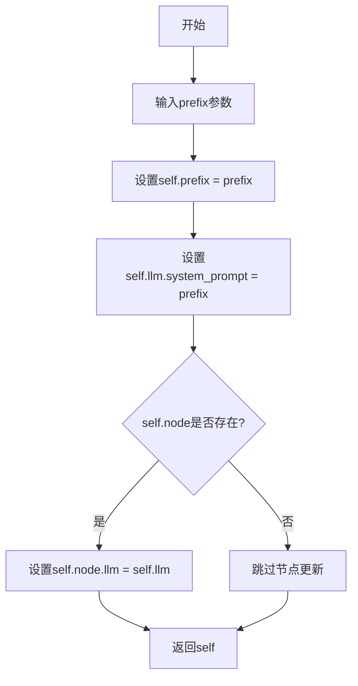

#### 带注释源码

```python
def set_prefix(self, prefix):
    """Set prefix for later usage"""
    # 1. 设置实例的prefix字段
    self.prefix = prefix
    # 2. 同步更新LLM实例的系统提示
    self.llm.system_prompt = prefix
    # 3. 如果存在ActionNode，更新其LLM引用
    if self.node:
        self.node.llm = self.llm
    # 4. 返回自身以支持链式调用
    return self
```

### `Action.__str__`

该方法返回 `Action` 类实例的字符串表示形式，用于提供对象的可读性描述。

参数：

- `self`：`Action` 实例，表示当前对象。

返回值：`str`，返回当前 `Action` 类实例的类名作为字符串表示。

#### 流程图

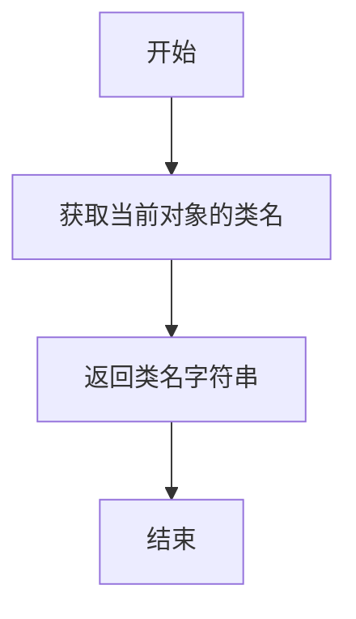

#### 带注释源码

```python
def __str__(self):
    # 返回当前类的类名作为字符串表示
    return self.__class__.__name__
```

### `Action.__repr__`

该方法返回 `Action` 类的字符串表示形式，用于调试和日志记录。它通过调用 `__str__` 方法来获取类的名称，并返回该名称作为对象的可读表示。

参数：
-  `self`：`Action` 实例，表示当前对象。

返回值：`str`，返回当前对象的类名作为字符串表示。

#### 流程图

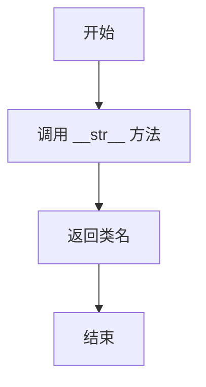

#### 带注释源码

```python
def __repr__(self):
    # 调用 __str__ 方法获取对象的字符串表示
    return self.__str__()
```

### `Action._aask`

该方法用于向配置的LLM（大语言模型）异步发送一个提示（prompt），并可选择性地附带系统消息，最终返回LLM生成的文本响应。

参数：

-  `prompt`：`str`，发送给LLM的主要用户提示文本。
-  `system_msgs`：`Optional[list[str]]`，一个可选的字符串列表，作为系统消息发送给LLM，用于设定对话的背景或行为指令。

返回值：`str`，LLM根据提供的提示和系统消息生成的文本响应。

#### 流程图

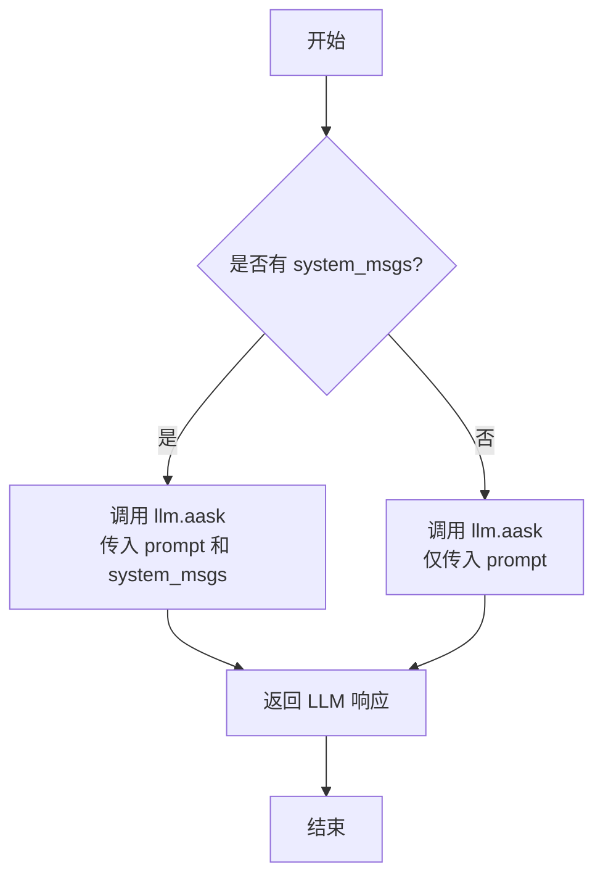

#### 带注释源码

```python
async def _aask(self, prompt: str, system_msgs: Optional[list[str]] = None) -> str:
    """Append default prefix"""
    # 调用当前Action实例关联的LLM对象的异步aask方法。
    # 该方法将用户提示（prompt）和可选的系统消息列表（system_msgs）发送给LLM。
    # 返回LLM生成的文本字符串。
    return await self.llm.aask(prompt, system_msgs)
```

### `Action._run_action_node`

该方法用于运行一个ActionNode，通过将历史消息构建为上下文，并调用ActionNode的fill方法来生成响应。

参数：

- `*args`：`tuple`，可变位置参数，其中第一个元素应为消息列表（msgs）
- `**kwargs`：`dict`，可变关键字参数，用于传递其他参数

返回值：`Any`，返回ActionNode.fill方法的结果，通常是填充后的响应内容

#### 流程图

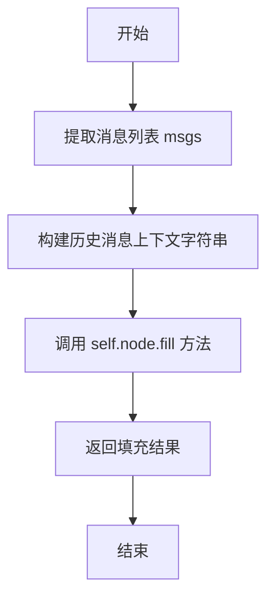

#### 带注释源码

```python
async def _run_action_node(self, *args, **kwargs):
    """运行ActionNode，将历史消息构建为上下文并填充节点"""
    # 从args中提取第一个参数作为消息列表
    msgs = args[0]
    # 初始化上下文字符串，添加标题
    context = "## History Messages\n"
    # 将消息列表反转并枚举，构建格式化的历史消息字符串
    context += "\n".join([f"{idx}: {i}" for idx, i in enumerate(reversed(msgs))])
    # 调用ActionNode的fill方法，传入构建的上下文和LLM实例
    return await self.node.fill(req=context, llm=self.llm)
```

### `Action.run`

`Action.run` 是 `Action` 类的核心异步方法，用于执行一个具体的动作。它首先检查当前实例是否配置了 `ActionNode`。如果配置了，则调用内部方法 `_run_action_node` 来运行该节点；如果没有配置，则抛出 `NotImplementedError` 异常，要求子类必须实现自己的 `run` 方法。这为不同类型的动作提供了统一的执行入口和扩展机制。

参数：
- `*args`：`Any`，可变位置参数，传递给 `_run_action_node` 方法。
- `**kwargs`：`Any`，可变关键字参数，传递给 `_run_action_node` 方法。

返回值：`Any`，返回 `_run_action_node` 方法的执行结果，其具体类型由节点处理逻辑决定。

#### 流程图

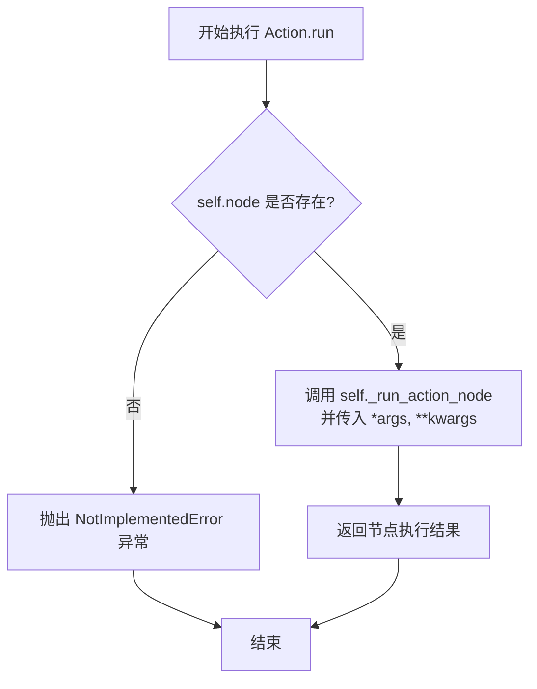

#### 带注释源码

```python
async def run(self, *args, **kwargs):
    """Run action"""
    # 检查当前动作实例是否关联了一个 ActionNode
    if self.node:
        # 如果存在节点，则调用内部方法执行该节点
        return await self._run_action_node(*args, **kwargs)
    # 如果不存在节点，说明这是一个需要子类具体实现的动作，抛出异常
    raise NotImplementedError("The run method should be implemented in a subclass.")
```

### `Action.override_context`

该方法用于确保Action实例的`private_context`和`context`属性指向同一个上下文对象。如果`private_context`为空，则将其设置为与`context`相同的对象，以实现上下文的重用或同步。

参数：
- 无

返回值：`None`，无返回值

#### 流程图

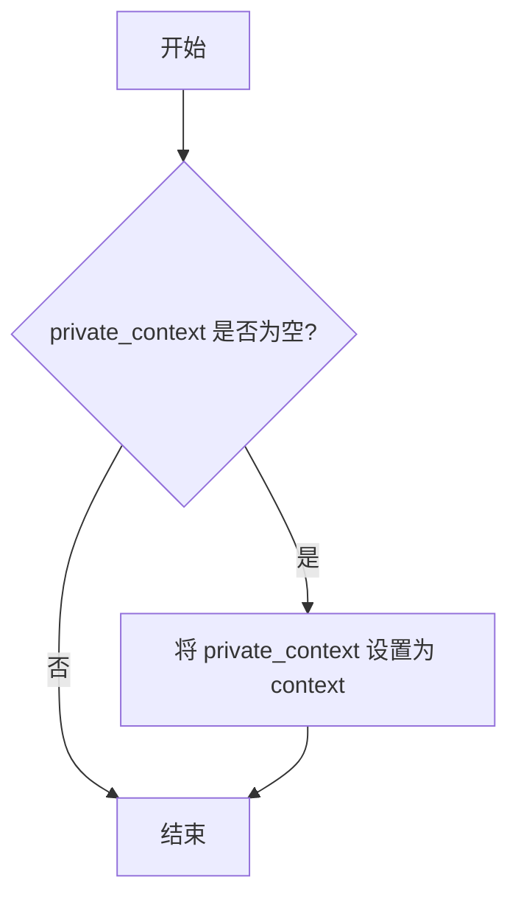

#### 带注释源码

```python
def override_context(self):
    """Set `private_context` and `context` to the same `Context` object."""
    if not self.private_context:
        self.private_context = self.context
```

## 关键组件


### Action类

作为所有具体Action的基类，定义了动作的通用结构、上下文管理、LLM交互以及通过ActionNode进行结构化输出的核心能力。

### ActionNode

一个用于结构化生成和解析LLM响应的组件，通过定义期望的输出类型、指令和示例，将自然语言响应转换为结构化的数据。

### 模型配置与LLM实例化

通过`ModelsConfig`和`create_llm_instance`，支持动态选择和创建不同配置的LLM实例，实现了LLM后端的可插拔性。

### 上下文混合与序列化

通过继承`ContextMixin`和`SerializationMixin`，为Action提供了统一的上下文管理能力和序列化支持。

### 验证器

使用Pydantic的`model_validator`，在模型初始化前后自动执行逻辑，如设置默认名称、根据指令初始化ActionNode、以及根据配置更新私有的LLM实例。


## 问题及建议


### 已知问题

-   **`_update_private_llm` 方法存在潜在的类型错误和逻辑缺陷**：该方法尝试从 `ModelsConfig` 获取配置并创建新的 LLM 实例，然后将原 `llm` 的 `cost_manager` 赋值给新实例。然而，代码中 `data.llm` 在初始化时可能为 `None`，导致 `data.llm.cost_manager` 访问失败（`AttributeError`）。此外，`llm_name_or_type` 字段的默认值为 `None`，但 `ModelsConfig.default().get(None)` 的返回值不明确，可能导致意外的行为。
-   **`i_context` 字段类型过于宽泛**：`i_context` 字段被定义为包含多种特定上下文类型、字典、字符串和 `None` 的联合类型。这种设计虽然灵活，但降低了类型安全性和代码的可读性，使得在处理该字段时需要大量的类型检查和条件分支，增加了出错的风险和维护成本。
-   **`run` 方法的默认实现可能引发误导**：基类的 `run` 方法在 `self.node` 存在时调用 `_run_action_node`，否则抛出 `NotImplementedError`。这强制所有子类要么设置 `node` 属性，要么重写 `run` 方法。然而，对于不依赖 `ActionNode` 的子类，这种设计可能不够直观，且错误信息不够具体。
-   **`_run_action_node` 方法对参数的处理过于简单**：该方法假设 `args[0]` 是一个消息列表，并简单地将其格式化为字符串上下文。这种硬编码的参数处理方式缺乏灵活性，使得该方法难以适应不同调用场景的需求，且与 `run` 方法的签名 `(*args, **kwargs)` 所暗示的通用性不符。
-   **`override_context` 方法逻辑不清晰**：该方法旨在将 `private_context` 和 `context` 设置为同一个对象，但仅在 `private_context` 为空时执行。其目的和适用场景不明确，且方法名 `override_context` 未能清晰表达其“同步”或“初始化”的意图。

### 优化建议

-   **重构 `_update_private_llm` 方法，增强健壮性**：在访问 `data.llm.cost_manager` 之前，应先检查 `data.llm` 是否存在。同时，应明确 `llm_name_or_type` 为 `None` 时的处理逻辑，例如直接返回 `data` 而不进行任何替换，或者提供一个明确的默认配置键。建议将逻辑修改为：
    ```python
    if config and data.llm:
        llm = create_llm_instance(config)
        llm.cost_manager = data.llm.cost_manager
        data.llm = llm
    ```
-   **优化 `i_context` 字段的类型设计**：考虑使用更精确的类型，例如一个包含 `type` 字段和 `data` 字段的通用上下文模型（如 `TypedDict` 或另一个 `BaseModel`），或者为不同的操作场景创建不同的 `Action` 子类，每个子类拥有特定类型的上下文字段。这样可以利用静态类型检查工具提前发现错误。
-   **改进 `run` 方法的默认实现和错误提示**：可以提供一个更清晰的抽象方法，或者将 `run` 改为抛出更具描述性的异常，例如 `NotImplementedError("Subclasses must implement the `run` method or set an `ActionNode`.")`。同时，考虑将 `_run_action_node` 的逻辑移至一个独立的、可重用的组件中，减少基类的职责。
-   **增强 `_run_action_node` 方法的参数处理能力**：建议明确该方法所需的参数，并修改其签名，例如 `async def _run_action_node(self, messages: list, **kwargs):`。或者，设计一个更通用的上下文构建策略，允许子类通过重写某个方法来提供自定义的上下文信息。
-   **重命名或重新设计 `override_context` 方法**：建议将方法名改为更贴切的名称，如 `_sync_contexts` 或 `_init_private_context`，并在文档中明确说明其用途。同时，考虑是否真的需要两个上下文属性（`context` 和 `private_context`），是否可以合并为一个。
-   **考虑将 `ActionNode` 的依赖注入化**：目前 `node` 属性在初始化后与 `Action` 实例紧密耦合。建议通过构造函数或设置器方法显式注入 `ActionNode` 实例，而不是在 `_init_with_instruction` 中隐式创建，这可以提高代码的模块化和可测试性。
-   **补充关键方法的文档字符串**：为 `run`、`_run_action_node`、`override_context` 等公共或受保护的方法添加详细的文档字符串，说明其功能、参数、返回值以及预期的调用方式，有助于其他开发者理解和使用。


## 其它


### 设计目标与约束

本代码旨在定义一个通用的 `Action` 基类，作为元编程框架中所有具体动作（如编码、测试、总结等）的抽象基础。其核心设计目标包括：
1.  **可扩展性**：通过继承机制，允许轻松创建新的具体动作类（如 `WriteCode`， `RunCode`），只需实现 `run` 方法。
2.  **上下文管理**：通过 `ContextMixin` 提供统一的上下文（`context` 和 `private_context`）管理能力，支持动作间的数据传递。
3.  **配置化与依赖注入**：支持通过 `llm_name_or_type` 字段动态配置和切换底层的大语言模型（LLM）实例，实现与具体 LLM 提供商的解耦。
4.  **结构化提示工程**：集成 `ActionNode` 组件，支持将复杂的自然语言指令转化为结构化的数据填充任务，提升与 LLM 交互的可靠性和可控性。
5.  **序列化支持**：通过继承 `SerializationMixin` 和 `BaseModel`（Pydantic），确保动作对象的状态可以被安全地序列化与反序列化，便于在分布式或持久化场景中使用。

主要约束包括：
*   必须与框架中定义的多种上下文类型（`CodingContext`, `TestingContext` 等）兼容。
*   依赖于外部的 `ModelsConfig` 配置和 `create_llm_instance` 工厂来创建 LLM 实例。
*   `run` 方法的默认实现依赖于 `ActionNode`，子类若不使用 `ActionNode` 则必须重写此方法。

### 错误处理与异常设计

代码中的错误处理主要遵循以下模式：
1.  **显式异常抛出**：在基类的 `run` 方法中，如果子类没有实现具体的运行逻辑且没有设置 `node`，则会抛出 `NotImplementedError`。这强制子类必须提供有效的执行逻辑。
2.  **配置验证与静默处理**：在 `_update_private_llm` 验证器中，如果根据 `llm_name_or_type` 找不到对应的配置（`config` 为 `None`），则不会创建新的 `llm` 实例，而是保留原有的 `llm` 配置。这是一种静默的降级处理，依赖于调用方确保初始 `llm` 的有效性。
3.  **属性访问安全**：通过 `@property` 装饰器（如 `prompt_schema`, `project_name`）提供对 `self.config` 属性的安全访问。但代码中未显式处理 `self.config` 为 `None` 的情况，这可能导致 `AttributeError`，属于潜在风险点。
4.  **参数验证**：得益于 Pydantic 基类，在对象构造时会进行类型检查，但复杂的业务逻辑错误（如无效的上下文内容）仍需在子类 `run` 方法中处理。

整体上，错误处理策略偏向于“快速失败”（通过异常）与“配置降级”相结合，但对于外部依赖（如 LLM API 调用失败）的错误处理，则委托给了 `self.llm.aask` 方法及其底层实现。

### 数据流与状态机

`Action` 类的核心数据流围绕 `i_context`、`node` 和 `llm` 展开：
1.  **输入**：主要输入是 `i_context`，它承载了动作执行所需的所有上下文信息，类型多样。此外，`run` 方法接收可变的 `*args` 和 `**kwargs`，为子类提供了灵活的输入接口。
2.  **处理**：
    *   如果动作配置了 `node`（通过 `instruction` 初始化或直接设置），数据流会导向 `_run_action_node`。该方法将历史消息（`msgs`）格式化为上下文字符串，然后调用 `node.fill` 方法，利用 `llm` 完成结构化信息的提取或生成。
    *   如果动作没有配置 `node`，则期望子类重写 `run` 方法，实现自定义的处理逻辑，直接操作 `i_context` 或其它输入。
3.  **输出**：`run` 方法的返回值即为动作的输出。对于 `_run_action_node` 路径，返回值是 `ActionNode.fill` 的结果（通常是结构化数据）；对于子类自定义路径，返回值类型由子类定义。
4.  **状态变更**：
    *   `set_prefix` 方法会修改 `self.prefix` 和 `self.llm.system_prompt`，影响后续所有使用该 LLM 实例的交互。
    *   `override_context` 方法用于同步 `private_context` 和 `context`，影响上下文数据的可见性。
    *   `_update_private_llm` 验证器可能在对象初始化后动态替换 `llm` 实例，这是最重要的状态变更之一。

该类本身不实现一个完整的状态机，但它是一个**可执行单元**，其 `run` 方法代表了一次状态转移（从输入上下文到输出结果）。在更大的工作流中，多个 `Action` 实例可能通过它们的输入/输出（上下文）串联成一个状态机。

### 外部依赖与接口契约

1.  **外部依赖**：
    *   **Pydantic**: 用于数据模型定义、验证和序列化（`BaseModel`, `model_validator`）。
    *   **metagpt.configs.models_config.ModelsConfig**: 提供 LLM 配置信息的读取能力。
    *   **metagpt.provider.llm_provider_registry.create_llm_instance**: 工厂函数，用于根据配置创建具体的 LLM 提供者实例。
    *   **metagpt.actions.action_node.ActionNode**: 结构化提示处理组件，是本类实现默认 `run` 行为的核心依赖。
    *   **metagpt.schema 中的各种 Context 类**：定义了 `i_context` 字段可接受的数据结构。
    *   **metagpt.context_mixin.ContextMixin** 和 **metagpt.schema.SerializationMixin**: 分别提供上下文管理和序列化能力。

2.  **接口契约（对子类/使用方）**：
    *   **`run(*args, **kwargs)` 方法**：这是 `Action` 类最主要的接口。子类必须要么设置 `node` 属性来使用默认的节点执行逻辑，要么重写此方法以实现自定义逻辑。调用方通过调用此方法来触发动作执行。
    *   **`i_context` 属性**：子类和使用方应按照具体动作类型的要求，设置或读取此属性以传递上下文数据。
    *   **`set_prefix(prefix)` 方法**：为动作及其 LLM 设置系统提示前缀的公共接口。
    *   **`llm` 属性**：子类可以通过 `self.llm` 直接访问配置好的 LLM 实例来进行 AI 交互。
    *   **上下文接口**：通过继承的 `ContextMixin`，提供了 `context` 和 `private_context` 的 getter/setter，子类和使用方可以利用它们进行更细粒度的上下文管理。

3.  **配置契约**：依赖于外部的 `ModelsConfig` 必须能通过 `llm_name_or_type` 键找到对应的配置字典，否则 LLM 实例将不会被更新（保持原状或依赖默认配置）。

    