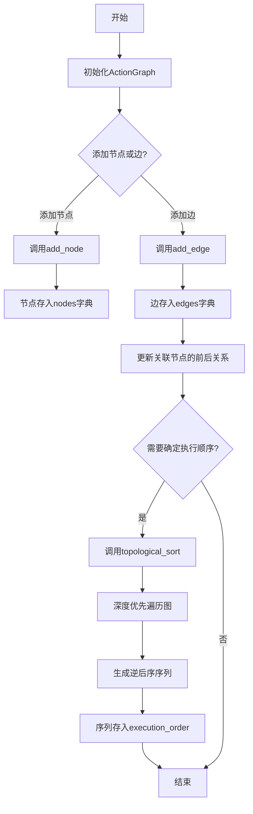
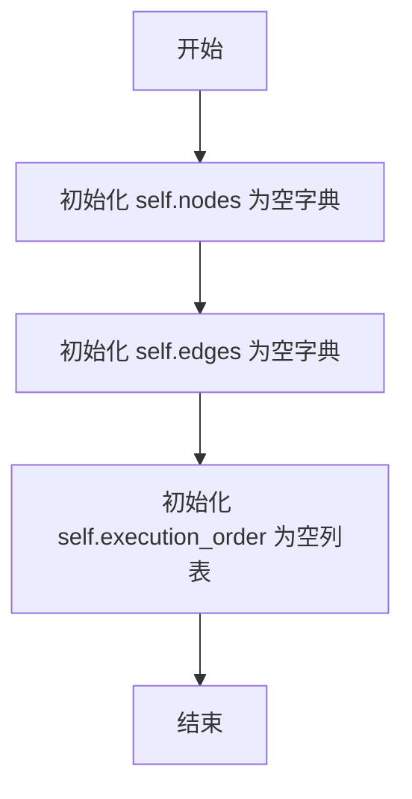
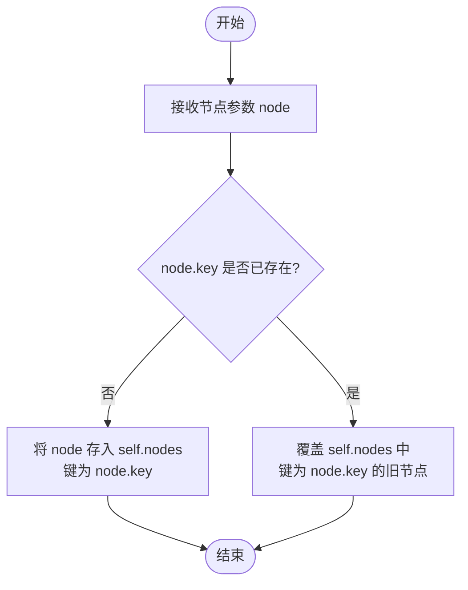

# `.\MetaGPT\metagpt\actions\action_graph.py` 详细设计文档

该代码定义了一个名为 ActionGraph 的类，用于表示和管理动作（Action）之间的依赖关系。它通过有向图的数据结构来组织节点（动作）和边（依赖），并提供了添加节点、添加边以及进行拓扑排序以确定动作执行顺序的功能。

## 整体流程



## 类结构

```
ActionGraph
├── 字段: nodes, edges, execution_order
├── 方法: __init__, add_node, add_edge, topological_sort
```

## 全局变量及字段


### `ActionGraph.nodes`
    
存储图中所有节点的字典，键为节点标识符，值为ActionNode对象。

类型：`dict[str, ActionNode]`
    


### `ActionGraph.edges`
    
存储图中所有边的字典，键为源节点标识符，值为目标节点标识符列表。

类型：`dict[str, list[str]]`
    


### `ActionGraph.execution_order`
    
存储通过拓扑排序计算出的节点执行顺序列表。

类型：`list[str]`
    
    

## 全局函数及方法


### `ActionGraph.__init__`

`ActionGraph` 类的构造函数，用于初始化一个表示动作间依赖关系的有向图。它创建了存储图节点、边以及执行顺序的核心数据结构。

参数：
-  `self`：`ActionGraph`，`ActionGraph` 类的实例自身。

返回值：`None`，构造函数不显式返回值。

#### 流程图



#### 带注释源码

```python
def __init__(self):
    # 初始化节点字典，键为节点标识符（node.key），值为节点对象（ActionNode）
    self.nodes = {}
    # 初始化边字典，键为起始节点标识符，值为一个列表，包含所有目标节点标识符
    self.edges = {}
    # 初始化执行顺序列表，用于存储拓扑排序后的节点标识符序列
    self.execution_order = []
```


### `ActionGraph.add_node`

该方法用于向动作图中添加一个新的节点。它接收一个节点对象作为参数，并将其存储在图的节点字典中，以节点的键（`key`）作为字典的键。

参数：

-  `node`：`ActionNode`，要添加到图中的节点对象。该节点必须具有一个`key`属性，用于在图中唯一标识该节点。

返回值：`None`，该方法不返回任何值。

#### 流程图



#### 带注释源码

```python
def add_node(self, node):
    """Add a node to the graph"""
    # 将传入的节点对象 node 存储到实例变量 self.nodes 字典中。
    # 字典的键是节点的唯一标识符 node.key，值是节点对象本身。
    # 如果 node.key 已存在，此操作将覆盖原有的节点。
    self.nodes[node.key] = node
```


### `ActionGraph.add_edge`

该方法用于向动作依赖关系图中添加一条有向边，表示一个动作节点（`from_node`）是另一个动作节点（`to_node`）的前置依赖。它会更新图的邻接表结构，并同步更新两个节点对象内部的邻接关系。

参数：

-  `from_node`：`ActionNode`，表示有向边的起始节点，即依赖的提供者。
-  `to_node`：`ActionNode`，表示有向边的目标节点，即依赖的消费者。

返回值：`None`，此方法不返回任何值，其作用在于修改`ActionGraph`对象和`ActionNode`对象的状态。

#### 流程图

```mermaid
flowchart TD
    A[开始: add_edge(from_node, to_node)] --> B{from_node.key 是否在 edges 中?}
    B -- 否 --> C[初始化 edges[from_node.key] 为空列表]
    B -- 是 --> D
    C --> D[将 to_node.key 追加到 edges[from_node.key] 列表]
    D --> E[调用 from_node.add_next(to_node)]
    E --> F[调用 to_node.add_prev(from_node)]
    F --> G[结束]
```

#### 带注释源码

```python
def add_edge(self, from_node: "ActionNode", to_node: "ActionNode"):
    """Add an edge to the graph"""
    # 检查起始节点的key是否已存在于图的边字典中
    if from_node.key not in self.edges:
        # 若不存在，则为该起始节点创建一个空列表，用于存储其所有后继节点的key
        self.edges[from_node.key] = []
    # 将目标节点的key添加到起始节点的后继节点列表中
    self.edges[from_node.key].append(to_node.key)
    # 更新起始节点对象，将目标节点添加为其后继节点
    from_node.add_next(to_node)
    # 更新目标节点对象，将起始节点添加为其前驱节点
    to_node.add_prev(from_node)
```


### `ActionGraph.topological_sort`

该方法对`ActionGraph`中的节点进行拓扑排序，以确定一个满足所有依赖关系的执行顺序。它使用深度优先搜索（DFS）算法来遍历图，并将节点按完成顺序压入栈中，最终得到一个从依赖项到被依赖项的线性序列。

参数：
- 无

返回值：`None`，该方法不直接返回值，但会将排序结果存储在`self.execution_order`中。

#### 流程图

```mermaid
graph TD
    A[开始拓扑排序] --> B[初始化 visited 集合和 stack 列表]
    B --> C[定义内部递归函数 visit]
    C --> D[遍历 self.nodes 中的每个 key]
    D --> E{key 是否已访问?}
    E -->|否| F[标记 key 为已访问]
    F --> G{key 是否有出边?}
    G -->|是| H[遍历 key 的每个后继节点 next_node]
    H --> I[递归调用 visit(next_node)]
    I --> G
    G -->|否| J[将 key 插入 stack 开头]
    J --> D
    E -->|是| D
    D --> K[遍历完成， 将 stack 赋值给 self.execution_order]
    K --> L[结束]
```

#### 带注释源码

```python
def topological_sort(self):
    """Topological sort the graph"""
    # 初始化一个集合，用于记录已访问过的节点键
    visited = set()
    # 初始化一个列表，作为栈来存储拓扑排序的结果
    stack = []

    # 定义内部递归函数 `visit`，用于深度优先遍历图
    def visit(k):
        # 如果当前节点键 `k` 尚未被访问
        if k not in visited:
            # 标记节点键 `k` 为已访问
            visited.add(k)
            # 检查节点键 `k` 是否有出边（即是否有后继节点）
            if k in self.edges:
                # 遍历节点键 `k` 的所有后继节点键
                for next_node in self.edges[k]:
                    # 递归访问后继节点
                    visit(next_node)
            # 当节点 `k` 的所有后继节点都被访问后，将其插入栈的开头
            # 这保证了在最终栈中，依赖项（先完成访问的）位于被依赖项（后完成访问的）之后
            stack.insert(0, k)

    # 遍历图中所有节点的键
    for key in self.nodes:
        # 对每个未访问的节点启动深度优先遍历
        visit(key)

    # 将最终得到的拓扑排序结果（栈）赋值给实例变量 `execution_order`
    self.execution_order = stack
```

## 关键组件


### ActionGraph 类

表示动作之间依赖关系的有向图，负责管理节点、边以及计算拓扑排序执行顺序。

### 节点管理

通过 `nodes` 字典存储所有节点，并提供 `add_node` 方法添加新节点。

### 边管理

通过 `edges` 字典存储节点间的依赖关系（边），并提供 `add_edge` 方法添加从源节点到目标节点的边，同时更新相关节点的前后继关系。

### 拓扑排序

通过 `topological_sort` 方法对图中的节点进行拓扑排序，以确定无环依赖下的执行顺序，并将结果存储在 `execution_order` 列表中。


## 问题及建议


### 已知问题

-   **循环依赖检测缺失**：`topological_sort` 方法使用深度优先搜索（DFS）进行拓扑排序，但未包含检测有向图中循环依赖的逻辑。如果图中存在环，该方法将陷入无限递归或产生错误的执行顺序，导致程序行为异常或崩溃。
-   **边管理不一致**：`add_edge` 方法在 `self.edges` 字典中存储边信息（以 `from_node.key` 为键，`to_node.key` 列表为值），同时也调用了 `from_node.add_next(to_node)` 和 `to_node.add_prev(from_node)`。这种双重管理可能导致状态不一致，增加维护复杂性和出错风险。
-   **执行顺序重置风险**：`topological_sort` 方法每次调用都会直接覆盖 `self.execution_order`。如果在图结构未改变时多次调用，会造成不必要的计算开销。同时，缺少对排序结果有效性的验证（例如，排序后的节点列表是否与图中节点数量一致）。
-   **缺乏输入验证与错误处理**：`add_node` 和 `add_edge` 方法未对输入参数（如 `node`、`from_node`、`to_node`）进行有效性检查（例如是否为 `None`、是否具有 `key` 属性）。当传入无效节点时，代码可能抛出 `AttributeError` 等异常，缺乏健壮性。
-   **潜在的性能问题**：在 `topological_sort` 的 `visit` 函数中，使用 `stack.insert(0, k)` 在列表头部插入元素，其时间复杂度为 O(n)。对于包含大量节点的图，频繁的头部插入操作会导致性能下降。

### 优化建议

-   **增加循环依赖检测**：在 `topological_sort` 方法中引入状态标记（如“未访问”、“访问中”、“已访问”），在 DFS 过程中如果遇到“访问中”的节点，则说明存在环，应抛出明确的异常（如 `CycleDetectedError`）并终止排序。
-   **统一边管理策略**：重新评估边信息的存储责任。建议将边的信息完全委托给 `ActionNode` 对象自身管理（通过 `next` 和 `prev` 关系），`ActionGraph` 仅作为节点容器和拓扑排序的执行者。或者，反之亦然，由 `ActionGraph` 集中管理边关系。选择一种策略以简化逻辑。
-   **缓存拓扑排序结果**：在 `ActionGraph` 类中增加一个标志位（如 `_is_dirty`），当图结构发生变化（`add_node`、`add_edge` 被调用）时将其设为 `True`。在 `topological_sort` 中，检查该标志位，仅当图结构已变更时才重新计算排序结果，否则返回缓存的 `execution_order`。
-   **增强输入验证与异常处理**：在 `add_node` 和 `add_edge` 方法开头，检查参数的有效性。例如，确保 `node` 不为 `None` 且具有 `key` 属性；确保 `from_node` 和 `to_node` 已存在于 `self.nodes` 中。对于无效输入，抛出带有描述性信息的异常（如 `ValueError` 或自定义异常）。
-   **优化排序性能**：将 `stack.insert(0, k)` 改为 `stack.append(k)`，并在 DFS 完成后使用 `stack.reverse()` 一次性反转列表。`append` 操作的时间复杂度为 O(1)，`reverse` 为 O(n)，总体性能优于多次 O(n) 的 `insert(0, ...)` 操作。
-   **考虑使用标准库或成熟图库**：对于复杂的图操作，可以考虑使用 `networkx` 等成熟的第三方库，它们提供了经过充分测试的图数据结构、拓扑排序、环检测等算法，能显著提高代码的可靠性和开发效率。


## 其它


### 设计目标与约束

本模块旨在提供一个轻量级、无环的有向图数据结构，用于表示和管理动作（Action）之间的依赖关系，并支持拓扑排序以确定执行顺序。核心约束包括：1) 保持简单性，不引入复杂的外部依赖；2) 假设图为有向无环图（DAG），不内置环检测机制；3) 节点与边的关系通过键（key）进行管理，要求节点具有唯一的键标识。

### 错误处理与异常设计

当前代码未显式定义错误处理逻辑。潜在问题包括：1) 添加重复节点键时会静默覆盖，可能导致数据丢失；2) `add_edge` 方法未检查 `from_node` 或 `to_node` 是否已存在于图中，可能导致引用不存在节点的边；3) `topological_sort` 方法若应用于包含环的图，将导致递归深度错误或错误排序。建议未来增加键冲突异常、节点不存在异常及环检测机制。

### 数据流与状态机

数据流始于通过 `add_node` 和 `add_edge` 构建图结构。`nodes` 字典存储所有节点，`edges` 字典存储邻接关系。调用 `topological_sort` 后，图状态从“未排序”变为“已排序”，结果存储在 `execution_order` 列表中。该过程是单向的，排序后再次修改图结构（如增删节点/边）不会自动更新 `execution_order`，需重新调用排序方法。

### 外部依赖与接口契约

当前代码仅依赖标准库，无外部依赖。接口契约体现在：1) `add_node` 方法要求节点参数必须具有 `key` 属性；2) `add_edge` 方法要求 `from_node` 和 `to_node` 参数为具有 `key`、`add_next` 和 `add_prev` 方法的对象（如预期的 `ActionNode` 类型）；3) `topological_sort` 方法不接收参数，直接操作实例内部状态。这些隐式契约缺乏类型提示和验证。

### 性能与可扩展性分析

对于包含 N 个节点、E 条边的图：`add_node` 和 `add_edge` 的时间复杂度为 O(1)。`topological_sort` 使用深度优先搜索（DFS），时间复杂度为 O(N+E)。空间复杂度为 O(N+E) 用于存储图和递归栈。可扩展性方面：1) 当前使用递归 DFS，对于深度极大的图可能导致递归溢出，可改为迭代栈实现；2) 缺乏批量操作接口；3) 图结构目前仅支持通过键访问，若需通过其他属性查询需遍历节点字典。

### 测试策略建议

应设计以下测试用例：1) 单元测试：测试空图、单节点图的排序；测试添加节点、边的正确性；测试拓扑排序结果符合依赖顺序。2) 异常测试：测试添加重复键节点、引用不存在的节点创建边时的行为；测试对含环图进行排序时的表现。3) 集成测试：与 `ActionNode` 类结合，验证完整的动作依赖管理与执行流程。

    