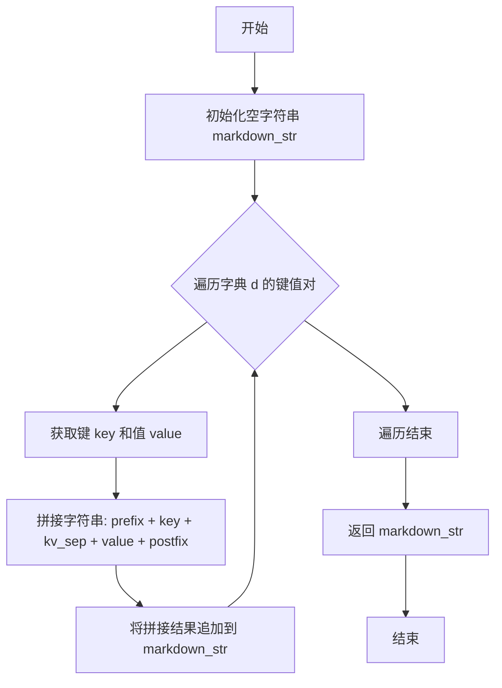
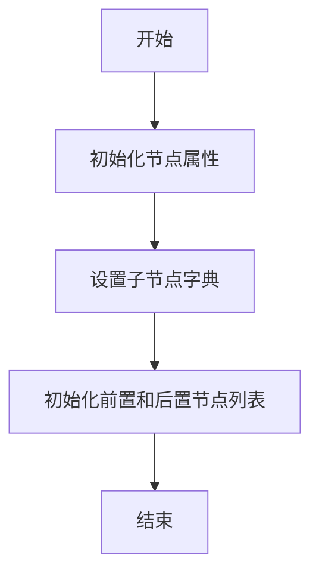
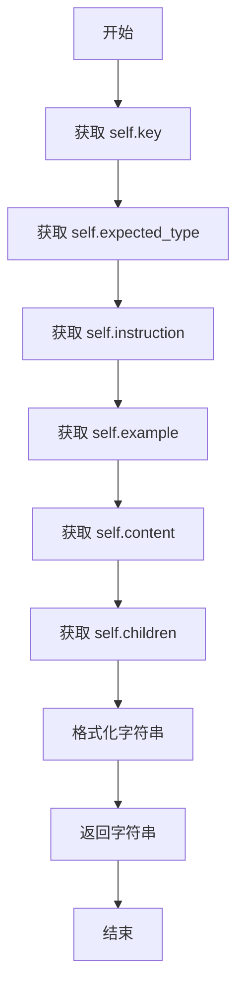
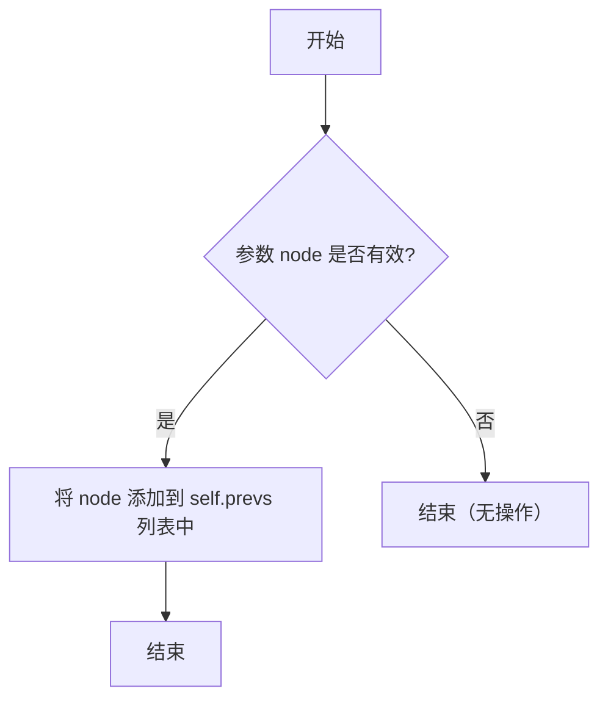
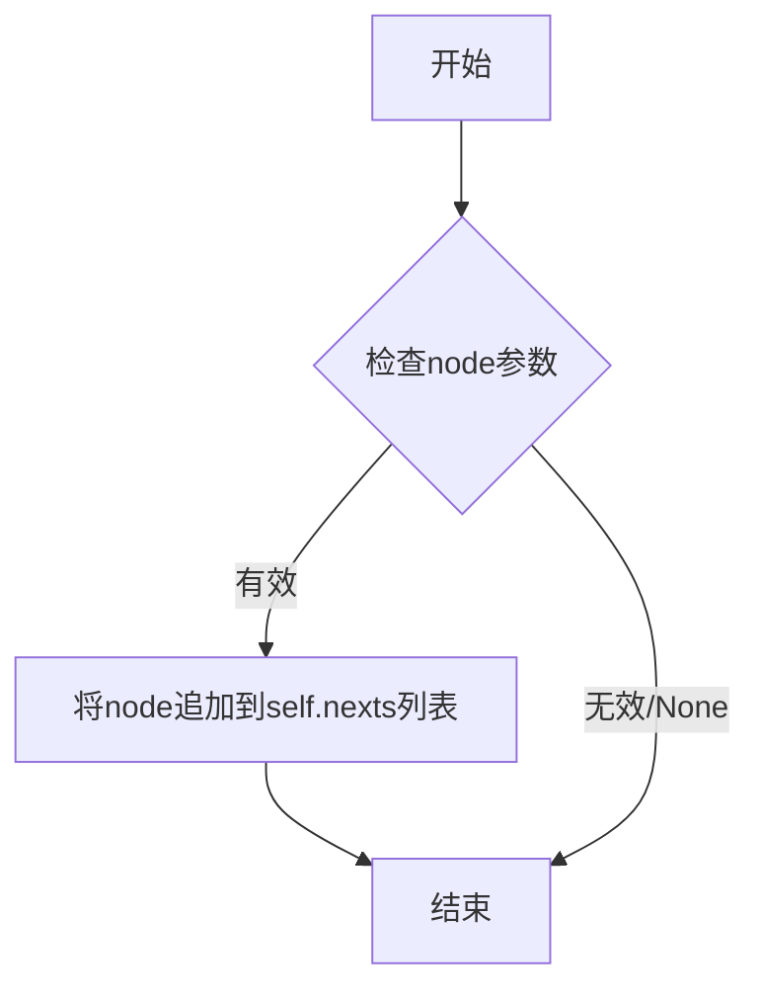
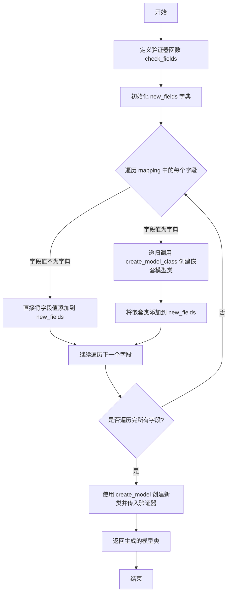
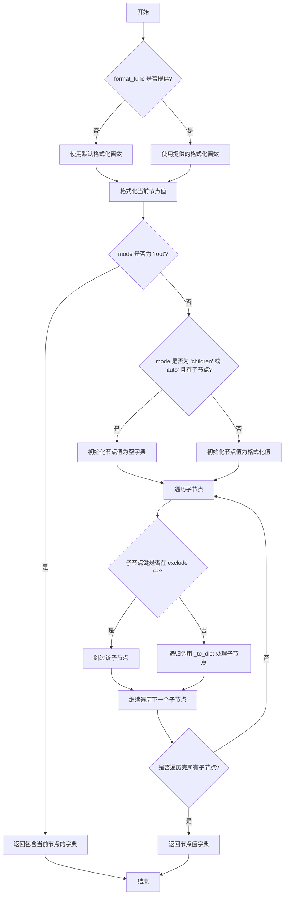
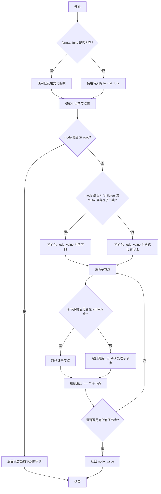
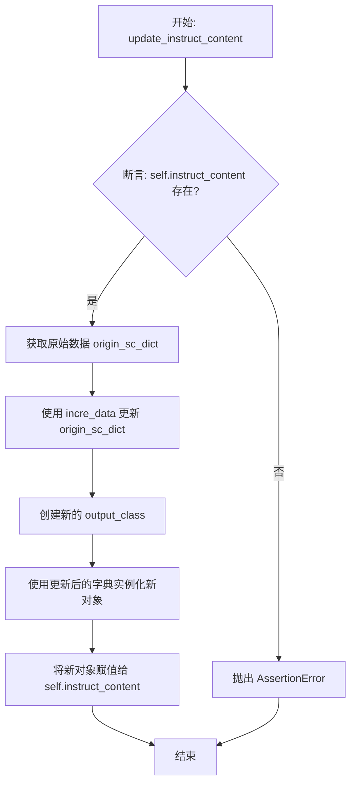

# `.\MetaGPT\metagpt\actions\action_node.py` 详细设计文档

该代码定义了一个名为 ActionNode 的核心类，它是一个用于构建和管理结构化提示（Prompt）的树形节点系统。其主要功能是：1) 将复杂的任务需求（如代码生成、内容填充）分解为结构化的节点树；2) 根据节点定义（键、类型、指令、示例）自动编译成不同格式（JSON/Markdown/原始文本）的提示词；3) 与大型语言模型（LLM）交互，获取结构化输出；4) 利用 Pydantic 模型对 LLM 输出进行类型验证和解析；5) 提供对输出结果的自动化或人工审查（Review）与修订（Revise）工作流。它是实现复杂、多步骤 AI 任务编排和结果质量控制的底层框架。

## 整体流程

```mermaid
graph TD
    A[开始: 创建 ActionNode 树] --> B[调用 fill 方法]
    B --> C{选择填充模式?}
    C -- simple/complex --> D[编译提示词 (compile)]
    C -- code_fill --> E[调用 code_fill]
    C -- xml_fill --> F[调用 xml_fill]
    C -- single_fill --> G[调用 single_fill]
    D --> H[调用 LLM (_aask_v1)]
    E --> I[调用 LLM 并提取代码]
    F --> J[调用 LLM 并解析 XML]
    G --> K[调用 LLM 获取原始文本]
    H --> L[解析并验证输出 (Pydantic)]
    I --> M[组装结果]
    J --> M
    K --> M
    L --> M
    M[填充 instruct_content] --> N{是否需要审查/修订?}
    N -- 是 --> O[调用 review 方法]
    O --> P{审查模式?}
    P -- auto --> Q[自动审查 (auto_review)]
    P -- human --> R[人工审查 (human_review)]
    Q --> S[生成修订意见]
    R --> S
    S --> T[调用 revise 方法]
    T --> U{修订模式?}
    U -- auto/human_review --> V[自动修订 (auto_revise)]
    U -- human --> W[人工修订 (human_revise)]
    V --> X[更新 instruct_content]
    W --> X
    N -- 否 --> Y[结束: 返回填充后的 ActionNode]
    X --> Y
```

## 类结构

```
ActionNode (核心节点类)
├── 类方法 (Class Methods)
│   ├── from_children
│   ├── create_model_class
│   ├── from_pydantic
│   └── is_optional_type
├── 实例方法 (Instance Methods)
│   ├── 图结构操作 (add_prev, add_next, add_child, get_child, add_children)
│   ├── 映射与编译 (get_mapping, to_dict, compile_instruction, compile_example, compile)
│   ├── 模型创建 (create_class, _create_children_class)
│   ├── 核心填充 (fill, simple_fill, code_fill, xml_fill, single_fill, _aask_v1)
│   ├── 审查与修订 (review, simple_review, auto_review, human_review, revise, simple_revise, auto_revise, human_revise)
│   └── 工具方法 (get, set_recursive, set_llm, set_context, get_field_name, get_field_names, get_field_types, xml_compile, update_instruct_content, _makeup_nodes_output_with_req, _makeup_nodes_output_with_comment)
└── 内部类/枚举 (Inner Classes/Enums)
    ├── ReviewMode (Enum)
    └── ReviseMode (Enum)
```

## 全局变量及字段


### `TAG`
    
用于标记LLM输出内容的标签，通常用于包裹结构化输出以便解析。

类型：`str`
    


### `LANGUAGE_CONSTRAINT`
    
提示LLM使用与人类输入相同的语言进行输出的约束字符串。

类型：`str`
    


### `FORMAT_CONSTRAINT`
    
定义输出格式的约束字符串，要求输出必须包裹在指定的TAG标签内。

类型：`str`
    


### `SIMPLE_TEMPLATE`
    
用于生成简单填充（simple fill）提示词的基础模板，包含上下文、示例、节点指令和约束。

类型：`str`
    


### `REVIEW_TEMPLATE`
    
用于生成自动评审（auto review）提示词的模板，用于比较节点输出与要求并生成修改意见。

类型：`str`
    


### `REVISE_TEMPLATE`
    
用于生成自动修订（auto revise）提示词的模板，根据评审意见修改节点输出。

类型：`str`
    


### `ActionNode.schema`
    
定义节点输出或提示词编译的格式，如 'raw'、'json' 或 'markdown'。

类型：`str`
    


### `ActionNode.context`
    
提供给LLM的上下文信息，包含执行任务所需的所有必要背景。

类型：`str`
    


### `ActionNode.llm`
    
用于与节点交互的大语言模型实例，提供aask等接口。

类型：`BaseLLM`
    


### `ActionNode.children`
    
存储当前节点的子节点，键为子节点key，值为子节点对象，构成树形结构。

类型：`Dict[str, ActionNode]`
    


### `ActionNode.key`
    
节点的唯一标识符，在树形结构或映射中用于定位该节点。

类型：`str`
    


### `ActionNode.func`
    
与节点关联的可调用对象（如函数或LLM调用），用于执行节点的核心逻辑。

类型：`typing.Callable`
    


### `ActionNode.params`
    
节点函数的输入参数字典，键为参数名，值为参数的类型提示。

类型：`Dict[str, Type]`
    


### `ActionNode.expected_type`
    
节点输出内容的期望类型，如 str、int 或自定义的Pydantic模型。

类型：`Type`
    


### `ActionNode.instruction`
    
描述节点应遵循的具体操作指令，用于指导LLM生成内容。

类型：`str`
    


### `ActionNode.example`
    
节点的输出示例，用于上下文学习（In-Context Learning）以引导LLM生成符合格式的内容。

类型：`Any`
    


### `ActionNode.content`
    
存储LLM生成的原始输出文本。

类型：`str`
    


### `ActionNode.instruct_content`
    
存储解析并结构化后的节点输出，通常是一个Pydantic模型实例。

类型：`BaseModel`
    


### `ActionNode.prevs`
    
在有向图（ActionGraph）中，指向当前节点的前置节点列表。

类型：`List[ActionNode]`
    


### `ActionNode.nexts`
    
在有向图（ActionGraph）中，当前节点指向的后置节点列表。

类型：`List[ActionNode]`
    
    

## 全局函数及方法

### `dict_to_markdown`

将给定的字典转换为Markdown格式的字符串。该函数遍历字典的键值对，为每个键值对生成一个Markdown标题（键）和内容（值）的组合，并可以自定义标题前缀、键值分隔符和每行后缀。

参数：

- `d`：`Dict`，需要转换为Markdown格式的字典。
- `prefix`：`str`，可选，默认为`MARKDOWN_TITLE_PREFIX`，每个键值对中键的前缀，用于生成Markdown标题。
- `kv_sep`：`str`，可选，默认为`"\n"`，键和值之间的分隔符。
- `postfix`：`str`，可选，默认为`"\n"`，每个键值对之后添加的后缀。

返回值：`str`，转换后的Markdown格式字符串。

#### 流程图



#### 带注释源码

```python
def dict_to_markdown(d, prefix=MARKDOWN_TITLE_PREFIX, kv_sep="\n", postfix="\n"):
    # 初始化一个空字符串，用于存储最终的Markdown内容
    markdown_str = ""
    # 遍历输入字典 d 中的所有键值对
    for key, value in d.items():
        # 为每个键值对生成Markdown格式的一行：
        # 格式为：前缀 + 键 + 键值分隔符 + 值 + 后缀
        # 例如，如果 prefix="# "，kv_sep="\n"，postfix="\n"，
        # 对于键"Title"和值"Content"，会生成 "# Title\nContent\n"
        markdown_str += f"{prefix}{key}{kv_sep}{value}{postfix}"
    # 返回拼接好的Markdown字符串
    return markdown_str
```

### `ActionNode.__init__`

`ActionNode.__init__` 方法是 `ActionNode` 类的构造函数，用于初始化一个动作节点。它负责设置节点的核心属性，包括节点的键、期望类型、指令、示例、内容、子节点和模式。这些属性定义了节点的行为、数据结构以及如何与其他节点交互。

参数：

- `key`：`str`，节点的唯一标识符，用于在树结构中引用该节点。
- `expected_type`：`Type`，节点期望的数据类型，用于类型检查和验证。
- `instruction`：`str`，节点的指令或描述，指导如何填充或处理该节点。
- `example`：`Any`，节点的示例值，用于上下文学习或作为默认值。
- `content`：`str`，节点的内容，默认为空字符串。
- `children`：`dict[str, "ActionNode"]`，节点的子节点字典，键为子节点的键，值为子节点对象，默认为空字典。
- `schema`：`str`，节点的模式，用于定义节点的输出格式（如 JSON、Markdown 等），默认为空字符串。

返回值：`None`，构造函数不返回任何值。

#### 流程图



#### 带注释源码

```python
def __init__(
    self,
    key: str,
    expected_type: Type,
    instruction: str,
    example: Any,
    content: str = "",
    children: dict[str, "ActionNode"] = None,
    schema: str = "",
):
    # 设置节点的唯一标识符
    self.key = key
    # 设置节点期望的数据类型
    self.expected_type = expected_type
    # 设置节点的指令或描述
    self.instruction = instruction
    # 设置节点的示例值
    self.example = example
    # 设置节点的内容，默认为空字符串
    self.content = content
    # 设置节点的子节点字典，如果未提供则初始化为空字典
    self.children = children if children is not None else {}
    # 设置节点的模式，用于定义输出格式
    self.schema = schema
    # 初始化前置节点列表，用于图结构中的依赖关系
    self.prevs = []
    # 初始化后置节点列表，用于图结构中的依赖关系
    self.nexts = []
```


### `ActionNode.__str__`

该方法用于生成 `ActionNode` 实例的字符串表示形式，主要用于调试和日志记录。它返回一个包含节点关键属性（键、期望类型、指令、示例、内容以及子节点字典）的格式化字符串。

参数：

- `self`：`ActionNode`，表示当前 `ActionNode` 实例。

返回值：`str`，返回一个包含节点关键信息的字符串。

#### 流程图



#### 带注释源码

```python
def __str__(self):
    # 返回一个格式化字符串，包含节点的关键属性：
    # - self.key: 节点的键名
    # - repr(self.expected_type): 期望类型的字符串表示
    # - self.instruction: 节点的指令
    # - self.example: 节点的示例
    # - self.content: 节点的内容
    # - self.children: 子节点字典
    return (
        f"{self.key}, {repr(self.expected_type)}, {self.instruction}, {self.example}"
        f", {self.content}, {self.children}"
    )
```


### `ActionNode.__repr__`

该方法返回ActionNode对象的字符串表示，主要用于调试和日志记录，展示对象的关键属性。

参数：

-  `self`：`ActionNode`，当前ActionNode实例

返回值：`str`，包含ActionNode关键属性（key、expected_type、instruction、example、content、children）的字符串表示

#### 流程图

```mermaid
flowchart TD
    Start[开始] --> GetKey[获取self.key]
    GetKey --> GetExpectedType[获取repr(self.expected_type)]
    GetExpectedType --> GetInstruction[获取self.instruction]
    GetInstruction --> GetExample[获取self.example]
    GetExample --> GetContent[获取self.content]
    GetContent --> GetChildren[获取self.children]
    GetChildren --> FormatString[格式化字符串]
    FormatString --> Return[返回字符串]
    Return --> End[结束]
```

#### 带注释源码

```python
def __repr__(self):
    # 调用__str__方法，返回相同的字符串表示
    return self.__str__()
```

### `ActionNode.add_prev`

该方法用于将指定的 `ActionNode` 实例添加到当前节点的前置节点列表 (`prevs`) 中，从而建立节点间的依赖关系。

参数：

- `node`：`ActionNode`，需要添加为前置节点的 `ActionNode` 实例。

返回值：`None`，该方法不返回任何值，仅修改当前节点的内部状态。

#### 流程图



#### 带注释源码

```python
def add_prev(self, node: "ActionNode"):
    """增加前置ActionNode"""
    self.prevs.append(node)
```


### `ActionNode.add_next`

该方法用于将指定的 `ActionNode` 实例添加为当前节点的后置节点，建立节点间的有向连接关系，用于构建或扩展动作执行图（Action Graph）。

参数：

- `node`：`ActionNode`，要添加为后置节点的 `ActionNode` 实例。

返回值：`None`，该方法不返回任何值，直接修改当前节点的 `nexts` 列表。

#### 流程图



#### 带注释源码

```python
def add_next(self, node: "ActionNode"):
    """增加后置ActionNode"""
    # 将传入的node参数（一个ActionNode实例）添加到当前实例的nexts列表中。
    # 这建立了从当前节点指向node节点的有向边，表示node是当前节点的后续步骤。
    self.nexts.append(node)
```


### `ActionNode.add_child`

该方法用于向当前 `ActionNode` 实例添加一个子节点。它将传入的子节点对象以其 `key` 属性为键，存储在当前节点的 `children` 字典中，从而构建或扩展一个树形结构。

参数：

- `node`：`ActionNode`，需要添加的子节点对象。

返回值：`None`，该方法不返回任何值，直接修改当前节点的 `children` 字典。

#### 流程图

```mermaid
flowchart TD
    A[开始: 调用 add_child(node)] --> B{node 参数是否为 None?}
    B -- 是 --> C[结束: 无操作]
    B -- 否 --> D[将 node 存入 self.children<br>键: node.key, 值: node]
    D --> E[结束]
```

#### 带注释源码

```python
def add_child(self, node: "ActionNode"):
    """增加子ActionNode"""
    # 将传入的 node 对象以其 key 属性为键，添加到当前节点的 children 字典中。
    self.children[node.key] = node
```


### `ActionNode.get_child`

该方法用于从当前 `ActionNode` 对象的子节点字典 `children` 中，根据给定的键 `key` 查找并返回对应的子节点。如果未找到，则返回 `None`。

参数：

- `key`：`str`，要查找的子节点的键名。

返回值：`Union["ActionNode", None]`，返回找到的子节点对象；如果未找到，则返回 `None`。

#### 流程图

```mermaid
flowchart TD
    A[开始: get_child(key)] --> B{检查 children 字典中<br>是否存在 key?}
    B -- 是 --> C[返回 children[key]]
    B -- 否 --> D[返回 None]
    C --> E[结束]
    D --> E
```

#### 带注释源码

```python
def get_child(self, key: str) -> Union["ActionNode", None]:
    # 使用字典的 get 方法，根据 key 查找子节点。
    # 如果 key 存在于 children 字典中，则返回对应的 ActionNode 对象。
    # 如果 key 不存在，则返回 None（get 方法的默认返回值）。
    return self.children.get(key, None)
```


### `ActionNode.add_children`

该方法用于批量向当前 `ActionNode` 对象中添加多个子节点。它遍历传入的子节点列表，并调用 `add_child` 方法将每个子节点添加到当前节点的 `children` 字典中，以子节点的 `key` 作为字典的键。

参数：

-  `nodes`：`List["ActionNode"]`，一个包含多个 `ActionNode` 子节点的列表。

返回值：`None`，该方法不返回任何值，直接修改当前节点的 `children` 字段。

#### 流程图

```mermaid
flowchart TD
    A[开始：调用 add_children] --> B{遍历 nodes 列表};
    B --> C[取出一个节点 node];
    C --> D[调用 self.add_child(node)];
    D --> E{列表中是否还有节点？};
    E -- 是 --> C;
    E -- 否 --> F[结束];
```

#### 带注释源码

```python
def add_children(self, nodes: List["ActionNode"]):
    """批量增加子ActionNode"""
    # 遍历传入的子节点列表
    for node in nodes:
        # 对列表中的每个节点，调用 add_child 方法将其添加到当前节点的 children 字典中
        self.add_child(node)
```


### `ActionNode.from_children`

`from_children` 是一个类方法，用于从一组子节点直接初始化一个新的 `ActionNode` 实例。它创建一个新的根节点，并将传入的子节点列表批量添加为该根节点的子节点。这是一种便捷的构造函数，用于快速构建具有特定子节点结构的动作节点树。

参数：

- `key`：`str`，新创建的根节点的键名。
- `nodes`：`List["ActionNode"]`，要作为子节点添加的 `ActionNode` 对象列表。

返回值：`ActionNode`，返回一个新创建的 `ActionNode` 实例，其 `children` 字典包含了传入的所有子节点。

#### 流程图

```mermaid
flowchart TD
    A[开始: from_children(key, nodes)] --> B[创建新的 ActionNode 实例 obj]
    B --> C[遍历 nodes 列表]
    C --> D{列表遍历完成?}
    D -- 否 --> E[调用 obj.add_child(node) 添加当前子节点]
    E --> C
    D -- 是 --> F[返回 obj 实例]
    F --> G[结束]
```

#### 带注释源码

```python
    @classmethod
    def from_children(cls, key, nodes: List["ActionNode"]):
        """直接从一系列的子nodes初始化"""
        # 1. 使用给定的 key 和默认值（str类型，空指令，空示例）创建一个新的 ActionNode 实例。
        obj = cls(key, str, "", "")
        # 2. 调用实例方法 add_children，将传入的 nodes 列表中的所有节点批量添加为 obj 的子节点。
        obj.add_children(nodes)
        # 3. 返回这个新创建并已配置好子节点的 ActionNode 实例。
        return obj
```


### `ActionNode._get_children_mapping`

该方法用于获取当前 `ActionNode` 所有子节点的映射字典，支持递归处理嵌套的子节点结构。它遍历当前节点的 `children` 字典，为每个子节点生成一个键值对。如果子节点本身也包含子节点（即嵌套结构），则递归调用自身以生成嵌套的映射字典。该方法还支持通过 `exclude` 参数排除指定的子节点。

参数：

- `self`：`ActionNode`，当前 `ActionNode` 实例。
- `exclude`：`List[str]`，可选，默认为 `None`。一个字符串列表，指定需要排除的子节点键名。如果为 `None`，则不排除任何子节点。

返回值：`Dict[str, Any]`，返回一个字典，其中键为子节点的 `key`，值为一个元组 `(child.expected_type, Field(...))`（对于叶子节点）或另一个嵌套的映射字典（对于非叶子节点）。

#### 流程图

```mermaid
flowchart TD
    A[开始] --> B{exclude 参数是否为 None?}
    B -- 是 --> C[将 exclude 初始化为空列表]
    B -- 否 --> D[使用传入的 exclude 列表]
    C --> E
    D --> E[定义内部递归函数 _get_mapping]
    E --> F[遍历当前节点的 children 字典]
    F --> G{当前子节点 key 是否在 exclude 列表中?}
    G -- 是 --> H[跳过此子节点]
    G -- 否 --> I{当前子节点是否有 children?}
    I -- 是 --> J[递归调用 _get_mapping<br/>生成嵌套映射]
    I -- 否 --> K[生成叶子节点映射<br/>key: (expected_type, Field(...))]
    J --> L[将嵌套映射加入结果]
    K --> L
    H --> F
    L --> F
    F --> M[遍历结束]
    M --> N[返回最终映射字典]
    N --> O[结束]
```

#### 带注释源码

```python
def _get_children_mapping(self, exclude=None) -> Dict[str, Any]:
    """获得子ActionNode的字典，以key索引，支持多级结构。"""
    # 如果 exclude 参数为 None，则初始化为空列表，避免后续操作中的 None 错误。
    exclude = exclude or []

    # 定义内部递归函数 _get_mapping，用于处理单个节点及其子节点。
    def _get_mapping(node: "ActionNode") -> Dict[str, Any]:
        # 初始化当前节点的映射字典。
        mapping = {}
        # 遍历当前节点的所有子节点。
        for key, child in node.children.items():
            # 如果当前子节点的 key 在排除列表中，则跳过。
            if key in exclude:
                continue
            # 判断当前子节点是否还包含子节点（即是否为嵌套结构）。
            if child.children:
                # 如果是嵌套结构，则递归调用 _get_mapping 处理该子节点，
                # 并将其返回的嵌套字典作为当前 key 的值。
                mapping[key] = _get_mapping(child)
            else:
                # 如果是叶子节点（没有子节点），则创建一个元组作为值。
                # 元组包含子节点的期望类型和一个 pydantic Field 对象。
                # Field 对象使用子节点的 example 作为默认值，instruction 作为描述。
                mapping[key] = (child.expected_type, Field(default=child.example, description=child.instruction))
        # 返回构建好的当前节点（或子节点）的映射字典。
        return mapping

    # 从当前节点（self）开始，调用内部递归函数，返回整个子节点树的映射。
    return _get_mapping(self)
```


### `ActionNode._get_self_mapping`

该方法用于获取当前 `ActionNode` 实例自身的键值映射，该映射描述了节点自身的键名、期望类型以及一个占位符（`...`），主要用于在生成 Pydantic 模型类时定义字段。

参数：

-  `self`：`ActionNode`，当前 `ActionNode` 实例。

返回值：`Dict[str, Tuple[Type, Any]]`，返回一个字典，其中键为当前节点的 `key` 属性，值为一个元组，包含当前节点的 `expected_type` 和一个 `...` 占位符。

#### 流程图

```mermaid
flowchart TD
    A[开始] --> B[获取当前节点 key]
    B --> C[获取当前节点 expected_type]
    C --> D[构造映射字典<br>key: (expected_type, ...)]
    D --> E[返回映射字典]
    E --> F[结束]
```

#### 带注释源码

```python
def _get_self_mapping(self) -> Dict[str, Tuple[Type, Any]]:
    """get self key: type mapping"""
    # 返回一个字典，键为当前节点的 key 属性。
    # 值为一个元组，包含当前节点的期望类型 (expected_type) 和一个 ... 占位符。
    # 这个 ... 在 Pydantic 的 Field 定义中通常表示该字段是必需的。
    return {self.key: (self.expected_type, ...)}
```


### `ActionNode.get_mapping`

该方法根据指定的模式（`mode`）获取当前 `ActionNode` 实例的键-类型映射字典。它主要用于在生成 Pydantic 模型类时，确定需要包含哪些字段及其类型信息。

参数：

- `mode`：`str`，指定映射模式。可选值为 `"children"` 或 `"auto"`。在 `"auto"` 模式下，如果当前节点有子节点，则行为与 `"children"` 模式相同；否则，行为与 `"self"` 模式相同（返回自身映射）。
- `exclude`：`Optional[List[str]]`，一个可选的字符串列表，用于指定需要排除的键（字段名）。如果提供，则在生成映射时会跳过这些键。

返回值：`Dict[str, Tuple[Type, Any]]`，返回一个字典。键为字段名（字符串），值为一个元组，包含字段类型（`Type`）和字段的默认值或描述信息（`Any`，通常是一个 `pydantic.Field` 对象或占位符 `...`）。如果模式为 `"children"` 且当前节点没有子节点，或者模式为 `"auto"`、当前节点没有子节点且自身键被排除，则返回空字典 `{}`。

#### 流程图

```mermaid
flowchart TD
    A[开始: get_mapping(mode, exclude)] --> B{mode == 'children'<br>或 mode == 'auto' 且 self.children 存在?};
    B -- 是 --> C[调用 _get_children_mapping(exclude)];
    B -- 否 --> D[调用 _get_self_mapping()];
    C --> E{exclude 包含 self.key?};
    D --> E;
    E -- 是 --> F[返回空字典 {}];
    E -- 否 --> G[返回映射字典];
    F --> H[结束];
    G --> H;
```

#### 带注释源码

```python
def get_mapping(self, mode="children", exclude=None) -> Dict[str, Tuple[Type, Any]]:
    """get key: type mapping under mode"""
    # 判断模式：如果明确指定为'children'模式，或者模式为'auto'且当前节点存在子节点，
    # 则调用内部方法获取子节点的映射。
    if mode == "children" or (mode == "auto" and self.children):
        return self._get_children_mapping(exclude=exclude)
    # 否则，获取节点自身的映射。
    # 如果提供了排除列表且自身键在排除列表中，则返回空字典。
    return {} if exclude and self.key in exclude else self._get_self_mapping()
```


### `ActionNode.create_model_class`

`ActionNode.create_model_class` 是一个类方法，用于基于提供的字段映射动态创建一个Pydantic模型类。该方法会递归处理嵌套的字典结构，为每个字段生成对应的Pydantic字段定义，并添加一个验证器来检查必填字段是否缺失。生成的模型类可用于验证和序列化数据，确保数据结构的正确性。

参数：

- `class_name`：`str`，要创建的Pydantic模型类的名称。
- `mapping`：`Dict[str, Tuple[Type, Any]]`，字段映射字典，键为字段名，值为一个元组，包含字段类型和字段配置（如默认值和描述）。

返回值：`Type[BaseModel]`，返回动态生成的Pydantic模型类。

#### 流程图



#### 带注释源码

```python
@classmethod
@register_action_outcls
def create_model_class(cls, class_name: str, mapping: Dict[str, Tuple[Type, Any]]):
    """基于pydantic v2的模型动态生成，用来检验结果类型正确性"""

    # 定义验证器函数，用于检查必填字段是否缺失
    def check_fields(cls, values):
        # 获取所有字段名
        all_fields = set(mapping.keys())
        required_fields = set()
        # 遍历映射，找出非可选的必填字段
        for k, v in mapping.items():
            type_v, field_info = v
            # 使用静态方法判断是否为可选类型
            if ActionNode.is_optional_type(type_v):
                continue
            required_fields.add(k)

        # 计算缺失的必填字段
        missing_fields = required_fields - set(values.keys())
        if missing_fields:
            raise ValueError(f"Missing fields: {missing_fields}")

        # 检查是否有未识别的字段（即不在映射中的字段）
        unrecognized_fields = set(values.keys()) - all_fields
        if unrecognized_fields:
            logger.warning(f"Unrecognized fields: {unrecognized_fields}")
        return values

    # 将验证器函数包装为Pydantic模型验证器
    validators = {"check_missing_fields_validator": model_validator(mode="before")(check_fields)}

    # 初始化新字段字典
    new_fields = {}
    # 遍历映射中的每个字段
    for field_name, field_value in mapping.items():
        # 如果字段值是一个字典，说明是嵌套结构，需要递归创建模型类
        if isinstance(field_value, dict):
            # 生成嵌套模型类的名称
            nested_class_name = f"{class_name}_{field_name}"
            # 递归调用自身创建嵌套模型类
            nested_class = cls.create_model_class(nested_class_name, field_value)
            # 将嵌套类添加到新字段字典中，使用...表示该字段是必需的
            new_fields[field_name] = (nested_class, ...)
        else:
            # 如果字段值不是字典，直接添加到新字段字典中
            new_fields[field_name] = field_value

    # 使用pydantic的create_model动态创建模型类，并传入验证器
    new_class = create_model(class_name, __validators__=validators, **new_fields)
    # 返回生成的模型类
    return new_class
```

### `ActionNode.create_class`

该方法用于根据当前`ActionNode`实例的配置（模式、排除项等）动态创建一个Pydantic模型类。它首先根据指定的模式（如`'auto'`或`'children'`）和排除列表获取字段映射，然后调用`create_model_class`类方法基于此映射生成一个Pydantic模型类。这个生成的类可用于验证和结构化与当前节点相关的数据。

参数：

- `mode`：`str`，指定获取字段映射的模式。`'auto'`表示根据节点是否有子节点自动选择，`'children'`表示仅使用子节点的映射。
- `class_name`：`str`，可选，指定要创建的Pydantic模型类的名称。如果未提供，则使用`f"{self.key}_AN"`作为默认名称。
- `exclude`：`list`，可选，指定要从字段映射中排除的键（字段名）列表。

返回值：`Type[pydantic.BaseModel]`，返回一个动态生成的Pydantic模型类，可用于实例化对象以验证和存储符合当前`ActionNode`结构的数据。

#### 流程图

```mermaid
flowchart TD
    A[开始: create_class] --> B{是否提供class_name?}
    B -- 是 --> C[使用提供的class_name]
    B -- 否 --> D[生成默认class_name: f"{self.key}_AN"]
    C --> E
    D --> E[调用self.get_mapping<br>传入mode和exclude参数]
    E --> F[获取字段映射mapping]
    F --> G[调用self.create_model_class<br>传入class_name和mapping]
    G --> H[返回生成的Pydantic模型类]
    H --> I[结束]
```

#### 带注释源码

```python
def create_class(self, mode: str = "auto", class_name: str = None, exclude=None):
    # 确定要生成的Pydantic模型类的名称。如果调用者未指定，则使用默认格式。
    class_name = class_name if class_name else f"{self.key}_AN"
    # 根据指定的模式（如'auto'或'children'）和排除列表，获取字段名到（类型, 字段配置）的映射字典。
    # 例如，如果mode='children'，则映射来自子节点；如果mode='auto'且无子节点，则映射来自自身。
    mapping = self.get_mapping(mode=mode, exclude=exclude)
    # 调用类方法`create_model_class`，利用上一步得到的映射动态创建并返回一个Pydantic模型类。
    return self.create_model_class(class_name, mapping)
```


### `ActionNode._create_children_class`

该方法用于根据当前 `ActionNode` 实例的子节点结构，动态创建一个 Pydantic 模型类。它通过调用 `_get_children_mapping` 方法获取子节点的映射关系，然后使用 `create_model_class` 类方法生成对应的模型类。该模型类可用于验证和结构化子节点生成的数据。

参数：

-  `self`：`ActionNode`，当前 `ActionNode` 实例。
-  `exclude`：`Optional[List[str]]`，一个可选的字符串列表，用于指定在生成模型映射时需要排除的子节点键名。

返回值：`Type[BaseModel]`，返回一个动态生成的 Pydantic 模型类，其字段结构与当前节点的子节点（排除指定键后）相对应。

#### 流程图

```mermaid
flowchart TD
    A[开始] --> B[获取子节点映射<br>调用 _get_children_mapping]
    B --> C{是否有排除项？}
    C -- 是 --> D[从映射中移除排除的键]
    C -- 否 --> E[直接使用映射]
    D --> E
    E --> F[生成模型类名<br>格式为 {self.key}_AN]
    F --> G[调用 create_model_class<br>传入类名和映射]
    G --> H[返回生成的 Pydantic 模型类]
    H --> I[结束]
```

#### 带注释源码

```python
def _create_children_class(self, exclude=None):
    """使用object内有的字段直接生成model_class"""
    # 1. 生成模型类名，格式为当前节点键名加上“_AN”后缀。
    class_name = f"{self.key}_AN"
    # 2. 获取当前节点的子节点映射关系，并根据exclude参数过滤。
    mapping = self._get_children_mapping(exclude=exclude)
    # 3. 调用类方法 create_model_class，传入类名和映射，动态创建并返回Pydantic模型类。
    return self.create_model_class(class_name, mapping)
```


### `ActionNode.to_dict`

将当前节点及其子节点按照指定的格式化函数和模式组织成字典结构。该方法递归地遍历节点树，根据提供的格式化函数处理每个节点，并返回一个字典，其中键为节点键，值为格式化后的节点信息或子节点字典。

参数：

- `format_func`：`typing.Callable`，可选参数，用于格式化节点的函数。如果未提供，则使用默认函数，返回节点的`instruction`属性。
- `mode`：`str`，可选参数，指定节点处理模式。支持`"auto"`、`"children"`、`"root"`。默认为`"auto"`。
- `exclude`：`list`，可选参数，指定要排除的子节点键列表。默认为`None`。

返回值：`Dict`，返回一个字典，表示当前节点及其子节点的结构化数据。

#### 流程图



#### 带注释源码

```python
def to_dict(self, format_func=None, mode="auto", exclude=None) -> Dict:
    """将当前节点与子节点都按照node: format的格式组织成字典"""
    # 调用内部方法 _to_dict 获取节点字典
    nodes = self._to_dict(format_func=format_func, mode=mode, exclude=exclude)
    # 如果返回的 nodes 不是字典类型，则将其包装为字典，键为当前节点的 key
    if not isinstance(nodes, dict):
        nodes = {self.key: nodes}
    return nodes

def _to_dict(self, format_func=None, mode="auto", exclude=None) -> Dict:
    """将当前节点与子节点都按照node: format的格式组织成字典"""

    # 如果没有提供格式化函数，则使用默认的格式化函数
    if format_func is None:
        format_func = lambda node: node.instruction

    # 使用提供的格式化函数来格式化当前节点的值
    formatted_value = format_func(self)

    # 创建当前节点的键值对
    if (mode == "children" or mode == "auto") and self.children:
        node_value = {}
    else:
        node_value = formatted_value

    if mode == "root":
        return {self.key: node_value}

    # 递归处理子节点
    exclude = exclude or []
    for child_key, child_node in self.children.items():
        if child_key in exclude:
            continue
        # 递归调用 to_dict 方法并更新节点字典
        child_dict = child_node._to_dict(format_func, mode, exclude)
        node_value[child_key] = child_dict

    return node_value
```


### `ActionNode._to_dict`

该方法将当前节点及其子节点按照指定的格式化函数和模式组织成字典结构。它递归地遍历节点树，根据模式（如"auto"、"children"、"root"）决定是否包含当前节点及其子节点，并使用格式化函数处理每个节点的值。

参数：

- `format_func`：`typing.Callable`，可选，用于格式化节点值的函数。如果未提供，默认使用节点的`instruction`字段。
- `mode`：`str`，可选，指定节点处理模式，可选值为"auto"、"children"、"root"。默认为"auto"。
- `exclude`：`list`，可选，指定需要排除的子节点键名列表。默认为`None`。

返回值：`Dict`，返回一个字典，键为节点键名，值为格式化后的节点值或子节点字典。

#### 流程图



#### 带注释源码

```python
def _to_dict(self, format_func=None, mode="auto", exclude=None) -> Dict:
    """将当前节点与子节点都按照node: format的格式组织成字典"""

    # 如果没有提供格式化函数，则使用默认的格式化函数
    if format_func is None:
        format_func = lambda node: node.instruction

    # 使用提供的格式化函数来格式化当前节点的值
    formatted_value = format_func(self)

    # 创建当前节点的键值对
    if (mode == "children" or mode == "auto") and self.children:
        node_value = {}
    else:
        node_value = formatted_value

    if mode == "root":
        return {self.key: node_value}

    # 递归处理子节点
    exclude = exclude or []
    for child_key, child_node in self.children.items():
        if child_key in exclude:
            continue
        # 递归调用 to_dict 方法并更新节点字典
        child_dict = child_node._to_dict(format_func, mode, exclude)
        node_value[child_key] = child_dict

    return node_value
```


### `ActionNode.update_instruct_content`

该方法用于增量更新当前`ActionNode`实例的`instruct_content`属性。它接受一个字典作为增量数据，将其与现有的`instruct_content`数据合并，然后使用合并后的数据重新创建并赋值`instruct_content`对象。此操作确保了`instruct_content`始终反映最新的、合并后的结构化数据。

参数：

-  `incre_data`：`dict[str, Any]`，一个字典，包含需要增量更新到`instruct_content`中的键值对。

返回值：`None`，该方法不返回任何值，直接修改实例的`instruct_content`属性。

#### 流程图



#### 带注释源码

```python
def update_instruct_content(self, incre_data: dict[str, Any]):
    # 断言确保当前节点已经存在一个有效的 instruct_content 对象
    assert self.instruct_content
    # 将当前的 instruct_content 对象序列化为字典
    origin_sc_dict = self.instruct_content.model_dump()
    # 使用传入的增量数据更新该字典
    origin_sc_dict.update(incre_data)
    # 根据当前节点的结构动态创建一个 Pydantic 模型类
    output_class = self.create_class()
    # 使用合并后的字典数据实例化新的模型对象，并替换原有的 instruct_content
    self.instruct_content = output_class(**origin_sc_dict)
```


### `ActionNode.keys`

该方法用于获取当前 `ActionNode` 及其子节点的键（`key`）列表。根据指定的模式（`mode`），可以返回不同范围的键：仅当前节点的键、仅子节点的键，或两者的组合。

参数：

- `mode`：`str`，指定返回键的模式。可选值为 `"auto"`、`"children"` 或 `"root"`。默认值为 `"auto"`。
  - `"auto"`：如果当前节点有子节点，则返回所有子节点的键；否则，返回当前节点的键。
  - `"children"`：返回所有子节点的键。
  - `"root"`：返回当前节点的键。

返回值：`list`，返回一个包含指定模式下的所有键的列表。

#### 流程图

```mermaid
flowchart TD
    A[开始] --> B{判断 mode 值}
    B -- mode == 'children'<br>或 mode == 'auto' 且<br>有子节点 --> C[初始化 keys 为空列表]
    B -- 其他情况 --> D[初始化 keys 为当前节点键列表]
    C --> E{判断 mode 值}
    D --> E
    E -- mode == 'root' --> F[返回 keys]
    E -- 其他情况 --> G[遍历所有子节点]
    G --> H[将子节点的键添加到 keys 中]
    H --> I[返回 keys]
```

#### 带注释源码

```python
def keys(self, mode: str = "auto") -> list:
    # 根据模式决定初始键列表
    if mode == "children" or (mode == "auto" and self.children):
        # 如果模式为 'children'，或者模式为 'auto' 且当前节点有子节点，
        # 则初始键列表为空，后续只添加子节点的键。
        keys = []
    else:
        # 否则，初始键列表包含当前节点的键。
        keys = [self.key]
    
    # 如果模式为 'root'，则直接返回当前节点的键列表，不处理子节点。
    if mode == "root":
        return keys

    # 遍历所有子节点，将每个子节点的键添加到列表中。
    for _, child_node in self.children.items():
        keys.append(child_node.key)
    
    # 返回最终的键列表。
    return keys
```


### `ActionNode.compile_to`

该方法用于将字典数据根据指定的模式（schema）和键值分隔符（kv_sep）编译成特定格式的字符串。它支持 JSON、Markdown 和原始字符串三种输出格式。

参数：

- `i`：`Dict`，需要被编译成字符串的字典数据。
- `schema`：`str`，指定输出格式的模式。可选值为 `"json"`、`"markdown"` 或其它（默认为原始字符串）。
- `kv_sep`：`str`，当模式为 `"markdown"` 时，用于分隔键和值的字符串。

返回值：`str`，根据指定模式编译后的字符串。

#### 流程图

```mermaid
flowchart TD
    A[开始] --> B{判断 schema 类型}
    B -- "schema == 'json'" --> C[使用 json.dumps 将字典转换为 JSON 字符串]
    B -- "schema == 'markdown'" --> D[调用 dict_to_markdown 函数<br>将字典转换为 Markdown 字符串]
    B -- "其它情况" --> E[使用 str 函数将字典转换为原始字符串]
    C --> F[返回 JSON 字符串]
    D --> F
    E --> F
    F[结束]
```

#### 带注释源码

```python
def compile_to(self, i: Dict, schema, kv_sep) -> str:
    # 如果模式是 JSON，则使用 json.dumps 将字典转换为格式化的 JSON 字符串
    if schema == "json":
        return json.dumps(i, indent=4, ensure_ascii=False)
    # 如果模式是 Markdown，则调用 dict_to_markdown 函数进行转换
    elif schema == "markdown":
        return dict_to_markdown(i, kv_sep=kv_sep)
    # 对于其他模式，直接使用 str 函数将字典转换为字符串
    else:
        return str(i)
```

### `ActionNode.tagging`

该方法用于将给定的文本内容包裹在指定的标签中，生成一个格式化的字符串。如果未提供标签，则直接返回原始文本。

参数：

- `text`：`str`，需要被包裹的原始文本内容。
- `schema`：`str`，输出格式的标识（例如 `json`、`markdown`），但在此方法中未使用。
- `tag`：`str`，用于包裹文本的标签。如果为空字符串，则不进行包裹。

返回值：`str`，包裹后的字符串或原始文本。

#### 流程图

```mermaid
flowchart TD
    A[开始] --> B{tag 是否为空?}
    B -- 是 --> C[返回原始 text]
    B -- 否 --> D[返回 f'[{tag}]\n{text}\n[/{tag}]']
    C --> E[结束]
    D --> E
```

#### 带注释源码

```python
def tagging(self, text, schema, tag="") -> str:
    # 检查标签是否为空
    if not tag:
        # 如果标签为空，直接返回原始文本
        return text
    # 如果标签不为空，将文本包裹在标签中并返回
    # 格式为: [tag]\n{text}\n[/tag]
    return f"[{tag}]\n{text}\n[/{tag}]"
```

### `ActionNode._compile_f`

该方法用于将 ActionNode 及其子节点根据指定的格式（schema）、模式（mode）和标签（tag）编译成一个字符串。它首先将节点信息格式化为字典，然后根据指定的 schema 转换为文本格式（如 JSON、Markdown 或原始字符串），最后可选择性地用标签包裹文本。

参数：

- `schema`：`str`，指定输出文本的格式，可选值为 "json"、"markdown" 或 "raw"。
- `mode`：`str`，指定编译节点的模式，可选值为 "auto"、"children" 或 "root"。
- `tag`：`str`，用于包裹输出文本的标签，如果为空则不包裹。
- `format_func`：`typing.Callable`，用于格式化每个节点的函数，接受一个 ActionNode 参数并返回格式化后的字符串。
- `kv_sep`：`str`，在 Markdown 格式中键值对之间的分隔符。
- `exclude`：`Optional[List[str]]`，需要排除的节点键名列表。

返回值：`str`，编译后的字符串，可能包含标签包裹。

#### 流程图

```mermaid
graph TD
    A[开始] --> B[调用 to_dict 方法<br>将节点格式化为字典]
    B --> C[调用 compile_to 方法<br>将字典转换为指定格式的文本]
    C --> D[调用 tagging 方法<br>用标签包裹文本]
    D --> E[返回编译后的字符串]
```

#### 带注释源码

```python
def _compile_f(self, schema, mode, tag, format_func, kv_sep, exclude=None) -> str:
    # 将当前节点及其子节点格式化为字典，使用指定的格式化函数和模式
    nodes = self.to_dict(format_func=format_func, mode=mode, exclude=exclude)
    # 将字典转换为指定格式（如 JSON、Markdown）的文本
    text = self.compile_to(nodes, schema, kv_sep)
    # 用指定的标签包裹文本（如果标签不为空）
    return self.tagging(text, schema, tag)
```


### `ActionNode.compile_instruction`

该方法用于将当前 `ActionNode` 及其子节点的结构信息（包括期望类型和指令）编译成指定格式（如 Markdown、JSON）的字符串模板。它主要用于生成提示词（prompt）中的指令部分，以指导大语言模型（LLM）按照预定义的结构和约束生成输出。

参数：

- `self`：`ActionNode`，当前 `ActionNode` 实例。
- `schema`：`str`，指定输出字符串的格式。可选值为 `"markdown"`、`"json"` 或 `"raw"`。默认为 `"markdown"`。
- `mode`：`str`，指定编译节点的范围。可选值为 `"children"`、`"root"` 或 `"auto"`。默认为 `"children"`。
- `tag`：`str`，用于包裹输出内容的标签。默认为空字符串。
- `exclude`：`Optional[List[str]]`，需要排除的子节点键名列表。默认为 `None`。

返回值：`str`，返回一个格式化后的字符串，其中包含了根据 `schema` 和 `mode` 参数编译得到的节点指令信息。

#### 流程图

```mermaid
flowchart TD
    A[开始] --> B{是否提供format_func?}
    B -- 否 --> C[定义lambda函数<br>format_func = lambda i: f"{i.expected_type} # {i.instruction}"]
    B -- 是 --> D[使用提供的format_func]
    C --> E
    D --> E[调用内部方法 _compile_f<br>传入schema, mode, tag, format_func, kv_sep=': ']
    E --> F[结束]
```

#### 带注释源码

```python
def compile_instruction(self, schema="markdown", mode="children", tag="", exclude=None) -> str:
    """compile to raw/json/markdown template with all/root/children nodes"""
    # 定义一个lambda函数作为格式化函数。
    # 该函数接收一个ActionNode实例 `i`，并返回一个字符串，格式为“期望类型 # 指令”。
    # 例如：`<class 'str'>  # 项目名称使用下划线`
    format_func = lambda i: f"{i.expected_type}  # {i.instruction}"
    # 调用内部方法 `_compile_f` 执行实际的编译工作。
    # 传入参数：输出格式(schema)、节点模式(mode)、标签(tag)、格式化函数(format_func)和键值分隔符(kv_sep)。
    # `exclude` 参数用于过滤不需要编译的子节点。
    return self._compile_f(schema, mode, tag, format_func, kv_sep=": ", exclude=exclude)
```


### `ActionNode.compile_example`

该方法用于将当前 `ActionNode` 及其子节点的示例（`example` 属性）编译成指定格式（如 JSON、Markdown）的字符串，以便在生成提示词（prompt）时作为上下文示例使用。

参数：

- `self`：`ActionNode`，当前 `ActionNode` 实例。
- `schema`：`str`，指定输出格式，默认为 `"json"`。支持 `"json"`、`"markdown"` 或 `"raw"`（原始字符串）。
- `mode`：`str`，指定编译模式，默认为 `"children"`。决定是编译自身节点、子节点还是所有节点。
- `tag`：`str`，用于包裹输出内容的标签，默认为空字符串。如果提供，输出内容将被包裹在 `[{tag}]...[/{tag}]` 中。
- `exclude`：`Optional[List[str]]`，需要排除的子节点键名列表，默认为 `None`。

返回值：`str`，编译后的示例字符串。

#### 流程图

```mermaid
flowchart TD
    A[开始] --> B{是否提供format_func?}
    B -- 否 --> C[设置format_func为<br>lambda i: i.example]
    B -- 是 --> D[使用提供的format_func]
    C --> E[调用 _compile_f 方法]
    D --> E
    E --> F[调用 to_dict 方法<br>将节点树转换为字典]
    F --> G[调用 compile_to 方法<br>将字典转换为指定格式的字符串]
    G --> H[调用 tagging 方法<br>为字符串添加标签包裹]
    H --> I[返回最终字符串]
    I --> J[结束]
```

#### 带注释源码

```python
def compile_example(self, schema="json", mode="children", tag="", exclude=None) -> str:
    """compile to raw/json/markdown examples with all/root/children nodes"""

    # 这里不能使用f-string，因为转译为str后再json.dumps会额外加上引号，无法作为有效的example
    # 错误示例："File list": "['main.py', 'const.py', 'game.py']", 注意这里值不是list，而是str
    # 定义一个lambda函数作为格式化函数，直接返回节点的example属性。
    format_func = lambda i: i.example
    # 调用内部编译方法 `_compile_f`，传入指定的schema、mode、tag、format_func等参数。
    # `kv_sep` 参数设置为换行符 `"\n"`，适用于Markdown等格式。
    return self._compile_f(schema, mode, tag, format_func, kv_sep="\n", exclude=exclude)
```

### `ActionNode.compile`

该方法用于根据给定的上下文、模式、模板和排除项，编译生成一个结构化的提示字符串。它支持不同的输出模式（如JSON、Markdown或原始文本），并根据节点的子节点或自身信息生成相应的指令和示例。

参数：

- `context`：`str`，上下文信息，包含所有必要的背景信息。
- `schema`：`str`，输出模式，可选值为"raw"、"json"或"markdown"，默认为"json"。
- `mode`：`str`，节点模式，可选值为"children"、"all"或"root"，默认为"children"。
- `template`：`str`，用于生成提示的模板字符串，默认为`SIMPLE_TEMPLATE`。
- `exclude`：`list`，需要排除的节点键列表，默认为空列表。

返回值：`str`，编译后的提示字符串。

#### 流程图

```mermaid
graph TD
    A[开始] --> B{检查schema是否为raw?}
    B -- 是 --> C[返回原始格式提示]
    B -- 否 --> D[编译指令和示例]
    D --> E[生成约束条件]
    E --> F[使用模板格式化提示]
    F --> G[返回编译后的提示]
    G --> H[结束]
```

#### 带注释源码

```python
def compile(self, context, schema="json", mode="children", template=SIMPLE_TEMPLATE, exclude=[]) -> str:
    """
    根据给定的上下文、模式、模板和排除项，编译生成一个结构化的提示字符串。
    支持不同的输出模式（如JSON、Markdown或原始文本），并根据节点的子节点或自身信息生成相应的指令和示例。

    :param context: 上下文信息，包含所有必要的背景信息。
    :param schema: 输出模式，可选值为"raw"、"json"或"markdown"，默认为"json"。
    :param mode: 节点模式，可选值为"children"、"all"或"root"，默认为"children"。
    :param template: 用于生成提示的模板字符串，默认为SIMPLE_TEMPLATE。
    :param exclude: 需要排除的节点键列表，默认为空列表。
    :return: 编译后的提示字符串。
    """
    # 如果模式为"raw"，直接返回原始格式的提示
    if schema == "raw":
        return f"{context}\n\n## Actions\n{LANGUAGE_CONSTRAINT}\n{self.instruction}"

    # 编译指令和示例
    instruction = self.compile_instruction(schema="markdown", mode=mode, exclude=exclude)
    example = self.compile_example(schema=schema, tag=TAG, mode=mode, exclude=exclude)

    # 生成约束条件
    constraints = [LANGUAGE_CONSTRAINT, FORMAT_CONSTRAINT]
    constraint = "\n".join(constraints)

    # 使用模板格式化提示
    prompt = template.format(
        context=context,
        example=example,
        instruction=instruction,
        constraint=constraint,
    )
    return prompt
```


### `ActionNode._aask_v1`

`ActionNode._aask_v1` 是 `ActionNode` 类的核心异步方法，负责与大型语言模型（LLM）进行交互。它接收一个提示词（prompt），调用LLM的 `aask` 方法获取原始文本输出，然后根据指定的输出模式（schema）和数据结构映射（output_data_mapping），将原始输出解析并封装成一个强类型的Pydantic模型对象（`instruct_content`）。该方法集成了重试机制、输出后处理和日志记录，是驱动ActionNode执行其“填充”（fill）、“审查”（review）、“修订”（revise）等高级操作的基础。

参数：

- `prompt`：`str`，发送给LLM的完整提示词文本。
- `output_class_name`：`str`，为动态创建的Pydantic输出模型指定的类名。
- `output_data_mapping`：`dict`，定义输出数据结构（字段名与类型）的映射字典，用于动态创建Pydantic模型。
- `images`：`Optional[Union[str, list[str]]]`，可选参数，提供给支持多模态的LLM（如GPT-4V）的图片URL或base64编码列表。
- `system_msgs`：`Optional[list[str]]`，可选参数，LLM的系统消息列表。
- `schema`：`str`，默认为 `"markdown"`。指定输出解析模式：`"json"` 或 `"markdown"`。`"json"` 模式使用 `llm_output_postprocess` 进行结构化解析；`"markdown"` 模式使用 `OutputParser.parse_data_with_mapping` 进行解析。
- `timeout`：`int`，默认为 `USE_CONFIG_TIMEOUT`。LLM调用的超时时间。

返回值：`tuple[str, BaseModel]`，返回一个元组，包含两个元素：
1.  `str`：LLM返回的原始文本内容。
2.  `BaseModel`：根据 `output_data_mapping` 动态创建的Pydantic模型实例，其中包含了从原始内容中解析出的结构化数据。

#### 流程图

```mermaid
flowchart TD
    A[开始: _aask_v1] --> B[使用@retry装饰器<br>调用 self.llm.aask]
    B --> C{LLM调用成功?}
    C -- 是 --> D[记录原始输出到日志]
    D --> E{解析模式 schema?}
    E -- "json" --> F[调用 llm_output_postprocess<br>进行JSON结构化解析]
    E -- "markdown" --> G[调用 OutputParser.parse_data_with_mapping<br>进行Markdown映射解析]
    F --> H[使用解析后的数据 parsed_data<br>和 output_data_mapping<br>动态创建Pydantic模型类]
    G --> H
    H --> I[实例化模型 instruct_content]
    I --> J[记录解析后的数据到日志]
    J --> K[返回 (content, instruct_content)]
    C -- 否，触发重试 --> B
    K --> L[结束]
```

#### 带注释源码

```python
    @retry(
        wait=wait_random_exponential(min=1, max=20), # 配置指数退避重试策略，最小等待1秒，最大20秒
        stop=stop_after_attempt(6), # 最多重试6次后停止
        after=general_after_log(logger), # 每次重试后调用日志记录函数
    )
    async def _aask_v1(
        self,
        prompt: str, # 发送给LLM的提示词
        output_class_name: str, # 动态创建的输出模型类名
        output_data_mapping: dict, # 输出数据的结构映射
        images: Optional[Union[str, list[str]]] = None, # 可选的图像输入
        system_msgs: Optional[list[str]] = None, # 可选的系统消息
        schema="markdown",  # 输出解析模式，默认为markdown，兼容旧格式
        timeout=USE_CONFIG_TIMEOUT, # 调用超时时间，使用配置的默认值
    ) -> (str, BaseModel): # 返回原始文本和结构化模型
        """Use ActionOutput to wrap the output of aask"""
        # 1. 调用LLM的异步ask方法获取原始响应
        content = await self.llm.aask(prompt, system_msgs, images=images, timeout=timeout)
        # 2. 记录LLM的原始输出，便于调试
        logger.debug(f"llm raw output:\n{content}")
        # 3. 根据提供的映射关系，动态创建Pydantic模型类，用于验证和结构化数据
        output_class = self.create_model_class(output_class_name, output_data_mapping)

        # 4. 根据指定的schema模式，使用不同的后处理方法解析原始内容
        if schema == "json":
            # JSON模式：使用专门的postprocess函数，并指定结束标记
            parsed_data = llm_output_postprocess(
                output=content, schema=output_class.model_json_schema(), req_key=f"[/{TAG}]"
            )
        else:  # 默认为markdown模式
            # Markdown模式：使用OutputParser根据映射关系提取数据
            parsed_data = OutputParser.parse_data_with_mapping(content, output_data_mapping)

        # 5. 记录解析后的结构化数据
        logger.debug(f"parsed_data:\n{parsed_data}")
        # 6. 使用解析出的数据实例化动态创建的Pydantic模型
        instruct_content = output_class(**parsed_data)
        # 7. 返回原始内容和结构化模型实例
        return content, instruct_content
```


### `ActionNode.get`

该方法用于从当前 ActionNode 实例的 `instruct_content` 属性（一个 Pydantic BaseModel 实例）中，根据给定的键名 `key` 获取对应的字段值。它是访问已填充节点结构化数据的一个便捷接口。

参数：

- `key`：`str`，需要获取值的字段名称。

返回值：`Any`，返回 `instruct_content` 模型中对应 `key` 的字段值。具体类型取决于该字段在模型中的定义。

#### 流程图

```mermaid
flowchart TD
    A[开始: 调用 get(key)] --> B{instruct_content 是否存在?}
    B -- 是 --> C[调用 instruct_content.model_dump()<br>获取模型数据字典]
    C --> D[使用 key 从字典中取值]
    D --> E[返回该值]
    B -- 否 --> F[抛出 AttributeError 或类似异常<br>（实际由 model_dump() 触发）]
    F --> G[结束]
```

#### 带注释源码

```python
def get(self, key):
    # 调用 instruct_content（一个 Pydantic BaseModel 实例）的 model_dump() 方法，
    # 将模型数据转换为标准的 Python 字典。
    # 然后使用传入的 key 参数作为键，从该字典中取出对应的值并返回。
    return self.instruct_content.model_dump()[key]
```


### `ActionNode.set_recursive`

该方法用于递归地设置当前节点及其所有子节点的指定属性值。它首先设置当前节点的属性，然后遍历所有子节点，对每个子节点递归调用自身，确保整个节点树中的对应属性都被更新为相同的值。

参数：

- `name`：`str`，要设置的属性名称
- `value`：`Any`，要设置的属性值

返回值：`None`，该方法不返回任何值

#### 流程图

```mermaid
flowchart TD
    A[开始] --> B[设置当前节点的属性]
    B --> C{是否有子节点?}
    C -- 是 --> D[遍历每个子节点]
    D --> E[递归调用 set_recursive]
    E --> D
    C -- 否 --> F[结束]
```

#### 带注释源码

```python
def set_recursive(self, name, value):
    # 设置当前节点的指定属性
    setattr(self, name, value)
    # 遍历所有子节点
    for _, i in self.children.items():
        # 对每个子节点递归调用 set_recursive 方法
        i.set_recursive(name, value)
```


### `ActionNode.set_llm`

该方法用于为当前 `ActionNode` 实例及其所有子节点递归地设置 `llm` 属性。`llm` 属性是一个 `BaseLLM` 类型的对象，代表一个大型语言模型，用于后续的节点填充、审查和修订等操作。

参数：

- `llm`：`BaseLLM`，一个实现了 `aask` 等接口的大型语言模型实例，用于后续的 AI 交互。

返回值：`None`，该方法不返回任何值，仅修改对象内部状态。

#### 流程图

```mermaid
graph TD
    A[开始: set_llm(llm)] --> B[调用 set_recursive('llm', llm)]
    B --> C[设置 self.llm = llm]
    C --> D{遍历 self.children?}
    D -- 是 --> E[对每个子节点 child 递归调用 child.set_recursive('llm', llm)]
    E --> F[结束]
    D -- 否 --> F
```

#### 带注释源码

```python
def set_llm(self, llm):
    # 调用 set_recursive 方法，将属性名 'llm' 和值 llm 传递下去
    self.set_recursive("llm", llm)
```

### `ActionNode.set_context`

该方法用于递归地为当前 `ActionNode` 实例及其所有子节点设置上下文信息。上下文信息通常包含了执行任务所需的所有必要背景知识或数据。

参数：

- `context`：`str`，要设置的上下文信息字符串。

返回值：`None`，该方法不返回任何值，仅修改实例的内部状态。

#### 流程图

```mermaid
flowchart TD
    A[开始: set_context(context)] --> B[设置当前节点的 context 属性]
    B --> C{遍历子节点字典}
    C --> D[获取下一个子节点]
    D --> E[递归调用子节点的 set_context 方法]
    E --> C
    C --> F[所有子节点处理完毕]
    F --> G[结束]
```

#### 带注释源码

```python
def set_context(self, context):
    """
    递归地为当前节点及其所有子节点设置上下文信息。
    该方法首先设置当前节点的 `context` 属性，然后遍历其 `children` 字典，
    对每一个子节点递归调用其自身的 `set_context` 方法。

    Args:
        context (str): 要设置的上下文信息字符串。
    """
    # 1. 设置当前节点的 context 属性
    self.set_recursive("context", context)

def set_recursive(self, name, value):
    """
    递归地为当前节点及其所有子节点设置指定名称的属性值。
    这是一个内部辅助方法。

    Args:
        name (str): 要设置的属性名称。
        value (Any): 要设置的属性值。
    """
    # 1. 设置当前节点的属性
    setattr(self, name, value)
    # 2. 遍历所有子节点
    for _, i in self.children.items():
        # 3. 递归调用子节点的 set_recursive 方法
        i.set_recursive(name, value)
```


### `ActionNode.simple_fill`

`simple_fill` 方法是 `ActionNode` 类的核心方法之一，用于以“简单”策略填充节点内容。它根据指定的模式（`mode`）和格式（`schema`）编译提示词（prompt），然后调用大语言模型（LLM）生成内容，并将结果解析并存储到节点的 `content` 和 `instruct_content` 属性中。该方法支持排除特定子节点（`exclude`），并处理图像输入和超时设置。

参数：

- `self`：`ActionNode`，当前 `ActionNode` 实例。
- `schema`：`str`，指定输出和示例的格式。可选值为 `"raw"`（自由文本）、`"json"` 或 `"markdown"`。
- `mode`：`str`，指定填充模式。可选值为 `"auto"`（自动判断）、`"children"`（填充子节点）或 `"root"`（填充根节点自身）。
- `images`：`Optional[Union[str, list[str]]]`，可选的图像 URL 或 base64 字符串列表，用于支持视觉输入的 LLM（如 GPT-4V）。
- `timeout`：`int`，LLM 调用的超时时间（秒）。
- `exclude`：`list`，需要排除的子节点键名列表。

返回值：`ActionNode`，返回填充了内容的 `self` 实例本身。

#### 流程图

```mermaid
flowchart TD
    A[开始: simple_fill] --> B[编译提示词 prompt]
    B --> C{schema == 'raw'?}
    C -- 是 --> D[直接调用 llm.aask<br>获取原始文本 content]
    D --> E[设置 instruct_content = None]
    C -- 否 --> F[获取节点映射 mapping<br>生成类名 class_name]
    F --> G[调用 _aask_v1<br>获取结构化输出 content, scontent]
    G --> H[设置 self.content 和 self.instruct_content]
    E --> I[返回 self]
    H --> I
```

#### 带注释源码

```python
async def simple_fill(
    self, schema, mode, images: Optional[Union[str, list[str]]] = None, timeout=USE_CONFIG_TIMEOUT, exclude=None
):
    # 1. 编译提示词：使用节点的上下文、指定的模式和格式，排除指定节点。
    prompt = self.compile(context=self.context, schema=schema, mode=mode, exclude=exclude)
    
    # 2. 判断是否为原始文本模式
    if schema != "raw":
        # 2.1 非原始模式：获取节点结构映射，用于后续解析LLM输出
        mapping = self.get_mapping(mode, exclude=exclude)
        # 2.2 生成动态Pydantic模型的类名
        class_name = f"{self.key}_AN"
        # 2.3 调用内部方法请求LLM，并获取原始输出和结构化对象
        content, scontent = await self._aask_v1(
            prompt, class_name, mapping, images=images, schema=schema, timeout=timeout
        )
        # 2.4 将结果存储到节点属性中
        self.content = content
        self.instruct_content = scontent
    else:
        # 3. 原始文本模式：直接请求LLM获取文本，不进行结构化解析
        self.content = await self.llm.aask(prompt)
        self.instruct_content = None

    # 4. 返回自身，支持链式调用
    return self
```


### `ActionNode.get_field_name`

该方法用于获取与当前ActionNode关联的Pydantic模型中的字段名称。它首先基于当前节点创建一个Pydantic模型类，然后检查该模型类的字段。如果模型只有一个字段，则返回该字段的名称；如果模型有多个字段，则返回当前节点的`key`属性作为字段名。

参数：
-  `self`：`ActionNode`，当前ActionNode实例。

返回值：`str`，返回与当前节点关联的Pydantic模型中的字段名称。如果模型只有一个字段，则返回该字段名；否则返回当前节点的`key`。

#### 流程图

```mermaid
flowchart TD
    A[开始] --> B[调用 self.create_class() 创建Pydantic模型类]
    B --> C[获取模型类的字段字典 fields]
    C --> D{判断 fields 长度是否为1?}
    D -- 是 --> E[返回 fields 的第一个键名]
    D -- 否 --> F[返回 self.key]
    E --> G[结束]
    F --> G
```

#### 带注释源码

```python
def get_field_name(self):
    """
    Get the field name from the Pydantic model associated with this ActionNode.
    """
    # 基于当前ActionNode的配置，动态创建一个Pydantic模型类
    model_class = self.create_class()
    # 获取该模型类中定义的所有字段
    fields = model_class.model_fields

    # 假设模型中只有一个字段，则直接返回该字段的名称
    if len(fields) == 1:
        return next(iter(fields))

    # 如果模型中有多个字段，我们可能希望使用self.key来找到正确的那个
    # 当前逻辑是直接返回self.key
    return self.key
```


### `ActionNode.get_field_names`

该方法用于获取与当前ActionNode关联的Pydantic模型的所有字段名称。

参数：
-  `self`：`ActionNode`，当前ActionNode实例。

返回值：`list[str]`，返回一个包含所有字段名称的列表。

#### 流程图

```mermaid
flowchart TD
    A[开始] --> B[调用 self.create_class() 创建模型类]
    B --> C[获取模型类的 model_fields 属性]
    C --> D[提取所有字段的键名 keys]
    D --> E[返回字段名称列表]
    E --> F[结束]
```

#### 带注释源码

```python
def get_field_names(self):
    """
    Get the field names associated with this ActionNode's Pydantic model.
    """
    # 1. 基于当前ActionNode的配置（如子节点映射）动态创建一个Pydantic模型类。
    model_class = self.create_class()
    # 2. 从创建的模型类中获取其所有字段的定义。
    # 3. 提取字段定义的键（即字段名称），并以列表形式返回。
    return model_class.model_fields.keys()
```


### `ActionNode.get_field_types`

该方法用于获取与当前ActionNode关联的Pydantic模型类的字段名及其对应的类型注解，并以字典形式返回。

参数：
-  `self`：`ActionNode`，当前ActionNode实例。

返回值：`Dict[str, Type]`，一个字典，其中键为字段名，值为该字段的类型注解。

#### 流程图

```mermaid
flowchart TD
    A[开始] --> B[调用 self.create_class<br>创建Pydantic模型类]
    B --> C[获取模型类的 model_fields 属性]
    C --> D[遍历 model_fields 字典]
    D --> E[提取每个字段的名称和注解<br>构建结果字典]
    E --> F[返回字段名-类型字典]
    F --> G[结束]
```

#### 带注释源码

```python
def get_field_types(self):
    """
    Get the field types associated with this ActionNode's Pydantic model.
    """
    # 1. 调用 create_class 方法，基于当前节点的配置动态生成一个Pydantic模型类。
    model_class = self.create_class()
    # 2. 从生成的模型类中获取其字段定义的详细信息（model_fields）。
    # 3. 使用字典推导式遍历所有字段，构建一个新的字典。
    #    - 键（field_name）：字段的名称。
    #    - 值（field.annotation）：字段的类型注解（例如 str, int, List[str]）。
    return {field_name: field.annotation for field_name, field in model_class.model_fields.items()}
```


### `ActionNode.xml_compile`

该方法用于将给定的上下文（context）字符串编译成一种更易于大型语言模型理解的XML格式提示。它通过获取当前`ActionNode`关联的Pydantic模型的所有字段名，为每个字段构造一个XML标签示例（如`<field_name>content</field_name>`），并将这些示例追加到原始上下文中，从而明确指定了模型输出的格式要求。

参数：

- `context`：`str`，原始的上下文或提示字符串，将在此基础上添加XML格式规范。

返回值：`str`，返回一个新的字符串，它是在原始`context`基础上，追加了关于XML响应格式的严格要求和所有字段的XML标签示例。

#### 流程图

```mermaid
flowchart TD
    A[开始] --> B[获取字段名列表]
    B --> C[为每个字段名构造XML示例]
    C --> D[将所有示例连接成字符串]
    D --> E[将XML格式要求和示例<br>追加到原始上下文]
    E --> F[返回新的上下文字符串]
    F --> G[结束]
```

#### 带注释源码

```python
def xml_compile(self, context):
    """
    Compile the prompt to make it easier for the model to understand the xml format.
    """
    # 1. 获取当前ActionNode对应的Pydantic模型的所有字段名
    field_names = self.get_field_names()
    # 2. 为每个字段名构造一个XML标签示例字符串
    examples = []
    for field_name in field_names:
        examples.append(f"<{field_name}>content</{field_name}>")

    # 3. 将所有示例字符串连接起来，用换行符分隔
    example_str = "\n".join(examples)
    # 4. 将XML格式的严格要求和构造好的示例追加到原始上下文字符串的末尾
    context += f"""
### Response format (must be strictly followed): All content must be enclosed in the given XML tags, ensuring each opening <tag> has a corresponding closing </tag>, with no incomplete or self-closing tags allowed.\n
{example_str}
"""
    # 5. 返回修改后的上下文字符串
    return context
```


### `ActionNode.code_fill`

该方法用于通过LLM生成代码，并提取代码块内容。它接收一个上下文提示，调用LLM生成响应，然后使用`sanitize`函数从响应中提取格式化的代码块（通常由```包裹），并返回一个包含字段名和提取代码的字典。

参数：

-  `context`：`str`，提供给LLM的上下文提示，用于指导代码生成。
-  `function_name`：`Optional[str]`，可选参数，用于指定`sanitize`函数提取代码时的入口点函数名。
-  `timeout`：`int`，LLM调用的超时时间，默认使用全局配置`USE_CONFIG_TIMEOUT`。

返回值：`Dict[str, str]`，返回一个字典，键为当前`ActionNode`对应的字段名（通过`get_field_name`方法获取），值为从LLM响应中提取出的代码字符串。

#### 流程图

```mermaid
flowchart TD
    A[开始] --> B[获取字段名 field_name]
    B --> C[调用LLM.aask<br>传入context和timeout]
    C --> D{LLM返回响应 content}
    D --> E[使用sanitize函数<br>从content中提取代码]
    E --> F[构造结果字典<br>{field_name: extracted_code}]
    F --> G[返回结果字典]
```

#### 带注释源码

```python
async def code_fill(
    self, context: str, function_name: Optional[str] = None, timeout: int = USE_CONFIG_TIMEOUT
) -> Dict[str, str]:
    """
    Fill CodeBlock Using ``` ```
    """
    # 1. 获取当前节点对应的Pydantic模型字段名
    field_name = self.get_field_name()
    # 2. 将传入的上下文直接作为提示词
    prompt = context
    # 3. 调用LLM的异步接口生成内容，并传入超时参数
    content = await self.llm.aask(prompt, timeout=timeout)
    # 4. 使用sanitize函数从LLM的原始输出中提取格式化的代码块。
    #    `entrypoint`参数用于指定提取代码时的入口函数名（例如，在多个代码块中指定主函数）。
    extracted_code = sanitize(code=content, entrypoint=function_name)
    # 5. 将字段名和提取出的代码构造成字典返回
    result = {field_name: extracted_code}
    return result
```


### `ActionNode.single_fill`

`single_fill` 方法是 `ActionNode` 类的一个异步实例方法，用于执行一种简单的“单字段填充”操作。该方法通过调用大语言模型（LLM）处理给定的上下文提示（`context`），并将模型的原始文本输出直接作为结果，封装在一个字典中返回，字典的键为该 `ActionNode` 实例对应的字段名。

参数：

- `self`：`ActionNode`，当前 `ActionNode` 实例。
- `context`：`str`，发送给大语言模型（LLM）的提示文本，用于引导模型生成所需内容。
- `images`：`Optional[Union[str, list[str]]]`，可选参数，表示提供给多模态模型（如 GPT-4V）的图片 URL 或 base64 编码列表。默认为 `None`。

返回值：`Dict[str, str]`，返回一个字典，其中键为当前 `ActionNode` 实例对应的字段名（通过 `get_field_name` 方法获取），值为大语言模型生成的原始文本内容。

#### 流程图

```mermaid
flowchart TD
    A[开始: single_fill] --> B[调用 get_field_name 获取字段名]
    B --> C[构建提示词 prompt = context]
    C --> D[异步调用 llm.aask<br>传入 prompt 和 images]
    D --> E{LLM调用成功?}
    E -- 是 --> F[获取原始输出 content]
    E -- 否 --> G[抛出异常]
    F --> H[构造结果字典 {field_name: content}]
    H --> I[返回结果字典]
    G --> J[结束: 异常]
    I --> K[结束: 正常返回]
```

#### 带注释源码

```python
async def single_fill(self, context: str, images: Optional[Union[str, list[str]]] = None) -> Dict[str, str]:
    """
    执行单字段填充。
    通过调用LLM处理给定的上下文，并将原始输出作为指定字段的值返回。

    Args:
        context (str): 发送给LLM的提示文本。
        images (Optional[Union[str, list[str]]], optional): 提供给多模态模型的图片。默认为None。

    Returns:
        Dict[str, str]: 包含字段名和LLM原始输出文本的字典。
    """
    # 1. 获取当前ActionNode实例对应的Pydantic模型字段名
    field_name = self.get_field_name()
    # 2. 使用传入的上下文作为提示词
    prompt = context
    # 3. 异步调用LLM，传入提示词和可选的图片参数
    content = await self.llm.aask(prompt, images=images)
    # 4. 将结果封装成字典，键为字段名，值为LLM的原始输出
    result = {field_name: content}
    # 5. 返回结果字典
    return result
```


### `ActionNode.xml_fill`

`xml_fill` 方法是 `ActionNode` 类的一个异步实例方法，用于根据给定的上下文（`context`）调用大语言模型（LLM）生成内容，并按照预定义的 XML 标签格式提取和解析内容。该方法将提取的内容根据 `ActionNode` 关联的 Pydantic 模型字段类型（如 `str`, `int`, `bool`, `list`, `dict`）进行转换，最终返回一个字典，其中键为字段名，值为转换后的数据。

参数：

- `context`：`str`，提供给大语言模型的提示文本或上下文信息。
- `images`：`Optional[Union[str, list[str]]]`，可选参数，提供给支持多模态的 LLM（如 GPT-4V）的图像 URL 或 base64 编码列表。

返回值：`Dict[str, Any]`，返回一个字典，键为 `ActionNode` 关联的 Pydantic 模型字段名，值为根据字段类型转换后的数据。如果 XML 解析失败或类型转换失败，会使用默认值（如 `0`, `False`, `[]`, `{}`）。

#### 流程图

```mermaid
flowchart TD
    A[开始: xml_fill(context, images)] --> B[获取字段名列表 field_names]
    B --> C[获取字段类型映射 field_types]
    C --> D[调用 llm.aask(context, images) 获取原始响应 content]
    D --> E[初始化结果字典 extracted_data]
    E --> F[遍历每个字段 field_name]
    F --> G{使用正则表达式在 content 中<br>查找 <field_name>...</field_name> 内容?}
    G -- 是 --> H[提取原始字符串 raw_value]
    G -- 否 --> I[跳过此字段]
    H --> J[根据 field_types[field_name] 获取目标类型]
    J --> K{类型转换}
    K -- str --> L[extracted_data[field_name] = raw_value]
    K -- int --> M[尝试转换为 int<br>失败则设为 0]
    K -- bool --> N[根据字符串判断布尔值]
    K -- list --> O[尝试 eval 为 list<br>失败则设为 []]
    K -- dict --> P[尝试 eval 为 dict<br>失败则设为 {}]
    L --> Q[字段处理完成]
    M --> Q
    N --> Q
    O --> Q
    P --> Q
    I --> Q
    Q --> R{是否还有未处理的字段?}
    R -- 是 --> F
    R -- 否 --> S[返回 extracted_data]
```

#### 带注释源码

```python
async def xml_fill(self, context: str, images: Optional[Union[str, list[str]]] = None) -> Dict[str, Any]:
    """
    Fill context with XML tags and convert according to field types, including string, integer, boolean, list and dict types
    """
    # 1. 获取当前 ActionNode 关联的 Pydantic 模型的所有字段名和字段类型
    field_names = self.get_field_names()
    field_types = self.get_field_types()

    # 2. 初始化存储提取数据的字典
    extracted_data: Dict[str, Any] = {}
    # 3. 调用 LLM 接口，传入上下文和可能的图像，获取原始文本响应
    content = await self.llm.aask(context, images=images)

    # 4. 遍历每一个预定义的字段
    for field_name in field_names:
        # 5. 使用正则表达式匹配 XML 标签及其内容，re.DOTALL 确保能匹配跨行内容
        pattern = rf"<{field_name}>(.*?)</{field_name}>"
        match = re.search(pattern, content, re.DOTALL)
        if match:
            # 6. 提取标签内的原始字符串并去除首尾空白
            raw_value = match.group(1).strip()
            # 7. 获取该字段预期的 Python 类型
            field_type = field_types.get(field_name)

            # 8. 根据字段类型进行数据转换
            if field_type == str:
                # 字符串类型直接使用
                extracted_data[field_name] = raw_value
            elif field_type == int:
                try:
                    # 尝试转换为整数
                    extracted_data[field_name] = int(raw_value)
                except ValueError:
                    # 转换失败，设置默认值 0
                    extracted_data[field_name] = 0  # 或者其他默认值
            elif field_type == bool:
                # 根据常见表示“真”的字符串判断布尔值
                extracted_data[field_name] = raw_value.lower() in ("true", "yes", "1", "on", "True")
            elif field_type == list:
                try:
                    # 尝试使用 eval 将字符串解析为 Python 列表
                    extracted_data[field_name] = eval(raw_value)
                    # 验证 eval 结果确实是 list 类型
                    if not isinstance(extracted_data[field_name], list):
                        raise ValueError
                except:
                    # 解析失败，设置默认空列表
                    extracted_data[field_name] = []  # 默认空列表
            elif field_type == dict:
                try:
                    # 尝试使用 eval 将字符串解析为 Python 字典
                    extracted_data[field_name] = eval(raw_value)
                    # 验证 eval 结果确实是 dict 类型
                    if not isinstance(extracted_data[field_name], dict):
                        raise ValueError
                except:
                    # 解析失败，设置默认空字典
                    extracted_data[field_name] = {}  # 默认空字典
    # 9. 返回包含所有已解析字段的字典
    return extracted_data
```


### `ActionNode.fill`

`ActionNode.fill` 方法是 `ActionNode` 类的核心方法，负责根据指定的模式（`mode`）和策略（`strgy`）来“填充”节点。它接收上下文信息（`req`）和一个大语言模型（`llm`），通过调用 LLM 生成内容，并将结果解析、验证后存储到节点的 `instruct_content` 属性中。该方法支持多种填充模式，包括简单的 JSON/Markdown 模板填充、代码块填充、XML 填充以及单字段填充，并集成了实验缓存功能。

参数：

- `req`：`Any`，填充节点时需要知道的所有上下文信息。
- `llm`：`BaseLLM`，预定义了系统消息的大语言模型实例。
- `schema`：`str`，默认为 `"json"`。决定示例和输出格式。可选值为 `"raw"`（自由文本）、`"json"`（JSON 格式）、`"markdown"`（Markdown 格式）。
- `mode`：`str`，默认为 `"auto"`。决定填充范围。可选值为 `"auto"`（自动填充子节点，若无子节点则填充自身）、`"children"`（填充所有子节点）、`"root"`（填充根节点自身）。也支持 `FillMode` 枚举值（如 `"code_fill"`, `"xml_fill"`, `"single_fill"`）以启用特殊填充模式。
- `strgy`：`str`，默认为 `"simple"`。决定填充策略。可选值为 `"simple"`（一次性填充所有目标节点）、`"complex"`（逐个填充子节点，仅当 `mode` 为 `"children"` 时有效）。
- `images`：`Optional[Union[str, list[str]]]`，默认为 `None`。提供给支持多模态的 LLM（如 GPT-4V）的图片 URL 或 base64 编码列表。
- `timeout`：`int`，默认为 `USE_CONFIG_TIMEOUT`。LLM 调用的超时时间。
- `exclude`：`list`，默认为 `[]`。需要排除的 `ActionNode` 的键名列表。
- `function_name`：`str`，默认为 `None`。在 `mode="code_fill"` 时，用于代码清理的入口函数名。

返回值：`ActionNode`，返回填充后的 `ActionNode` 实例自身（`self`），其 `content` 和 `instruct_content` 属性已被更新。

#### 流程图

```mermaid
flowchart TD
    A[开始: ActionNode.fill] --> B{检查 mode 类型};
    B -- mode 为 CODE_FILL --> C[调用 code_fill 方法];
    B -- mode 为 XML_FILL --> D[调用 xml_fill 方法];
    B -- mode 为 SINGLE_FILL --> E[调用 single_fill 方法];
    B -- mode 为其他<br>（如 auto, children, root） --> F{检查 strgy 类型};
    F -- strgy 为 simple --> G[调用 simple_fill 方法];
    F -- strgy 为 complex --> H[遍历子节点<br>分别调用 simple_fill];
    H --> I[合并子节点结果<br>更新 instruct_content];
    C --> J[更新 instruct_content];
    D --> J;
    E --> J;
    G --> J;
    I --> J;
    J --> K[返回 self];
```

#### 带注释源码

```python
    @exp_cache(serializer=ActionNodeSerializer())  # 装饰器：为方法添加实验缓存功能，使用指定的序列化器。
    async def fill(
        self,
        *,
        req,  # 位置参数：填充所需的上下文信息。
        llm,  # 位置参数：用于生成内容的大语言模型实例。
        schema="json",  # 关键字参数：输出格式，默认为 JSON。
        mode="auto",  # 关键字参数：填充模式，默认为自动判断。
        strgy="simple",  # 关键字参数：填充策略，默认为简单（一次性填充）。
        images: Optional[Union[str, list[str]]] = None,  # 关键字参数：可选的图片输入，用于多模态模型。
        timeout=USE_CONFIG_TIMEOUT,  # 关键字参数：LLM 调用超时时间，使用配置的默认值。
        exclude=[],  # 关键字参数：需要排除的节点键名列表。
        function_name: str = None,  # 关键字参数：在代码填充模式下，用于代码清理的函数名。
    ):
        """Fill the node(s) with mode.

        :param req: Everything we should know when filling node.
        :param llm: Large Language Model with pre-defined system message.
        :param schema: json/markdown, determine example and output format.
         - raw: free form text
         - json: it's easy to open source LLM with json format
         - markdown: when generating code, markdown is always better
        :param mode: auto/children/root
         - auto: automated fill children's nodes and gather outputs, if no children, fill itself
         - children: fill children's nodes and gather outputs
         - root: fill root's node and gather output
        :param strgy: simple/complex
         - simple: run only once
         - complex: run each node
        :param images: the list of image url or base64 for gpt4-v
        :param timeout: Timeout for llm invocation.
        :param exclude: The keys of ActionNode to exclude.
        :return: self
        """
        # 1. 设置 LLM 和上下文：将传入的 llm 和 req 递归设置到当前节点及其所有子节点。
        self.set_llm(llm)
        self.set_context(req)
        # 如果节点自身定义了 schema，则覆盖传入的 schema 参数。
        if self.schema:
            schema = self.schema

        # 2. 处理特殊的填充模式（CODE_FILL, XML_FILL, SINGLE_FILL）
        #    这些模式不遵循简单的模板填充逻辑，有独立的处理方法。
        if mode == FillMode.CODE_FILL.value:
            # 代码填充：使用特定的代码块格式（```）进行填充和提取。
            result = await self.code_fill(context, function_name, timeout)
            self.instruct_content = self.create_class()(**result)
            return self

        elif mode == FillMode.XML_FILL.value:
            # XML填充：将提示词编译为包含XML标签的格式，然后提取并转换类型。
            context = self.xml_compile(context=self.context)
            result = await self.xml_fill(context, images=images)
            self.instruct_content = self.create_class()(**result)
            return self

        elif mode == FillMode.SINGLE_FILL.value:
            # 单字段填充：直接调用LLM，将结果放入单个字段。
            result = await self.single_fill(context, images=images)
            self.instruct_content = self.create_class()(**result)
            return self

        # 3. 处理标准的模板填充模式（auto, children, root）
        if strgy == "simple":
            # 简单策略：一次性为所有目标节点（根据mode决定）生成一个统一的提示词并调用LLM。
            return await self.simple_fill(schema=schema, mode=mode, images=images, timeout=timeout, exclude=exclude)
        elif strgy == "complex":
            # 复杂策略：仅当 mode 为 children 时隐式有效。遍历每个子节点，分别调用 simple_fill。
            tmp = {}
            for _, i in self.children.items():
                if exclude and i.key in exclude:
                    continue
                child = await i.simple_fill(schema=schema, mode=mode, images=images, timeout=timeout, exclude=exclude)
                tmp.update(child.instruct_content.model_dump())
            # 将所有子节点的结果合并，创建并设置根节点的 instruct_content。
            cls = self._create_children_class()
            self.instruct_content = cls(**tmp)
            return self
```


### `ActionNode.human_review`

该方法用于启动人工审核流程，通过`HumanInteraction`类与用户进行交互，获取用户对当前节点`instruct_content`（即LLM生成的结构化内容）的审核意见。审核意见以字典形式返回，键为需要修改的字段名，值为用户提供的修改建议。

参数：
-  `self`：`ActionNode`，当前ActionNode实例。

返回值：`dict[str, str]`，返回一个字典，其中键是需要修改的字段名称，值是用户提供的修改建议或评论。

#### 流程图

```mermaid
flowchart TD
    A[开始 human_review] --> B[调用 HumanInteraction.interact_with_instruct_content<br>传入 instruct_content 和 interact_type='review']
    B --> C[等待并接收用户交互输入]
    C --> D[返回用户提供的审核意见字典]
    D --> E[结束]
```

#### 带注释源码

```python
async def human_review(self) -> dict[str, str]:
    # 调用HumanInteraction类的单例方法，传入当前节点的结构化内容(instruct_content)和交互类型('review')
    # 该方法会阻塞，等待用户输入审核意见
    review_comments = HumanInteraction().interact_with_instruct_content(
        instruct_content=self.instruct_content, interact_type="review"
    )
    # 返回用户提供的审核意见字典
    return review_comments
```


### `ActionNode._makeup_nodes_output_with_req`

该方法用于将当前节点的 `instruct_content`（一个Pydantic模型实例）转换成一个字典，该字典将每个字段的键映射到一个包含其输出值和对应需求（instruction）的子字典中。其核心功能是构建一个结构化的输出，以便于后续的审查（review）流程，将每个字段的实际输出与其原始需求（定义在子节点或自身节点的 `instruction` 属性中）进行关联。

参数：

- `self`：`ActionNode`，表示当前ActionNode实例。

返回值：`dict[str, str]`，返回一个字典，其键为字段名，值为一个包含 `"value"` 和 `"requirement"` 键的子字典。`"value"` 是字段的实际值，`"requirement"` 是对应子节点（如果存在）的 `instruction`，否则是当前节点自身的 `instruction`。

#### 流程图

```mermaid
flowchart TD
    A[开始] --> B[获取instruct_content字典]
    B --> C[初始化空结果字典 nodes_output]
    C --> D[遍历字典的每个键值对]
    D --> E{当前键是否有对应的子节点?}
    E -- 是 --> F[从子节点获取instruction作为需求]
    E -- 否 --> G[从当前节点自身获取instruction作为需求]
    F --> H[构建子字典 value, requirement]
    G --> H
    H --> I[将子字典存入nodes_output]
    I --> J{是否还有更多键值对?}
    J -- 是 --> D
    J -- 否 --> K[返回nodes_output字典]
    K --> L[结束]
```

#### 带注释源码

```python
def _makeup_nodes_output_with_req(self) -> dict[str, str]:
    # 将当前节点的 instruct_content（Pydantic模型）转换为字典
    instruct_content_dict = self.instruct_content.model_dump()
    # 初始化一个空字典，用于存储最终的结构化输出
    nodes_output = {}
    # 遍历 instruct_content 字典中的每一个键值对
    for key, value in instruct_content_dict.items():
        # 尝试根据当前键（key）获取对应的子 ActionNode
        child = self.get_child(key)
        # 构建子字典：如果存在对应的子节点，则使用子节点的 instruction 作为需求（requirement）
        # 否则，使用当前节点自身的 instruction 作为需求
        nodes_output[key] = {"value": value, "requirement": child.instruction if child else self.instruction}
    # 返回构建好的结构化字典
    return nodes_output
```


### `ActionNode.auto_review`

该方法用于对当前`ActionNode`及其子节点的输出内容进行自动审查。它通过比较每个节点的输出值与其对应的指令要求，找出不匹配的项，并利用大语言模型（LLM）生成针对这些不匹配项的修改意见（评论）。最终返回一个字典，其中键为不匹配的节点键名，值为LLM生成的修改建议。

参数：

-  `self`：`ActionNode`，当前要执行自动审查的ActionNode实例。
-  `template`：`str`，用于生成LLM提示的模板字符串，默认为`REVIEW_TEMPLATE`。

返回值：`dict[str, str]`，一个字典，键为审查发现不匹配的节点键名，值为LLM生成的针对该节点输出的修改建议。如果没有不匹配项，则返回空字典。

#### 流程图

```mermaid
flowchart TD
    A[开始 auto_review] --> B[调用 _makeup_nodes_output_with_req<br>生成 nodes_output]
    B --> C{nodes_output 是否为空?}
    C -->|是| D[返回空字典]
    C -->|否| E[使用 template 和 nodes_output 等<br>参数构造提示词 prompt]
    E --> F[调用 llm.aask 获取 LLM 原始回复 content]
    F --> G[获取当前节点所有键 keys]
    G --> H[遍历 keys<br>检查是否出现在 content 中]
    H --> I{是否存在匹配的键?}
    I -->|否| D
    I -->|是| J[计算需要排除的键 exclude_keys]
    J --> K[创建动态 Pydantic 模型类 output_class<br>仅包含匹配的键]
    K --> L[调用 llm_output_postprocess<br>解析 content 为字典 parsed_data]
    L --> M[实例化 output_class<br>得到 instruct_content]
    M --> N[返回 instruct_content.model_dump]
    N --> O[结束]
```

#### 带注释源码

```python
async def auto_review(self, template: str = REVIEW_TEMPLATE) -> dict[str, str]:
    """use key's output value and its instruction to review the modification comment"""
    # 步骤1: 准备审查数据。将当前节点的输出内容（instruct_content）与每个子节点（或自身）的指令要求组合成一个结构化的字典。
    # 格式: {"key": {"value": "output value", "requirement": "key instruction"}}
    nodes_output = self._makeup_nodes_output_with_req()
    """nodes_output format:
    {
        "key": {"value": "output value", "requirement": "key instruction"}
    }
    """
    # 如果没有输出数据，直接返回空字典
    if not nodes_output:
        return dict()

    # 步骤2: 构建LLM提示词。使用传入的模板，将 nodes_output 等上下文信息填充进去。
    prompt = template.format(
        nodes_output=json.dumps(nodes_output, ensure_ascii=False), # 将结构化数据转为JSON字符串
        tag=TAG, # 内容标签，用于在LLM回复中定位有效内容
        constraint=FORMAT_CONSTRAINT, # 输出格式约束
        prompt_schema="json", # 指定期望的回复格式为JSON
    )

    # 步骤3: 调用LLM获取初步的审查意见（原始文本）。
    content = await self.llm.aask(prompt)
    # 步骤4: 从LLM的回复中提取出实际被提及（即不匹配）的节点键。
    # 由于LLM可能只回复部分不匹配的键，需要先判断哪些键出现在回复中。
    keys = self.keys() # 获取当前节点（根据mode='auto'）的所有键
    include_keys = []
    for key in keys:
        if f'"{key}":' in content: # 简单判断键名是否以JSON键的形式出现在回复中
            include_keys.append(key)
    # 如果没有键被提及，说明LLM认为所有输出都符合要求，返回空字典。
    if not include_keys:
        return dict()

    # 步骤5: 动态创建Pydantic模型类，用于解析LLM的回复。
    # 模型只包含那些被LLM提及（不匹配）的键，排除其他键。
    exclude_keys = list(set(keys).difference(include_keys))
    output_class_name = f"{self.key}_AN_REVIEW"
    # 创建一个临时的Pydantic模型类，其字段映射仅包含 `include_keys`
    output_class = self.create_class(class_name=output_class_name, exclude=exclude_keys)
    # 步骤6: 使用专门的后处理函数解析LLM的回复，提取出结构化的字典数据。
    # llm_output_postprocess 会处理JSON包裹标签（如 [CONTENT]...[/CONTENT]）并验证结构。
    parsed_data = llm_output_postprocess(
        output=content, schema=output_class.model_json_schema(), req_key=f"[/{TAG}]"
    )
    # 步骤7: 用解析出的数据实例化动态创建的模型类。
    instruct_content = output_class(**parsed_data)
    # 步骤8: 将模型实例转回字典并返回。这个字典的键就是需要修改的节点名，值是LLM给出的修改建议。
    return instruct_content.model_dump()
```


### `ActionNode.simple_review`

该方法用于对当前 `ActionNode` 实例的内容进行评审，并生成评审意见。它根据指定的评审模式（人工或自动）调用相应的评审逻辑，最终返回一个包含评审意见的字典。如果评审后没有发现任何问题，则返回空字典。

参数：

-  `review_mode`：`ReviewMode`，指定评审模式。可选值为 `ReviewMode.HUMAN`（人工评审）或 `ReviewMode.AUTO`（自动评审，默认值）。

返回值：`dict[str, str]`，返回一个字典，其中键为需要修改的字段名，值为对应的修改意见。如果没有需要修改的字段，则返回空字典。

#### 流程图

```mermaid
flowchart TD
    A[开始 simple_review] --> B{review_mode?};
    B -- HUMAN --> C[调用 human_review];
    B -- AUTO --> D[调用 auto_review];
    C --> E[获取 review_comments];
    D --> E;
    E --> F{review_comments 为空?};
    F -- 是 --> G[记录警告日志];
    G --> H[返回空字典];
    F -- 否 --> I[返回 review_comments];
```

#### 带注释源码

```python
async def simple_review(self, review_mode: ReviewMode = ReviewMode.AUTO):
    # generate review comments
    # 根据传入的 review_mode 参数决定调用人工评审还是自动评审方法
    if review_mode == ReviewMode.HUMAN:
        review_comments = await self.human_review()
    else:
        review_comments = await self.auto_review()

    # 检查评审结果是否为空
    if not review_comments:
        logger.warning("There are no review comments")
    # 返回评审意见字典，若为空则返回空字典
    return review_comments
```


### `ActionNode.review`

该方法用于对`ActionNode`及其子节点的输出内容进行评审，生成评审意见。它支持两种策略（"simple"和"complex"）和两种评审模式（自动评审`ReviewMode.AUTO`和人工评审`ReviewMode.HUMAN`）。在"simple"策略下，它会一次性评审所有节点；在"complex"策略下，它会递归地对每个子节点进行独立评审。最终返回一个字典，其中键为需要修改的节点键名，值为对应的修改建议。

参数：

- `strgy`：`str`，评审策略。可选值为"simple"（默认）或"complex"。"simple"表示一次性评审所有节点，"complex"表示递归评审每个子节点。
- `review_mode`：`ReviewMode`，评审模式。可选值为`ReviewMode.AUTO`（默认，自动评审）或`ReviewMode.HUMAN`（人工评审）。

返回值：`dict[str, str]`，返回一个字典，键为需要修改的节点键名，值为对应的修改建议（评审意见）。如果所有节点都符合要求，则返回空字典。

#### 流程图

```mermaid
flowchart TD
    A[开始 review] --> B{是否已调用 fill 方法?}
    B -- 否 --> C[抛出 RuntimeError]
    B -- 是 --> D{instruct_content 是否存在?}
    D -- 否 --> E[抛出 AssertionError]
    D -- 是 --> F{strgy 策略?}
    F -- simple --> G[调用 simple_review 方法]
    F -- complex --> H[遍历每个子节点]
    H --> I[对每个子节点调用 simple_review]
    I --> J[合并所有子节点的评审意见]
    G --> K[返回评审意见字典]
    J --> K
    K --> L[结束]
```

#### 带注释源码

```python
async def review(self, strgy: str = "simple", review_mode: ReviewMode = ReviewMode.AUTO):
    """only give the review comment of each exist and mismatch key

    :param strgy: simple/complex
     - simple: run only once
     - complex: run each node
    """
    # 1. 前置检查：确保在调用 `review` 之前已经调用了 `fill` 方法设置了 `llm` 属性。
    if not hasattr(self, "llm"):
        raise RuntimeError("use `review` after `fill`")
    # 2. 参数验证：确保传入的 `review_mode` 是有效的 `ReviewMode` 枚举值。
    assert review_mode in ReviewMode
    # 3. 前置检查：确保 `instruct_content` 存在，因为评审需要基于已有的输出内容。
    assert self.instruct_content, 'review only support with `schema != "raw"`'

    # 4. 根据策略 `strgy` 选择不同的评审路径。
    if strgy == "simple":
        # 4.1 "simple" 策略：调用 `simple_review` 方法一次性评审当前节点及其所有子节点。
        review_comments = await self.simple_review(review_mode)
    elif strgy == "complex":
        # 4.2 "complex" 策略：遍历每个子节点，对每个子节点递归调用其 `simple_review` 方法。
        review_comments = {}
        for _, child in self.children.items():
            child_review_comment = await child.simple_review(review_mode)
            # 4.3 合并所有子节点的评审意见。
            review_comments.update(child_review_comment)

    # 5. 返回最终的评审意见字典。
    return review_comments
```


### `ActionNode.human_revise`

该方法用于处理人工修订流程。它通过`HumanInteraction`类与用户进行交互，获取用户对当前`instruct_content`（指令内容）的修订意见，然后根据这些意见更新`ActionNode`的`instruct_content`，并返回修订后的内容。

参数：

- `self`：`ActionNode`，当前`ActionNode`实例，包含需要被修订的`instruct_content`。

返回值：`dict[str, str]`，返回一个字典，其中键为修订的字段名，值为修订后的新值。

#### 流程图

```mermaid
flowchart TD
    A[开始] --> B[调用HumanInteraction.interact_with_instruct_content<br>获取人工修订内容]
    B --> C{是否成功获取修订内容?}
    C -- 是 --> D[调用update_instruct_content<br>更新当前节点的instruct_content]
    D --> E[返回修订内容字典]
    C -- 否 --> F[返回空字典或处理异常]
    E --> G[结束]
    F --> G
```

#### 带注释源码

```python
async def human_revise(self) -> dict[str, str]:
    """
    执行人工修订流程。
    1. 通过HumanInteraction与用户交互，获取对当前instruct_content的修订意见。
    2. 使用获取的修订内容更新当前节点的instruct_content。
    3. 返回修订后的内容字典。
    """
    # 调用HumanInteraction的interact_with_instruct_content方法，传入当前节点的instruct_content、
    # 节点的映射关系（用于理解数据结构）以及交互类型"revise"，以获取用户的修订输入。
    review_contents = HumanInteraction().interact_with_instruct_content(
        instruct_content=self.instruct_content, 
        mapping=self.get_mapping(mode="auto"), 
        interact_type="revise"
    )
    # 使用获取到的修订内容（review_contents）更新当前ActionNode的instruct_content属性。
    # update_instruct_content方法会将新的数据合并到现有的instruct_content中。
    self.update_instruct_content(review_contents)
    # 返回包含修订后字段和值的字典。
    return review_contents
```


### `ActionNode._makeup_nodes_output_with_comment`

该方法用于根据评审意见（`review_comments`）构建一个包含当前节点输出值及其对应评论的字典。它遍历当前节点的`instruct_content`（即填充后的结构化输出），对于每个存在于评审意见中的键，将其原始输出值和对应的评论组合成一个新的字典结构，以便于后续的修订步骤使用。

参数：

-  `review_comments`：`dict[str, str]`，一个字典，键为需要评审的字段名，值为对该字段的评审意见或评论。

返回值：`dict[str, str]`，返回一个新的字典。其键为存在于`review_comments`中的字段名，值为一个包含`"value"`和`"comment"`两个键的字典，分别对应原始输出值和评审意见。

#### 流程图

```mermaid
flowchart TD
    A[开始] --> B[获取instruct_content字典]
    B --> C[初始化空字典 nodes_output]
    C --> D[遍历instruct_content字典的每个键值对]
    D --> E{当前键是否在<br>review_comments中?}
    E -- 是 --> F[将键、原始值、评论<br>组合成新字典存入 nodes_output]
    E -- 否 --> D
    F --> D
    D[遍历完成] --> G[返回 nodes_output]
    G --> H[结束]
```

#### 带注释源码

```python
def _makeup_nodes_output_with_comment(self, review_comments: dict[str, str]) -> dict[str, str]:
    # 将当前节点的结构化输出内容转换为字典
    instruct_content_dict = self.instruct_content.model_dump()
    # 初始化一个空字典，用于存放最终组合后的结果
    nodes_output = {}
    # 遍历结构化输出字典中的每一个键值对
    for key, value in instruct_content_dict.items():
        # 检查当前键是否存在于传入的评审意见字典中
        if key in review_comments:
            # 如果存在，则构造一个新的字典项
            # 键为当前字段名，值为一个包含原始输出值`value`和对应评审意见`review_comments[key]`的字典
            nodes_output[key] = {"value": value, "comment": review_comments[key]}
    # 返回构建好的字典
    return nodes_output
```


### `ActionNode.auto_revise`

该方法用于自动修订`ActionNode`中不符合要求的键值。它首先根据指定的修订模式（自动或人工审核后）生成审核意见，然后基于这些意见构建修订提示，调用大语言模型（LLM）生成修订后的内容，最后更新当前节点的`instruct_content`属性。

参数：

-  `revise_mode`：`ReviseMode`，修订模式。可选值为`ReviseMode.AUTO`（自动审核并修订）或`ReviseMode.HUMAN_REVIEW`（人工审核后自动修订）。
-  `template`：`str`，用于构建修订提示的模板字符串，默认为`REVISE_TEMPLATE`。

返回值：`dict[str, str]`，返回一个字典，包含所有被修订的键及其修订后的新值。

#### 流程图

```mermaid
flowchart TD
    A[开始 auto_revise] --> B{revise_mode?}
    B -- AUTO --> C[调用 auto_review<br>生成审核意见]
    B -- HUMAN_REVIEW --> D[调用 human_review<br>生成审核意见]
    C --> E[获取审核意见 review_comments]
    D --> E

    E --> F{审核意见是否为空?}
    F -- 是 --> G[返回空字典]
    F -- 否 --> H[根据审核意见<br>构建 nodes_output]
    
    H --> I[计算需要排除的键 exclude_keys]
    I --> J[编译修订用的 example 和 instruction]
    J --> K[使用模板构建修订提示 prompt]
    
    K --> L[调用 _aask_v1<br>获取修订后的结构化内容]
    L --> M[更新当前节点的 instruct_content]
    M --> N[返回修订后的内容字典]
    G --> O[结束]
    N --> O
```

#### 带注释源码

```python
async def auto_revise(
    self, revise_mode: ReviseMode = ReviseMode.AUTO, template: str = REVISE_TEMPLATE
) -> dict[str, str]:
    """revise the value of incorrect keys"""
    # 步骤1：根据修订模式生成审核意见
    # generate review comments
    if revise_mode == ReviseMode.AUTO:
        review_comments: dict = await self.auto_review()
    elif revise_mode == ReviseMode.HUMAN_REVIEW:
        review_comments: dict = await self.human_review()

    # 获取需要修订的键列表
    include_keys = list(review_comments.keys())

    # 步骤2：生成修订内容（两步）
    # generate revise content, two-steps
    # step1, find the needed revise keys from review comments to makeup prompt template
    # 根据审核意见，构建包含原值和评论的 nodes_output 字典
    nodes_output = self._makeup_nodes_output_with_comment(review_comments)
    # 获取当前节点所有可能的键
    keys = self.keys()
    # 计算需要从编译过程中排除的键（即不需要修订的键）
    exclude_keys = list(set(keys).difference(include_keys))
    # 编译修订时使用的示例（JSON格式）和指令（Markdown格式），排除不需要修订的键
    example = self.compile_example(schema="json", mode="auto", tag=TAG, exclude=exclude_keys)
    instruction = self.compile_instruction(schema="markdown", mode="auto", exclude=exclude_keys)

    # 使用提供的模板和上述信息构建最终的修订提示
    prompt = template.format(
        nodes_output=json.dumps(nodes_output, ensure_ascii=False),
        example=example,
        instruction=instruction,
        constraint=FORMAT_CONSTRAINT,
        prompt_schema="json",
    )

    # step2, use `_aask_v1` to get revise structure result
    # 获取仅包含需要修订键的数据映射
    output_mapping = self.get_mapping(mode="auto", exclude=exclude_keys)
    output_class_name = f"{self.key}_AN_REVISE"
    # 调用内部方法，使用LLM生成修订后的结构化内容
    content, scontent = await self._aask_v1(
        prompt=prompt, output_class_name=output_class_name, output_data_mapping=output_mapping, schema="json"
    )

    # 步骤3：用修订后的内容更新当前节点
    # re-fill the ActionNode
    sc_dict = scontent.model_dump()
    self.update_instruct_content(sc_dict)
    # 返回修订后的内容字典
    return sc_dict
```


### `ActionNode.simple_revise`

该方法用于根据指定的修订模式（人工或自动）对当前 `ActionNode` 的内容进行修订。它首先根据 `revise_mode` 参数调用相应的方法（`human_revise` 或 `auto_revise`）来获取修订后的内容，然后更新节点的 `instruct_content` 属性，并返回修订内容的字典。

参数：

- `revise_mode`：`ReviseMode`，指定修订模式，可选值为 `ReviseMode.HUMAN`（人工修订）或 `ReviseMode.AUTO`（自动修订）。默认为 `ReviseMode.AUTO`。

返回值：`dict[str, str]`，返回一个字典，其中键为修订后的字段名，值为修订后的内容。

#### 流程图

```mermaid
graph TD
    A[开始] --> B{revise_mode?};
    B -- HUMAN --> C[调用 human_revise];
    B -- AUTO --> D[调用 auto_revise];
    C --> E[获取修订内容 revise_contents];
    D --> E;
    E --> F[返回 revise_contents];
    F --> G[结束];
```

#### 带注释源码

```python
async def simple_revise(self, revise_mode: ReviseMode = ReviseMode.AUTO) -> dict[str, str]:
    """
    根据指定的修订模式（人工或自动）对当前 ActionNode 的内容进行修订。
    
    参数:
        revise_mode (ReviseMode): 修订模式，可选值为 ReviseMode.HUMAN（人工修订）或 ReviseMode.AUTO（自动修订）。
    
    返回:
        dict[str, str]: 修订后的内容字典，键为字段名，值为修订后的内容。
    """
    # 根据修订模式选择调用人工修订或自动修订方法
    if revise_mode == ReviseMode.HUMAN:
        revise_contents = await self.human_revise()
    else:
        revise_contents = await self.auto_revise(revise_mode)

    # 返回修订后的内容字典
    return revise_contents
```


### `ActionNode.revise`

该方法用于修订`ActionNode`的内容，基于指定的修订策略和模式，更新节点的`instruct_content`字段。它首先检查节点是否已填充（即是否已调用`fill`方法并设置了`llm`和`instruct_content`），然后根据`strgy`参数选择简单或复杂的修订流程。简单修订会一次性处理整个节点，而复杂修订则会递归处理每个子节点。修订模式可以是人工修订、人工审核后自动修订或完全自动修订。

参数：

- `strgy`：`str`，修订策略，可选值为`"simple"`（简单修订，一次性处理整个节点）或`"complex"`（复杂修订，递归处理每个子节点）。
- `revise_mode`：`ReviseMode`，修订模式，可选值为`ReviseMode.HUMAN`（人工修订）、`ReviseMode.HUMAN_REVIEW`（人工审核后自动修订）或`ReviseMode.AUTO`（完全自动修订）。

返回值：`dict[str, str]`，返回一个字典，包含修订后的内容，键为字段名，值为修订后的值。

#### 流程图

```mermaid
flowchart TD
    A[开始] --> B{是否已调用 fill 方法?}
    B -- 否 --> C[抛出 RuntimeError]
    B -- 是 --> D{instruct_content 是否存在?}
    D -- 否 --> E[抛出 AssertionError]
    D -- 是 --> F{strgy 参数值?}
    F -- simple --> G[调用 simple_revise 方法]
    F -- complex --> H[遍历每个子节点]
    H --> I[调用子节点的 simple_revise 方法]
    I --> J[更新 revise_contents 字典]
    J --> K[更新节点的 instruct_content]
    G --> L[返回修订内容字典]
    K --> L
    L --> M[结束]
```

#### 带注释源码

```python
async def revise(self, strgy: str = "simple", revise_mode: ReviseMode = ReviseMode.AUTO) -> dict[str, str]:
    """revise the content of ActionNode and update the instruct_content

    :param strgy: simple/complex
     - simple: run only once
     - complex: run each node
    """
    # 检查是否已调用 fill 方法，设置了 llm 属性
    if not hasattr(self, "llm"):
        raise RuntimeError("use `revise` after `fill`")
    # 确保 revise_mode 是有效的 ReviseMode 枚举值
    assert revise_mode in ReviseMode
    # 确保 instruct_content 存在，修订仅支持非原始模式（schema != "raw"）
    assert self.instruct_content, 'revise only support with `schema != "raw"`'

    # 根据策略选择修订方式
    if strgy == "simple":
        # 简单修订：一次性处理整个节点
        revise_contents = await self.simple_revise(revise_mode)
    elif strgy == "complex":
        # 复杂修订：递归处理每个子节点
        revise_contents = {}
        for _, child in self.children.items():
            # 对每个子节点进行简单修订
            child_revise_content = await child.simple_revise(revise_mode)
            # 将子节点的修订内容合并到总字典中
            revise_contents.update(child_revise_content)
        # 使用合并后的修订内容更新当前节点的 instruct_content
        self.update_instruct_content(revise_contents)

    # 返回修订后的内容字典
    return revise_contents
```


### `ActionNode.from_pydantic`

`ActionNode.from_pydantic` 是一个类方法，用于将一个 Pydantic 数据模型（`BaseModel` 的子类）转换成一个 `ActionNode` 树形结构。该方法递归地遍历 Pydantic 模型的字段，为每个字段创建一个对应的 `ActionNode` 子节点，从而构建出一个层次化的节点树，该树能够反映原始数据模型的结构。根节点的键（`key`）默认为模型类的名称。

参数：

- `model`：`Type[BaseModel]`，需要转换的 Pydantic 模型类。
- `key`：`str`，可选，指定生成的根 `ActionNode` 的键名。如果未提供，则使用模型类的名称（`model.__name__`）。

返回值：`ActionNode`，返回构建的 `ActionNode` 树的根节点。

#### 流程图

```mermaid
flowchart TD
    A[开始: from_pydantic(model, key)] --> B{key 参数是否提供?}
    B -- 是 --> C[设置 root_key = key]
    B -- 否 --> D[设置 root_key = model.__name__]
    C --> E
    D --> E[创建根节点 root_node<br>key=root_key, expected_type=Type[model]]
    E --> F[遍历 model.model_fields]
    F --> G[获取字段名 field_name,<br>字段信息 field_info]
    G --> H[提取字段类型 field_type,<br>描述 description, 默认值 default]
    H --> I{field_type 是否为<br>BaseModel 子类?}
    I -- 是 --> J[递归调用 from_pydantic(field_type, field_name)<br>创建子节点 child_node]
    I -- 否 --> K[直接创建子节点 child_node<br>key=field_name, expected_type=field_type,<br>instruction=description, example=default]
    J --> L[将 child_node 添加为 root_node 的子节点]
    K --> L
    L --> M{是否还有未处理的字段?}
    M -- 是 --> F
    M -- 否 --> N[返回根节点 root_node]
```

#### 带注释源码

```python
    @classmethod
    def from_pydantic(cls, model: Type[BaseModel], key: str = None):
        """
        Creates an ActionNode tree from a Pydantic model.

        Args:
            model (Type[BaseModel]): The Pydantic model to convert.
            key (str, optional): The key for the root ActionNode. Defaults to model.__name__.

        Returns:
            ActionNode: The root node of the created ActionNode tree.
        """
        # 确定根节点的键名：如果调用者提供了key则使用，否则使用模型类的名称。
        key = key or model.__name__
        # 创建根节点。注意：expected_type 被设置为 `Type[model]`，这表示期望的类型是整个模型类本身。
        # instruction 和 example 初始化为空字符串，因为根节点通常不直接承载具体的指令或示例。
        root_node = cls(key=key, expected_type=Type[model], instruction="", example="")

        # 遍历 Pydantic 模型的所有字段。
        for field_name, field_info in model.model_fields.items():
            # 从字段信息中提取类型、描述和默认值。
            field_type = field_info.annotation
            description = field_info.description
            default = field_info.default

            # 判断字段类型是否为另一个 Pydantic 模型（嵌套结构）。
            # 使用 `issubclass` 检查前，需要确保 field_type 是一个类，而不是一个泛型别名（如 List[str]）。
            # `not isinstance(field_type, typing._GenericAlias)` 用于过滤掉泛型类型。
            if not isinstance(field_type, typing._GenericAlias) and issubclass(field_type, BaseModel):
                # 如果是嵌套模型，则递归调用本方法，以该嵌套模型创建子树。
                # 子树的根节点键名使用当前字段名。
                child_node = cls.from_pydantic(field_type, key=field_name)
            else:
                # 如果是基本类型（如 str, int）或泛型类型（如 List[str]），则直接创建一个叶子节点。
                # 节点的键、期望类型、指令（描述）和示例（默认值）都来自 Pydantic 字段的定义。
                child_node = cls(key=field_name, expected_type=field_type, instruction=description, example=default)

            # 将创建好的子节点添加到根节点下。
            root_node.add_child(child_node)

        # 返回构建好的 ActionNode 树形结构的根节点。
        return root_node
```


### `ActionNode.is_optional_type`

这是一个静态方法，用于判断给定的类型注解是否为 `typing.Optional[...]` 类型。它通过检查类型注解的原始类型是否为 `Union` 并且其参数中恰好包含一个非 `None` 类型和一个 `None` 类型来实现。

参数：

-  `tp`：`Type`，需要检查的类型注解。

返回值：`bool`，如果 `tp` 是 `Optional` 类型则返回 `True`，否则返回 `False`。

#### 流程图

```mermaid
flowchart TD
    A[开始: 输入类型 tp] --> B{typing.get_origin(tp) 是 Union?};
    B -- 否 --> C[返回 False];
    B -- 是 --> D[获取 Union 的参数列表 args];
    D --> E[从 args 中过滤掉 type(None) 得到 non_none_types];
    E --> F{non_none_types 长度为 1<br>且 args 长度为 2?};
    F -- 是 --> G[返回 True];
    F -- 否 --> C;
```

#### 带注释源码

```python
@staticmethod
def is_optional_type(tp) -> bool:
    """Return True if `tp` is `typing.Optional[...]`"""
    # 1. 检查类型注解的原始类型是否为 Union
    if typing.get_origin(tp) is Union:
        # 2. 获取 Union 的所有类型参数
        args = typing.get_args(tp)
        # 3. 过滤掉 None 类型，得到非 None 的类型列表
        non_none_types = [arg for arg in args if arg is not type(None)]
        # 4. 判断条件：Union 中恰好有两个参数，且其中一个是 None，另一个是非 None 类型
        #    这符合 typing.Optional[X] 的定义（等价于 Union[X, None]）
        return len(non_none_types) == 1 and len(args) == 2
    # 5. 如果原始类型不是 Union，则肯定不是 Optional
    return False
```


## 关键组件


### ActionNode 核心数据结构

ActionNode 是一个树形数据结构，用于定义和管理基于大语言模型（LLM）的复杂、结构化任务。它将任务分解为节点，每个节点包含键、期望类型、指令、示例等元数据，并能通过编译生成提示词、调用LLM获取结构化输出、进行自动或人工的审查与修订。

### 动态 Pydantic 模型生成

系统能够根据 ActionNode 的树形结构（包括其子节点），动态创建对应的 Pydantic 模型类。这用于在运行时定义和验证 LLM 输出的数据结构，确保返回的 JSON 或字典符合预定义的字段类型和约束，是实现结构化输出的核心机制。

### 多模式填充策略

系统支持多种从 LLM 获取内容并填充到 ActionNode 的“填充”策略，包括：
1.  **简单填充**：将整个节点树编译为一个提示词模板，一次性获取所有字段的 JSON 或 Markdown 格式输出。
2.  **代码填充**：针对代码生成场景，使用 ` ``` ` 代码块格式从 LLM 响应中提取代码。
3.  **XML 填充**：要求 LLM 以特定 XML 标签格式输出，然后解析标签内容并根据字段类型（str, int, bool, list, dict）进行转换。
4.  **单字段填充**：仅填充单个字段的自由文本。

### 审查与修订工作流

系统内置了“生成-审查-修订”的迭代工作流：
1.  **审查**：将 LLM 生成的内容与节点的原始指令进行对比，找出不匹配的项并生成修改意见。支持自动审查（由另一个 LLM 执行）和人工审查两种模式。
2.  **修订**：根据审查阶段产生的修改意见，重新调用 LLM 或由人工介入，对指定字段的内容进行修正，并更新 ActionNode 的内部状态。

### 提示词模板引擎

系统通过 `compile` 等方法，将 ActionNode 的上下文、指令、示例和格式约束，按照预定义的模板（如 `SIMPLE_TEMPLATE`, `REVIEW_TEMPLATE`, `REVISE_TEMPLATE`）组装成最终发送给 LLM 的提示词。这实现了提示词生成的标准化和可配置化。

### 经验缓存

通过 `@exp_cache` 装饰器，系统可以对 `fill` 等方法的调用结果进行缓存，序列化器为 `ActionNodeSerializer`。这有助于在开发或调试过程中避免重复调用昂贵的 LLM API，提升效率。

### 从 Pydantic 模型反向构建

提供了 `from_pydantic` 类方法，能够从一个已有的 Pydantic 数据模型自动生成对应的 ActionNode 树。这实现了从静态类型定义到动态、可执行的 LLM 任务节点的双向转换，增强了代码的复用性和声明式编程能力。


## 问题及建议


### 已知问题

-   **`__init__` 方法参数过多且职责不单一**：`ActionNode.__init__` 方法接收了 `key`, `expected_type`, `instruction`, `example`, `content`, `children`, `schema` 等多个参数，这使得初始化逻辑复杂，且部分参数（如 `content`, `schema`）可能更适合通过其他方法设置。这违反了单一职责原则，增加了构造函数的认知负担和测试难度。
-   **`fill` 方法参数过多且逻辑复杂**：`ActionNode.fill` 方法参数列表冗长（`req`, `llm`, `schema`, `mode`, `strgy`, `images`, `timeout`, `exclude`, `function_name`），并且内部根据 `mode` 和 `strgy` 参数分支出多种不同的处理逻辑（如 `simple_fill`, `code_fill`, `xml_fill`, `single_fill` 以及 `complex` 策略）。这使得方法体过长，可读性差，维护和扩展困难，违反了单一职责原则。
-   **`_aask_v1` 方法签名复杂且职责模糊**：`_aask_v1` 方法参数过多（`prompt`, `output_class_name`, `output_data_mapping`, `images`, `system_msgs`, `schema`, `timeout`），同时负责调用 LLM、解析输出、创建模型实例。它既处理网络请求，又处理业务逻辑（数据映射和模型构建），职责不够清晰。
-   **`compile` 方法条件分支复杂**：`compile` 方法根据 `schema` 参数（`raw`/`json`/`markdown`）和 `mode` 参数执行不同的模板组装逻辑，内部存在多个条件分支和注释掉的代码（FIXME），逻辑不够清晰和模块化。
-   **`xml_fill` 方法类型转换逻辑脆弱**：`xml_fill` 方法中使用 `eval(raw_value)` 来将字符串解析为 `list` 或 `dict` 类型，这存在严重的安全风险（代码注入）和可靠性问题（`eval` 可能因格式错误而失败）。应使用更安全的方式如 `json.loads`（需确保输入是 JSON 格式）或更健壮的解析器。
-   **`auto_review` 方法键匹配逻辑不精确**：`auto_review` 方法中通过检查 `f'"{key}":' in content` 来判断 LLM 输出中是否包含某个键的评论，这种方式非常脆弱，容易因输出格式的微小变化（如多余空格、换行）而匹配失败或误匹配。
-   **`set_recursive` 方法潜在风险**：`set_recursive` 方法递归地为所有子节点设置属性（如 `llm`, `context`）。如果树结构非常深或存在循环引用（虽然当前设计可能避免），可能导致递归过深或意外地修改了大量对象状态。
-   **`children` 字段类型注解不精确**：`children` 字段的类型注解为 `dict[str, "ActionNode"]`，但在 `_get_children_mapping` 等方法中，其值可能被进一步处理为包含嵌套字典的结构。类型系统无法精确描述这种运行时可能变化的嵌套结构，降低了代码的静态类型安全性。
-   **硬编码的标签和模板字符串**：`TAG` (`"CONTENT"`)、`LANGUAGE_CONSTRAINT`、`FORMAT_CONSTRAINT` 以及多个模板字符串（`SIMPLE_TEMPLATE`, `REVIEW_TEMPLATE`, `REVISE_TEMPLATE`）被硬编码在模块顶部。这使得定制化或国际化变得困难，且分散了关注点。
-   **`from_pydantic` 方法对 `typing._GenericAlias` 的依赖**：`from_pydantic` 方法中使用了 `typing._GenericAlias` 来判断字段类型是否为嵌套模型。`_GenericAlias` 是 `typing` 模块的内部实现细节，并非稳定的公共 API，在未来 Python 版本中可能会发生变化，导致代码失效。

### 优化建议

-   **重构 `__init__` 方法，采用建造者模式或分步初始化**：考虑将 `ActionNode` 的构造过程简化，只保留核心标识字段（`key`, `expected_type`, `instruction`, `example`）。其他字段如 `content`, `children`, `schema`, `llm`, `context` 等可以通过单独的设置方法（如 `set_children`, `set_schema`）或使用建造者模式（`ActionNodeBuilder`）来逐步构建，提高灵活性和可读性。
-   **拆分 `fill` 方法，应用策略模式**：将 `fill` 方法根据 `mode` (`simple`/`code_fill`/`xml_fill`/`single_fill`) 和 `strgy` (`simple`/`complex`) 拆分为多个独立的、职责单一的方法或类。可以定义一个 `FillStrategy` 抽象基类，然后为每种填充模式实现具体的策略类（如 `SimpleFillStrategy`, `CodeFillStrategy`, `XmlFillStrategy`, `ComplexFillStrategy`）。`fill` 方法则根据参数选择并执行相应的策略。这符合开闭原则，便于新增填充策略。
-   **分离 `_aask_v1` 方法的职责**：将 `_aask_v1` 拆分为两个部分：一个纯 LLM 调用层（负责发送请求和获取原始响应），一个数据解析与构造层（负责根据 `schema` 和 `output_data_mapping` 解析内容并构建 `instruct_content`）。可以考虑引入一个 `ResponseParser` 类来专门处理不同输出格式（JSON, Markdown）的解析逻辑。
-   **重构 `compile` 方法，使用模板方法模式或工厂模式**：为不同的 `schema` 和 `mode` 组合创建专门的编译器类（如 `JsonCompiler`, `MarkdownCompiler`, `RawCompiler`），每个编译器实现统一的接口。`compile` 方法根据参数选择对应的编译器实例并调用其编译方法。这可以使每种编译逻辑独立、易于测试和维护。
-   **替换 `xml_fill` 中的 `eval`，使用安全解析**：移除 `xml_fill` 方法中对 `eval` 的使用。对于 `list` 和 `dict` 类型，应首先尝试使用 `json.loads()` 进行解析（前提是 LLM 输出能被约束为 JSON 字符串格式）。如果无法保证 JSON 格式，则需要实现一个更安全、更健壮的字符串到 Python 对象的转换器，或明确限制支持的类型并给出更清晰的错误提示。
-   **改进 `auto_review` 的键匹配逻辑**：放弃使用字符串包含匹配。应完全依赖 `llm_output_postprocess` 或 `OutputParser.parse_data_with_mapping` 等现有解析机制来从结构化的 LLM 输出中提取键值对。确保 REVIEW 模板生成的输出是标准化的（如严格的 JSON 或带标记的文本），然后使用与 `fill` 阶段相同的解析流程来提取评论内容。
-   **谨慎使用递归，考虑迭代或显式栈**：对于 `set_recursive` 这类操作，如果树结构可能很深，可以考虑使用迭代方式（如广度优先或深度优先遍历）来替代递归，以避免递归深度限制。同时，确保 `ActionNode` 图结构无环，或在遍历时加入已访问节点检查以防止无限循环。
-   **使用 `TypedDict` 或更精确的类型注解**：为 `children` 字段可能表示的嵌套结构定义 `TypedDict` 或使用 `Union` 类型来更精确地描述其形态。虽然 Python 的类型提示在运行时不做强制检查，但更精确的注解能显著提升开发工具（如 IDE、mypy）的辅助能力和代码的可理解性。
-   **将常量与模板配置化**：将 `TAG`、`LANGUAGE_CONSTRAINT`、`FORMAT_CONSTRAINT` 以及各个模板字符串提取到配置文件（如 YAML、JSON）或一个单独的配置类/模块中。这样可以在不修改代码的情况下调整提示词格式，也便于进行 A/B 测试或支持多语言。
-   **避免使用内部 API，寻找替代方案**：在 `from_pydantic` 方法中，避免使用 `typing._GenericAlias`。可以改为使用 `isinstance(field_type, type) and issubclass(field_type, BaseModel)` 来判断一个类型是否是 Pydantic 模型类。对于泛型别名，可以使用 `typing.get_origin(field_type)` 来获取原始类型，再结合 `issubclass` 进行判断，但这需要更精细的处理。优先确保代码的稳定性和向前兼容性。


## 其它


### 设计目标与约束

**设计目标**：
1.  **结构化LLM交互**：将复杂的LLM提示词（Prompt）生成、输出解析和结果验证过程封装成可配置、可组合的树形节点结构（`ActionNode`），简化基于LLM的应用开发。
2.  **动态模式生成与验证**：根据节点定义动态生成Pydantic模型类，用于严格约束和验证LLM的输出格式与类型，确保数据的一致性和可靠性。
3.  **支持多种交互策略**：提供`simple`（整体处理）和`complex`（逐节点处理）两种策略，以及`json`、`markdown`、`raw`、`code_fill`、`xml_fill`等多种模式，以适应不同场景（如生成结构化数据、代码、自由文本等）。
4.  **集成评审与修订流程**：内置自动和人工的评审（`review`）与修订（`revise`）机制，支持对LLM生成的内容进行质量控制和迭代优化。
5.  **可组合性与复用性**：通过树形结构（`children`）支持复杂、嵌套的任务分解，节点可独立配置和复用，并能从现有Pydantic模型（`from_pydantic`）反向生成节点树。

**核心约束**：
1.  **LLM依赖**：核心功能严重依赖外部`BaseLLM`接口提供文本生成能力。
2.  **输出格式约束**：非`raw`模式下，要求LLM的输出必须严格遵循指定的格式（如包裹在`[CONTENT][/CONTENT]`标签内的JSON或Markdown），否则解析可能失败。
3.  **类型安全**：依赖于Python的类型提示（`typing`）和Pydantic进行运行时类型校验，类型定义不准确可能导致验证错误或数据转换问题。
4.  **性能与成本**：多次LLM调用（如`complex`策略、评审修订循环）会带来更高的延迟和API成本。
5.  **错误处理边界**：虽然使用了`tenacity`进行重试，并对解析失败有基本处理，但某些模式（如`xml_fill`使用`eval`）在LLM输出不符合预期时可能引发异常或得到默认值，需要调用方关注。

### 错误处理与异常设计

**错误处理策略**：
1.  **LLM调用重试**：`_aask_v1`方法使用`@retry`装饰器，在LLM调用失败时进行指数退避重试（最多6次），重试后记录日志。
2.  **输出解析与回退**：
    *   `_aask_v1`中，根据`schema`选择`llm_output_postprocess`（JSON）或`OutputParser.parse_data_with_mapping`（Markdown）进行解析。解析失败可能抛出`ValueError`等异常。
    *   `xml_fill`方法中，对非字符串类型（`int`, `bool`, `list`, `dict`）的转换使用了`try-except`块，失败时提供类型安全的默认值（如`0`, `[]`, `{}`），防止解析意外中断。
3.  **数据验证**：动态创建的Pydantic模型通过`model_validator`检查必填字段，缺失时会抛出`ValueError`。未识别的字段会记录警告但不会导致失败。
4.  **前置条件检查**：`review`和`revise`方法会检查`llm`属性和`instruct_content`是否存在，否则抛出`RuntimeError`或`AssertionError`。
5.  **缓存与序列化**：`fill`方法使用`@exp_cache`装饰器进行缓存，序列化失败可能影响缓存功能。

**异常传播**：
*   未捕获的异常（如LLM持续失败、Pydantic验证错误、键错误等）会向上抛出，由调用`ActionNode`的客户端代码处理。设计文档应提示调用者需要处理这些潜在异常。

### 数据流与状态机

**主要数据流**：
1.  **配置流**：用户创建`ActionNode`树，设置`key`, `instruction`, `example`, `children`等 -> 调用`fill`时传入`context`和`llm`，设置到节点树中。
2.  **提示词生成流**：`fill` -> `compile` -> 组合`context`, `example`, `instruction`, `constraint`为最终Prompt字符串。`example`和`instruction`由`compile_example`和`compile_instruction`方法根据节点树生成。
3.  **LLM交互流**：生成的Prompt -> `_aask_v1` -> `llm.aask` -> 获取原始响应 -> `llm_output_postprocess`/`OutputParser.parse_data_with_mapping` -> 解析为字典 -> 用动态创建的Pydantic模型实例化 -> 得到`instruct_content`。
4.  **结果存储流**：解析后的内容存入`self.content`（原始文本）和`self.instruct_content`（结构化对象）。
5.  **评审修订流**：
    *   **评审**：`review` -> 根据`review_mode`调用`human_review`或`auto_review` -> `auto_review`生成对比Prompt调用LLM -> 解析得到评审意见字典。
    *   **修订**：`revise` -> 根据`revise_mode`和评审意见 -> 调用`human_revise`或`auto_revise` -> `auto_revise`生成修订Prompt调用LLM -> 解析得到修订内容 -> `update_instruct_content`更新当前节点内容。

**状态机（节点生命周期）**：
1.  **初始化态**：节点被创建，包含定义（key, instruction等），但无`context`, `llm`, `content`。
2.  **就绪态**：通过`set_context`和`set_llm`或直接调用`fill`设置了`context`和`llm`。
3.  **填充态**：`fill`方法执行完毕，`content`和`instruct_content`被填充。这是进行`review`和`revise`的前提状态。
4.  **评审/修订态**：执行`review`产生评审意见，或执行`revise`基于意见更新`instruct_content`。此态可循环（评审->修订->再评审...）。
5.  **完成态**：获得最终满意的`instruct_content`。

**状态转换关键条件**：
*   初始化态 -> 就绪态：必须提供`llm`和`context`。
*   就绪态 -> 填充态：调用`fill`方法成功。
*   填充态 -> 评审/修订态：调用`review`或`revise`方法。
*   修订态 -> 填充态：修订操作更新了`instruct_content`，节点仍处于“已填充”状态，可再次评审。

### 外部依赖与接口契约

**外部依赖**：
1.  **`metagpt.llm.BaseLLM`**：核心依赖，抽象LLM提供商。契约：必须实现`aask(prompt, system_msgs, images, timeout)`异步方法，返回文本字符串。
2.  **`pydantic.BaseModel` & `pydantic`相关功能**：用于动态创建数据模型（`create_model`）、数据验证、序列化（`model_dump`）。依赖其稳定的API。
3.  **`tenacity`**：用于LLM调用的重试逻辑。
4.  **`metagpt.utils.common.OutputParser`**：用于Markdown格式的LLM输出解析。
5.  **`metagpt.provider.postprocess.llm_output_postprocess`**：用于JSON格式的LLM输出解析和后处理。
6.  **`metagpt.exp_pool.exp_cache` & `ActionNodeSerializer`**：为`fill`方法提供实验缓存功能。
7.  **`metagpt.utils.human_interaction.HumanInteraction`**：提供人工评审和修订的交互接口。
8.  **`metagpt.utils.sanitize.sanitize`**：在`code_fill`模式中清理提取的代码。

**接口契约（对调用者）**：
1.  **`ActionNode`构造函数**：要求提供`key`, `expected_type`, `instruction`, `example`等核心定义参数。
2.  **`fill`方法**：主入口。**必须**提供`req`（上下文）和`llm`参数。其他参数控制模式和行为。
3.  **`review`/`revise`方法**：**必须在**成功的`fill`操作之后调用，且`schema`不能为`"raw"`（因为需要`instruct_content`）。
4.  **动态模型类**：调用`create_class`或通过`fill`内部创建的Pydantic模型，其字段名、类型与`ActionNode`树定义严格对应，调用者可通过`instruct_content`属性以类型安全的方式访问数据。
5.  **线程/异步安全**：未明确说明，但由于`llm.aask`是异步的，且节点内部状态（`content`, `instruct_content`）可能在方法调用间改变，在并发环境下使用需要外部同步机制。

**配置常量**：
*   `LANGUAGE_CONSTRAINT`, `FORMAT_CONSTRAINT`: 控制提示词中的语言和格式约束。
*   `SIMPLE_TEMPLATE`, `REVIEW_TEMPLATE`, `REVISE_TEMPLATE`: 定义不同操作的核心提示词模板。
*   `TAG` (`"CONTENT"`): 定义包裹结构化输出的标签。
*   `USE_CONFIG_TIMEOUT`: 默认LLM调用超时时间。

    