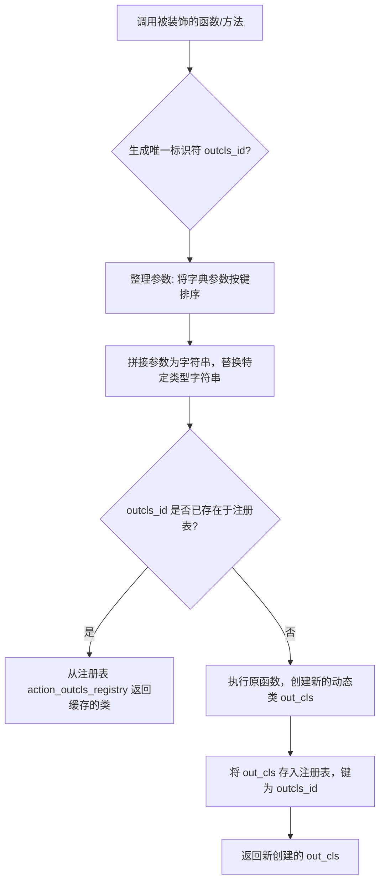
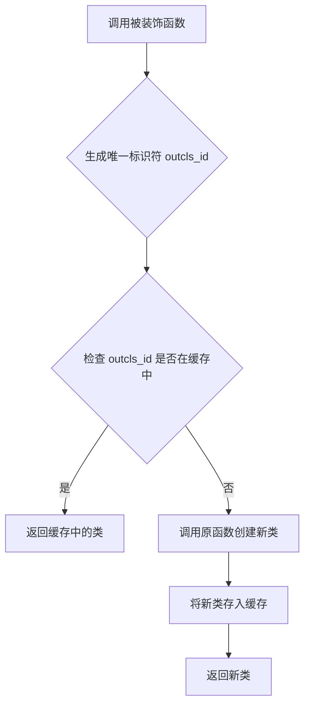

# `.\MetaGPT\metagpt\actions\action_outcls_registry.py` 详细设计文档

该代码实现了一个动态模型类的注册表机制，核心功能是通过装饰器 `register_action_outcls` 来缓存和复用由 `ActionNode.create_model_class` 方法动态生成的类。它通过生成唯一的类标识符（`outcls_id`）来确保相同类名和字段定义的动态类在系统中被视为同一个类，从而解决动态类创建导致的类身份不一致问题，并支持类比较。

## 整体流程



## 类结构

```
该文件不包含显式的类层次结构。
主要结构为：
1. 全局注册表变量: action_outcls_registry
2. 全局装饰器函数: register_action_outcls
```

## 全局变量及字段


### `action_outcls_registry`
    
全局注册表，用于存储由 ActionNode.create_model_class 创建的动态模型类，确保相同类名和字段定义的类在系统中被视为同一个类实例。

类型：`dict`
    


    

## 全局函数及方法

### `register_action_outcls`

`register_action_outcls` 是一个装饰器函数，用于注册和缓存由 `ActionNode.create_model_class` 生成的动态模型类。它通过生成一个唯一的标识符 `outcls_id` 来确保相同类名和字段定义的类在多次创建时返回同一个类实例，从而避免因动态创建导致类比较失败的问题。

参数：

- `func`：`Callable`，被装饰的函数，通常是 `ActionNode.create_model_class` 方法。

返回值：`Callable`，返回装饰后的函数，该函数会检查缓存中是否已存在相同标识符的类，存在则直接返回，不存在则调用原函数创建新类并缓存。

#### 流程图



#### 带注释源码

```python
def register_action_outcls(func):
    """
    Due to `create_model` return different Class even they have same class name and mapping.
    In order to do a comparison, use outcls_id to identify same Class with same class name and field definition
    """

    @wraps(func)
    def decorater(*args, **kwargs):
        """
        arr example
            [<class 'metagpt.actions.action_node.ActionNode'>, 'test', {'field': (str, Ellipsis)}]
        """
        # 将位置参数和关键字参数的值合并到一个列表中
        arr = list(args) + list(kwargs.values())
        """
        outcls_id example
            "<class 'metagpt.actions.action_node.ActionNode'>_test_{'field': (str, Ellipsis)}"
        """
        # 对列表中的字典项进行排序，确保相同字段定义的字典生成相同的字符串
        for idx, item in enumerate(arr):
            if isinstance(item, dict):
                arr[idx] = dict(sorted(item.items()))
        # 将列表中的所有项转换为字符串并用下划线连接，生成唯一标识符
        outcls_id = "_".join([str(i) for i in arr])
        # 消除 typing 模块的影响，确保相同类型定义生成相同的标识符
        outcls_id = outcls_id.replace("typing.List", "list").replace("typing.Dict", "dict")

        # 检查标识符是否已在缓存中，若存在则直接返回缓存的类
        if outcls_id in action_outcls_registry:
            return action_outcls_registry[outcls_id]

        # 若不存在，则调用原函数创建新类
        out_cls = func(*args, **kwargs)
        # 将新类存入缓存
        action_outcls_registry[outcls_id] = out_cls
        # 返回新类
        return out_cls

    return decorater
```

## 关键组件


### 注册表机制 (Registry Mechanism)

一个全局字典 (`action_outcls_registry`) 与装饰器 (`register_action_outcls`) 的组合，用于缓存和复用由 `ActionNode.create_model_class` 动态生成的类，确保相同类名和字段定义的动态类在系统中被视为同一个类，以支持类级别的比较和一致性维护。

### 动态类标识生成 (Dynamic Class Identity Generation)

通过将装饰器函数的参数（类名、字段定义等）序列化为一个标准化的字符串 (`outcls_id`)，作为动态类的唯一标识。该过程包括对字典参数进行排序以消除顺序影响，以及对特定类型注解进行规范化处理，确保相同语义的输入生成相同的标识符。

### 惰性加载与缓存 (Lazy Loading and Caching)

装饰器逻辑实现了惰性加载模式：当请求生成一个动态类时，首先检查其标识符是否已存在于注册表中。若存在，则直接返回缓存的类实例；若不存在，才执行原始函数生成新类，并将其存入注册表以供后续使用。这避免了重复创建相同动态类的开销。


## 问题及建议


### 已知问题

-   **潜在的线程安全问题**：`action_outcls_registry` 是一个全局字典，在多线程或多进程环境下并发调用 `register_action_outcls` 装饰器时，可能导致数据竞争，例如多个线程同时判断 `outcls_id` 不存在并创建新类，造成重复注册或覆盖。
-   **序列化键值可能不唯一**：`outcls_id` 的生成依赖于 `args` 和 `kwargs` 的字符串表示。如果参数中包含复杂对象（如自定义类实例），其 `__str__` 或 `__repr__` 方法可能无法提供足够唯一或稳定的标识，导致不同的输入生成相同的 `outcls_id`，引发错误的缓存返回。
-   **类型擦除可能引发冲突**：代码将 `"typing.List"` 和 `"typing.Dict"` 替换为 `"list"` 和 `"dict"`。如果原始类型参数中恰好包含这些字符串（例如作为字典的键或值），这种简单的文本替换会错误地修改它们，破坏 `outcls_id` 的准确性。
-   **内存泄漏风险**：注册表 `action_outcls_registry` 会永久保存所有生成的动态模型类引用，随着程序运行，如果动态类生成频繁且多样，可能导致内存占用持续增长，且无法被垃圾回收。

### 优化建议

-   **引入线程安全机制**：对 `action_outcls_registry` 的访问（检查与写入）应使用锁（如 `threading.Lock`）进行保护，确保在并发环境下的操作原子性。
-   **改进唯一标识生成算法**：建议使用更可靠的序列化方法生成 `outcls_id`，例如计算参数的哈希值（需确保参数可哈希），或使用 `json.dumps` 配合自定义序列化器处理特定类型，避免依赖不稳定的字符串表示。
-   **精确化类型处理**：避免使用简单的字符串替换来处理类型。可以设计一个专用的类型规范化函数，将 `typing` 模块中的类型映射到其对应的基础类型，或直接使用类型的 `__name__` 属性。
-   **实现缓存清理策略**：为 `action_outcls_registry` 引入缓存管理机制，例如设置最大条目数（LRU策略）、基于时间的过期清理，或提供手动清理特定条目的接口，以控制内存占用。
-   **增强装饰器的健壮性**：考虑对 `args` 和 `kwargs` 中的字典进行深度排序（如果嵌套了字典），并处理其他不可排序或不可序列化的参数类型，提供更明确的错误提示或回退方案。


## 其它


### 设计目标与约束

该代码的设计目标是提供一个装饰器机制，用于注册和缓存由 `ActionNode.create_model_class` 方法动态生成的Pydantic模型类。核心约束包括：1) 确保相同类名和字段定义的动态类在系统中被视为同一个类，以支持类级别的比较和识别；2) 通过缓存机制避免重复创建相同的类，提升性能；3) 处理动态类生成时因类型注解（如 `typing.List`, `typing.Dict`）的字符串表示差异导致的缓存键不一致问题。

### 错误处理与异常设计

当前代码未显式包含错误处理逻辑。潜在的异常场景包括：1) 装饰器应用于非预期函数时可能引发参数解析错误；2) 在构造 `outcls_id` 时，若参数包含不可序列化为字符串的对象（如自定义类实例），`str(i)` 操作可能产生非预期结果或异常。建议的改进是：在装饰器内部添加 `try-except` 块，捕获参数处理或函数执行中的异常，并记录日志或抛出更清晰的自定义异常，以增强鲁棒性。

### 数据流与状态机

1.  **数据流**：
    *   **输入**：被装饰的函数 `func` 及其调用参数 `args` 和 `kwargs`。
    *   **处理**：参数被序列化、排序（针对字典）并拼接成一个唯一的字符串标识符 `outcls_id`。此标识符用于查询全局注册表 `action_outcls_registry`。
    *   **输出/状态变更**：若 `outcls_id` 存在于注册表中，则直接返回缓存的类。否则，调用原函数 `func` 生成新类，将其存入注册表（键为 `outcls_id`），然后返回该类。
2.  **状态机**：系统状态主要体现在全局字典 `action_outcls_registry` 上。其状态转移很简单：初始为空 -> 根据 `outcls_id` 查询 -> 命中则状态不变，返回缓存值；未命中则执行函数，并将结果作为新键值对插入字典，改变状态。

### 外部依赖与接口契约

1.  **外部依赖**：
    *   `functools.wraps`: 用于保留被装饰函数的元数据。
    *   预期被装饰的函数（如 `ActionNode.create_model_class`）能接受特定参数并返回一个类对象。
    *   依赖Python内置的数据结构（`dict`, `list`, `str`）和类型检查（`isinstance`）。
2.  **接口契约**：
    *   **装饰器接口**：`register_action_outcls` 是一个装饰器工厂，返回一个装饰器函数。它不强制被装饰函数的签名，但期望其参数能通过 `str()` 合理转换。
    *   **注册表接口**：`action_outcls_registry` 是一个全局字典，作为简单的键值存储。键（`outcls_id`）是由被装饰函数参数生成的字符串，值是其返回的类对象。该注册表提供了隐式的、基于参数的类单例机制。

    