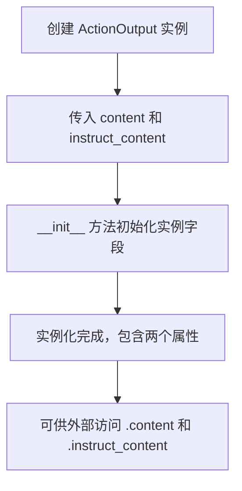
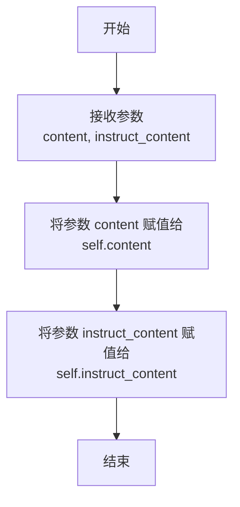

# `.\MetaGPT\metagpt\actions\action_output.py` 详细设计文档

该代码定义了一个名为 ActionOutput 的数据容器类，用于封装AI代理执行动作后的输出结果。它包含两个核心部分：一个原始文本内容（content）和一个结构化的指令内容（instruct_content），后者使用 Pydantic 的 BaseModel 来确保类型安全和数据验证。

## 整体流程



## 类结构

```
ActionOutput
├── 字段: content (str)
└── 字段: instruct_content (pydantic.BaseModel)
```

## 全局变量及字段


### `ActionOutput.content`
    
存储动作输出的原始文本内容，通常用于日志记录或直接展示。

类型：`str`
    


### `ActionOutput.instruct_content`
    
存储经过结构化解析后的指令内容，通常基于Pydantic模型，便于程序化处理。

类型：`BaseModel`
    
    

## 全局函数及方法

### `ActionOutput.__init__`

`ActionOutput` 类的构造函数，用于初始化一个 `ActionOutput` 实例。它接收两个参数：一个字符串内容和一个符合 Pydantic `BaseModel` 结构的指令内容对象，并将它们分别赋值给实例的对应属性。

参数：

- `content`：`str`，表示动作输出的原始文本内容。
- `instruct_content`：`BaseModel`，表示经过结构化解析后的指令内容，通常是一个 Pydantic 数据模型实例。

返回值：`None`，此方法不返回任何值，仅用于初始化对象。

#### 流程图



#### 带注释源码

```python
def __init__(self, content: str, instruct_content: BaseModel):
    # 将传入的字符串内容赋值给实例变量 self.content
    self.content = content
    # 将传入的 Pydantic BaseModel 对象赋值给实例变量 self.instruct_content
    self.instruct_content = instruct_content
```

## 关键组件


### ActionOutput 类

一个用于封装动作执行结果的数据容器类，包含原始文本内容和结构化指令内容。

### Pydantic BaseModel 集成

通过集成 Pydantic 的 BaseModel 来定义和验证 `instruct_content` 字段的结构化数据，确保数据类型的正确性和一致性。

### 数据封装模式

采用简单的数据封装模式，将相关的原始输出（`content`）和解析后的结构化数据（`instruct_content`）组合在一起，便于在系统中传递和处理动作的完整结果。


## 问题及建议


### 已知问题

-   **类型注解不完整**：`ActionOutput` 类定义中的 `content` 和 `instruct_content` 字段缺少了类型注解。在类定义顶层直接声明 `content: str` 和 `instruct_content: BaseModel` 并不会为实例属性创建类型注解，这可能导致 IDE 的静态类型检查工具（如 mypy）无法正确识别这些属性的类型，从而失去类型安全检查和自动补全的优势。
-   **潜在的 `None` 值处理**：构造函数强制要求传入 `instruct_content` 参数，但代码中并未明确处理其可能为 `None` 的情况。如果业务逻辑允许 `instruct_content` 为空，当前的构造函数设计不够灵活。
-   **缺少数据验证**：虽然 `instruct_content` 被声明为 `BaseModel` 类型，但构造函数本身并未对传入的 `instruct_content` 对象进行任何验证（例如，检查它是否是 `BaseModel` 的有效子类实例）。这可能导致运行时错误。
-   **可读性与维护性**：类的文档字符串（docstring）缺失，使得其他开发者难以快速理解该类的设计目的和职责。

### 优化建议

-   **使用 Pydantic 的 `BaseModel` 或 `dataclass`**：建议将 `ActionOutput` 类重构为继承自 `pydantic.BaseModel` 或使用 `@dataclass` 装饰器。这可以自动生成 `__init__` 方法，并提供完整的类型注解、数据验证、以及更友好的字符串表示（`__repr__`），从而解决类型注解和验证问题。
    ```python
    from pydantic import BaseModel as PydanticBaseModel

    class ActionOutput(PydanticBaseModel):
        content: str
        instruct_content: PydanticBaseModel
    ```
    或者
    ```python
    from dataclasses import dataclass
    from pydantic import BaseModel

    @dataclass
    class ActionOutput:
        content: str
        instruct_content: BaseModel
    ```
-   **使 `instruct_content` 可选**：如果业务场景允许，可以考虑将 `instruct_content` 字段设为可选（`Optional[BaseModel]`），并在构造函数或字段定义中提供默认值（如 `None`）。这可以提高类的灵活性。
    ```python
    from typing import Optional
    from pydantic import BaseModel as PydanticBaseModel

    class ActionOutput(PydanticBaseModel):
        content: str
        instruct_content: Optional[PydanticBaseModel] = None
    ```
-   **添加文档字符串**：为类添加清晰的文档字符串，说明其用途、字段含义以及使用示例，这将极大提升代码的可读性和可维护性。
-   **考虑不变性**：如果 `ActionOutput` 对象在创建后不应被修改，可以考虑使用 `frozen=True` 参数（对于 `dataclass`）或将字段设为只读属性，以确保数据的一致性。


## 其它


### 设计目标与约束

该代码旨在定义一个通用的动作输出数据结构，用于封装AI Agent在执行动作后产生的自然语言描述和结构化指令内容。其核心设计目标是提供类型安全、结构清晰的数据容器，便于在复杂系统中传递和解析动作结果。主要约束包括：必须使用Pydantic的BaseModel作为结构化内容的基类以利用其数据验证和序列化能力；需保持类的轻量级，避免引入不必要的依赖或复杂逻辑。

### 错误处理与异常设计

当前代码未显式定义错误处理机制。初始化方法`__init__`依赖于Python解释器对参数类型和数量的基础检查。潜在风险包括：传入的`instruct_content`参数可能不是有效的`BaseModel`子类实例，这可能导致后续使用该字段的方法（如序列化）失败。建议在`__init__`方法或通过Pydantic验证器（若将`ActionOutput`自身也改为继承`BaseModel`）中添加类型检查，并在不符合时抛出`TypeError`或`ValueError`等明确的异常。

### 数据流与状态机

`ActionOutput`类是一个不可变的数据持有者（Immutable Data Holder）。其实例通常在AI Agent的动作执行逻辑中创建，随后作为结果传递给下游的决策逻辑、日志记录器或序列化模块。数据流是单向的：创建后，其`content`和`instruct_content`字段内容在生命周期内应保持不变。该类本身不管理状态变迁，也不构成状态机的一部分，而是作为状态机中某个状态（如“动作完成”）的输出载体。

### 外部依赖与接口契约

1.  **外部依赖**：
    *   `pydantic.BaseModel`：核心依赖，用于定义和验证`instruct_content`字段的类型。这要求运行环境必须安装`pydantic`库。
2.  **接口契约**：
    *   **生产者契约**：任何创建`ActionOutput`实例的代码（如动作执行器）必须提供`str`类型的`content`和`BaseModel`子类实例的`instruct_content`。
    *   **消费者契约**：任何使用`ActionOutput`实例的代码可以安全地访问其`content`（字符串操作）和`instruct_content`（可调用Pydantic模型的方法，如`.dict()`、`.json()`），并应假设这些内容在创建后是有效的。

### 配置与参数化

该类本身没有可配置的静态参数或从外部文件加载的配置。其行为完全由初始化时传入的参数决定。若未来需要支持不同的序列化格式或验证规则，可以考虑将相关选项（如是否严格验证`instruct_content`）作为可选的初始化参数。

### 安全考虑

1.  **输入验证**：当前缺乏对`instruct_content`的运行时类型强校验，恶意或错误的代码可能传入非`BaseModel`对象，导致依赖该字段的下游组件出现意外行为或安全漏洞（例如，如果下游代码调用了`.dict()`方法）。
2.  **信息暴露**：`content`字段可能包含敏感信息（如内部指令、用户数据）。在日志记录或对外传输`ActionOutput`实例时，应有明确的过滤或脱敏机制，这部分责任不在本类内，但使用者需注意。
3.  **反序列化安全**：如果`instruct_content`是通过反序列化（如`parse_raw`）生成的，需确保反序列化过程安全，防止注入攻击。这属于`BaseModel`使用方的责任。

### 测试策略

1.  **单元测试**：
    *   **初始化测试**：验证使用合法参数（正确的字符串和`BaseModel`实例）能成功创建对象。
    *   **类型错误测试**：验证传入错误类型的参数（如`instruct_content`传入字典而非`BaseModel`实例）会引发预期的异常（当前应增强代码以支持此测试）。
    *   **属性访问测试**：验证创建后能正确读取`content`和`instruct_content`属性。
    *   **不可变性测试**：验证实例创建后，其字段不应被修改（尽管当前Python代码在技术上允许修改，但应测试其设计意图的不可变性，或将其改为使用`@property`或`frozen`配置）。
2.  **集成测试**：在完整的Agent动作执行流程中，测试`ActionOutput`实例能否被正确生成、传递并被下游组件（如决策引擎、日志模块）正确消费和解析。

### 部署与运维

该类作为基础库的一部分部署，无独立的部署要求。运维关注点在于：
1.  **版本兼容性**：确保部署环境中的`pydantic`库版本与代码兼容。
2.  **监控与日志**：在生成`ActionOutput`的关键路径上添加监控点，记录其创建频率、`content`长度、`instruct_content`类型等指标，有助于诊断Agent行为。`content`字段的内容在记录日志时可能需要截断或脱敏。

### 扩展性与维护性

1.  **扩展性**：
    *   易于添加新字段（如`timestamp`、`action_type`），但需评估是否会破坏现有使用者的兼容性。
    *   可考虑将此类改为也继承`pydantic.BaseModel`，从而自动获得更强大的数据验证、序列化/反序列化以及配置管理（如`frozen=True`）能力。
2.  **维护性**：
    *   代码结构简单，职责单一，易于理解和维护。
    *   缺乏文档字符串（docstring），建议为类和`__init__`方法添加，说明其目的、参数和返回值。
    *   考虑使用`@dataclass`装饰器（Python 3.7+）或Pydantic模型来简化`__init__`方法的样板代码。

    