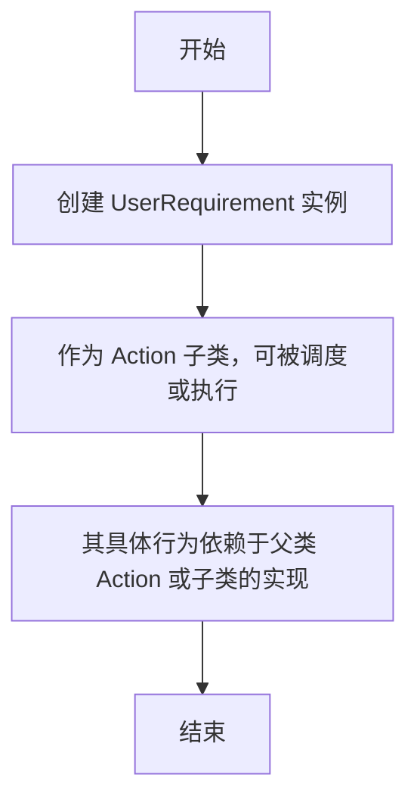

# `.\MetaGPT\metagpt\actions\add_requirement.py` 详细设计文档

该文件定义了一个名为 `UserRequirement` 的类，该类继承自 `Action`。其核心功能是作为一个占位符或抽象概念，用于表示来自用户的、尚未包含任何具体实现细节的需求。这通常用于工作流或对话系统的早期阶段，以捕获和传递用户意图。

## 整体流程



## 类结构

```
Action (基类，来自 metagpt.actions)
└── UserRequirement (用户需求占位符类)
```

## 全局变量及字段


    

## 全局函数及方法


## 关键组件


### Action 基类

提供所有动作（Action）的通用基类，定义了动作执行的基本接口和结构。

### UserRequirement 类

一个具体的动作类，用于表示用户需求，目前不包含具体的实现细节，主要用于占位或作为需求收集的起点。


## 问题及建议


### 已知问题

-   **类功能不完整**：`UserRequirement` 类目前仅作为 `Action` 基类的空壳子存在，没有实现任何具体的功能逻辑（如 `run` 方法）。这违反了面向对象设计中的“里氏替换原则”，因为子类无法替换父类完成其预期的“行动”职责。
-   **缺乏具体上下文**：代码片段过于简短，缺少该类的使用场景、如何被调用以及它处理什么数据等信息，这使得评估其设计完整性和合理性变得困难。
-   **文档字符串过于简单**：当前的文档字符串 `"""User Requirement without any implementation details"""` 仅说明了现状，但没有说明这个类的设计目的、它在系统中的作用以及未来预期的行为。

### 优化建议

-   **实现核心方法**：应重写或实现 `Action` 基类中定义的核心方法（最可能是 `run` 方法），使其能够执行具体的“解析用户需求”或“格式化用户需求”等逻辑，即使初始实现很简单。这能使该类变得可用。
-   **明确职责与契约**：在类文档字符串中，明确说明 `UserRequirement` 类的职责，例如“负责从原始输入中提取和结构化用户需求，并将其转换为产品需求文档（PRD）可用的格式”。同时，应通过方法签名和类型注解明确其输入输出的数据契约。
-   **考虑设计模式**：评估是否真的需要一个独立的 `UserRequirement` 类。如果它的行为非常固定且简单，或许可以只是一个函数。如果需要封装状态或复杂行为，则应完善其内部状态（字段）和行为（方法）。如果它只是多种需求处理方式的一种，可以考虑使用策略模式。
-   **补充单元测试**：一旦实现了具体逻辑，必须为其编写单元测试，以确保功能正确性，并作为未来重构的安全网。
-   **集成到上下文中**：在项目的更大范围内，说明这个类如何被初始化、调用，以及它的输出如何被下游组件（如生成PRD的Action）使用。这有助于发现接口设计上的问题。


## 其它


### 设计目标与约束

该代码旨在定义一个名为 `UserRequirement` 的类，该类继承自 `Action` 基类。其核心设计目标是创建一个表示“用户需求”的抽象动作，该动作目前不包含任何具体的实现细节，主要用于在系统中占位或作为后续具体需求分析动作的父类。主要约束包括：必须继承自 `metagpt.actions.Action` 基类以遵循框架的约定；当前版本仅为骨架，不执行任何实际操作。

### 错误处理与异常设计

当前代码未包含任何显式的错误处理或异常抛出逻辑。作为基类或抽象占位符，它依赖于其父类 `Action` 可能定义的错误处理机制。任何实例化或使用此类时产生的错误（例如，如果父类 `Action` 的初始化需要特定参数而未被满足）将直接向上层抛出Python标准异常。

### 数据流与状态机

由于该类目前没有实现任何方法（包括关键的 `run` 方法），因此不存在内部的数据处理流程或状态转换。它预期作为后续具体动作类的模板，具体的数据输入、处理和输出流程将在子类中定义。当前类本身不参与任何状态机。

### 外部依赖与接口契约

1.  **外部依赖**：
    *   `metagpt.actions.Action`：这是唯一的直接外部依赖，`UserRequirement` 通过继承与其紧密耦合。这要求 `Action` 类必须存在且可导入。
2.  **接口契约**：
    *   **继承契约**：`UserRequirement` 承诺是 `Action` 的一个子类型，应遵循 `Action` 基类定义的公共接口（尽管当前未重写任何方法）。
    *   **框架契约**：在MetaGPT框架中，`Action` 的子类通常需要实现一个 `run` 方法来执行具体逻辑。`UserRequirement` 当前未实现此方法，这暗示它可能是一个抽象基类或需要子类化后才能使用。

### 安全考虑

当前代码极其简单，不涉及网络操作、文件I/O、用户输入处理或敏感数据操作，因此无明显安全风险。安全性的考虑将完全取决于其父类 `Action` 的实现以及未来可能添加的子类实现。

### 测试策略

1.  **单元测试**：应测试 `UserRequirement` 类能否被正确实例化（即 `UserRequirement()` 不会抛出异常）。
2.  **继承测试**：验证 `UserRequirement` 确实是 `Action` 的子类（`assert issubclass(UserRequirement, Action)`）。
3.  **文档字符串测试**：确保类文档字符串存在且内容符合预期。
4.  **未来子类的测试**：当创建 `UserRequirement` 的具体子类并实现 `run` 等方法时，需要针对子类的具体功能进行测试。

### 部署与运维考虑

该类作为框架核心组件的一部分进行打包和分发。部署时需确保其依赖的 `metagpt` 包正确安装。由于没有持久化状态或外部服务依赖，无需特殊的运维操作。其版本管理与所在的 `metagpt` 包版本同步。

### 扩展性与维护性

1.  **扩展性**：该类设计具有良好的扩展性。通过继承 `UserRequirement` 并实现具体方法（尤其是 `run`），可以轻松创建处理特定类型用户需求的动作。
2.  **维护性**：代码结构简单、清晰，符合单一职责原则（当前仅表示一个概念）。文档字符串提供了基本描述。维护成本低，主要维护点在于当父类 `Action` 发生不兼容变更时需要相应调整。

    