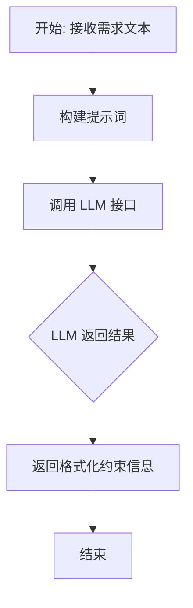

# `.\MetaGPT\metagpt\actions\analyze_requirements.py` 详细设计文档

该代码定义了一个名为 `AnalyzeRequirementsRestrictions` 的 `Action` 类，其核心功能是分析用户输入的软件需求文本，通过一个结构化的提示词模板调用大语言模型（LLM），自动提取并格式化输出需求中的关键约束信息，包括用户限制、语言限制和编程语言要求。

## 整体流程



## 类结构

```
Action (基类，来自 metagpt.actions)
└── AnalyzeRequirementsRestrictions
```

## 全局变量及字段


### `ANALYZE_REQUIREMENTS`
    
一个用于格式化分析需求提示词的多行字符串模板，包含示例、需求、指令和输出格式的占位符。

类型：`str`
    


### `EXAMPLES`
    
一个包含多个需求分析示例的多行字符串，用于指导模型如何解析用户需求中的限制条件、语言和编程语言。

类型：`str`
    


### `INSTRUCTIONS`
    
一个包含详细指令的多行字符串，指导模型如何分析需求：确定响应语言、提取用户限制、以及确定编程语言。

类型：`str`
    


### `OUTPUT_FORMAT`
    
一个定义了最终输出格式的多行字符串模板，包含用户限制、语言限制和编程语言三个部分。

类型：`str`
    


### `AnalyzeRequirementsRestrictions.name`
    
Action 的名称，用于标识该动作，在此类中被固定为 'AnalyzeRequirementsRestrictions'。

类型：`str`
    
    

## 全局函数及方法


### `AnalyzeRequirementsRestrictions.run`

该方法是一个异步方法，用于分析用户需求中的约束条件、响应语言以及编程语言要求。它通过构造一个包含示例、需求、指令和输出格式的提示词模板，调用大语言模型（LLM）来解析需求，并返回结构化的分析结果。

参数：

-  `requirements`：`str`，用户提供的原始需求文本。
-  `isinstance`：`str`，默认为`INSTRUCTIONS`常量，用于指导LLM如何分析需求的指令文本。
-  `output_format`：`str`，默认为`OUTPUT_FORMAT`常量，指定LLM输出结果应遵循的格式模板。

返回值：`str`，返回LLM根据指令和格式要求生成的、包含`[User Restrictions]`、`[Language Restrictions]`和`[Programming Language]`三个部分的文本分析结果。

#### 流程图

```mermaid
flowchart TD
    A[开始: run(requirements, isinstance, output_format)] --> B[构造提示词 prompt]
    B --> C[异步调用 LLM: self.llm.aask(prompt)]
    C --> D[获取 LLM 的文本响应 rsp]
    D --> E[返回 rsp]
    E --> F[结束]
```

#### 带注释源码

```python
async def run(self, requirements, isinstance=INSTRUCTIONS, output_format=OUTPUT_FORMAT):
    """Analyze the constraints and the language used in the requirements."""
    # 1. 使用类中定义的模板字符串 ANALYZE_REQUIREMENTS，并传入参数进行格式化。
    #    这将生成一个包含示例、具体需求、分析指令和期望输出格式的完整提示词。
    prompt = ANALYZE_REQUIREMENTS.format(
        examples=EXAMPLES, requirements=requirements, instructions=isinstance, output_format=output_format
    )
    # 2. 异步调用父类 Action 中定义的 LLM 客户端 (self.llm) 的 aask 方法，
    #    将构造好的提示词发送给大语言模型进行处理。
    rsp = await self.llm.aask(prompt)
    # 3. 返回大语言模型生成的、符合 OUTPUT_FORMAT 格式的文本响应。
    return rsp
```


## 关键组件


### 模板字符串 (Template Strings)

定义了用于构建LLM提示词（prompt）的固定格式字符串，包括示例、指令和输出格式，是驱动`AnalyzeRequirementsRestrictions`动作的核心配置。

### 动作类 (Action Class)

`AnalyzeRequirementsRestrictions`类继承自`Action`基类，封装了分析用户需求、提取限制条件和编程语言的核心业务逻辑，是代码的主要执行单元。

### 提示词构建与执行流程 (Prompt Construction and Execution Flow)

通过`run`方法将用户需求、指令和输出格式模板动态组合成完整的提示词，并调用底层LLM（大语言模型）接口进行异步处理，最终返回LLM的响应结果。


## 问题及建议


### 已知问题

-   **硬编码的提示词模板**：`ANALYZE_REQUIREMENTS`、`EXAMPLES`、`INSTRUCTIONS`、`OUTPUT_FORMAT` 等模板字符串直接硬编码在模块中。这使得模板难以维护、复用和根据具体场景进行定制或国际化。
-   **脆弱的语言检测逻辑**：`INSTRUCTIONS` 中的语言检测规则过于简单（“You must output in the same language as the Requirements”），仅依赖需求描述的语言。对于复杂或混合语言的需求，或者当需求描述本身不明确时，此规则可能导致错误的语言判断。
-   **指令参数默认值覆盖**：`run` 方法的参数 `isinstance` 默认值为 `INSTRUCTIONS`，但参数名 `isinstance` 与 Python 内置函数 `isinstance` 同名，这可能导致混淆或潜在的遮蔽问题。同时，将指令模板作为参数传递，但默认值固定，削弱了灵活性。
-   **输出格式的静态语言占位符**：`OUTPUT_FORMAT` 模板中包含 `{{language}}` 占位符，但生成最终提示词（`prompt`）时，并未用实际检测到的语言替换此占位符。这导致发送给大语言模型（LLM）的提示词中包含未解析的模板语法，可能影响模型理解和生成正确的输出格式。
-   **异常处理缺失**：`run` 方法直接调用 `self.llm.aask(prompt)`，没有对可能发生的异常（如网络错误、LLM API 错误、提示词格式错误导致的解析失败等）进行捕获和处理，代码健壮性不足。
-   **结果解析依赖 LLM**：该 Action 的输出（`rsp`）是 LLM 返回的原始文本字符串。调用方需要自行解析这个字符串以提取 `[User Restrictions]`、`[Language Restrictions]` 和 `[Programming Language]` 等结构化信息。这种设计增加了调用方的复杂度和出错风险，因为 LLM 的输出可能不符合严格的格式要求。

### 优化建议

-   **将提示词模板外部化**：将 `ANALYZE_REQUIREMENTS`、`EXAMPLES`、`INSTRUCTIONS`、`OUTPUT_FORMAT` 等模板移至配置文件（如 YAML、JSON）或数据库中。这样可以实现动态加载、环境差异化配置和更便捷的版本管理。
-   **增强语言检测机制**：实现一个更健壮的语言检测函数，可以结合需求文本分析、明确的用户指令（如“请用中文回复”）以及配置的默认语言。可以考虑使用轻量级的语言检测库（如 `langdetect`）作为辅助。
-   **重构 `run` 方法参数**：将参数 `isinstance` 重命名为更具描述性的名称，如 `instructions_template`，以避免与内置函数冲突。同时，考虑移除默认值，强制调用方显式提供或从配置中加载，以提升灵活性。
-   **在生成提示词前解析输出格式**：在调用 `ANALYZE_REQUIREMENTS.format(...)` 之前，应先根据需求内容确定目标语言，然后用实际语言字符串替换 `OUTPUT_FORMAT` 中的 `{{language}}` 占位符，确保发送给 LLM 的提示词是完整且正确的。
-   **增加异常处理与日志记录**：在 `run` 方法中使用 `try-except` 块捕获可能出现的异常，并记录详细的错误日志（包括输入的需求、生成的提示词等）。可以定义自定义异常类来更清晰地表示不同类型的错误（如 `PromptGenerationError`、`LLMServiceError`）。
-   **结构化输出结果**：修改 `run` 方法，使其在获取 LLM 的原始响应后，自动解析响应文本，提取关键字段，并返回一个结构化的对象（如 Pydantic 模型或字典），而不是原始字符串。这可以显著提升 Action 的易用性和可靠性。解析失败时应抛出明确的异常。
-   **考虑添加输入验证**：在 `run` 方法开始处，对输入的 `requirements` 参数进行基本的验证（如非空检查、类型检查、长度限制等），防止无效输入进入后续处理流程。


## 其它


### 设计目标与约束

本模块的核心设计目标是解析用户输入的、非结构化的需求文本，并从中提取出关键的约束信息，包括用户指定的限制（如“不要写PRD”）、输出语言要求以及编程语言要求。其设计约束包括：
1.  **输入非结构化**：输入是自由文本，格式和内容多变。
2.  **输出高度结构化**：必须严格按照预定义的 `OUTPUT_FORMAT` 格式输出，以便下游流程（如代码生成、文档生成）能够解析和使用。
3.  **依赖LLM进行语义理解**：核心的解析逻辑依赖于大型语言模型（LLM）对自然语言指令的理解能力，而非硬编码的规则。
4.  **上下文学习（Few-shot Learning）**：通过 `EXAMPLES` 提供少量示例，引导LLM理解任务并遵循输出格式。

### 错误处理与异常设计

当前代码中显式的错误处理机制较为薄弱：
1.  **LLM调用异常**：`self.llm.aask(prompt)` 调用可能因网络问题、API配额耗尽、模型服务异常等原因失败，但未进行捕获和处理。这可能导致整个流程因单点故障而中断。
2.  **LLM输出格式异常**：LLM的响应（`rsp`）可能不严格遵循要求的 `OUTPUT_FORMAT` 格式（例如，缺少某个字段、格式错乱、包含额外文本）。当前代码直接将原始响应返回，将格式验证和错误恢复的责任推给了调用方。
3.  **输入验证缺失**：`run` 方法未对 `requirements` 参数进行有效性检查（如空值、非字符串类型）。

### 数据流与状态机

本模块的数据流是线性的、无状态的：
1.  **输入**：用户需求字符串 (`requirements`)。
2.  **处理**：
    a. 将常量模板 (`ANALYZE_REQUIREMENTS`)、示例 (`EXAMPLES`)、指令 (`INSTRUCTIONS`)、输出格式 (`OUTPUT_FORMAT`) 与输入的需求拼接，生成最终的提示词 (`prompt`)。
    b. 将 `prompt` 发送给LLM服务。
    c. 接收LLM的文本响应 (`rsp`)。
3.  **输出**：LLM返回的文本响应 (`rsp`)。
该过程不涉及内部状态维护，每次调用都是独立的。

### 外部依赖与接口契约

1.  **外部依赖**：
    *   **MetaGPT框架**：继承自 `metagpt.actions.Action` 类，依赖于其定义的 `run` 方法接口和可能的 `llm` 属性。
    *   **LLM服务**：通过 `self.llm.aask` 方法调用，这是对底层LLM（如OpenAI GPT、Claude等）的抽象。模块的功能和质量高度依赖于所选LLM的理解和遵循指令的能力。
2.  **接口契约**：
    *   **输入契约**：`run` 方法期望一个字符串类型的 `requirements` 参数。`isinstance` 和 `output_format` 参数提供了覆盖默认指令和格式的灵活性，但通常使用默认值。
    *   **输出契约**：`run` 方法返回一个字符串，承诺其内容将尽力遵循 `OUTPUT_FORMAT` 所描述的格式，但无法保证100%合规。调用方需要具备一定的容错解析能力。

### 配置与常量管理

模块的行为由一组硬编码的字符串常量控制：
*   `ANALYZE_REQUIREMENTS`: 主提示词模板。
*   `EXAMPLES`: 提供给LLM的示例，用于演示任务。
*   `INSTRUCTIONS`: 指导LLM如何执行解析的核心逻辑指令。
*   `OUTPUT_FORMAT`: 定义LLM必须遵循的输出格式。
这些常量直接嵌入在源代码中。优点是简单明了，缺点是缺乏灵活性。若要修改提示词、示例或输出格式，必须修改源代码并重新部署。

### 测试策略建议

1.  **单元测试**：
    *   **提示词构建**：测试 `run` 方法是否正确地将输入参数和常量拼接成预期的 `prompt` 字符串。
    *   **边界条件**：测试空需求、超长需求、包含特殊字符的需求等。
2.  **集成测试**：
    *   **模拟LLM**：使用Mock对象模拟 `self.llm.aask` 的响应，测试 `run` 方法是否能正确处理格式正确及格式错误的LLM响应。
3.  **端到端测试**：
    *   使用真实的LLM服务（或测试环境的LLM），输入一系列代表性的需求，验证返回的字符串是否能被下游模块成功解析。这有助于评估和优化提示词 (`EXAMPLES`, `INSTRUCTIONS`) 的有效性。

    