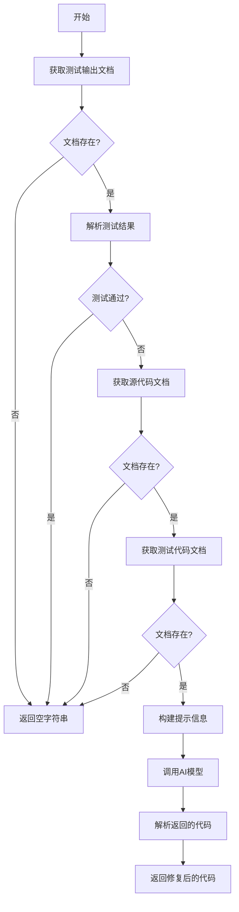

# `.\MetaGPT\metagpt\actions\debug_error.py` 详细设计文档

该代码实现了一个名为DebugError的Action类，其核心功能是分析单元测试失败后的控制台日志、原始代码和测试代码，通过调用大语言模型（LLM）生成修复后的代码，以解决测试中发现的问题。

## 整体流程

```mermaid
graph TD
    A[开始: 执行DebugError.run()] --> B{检查测试输出文件是否存在?}
    B -- 否 --> C[返回空字符串]
    B -- 是 --> D[加载测试输出结果RunCodeResult]
    E{正则匹配测试是否通过?}
    E -- 是 --> F[返回空字符串]
    E -- 否 --> G[从仓库获取原始代码和测试代码]
    G --> H[使用PROMPT_TEMPLATE格式化提示词]
    H --> I[调用_aask方法请求LLM生成修复代码]
    I --> J[使用CodeParser解析LLM返回的代码]
    J --> K[返回解析后的修复代码]
```

## 类结构

```
Action (基类)
└── DebugError
```

## 全局变量及字段


### `PROMPT_TEMPLATE`
    
用于生成调试错误修复提示的模板字符串，包含代码、测试代码和控制台日志的占位符

类型：`str`
    


### `DebugError.i_context`
    
存储代码运行上下文信息的对象，包含代码文件名、测试文件名和输出文件名等

类型：`RunCodeContext`
    


### `DebugError.repo`
    
项目仓库对象，用于访问源代码、测试代码和输出文档，默认为None且从序列化中排除

类型：`Optional[ProjectRepo]`
    


### `DebugError.input_args`
    
输入参数对象，用于接收额外的运行参数，默认为None且从序列化中排除

类型：`Optional[BaseModel]`
    
    

## 全局函数及方法

### `DebugError.run`

该方法用于调试和重写代码。当单元测试失败时，它会读取相关的代码、测试代码和测试输出日志，生成一个提示信息，调用AI模型来分析和修复代码中的错误，并返回修复后的代码。

参数：

- `*args`：`tuple`，可变位置参数，当前未使用。
- `**kwargs`：`dict`，可变关键字参数，当前未使用。

返回值：`str`，修复后的代码字符串。如果测试通过或无法获取必要的输入文件，则返回空字符串。

#### 流程图



#### 带注释源码

```python
async def run(self, *args, **kwargs) -> str:
    # 从项目仓库中获取测试输出文档
    output_doc = await self.repo.test_outputs.get(filename=self.i_context.output_filename)
    # 如果测试输出文档不存在，直接返回空字符串
    if not output_doc:
        return ""
    # 加载测试输出结果
    output_detail = RunCodeResult.loads(output_doc.content)
    # 定义正则表达式模式，用于匹配测试成功的输出
    pattern = r"Ran (\d+) tests in ([\d.]+)s\n\nOK"
    matches = re.search(pattern, output_detail.stderr)
    # 如果测试成功（匹配到模式），直接返回空字符串，无需调试
    if matches:
        return ""

    # 记录调试和重写操作的日志
    logger.info(f"Debug and rewrite {self.i_context.test_filename}")
    # 获取源代码文档
    code_doc = await self.repo.srcs.get(filename=self.i_context.code_filename)
    # 如果源代码文档不存在，返回空字符串
    if not code_doc:
        return ""
    # 获取测试代码文档
    test_doc = await self.repo.tests.get(filename=self.i_context.test_filename)
    # 如果测试代码文档不存在，返回空字符串
    if not test_doc:
        return ""
    # 使用模板构建提示信息，包含源代码、测试代码和测试输出日志
    prompt = PROMPT_TEMPLATE.format(code=code_doc.content, test_code=test_doc.content, logs=output_detail.stderr)

    # 调用AI模型，获取修复建议
    rsp = await self._aask(prompt)
    # 从AI模型的响应中解析出代码部分
    code = CodeParser.parse_code(text=rsp)

    # 返回修复后的代码
    return code
```

## 关键组件


### 代码调试与修复流程

该组件实现了基于单元测试失败日志的自动化代码调试与修复流程。它通过分析测试执行结果、原始代码和测试代码，生成修复后的代码版本。

### 上下文驱动的提示工程

该组件利用结构化的提示模板，将调试上下文（遗留代码、单元测试代码、控制台日志）清晰地组织并传递给大语言模型，以指导其进行准确的代码修复。

### 基于正则表达式的测试结果分析

该组件使用正则表达式模式匹配来快速判断单元测试是否全部通过，从而决定是否需要触发调试修复流程。

### 项目仓库文档交互

该组件通过与项目仓库（ProjectRepo）的文档系统交互，动态获取源代码、测试代码以及测试输出日志，实现了与项目文件系统的解耦和灵活的数据存取。


## 问题及建议


### 已知问题

-   **正则表达式匹配不严谨**：`DebugError.run` 方法中用于判断测试是否成功的正则表达式 `pattern = r"Ran (\d+) tests in ([\d.]+)s\n\nOK"` 过于严格。它要求标准错误输出 (`stderr`) 的结尾必须是 `\n\nOK`。然而，测试框架（如 `pytest` 或 `unittest`）的输出格式可能因版本或配置而异（例如，可能包含额外的空格、换行符或不同的成功标识符），这可能导致误判测试失败，从而触发不必要的调试流程。
-   **错误处理不充分**：当无法从 `repo` 中获取 `output_doc`、`code_doc` 或 `test_doc` 时，方法直接返回空字符串 `""`。这虽然避免了程序崩溃，但丢失了错误上下文，使得调用方难以诊断是代码本身无问题，还是因为数据获取失败而提前退出。这属于静默失败，不利于调试和系统监控。
-   **潜在的循环调用风险**：`DebugError` 类的设计目的是根据测试失败日志重写代码。如果重写后的代码逻辑仍有问题，导致测试再次失败，可能会形成一个“重写-测试-失败-重写”的无限循环。当前逻辑中没有设置重试次数上限或循环检测机制，存在陷入死循环的风险。
-   **依赖外部提示模板的脆弱性**：核心逻辑严重依赖硬编码的 `PROMPT_TEMPLATE`。如果模板的格式或内容要求发生变化（例如，`##` 分隔符的规则），或者大语言模型 (`_aask` 方法背后) 未能严格按照模板格式响应，`CodeParser.parse_code` 可能无法正确解析出代码，导致整个操作失败。
-   **字段默认值可能引发问题**：`repo` 和 `input_args` 字段被设置为 `Optional` 且默认值为 `None`，并在 `Field` 中标记了 `exclude=True`。虽然这可能在序列化时有用，但在 `run` 方法中直接使用了 `self.repo`。如果实例化时未正确提供 `repo`，`run` 方法中的 `self.repo.test_outputs.get` 调用将导致 `AttributeError`。

### 优化建议

-   **增强测试成功判断的鲁棒性**：建议采用更宽松或更全面的方式来判断测试结果。例如，可以检查 `stderr` 中是否包含 `"OK"` 或 `"PASSED"` 等成功关键字，并且不包含 `"FAILED"`、`"ERROR"` 或 `"AssertionError"` 等失败关键字。或者，直接解析测试框架返回的退出码（如果可用）。
-   **改进错误处理与日志记录**：在获取文档失败时，除了返回空字符串，还应记录清晰的警告或错误日志，说明是哪个文件获取失败。考虑定义一个特定的异常或返回一个包含错误状态和原因的结果对象，而不是简单的空字符串，以便上游逻辑能做出更明智的决策。
-   **引入循环防护机制**：在类内部或调用该 `Action` 的流程中，应设置一个最大重试次数（例如，3次）。每次调用 `run` 方法并尝试重写后，计数器增加。当达到最大次数时，停止重试并上报最终的错误结果，防止无限循环。
-   **将提示模板配置化**：将 `PROMPT_TEMPLATE` 从代码中提取出来，作为配置文件或环境变量进行管理。这样可以在不修改代码的情况下调整提示词，便于进行 A/B 测试或适应不同模型的需求。同时，可以增加对模型响应格式的验证逻辑，提高系统的健壮性。
-   **明确依赖注入与验证**：移除 `repo` 和 `input_args` 字段的 `Optional` 类型提示和 `None` 默认值，或者在 `run` 方法的开始处添加断言 (`assert self.repo is not None`)，以确保关键依赖在运行时可用。这遵循了“快速失败”原则，有助于在开发早期发现问题。
-   **考虑异步 I/O 优化**：`run` 方法中连续调用了多个 `await self.repo.xxx.get(...)`，这些是潜在的 I/O 操作。如果它们之间没有依赖关系，可以考虑使用 `asyncio.gather` 并发执行，以减少总体等待时间。
-   **补充单元测试**：为 `DebugError` 类编写单元测试，覆盖测试成功/失败的不同场景、文档获取失败的情况、以及大语言模型返回不同格式响应时的解析逻辑。这有助于确保代码修改不会引入回归错误，并验证优化措施的有效性。


## 其它


### 设计目标与约束

本模块的核心设计目标是提供一个自动化的代码调试与修复机制，旨在根据单元测试的执行结果（特别是失败或错误的控制台日志）来分析和修正源代码或测试代码。其核心约束包括：
1. **角色驱动**：系统需根据上下文（遗留代码、测试代码、日志）自动判断执行者是开发工程师还是测试工程师，并据此决定修改目标（源代码或测试代码）。
2. **单文件修改**：每次修复操作应尽可能将修改内容集中在一个文件内，以简化变更管理和代码审查。
3. **上下文感知**：修复过程必须综合考虑原始代码、对应的测试用例以及测试运行时的详细错误日志。
4. **集成性**：作为`Action`子类，需无缝集成到更大的智能体工作流中，接收`RunCodeContext`作为输入，并输出修复后的代码字符串。

### 错误处理与异常设计

模块的错误处理策略主要围绕输入数据的有效性和边界情况：
1. **输入验证**：在`run`方法中，通过检查`output_doc`、`code_doc`、`test_doc`是否存在来验证输入文件的完整性。若任一文件缺失，则静默返回空字符串，表示无需或无法进行调试。
2. **成功条件判断**：通过正则表达式匹配测试运行日志中的成功模式（如“Ran X tests in Ys\n\nOK”）。若匹配成功，则认为测试通过，无需修复，直接返回空字符串。
3. **静默失败**：对于文件缺失、测试成功等非错误状态，采用返回空字符串而非抛出异常的策略，使上游调用者能够灵活处理（例如，视为无需进一步操作）。
4. **潜在异常**：`_aask`方法（继承自父类`Action`）可能在与LLM交互时抛出网络或API异常。这些异常未在本模块内捕获，将向上传播，由工作流或调用方统一处理。

### 数据流与状态机

模块的数据流清晰，状态转换简单：
1. **输入触发**：`run`方法被调用，传入`RunCodeContext`（通过`i_context`字段预置），其中包含`code_filename`、`test_filename`、`output_filename`等关键信息。
2. **数据加载**：从`ProjectRepo`中按文件名加载三个核心文档：源代码(`srcs`)、测试代码(`tests`)、测试输出(`test_outputs`)。
3. **状态判断**：解析测试输出日志。若日志表明测试成功，流程终止，返回空字符串。若失败，则进入修复流程。
4. **问题分析与修复生成**：将代码、测试代码和错误日志组合成提示词(`PROMPT_TEMPLATE`)，发送给大语言模型(LLM)请求修复建议。
5. **结果解析与输出**：从LLM的回复中，使用`CodeParser`解析出代码部分，并将其作为修复后的新代码返回。
6. **状态终点**：流程结束于返回修复后的代码字符串或空字符串。没有复杂的循环或持久化状态。

### 外部依赖与接口契约

1. **父类依赖**：继承自`metagpt.actions.action.Action`，依赖其提供的`_aask`方法与LLM交互的能力以及基础的行动框架。
2. **数据模型依赖**：
   - `RunCodeContext` (来自`metagpt.schema`): 提供调试任务所需的上下文信息。
   - `RunCodeResult` (来自`metagpt.schema`): 用于反序列化存储的测试输出结果。
3. **工具类依赖**：
   - `ProjectRepo` (来自`metagpt.utils.project_repo`): 提供项目文件系统的抽象，用于读写代码、测试及输出文件。
   - `CodeParser` (来自`metagpt.utils.common`): 用于从LLM的非结构化文本回复中提取结构化的代码块。
4. **配置/环境依赖**：`_aask`方法隐含依赖外部配置的LLM（如OpenAI API）及其密钥、端点等环境设置。
5. **接口契约**：
   - **输入**：`run`方法主要依赖`self.i_context`中预置的数据。`repo`属性需在执行前被正确注入（通过`exclude=True`避免序列化，暗示其由运行时环境提供）。
   - **输出**：返回一个字符串。非空字符串代表建议替换的代码内容；空字符串代表无需修改或条件不满足。
   - **调用约定**：作为`Action`，通常由`Role`对象在`think`或`act`过程中异步调用。

### 安全与合规考虑

1. **代码执行**：本模块自身不执行任何用户提供的代码，仅生成代码建议。代码的实际执行发生在外部测试框架中，其安全风险（如任意代码执行）应由调用方控制。
2. **数据泄露**：提示词中包含了项目源代码、测试代码和可能包含系统路径、内部信息的错误日志。这些数据会被发送给外部的LLM服务。需确保符合组织的隐私和数据安全政策，必要时对日志进行脱敏处理。
3. **依赖管理**：依赖的第三方库（如`pydantic`）应保持更新，以避免已知的安全漏洞。

### 测试策略

1. **单元测试**：
   - 应模拟`ProjectRepo`的行为，测试文件存在/不存在时`run`方法的返回值。
   - 应测试正则表达式对成功/失败日志的正确匹配。
   - 应模拟`_aask`返回不同的LLM回复，验证`CodeParser`能正确提取代码。
2. **集成测试**：
   - 将本`Action`置于完整的工作流中，验证其能正确接收上下文、调用LLM、并返回有效代码。
   - 测试与真实`ProjectRepo`（如内存文件系统）的集成。
3. **提示词工程测试**：由于效果严重依赖LLM，需对`PROMPT_TEMPLATE`进行持续评估和优化，确保其能稳定引导LLM产出符合要求的修复代码。

### 部署与运维

1. **配置**：确保运行环境正确配置了LLM API密钥和端点。
2. **监控**：应记录`run`方法的调用次数、LLM调用耗时、以及返回空字符串与非空字符串的比例，以监控模块的健康度和效用。
3. **成本**：主要成本来自LLM API调用，需监控token使用量，特别是因为错误日志可能很长。
4. **扩展性**：当前设计为同步处理单个调试任务。如果需高并发，需考虑LLM服务的速率限制和异步处理队列。

    