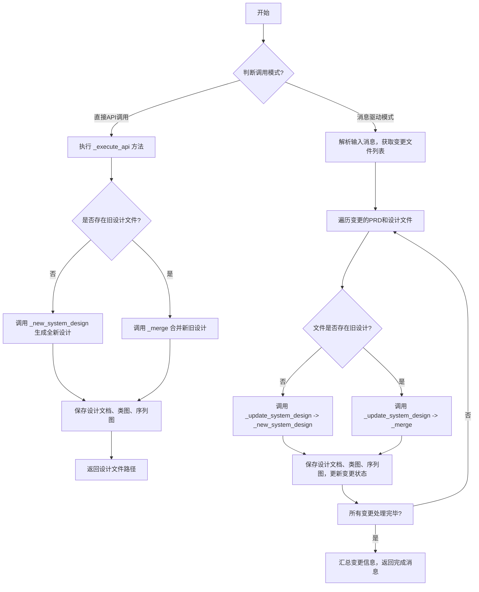
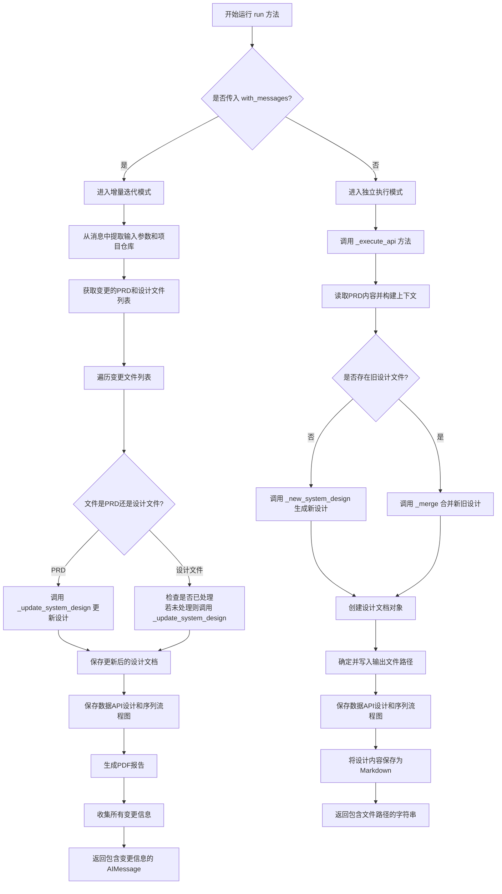
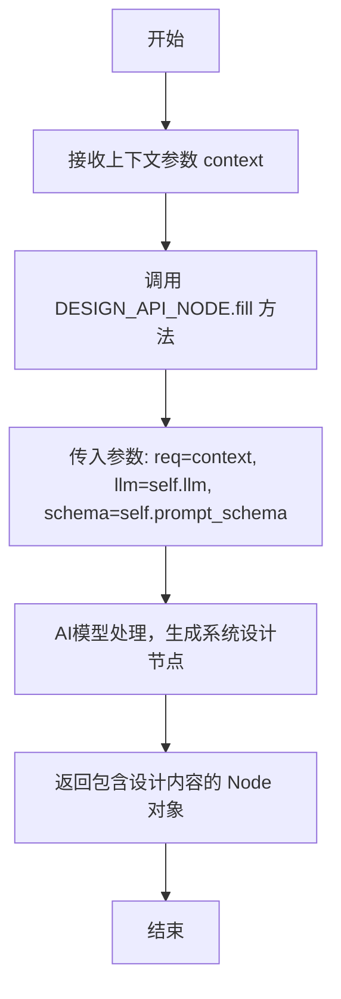
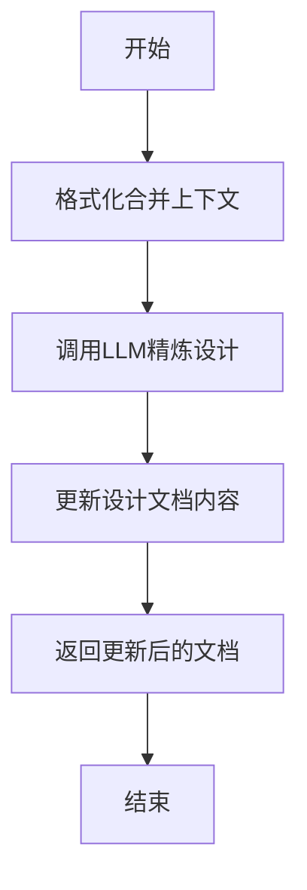
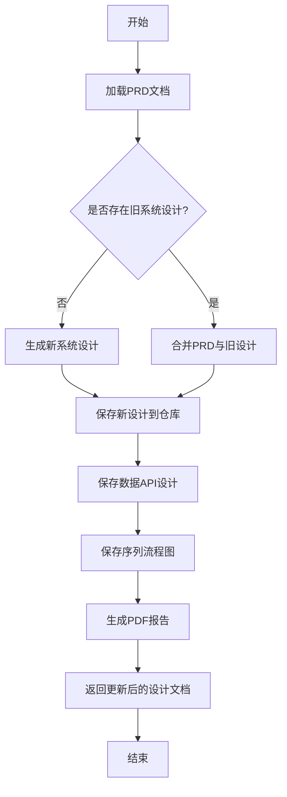
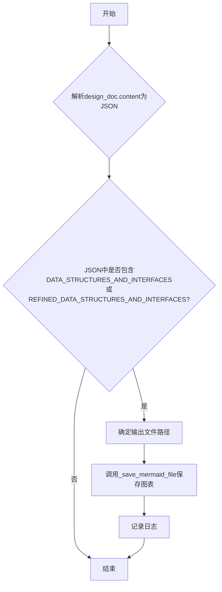
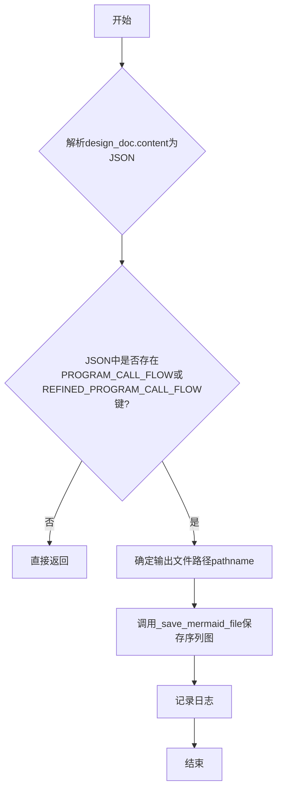
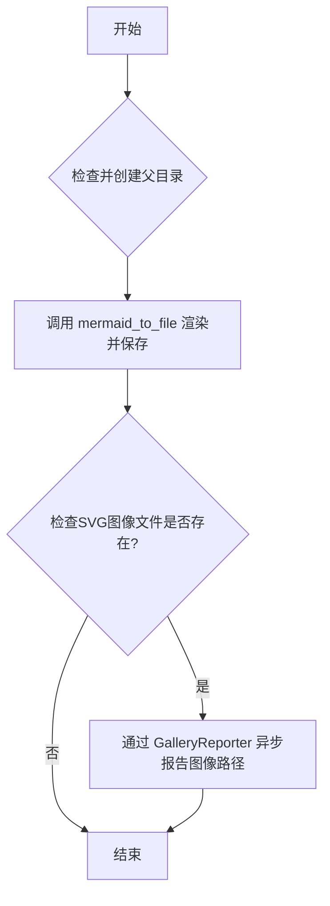
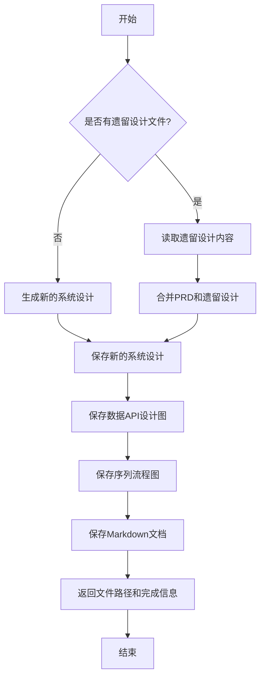

# `.\MetaGPT\metagpt\actions\design_api.py` 详细设计文档

该代码实现了一个名为WriteDesign的Action类，其核心功能是基于产品需求文档（PRD）或用户需求，生成或更新系统设计文档。它能够处理全新的设计请求，也能在已有设计基础上进行增量迭代更新。具体而言，它会生成包含API设计、数据结构、库表、流程和路径的详细系统设计，并将结果保存为JSON格式的设计文档，同时生成对应的类图（数据API设计）和序列图（程序调用流程）的Mermaid图表文件。

## 整体流程



## 类结构

```
Action (基类)
└── WriteDesign (系统设计生成Action)
    ├── 字段: name, i_context, desc, repo, input_args
    └── 方法: run, _new_system_design, _merge, _update_system_design, _save_data_api_design, _save_seq_flow, _save_mermaid_file, _execute_api
```

## 全局变量及字段


### `NEW_REQ_TEMPLATE`
    
用于合并旧设计文档和新需求的模板字符串，包含占位符 {old_design} 和 {context}。

类型：`str`
    


### `WriteDesign.name`
    
动作的名称，用于标识该动作，在注册工具时使用。

类型：`str`
    


### `WriteDesign.i_context`
    
可选的输入上下文信息，用于提供额外的背景或约束条件。

类型：`Optional[str]`
    


### `WriteDesign.desc`
    
动作的描述，详细说明了该动作的功能和目的，即基于PRD进行系统设计。

类型：`str`
    


### `WriteDesign.repo`
    
项目仓库实例，用于管理项目文件、文档和资源，支持增量迭代和文件变更跟踪。

类型：`Optional[ProjectRepo]`
    


### `WriteDesign.input_args`
    
输入参数模型，通常包含项目路径、变更的PRD文件名等信息，用于指导设计更新过程。

类型：`Optional[BaseModel]`
    
    

## 全局函数及方法

### `WriteDesign.run`

`WriteDesign.run` 方法是 `WriteDesign` 类的核心异步方法，负责根据产品需求文档（PRD）和可能的旧设计文档，生成或更新系统设计文档。它支持增量迭代，能够处理新的用户需求、合并现有设计，并输出包含API设计、数据结构、程序调用流程等内容的系统设计文件，同时生成相关的图表（如类图、序列图）和Markdown文档。

参数：

- `with_messages`：`List[Message]`，可选，包含上下文信息的消息列表，用于增量迭代模式。
- `user_requirement`：`str`，用户对系统设计的需求描述。
- `prd_filename`：`str`，可选，产品需求文档（PRD）的文件路径。
- `legacy_design_filename`：`str`，可选，旧版系统设计文档的文件路径。
- `extra_info`：`str`，可选，需要包含在系统设计中的额外信息。
- `output_pathname`：`str`，可选，生成的系统设计文档的输出文件路径。
- `kwargs`：`dict`，其他关键字参数。

返回值：`Union[AIMessage, str]`，在增量迭代模式下返回包含处理结果的 `AIMessage` 对象；在独立执行模式下返回描述生成文件路径的字符串。

#### 流程图



#### 带注释源码

```python
async def run(
    self,
    with_messages: List[Message] = None,
    *,
    user_requirement: str = "",
    prd_filename: str = "",
    legacy_design_filename: str = "",
    extra_info: str = "",
    output_pathname: str = "",
    **kwargs,
) -> Union[AIMessage, str]:
    """
    Write a system design.

    Args:
        user_requirement (str): The user's requirements for the system design.
        prd_filename (str, optional): The filename of the Product Requirement Document (PRD).
        legacy_design_filename (str, optional): The filename of the legacy design document.
        extra_info (str, optional): Additional information to be included in the system design.
        output_pathname (str, optional): The output file path of the document.

    Returns:
        str: The file path of the generated system design.

    Example:
        # Write a new system design and save to the path name.
        >>> user_requirement = "Write system design for a snake game"
        >>> extra_info = "Your extra information"
        >>> output_pathname = "snake_game/docs/system_design.json"
        >>> action = WriteDesign()
        >>> result = await action.run(user_requirement=user_requirement, extra_info=extra_info, output_pathname=output_pathname)
        >>> print(result)
        System Design filename: "/absolute/path/to/snake_game/docs/system_design.json"

        # Rewrite an existing system design and save to the path name.
        >>> user_requirement = "Write system design for a snake game, include new features such as a web UI"
        >>> extra_info = "Your extra information"
        >>> legacy_design_filename = "/absolute/path/to/snake_game/docs/system_design.json"
        >>> output_pathname = "/absolute/path/to/snake_game/docs/system_design_new.json"
        >>> action = WriteDesign()
        >>> result = await action.run(user_requirement=user_requirement, extra_info=extra_info, legacy_design_filename=legacy_design_filename, output_pathname=output_pathname)
        >>> print(result)
        System Design filename: "/absolute/path/to/snake_game/docs/system_design_new.json"

        # Write a new system design with the given PRD(Product Requirement Document) and save to the path name.
        >>> user_requirement = "Write system design for a snake game based on the PRD at /absolute/path/to/snake_game/docs/prd.json"
        >>> extra_info = "Your extra information"
        >>> prd_filename = "/absolute/path/to/snake_game/docs/prd.json"
        >>> output_pathname = "/absolute/path/to/snake_game/docs/sytem_design.json"
        >>> action = WriteDesign()
        >>> result = await action.run(user_requirement=user_requirement, extra_info=extra_info, prd_filename=prd_filename, output_pathname=output_pathname)
        >>> print(result)
        System Design filename: "/absolute/path/to/snake_game/docs/sytem_design.json"

        # Rewrite an existing system design with the given PRD(Product Requirement Document) and save to the path name.
        >>> user_requirement = "Write system design for a snake game, include new features such as a web UI"
        >>> extra_info = "Your extra information"
        >>> prd_filename = "/absolute/path/to/snake_game/docs/prd.json"
        >>> legacy_design_filename = "/absolute/path/to/snake_game/docs/system_design.json"
        >>> output_pathname = "/absolute/path/to/snake_game/docs/system_design_new.json"
        >>> action = WriteDesign()
        >>> result = await action.run(user_requirement=user_requirement, extra_info=extra_info, prd_filename=prd_filename, legacy_design_filename=legacy_design_filename, output_pathname=output_pathname)
        >>> print(result)
        System Design filename: "/absolute/path/to/snake_game/docs/system_design_new.json"
    """
    # 判断运行模式：增量迭代模式（传入with_messages）或独立执行模式
    if not with_messages:
        # 独立执行模式：直接调用内部方法处理参数并生成设计
        return await self._execute_api(
            user_requirement=user_requirement,
            prd_filename=prd_filename,
            legacy_design_filename=legacy_design_filename,
            extra_info=extra_info,
            output_pathname=output_pathname,
        )

    # 增量迭代模式：从最后一条消息中提取输入参数
    self.input_args = with_messages[-1].instruct_content
    # 初始化项目仓库对象
    self.repo = ProjectRepo(self.input_args.project_path)
    # 获取变更的PRD文件名列表
    changed_prds = self.input_args.changed_prd_filenames
    # 获取变更的系统设计文件名列表（转换为工作目录下的绝对路径）
    changed_system_designs = [
        str(self.repo.docs.system_design.workdir / i)
        for i in list(self.repo.docs.system_design.changed_files.keys())
    ]

    # 遍历所有变更的文件（PRD和设计文档），为每个文件重新生成或更新设计内容
    changed_files = Documents()
    for filename in changed_prds:
        doc = await self._update_system_design(filename=filename)
        changed_files.docs[filename] = doc

    for filename in changed_system_designs:
        # 避免重复处理已在PRD循环中处理过的文件
        if filename in changed_files.docs:
            continue
        doc = await self._update_system_design(filename=filename)
        changed_files.docs[filename] = doc
    if not changed_files.docs:
        logger.info("Nothing has changed.")
    # 收集所有变更的系统设计文件名，用于后续消息传递
    kvs = self.input_args.model_dump()
    kvs["changed_system_design_filenames"] = [
        str(self.repo.docs.system_design.workdir / i)
        for i in list(self.repo.docs.system_design.changed_files.keys())
    ]
    # 返回一个AIMessage，包含处理完成的信息和所有变更的文件列表
    return AIMessage(
        content="Designing is complete. "
        + "\n".join(
            list(self.repo.docs.system_design.changed_files.keys())
            + list(self.repo.resources.data_api_design.changed_files.keys())
            + list(self.repo.resources.seq_flow.changed_files.keys())
        ),
        instruct_content=AIMessage.create_instruct_value(kvs=kvs, class_name="WriteDesignOutput"),
        cause_by=self,
    )
```

### `WriteDesign._new_system_design`

该方法基于给定的上下文（通常是产品需求文档PRD的内容），调用AI模型生成一个新的系统设计。它是系统设计流程的起点，负责将需求转化为结构化的设计文档。

参数：

- `context`：`str`，包含用户需求、额外信息和PRD内容的字符串，作为生成新系统设计的输入上下文。

返回值：`Node`，一个包含AI模型生成的结构化系统设计内容的节点对象。该节点的`instruct_content`属性包含了设计文档的JSON数据。

#### 流程图



#### 带注释源码

```python
async def _new_system_design(self, context):
    # 调用预定义的 DESIGN_API_NODE 节点的 fill 方法。
    # 该方法使用配置的 LLM 和提示词模式，将传入的上下文（context）作为需求（req）进行处理。
    # 其核心功能是驱动大语言模型，根据需求生成一个初始的系统设计。
    node = await DESIGN_API_NODE.fill(req=context, llm=self.llm, schema=self.prompt_schema)
    # 返回生成的节点，该节点包含了模型输出的结构化设计内容。
    return node
```

### `WriteDesign._merge`

该方法用于合并产品需求文档（PRD）与现有系统设计文档，生成一个更新后的系统设计文档。它通过将旧的设计内容与新的需求结合，利用LLM进行精炼，从而生成一个融合了新旧信息的系统设计。

参数：

- `prd_doc`：`Document`，包含产品需求文档（PRD）内容的文档对象。
- `system_design_doc`：`Document`，包含现有系统设计文档内容的文档对象。

返回值：`Document`，返回更新后的系统设计文档对象，其内容为精炼后的系统设计JSON字符串。

#### 流程图



#### 带注释源码

```python
async def _merge(self, prd_doc, system_design_doc):
    # 使用模板将旧的设计内容与新的PRD内容合并，形成新的上下文
    context = NEW_REQ_TEMPLATE.format(old_design=system_design_doc.content, context=prd_doc.content)
    # 调用精炼设计节点，利用LLM根据新上下文生成更新后的系统设计
    node = await REFINED_DESIGN_NODE.fill(req=context, llm=self.llm, schema=self.prompt_schema)
    # 将LLM返回的精炼设计内容（JSON格式）更新到原系统设计文档中
    system_design_doc.content = node.instruct_content.model_dump_json()
    # 返回更新后的系统设计文档
    return system_design_doc
```

### `WriteDesign._update_system_design`

该方法用于增量更新系统设计文档。它根据给定的PRD（产品需求文档）文件名，加载对应的PRD文档和现有的系统设计文档（如果存在）。如果不存在旧的设计文档，则基于PRD内容生成全新的系统设计；如果存在，则将PRD内容与旧设计合并，生成更新后的系统设计。更新后的设计会保存到项目仓库中，并生成相关的数据API设计和序列流程图。

参数：

- `filename`：`str`，PRD文档的文件路径，用于加载PRD内容并关联更新系统设计。

返回值：`Document`，返回更新后的系统设计文档对象。

#### 流程图



#### 带注释源码

```python
async def _update_system_design(self, filename) -> Document:
    # 计算相对于项目根目录的路径
    root_relative_path = Path(filename).relative_to(self.repo.workdir)
    # 加载PRD文档
    prd = await Document.load(filename=filename, project_path=self.repo.workdir)
    # 尝试从仓库获取现有的系统设计文档
    old_system_design_doc = await self.repo.docs.system_design.get(root_relative_path.name)
    # 使用文档报告器记录设计过程
    async with DocsReporter(enable_llm_stream=True) as reporter:
        await reporter.async_report({"type": "design"}, "meta")
        # 如果不存在旧设计，生成全新的系统设计
        if not old_system_design_doc:
            system_design = await self._new_system_design(context=prd.content)
            doc = await self.repo.docs.system_design.save(
                filename=prd.filename,
                content=system_design.instruct_content.model_dump_json(),
                dependencies={prd.root_relative_path},
            )
        # 如果存在旧设计，合并PRD与旧设计
        else:
            doc = await self._merge(prd_doc=prd, system_design_doc=old_system_design_doc)
            await self.repo.docs.system_design.save_doc(doc=doc, dependencies={prd.root_relative_path})
        # 保存数据API设计图
        await self._save_data_api_design(doc)
        # 保存序列流程图
        await self._save_seq_flow(doc)
        # 生成并保存PDF格式的设计报告
        md = await self.repo.resources.system_design.save_pdf(doc=doc)
        await reporter.async_report(self.repo.workdir / md.root_relative_path, "path")
    # 返回更新后的设计文档
    return doc
```

### `WriteDesign._save_data_api_design`

该方法负责从系统设计文档中提取数据结构与接口设计部分（类图），并将其保存为Mermaid格式的图表文件。如果设计文档中不包含相关数据，则方法直接返回。

参数：

- `design_doc`：`Document`，包含系统设计内容的文档对象，其`content`属性应为JSON格式的字符串。
- `output_filename`：`Path`，可选参数，指定输出Mermaid文件的完整路径。如果未提供，则使用项目仓库的默认路径和设计文档的文件名。

返回值：`None`，该方法不返回任何值。

#### 流程图



#### 带注释源码

```python
async def _save_data_api_design(self, design_doc, output_filename: Path = None):
    # 1. 从设计文档的JSON内容中提取“数据结构与接口”部分。
    #    这部分内容可能由初始设计节点（DESIGN_API_NODE）或精炼设计节点（REFINED_DESIGN_NODE）生成。
    m = json.loads(design_doc.content)
    data_api_design = m.get(DATA_STRUCTURES_AND_INTERFACES.key) or m.get(REFINED_DATA_STRUCTURES_AND_INTERFACES.key)
    
    # 2. 如果设计文档中不包含此部分，则直接返回。
    if not data_api_design:
        return
    
    # 3. 确定输出文件的路径。
    #    如果调用者未指定output_filename，则使用项目仓库的默认目录（DATA_API_DESIGN_FILE_REPO）
    #    并以设计文档的文件名（不含扩展名）作为基础文件名。
    pathname = output_filename or self.repo.workdir / DATA_API_DESIGN_FILE_REPO / Path(
        design_doc.filename
    ).with_suffix("")
    
    # 4. 调用内部方法将Mermaid代码保存为文件，并可能生成对应的SVG图像。
    await self._save_mermaid_file(data_api_design, pathname)
    
    # 5. 记录操作完成的日志。
    logger.info(f"Save class view to {str(pathname)}")
```

### `WriteDesign._save_seq_flow`

该方法用于从系统设计文档中提取序列流程图（Sequence Flow）数据，并将其保存为Mermaid格式的文件。如果序列流程图数据不存在，则方法直接返回。

参数：

- `design_doc`：`Document`，包含系统设计内容的文档对象，其`content`属性应为JSON字符串。
- `output_filename`：`Path`，可选参数，指定输出文件的完整路径。如果未提供，则根据项目结构和设计文档文件名自动生成默认路径。

返回值：`None`，该方法不返回任何值。

#### 流程图



#### 带注释源码

```python
async def _save_seq_flow(self, design_doc, output_filename: Path = None):
    """
    从设计文档中提取序列流程图数据并保存为Mermaid文件。

    该方法首先解析设计文档的JSON内容，然后查找序列流程图数据。
    如果找到数据，则将其保存到指定或默认的路径。

    Args:
        design_doc (Document): 包含系统设计内容的文档对象。
        output_filename (Path, optional): 输出文件的完整路径。如果为None，则使用默认路径。
    """
    # 1. 解析设计文档的JSON内容
    m = json.loads(design_doc.content)
    # 2. 尝试从JSON中获取序列流程图数据，优先查找新版本键，其次查找旧版本键
    seq_flow = m.get(PROGRAM_CALL_FLOW.key) or m.get(REFINED_PROGRAM_CALL_FLOW.key)
    # 3. 如果未找到序列流程图数据，则直接返回
    if not seq_flow:
        return
    # 4. 确定输出文件路径：如果提供了output_filename则使用它，否则根据项目结构和设计文档名生成默认路径
    pathname = output_filename or self.repo.workdir / Path(SEQ_FLOW_FILE_REPO) / Path(
        design_doc.filename
    ).with_suffix("")
    # 5. 调用内部方法将Mermaid数据保存为文件（通常是.svg或.png）
    await self._save_mermaid_file(seq_flow, pathname)
    # 6. 记录保存操作日志
    logger.info(f"Saving sequence flow to {str(pathname)}")
```

### `WriteDesign._save_mermaid_file`

该方法负责将Mermaid格式的图表数据保存为文件。它首先确保输出目录存在，然后调用`mermaid_to_file`函数将数据渲染为指定格式（如SVG）并保存到指定路径。如果成功生成了SVG图像文件，它会通过`GalleryReporter`异步报告该图像文件的路径。

参数：

- `data`：`str`，包含Mermaid图表定义（如类图、序列图）的字符串。
- `pathname`：`Path`，输出文件的目标路径（不包含扩展名）。方法会根据配置的Mermaid引擎自动添加相应的扩展名。

返回值：`None`，该方法不返回任何值。

#### 流程图



#### 带注释源码

```python
async def _save_mermaid_file(self, data: str, pathname: Path):
    # 确保输出文件的父目录存在，如果不存在则创建
    pathname.parent.mkdir(parents=True, exist_ok=True)
    # 调用工具函数，使用配置的Mermaid引擎将数据渲染为文件
    await mermaid_to_file(self.config.mermaid.engine, data, pathname)
    # 构建预期的SVG图像文件路径
    image_path = pathname.parent / f"{pathname.name}.svg"
    # 如果SVG文件成功生成，则异步报告其路径
    if image_path.exists():
        await GalleryReporter().async_report(image_path, "path")
```

### `WriteDesign._execute_api`

该方法用于执行系统设计的API调用，根据用户需求、PRD文档、遗留设计文档和额外信息，生成或更新系统设计文档，并保存相关图表和Markdown文件。

参数：

- `user_requirement`：`str`，用户对系统设计的需求描述。
- `prd_filename`：`str`，产品需求文档（PRD）的文件路径。
- `legacy_design_filename`：`str`，遗留设计文档的文件路径。
- `extra_info`：`str`，额外的信息，用于补充系统设计。
- `output_pathname`：`str`，输出系统设计文档的文件路径。

返回值：`str`，返回系统设计文档的文件路径和完成提示信息。

#### 流程图



#### 带注释源码

```python
async def _execute_api(
    self,
    user_requirement: str = "",
    prd_filename: str = "",
    legacy_design_filename: str = "",
    extra_info: str = "",
    output_pathname: str = "",
) -> str:
    # 读取PRD文件内容（如果提供了PRD文件路径）
    prd_content = ""
    if prd_filename:
        prd_filename = rectify_pathname(path=prd_filename, default_filename="prd.json")
        prd_content = await aread(filename=prd_filename)

    # 构建上下文信息，包括用户需求、额外信息和PRD内容
    context = "### User Requirements\n{user_requirement}\n### Extra_info\n{extra_info}\n### PRD\n{prd}\n".format(
        user_requirement=to_markdown_code_block(user_requirement),
        extra_info=to_markdown_code_block(extra_info),
        prd=to_markdown_code_block(prd_content),
    )

    # 使用文档报告器记录设计过程
    async with DocsReporter(enable_llm_stream=True) as reporter:
        await reporter.async_report({"type": "design"}, "meta")

        # 判断是否有遗留设计文件
        if not legacy_design_filename:
            # 如果没有遗留设计文件，生成新的系统设计
            node = await self._new_system_design(context=context)
            design = Document(content=node.instruct_content.model_dump_json())
        else:
            # 如果有遗留设计文件，读取其内容并合并PRD信息
            old_design_content = await aread(filename=legacy_design_filename)
            design = await self._merge(
                prd_doc=Document(content=context), system_design_doc=Document(content=old_design_content)
            )

        # 处理输出路径
        if not output_pathname:
            output_pathname = Path(output_pathname) / "docs" / "system_design.json"
        elif not Path(output_pathname).is_absolute():
            output_pathname = self.config.workspace.path / output_pathname
        output_pathname = rectify_pathname(path=output_pathname, default_filename="system_design.json")

        # 保存系统设计文档
        await awrite(filename=output_pathname, data=design.content)

        # 保存数据API设计图
        output_filename = output_pathname.parent / f"{output_pathname.stem}-class-diagram"
        await self._save_data_api_design(design_doc=design, output_filename=output_filename)

        # 保存序列流程图
        output_filename = output_pathname.parent / f"{output_pathname.stem}-sequence-diagram"
        await self._save_seq_flow(design_doc=design, output_filename=output_filename)

        # 保存Markdown格式的系统设计文档
        md_output_filename = output_pathname.with_suffix(".md")
        await save_json_to_markdown(content=design.content, output_filename=md_output_filename)

        # 报告Markdown文件路径
        await reporter.async_report(md_output_filename, "path")

    # 返回系统设计文档的文件路径和完成提示信息
    return f'System Design filename: "{str(output_pathname)}". \n The System Design has been completed.'
```

## 关键组件


### 设计API节点（DESIGN_API_NODE）

用于基于产品需求文档（PRD）生成初始系统设计，包括API、数据结构、库表、流程和路径。

### 精炼设计节点（REFINED_DESIGN_NODE）

用于在已有设计文档的基础上，根据新的需求或变更进行增量迭代和精炼，生成更新后的系统设计。

### 数据结构与接口（DATA_STRUCTURES_AND_INTERFACES）

在初始设计文档中，用于存储和标识系统设计中的核心数据结构与接口定义部分。

### 精炼数据结构与接口（REFINED_DATA_STRUCTURES_AND_INTERFACES）

在精炼后的设计文档中，用于存储和标识更新后的数据结构与接口定义部分。

### 程序调用流程（PROGRAM_CALL_FLOW）

在初始设计文档中，用于存储和标识系统设计中的程序调用流程或序列图部分。

### 精炼程序调用流程（REFINED_PROGRAM_CALL_FLOW）

在精炼后的设计文档中，用于存储和标识更新后的程序调用流程或序列图部分。

### 文档报告器（DocsReporter）

用于在系统设计生成过程中，异步报告设计相关的元数据和生成的文件路径，支持LLM流式处理。

### 画廊报告器（GalleryReporter）

用于异步报告生成的图表文件（如Mermaid生成的SVG图片）的路径，便于在UI中展示。

### 项目仓库（ProjectRepo）

封装了对项目文件结构的操作，特别是对`docs`（如系统设计文档）和`resources`（如API设计图、序列流程图）目录的读写和变更追踪。

### 增量迭代功能

根据RFC 135的设计，支持基于变更的PRD或设计文档进行增量式的系统设计更新，而非每次都从头生成。

### Mermaid图表生成与保存

将设计文档中提取的Mermaid代码（用于类图和序列图）渲染为图像文件（如SVG）并保存到指定目录，同时通过报告器通知UI。


## 问题及建议


### 已知问题

-   **方法签名不一致**：`run` 方法的参数列表在两种调用模式下不一致。当 `with_messages` 参数不为空时，它接受一个消息列表并忽略其他命名参数（如 `user_requirement`, `prd_filename` 等）。当 `with_messages` 为空时，它又依赖于这些命名参数。这种设计增加了方法的复杂性和理解成本，容易引发调用错误。
-   **职责边界模糊**：`WriteDesign` 类同时承担了生成新设计、合并更新设计、保存多种格式的输出文件（JSON、Mermaid 图、Markdown、PDF）以及发布报告通知等多种职责。这违反了单一职责原则，使得类变得臃肿，难以维护和测试。
-   **错误处理不完善**：代码中缺乏对关键操作（如文件读取、JSON 解析、LLM 调用）的详细错误处理和异常捕获。例如，如果 `prd_filename` 指向的文件不存在或内容格式错误，`aread` 调用可能失败，但后续处理没有明确的容错机制。
-   **硬编码的路径和模板**：代码中存在多处硬编码的路径（如 `"docs/system_design.json"`）和模板字符串（如 `NEW_REQ_TEMPLATE`）。这使得代码的灵活性和可配置性降低，当项目结构或需求格式发生变化时，需要修改多处源代码。
-   **潜在的循环依赖风险**：在 `_update_system_design` 方法中，设计文档的更新可能触发对自身或其他设计文档的再次更新（通过 `changed_system_designs` 列表），如果没有妥善的变更检测和终止机制，可能存在无限循环或重复处理的风险。
-   **资源管理依赖调用者**：`ProjectRepo` 实例的初始化依赖于外部传入的 `input_args.project_path`。在 `run` 方法的某些执行路径中（如通过 `_execute_api`），`self.repo` 可能为 `None`，导致后续依赖 `self.repo` 的方法（如 `_save_data_api_design`）调用失败或行为未定义。

### 优化建议

-   **重构 `run` 方法**：将 `run` 方法拆分为两个职责清晰的方法，例如 `run_with_messages` 和 `run_with_params`，或者引入一个统一的参数对象（如 `DesignRequest`）来封装所有可能的输入，消除参数列表的歧义。
-   **遵循单一职责原则进行类分解**：
    -   将设计生成的核心逻辑（与 LLM 交互）提取到独立的服务类中（如 `DesignGeneratorService`）。
    -   将文件保存和格式转换逻辑（如保存 JSON、生成 Mermaid 图、转换为 Markdown/PDF）提取到专门的 `DesignExporter` 或 `DocumentRenderer` 类中。
    -   将变更检测和文档依赖管理逻辑提取到 `DesignChangeManager` 或类似组件中。
    -   使 `WriteDesign` 类主要充当协调者（Facade），组合调用这些细粒度服务。
-   **增强错误处理与日志**：
    -   在文件 I/O、JSON 解析、外部服务（LLM）调用等关键步骤添加 `try-except` 块，捕获特定异常并记录详细的错误日志。
    -   提供更友好的错误信息或回退机制，例如当 PRD 文件无法读取时，尝试使用备用内容或明确告知用户。
    -   验证输入参数的完整性和有效性。
-   **外部化配置**：
    -   将硬编码的路径（如默认输出路径、仓库子目录名称）、文件模板、Mermaid 引擎类型等移至配置文件或通过类的构造参数注入。
    -   使用常量类或枚举来管理这些配置键，提高可维护性。
-   **实现变更检测与防循环机制**：
    -   在文档处理流程中引入更精确的变更哈希或版本标识，避免对未实际更改的内容进行重复处理。
    -   在处理 `changed_system_designs` 列表时，可以考虑使用已处理文件集合来避免重复进入同一文件，或设置最大迭代深度。
-   **改进资源生命周期管理**：
    -   确保 `ProjectRepo` 在类的所有主要执行路径中都能被正确初始化。可以考虑在 `__init__` 方法中接受一个 `workspace_path` 参数，或者提供一个工厂方法来创建包含有效 `repo` 的 `WriteDesign` 实例。
    -   对于 `DocsReporter` 和 `GalleryReporter` 这类资源，确保其在所有异常路径下都能被正确清理（当前使用了 `async with`，做法正确，应保持）。
-   **提升代码可测试性**：
    -   通过上述的职责分解，可以更容易地对各个独立组件进行单元测试。
    -   减少对全局状态和外部文件系统的直接依赖，在测试时可以通过依赖注入使用 Mock 对象。
-   **优化异步操作**：
    -   检查 `_update_system_design` 循环中对 `changed_prds` 和 `changed_system_designs` 的处理。如果文件数量多，可以考虑使用 `asyncio.gather` 进行并发处理以提高效率，但需注意并发写入同一目录可能带来的冲突。
    -   确保所有 `async` 方法都正确地 `await` 了异步调用。


## 其它


### 设计目标与约束

本模块的核心设计目标是提供一个可复用的、支持增量迭代的系统设计生成器。它需要能够根据产品需求文档（PRD）生成或更新系统设计文档，包括API设计、数据结构、程序调用流程等，并以多种格式（JSON、Markdown、Mermaid图表）输出。主要约束包括：必须与项目仓库（ProjectRepo）结构集成，支持基于文件变更的增量更新，遵循特定的RFC规范（如RFC 135、RFC 236）进行消息处理和功能设计，并能够通过工具注册机制（`register_tool`）被外部系统调用。

### 错误处理与异常设计

模块中的错误处理主要依赖于Python的异常机制和日志记录。关键操作如文件读写（`aread`, `awrite`）、LLM调用、Mermaid图表生成都可能抛出异常。当前设计通过`try-except`块进行局部捕获，并使用`logger`记录错误信息，但未在公共接口（如`run`方法）显式声明可能抛出的异常类型。对于关键业务流程（如`_update_system_design`），缺乏事务性保证，部分文件生成失败可能导致状态不一致。建议增强错误处理的层次性，对可恢复错误和致命错误进行区分，并在高层方法中提供更清晰的错误反馈。

### 数据流与状态机

数据流始于用户需求、PRD文件或变更消息。核心处理路径有两条：
1.  **直接调用模式**：通过`run`方法的参数传入原始需求，触发`_execute_api`，生成全新的或基于旧设计合并的新设计文档。
2.  **增量迭代模式**：通过`with_messages`参数接收包含变更信息的`AIMessage`，解析出变更的PRD和设计文件列表，针对每个变更文件调用`_update_system_design`进行更新。

状态主要体现在`ProjectRepo`对象管理的文件系统状态（`changed_files`）和生成的中间文档（`Document`对象）。模块本身没有显式的状态机，但其行为由输入参数（是否有`legacy_design_filename`，是否有`with_messages`）决定，隐式构成了“新建设计”、“合并设计”、“增量更新”几种状态转换。

### 外部依赖与接口契约

1.  **LLM服务**：依赖`self.llm`（通过父类`Action`注入）调用`DESIGN_API_NODE`和`REFINED_DESIGN_NODE`等提示词节点，生成设计内容。契约是LLM需返回符合`BaseModel`结构的响应。
2.  **项目仓库（ProjectRepo）**：强依赖`ProjectRepo`来管理设计文档、API设计图、序列图等文件的存储、检索和变更跟踪。契约是`ProjectRepo`需提供`docs.system_design`, `resources.data_api_design`等接口。
3.  **工具注册表**：通过`@register_tool`装饰器将`WriteDesign`类注册为工具，使其`run`方法可被外部工作流发现和调用。契约是工具需提供`run`方法。
4.  **报告系统**：依赖`DocsReporter`和`GalleryReporter`来报告生成过程和结果文件路径。契约是报告器需支持`async_report`方法。
5.  **配置文件**：依赖`self.config`获取Mermaid引擎等配置信息。
6.  **工具函数库**：依赖`metagpt.utils.common`和`metagpt.utils.mermaid`中的函数进行文件操作和图表转换。

### 安全与合规考虑

1.  **输入验证**：对输入的文件路径（如`prd_filename`, `legacy_design_filename`）进行了规范化处理（`rectify_pathname`），但未对文件内容进行安全性检查（如防止路径遍历攻击）。当处理用户提供的PRD内容时，存在潜在风险。
2.  **数据泄露**：生成的系统设计文档可能包含敏感的系统架构信息。模块本身不处理访问控制，依赖调用方和存储系统（`ProjectRepo`）确保数据安全。
3.  **LLM使用**：传递给LLM的上下文可能包含用户需求、原有设计等业务信息。需确保LLM服务提供商符合数据隐私政策。
4.  **依赖安全**：所有第三方库（如`pydantic`）的版本需及时更新，以避免已知漏洞。

### 性能考量

1.  **LLM调用开销**：`_new_system_design`和`_merge`方法中的LLM调用是主要性能瓶颈，耗时可能长达数秒至数十秒。
2.  **文件I/O**：频繁的文件读取（`aread`）、写入（`awrite`、`save`）和Mermaid图表生成（`mermaid_to_file`）可能影响性能，尤其是在处理大量变更文件时。
3.  **内存使用**：将整个设计文档（JSON内容）加载到内存中进行解析和合并。对于极大的设计文档，可能存在内存压力。
4.  **并发性**：`_update_system_design`中对多个变更文件的处理是顺序执行的（`for`循环），未利用异步并发潜力。可以考虑使用`asyncio.gather`等机制并行处理独立文件的更新，但需注意对`ProjectRepo`状态操作的线程/协程安全。
5.  **缓存**：未实现任何缓存机制。对于频繁读取的旧设计文档，可以考虑缓存以提升性能。

### 测试策略建议

1.  **单元测试**：
    *   `_new_system_design`和`_merge`：模拟LLM返回，验证生成的`Document`结构。
    *   `_save_data_api_design`和`_save_seq_flow`：验证给定输入是否能正确触发Mermaid文件生成和保存。
    *   `_execute_api`：测试不同参数组合（有无旧设计、有无PRD文件）下的执行路径和输出。
2.  **集成测试**：
    *   与模拟的`ProjectRepo`集成，测试`run`方法在增量迭代模式下对文件变更的正确响应和仓库状态更新。
    *   测试完整的“PRD -> 设计 -> 图表”生成流程，验证最终输出文件（JSON, MD, SVG）的完整性和正确性。
3.  **端到端测试**：在真实或仿真的项目环境中，调用`WriteDesign`工具，验证其能否在更大的工作流中正确协作。
4.  **性能测试**：针对包含大量模块或复杂流程的设计文档，测试生成时间和资源消耗。
5.  **异常测试**：模拟文件不存在、LLM调用失败、磁盘空间不足等异常情况，验证模块的错误处理和恢复能力。

    