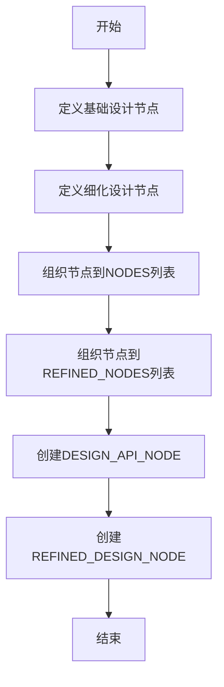

# `.\MetaGPT\metagpt\actions\design_api_an.py` 详细设计文档

该代码定义了一个用于生成和细化软件设计文档的模板系统。它通过创建一系列预定义的ActionNode对象来构建设计API的各个组成部分（如实现方法、文件列表、数据结构、程序调用流程等），并将这些节点组织成两个主要的设计节点：一个用于初始设计，另一个用于细化设计。

## 整体流程



## 类结构

```
ActionNode (来自metagpt.actions.action_node)
├── IMPLEMENTATION_APPROACH
├── REFINED_IMPLEMENTATION_APPROACH
├── PROJECT_NAME
├── FILE_LIST
├── REFINED_FILE_LIST
├── DATA_STRUCTURES_AND_INTERFACES
├── REFINED_DATA_STRUCTURES_AND_INTERFACES
├── PROGRAM_CALL_FLOW
├── REFINED_PROGRAM_CALL_FLOW
└── ANYTHING_UNCLEAR
```

## 全局变量及字段


### `IMPLEMENTATION_APPROACH`
    
定义实现方法节点，用于分析需求难点并选择开源框架

类型：`ActionNode`
    


### `REFINED_IMPLEMENTATION_APPROACH`
    
定义精炼实现方法节点，用于更新和扩展原始实现方法以反映增量开发带来的挑战

类型：`ActionNode`
    


### `PROJECT_NAME`
    
定义项目名称节点，用于指定带下划线的项目名称

类型：`ActionNode`
    


### `FILE_LIST`
    
定义文件列表节点，用于指定项目所需的相对路径文件列表

类型：`ActionNode`
    


### `REFINED_FILE_LIST`
    
定义精炼文件列表节点，用于更新和扩展原始文件列表以反映项目结构演变

类型：`ActionNode`
    


### `DATA_STRUCTURES_AND_INTERFACES`
    
定义数据结构和接口节点，用于使用Mermaid类图语法描述详细的类、方法和关系

类型：`ActionNode`
    


### `REFINED_DATA_STRUCTURES_AND_INTERFACES`
    
定义精炼数据结构和接口节点，用于更新和扩展现有的Mermaid类图以纳入新元素

类型：`ActionNode`
    


### `PROGRAM_CALL_FLOW`
    
定义程序调用流程节点，用于使用Mermaid序列图语法描述详细的程序执行流程

类型：`ActionNode`
    


### `REFINED_PROGRAM_CALL_FLOW`
    
定义精炼程序调用流程节点，用于扩展现有的Mermaid序列图以反映增量变化

类型：`ActionNode`
    


### `ANYTHING_UNCLEAR`
    
定义澄清事项节点，用于记录项目中的不明确方面并尝试澄清

类型：`ActionNode`
    


### `NODES`
    
存储初始设计阶段所需的所有ActionNode节点的列表

类型：`List[ActionNode]`
    


### `REFINED_NODES`
    
存储精炼设计阶段所需的所有ActionNode节点的列表

类型：`List[ActionNode]`
    


### `DESIGN_API_NODE`
    
通过组合NODES列表中的节点创建的顶层设计API节点

类型：`ActionNode`
    


### `REFINED_DESIGN_NODE`
    
通过组合REFINED_NODES列表中的节点创建的顶层精炼设计API节点

类型：`ActionNode`
    


### `ActionNode.key`
    
ActionNode的唯一标识符或名称

类型：`str`
    


### `ActionNode.expected_type`
    
ActionNode期望的输出数据类型

类型：`type`
    


### `ActionNode.instruction`
    
指导如何填充或使用此ActionNode的详细说明

类型：`str`
    


### `ActionNode.example`
    
ActionNode的示例输出或用法

类型：`Any`
    
    

## 全局函数及方法

### `ActionNode.from_children`

这是一个类方法，用于根据提供的子节点列表创建一个新的 `ActionNode` 实例。它通过聚合子节点的键、期望类型和指令来构建新节点的属性，并建立父子关系。

参数：
-  `name`：`str`，要创建的新 `ActionNode` 的名称。
-  `children`：`List[ActionNode]`，将作为新节点子节点的 `ActionNode` 对象列表。

返回值：`ActionNode`，一个根据提供的子节点信息构造的新 `ActionNode` 实例。

#### 流程图

```mermaid
flowchart TD
    A[开始: from_children(name, children)] --> B{children列表是否为空?}
    B -- 是 --> C[抛出ValueError异常]
    B -- 否 --> D[初始化key_list, expected_type_list, instruction_list]
    E[遍历children列表] --> F[将child.key添加到key_list]
    F --> G[将child.expected_type添加到expected_type_list]
    G --> H[将child.instruction添加到instruction_list]
    H --> I{是否遍历完所有children?}
    I -- 否 --> E
    I -- 是 --> J[使用name, key_list等参数创建新ActionNode]
    J --> K[设置新节点的children属性]
    K --> L[返回新创建的ActionNode]
    C --> M[结束]
    L --> M
```

#### 带注释源码

```python
@classmethod
def from_children(cls, name: str, children: List["ActionNode"]) -> "ActionNode":
    """
    类方法：根据子节点列表创建一个新的ActionNode。
    
    参数:
        name (str): 新节点的名称。
        children (List[ActionNode]): 子节点列表。
    
    返回:
        ActionNode: 一个新的ActionNode实例，其属性由子节点聚合而成。
    
    异常:
        ValueError: 当children列表为空时抛出。
    """
    if not children:
        # 如果子节点列表为空，抛出异常
        raise ValueError("Children list cannot be empty.")
    
    # 初始化用于聚合子节点信息的列表
    key_list = []
    expected_type_list = []
    instruction_list = []
    
    # 遍历所有子节点，收集它们的属性
    for child in children:
        key_list.append(child.key)
        expected_type_list.append(child.expected_type)
        instruction_list.append(child.instruction)
    
    # 使用收集到的信息创建新的ActionNode实例
    # key: 将子节点的key用逗号连接
    # expected_type: 使用子节点的expected_type列表
    # instruction: 将子节点的instruction用换行符连接
    # context: 初始化为空字符串
    # example: 初始化为空字符串
    node = cls(
        key=", ".join(key_list),
        expected_type=expected_type_list,
        instruction="\n".join(instruction_list),
        context="",
        example="",
    )
    
    # 设置新节点的子节点列表
    node.children = children
    
    # 返回新创建的节点
    return node
```

## 关键组件

### ActionNode 定义与配置

定义了多个用于生成设计文档的 ActionNode 对象，每个节点封装了设计文档中一个特定部分（如实现方法、文件列表、数据结构等）的生成规则、预期类型和示例。

### 设计文档生成流程

通过 `DESIGN_API_NODE` 和 `REFINED_DESIGN_NODE` 两个顶层 ActionNode 组织节点，分别对应初始设计和增量（精炼）设计两个阶段，每个阶段包含一组有序的子节点，用于结构化地生成或更新设计文档的各个部分。

### 增量设计支持

通过 `REFINED_IMPLEMENTATION_APPROACH`、`REFINED_FILE_LIST` 等以 “Refined” 为前缀的节点，支持对初始设计进行迭代更新，体现了对项目演进和增量开发模式的支持。

### Mermaid 图表集成

`DATA_STRUCTURES_AND_INTERFACES` 和 `PROGRAM_CALL_FLOW` 等节点明确要求使用 Mermaid 语法（类图和序列图）来可视化数据结构和程序调用流程，增强了设计文档的可读性和结构性。

## 问题及建议


### 已知问题

-   **代码重复度高**：`IMPLEMENTATION_APPROACH` 与 `REFINED_IMPLEMENTATION_APPROACH`、`FILE_LIST` 与 `REFINED_FILE_LIST` 等成对定义的 `ActionNode` 在结构和功能上高度相似，仅 `instruction` 和 `key` 有细微差别。这种重复增加了维护成本，当需要修改公共属性时，必须在多个地方进行同步更新，容易出错。
-   **硬编码的节点列表**：`NODES` 和 `REFINED_NODES` 列表是硬编码的。如果需要动态调整节点顺序、过滤特定节点或根据条件添加/移除节点，当前结构缺乏灵活性。
-   **类型注解不精确**：`DATA_STRUCTURES_AND_INTERFACES` 和 `PROGRAM_CALL_FLOW` 的 `expected_type` 被设置为 `Optional[str]`，而它们的“精炼版”则设置为 `str`。这种不一致性可能导致类型检查工具（如 mypy）产生警告或混淆，且未能精确表达“初始可为空，精炼后非空”的业务逻辑。
-   **魔法字符串与配置分散**：各个 `ActionNode` 的 `key`、`instruction`、`example` 等配置信息以魔法字符串的形式分散在代码中。这不利于集中管理和国际化（如果需要），也使得查找和更新特定配置变得困难。
-   **缺乏输入验证**：代码直接定义了节点，但没有机制来验证这些节点配置的完整性或正确性（例如，`key` 是否唯一，`instruction` 是否非空）。在更复杂的场景中，这可能引入运行时错误。

### 优化建议

-   **重构为工厂函数或配置类**：建议创建一个工厂函数（如 `create_design_node`）或一个配置数据类（如 `DesignNodeConfig`）。通过参数化区分“初始”和“精炼”版本，可以大幅减少代码重复。例如，传入一个 `mode` 参数（如 `'initial'` 或 `'refined'`）来生成对应的 `key` 和 `instruction`。
-   **动态构建节点列表**：将 `NODES` 和 `REFINED_NODES` 的定义改为从配置或通过逻辑动态生成。可以创建一个函数，接收一个节点标识符列表和模式参数，返回对应的 `ActionNode` 列表。这提高了代码的灵活性和可测试性。
-   **使用更精确的联合类型**：考虑使用 `typing.Union` 或更明确的类型来注解 `expected_type`，以更好地反映业务规则。例如，对于初始可空的节点，可以使用 `expected_type: Optional[str] = None` 并在工厂逻辑中确保精炼版不为空。或者，为两种模式分别定义不同的类型别名。
-   **集中化管理配置**：将 `key`、`instruction`、`example` 等字符串提取到常量、配置文件（如 YAML、JSON）或专用的配置类中。这样便于统一管理、修改和复用，也提升了代码的可读性。
-   **添加配置验证逻辑**：在工厂函数或 `ActionNode` 创建过程中，加入简单的验证步骤，检查必要字段是否存在、`key` 是否在上下文中唯一等。这可以在早期发现配置错误。
-   **考虑继承或组合**：评估是否可以通过定义一个基础的 `BaseDesignNode` 类，然后让 `InitialDesignNode` 和 `RefinedDesignNode` 继承它并覆盖特定字段，来更好地建模“初始”与“精炼”的 is-a 关系。或者，使用组合模式，将可变部分（如描述文本）作为组件注入。


## 其它


### 设计目标与约束

本模块的核心设计目标是提供一个可扩展、结构化的代码设计文档生成框架。它通过预定义的`ActionNode`对象来捕获软件设计过程中的关键要素（如实现方案、文件列表、数据结构、程序调用流程等），并支持初始设计和增量式精化设计两种模式。主要约束包括：1) 严格遵循`ActionNode`的模板化结构，确保每个设计要素都有明确的键、期望类型、指令和示例；2) 对数据结构与接口、程序调用流程等复杂部分，强制使用Mermaid语法进行可视化描述，以提升文档的可读性和一致性；3) 模块本身不包含具体的文档生成逻辑，而是作为元数据（模板）的提供者，供上层工作流调用。

### 错误处理与异常设计

当前模块主要定义了静态的配置数据（`ActionNode`实例列表），不包含运行时逻辑，因此没有显式的错误处理或异常抛出机制。潜在的异常风险来源于上层代码对`ActionNode`属性的不当使用，例如：1) 访问不存在的`key`；2) 向期望特定类型（如`List[str]`）的节点提供不匹配的数据类型。这些错误将由Python解释器或上层调用代码处理。模块的健壮性依赖于`ActionNode`类自身的初始化验证（如果存在）以及上层调用者在使用`NODES`和`REFINED_NODES`列表时的类型安全意识。

### 数据流与状态机

模块内部数据流是静态的。核心数据是预定义的`ActionNode`对象和由它们组成的两个列表（`NODES`, `REFINED_NODES`）。这些数据作为模板，其生命周期始于模块导入，并在整个应用程序运行期间保持不变。状态体现在两个设计阶段：1) **初始设计阶段**：使用`NODES`列表，包含`IMPLEMENTATION_APPROACH`, `FILE_LIST`, `DATA_STRUCTURES_AND_INTERFACES`, `PROGRAM_CALL_FLOW`, `ANYTHING_UNCLEAR`等节点。2) **精化设计阶段**：使用`REFINED_NODES`列表，包含对应的`REFINED_*`节点，用于在增量开发后更新和扩展初始设计。两个阶段通过不同的节点列表明确分离，但共享`ANYTHING_UNCLEAR`节点。最终，通过`ActionNode.from_children`方法将列表封装成两个顶层节点`DESIGN_API_NODE`和`REFINED_DESIGN_NODE`，供外部统一访问。

### 外部依赖与接口契约

1.  **内部依赖**:
    *   `metagpt.actions.action_node.ActionNode`: 所有设计节点的基类，定义了节点的结构（key, expected_type, instruction, example）。
    *   `metagpt.utils.mermaid.MMC1`, `MMC2`: 作为`DATA_STRUCTURES_AND_INTERFACES`和`PROGRAM_CALL_FLOW`节点的示例值，提供了Mermaid图语法的样例，是模块正确生成可视化文档的参考契约。
2.  **外部接口契约**:
    *   本模块对外暴露的主要接口是`DESIGN_API_NODE`和`REFINED_DESIGN_NODE`这两个`ActionNode`对象。任何使用本模块的客户端代码（如文档生成工作流）都应通过这两个对象来获取设计模板。
    *   契约约定：客户端代码可以读取这些节点的子节点（`NODES`/`REFINED_NODES`），并依据每个子节点的`instruction`和`expected_type`来填充具体内容，从而生成符合规范的设计文档。模块不保证生成过程的正确性，仅提供结构化的要求。
3.  **标准库依赖**: `typing`模块（用于类型注解，如`List`, `Optional`）。

### 配置与可扩展性

模块的配置完全内嵌在代码中，通过修改`ActionNode`实例的属性（`instruction`, `example`等）或调整`NODES`/`REFINED_NODES`列表的成员来改变设计文档的生成模板。例如：
*   **扩展设计维度**：若要新增一个“性能指标”设计节点，可以创建一个新的`ActionNode`实例并将其添加到`NODES`和`REFINED_NODES`列表中。
*   **调整指令**：可以直接修改现有`ActionNode`的`instruction`文本，以改变对该部分设计内容的要求。
*   **阶段管理**：通过维护`NODES`和`REFINED_NODES`两个独立列表，清晰地管理了设计流程的两个阶段，这种模式易于扩展至更多阶段（如“第三次精化”）。
可扩展性的关键在于`ActionNode`的通用性和列表结构的灵活性。然而，任何更改都需要同步更新所有相关节点，并确保`DESIGN_API_NODE`和`REFINED_DESIGN_NODE`通过`from_children`正确聚合。

### 安全考虑

由于本模块不处理用户输入、不执行网络操作、不访问文件系统，仅定义静态数据结构，因此直接的安全风险极低。间接的安全考虑在于：
1.  **依赖安全**：模块依赖于`metagpt`包内的其他模块。这些依赖项的安全性需要在整个项目层面进行保障。
2.  **生成内容安全**：当上层工作流使用本模块的模板生成文档，并可能将Mermaid代码渲染为图表时，需要确保渲染引擎本身是安全的，防止潜在的脚本注入攻击（尽管Mermaid通常是安全的沙盒化渲染）。
3.  **信息泄露**：设计文档本身可能包含系统架构、数据结构等敏感信息。模块本身不负责文档的存储或传输，但使用此模块生成的文档应由上层应用妥善处理。

### 测试策略

鉴于模块的静态特性，测试重点在于验证配置的正确性和一致性：
1.  **静态类型检查**：利用mypy等工具验证类型注解（如`expected_type`）的正确性。
2.  **单元测试**：
    *   验证每个`ActionNode`实例的`key`, `expected_type`等属性是否按预期设置。
    *   验证`NODES`和`REFINED_NODES`列表包含预期的节点，且顺序正确。
    *   验证`DESIGN_API_NODE`和`REFINED_DESIGN_NODE`能正确从子节点列表创建。
3.  **集成测试**：在上层工作流中测试，确保能成功使用`DESIGN_API_NODE`和`REFINED_DESIGN_NODE`来引导生成完整的设计文档，并且生成的文档符合各节点的`instruction`要求。
4.  **示例验证**：可以编写测试来确保`MMC1`和`MMC2`示例内容是有效的Mermaid语法（例如，通过一个简单的Mermaid解析器或渲染器进行校验）。

    