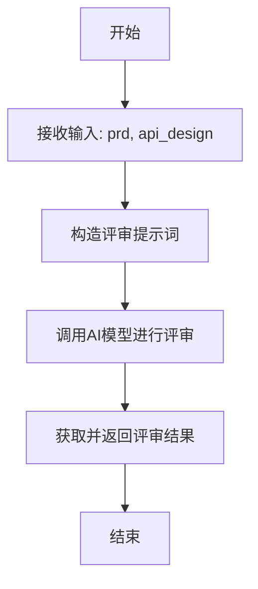
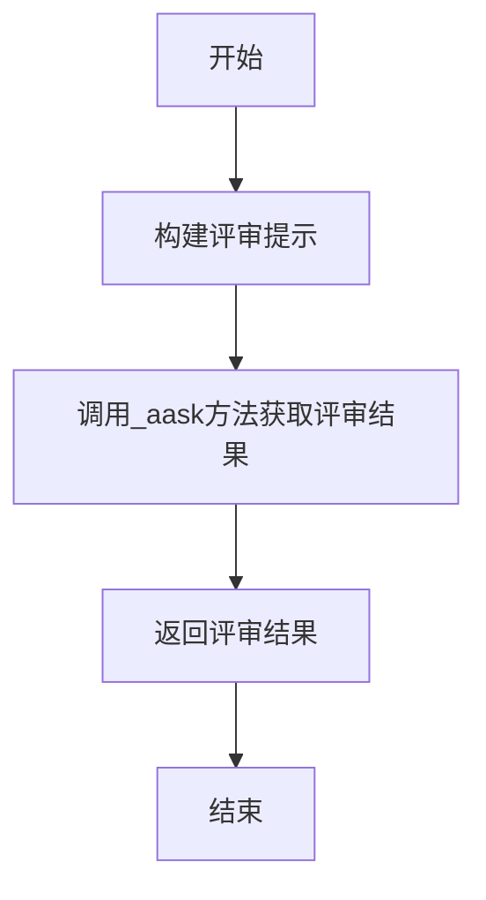

# `.\MetaGPT\metagpt\actions\design_api_review.py` 详细设计文档

该代码定义了一个名为DesignReview的类，继承自Action基类，用于执行API设计评审任务。其核心功能是接收产品需求文档（PRD）和API设计方案，通过构造提示词调用AI模型进行评审，判断API设计是否符合PRD需求以及是否遵循良好的设计实践，并返回评审结果。

## 整体流程



## 类结构

```
Action (基类)
└── DesignReview (API设计评审类)
```

## 全局变量及字段


### `DesignReview.name`
    
该动作的名称，用于标识此动作实例。

类型：`str`
    


### `DesignReview.i_context`
    
可选的上下文信息，用于为动作执行提供额外的背景或输入。

类型：`Optional[str]`
    
    

## 全局函数及方法

### `DesignReview.run`

该方法用于对基于产品需求文档（PRD）设计的API列表进行评审，检查其是否满足PRD的要求以及是否符合良好的设计实践。

参数：

- `prd`：`str`，产品需求文档（PRD）的内容
- `api_design`：`str`，基于PRD设计的API列表

返回值：`str`，返回对API设计的评审结果

#### 流程图



#### 带注释源码

```python
async def run(self, prd, api_design):
    # 构建评审提示，将PRD和API设计内容整合到一个字符串中
    prompt = (
        f"Here is the Product Requirement Document (PRD):\n\n{prd}\n\nHere is the list of APIs designed "
        f"based on this PRD:\n\n{api_design}\n\nPlease review whether this API design meets the requirements"
        f" of the PRD, and whether it complies with good design practices."
    )

    # 调用_aask方法，传入提示，获取AI生成的评审结果
    api_review = await self._aask(prompt)
    
    # 返回评审结果
    return api_review
```

## 关键组件


### Action基类继承

该类继承自`Action`基类，表明它是一个可执行的、具有特定名称和上下文的动作单元，用于在MetaGPT框架中执行设计评审任务。

### 异步执行方法 (`run`)

该方法接收产品需求文档和API设计作为输入，通过构造特定的提示词调用大语言模型进行评审，并异步返回评审结果。这是实现设计评审核心逻辑的关键方法。

### 大语言模型交互 (`_aask`)

这是一个从父类`Action`继承而来的异步方法，负责与底层的大语言模型进行交互，发送构造好的提示词并获取模型的文本回复。它是实现智能评审功能的外部依赖接口。


## 问题及建议


### 已知问题

-   **职责不单一**：`DesignReview` 类继承了 `Action`，但其 `run` 方法不仅负责构建提示词和执行大模型请求，还隐含了“设计评审”这一特定业务逻辑。这违反了单一职责原则，使得该类难以复用或扩展。
-   **输入参数模糊**：`run` 方法的参数 `prd` 和 `api_design` 类型未明确指定（默认为 `Any`），这降低了代码的可读性和类型安全性，调用者容易传递错误格式的数据。
-   **提示词硬编码**：评审逻辑（即提示词模板）直接硬编码在 `run` 方法中。任何对评审标准、格式或流程的修改都需要直接修改源代码，违反了开闭原则，使得维护和定制变得困难。
-   **缺乏结构化输出**：`run` 方法直接返回大模型生成的文本 (`api_review`)。这要求下游调用者必须自行解析非结构化的文本以提取有用信息，增加了系统集成的复杂性和出错风险。
-   **错误处理缺失**：代码中没有对 `_aask` 方法可能抛出的异常（如网络错误、模型服务错误）进行捕获和处理，这可能导致整个评审流程因单点故障而意外中断。
-   **上下文未充分利用**：类中定义了 `i_context` 字段，但在 `run` 方法中并未被使用，这可能是一个未完成的功能或设计上的不一致。

### 优化建议

-   **分离关注点**：将“设计评审”的业务逻辑（如评审标准、规则）从通用的“执行Action”逻辑中分离。可以创建一个专门的 `DesignReviewPromptBuilder` 类来负责构建提示词，使 `DesignReview` 类更专注于流程控制。
-   **明确参数类型**：为 `run` 方法的 `prd` 和 `api_design` 参数添加明确的类型注解（例如 `str` 或特定的 `PrdDocument`、`ApiDesignDocument` 类），并考虑使用Pydantic模型来验证输入数据的结构。
-   **外部化提示词模板**：将提示词模板移至配置文件（如YAML、JSON）或数据库中。这样可以在不修改代码的情况下调整评审逻辑，也便于进行A/B测试或为不同场景配置不同的提示词。
-   **结构化输出**：定义评审结果的数据结构（例如使用Pydantic的 `BaseModel`），包含如“是否通过”、“问题列表”、“改进建议”等字段。修改 `run` 方法，使其调用大模型后，将返回的文本解析并填充到这个结构体中再返回。
-   **增强健壮性**：在 `run` 方法中添加异常处理逻辑，捕获 `_aask` 可能抛出的异常，并记录日志或返回一个包含错误信息的默认评审结果，保证流程的韧性。
-   **利用或移除无用字段**：审查 `i_context` 字段的用途。如果确实需要用于提供额外的评审上下文，则在 `run` 方法中将其整合到提示词中；如果无用，则应将其移除以避免混淆。
-   **引入单元测试**：为 `DesignReview` 类的核心逻辑（如提示词构建、结果解析）编写单元测试，确保其行为符合预期，并为未来的重构提供保障。


## 其它


### 设计目标与约束

本模块的核心设计目标是提供一个自动化的API设计评审机制，作为软件开发生命周期中的一个环节。它旨在接收产品需求文档（PRD）和初步的API设计方案，通过调用大型语言模型（LLM）来评估该方案是否满足PRD的要求以及是否符合良好的设计实践。主要约束包括：1）依赖于外部LLM服务的可用性、性能和成本；2）评审结果的准确性和可操作性完全取决于LLM的能力和提示词（Prompt）的质量；3）作为`Action`抽象的一个具体实现，其运行流程和接口需遵循框架的约定。

### 错误处理与异常设计

当前代码未显式包含错误处理逻辑。潜在的异常点主要发生在`_aask`方法（继承自父类`Action`）与LLM服务交互的过程中，可能包括网络超时、服务不可用、认证失败、上下文长度超限或返回内容解析错误等。这些异常会向上抛出，由调用`DesignReview.run`的上下文（如工作流引擎或上级`Action`）进行统一捕获和处理。模块本身缺乏对LLM返回内容的结构化验证，例如，无法确保`api_review`是一个有效的评审意见字符串。建议未来增加对`_aask`调用异常的捕获，并可能返回一个默认的或错误状态的评审结果，以增强鲁棒性。

### 数据流与状态机

数据流清晰且线性：
1.  **输入**：调用者（通常是另一个`Action`或编排器）将`prd`（字符串）和`api_design`（字符串）传入`run`方法。
2.  **处理**：在`run`方法内部，将输入参数格式化到一个特定的提示词模板中，生成完整的`prompt`（字符串）。
3.  **调用**：通过继承的`_aask`方法，将`prompt`发送给配置的LLM。
4.  **输出**：接收LLM返回的文本响应，作为`api_review`（字符串）直接返回给调用者。
该模块自身无复杂状态，其行为是幂等的，不依赖于内部状态（`i_context`字段当前未在`run`方法中使用）。

### 外部依赖与接口契约

1.  **外部依赖**：
    *   **父类框架**：强依赖于`metagpt.actions.action.Action`基类，特别是其提供的`_aask`异步方法，该方法封装了与具体LLM（如OpenAI GPT、Claude等）的通信细节。
    *   **LLM服务**：间接依赖于一个可用的、已配置的LLM服务提供商。这是模块功能的核心外部依赖。
2.  **接口契约**：
    *   **输入契约**：`run`方法期望`prd`和`api_design`参数为字符串类型，分别代表产品需求文档和API设计文档。虽然类型提示为任意类型，但实际处理中会将其转换为字符串进行拼接。
    *   **输出契约**：`run`方法返回一个字符串，即LLM生成的API评审意见。调用者需要自行解析和理解此非结构化文本。
    *   **继承契约**：作为`Action`子类，必须实现异步`run`方法，并可通过`name`字段标识自身。`i_context`字段的存在表明可能支持更复杂的上下文机制，但当前未激活使用。

### 安全与合规考虑

1.  **数据隐私**：`prd`和`api_design`可能包含敏感的业务逻辑或未公开的产品信息。这些数据会被发送到外部的LLM服务。必须确保LLM服务提供商符合相关的数据隐私法规（如GDPR），并评估数据泄露的风险。在高度敏感的场景下，可能需要使用本地部署的模型或进行数据脱敏。
2.  **提示词注入**：当前代码直接将用户提供的`prd`和`api_design`内容拼接到提示词中。如果这些内容包含特意构造的指令，可能试图“劫持”或误导LLM，导致评审结果出现偏差或执行非预期操作（尽管在评审上下文中危害有限）。建议对输入内容进行基本的清洗或转义。
3.  **结果可信度**：LLM的评审结果不应被视为权威结论，而应作为辅助参考。需要建立人工复核流程，特别是对于关键系统的API设计。模块应明确其结果的“建议”性质。

### 配置与扩展点

1.  **配置**：模块的行为主要受父类`Action`的配置影响，特别是LLM的模型类型、API密钥、基础URL、温度（temperature）等参数。这些通常在框架的更高层级进行配置。
2.  **扩展点**：
    *   **提示词模板**：`run`方法中的`prompt`字符串是硬编码的。这是一个主要的扩展点，可以将其提取为可配置的模板或模板文件，以便根据不同场景（如评审REST API vs. GraphQL）调整评审标准和提问方式。
    *   **评审逻辑**：当前完全依赖LLM。未来可以扩展为混合模式，例如，先通过一组静态规则（如命名规范检查、HTTP方法匹配检查）进行初步筛选，再结合LLM进行语义评审。
    *   **输出格式化**：可以扩展`run`方法，使其不仅返回原始文本，还能尝试将LLM的输出解析为结构化的数据（如JSON，包含“合规性”、“问题列表”、“改进建议”等字段），以便后续自动化处理。

    