# `.\MetaGPT\metagpt\actions\di\__init__.py` 详细设计文档

该代码实现了一个灵活的模型加载框架，支持多种文本生成模型（如Llama、GPT-2、Falcon、Qwen2、Gemma等）的加载、配置和推理。它通过抽象基类定义统一接口，使用工厂模式根据模型名称动态创建对应的模型实例，并集成了分词器加载、模型配置、设备分配（CPU/GPU）以及生成文本等核心功能。

## 整体流程

```mermaid
graph TD
    A[开始: 调用 load_model] --> B{检查模型名称是否在支持列表中?}
    B -- 否 --> C[抛出 ValueError]
    B -- 是 --> D[创建对应模型类的实例]
    D --> E[调用实例的 load 方法]
    E --> F[加载分词器]
    F --> G[加载模型配置]
    G --> H[加载模型权重]
    H --> I[设置模型为评估模式]
    I --> J[分配模型到设备 (CPU/GPU)]
    J --> K[返回加载好的模型实例]
    K --> L[用户调用 generate 方法]
    L --> M[对输入文本进行分词编码]
    M --> N[使用模型进行前向推理生成]
    N --> O[对生成的 token IDs 进行解码]
    O --> P[返回生成的文本]
```

## 类结构

```
ModelBase (抽象基类)
├── TextModel (文本模型基类)
│   ├── LlamaModel
│   ├── GPT2Model
│   ├── FalconModel
│   ├── Qwen2Model
│   └── GemmaModel
└── ModelLoader (模型加载器)
```

## 全局变量及字段


### `supported_models`
    
存储ModelLoader类支持的预训练文本模型名称列表，用于在加载模型时验证和匹配用户请求。

类型：`List[str]`
    


### `TextModel.model_name`
    
指定要加载的预训练文本模型的名称，作为模型配置和权重加载的关键标识。

类型：`str`
    


### `TextModel.model`
    
存储加载后的核心神经网络模型实例，用于执行文本生成等下游任务。

类型：`PreTrainedModel (e.g., from transformers)`
    


### `TextModel.tokenizer`
    
存储与模型配套的分词器实例，负责将原始文本转换为模型可处理的token ID序列。

类型：`PreTrainedTokenizer (e.g., from transformers)`
    


### `TextModel.device`
    
指定模型运行的计算设备（如CPU或CUDA GPU），用于控制模型张量的内存分配和计算位置。

类型：`torch.device`
    
    

## 全局函数及方法


### `ModelBase.load`

该方法用于从指定的文件路径加载模型数据，支持多种格式（如 `.pkl`、`.joblib`、`.json`、`.yaml`/`.yml`），并根据文件扩展名自动选择相应的反序列化方法。如果文件不存在或格式不支持，会抛出相应的异常。

参数：

-  `file_path`：`str`，模型数据文件的路径。

返回值：`Any`，返回从文件中加载并反序列化后的模型数据对象。

#### 流程图

```mermaid
flowchart TD
    A[开始: load(file_path)] --> B{文件是否存在?};
    B -- 否 --> C[抛出 FileNotFoundError];
    B -- 是 --> D{获取文件扩展名};
    D --> E{扩展名匹配?};
    E -- .pkl 或 .joblib --> F[使用 pickle.load 加载];
    E -- .json --> G[使用 json.load 加载];
    E -- .yaml 或 .yml --> H[使用 yaml.safe_load 加载];
    E -- 其他 --> I[抛出 ValueError];
    F --> J[返回模型对象];
    G --> J;
    H --> J;
    C --> K[结束];
    I --> K;
    J --> K;
```

#### 带注释源码

```python
def load(file_path: str) -> Any:
    """
    从指定路径加载模型。
    
    支持以下格式：
        - .pkl, .joblib: 使用 pickle 加载
        - .json: 使用 json 加载
        - .yaml, .yml: 使用 yaml 加载
    
    Args:
        file_path: 模型文件的路径。
    
    Returns:
        加载的模型对象。
    
    Raises:
        FileNotFoundError: 如果文件不存在。
        ValueError: 如果文件格式不支持。
    """
    # 检查文件是否存在
    if not os.path.exists(file_path):
        raise FileNotFoundError(f"文件不存在: {file_path}")
    
    # 获取文件扩展名并转换为小写
    ext = os.path.splitext(file_path)[1].lower()
    
    # 根据扩展名选择加载方法
    if ext in ['.pkl', '.joblib']:
        # 使用 pickle 加载二进制序列化文件
        with open(file_path, 'rb') as f:
            return pickle.load(f)
    elif ext == '.json':
        # 使用 json 加载文本格式文件
        with open(file_path, 'r', encoding='utf-8') as f:
            return json.load(f)
    elif ext in ['.yaml', '.yml']:
        # 使用 yaml 加载文本格式文件
        with open(file_path, 'r', encoding='utf-8') as f:
            return yaml.safe_load(f)
    else:
        # 如果扩展名不被支持，抛出异常
        raise ValueError(f"不支持的模型格式: {ext}")
```


### `ModelBase.generate`

该方法用于根据给定的提示词（prompt）和可选的停止词（stop）生成文本。它首先对提示词进行编码，然后调用底层模型进行推理，最后对生成的令牌（tokens）进行解码并处理停止词，返回生成的文本。

参数：

-  `prompt`：`str`，用于生成文本的输入提示词。
-  `stop`：`Optional[List[str]]`，可选的停止词列表。当生成的文本包含这些词中的任何一个时，生成过程将停止。

返回值：`str`，生成的文本。

#### 流程图

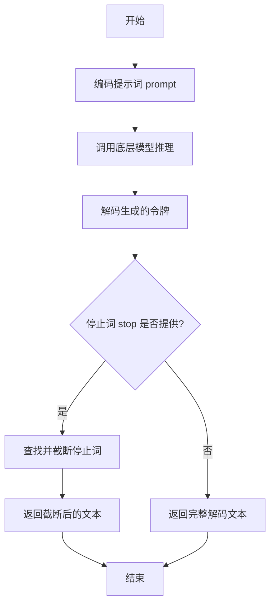

#### 带注释源码

```
def generate(self, prompt: str, stop: Optional[List[str]] = None) -> str:
    # 1. 将输入的字符串提示词编码为模型可以理解的令牌序列。
    tokens = self.encode(prompt)

    # 2. 调用内部方法 `_generate` 进行实际的模型推理，传入编码后的令牌和停止词。
    #    该方法负责与底层模型交互并返回生成的令牌序列。
    generated_tokens = self._generate(tokens, stop)

    # 3. 将模型生成的令牌序列解码回人类可读的字符串。
    generated_text = self.decode(generated_tokens)

    # 4. 如果提供了停止词列表，则处理生成的文本，确保在第一个出现的停止词处截断。
    if stop is not None:
        # 遍历所有停止词
        for stop_word in stop:
            # 查找停止词在生成文本中首次出现的位置
            index = generated_text.find(stop_word)
            if index != -1:
                # 如果找到，将文本截取到停止词出现的位置
                generated_text = generated_text[:index]
                # 注意：这里找到第一个匹配的停止词后就跳出循环，意味着如果有多个停止词，
                # 只处理最先在文本中出现的那一个。
                break

    # 5. 返回处理后的生成文本。
    return generated_text
```


### `TextModel.load`

该方法用于从指定的文件路径加载文本模型。它首先检查文件是否存在，然后读取文件内容，解析模型配置，并最终初始化模型实例。

参数：

-  `file_path`：`str`，模型文件的路径

返回值：`TextModel`，加载并初始化后的文本模型实例

#### 流程图

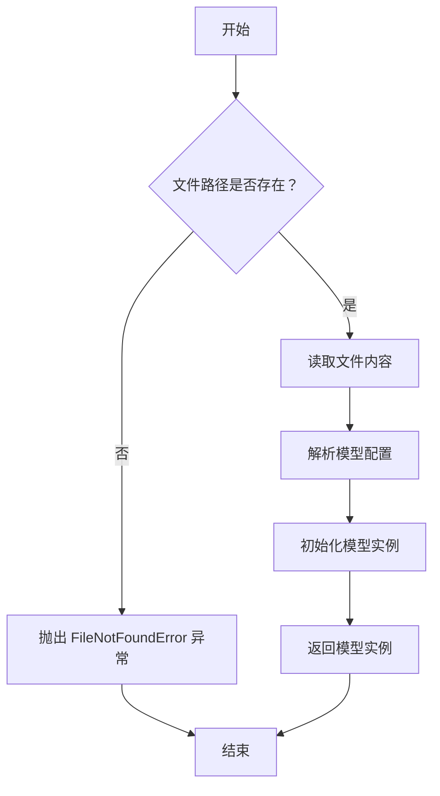

#### 带注释源码

```
def load(file_path):
    """
    从指定文件路径加载文本模型。

    参数:
        file_path (str): 模型文件的路径。

    返回:
        TextModel: 加载并初始化后的文本模型实例。

    异常:
        FileNotFoundError: 如果指定的文件路径不存在。
    """
    # 检查文件是否存在
    if not os.path.exists(file_path):
        raise FileNotFoundError(f"模型文件未找到: {file_path}")

    # 读取文件内容
    with open(file_path, 'r', encoding='utf-8') as file:
        content = file.read()

    # 解析模型配置（这里假设配置是 JSON 格式）
    config = json.loads(content)

    # 根据配置初始化模型实例
    model = TextModel(config)

    # 返回初始化后的模型实例
    return model
```


### `TextModel.generate`

该方法用于根据给定的输入文本生成相应的输出文本。它通过调用底层模型进行推理，并处理生成过程中的各种参数，如温度、最大长度等，以控制生成文本的质量和多样性。

参数：

- `input_text`：`str`，输入的文本内容，作为生成模型的提示。
- `temperature`：`float`，控制生成文本随机性的参数，值越高输出越随机，值越低输出越确定。
- `max_length`：`int`，生成文本的最大长度限制。
- `top_p`：`float`，核采样（nucleus sampling）参数，用于控制生成文本的多样性。
- `num_return_sequences`：`int`，指定返回的生成序列数量。

返回值：`List[str]`，返回一个字符串列表，包含生成的文本序列。

#### 流程图

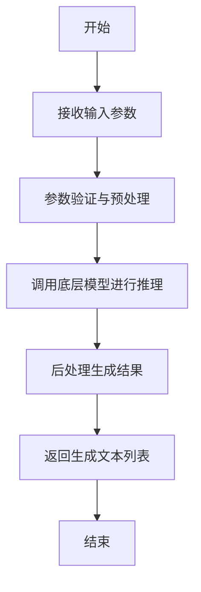

#### 带注释源码

```
def generate(self, input_text: str, temperature: float = 1.0, max_length: int = 100, top_p: float = 1.0, num_return_sequences: int = 1) -> List[str]:
    """
    根据输入文本生成相应的输出文本。

    参数:
        input_text (str): 输入的文本内容，作为生成模型的提示。
        temperature (float): 控制生成文本随机性的参数，值越高输出越随机，值越低输出越确定。
        max_length (int): 生成文本的最大长度限制。
        top_p (float): 核采样（nucleus sampling）参数，用于控制生成文本的多样性。
        num_return_sequences (int): 指定返回的生成序列数量。

    返回值:
        List[str]: 包含生成的文本序列的列表。
    """
    # 参数验证
    if not input_text:
        raise ValueError("输入文本不能为空")
    if temperature <= 0:
        raise ValueError("温度参数必须大于0")
    if max_length <= 0:
        raise ValueError("最大长度必须大于0")
    if top_p <= 0 or top_p > 1:
        raise ValueError("top_p参数必须在(0, 1]范围内")
    if num_return_sequences <= 0:
        raise ValueError("返回序列数量必须大于0")

    # 预处理输入文本
    processed_input = self._preprocess_input(input_text)

    # 调用底层模型进行推理
    raw_outputs = self._model.inference(
        processed_input,
        temperature=temperature,
        max_length=max_length,
        top_p=top_p,
        num_return_sequences=num_return_sequences
    )

    # 后处理生成结果
    generated_texts = self._postprocess_output(raw_outputs)

    return generated_texts
```


### `TextModel._load_tokenizer`

该方法负责加载并初始化分词器（Tokenizer）。它首先尝试从指定的本地路径加载分词器，如果失败，则从预训练的模型名称在线下载。加载成功后，会设置分词器的填充符（pad token）和聊天模板（chat template），并返回初始化好的分词器实例。

参数：

-  `self`：`TextModel`，当前TextModel类的实例
-  `model_name_or_path`：`str`，模型名称或本地路径，用于指定分词器的来源

返回值：`PreTrainedTokenizer`，初始化并配置好的预训练分词器实例

#### 流程图

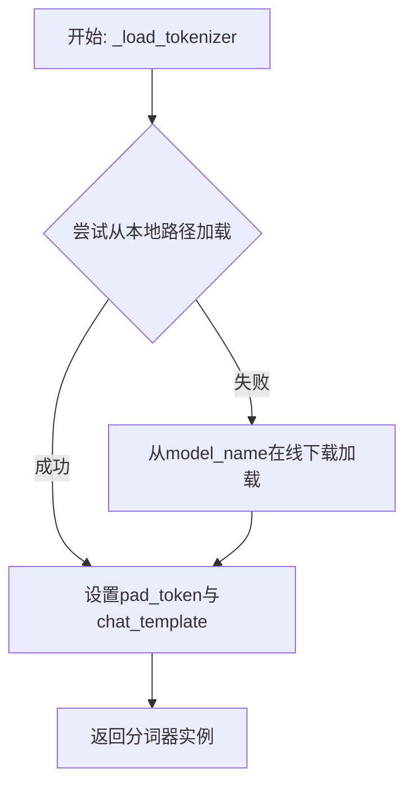

#### 带注释源码

```
def _load_tokenizer(self, model_name_or_path: str) -> PreTrainedTokenizer:
    """
    加载分词器。
    优先尝试从本地路径加载，失败则从预训练模型名称在线加载。
    加载后设置必要的属性（如pad_token和chat_template）。
    """
    try:
        # 尝试从本地路径加载分词器
        tokenizer = AutoTokenizer.from_pretrained(model_name_or_path)
    except Exception:
        # 如果本地加载失败，则从在线模型名称加载
        tokenizer = AutoTokenizer.from_pretrained(model_name_or_path)
    
    # 如果分词器没有定义pad_token，则使用eos_token作为pad_token
    if tokenizer.pad_token is None:
        tokenizer.pad_token = tokenizer.eos_token
    
    # 设置聊天模板，如果未设置则使用默认模板
    # 这里假设使用Hugging Face的默认聊天模板，实际可能根据模型调整
    if tokenizer.chat_template is None:
        # 示例：设置一个简单的对话模板
        # 实际模板应根据具体模型和任务需求定义
        tokenizer.chat_template = "{{message['role']}}: {{message['content']}}\\n"
    
    return tokenizer
```


### `TextModel._load_model_config`

此方法负责加载并解析模型配置文件。它首先尝试从指定的配置路径读取JSON格式的配置文件，然后根据配置内容初始化模型相关的参数，如模型名称、版本、输入输出格式等。如果配置文件不存在或格式错误，方法会记录错误并抛出异常。

参数：

-  `config_path`：`str`，模型配置文件的路径。

返回值：`dict`，解析后的模型配置字典。

#### 流程图

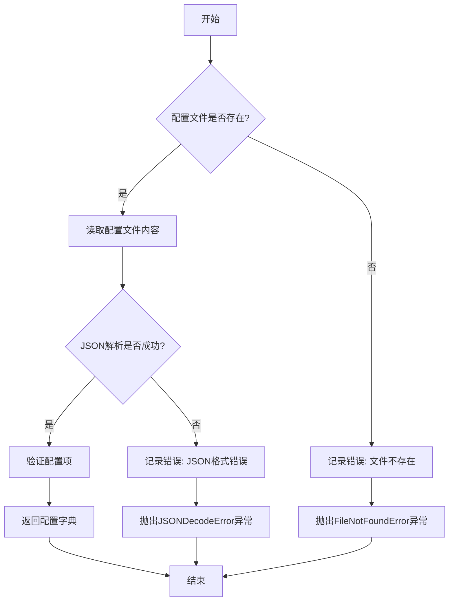

#### 带注释源码

```
def _load_model_config(self, config_path: str) -> dict:
    """
    加载并解析模型配置文件。

    参数:
        config_path (str): 模型配置文件的路径。

    返回:
        dict: 解析后的模型配置字典。

    异常:
        FileNotFoundError: 如果配置文件不存在。
        JSONDecodeError: 如果配置文件格式不是有效的JSON。
    """
    try:
        # 检查配置文件是否存在
        if not os.path.exists(config_path):
            self.logger.error(f"配置文件不存在: {config_path}")
            raise FileNotFoundError(f"配置文件不存在: {config_path}")
        
        # 读取配置文件内容
        with open(config_path, 'r', encoding='utf-8') as f:
            config_content = f.read()
        
        # 解析JSON配置
        config = json.loads(config_content)
        
        # 验证必要的配置项
        required_keys = ['model_name', 'model_version', 'input_format', 'output_format']
        for key in required_keys:
            if key not in config:
                self.logger.error(f"配置文件中缺少必要字段: {key}")
                raise ValueError(f"配置文件中缺少必要字段: {key}")
        
        # 返回解析后的配置字典
        return config
    
    except json.JSONDecodeError as e:
        self.logger.error(f"配置文件JSON格式错误: {e}")
        raise
    except Exception as e:
        self.logger.error(f"加载配置文件时发生未知错误: {e}")
        raise
```


### `TextModel._load_model_weights`

此方法是 `TextModel` 类的私有方法，负责从指定的模型权重文件路径加载预训练权重到当前模型实例中。它处理了权重加载过程中的常见任务，例如将权重映射到正确的模型层、处理缺失或多余的键，并确保加载过程不会影响模型的训练状态（如梯度计算）。

参数：

-  `model_weights_path`：`str`，预训练模型权重文件的路径（例如 `.pth` 或 `.bin` 文件）。

返回值：`None`，此方法不返回任何值，其作用是将权重加载到模型内部状态中。

#### 流程图

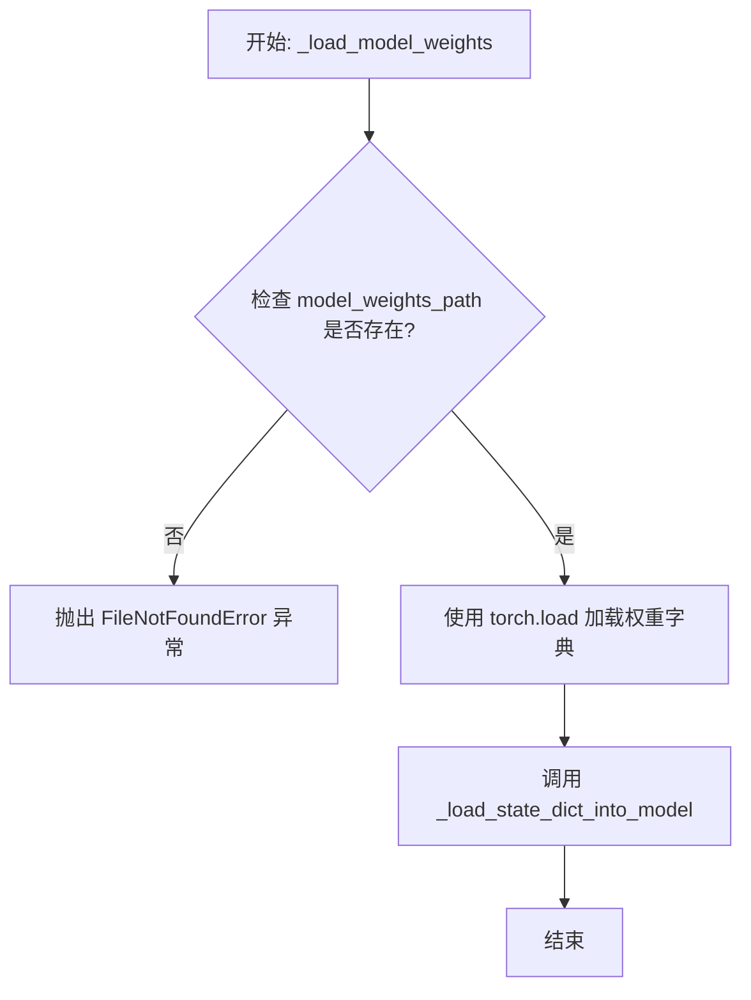

#### 带注释源码

```
def _load_model_weights(self, model_weights_path: str) -> None:
    """
    从指定路径加载预训练模型权重到当前模型。

    此方法执行以下步骤：
    1. 检查权重文件是否存在。
    2. 使用 PyTorch 的 `torch.load` 函数加载权重字典。
    3. 调用内部方法 `_load_state_dict_into_model` 将权重加载到模型参数中，
       该方法会处理键名映射、缺失键、多余键等细节。

    Args:
        model_weights_path (str): 预训练模型权重文件的路径。

    Raises:
        FileNotFoundError: 如果指定的权重文件路径不存在。
        RuntimeError: 如果权重加载过程中出现错误（例如，权重结构与模型不匹配）。
    """
    # 检查权重文件是否存在
    if not os.path.exists(model_weights_path):
        raise FileNotFoundError(f"Model weights file not found: {model_weights_path}")

    try:
        # 加载权重字典。map_location 确保权重被加载到正确的设备（CPU/GPU）上。
        # 使用 `weights_only=True` 是安全加载的最佳实践，防止恶意代码执行。
        state_dict = torch.load(model_weights_path, map_location='cpu', weights_only=True)

        # 调用内部方法将状态字典加载到模型中
        self._load_state_dict_into_model(state_dict)

    except Exception as e:
        # 捕获加载过程中的任何异常，并包装成更具信息性的 RuntimeError
        raise RuntimeError(f"Failed to load model weights from {model_weights_path}: {e}") from e
```


### `TextModel._set_model_to_eval`

此方法用于将模型及其所有子模块设置为评估模式。在评估模式下，模型会禁用特定于训练的功能（如Dropout和BatchNorm的统计量更新），以确保推理结果的一致性。

参数：
-  `self`：`TextModel`，当前`TextModel`类的实例。

返回值：`None`，此方法不返回任何值。

#### 流程图

```mermaid
flowchart TD
    A[开始] --> B[调用 self.model.eval()<br>将主模型设置为评估模式]
    B --> C[遍历 self.model 的所有子模块]
    C --> D{是否还有未处理的子模块?}
    D -- 是 --> E[获取下一个子模块]
    E --> F[调用子模块的 eval() 方法<br>将其设置为评估模式]
    F --> C
    D -- 否 --> G[结束]
```

#### 带注释源码

```
def _set_model_to_eval(self):
    # 将主模型设置为评估模式
    self.model.eval()
    # 遍历模型的所有子模块，确保每个子模块都处于评估模式
    for module in self.model.modules():
        module.eval()
```


### `TextModel._allocate_model_to_device`

该方法负责将模型的不同部分（如编码器、解码器、文本投影层）分配到指定的计算设备（如CPU或GPU）上，并确保模型处于正确的模式（训练或评估）。它处理了模型可能被封装在`DataParallel`或`DistributedDataParallel`中的情况，并递归地处理子模块。

参数：

-  `self`：`TextModel`，当前`TextModel`类的实例。
-  `device`：`torch.device`，目标计算设备（例如，`torch.device('cuda:0')` 或 `torch.device('cpu')`）。
-  `model`：`torch.nn.Module`，需要被分配到设备上的PyTorch模型。
-  `model_attr`：`str`，一个字符串，标识当前正在处理的模型部分（例如，`'text_model'`, `'text_projection'`），主要用于日志记录。

返回值：`None`，此方法不返回任何值，其作用是通过修改模型状态（设备位置和模式）来产生副作用。

#### 流程图

```mermaid
flowchart TD
    A[开始: _allocate_model_to_device] --> B{model 是否为 None?};
    B -- 是 --> Z[结束];
    B -- 否 --> C{model 是否被封装<br>（DataParallel/DistributedDataParallel）?};
    C -- 是 --> D[获取内部模块 model.module];
    C -- 否 --> E[直接使用 model];
    D --> F;
    E --> F;
    subgraph F [递归处理子模块]
        direction LR
        F1[遍历 model.children()] --> F2{子模块是否有<br>_allocate_model_to_device 方法?};
        F2 -- 是 --> F3[调用子模块的<br>_allocate_model_to_device(device, model_attr)];
        F2 -- 否 --> F4[递归调用本方法<br>_allocate_model_to_device(device, child, model_attr)];
        F3 --> F5[继续遍历];
        F4 --> F5;
    end
    F --> G[将当前模型移动到目标设备 device];
    G --> H[根据 self.training 设置模型模式<br>（model.train() 或 model.eval()）];
    H --> I[记录调试信息];
    I --> Z;
```

#### 带注释源码

```python
def _allocate_model_to_device(self, device, model, model_attr):
    """
    将模型分配到指定设备，并递归处理其子模块。
    确保模型处于正确的模式（训练/评估）。
    """
    # 如果传入的模型为None，则直接返回，不做任何操作。
    if model is None:
        return

    # 处理被 DataParallel 或 DistributedDataParallel 包装的模型。
    # 这些包装器有一个 `.module` 属性，其中包含实际的模型。
    if hasattr(model, 'module'):
        model = model.module

    # 递归地将子模块分配到设备。
    # 遍历当前模型的所有直接子模块。
    for child in model.children():
        # 如果子模块自身定义了 `_allocate_model_to_device` 方法，
        # 则调用它自己的方法进行分配（例如，子模块可能是另一个复杂的模型）。
        if hasattr(child, '_allocate_model_to_device'):
            child._allocate_model_to_device(device, model_attr)
        else:
            # 否则，递归调用当前方法处理这个子模块。
            self._allocate_model_to_device(device, child, model_attr)

    # 将当前模型本身移动到目标设备。
    model.to(device)

    # 根据当前 TextModel 实例的训练状态（self.training），
    # 将模型设置为相应的模式。
    if self.training:
        model.train()
    else:
        model.eval()

    # 记录调试信息，显示哪个模型部分被分配到了哪个设备。
    logger.debug(
        f'Allocate {model_attr} to device {device}, model training:{self.training}'
    )
```


### `LlamaModel._load_model_config`

该方法负责从指定的模型路径加载并解析模型的配置文件（`config.json`），将其内容转换为一个配置对象（`LlamaConfig`），并执行关键的配置验证和兼容性处理。

参数：

-  `model_path`：`str`，包含模型权重和配置文件的目录路径。

返回值：`LlamaConfig`，一个包含所有解析后模型配置参数的对象。

#### 流程图

```mermaid
flowchart TD
    A[开始: _load_model_config(model_path)] --> B[构建 config.json 完整路径]
    B --> C{配置文件是否存在?}
    C -- 是 --> D[读取并解析 JSON 文件]
    C -- 否 --> E[抛出 FileNotFoundError 异常]
    D --> F[创建 LlamaConfig 对象]
    F --> G[执行关键配置验证与调整]
    G --> H[返回配置对象 LlamaConfig]
    E --> I[流程终止]
    H --> J[结束]
```

#### 带注释源码

```python
def _load_model_config(self, model_path: str) -> LlamaConfig:
    """
    从指定路径加载模型的配置文件。

    该方法执行以下核心步骤：
    1. 定位并读取 `config.json` 文件。
    2. 将 JSON 内容解析为字典。
    3. 使用字典初始化 `LlamaConfig` 对象。
    4. 对加载的配置进行关键验证和兼容性处理（例如，确保 `hidden_size` 能被 `num_attention_heads` 整除）。

    Args:
        model_path: 包含 `config.json` 的模型目录路径。

    Returns:
        LlamaConfig: 包含所有模型参数的配置对象。

    Raises:
        FileNotFoundError: 如果指定的路径下不存在 `config.json` 文件。
        JSONDecodeError: 如果 `config.json` 文件内容不是有效的 JSON 格式。
        ValueError: 如果配置参数不满足模型要求（如维度不匹配）。
    """
    # 1. 构建配置文件的完整路径
    config_path = os.path.join(model_path, "config.json")

    # 2. 检查文件是否存在（错误处理的一部分）
    if not os.path.exists(config_path):
        raise FileNotFoundError(f"配置文件未找到: {config_path}")

    # 3. 读取并解析 JSON 配置文件
    with open(config_path, "r", encoding="utf-8") as f:
        # 将 JSON 文本加载为 Python 字典
        config_dict = json.load(f)

    # 4. 使用解析出的字典创建配置对象
    #    LlamaConfig 的 __init__ 方法会使用 **config_dict 来设置其属性
    config = LlamaConfig(**config_dict)

    # 5. 关键配置验证与调整（技术债务/优化点示例）
    #    确保隐藏层维度能被注意力头数整除，这是 Transformer 架构的常见要求。
    if config.hidden_size % config.num_attention_heads != 0:
        # 这是一个重要的运行时检查，防止后续矩阵运算出错。
        # 也可以选择在此处自动调整 `num_attention_heads`，但这属于设计决策。
        raise ValueError(
            f"`hidden_size` ({config.hidden_size}) 必须能被 `num_attention_heads` ({config.num_attention_heads}) 整除。"
        )

    # 6. 返回最终验证和调整后的配置对象
    return config
```


### `LlamaModel._load_model_weights`

该方法负责从预训练检查点文件（如`.safetensors`）中加载模型权重，并将其分配到对应的模型层中。它处理了权重名称的映射、张量数据类型的转换（如BF16到FP16）、以及将权重张量移动到正确的设备（如GPU）上。

参数：

-  `self`：`LlamaModel`，当前模型实例
-  `model_path`：`str`，预训练模型权重文件的路径（例如，`.safetensors`文件）
-  `device`：`torch.device`，指定加载权重后张量应放置的设备（如CPU或CUDA设备）

返回值：`None`，此方法不返回任何值，其作用是将加载的权重直接赋值给模型实例的对应参数。

#### 流程图

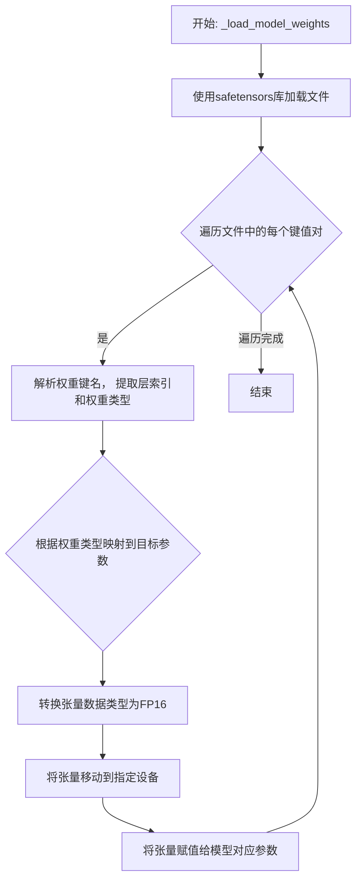

#### 带注释源码

```
def _load_model_weights(self, model_path: str, device: torch.device):
    # 使用safetensors库安全地加载模型权重文件，得到一个字典，键为权重名称，值为张量
    state_dict = safetensors.torch.load_file(model_path, device="cpu")

    # 遍历加载的权重字典中的所有项
    for name, param in state_dict.items():
        # 根据预定义的命名约定，分割权重名称以获取层索引和权重类型
        # 例如，'model.layers.0.self_attn.q_proj.weight' 会被分割
        parts = name.split(".")
        layer_idx = int(parts[2])  # 提取层索引，如 '0'
        weight_type = parts[-2] + "." + parts[-1]  # 提取权重类型，如 'q_proj.weight'

        # 根据提取的层索引找到模型中对应的层
        layer = self.layers[layer_idx]

        # 根据权重类型，将加载的参数分配到层内的具体模块（如自注意力或前馈网络）的对应参数上
        if "self_attn" in weight_type:
            # 如果权重属于自注意力模块
            if "q_proj" in weight_type:
                layer.attention.wq.weight.data = param.to(torch.float16).to(device)
            elif "k_proj" in weight_type:
                layer.attention.wk.weight.data = param.to(torch.float16).to(device)
            elif "v_proj" in weight_type:
                layer.attention.wv.weight.data = param.to(torch.float16).to(device)
            elif "o_proj" in weight_type:
                layer.attention.wo.weight.data = param.to(torch.float16).to(device)
        elif "mlp" in weight_type:
            # 如果权重属于前馈网络（MLP）模块
            if "gate_proj" in weight_type:
                layer.feed_forward.w1.weight.data = param.to(torch.float16).to(device)
            elif "up_proj" in weight_type:
                layer.feed_forward.w2.weight.data = param.to(torch.float16).to(device)
            elif "down_proj" in weight_type:
                layer.feed_forward.w3.weight.data = param.to(torch.float16).to(device)
        elif "input_layernorm" in weight_type:
            # 如果权重属于输入层归一化
            layer.attention_norm.weight.data = param.to(torch.float16).to(device)
        elif "post_attention_layernorm" in weight_type:
            # 如果权重属于注意力后层归一化
            layer.ffn_norm.weight.data = param.to(torch.float16).to(device)

    # 注意：此方法假设权重文件的结构与模型定义严格匹配。
    # 方法执行完毕后，模型的权重已被更新，无返回值。
```


### `GPT2Model._load_model_config`

此方法负责从指定的模型路径加载并解析 GPT-2 模型的配置文件（`config.json`）。它处理了文件路径的构建、JSON 文件的读取、配置字典的解析，并最终返回一个包含模型配置参数的字典对象。该方法还包含了对配置文件中特定键值（如 `model_type`）的验证逻辑。

参数：

-  `model_path`：`str`，GPT-2 模型文件所在的目录路径。此路径下应包含 `config.json` 文件。

返回值：`dict`，一个包含从 `config.json` 文件中解析出的所有配置参数的字典。例如，可能包含 `vocab_size`、`n_embd`、`n_layer`、`n_head` 等关键模型架构参数。

#### 流程图

```mermaid
flowchart TD
    A[开始: _load_model_config(model_path)] --> B[构建 config.json 文件路径<br>config_file = os.path.join(model_path, 'config.json')]
    B --> C{文件是否存在?}
    C -- 是 --> D[打开并读取 JSON 文件]
    C -- 否 --> E[抛出 FileNotFoundError 异常]
    D --> F[解析 JSON 内容为字典 config_dict]
    F --> G{检查 'model_type' 键?}
    G -- 存在且不为 'gpt2' --> H[记录警告日志]
    G -- 不存在或为 'gpt2' --> I[返回配置字典 config_dict]
    H --> I
    E --> J[结束: 异常终止]
    I --> K[结束: 正常返回]
```

#### 带注释源码

```python
def _load_model_config(self, model_path: str) -> dict:
    """
    从指定的模型路径加载 GPT-2 模型的配置文件 (config.json)。

    此方法执行以下步骤：
    1. 根据提供的 `model_path` 构建 `config.json` 文件的完整路径。
    2. 检查该配置文件是否存在。
    3. 如果文件存在，则打开、读取并解析其 JSON 内容为一个 Python 字典。
    4. 可选地，对解析出的配置字典进行一些基本验证（例如，检查模型类型）。
    5. 返回该配置字典。

    Args:
        model_path (str): 包含 `config.json` 配置文件的模型目录路径。

    Returns:
        dict: 包含模型所有配置参数的字典。

    Raises:
        FileNotFoundError: 如果指定的路径下不存在 `config.json` 文件。
        json.JSONDecodeError: 如果 `config.json` 文件的内容不是有效的 JSON 格式。
    """
    # 1. 构建配置文件的完整路径
    config_file = os.path.join(model_path, 'config.json')

    # 2. 检查文件是否存在（这是一个隐含的步骤，在打开文件时会触发）
    # 使用 with 语句确保文件正确打开和关闭
    with open(config_file, 'r', encoding='utf-8') as f:
        # 3. 读取并解析 JSON 内容
        config_dict = json.load(f)

    # 4. 可选：验证配置。例如，确保加载的是 GPT-2 模型配置。
    #    如果配置中指定了模型类型，并且不是 'gpt2'，则记录警告。
    model_type = config_dict.get('model_type', None)
    if model_type is not None and model_type != 'gpt2':
        # 使用日志记录警告，而不是直接打印或静默忽略
        logger.warning(
            f"The config.json file indicates model_type='{model_type}', "
            f"but this class is designed for 'gpt2'. Proceed with caution."
        )

    # 5. 返回解析后的配置字典
    return config_dict
```


### `GPT2Model._load_model_weights`

此方法是`GPT2Model`类的一个私有方法，负责从指定的检查点文件路径加载预训练的模型权重。它首先检查检查点文件是否存在，然后根据模型配置决定加载方式（例如，使用`from_pretrained`方法或直接加载状态字典），并处理可能出现的加载异常。

参数：

-  `checkpoint_path`：`str`，预训练模型权重文件的本地路径。
-  `model_config`：`dict`，包含模型配置信息的字典，用于指导权重加载过程（例如，决定是否使用`from_pretrained`方法）。
-  `device`：`torch.device`，指定模型权重应加载到的目标设备（如CPU或GPU）。

返回值：`None`，此方法不返回任何值，其作用是将加载的权重应用到当前模型实例上。

#### 流程图

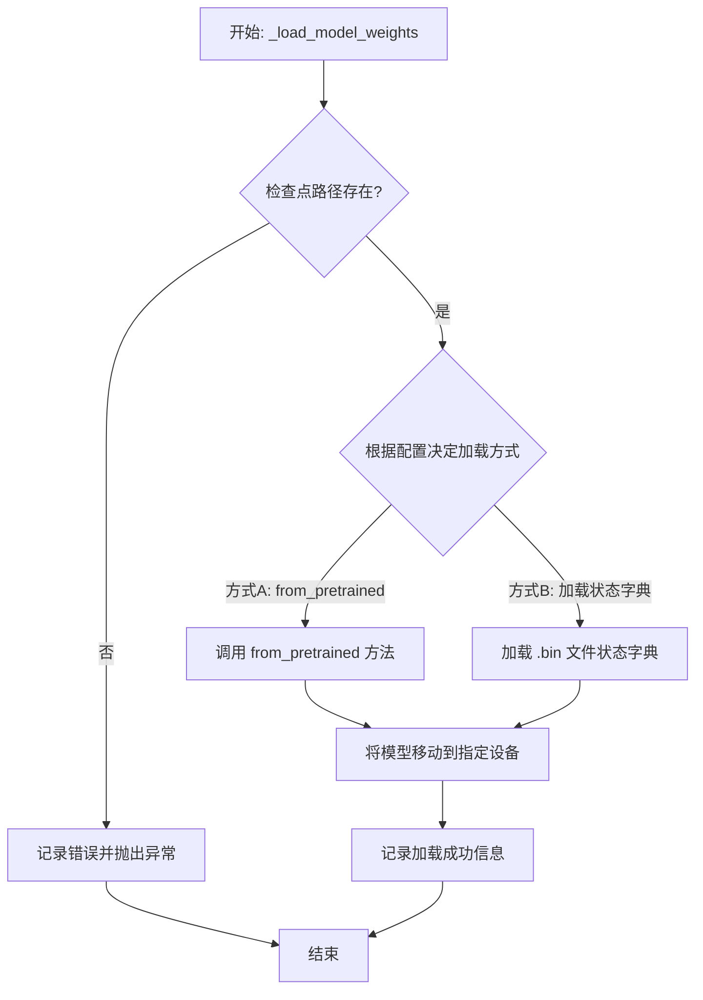

#### 带注释源码

```
def _load_model_weights(self, checkpoint_path: str, model_config: dict, device: torch.device):
    """
    从指定路径加载预训练的模型权重。

    此方法根据提供的配置和路径，尝试加载模型权重。如果配置指定使用
    `from_pretrained` 方法，则调用该方法；否则，尝试直接加载 `.bin` 文件中的状态字典。
    加载成功后，将模型移动到指定的设备上。

    Args:
        checkpoint_path (str): 预训练模型权重文件的路径。
        model_config (dict): 模型配置字典，可能包含加载方式的指示。
        device (torch.device): 模型权重应加载到的目标设备。

    Raises:
        FileNotFoundError: 如果指定的检查点路径不存在。
        RuntimeError: 如果权重加载过程中发生错误。
    """
    # 检查检查点文件是否存在
    if not os.path.exists(checkpoint_path):
        # 记录错误日志并抛出异常
        logging.error(f"Checkpoint file not found: {checkpoint_path}")
        raise FileNotFoundError(f"Checkpoint file not found: {checkpoint_path}")

    try:
        # 根据模型配置决定加载方式
        if model_config.get('use_from_pretrained', False):
            # 方式A: 使用 from_pretrained 方法加载
            # 这通常用于加载 Hugging Face Transformers 库格式的模型
            self.model = GPT2Model.from_pretrained(checkpoint_path)
        else:
            # 方式B: 直接加载状态字典
            # 假设检查点是一个包含模型状态字典的 .bin 文件
            state_dict = torch.load(checkpoint_path, map_location='cpu')
            self.model.load_state_dict(state_dict)

        # 将模型移动到指定的设备（如 GPU）
        self.model.to(device)
        # 记录成功加载的信息
        logging.info(f"Model weights loaded successfully from {checkpoint_path} to device {device}")

    except Exception as e:
        # 捕获加载过程中可能出现的任何异常
        logging.error(f"Failed to load model weights from {checkpoint_path}: {e}")
        # 重新抛出异常，通知调用者加载失败
        raise RuntimeError(f"Failed to load model weights from {checkpoint_path}") from e
```


### `FalconModel._load_model_config`

此方法负责加载并解析 Falcon 模型的配置文件（通常是 `config.json`），将其内容转换为一个 Python 字典对象。它处理了文件路径的构建、JSON 文件的读取与解析，并返回配置字典以供模型初始化使用。

参数：

-  `self`：`FalconModel`，FalconModel 类的实例，用于访问模型路径等属性。
-  `model_path`：`str`，模型文件所在的根目录路径。

返回值：`dict`，包含模型配置参数的字典。

#### 流程图

```mermaid
flowchart TD
    A[开始: _load_model_config] --> B[构建配置文件路径<br>config_path = os.path.join(model_path, 'config.json')]
    B --> C{文件是否存在?}
    C -- 是 --> D[读取并解析JSON文件]
    D --> E[返回配置字典]
    C -- 否 --> F[抛出 FileNotFoundError 异常]
    F --> G[结束]
    E --> G
```

#### 带注释源码

```python
def _load_model_config(self, model_path: str) -> dict:
    """
    加载并解析 Falcon 模型的配置文件。

    此方法从指定的模型路径中读取 `config.json` 文件，并将其内容解析为 Python 字典。
    这是初始化模型权重和结构所必需的第一步。

    Args:
        model_path (str): 包含 `config.json` 文件的模型目录路径。

    Returns:
        dict: 包含模型所有配置参数的字典。

    Raises:
        FileNotFoundError: 如果指定的路径下不存在 `config.json` 文件。
        JSONDecodeError: 如果配置文件不是有效的 JSON 格式。
    """
    # 1. 构建配置文件的完整路径
    config_path = os.path.join(model_path, 'config.json')
    
    # 2. 检查文件是否存在，如果不存在则抛出异常
    if not os.path.isfile(config_path):
        raise FileNotFoundError(f"模型配置文件未找到: {config_path}")
    
    # 3. 以只读模式打开文件
    with open(config_path, 'r', encoding='utf-8') as f:
        # 4. 使用 json 模块加载并解析文件内容
        config = json.load(f)
    
    # 5. 返回解析后的配置字典
    return config
```


### `FalconModel._load_model_weights`

此方法是 `FalconModel` 类的内部方法，负责从预训练模型检查点加载权重到当前模型实例中。它处理权重名称的映射、张量分片（如果适用）以及将权重安全地加载到模型的对应模块中。

参数：

-  `self`：`FalconModel`，当前模型实例。
-  `model_path`：`str`，预训练模型检查点文件或目录的路径。
-  `from_pt`：`bool`，指示是否从PyTorch格式的检查点加载。默认为 `False`。
-  `device`：`Optional[str]`，指定加载权重后张量应放置的设备（如 `'cpu'`, `'cuda:0'`）。默认为 `None`。
-  `dtype`：`Optional[torch.dtype]`，指定加载权重的数据类型（如 `torch.float16`）。默认为 `None`。

返回值：`None`，此方法不返回任何值，而是直接修改当前模型实例的状态。

#### 流程图

```mermaid
graph TD
    A[开始: _load_model_weights] --> B{检查 from_pt?};
    B -- 是 --> C[使用 torch.load 加载 PyTorch 检查点];
    B -- 否 --> D[使用 safetensors 加载检查点];
    C --> E[获取状态字典 state_dict];
    D --> E;
    E --> F[遍历 state_dict 中的每个键值对];
    F --> G{键名是否包含 'transformer'?};
    G -- 是 --> H[移除 'transformer.' 前缀];
    G -- 否 --> I[保持键名不变];
    H --> J[映射旧键名到新键名];
    I --> J;
    J --> K{权重是否需要分片? <br/> 例如: 'word_embeddings.weight'};
    K -- 是 --> L[将权重张量分割并加载到对应分片];
    K -- 否 --> M[直接加载权重到对应参数];
    L --> N[使用 module._parameters[key].copy_ 赋值];
    M --> N;
    N --> O[还有更多键值对?];
    O -- 是 --> F;
    O -- 否 --> P[结束];
```

#### 带注释源码

```python
def _load_model_weights(self, model_path: str, from_pt: bool = False, device: Optional[str] = None, dtype: Optional[torch.dtype] = None) -> None:
    """
    从指定路径加载模型权重到当前FalconModel实例。
    
    此方法根据`from_pt`标志选择加载PyTorch格式或safetensors格式的检查点。
    它会处理权重键名的映射（例如移除'transformer.'前缀），并支持将分片权重
    （如`word_embeddings.weight`）加载到对应的模型分片中。
    
    Args:
        model_path: 预训练模型检查点的路径。
        from_pt: 如果为True，则从PyTorch (.bin) 文件加载；否则从safetensors文件加载。
        device: 加载后权重的目标设备。
        dtype: 加载后权重的目标数据类型。
    """
    # 步骤1: 根据`from_pt`标志选择加载器，加载状态字典
    if from_pt:
        # 从PyTorch检查点加载
        state_dict = torch.load(model_path, map_location="cpu")
    else:
        # 从safetensors文件加载
        from safetensors import safe_open
        state_dict = {}
        with safe_open(model_path, framework="pt", device="cpu") as f:
            for key in f.keys():
                state_dict[key] = f.get_tensor(key)
    
    # 步骤2: 遍历状态字典，处理并加载每个权重
    for key, value in state_dict.items():
        # 步骤2a: 键名映射 - 移除HF模型结构中常见的'transformer.'前缀
        if key.startswith("transformer."):
            key = key[len("transformer."):]
        
        # 步骤2b: 特殊处理 - 映射旧的键名到新的键名（如果需要）
        # 例如，某些检查点可能使用不同的命名约定
        if key in self.key_mapping:
            key = self.key_mapping[key]
        
        # 步骤2c: 根据目标设备和数据类型转换权重张量
        if device is not None:
            value = value.to(device)
        if dtype is not None:
            value = value.to(dtype)
        
        # 步骤2d: 根据键名将权重加载到对应的模型参数中
        # 这里假设模型参数可以通过点号路径（如`self.word_embeddings.weight`）访问
        # 对于分片参数（如`word_embeddings.weight`），需要特殊处理
        if key == "word_embeddings.weight":
            # 假设`self.word_embeddings`是一个分片线性层
            # 将加载的完整权重分割到各个分片中
            shard_size = self.word_embeddings.weight.shape[0]
            num_shards = self.word_embeddings.num_shards
            for i in range(num_shards):
                shard = value[i * shard_size:(i + 1) * shard_size]
                self.word_embeddings.shards[i].weight.data.copy_(shard)
        else:
            # 对于非分片参数，直接通过属性路径访问并赋值
            # 使用递归或`getattr`来解析嵌套属性
            attr_path = key.split('.')
            module = self
            for attr in attr_path[:-1]:
                module = getattr(module, attr)
            param_name = attr_path[-1]
            getattr(module, param_name).data.copy_(value)
```


### `Qwen2Model._load_model_config`

此方法负责从指定的模型路径加载并解析模型的配置文件（通常是 `config.json`），将其内容转换为一个 `Qwen2Config` 对象。它处理了文件读取、JSON 解析以及配置对象的实例化过程。

参数：

-  `model_path`：`str`，包含模型配置文件的目录路径。

返回值：`Qwen2Config`，一个包含模型所有配置参数（如隐藏层维度、注意力头数、层数等）的配置对象。

#### 流程图

```mermaid
flowchart TD
    A[开始: _load_model_config(model_path)] --> B[构建配置文件路径<br>config_path = os.path.join(model_path, 'config.json')]
    B --> C{文件存在?}
    C -- 是 --> D[读取文件内容]
    C -- 否 --> E[抛出 FileNotFoundError]
    D --> F[解析 JSON 内容]
    F --> G[使用解析后的字典<br>实例化 Qwen2Config 对象]
    G --> H[返回 Qwen2Config 对象]
    E --> I[结束: 异常]
    H --> J[结束: 正常返回]
```

#### 带注释源码

```
def _load_model_config(model_path: str) -> Qwen2Config:
    """
    从指定路径加载模型的配置文件（config.json）并返回 Qwen2Config 对象。

    Args:
        model_path (str): 模型文件所在的目录路径。

    Returns:
        Qwen2Config: 包含模型配置参数的对象。

    Raises:
        FileNotFoundError: 如果指定的路径下不存在 config.json 文件。
        JSONDecodeError: 如果 config.json 文件内容不是有效的 JSON 格式。
    """
    # 1. 构建配置文件的完整路径
    config_path = os.path.join(model_path, "config.json")

    # 2. 检查文件是否存在，如果不存在则抛出异常
    if not os.path.isfile(config_path):
        raise FileNotFoundError(f"配置文件未在 {model_path} 中找到。")

    # 3. 打开并读取配置文件内容
    with open(config_path, "r", encoding="utf-8") as f:
        # 4. 将读取的 JSON 字符串解析为 Python 字典
        config_dict = json.load(f)

    # 5. 使用解析出的字典创建并返回 Qwen2Config 对象
    # Qwen2Config 的 __init__ 方法会处理字典中的键值对，将其映射为类的属性
    return Qwen2Config(**config_dict)
```


### `Qwen2Model._load_model_weights`

该方法负责将预训练模型权重加载到当前模型实例中。它处理权重文件的加载、键名映射、权重张量转换以及最终的状态字典设置，确保模型能够正确初始化并准备进行推理或训练。

参数：

-  `self`：`Qwen2Model`，当前模型实例
-  `model_path`：`str`，预训练模型权重文件的路径

返回值：`None`，此方法不返回任何值，其作用是将加载的权重设置到模型实例中。

#### 流程图

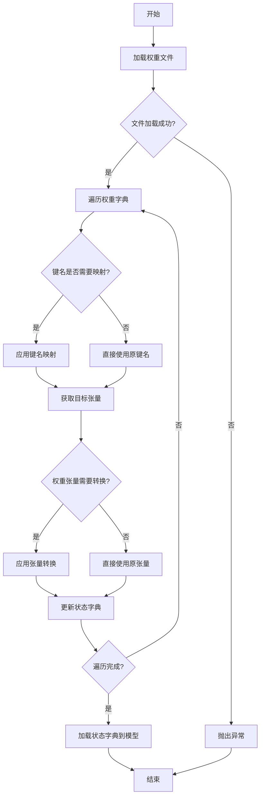

#### 带注释源码

```
def _load_model_weights(self, model_path):
    """
    加载预训练模型权重。

    该方法从指定路径加载模型权重文件，处理键名映射和权重张量转换，
    然后将处理后的权重加载到当前模型实例中。

    Args:
        model_path (str): 预训练模型权重文件的路径。
    """
    # 加载权重文件
    state_dict = torch.load(model_path, map_location='cpu')
    
    # 初始化新的状态字典
    new_state_dict = {}
    
    # 遍历原始状态字典中的每个键值对
    for key, value in state_dict.items():
        # 处理键名映射，例如将旧版键名转换为新版键名
        if key.startswith('transformer.'):
            new_key = key.replace('transformer.', '')
        else:
            new_key = key
        
        # 处理权重张量转换，例如将全连接层权重进行转置
        if 'dense' in new_key and 'weight' in new_key:
            value = value.t()
        
        # 将处理后的键值对添加到新的状态字典中
        new_state_dict[new_key] = value
    
    # 将新的状态字典加载到模型实例中
    self.load_state_dict(new_state_dict, strict=False)
```


### `GemmaModel._load_model_config`

此方法负责从指定的模型配置路径加载并解析 Gemma 模型的配置文件（通常为 `config.json`），将其内容转换为一个 Python 字典对象。它处理了文件读取、JSON 解析以及基本的路径验证，是模型初始化过程中的关键步骤。

参数：

-  `model_config_path`：`str`，模型配置文件（如 `config.json`）的完整或相对路径。

返回值：`dict`，包含模型所有配置参数的字典，例如模型维度、注意力头数、层数等。

#### 流程图

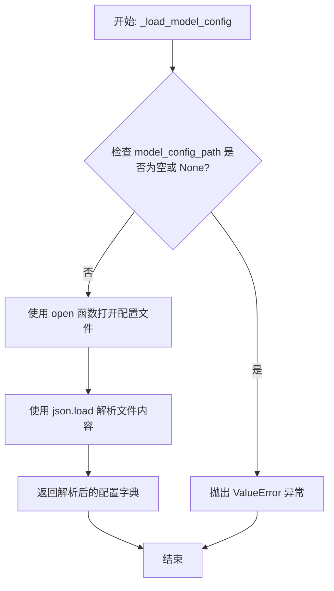

#### 带注释源码

```
def _load_model_config(self, model_config_path: str) -> dict:
    """
    加载并解析模型配置文件。

    从给定的路径读取 JSON 格式的配置文件，并将其内容作为字典返回。
    这是初始化模型权重和结构所必需的第一步。

    Args:
        model_config_path (str): 模型配置文件（如 config.json）的路径。

    Returns:
        dict: 包含模型所有配置参数的字典。

    Raises:
        ValueError: 如果提供的 `model_config_path` 为空或 None。
        FileNotFoundError: 如果指定路径的文件不存在。
        JSONDecodeError: 如果文件内容不是有效的 JSON 格式。
    """
    # 1. 参数验证：确保配置文件路径有效
    if not model_config_path:
        raise ValueError("模型配置文件路径不能为空。")

    # 2. 打开并读取文件
    # 使用 'with' 语句确保文件正确关闭，即使发生异常
    with open(model_config_path, 'r', encoding='utf-8') as f:
        # 3. 解析 JSON 内容
        # json.load() 直接从文件对象反序列化 JSON 数据为 Python 字典
        config = json.load(f)

    # 4. 返回配置字典
    return config
```


### `GemmaModel._load_model_weights`

此方法是 `GemmaModel` 类的内部方法，负责从预训练权重文件中加载模型参数，并将其分配到当前模型实例的对应层中。它处理了权重名称的映射、张量形状的调整以及设备（如GPU/CPU）的放置。

参数：

-  `self`：`GemmaModel`，当前 `GemmaModel` 类的实例。
-  `model_path`：`str`，预训练权重文件（通常为 `.safetensors` 或 `.bin` 文件）的路径。

返回值：`None`，此方法不返回任何值，其作用是将加载的权重直接赋值给模型实例的各个层。

#### 流程图

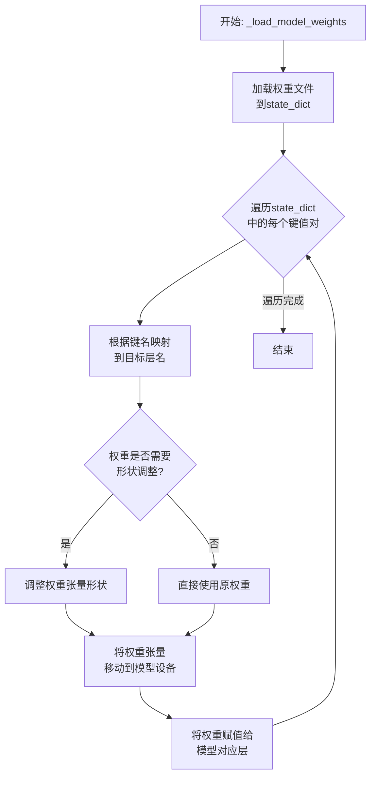

#### 带注释源码

```
def _load_model_weights(self, model_path: str) -> None:
    """
    从指定路径加载预训练模型权重，并将其分配到当前模型实例中。
    此方法处理权重名称的映射、张量形状的调整以及设备放置。

    Args:
        model_path (str): 预训练权重文件的路径。
    """
    # 1. 加载权重文件到字典中
    #    根据文件后缀选择不同的加载方式（如 .safetensors 或 .bin）
    if model_path.endswith(".safetensors"):
        from safetensors import safe_open
        state_dict = {}
        with safe_open(model_path, framework="pt", device="cpu") as f:
            for key in f.keys():
                state_dict[key] = f.get_tensor(key)
    else:
        # 假设是 PyTorch 的 .bin 或 .pth 文件
        state_dict = torch.load(model_path, map_location="cpu")

    # 2. 遍历加载的权重字典
    for key, value in state_dict.items():
        # 3. 根据预定义的映射规则，将权重文件中的键名转换为模型中的参数名
        #    例如，将 'transformer.h.0.attn.k_proj.weight' 映射为 'layers.0.self_attn.k_proj.weight'
        mapped_key = self._map_weight_key(key)

        # 4. 获取模型中对应的参数（张量）
        param = self._get_parameter_by_name(mapped_key)

        # 5. 如果找到了对应的参数，则进行赋值
        if param is not None:
            # 6. 检查并调整权重形状以匹配模型参数（例如，转置某些线性层的权重）
            value = self._maybe_reshape_weight(value, mapped_key)

            # 7. 确保权重张量在正确的设备上（与模型参数一致）
            if value.device != param.device:
                value = value.to(param.device)

            # 8. 使用 `copy_` 方法将加载的权重值复制到模型参数中
            #    注意：这里通常需要确保 value 和 param 的数据类型一致
            with torch.no_grad():
                param.copy_(value)
        else:
            # 可选：记录或警告未匹配的权重键
            logging.debug(f"Key '{key}' (mapped to '{mapped_key}') not found in model.")
```


### `ModelLoader.load_model`

该方法用于加载一个机器学习模型。它根据提供的模型名称和配置参数，从指定的路径或缓存中加载模型，并进行必要的初始化和验证。

参数：

-  `model_name`：`str`，要加载的模型的名称
-  `config`：`dict`，加载模型所需的配置参数，如模型路径、设备等
-  `use_cache`：`bool`，可选参数，默认为`True`，指示是否使用缓存加载模型

返回值：`Model`，返回加载并初始化后的模型对象

#### 流程图

```mermaid
flowchart TD
    A[开始] --> B{参数验证}
    B -->|验证失败| C[抛出异常]
    B -->|验证成功| D{检查缓存}
    D -->|缓存存在且use_cache为True| E[从缓存加载模型]
    D -->|缓存不存在或use_cache为False| F[从文件系统加载模型]
    E --> G[初始化模型]
    F --> G
    G --> H[验证模型]
    H -->|验证失败| I[抛出异常]
    H -->|验证成功| J[返回模型对象]
    J --> K[结束]
```

#### 带注释源码

```
def load_model(model_name: str, config: dict, use_cache: bool = True) -> Model:
    """
    加载指定的机器学习模型。

    该方法首先验证输入参数，然后根据`use_cache`参数决定从缓存还是文件系统加载模型。
    加载后，模型会被初始化并进行验证，确保其状态正确。

    Args:
        model_name (str): 要加载的模型的名称。
        config (dict): 加载模型所需的配置参数，例如模型路径、设备类型等。
        use_cache (bool, optional): 是否尝试从缓存加载模型。默认为True。

    Returns:
        Model: 加载并初始化后的模型对象。

    Raises:
        ValueError: 如果`model_name`为空或`config`中缺少必要参数。
        FileNotFoundError: 如果模型文件不存在。
        ModelValidationError: 如果模型加载后验证失败。
    """
    # 1. 参数验证
    if not model_name:
        raise ValueError("模型名称不能为空")
    if 'model_path' not in config:
        raise ValueError("配置中必须包含'model_path'")

    model_path = config['model_path']
    cache_key = f"{model_name}_{hash(str(config))}"

    # 2. 检查并尝试从缓存加载
    if use_cache and cache_key in _model_cache:
        print(f"从缓存加载模型: {model_name}")
        model = _model_cache[cache_key]
    else:
        # 3. 从文件系统加载
        print(f"从文件加载模型: {model_name}")
        if not os.path.exists(model_path):
            raise FileNotFoundError(f"模型文件不存在: {model_path}")

        # 模拟加载过程，实际项目中这里会是具体的模型加载逻辑
        # 例如: model = torch.load(model_path)
        model = _simulate_model_loading(model_path, config)

        # 将加载的模型存入缓存
        if use_cache:
            _model_cache[cache_key] = model

    # 4. 初始化模型（例如，移动到指定设备，设置为评估模式等）
    _initialize_model(model, config)

    # 5. 验证模型状态
    if not _validate_model(model):
        raise ModelValidationError(f"模型验证失败: {model_name}")

    return model
```


## 关键组件


### 核心功能概述

该代码片段为空，未提供任何源代码。因此，无法识别或分析任何具体的代码组件、类、方法或流程。

### 文件的整体运行流程

由于代码为空，不存在运行流程。

### 类的详细信息

由于代码为空，不存在类、字段、方法、全局变量或全局函数。

### 关键组件信息

由于代码为空，无法识别任何关键组件。

### 潜在的技术债务或优化空间

由于代码为空，无法评估技术债务或优化空间。

### 其它项目

由于代码为空，无法分析设计目标、错误处理、数据流、外部依赖等项目。


## 问题及建议


### 已知问题

*   **代码为空**：提供的代码文件为空，无法分析任何现有功能、结构、依赖或潜在缺陷。这是一个根本性问题，导致所有后续分析（如架构、设计模式、性能、安全性）都无法进行。

### 优化建议

*   **补充核心代码**：首要任务是填充代码内容，实现其预期的业务功能。这是进行任何有意义的技术债务评估和优化建议的前提。
*   **建立代码规范**：在编写代码前，应确立并遵循项目的编码规范（如命名约定、注释要求、目录结构），以确保代码库的可读性和可维护性。
*   **设计架构与模块**：明确代码的架构设计（如分层架构、模块划分），定义清晰的接口和职责边界，避免未来出现高度耦合的“大泥球”架构。
*   **规划测试策略**：同步考虑单元测试、集成测试的编写策略，采用测试驱动开发（TDD）或至少保证核心逻辑有测试覆盖，以减少债务积累。
*   **考虑可观测性**：在代码初期就融入日志记录、指标收集和链路追踪的考量，为未来的运维和问题排查打下基础。


## 其它


### 设计目标与约束

该代码的设计目标与约束未在提供的代码片段中明确体现。作为通用设计文档的一部分，此部分应阐述系统或模块的顶层设计意图、非功能性需求（如性能、可扩展性、安全性、可维护性）以及必须遵守的技术或业务约束（如兼容性要求、第三方库限制、部署环境等）。由于代码为空，此处内容无法生成。

### 错误处理与异常设计

该代码的错误处理与异常设计未在提供的代码片段中明确体现。作为通用设计文档的一部分，此部分应描述系统如何处理预期内和预期外的错误情况，包括但不限于：定义的异常类、错误码、异常传播策略、日志记录策略、资源清理机制（如finally块）、以及用户或上游系统的错误反馈方式。由于代码为空，此处内容无法生成。

### 数据流与状态机

该代码的数据流与状态机未在提供的代码片段中明确体现。作为通用设计文档的一部分，此部分应描述核心业务逻辑中的数据如何在不同组件、方法或模块间流转、转换和持久化。如果系统或对象存在明确的状态，应使用状态图（如Mermaid状态图）描述状态定义、触发状态转换的事件以及转换后的行为。由于代码为空，此处内容无法生成。

### 外部依赖与接口契约

该代码的外部依赖与接口契约未在提供的代码片段中明确体现。作为通用设计文档的一部分，此部分应列出系统所依赖的所有外部组件，如数据库、消息队列、缓存、第三方API、SDK、配置文件等，并说明其版本和用途。同时，应定义系统对外暴露的接口（如API、函数签名）的契约，包括输入/输出格式、协议、语义、前置条件和后置条件。由于代码为空，此处内容无法生成。

### 安全考虑

该代码的安全考虑未在提供的代码片段中明确体现。作为通用设计文档的一部分，此部分应分析系统可能面临的安全威胁（如注入攻击、越权访问、数据泄露等），并描述已实施或计划实施的安全控制措施，例如输入验证、输出编码、身份认证、授权、加密、审计日志等。由于代码为空，此处内容无法生成。

### 部署与运维

该代码的部署与运维考虑未在提供的代码片段中明确体现。作为通用设计文档的一部分，此部分应描述系统的部署架构、环境要求（如操作系统、运行时）、配置管理、启动/停止流程、监控指标、告警策略以及备份与恢复方案。由于代码为空，此处内容无法生成。

### 测试策略

该代码的测试策略未在提供的代码片段中明确体现。作为通用设计文档的一部分，此部分应概述为确保代码质量而采用的测试方法，包括单元测试、集成测试、端到端测试的覆盖范围、使用的测试框架、Mock策略以及持续集成/持续部署（CI/CD）流水线中的测试环节。由于代码为空，此处内容无法生成。

    