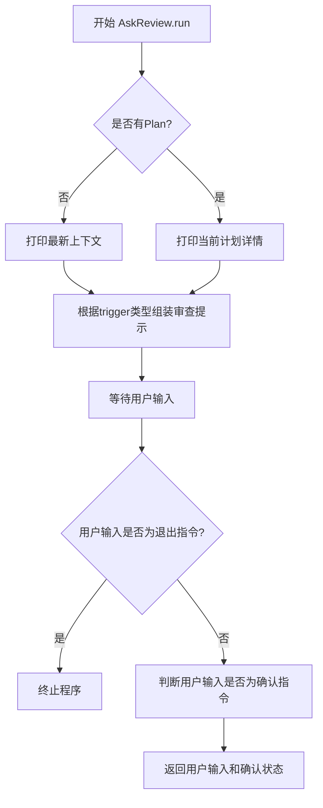
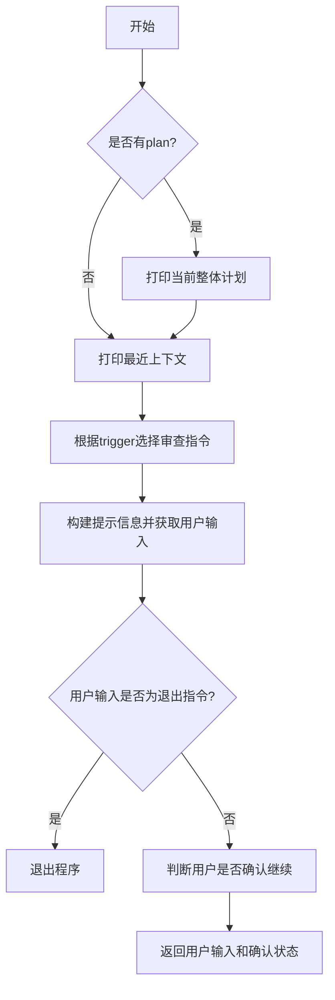

# `.\MetaGPT\metagpt\actions\di\ask_review.py` 详细设计文档

该代码实现了一个名为`AskReview`的动作类，其核心功能是在任务执行或代码生成的关键节点暂停，向人类用户展示当前计划或最新上下文，并请求用户进行审查。用户可以根据提示确认继续、提出修改建议或终止整个流程。这是一个典型的人机交互审查机制，用于在自动化流程中引入人工监督和控制。

## 整体流程



## 类结构

```
ReviewConst (常量类)
AskReview (动作类)
└── run (异步方法)
```

## 全局变量及字段


### `ReviewConst.TASK_REVIEW_TRIGGER`
    
标识任务审查流程的触发类型字符串常量。

类型：`str`
    


### `ReviewConst.CODE_REVIEW_TRIGGER`
    
标识代码审查流程的触发类型字符串常量。

类型：`str`
    


### `ReviewConst.CONTINUE_WORDS`
    
表示用户确认继续操作的关键词列表。

类型：`list[str]`
    


### `ReviewConst.CHANGE_WORDS`
    
表示用户请求更改操作的关键词列表。

类型：`list[str]`
    


### `ReviewConst.EXIT_WORDS`
    
表示用户请求退出流程的关键词列表。

类型：`list[str]`
    


### `ReviewConst.TASK_REVIEW_INSTRUCTION`
    
在任务审查阶段向用户展示的操作指南文本。

类型：`str`
    


### `ReviewConst.CODE_REVIEW_INSTRUCTION`
    
在代码审查阶段向用户展示的操作指南文本。

类型：`str`
    


### `ReviewConst.EXIT_INSTRUCTION`
    
向用户展示的退出流程操作指南文本。

类型：`str`
    
    

## 全局函数及方法

### `AskReview.run`

该方法用于执行人工审查流程，根据给定的触发类型（任务审查或代码审查）向用户展示相关信息并获取其输入。根据用户的输入，判断是确认继续、请求更改还是退出程序，并返回用户的原始输入和确认状态。

参数：

- `context`：`list[Message]`，消息上下文列表，用于获取最近的上下文信息
- `plan`：`Plan`，计划对象，用于展示当前的整体任务计划
- `trigger`：`str`，触发类型，决定是任务审查还是代码审查，默认为任务审查

返回值：`Tuple[str, bool]`，返回用户输入的原始字符串和一个布尔值，表示用户是否确认继续

#### 流程图



#### 带注释源码

```python
async def run(
    self, context: list[Message] = [], plan: Plan = None, trigger: str = ReviewConst.TASK_REVIEW_TRIGGER
) -> Tuple[str, bool]:
    # 如果有计划对象，打印当前整体计划
    if plan:
        logger.info("Current overall plan:")
        logger.info(
            "\n".join(
                [f"{task.task_id}: {task.instruction}, is_finished: {task.is_finished}" for task in plan.tasks]
            )
        )

    # 打印最近的上下文信息
    logger.info("Most recent context:")
    latest_action = context[-1].cause_by if context and context[-1].cause_by else ""
    # 根据触发类型选择相应的审查指令
    review_instruction = (
        ReviewConst.TASK_REVIEW_INSTRUCTION
        if trigger == ReviewConst.TASK_REVIEW_TRIGGER
        else ReviewConst.CODE_REVIEW_INSTRUCTION
    )
    # 构建提示信息
    prompt = (
        f"This is a <{trigger}> review. Please review output from {latest_action}\n"
        f"{review_instruction}\n"
        f"{ReviewConst.EXIT_INSTRUCTION}\n"
        "Please type your review below:\n"
    )

    # 获取用户输入
    rsp = await get_human_input(prompt)

    # 如果用户输入为退出指令，退出程序
    if rsp.lower() in ReviewConst.EXIT_WORDS:
        exit()

    # 判断用户是否确认继续
    # 确认可以是"confirm", "continue", "c", "yes", "y"中的任意一个，或者包含"confirm"的句子
    confirmed = rsp.lower() in ReviewConst.CONTINUE_WORDS or ReviewConst.CONTINUE_WORDS[0] in rsp.lower()

    # 返回用户输入和确认状态
    return rsp, confirmed
```

## 关键组件


### ReviewConst 常量类

一个用于集中管理代码审查和任务审查相关提示信息、触发器和用户响应关键词的常量类，定义了任务审查和代码审查的触发条件、用户确认/更改/退出指令的文本内容。

### AskReview 动作类

一个继承自 Action 的异步动作类，负责在任务执行或代码生成的关键节点向用户发起审查请求，根据用户输入判断是确认继续、要求修改还是终止流程，并返回用户的原始反馈和确认状态。

### 用户交互与流程控制

通过 `get_human_input` 函数获取用户输入，并根据 `ReviewConst` 中定义的规则（如 `CONTINUE_WORDS`, `CHANGE_WORDS`, `EXIT_WORDS`）解析用户意图，实现对任务计划或代码生成流程的交互式控制。


## 问题及建议


### 已知问题

-   **硬编码的退出机制**：`AskReview.run` 方法中直接调用 `exit()` 来终止整个 Python 进程。这是一种过于强硬且不灵活的错误处理方式，会中断整个程序的正常流程，使得上层调用者无法进行任何清理或恢复操作。
-   **字符串匹配逻辑存在歧义**：确认逻辑 `confirmed = rsp.lower() in ReviewConst.CONTINUE_WORDS or ReviewConst.CONTINUE_WORDS[0] in rsp.lower()` 存在潜在问题。后半部分 `ReviewConst.CONTINUE_WORDS[0] in rsp.lower()` 意味着只要用户输入中包含 `"confirm"` 这个子串（例如 `"I do not confirm"`），就会被判定为确认，这可能导致意外的行为。
-   **缺乏输入验证与清理**：代码直接使用 `get_human_input` 的原始返回，未对输入进行任何验证（如去除首尾空格、处理空输入）或规范化处理，可能影响后续逻辑的稳定性。
-   **上下文依赖风险**：`run` 方法中通过 `context[-1]` 直接访问列表最后一个元素，如果 `context` 为空列表，将导致 `IndexError` 异常。虽然代码有 `if context` 检查，但 `context[-1].cause_by` 的访问在 `context` 非空但最后一个元素没有 `cause_by` 属性时也可能出错。
-   **常量类设计僵化**：`ReviewConst` 类中的常量（如 `CONTINUE_WORDS`, `CHANGE_WORDS`）是硬编码的。如果需要支持多语言或动态配置，当前设计难以扩展。

### 优化建议

-   **使用异常替代直接退出**：建议将 `exit()` 替换为抛出一个自定义的、清晰的异常（例如 `HumanReviewExitException`）。这样，上层调用者可以捕获此异常并决定是优雅地终止当前操作、记录日志还是回滚事务，从而提升系统的健壮性和可控性。
-   **优化确认逻辑**：重构确认逻辑，使其更精确。例如，可以首先检查输入是否完全匹配 `CONTINUE_WORDS` 列表中的词，如果不匹配，再检查输入是否以这些词开头或遵循特定的确认句式，避免子串匹配的歧义。
-   **增强输入处理**：在调用 `get_human_input` 后，对返回的字符串 `rsp` 进行基本的清理（如 `strip()`），并检查是否为空。可以为空输入定义默认行为（如视为确认或要求重新输入）。
-   **加强上下文访问的安全性**：在访问 `context[-1]` 之前，进行更严格的检查。例如，使用 `if context and hasattr(context[-1], 'cause_by'):` 来确保安全访问属性，或者提供默认值。
-   **将常量配置化**：考虑将 `ReviewConst` 中的可配置项（如触发词、指令模板）移出代码，放入配置文件（如 YAML、JSON）或环境变量中。这样可以在不修改代码的情况下调整行为，便于测试和国际化。
-   **提升代码可测试性**：当前 `run` 方法直接调用了 `get_human_input`（一个 I/O 操作）和 `exit()`，使得单元测试非常困难。建议通过依赖注入（例如，将输入函数作为参数传入）来解耦，以便在测试中模拟用户输入和退出行为。
-   **丰富指令与交互**：`TASK_REVIEW_INSTRUCTION` 和 `CODE_REVIEW_INSTRUCTION` 的文本可以更详细，提供更具体的示例。同时，可以考虑在用户输入无效时，提供友好的错误提示并重新提示输入，而不是直接进入默认的确认或退出流程。


## 其它


### 设计目标与约束

本模块的核心设计目标是提供一个可交互的、用于任务和代码审查的机制，允许人类用户在自动化流程的关键节点进行干预、确认或提出修改意见。主要约束包括：1) 必须与现有的 `Action` 框架无缝集成，遵循其异步运行模式；2) 用户交互界面需简洁明了，提供清晰的指令；3) 需要处理多种用户输入语义（确认、修改、退出），并做出正确的逻辑判断；4) 审查过程不应阻塞主流程，但需要等待用户输入。

### 错误处理与异常设计

当前代码的错误处理较为基础。主要风险点及处理方式如下：
1.  **输入/输出错误**：`get_human_input` 函数可能因I/O问题抛出异常，但当前代码未进行捕获，异常会向上层传播。
2.  **上下文索引错误**：当传入的 `context` 列表为空时，`context[-1]` 的索引操作会引发 `IndexError`。代码通过 `if context and context[-1].cause_by` 进行了防护，但逻辑上 `context[-1]` 在 `context` 为空时已出错。应优先检查 `context` 是否非空。
3.  **退出操作**：用户输入退出指令时，直接调用 `exit()`。这会终止整个Python解释器进程，是一种非常强硬的退出方式，可能不符合所有应用场景的优雅退出需求（例如，可能需要清理资源或向上层返回特定状态）。
4.  **计划（Plan）为空**：当 `plan` 参数为 `None` 时，代码跳过计划展示部分，这是可接受的行为。

### 数据流与状态机

本模块的数据流和状态转换相对简单：
1.  **输入数据流**：
    *   `context`: 消息上下文列表，用于获取最近的动作信息。
    *   `plan`: 当前的任务计划对象，用于展示整体任务状态。
    *   `trigger`: 字符串，决定本次审查的类型（`"task"` 或 `"code"`），从而选择不同的提示指令。
2.  **内部状态转换**：
    *   根据 `trigger` 选择 `review_instruction`。
    *   组合 `prompt` 并调用 `get_human_input` 进入**等待用户输入**状态。
3.  **输出与状态判定**：
    *   接收用户输入 `rsp`。
    *   **退出状态**：若 `rsp` 匹配 `EXIT_WORDS`，则调用 `exit()`。
    *   **确认状态**：通过逻辑判断 `confirmed`（精确匹配 `CONTINUE_WORDS` 或字符串包含 `"confirm"`）。
    *   返回 `(rsp, confirmed)` 二元组。
4.  **状态机简述**：模块本身不维护持久状态。其行为类似于一个**决策函数**，根据输入和用户反馈，输出原始反馈和确认布尔值，由调用者决定后续流程（继续、修改或终止）。

### 外部依赖与接口契约

1.  **外部依赖**：
    *   `metagpt.actions.Action`: 基类，`AskReview` 继承自它，必须实现 `run` 方法。
    *   `metagpt.logs.get_human_input`: 异步函数，用于从标准输入获取用户反馈。其接口契约是接收一个提示字符串并返回用户输入的字符串。
    *   `metagpt.logs.logger`: 日志记录器，用于输出信息。
    *   `metagpt.schema.Message`, `metagpt.schema.Plan`: 数据结构类，作为输入参数的类型约束。
2.  **接口契约（`AskReview.run` 方法）**：
    *   **调用者责任**：提供 `context`（可为空列表）、`plan`（可为None）和 `trigger`（默认为 `"task"`）。
    *   **提供者保证**：返回一个包含用户原始输入字符串和确认状态布尔值的元组。除非用户触发退出（`exit()`），否则应正常返回。
    *   **副作用**：向标准输出打印审查提示和计划/上下文信息；可能因用户输入退出指令而终止进程。

### 安全与合规考虑

1.  **输入验证**：当前对用户输入 `rsp` 仅进行小写转换和关键词匹配，没有进行内容清洗或验证。如果 `rsp` 被用于构造后续命令或查询（虽然在本模块内未发生），可能存在注入风险。调用者应对返回的 `rsp` 字符串保持警惕。
2.  **进程终止**：`exit()` 的使用需谨慎。在生产环境或作为服务的一部分时，强制终止进程可能不符合服务管理规范，应考虑通过返回特殊状态码或抛出特定异常来让上层业务逻辑处理退出请求。
3.  **信息泄露**：通过 `logger.info` 打印的 `plan` 和 `context` 可能包含敏感信息。需要确保日志输出级别和目的地配置得当，避免敏感数据泄露到不安全的日志存储中。
4.  **用户体验与无障碍**：交互提示是纯文本的，且指令较为复杂（包含多个选项）。对于非技术用户或无障碍场景，可以考虑提供更结构化、更清晰的交互方式。

### 测试策略建议

1.  **单元测试**：
    *   **分支覆盖**：测试 `trigger` 为 `"task"` 和 `"code"` 时，提示信息的正确性。
    *   **输入处理**：模拟 `get_human_input` 返回各种字符串，验证 `confirmed` 的判定逻辑（精确匹配、包含“confirm”、其他内容）。
    *   **边界条件**：测试 `context` 为空列表、`plan` 为 `None` 的情况。
    *   **退出逻辑**：测试输入退出指令时的行为（需模拟 `exit()`，例如通过 `unittest.mock.patch`）。
2.  **集成测试**：将 `AskReview` 与调用它的工作流结合，测试完整的交互场景，包括确认后继续、提出修改意见后流程如何衔接等。
3.  **模拟（Mocking）**：重点模拟 `get_human_input` 以提供可控的测试输入，并模拟 `logger` 来验证输出内容。

    