# `.\MetaGPT\metagpt\actions\di\execute_nb_code.py` 详细设计文档

该代码定义了一个名为 `ExecuteNbCode` 的 `Action` 类，其核心功能是执行 Jupyter Notebook 代码块。它通过创建和管理一个定制的 `NotebookClient` (`RealtimeOutputNotebookClient`) 来异步执行 Python 或 Markdown 代码，实时捕获并处理执行输出（包括标准输出、错误、图像等），将结果格式化后返回给调用者（如 LLM），并支持在终端或 IPython 环境中可视化显示代码和输出。

## 整体流程

```mermaid
graph TD
    A[开始: ExecuteNbCode.run 被调用] --> B{语言类型?}
    B -- Markdown --> C[添加 Markdown Cell 到 Notebook]
    C --> D[返回 Markdown 内容, 成功标志为 True]
    B -- Python --> E[添加 Python Code Cell 到 Notebook]
    E --> F[构建/启动 Notebook 内核]
    F --> G[异步执行 Cell]
    G --> H{执行结果?}
    H -- 成功 --> I[解析输出: 过滤日志, 处理图像等]
    H -- 超时 --> J[中断内核, 返回超时错误]
    H -- 内核死亡 --> K[重置内核, 返回 DeadKernelError]
    H -- 其他异常 --> L[解析异常输出]
    I --> M[处理特殊命令 (pip/git clone) 的输出截断]
    L --> M
    J --> N[返回错误信息]
    K --> N
    M --> O[保存 Notebook 到文件]
    O --> P[返回解析后的输出和成功标志]
```

## 类结构

```
Action (基类，来自 metagpt.actions)
└── ExecuteNbCode
    └── 依赖关系
        ├── RealtimeOutputNotebookClient (继承自 nbclient.NotebookClient)
        └── NotebookReporter (来自 metagpt.utils.report)
```

## 全局变量及字段


### `INSTALL_KEEPLEN`
    
定义安装命令输出截取的长度，用于限制pip或git clone等命令的输出显示长度。

类型：`int`
    


### `INI_CODE`
    
初始化代码字符串，用于在Jupyter内核启动时执行，设置日志级别和警告过滤以优化执行环境。

类型：`str`
    


### `RealtimeOutputNotebookClient.notebook_reporter`
    
用于实时报告Jupyter Notebook执行输出的报告器实例，负责处理和转发执行过程中的消息。

类型：`NotebookReporter`
    


### `ExecuteNbCode.nb`
    
表示当前操作的Jupyter Notebook对象，存储代码单元格、Markdown单元格及其执行结果。

类型：`NotebookNode`
    


### `ExecuteNbCode.nb_client`
    
自定义的Notebook客户端实例，负责管理内核生命周期、执行代码单元格并实时捕获输出。

类型：`RealtimeOutputNotebookClient`
    


### `ExecuteNbCode.console`
    
Rich库的控制台对象，用于在终端或交互式环境中格式化输出代码和Markdown内容。

类型：`Console`
    


### `ExecuteNbCode.interaction`
    
标识当前运行环境的交互类型（如'ipython'或'terminal'），影响图像显示等输出方式。

类型：`str`
    


### `ExecuteNbCode.timeout`
    
代码单元格执行的超时时间（秒），超过此时间将中断执行以防止无限循环或长时间运行。

类型：`int`
    


### `ExecuteNbCode.reporter`
    
Notebook执行过程的报告器，用于异步报告执行状态、输出内容和文件路径等信息。

类型：`NotebookReporter`
    


### `ExecuteNbCode.init_called`
    
标记初始化代码是否已执行的标志，确保INI_CODE仅在首次执行时运行以避免重复初始化。

类型：`bool`
    
    

## 全局函数及方法

### `remove_log_and_warning_lines`

该函数用于清理输入字符串，移除包含特定日志和警告关键词的行，以净化输出内容。

参数：

- `input_str`：`str`，需要处理的原始字符串，可能包含日志和警告信息。

返回值：`str`，处理后的字符串，移除了包含指定关键词的行。

#### 流程图

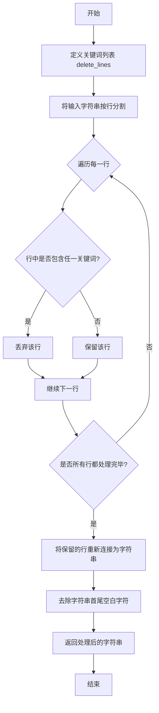

#### 带注释源码

```python
def remove_log_and_warning_lines(input_str: str) -> str:
    # 定义需要删除的日志和警告关键词列表（不区分大小写）
    delete_lines = ["[warning]", "warning:", "[cv]", "[info]"]
    
    # 将输入字符串按换行符分割成行列表
    # 使用列表推导式过滤掉那些包含delete_lines中任一关键词的行（转换为小写进行比较）
    # 最后用换行符将过滤后的行重新连接成一个字符串，并去除首尾空白字符
    result = "\n".join(
        [line for line in input_str.split("\n") if not any(dl in line.lower() for dl in delete_lines)]
    ).strip()
    
    # 返回处理后的字符串
    return result
```

### `remove_escape_and_color_codes`

该函数用于清理Jupyter Notebook输出中的ANSI转义序列和颜色代码，确保输出文本的纯净性，便于后续处理或显示。

参数：

- `input_str`：`str`，包含可能含有ANSI转义序列（如颜色代码、光标控制码）的原始字符串。

返回值：`str`，清理后的字符串，所有ANSI转义序列已被移除。

#### 流程图

```mermaid
flowchart TD
    A[开始: 输入字符串 input_str] --> B[定义正则表达式模式 pattern<br>匹配 \x1b\[[0-9;]*[mK]]
    B --> C[使用 pattern.sub 方法<br>将匹配到的所有转义序列替换为空字符串]
    C --> D[返回清理后的字符串 result]
    D --> E[结束]
```

#### 带注释源码

```python
def remove_escape_and_color_codes(input_str: str):
    # 使用正则表达式去除jupyter notebook输出结果中的转义字符和颜色代码
    # Use regular expressions to get rid of escape characters and color codes in jupyter notebook output.
    pattern = re.compile(r"\x1b\[[0-9;]*[mK]")
    result = pattern.sub("", input_str)
    return result
```

### `display_markdown`

`display_markdown` 是一个全局函数，用于将包含Markdown文本和代码块的字符串内容，以美观、格式化的方式实时渲染并显示在终端控制台中。它通过解析输入字符串，将纯文本和代码块分别用不同的富文本面板（Panel）包装，并最终组合成一个组（Group）进行一次性刷新显示。

参数：

- `content`：`str`，包含Markdown格式文本和可能内嵌的代码块（由三个反引号包裹）的字符串。

返回值：`None`，该函数不返回任何值，其主要作用是在控制台进行实时显示。

#### 流程图

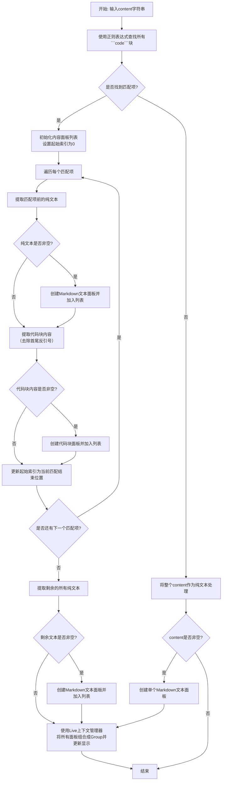

#### 带注释源码

```python
def display_markdown(content: str):
    # 使用正则表达式匹配所有由三个反引号包裹的代码块。
    # re.DOTALL 标志使 '.' 匹配包括换行符在内的所有字符。
    matches = re.finditer(r"```(.+?)```", content, re.DOTALL)
    start_index = 0  # 用于追踪当前处理到的字符串位置
    content_panels = []  # 用于存储将要显示的各个富文本面板
    # 设置面板的样式：黑色文本，白色背景
    style = "black on white"

    # 遍历所有找到的代码块匹配项
    for match in matches:
        # 提取当前匹配项（代码块）之前的纯文本部分
        text_content = content[start_index : match.start()].strip()

        # 如果存在纯文本，则创建一个Markdown文本面板
        if text_content:
            content_panels.append(Panel(Markdown(text_content), style=style, box=MINIMAL))

        # 提取代码块内容，并去除包裹它的三个反引号
        code_content = match.group(0).strip()[3:-3]  # Remove triple backticks

        # 如果代码块内容非空，则创建一个代码块面板。
        # 注意：这里将代码块内容再次用反引号包裹并放入Markdown中，以保持代码高亮样式。
        if code_content:
            content_panels.append(Panel(Markdown(f"```{code_content}"), style=style, box=MINIMAL))

        # 更新起始索引，准备处理下一个代码块之前的内容
        start_index = match.end()

    # 处理最后一个代码块之后的所有剩余文本
    remaining_text = content[start_index:].strip()
    if remaining_text:
        content_panels.append(Panel(Markdown(remaining_text), style=style, box=MINIMAL))

    # 使用 rich 库的 Live 显示组件进行实时渲染。
    # `auto_refresh=False` 表示手动控制刷新。
    # `vertical_overflow="visible"` 允许内容垂直溢出面板。
    with Live(auto_refresh=False, console=Console(), vertical_overflow="visible") as live:
        # 将所有创建的面板组合成一个 Group
        live.update(Group(*content_panels))
        # 手动触发一次刷新，将内容显示到控制台
        live.refresh()
```

### `RealtimeOutputNotebookClient.__init__`

该方法用于初始化`RealtimeOutputNotebookClient`类的实例，继承自`NotebookClient`，并设置一个用于实时报告执行结果的`notebook_reporter`。

参数：

- `*args`：`tuple`，传递给父类`NotebookClient`的位置参数。
- `notebook_reporter`：`NotebookReporter`或`None`，用于实时报告执行结果的对象。如果未提供，则创建一个新的`NotebookReporter`实例。
- `**kwargs`：`dict`，传递给父类`NotebookClient`的关键字参数。

返回值：`None`，无返回值。

#### 流程图

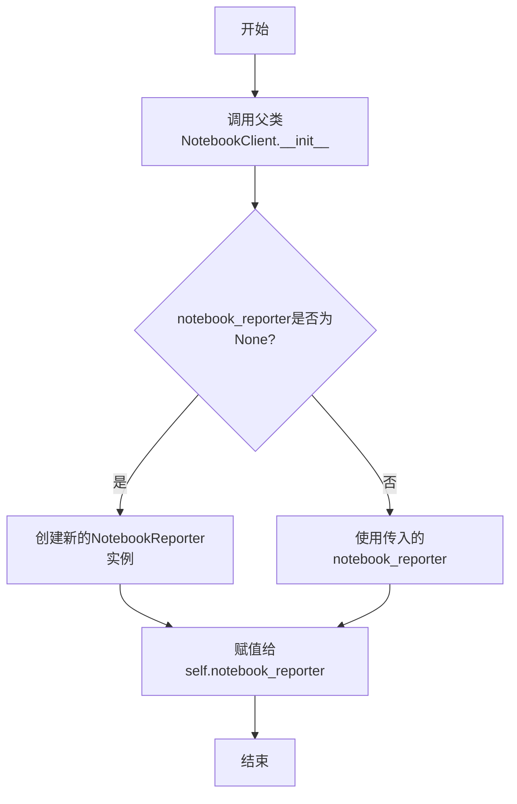

#### 带注释源码

```python
def __init__(self, *args, notebook_reporter=None, **kwargs) -> None:
    # 调用父类NotebookClient的初始化方法，传入所有位置参数和关键字参数
    super().__init__(*args, **kwargs)
    # 如果未提供notebook_reporter，则创建一个新的NotebookReporter实例
    # 否则，使用传入的notebook_reporter
    self.notebook_reporter = notebook_reporter or NotebookReporter()
```

### `RealtimeOutputNotebookClient._async_poll_output_msg`

该方法是一个异步方法，用于轮询并处理来自Jupyter内核的IOPub通道的实时输出消息。它持续监听消息，当收到与指定父消息ID匹配的消息时，会调用`process_message`进行处理。一旦处理完成（通过抛出`CellExecutionComplete`异常来标识），轮询循环结束。同时，它会将特定类型的消息（如流、错误、执行结果）转发给报告器进行异步报告。

参数：

- `parent_msg_id`：`str`，父消息的ID，用于过滤和匹配需要处理的输出消息。
- `cell`：`NotebookNode`，当前正在执行的笔记本单元格对象。
- `cell_index`：`int`，当前单元格在笔记本中的索引位置。

返回值：`None`，该方法不返回任何值，其主要作用是通过副作用处理消息流。

#### 流程图

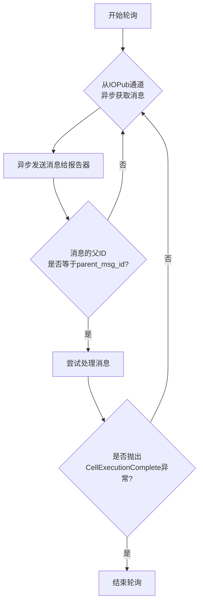

#### 带注释源码

```python
async def _async_poll_output_msg(self, parent_msg_id: str, cell: NotebookNode, cell_index: int) -> None:
    """Implement a feature to enable sending messages."""
    # 断言确保内核客户端（kc）已初始化
    assert self.kc is not None
    # 进入无限循环，持续监听消息
    while True:
        # 异步等待从IOPub通道获取消息，timeout=None表示无限等待
        msg = await ensure_async(self.kc.iopub_channel.get_msg(timeout=None))
        # 将获取到的消息异步发送给报告器
        await self._send_msg(msg)

        # 检查消息的父头部ID是否与传入的parent_msg_id匹配
        if msg["parent_header"].get("msg_id") == parent_msg_id:
            try:
                # 处理消息，如果处理完成，process_message会抛出CellExecutionComplete异常
                self.process_message(msg, cell, cell_index)
            except CellExecutionComplete:
                # 捕获到完成异常，表示当前单元格执行完毕，退出轮询循环
                return
```

### `RealtimeOutputNotebookClient._send_msg`

该方法用于处理并转发来自Jupyter内核的特定类型的输出消息（如流输出、错误、执行结果）到报告器（`notebook_reporter`），以便进行实时展示或记录。

参数：

- `msg`：`dict`，从Jupyter内核的IOPub通道接收到的原始消息字典。

返回值：`None`，该方法不返回任何值。

#### 流程图

```mermaid
flowchart TD
    A[开始: _send_msg(msg)] --> B{检查msg_type<br>是否为'stream', 'error', 或'execute_result'?}
    B -- 是 --> C[将msg转换为标准输出格式]
    C --> D[异步报告输出内容]
    D --> E[结束]
    B -- 否 --> E
```

#### 带注释源码

```python
async def _send_msg(self, msg: dict):
    # 1. 从消息头中提取消息类型
    msg_type = msg.get("header", {}).get("msg_type")
    
    # 2. 过滤消息：只处理流输出、错误和执行结果这三种类型
    if msg_type not in ["stream", "error", "execute_result"]:
        return

    # 3. 使用nbclient的工具函数将原始内核消息转换为标准的Notebook输出节点格式
    # 4. 异步调用报告器的报告方法，将转换后的输出内容（"content"）发送出去
    await self.notebook_reporter.async_report(output_from_msg(msg), "content")
```

### `ExecuteNbCode.__init__`

初始化 `ExecuteNbCode` 类的实例，设置 Jupyter Notebook 代码执行环境的核心参数，包括 Notebook 对象、超时时间、控制台交互方式，并初始化 Notebook 客户端和报告器。

参数：

- `nb`：`NotebookNode`，默认值为 `nbformat.v4.new_notebook()`，表示要执行的 Jupyter Notebook 对象。
- `timeout`：`int`，默认值为 `600`，表示代码执行的超时时间（秒）。

返回值：`None`，无返回值。

#### 流程图

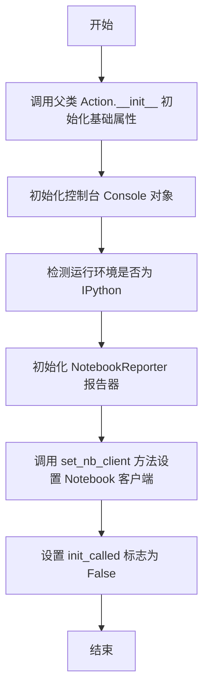

#### 带注释源码

```python
def __init__(self, nb=nbformat.v4.new_notebook(), timeout=600):
    # 调用父类 Action 的初始化方法，传入 nb、timeout、console 和 interaction 参数
    super().__init__(
        nb=nb,  # 传入的 Notebook 对象
        timeout=timeout,  # 传入的超时时间
        console=Console(),  # 初始化一个 Rich 库的控制台对象，用于输出
        interaction=("ipython" if self.is_ipython() else "terminal"),  # 根据运行环境设置交互模式
    )
    # 初始化一个 NotebookReporter 对象，用于报告执行过程中的状态和结果
    self.reporter = NotebookReporter()
    # 调用 set_nb_client 方法，创建并配置 Notebook 客户端
    self.set_nb_client()
    # 设置初始化代码执行标志为 False，表示尚未执行初始化代码
    self.init_called = False
```

### `ExecuteNbCode.init_code`

该方法用于初始化代码执行环境，通过执行预定义的初始化代码来配置日志和警告设置，确保代码执行环境的稳定性和一致性。

参数：无

返回值：无

#### 流程图

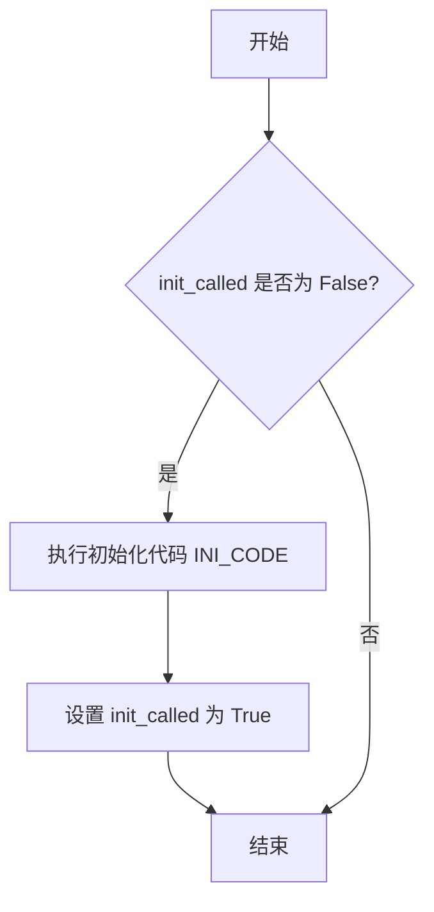

#### 带注释源码

```python
async def init_code(self):
    # 检查是否已经调用过初始化方法
    if not self.init_called:
        # 执行预定义的初始化代码，配置日志和警告设置
        await self.run(INI_CODE)
        # 标记初始化方法已调用，避免重复执行
        self.init_called = True
```

### `ExecuteNbCode.set_nb_client`

该方法用于初始化或重新设置 `ExecuteNbCode` 类中的 `nb_client` 属性。它创建一个 `RealtimeOutputNotebookClient` 实例，该实例是 `NotebookClient` 的自定义子类，用于执行 Jupyter Notebook 代码并支持实时输出报告。此客户端配置了超时设置、工作空间路径以及一个用于报告执行输出的 `NotebookReporter` 实例。

参数：
-  `self`：`ExecuteNbCode` 类实例，表示当前对象。

返回值：`None`，此方法不返回任何值，仅用于设置实例属性。

#### 流程图

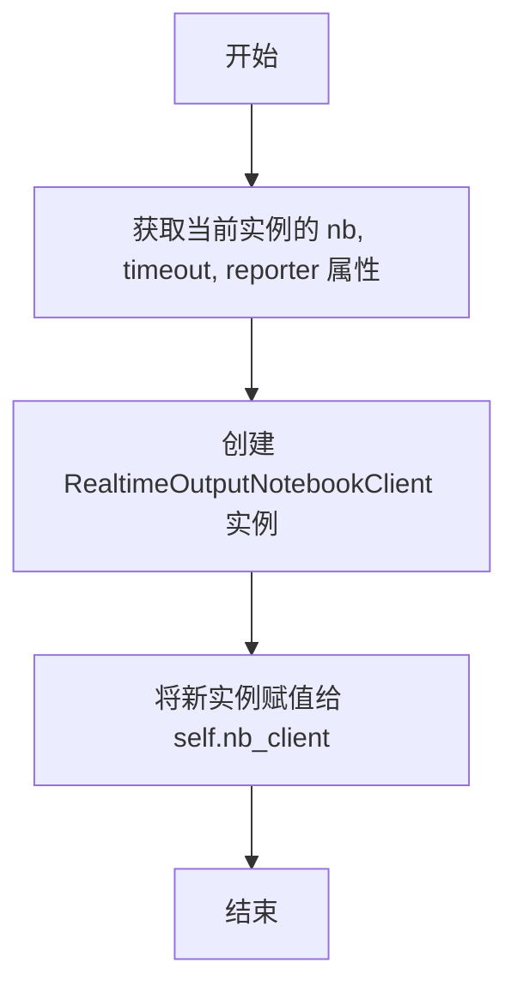

#### 带注释源码

```python
def set_nb_client(self):
    # 初始化或重新设置 nb_client 属性。
    # 创建一个 RealtimeOutputNotebookClient 实例，该实例是 NotebookClient 的自定义子类，
    # 用于执行 Jupyter Notebook 代码并支持实时输出报告。
    # 配置包括超时时间、工作空间路径以及一个 NotebookReporter 实例用于报告输出。
    self.nb_client = RealtimeOutputNotebookClient(
        self.nb,  # 当前 NotebookNode 对象，包含要执行的代码单元
        timeout=self.timeout,  # 代码执行的超时时间（秒）
        resources={"metadata": {"path": self.config.workspace.path}},  # 设置工作空间路径
        notebook_reporter=self.reporter,  # 用于报告执行输出的 NotebookReporter 实例
        coalesce_streams=True,  # 合并流输出，减少消息数量
    )
```

### `ExecuteNbCode.build`

该方法用于构建或重新构建Jupyter Notebook内核客户端。如果当前没有活动的内核客户端，或者内核客户端已死亡，则创建新的内核管理器、启动新内核并启动新的内核客户端。

参数：

-  `self`：`ExecuteNbCode`，`ExecuteNbCode`类的实例，代表当前执行Notebook代码的操作对象。

返回值：`None`，无返回值。

#### 流程图

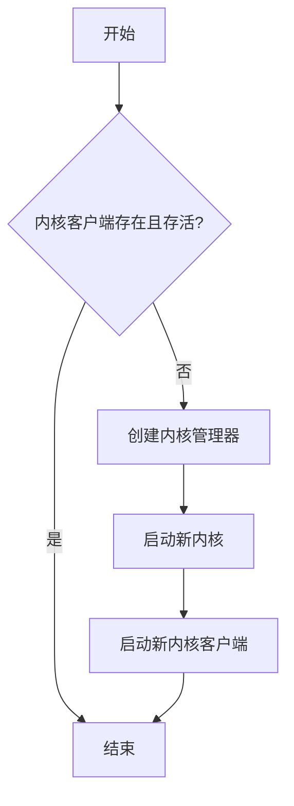

#### 带注释源码

```python
async def build(self):
    # 检查当前Notebook客户端的内核客户端（kc）是否存在且存活
    if self.nb_client.kc is None or not await self.nb_client.kc.is_alive():
        # 如果不存在或不存活，则创建新的内核管理器
        self.nb_client.create_kernel_manager()
        # 启动一个新的内核
        self.nb_client.start_new_kernel()
        # 启动一个新的内核客户端，用于与内核通信
        self.nb_client.start_new_kernel_client()
```

### `ExecuteNbCode.terminate`

该方法用于终止NotebookClient的执行，包括关闭内核、清理资源以及停止所有相关的通信通道。

参数：

-  `self`：`ExecuteNbCode`，当前ExecuteNbCode实例的引用

返回值：`None`，无返回值

#### 流程图

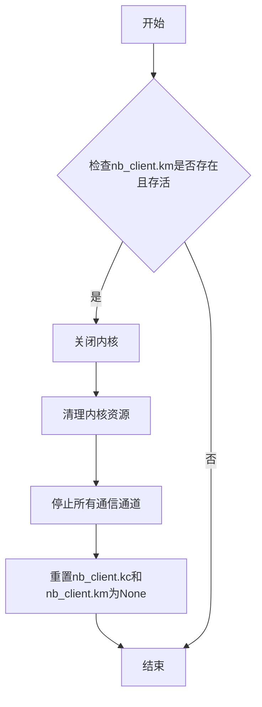

#### 带注释源码

```python
async def terminate(self):
    """kill NotebookClient"""
    # 检查内核管理器是否存在且内核是否存活
    if self.nb_client.km is not None and await self.nb_client.km.is_alive():
        # 立即关闭内核
        await self.nb_client.km.shutdown_kernel(now=True)
        # 清理内核资源
        await self.nb_client.km.cleanup_resources()

        # 定义需要停止的通信通道列表
        channels = [
            self.nb_client.kc.stdin_channel,  # 处理内核标准输入的通道
            self.nb_client.kc.hb_channel,     # 内核与客户端之间的心跳通信通道
            self.nb_client.kc.control_channel, # 控制内核的通道
        ]

        # 停止所有运行中的通道
        for channel in channels:
            if channel.is_alive():
                channel.stop()

        # 重置内核客户端和内核管理器为None，表示已终止
        self.nb_client.kc = None
        self.nb_client.km = None
```

### `ExecuteNbCode.reset`

该方法用于重置NotebookClient，首先终止当前的内核和客户端，然后重新构建一个新的内核和客户端，并重新设置NotebookClient。

参数：无

返回值：无

#### 流程图

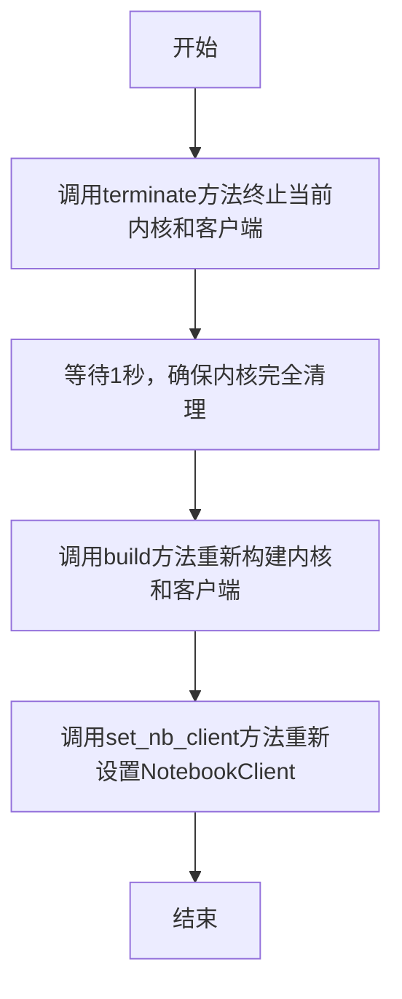

#### 带注释源码

```python
async def reset(self):
    """reset NotebookClient"""
    # 终止当前的内核和客户端
    await self.terminate()

    # 等待1秒，确保内核完全清理
    await asyncio.sleep(1)
    # 重新构建内核和客户端
    await self.build()
    # 重新设置NotebookClient
    self.set_nb_client()
```

### `ExecuteNbCode.add_code_cell`

该方法用于向Jupyter笔记本对象中添加一个新的代码单元格。

参数：

- `code`：`str`，要添加到新代码单元格中的源代码字符串。

返回值：`None`，该方法不返回任何值，直接修改`self.nb`对象。

#### 流程图

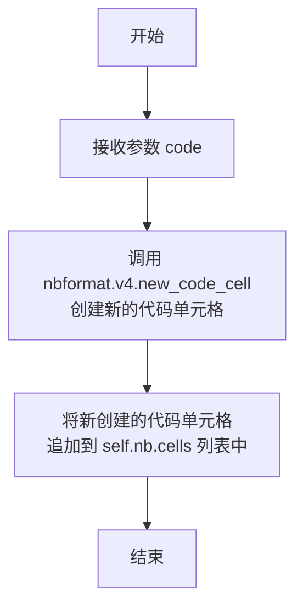

#### 带注释源码

```python
def add_code_cell(self, code: str):
    # 使用 nbformat.v4.new_code_cell 函数创建一个新的代码单元格。
    # 该函数接收源代码字符串作为参数，并返回一个 NotebookNode 对象。
    # 然后将这个新创建的单元格追加到当前笔记本对象（self.nb）的 cells 列表中。
    self.nb.cells.append(new_code_cell(source=code))
```

### `ExecuteNbCode.add_markdown_cell`

该方法用于向Jupyter笔记本对象中添加一个新的Markdown单元格。

参数：

- `markdown`：`str`，要添加到Markdown单元格中的文本内容。

返回值：`None`，该方法不返回任何值，仅修改内部笔记本对象的状态。

#### 流程图

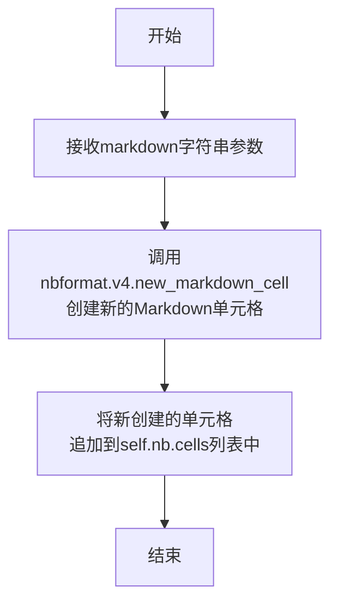

#### 带注释源码

```python
def add_markdown_cell(self, markdown: str):
    # 使用nbformat库的v4版本API创建一个新的Markdown单元格。
    # 参数 `markdown` 是单元格的源文本内容。
    new_cell = new_markdown_cell(source=markdown)
    # 将新创建的Markdown单元格追加到当前笔记本对象（self.nb）的cells列表中。
    self.nb.cells.append(new_cell)
```

### `ExecuteNbCode._display`

该方法用于根据指定的语言（Python或Markdown）格式化并显示代码内容。对于Python代码，使用Rich库的Syntax高亮显示；对于Markdown内容，调用`display_markdown`函数进行渲染和展示。

参数：

- `code`：`str`，需要显示的代码或Markdown内容。
- `language`：`Literal["python", "markdown"]`，指定内容的语言类型，目前仅支持"python"或"markdown"。

返回值：`None`，该方法不返回任何值，其作用是将内容输出到控制台。

#### 流程图

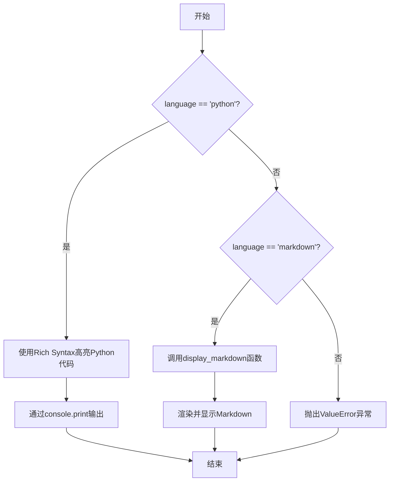

#### 带注释源码

```python
def _display(self, code: str, language: Literal["python", "markdown"] = "python"):
    """
    根据语言类型格式化并显示代码或Markdown内容。
    
    Args:
        code (str): 需要显示的代码字符串或Markdown文本。
        language (Literal["python", "markdown"]): 内容的语言类型，默认为"python"。
    
    Raises:
        ValueError: 当传入不支持的语言类型时抛出异常。
    """
    if language == "python":
        # 使用Rich库的Syntax组件对Python代码进行语法高亮
        code = Syntax(code, "python", theme="paraiso-dark", line_numbers=True)
        # 将高亮后的代码输出到控制台
        self.console.print(code)
    elif language == "markdown":
        # 调用独立的display_markdown函数来处理Markdown的渲染和显示
        display_markdown(code)
    else:
        # 如果传入的语言类型不是"python"或"markdown"，则抛出异常
        raise ValueError(f"Only support for python, markdown, but got {language}")
```

### `ExecuteNbCode.add_output_to_cell`

该方法用于将代码执行的输出结果添加到指定的 Jupyter Notebook 单元格中。它检查单元格是否已有输出列表，如果没有则创建一个新的空列表，然后将新的输出（以流形式）追加到该列表中。

参数：

- `cell`：`NotebookNode`，表示 Jupyter Notebook 中的一个单元格，需要向其添加输出。
- `output`：`str`，表示要添加到单元格的文本输出内容。

返回值：`None`，该方法不返回任何值，直接修改传入的 `cell` 对象。

#### 流程图

```mermaid
flowchart TD
    A[开始] --> B{cell 是否有 'outputs' 字段?}
    B -- 否 --> C[初始化 cell['outputs'] 为空列表]
    B -- 是 --> D[直接使用现有 cell['outputs'] 列表]
    C --> E
    D --> E[使用 new_output 创建新的输出对象]
    E --> F[将新输出对象追加到 cell['outputs'] 列表中]
    F --> G[结束]
```

#### 带注释源码

```python
def add_output_to_cell(self, cell: NotebookNode, output: str):
    """add outputs of code execution to notebook cell."""
    # 检查传入的单元格对象是否已包含 'outputs' 字段（即输出列表）
    if "outputs" not in cell:
        # 如果没有，则初始化一个空列表作为该单元格的输出列表
        cell["outputs"] = []
    else:
        # 如果已有输出列表，则直接使用现有列表
        # 使用 nbformat.v4.new_output 函数创建一个新的输出对象。
        # 参数说明：
        #   output_type="stream": 指定输出类型为流（如标准输出）。
        #   name="stdout": 指定流的名称为标准输出。
        #   text=str(output): 将传入的 output 参数转换为字符串，作为输出文本。
        # 然后将这个新创建的输出对象追加到单元格的输出列表中。
        cell["outputs"].append(new_output(output_type="stream", name="stdout", text=str(output)))
```

### `ExecuteNbCode.parse_outputs`

该方法用于解析从 Jupyter Notebook 执行中获取的输出列表。它会根据输出类型（如流输出、执行结果、错误等）进行不同的处理，提取文本内容，过滤掉日志和警告信息，并处理异常情况。最终返回一个布尔值表示执行是否成功，以及一个包含所有解析后输出的字符串。

参数：

- `outputs`：`list[str]`，从 Notebook 执行中获取的输出列表，每个元素是一个字典，包含输出类型和内容。
- `keep_len`：`int`，可选参数，默认为 5000，用于限制输出文本的长度。对于成功执行，保留前 `keep_len` 个字符；对于错误，保留后 `keep_len` 个字符。

返回值：`Tuple[bool, str]`，返回一个元组，第一个元素是布尔值，表示执行是否成功；第二个元素是字符串，包含所有解析后的输出文本，用逗号连接。

#### 流程图

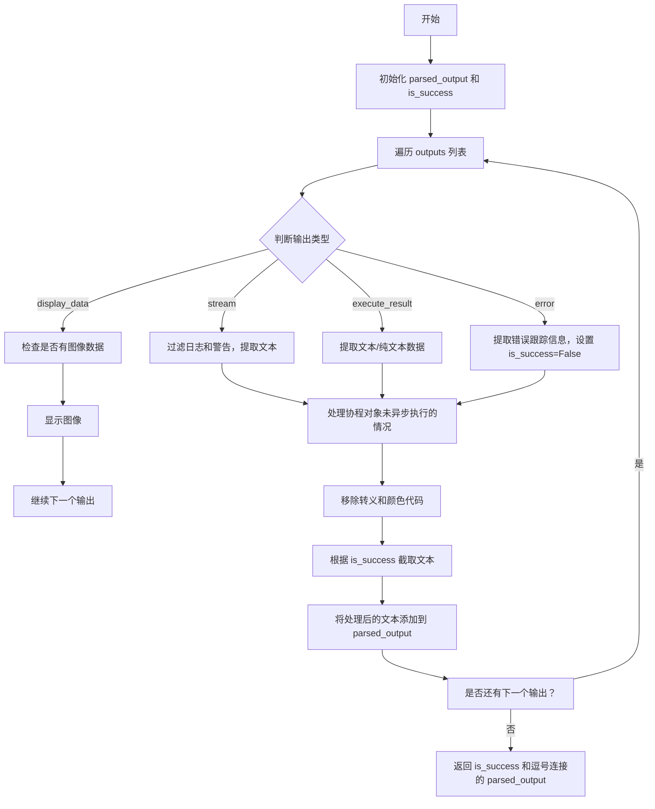

#### 带注释源码

```python
def parse_outputs(self, outputs: list[str], keep_len: int = 5000) -> Tuple[bool, str]:
    """Parses the outputs received from notebook execution."""
    # 确保 outputs 是一个列表
    assert isinstance(outputs, list)
    # 初始化解析后的输出列表和执行成功标志
    parsed_output, is_success = [], True
    # 遍历 outputs 列表中的每个输出
    for i, output in enumerate(outputs):
        output_text = ""
        # 处理流输出类型，过滤掉特定的日志信息
        if output["output_type"] == "stream" and not any(
            tag in output["text"]
            for tag in ["| INFO     | metagpt", "| ERROR    | metagpt", "| WARNING  | metagpt", "DEBUG"]
        ):
            output_text = output["text"]
        # 处理显示数据输出类型，检查是否有图像数据
        elif output["output_type"] == "display_data":
            if "image/png" in output["data"]:
                # 显示图像
                self.show_bytes_figure(output["data"]["image/png"], self.interaction)
            else:
                # 记录日志，继续处理下一个输出
                logger.info(
                    f"{i}th output['data'] from nbclient outputs dont have image/png, continue next output ..."
                )
        # 处理执行结果输出类型，提取纯文本数据
        elif output["output_type"] == "execute_result":
            output_text = output["data"]["text/plain"]
        # 处理错误输出类型，提取错误跟踪信息，并设置执行失败
        elif output["output_type"] == "error":
            output_text, is_success = "\n".join(output["traceback"]), False

        # 处理未异步执行的协程对象
        if output_text.strip().startswith("<coroutine object"):
            output_text = "Executed code failed, you need use key word 'await' to run a async code."
            is_success = False

        # 移除输出文本中的转义字符和颜色代码
        output_text = remove_escape_and_color_codes(output_text)
        # 如果执行成功，移除日志和警告行
        if is_success:
            output_text = remove_log_and_warning_lines(output_text)
        # 根据执行成功与否截取文本：成功取前 keep_len 个字符，失败取后 keep_len 个字符
        if "<!DOCTYPE html>" not in output_text:
            output_text = output_text[:keep_len] if is_success else output_text[-keep_len:]

        # 将处理后的文本添加到解析后的输出列表
        parsed_output.append(output_text)
    # 返回执行成功标志和用逗号连接的解析后输出文本
    return is_success, ",".join(parsed_output)
```

### `ExecuteNbCode.show_bytes_figure`

该方法用于根据交互环境类型（IPython或终端）显示Base64编码的图像数据。在IPython环境中，它使用IPython的`display`函数直接显示图像；在终端环境中，它使用PIL库打开并显示图像。

参数：

- `image_base64`：`str`，Base64编码的图像字符串。
- `interaction_type`：`Literal["ipython", None]`，交互环境类型，指示当前是在IPython环境还是其他环境（如终端）。

返回值：`None`，该方法不返回任何值，其作用是在相应环境中显示图像。

#### 流程图

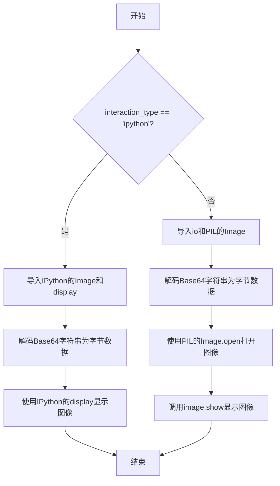

#### 带注释源码

```python
def show_bytes_figure(self, image_base64: str, interaction_type: Literal["ipython", None]):
    # 将Base64编码的字符串解码为原始的图像字节数据
    image_bytes = base64.b64decode(image_base64)
    
    # 判断当前交互环境是否为IPython（如Jupyter Notebook）
    if interaction_type == "ipython":
        # 动态导入IPython的显示模块
        from IPython.display import Image, display
        # 使用IPython的display函数直接显示图像
        display(Image(data=image_bytes))
    else:
        # 对于非IPython环境（如标准终端），使用PIL库处理图像
        import io
        from PIL import Image
        # 将字节数据转换为图像对象
        image = Image.open(io.BytesIO(image_bytes))
        # 调用系统默认的图像查看器显示图像
        image.show()
```

### `ExecuteNbCode.is_ipython`

该方法用于检测当前代码是否在 IPython 环境（如 Jupyter Notebook 或 JupyterLab）中运行。

参数：无

返回值：`bool`，如果当前环境是 IPython 环境则返回 `True`，否则返回 `False`。

#### 流程图

```mermaid
flowchart TD
    A[开始] --> B{尝试导入 get_ipython};
    B -- 成功 --> C{get_ipython() 不为 None<br>且配置中包含 'IPKernelApp'?};
    C -- 是 --> D[返回 True];
    C -- 否 --> E[返回 False];
    B -- 失败<br>（NameError） --> E;
    D --> F[结束];
    E --> F;
```

#### 带注释源码

```python
def is_ipython(self) -> bool:
    try:
        # 尝试从 IPython 导入 get_ipython 函数。
        # 如果在标准 Python 解释器中运行，此导入会失败。
        from IPython import get_ipython

        # 检查 get_ipython() 是否返回一个有效的 IPython 交互式 shell 对象，
        # 并且其配置字典中是否包含 'IPKernelApp' 键。
        # 这是判断是否在 Jupyter Notebook/Lab 内核中运行的可靠方法。
        if get_ipython() is not None and "IPKernelApp" in get_ipython().config:
            return True
        else:
            return False
    except NameError:
        # 如果发生 NameError 异常，说明 `__file__` 变量不存在，
        # 或者 `IPython` 模块不可用，这通常意味着不在 IPython 环境中。
        # 例如，在普通的 Python 脚本或某些受限环境中运行。
        return False
```

### `ExecuteNbCode.run_cell`

该方法用于异步执行Jupyter Notebook中的一个代码单元（cell），并处理执行结果。它负责调用NotebookClient执行代码，捕获执行过程中的输出、错误或超时，并解析执行结果。方法支持超时中断、死内核恢复等异常处理，确保代码执行的健壮性。

参数：

- `cell`：`NotebookNode`，表示要执行的Jupyter Notebook代码单元，包含代码内容和元数据。
- `cell_index`：`int`，表示代码单元在Notebook中的索引位置，用于标识和跟踪执行进度。

返回值：`Tuple[bool, str]`，返回一个元组，其中第一个元素为布尔值，表示代码执行是否成功（True为成功，False为失败）；第二个元素为字符串，包含执行输出的解析结果或错误信息。

#### 流程图

```mermaid
graph TD
    A[开始执行run_cell] --> B[报告代码单元内容]
    B --> C{尝试执行代码单元}
    C -->|执行成功| D[解析输出结果]
    D --> E[返回成功状态和解析结果]
    C -->|CellTimeoutError| F[中断内核执行]
    F --> G[返回超时错误信息]
    C -->|DeadKernelError| H[重置NotebookClient]
    H --> I[返回DeadKernelError信息]
    C -->|其他异常| J[解析异常输出]
    J --> K[返回失败状态和异常信息]
    E --> L[结束]
    G --> L
    I --> L
    K --> L
```

#### 带注释源码

```python
async def run_cell(self, cell: NotebookNode, cell_index: int) -> Tuple[bool, str]:
    """set timeout for run code.
    returns the success or failure of the cell execution, and an optional error message.
    """
    # 报告当前执行的代码单元内容，用于实时显示或日志记录
    await self.reporter.async_report(cell, "content")

    try:
        # 异步执行指定的代码单元，使用NotebookClient处理执行过程
        await self.nb_client.async_execute_cell(cell, cell_index)
        # 执行成功后，解析最后一个代码单元的输出结果
        return self.parse_outputs(self.nb.cells[-1].outputs)
    except CellTimeoutError:
        # 捕获执行超时异常，中断内核执行以防止无限等待
        assert self.nb_client.km is not None
        await self.nb_client.km.interrupt_kernel()
        await asyncio.sleep(1)  # 等待1秒确保中断生效
        error_msg = "Cell execution timed out: Execution exceeded the time limit and was stopped; consider optimizing your code for better performance."
        return False, error_msg  # 返回失败状态和超时提示信息
    except DeadKernelError:
        # 捕获死内核异常，重置NotebookClient以恢复执行环境
        await self.reset()
        return False, "DeadKernelError"  # 返回失败状态和死内核错误信息
    except Exception:
        # 捕获其他未预料异常，尝试解析输出以获取错误信息
        return self.parse_outputs(self.nb.cells[-1].outputs)
```

### `ExecuteNbCode.run`

该方法用于执行给定的代码或Markdown内容，并返回执行结果及成功状态。它会根据指定的语言类型（Python或Markdown）进行相应的处理：对于Python代码，会将其添加到Notebook中并执行，然后解析输出；对于Markdown内容，则直接添加到Notebook中并返回原始内容。执行过程中会实时显示代码或Markdown内容，并将Notebook保存到文件。

参数：

- `code`：`str`，要执行的代码或Markdown内容。
- `language`：`Literal["python", "markdown"]`，指定内容的语言类型，默认为"python"。

返回值：`Tuple[str, bool]`，返回执行结果字符串和成功状态布尔值。成功状态为True表示执行成功，False表示执行失败。

#### 流程图

```mermaid
graph TD
    A[开始] --> B[显示代码/Markdown内容]
    B --> C{语言类型?}
    C -->|Python| D[添加代码到Notebook]
    D --> E[构建代码执行器]
    E --> F[执行代码单元]
    F --> G[解析输出]
    G --> H[处理特殊命令<br>如!pip或git clone]
    H --> I[保存Notebook到文件]
    C -->|Markdown| J[添加Markdown到Notebook]
    J --> K[设置成功状态为True]
    K --> I
    I --> L[返回输出和成功状态]
```

#### 带注释源码

```python
async def run(self, code: str, language: Literal["python", "markdown"] = "python") -> Tuple[str, bool]:
    """
    返回代码执行的输出，以及代码执行的成功指示器（布尔值）。
    """
    # 显示代码或Markdown内容
    self._display(code, language)

    # 使用报告器上下文管理器
    async with self.reporter:
        if language == "python":
            # 将代码添加到Notebook中
            self.add_code_cell(code=code)

            # 构建代码执行器
            await self.build()

            # 执行代码
            cell_index = len(self.nb.cells) - 1
            success, outputs = await self.run_cell(self.nb.cells[-1], cell_index)

            # 处理特殊命令：!pip 和 git clone
            if "!pip" in code:
                success = False
                outputs = outputs[-INSTALL_KEEPLEN:]
            elif "git clone" in code:
                outputs = outputs[:INSTALL_KEEPLEN] + "..." + outputs[-INSTALL_KEEPLEN:]

        elif language == "markdown":
            # 将Markdown内容添加到Notebook的Markdown单元中
            self.add_markdown_cell(code)
            # 返回True，因为Markdown单元没有执行失败的情况
            outputs, success = code, True
        else:
            raise ValueError(f"仅支持语言类型: python, markdown，但收到 {language}")

        # 将Notebook保存到文件
        file_path = self.config.workspace.path / "code.ipynb"
        nbformat.write(self.nb, file_path)
        await self.reporter.async_report(file_path, "path")

        # 返回执行结果和成功状态
        return outputs, success
```

## 关键组件

### RealtimeOutputNotebookClient

一个自定义的 NotebookClient 子类，用于在 Jupyter Notebook 代码执行过程中实时捕获和转发输出消息（如流式输出、错误、执行结果）给指定的报告器（NotebookReporter），以实现执行过程的实时监控和展示。

### ExecuteNbCode

一个核心动作类，负责执行 Jupyter Notebook 中的代码块。它管理 Notebook 内核的生命周期（创建、启动、终止、重置），处理代码和 Markdown 单元格的添加与执行，解析执行输出（包括文本、图像和错误），并将结果反馈给调用者。它支持在 IPython 环境和终端环境中运行，并能将执行过程持久化为 `.ipynb` 文件。

### NotebookReporter

一个报告器组件，用于异步接收和处理来自 `RealtimeOutputNotebookClient` 的执行输出和状态信息，并将其报告给外部系统或界面。它是连接代码执行引擎和结果展示/记录模块的桥梁。

### 输出解析与清理函数 (`parse_outputs`, `remove_log_and_warning_lines`, `remove_escape_and_color_codes`)

一组用于处理 Notebook 执行原始输出的函数。它们负责过滤日志和警告行、去除终端转义序列和颜色代码、截断过长的输出，并区分正常输出和错误信息，以生成干净、可读的文本结果。

### Markdown 渲染函数 (`display_markdown`)

一个用于在富文本控制台中优雅地渲染和显示混合了 Markdown 文本和代码块的内容的函数。它将内容解析为文本面板和代码面板，并使用 `rich` 库进行实时展示，提升了 Markdown 内容的可读性。

## 问题及建议

### 已知问题

-   **内核生命周期管理复杂且脆弱**：`terminate` 和 `reset` 方法手动管理内核和通道的生命周期，逻辑复杂。在 `terminate` 中，停止通道后立即将 `kc` 和 `km` 设为 `None`，但异步清理操作可能尚未完成，存在竞态条件风险。`reset` 方法中的 `sleep(1)` 是硬编码的等待时间，不可靠且低效。
-   **错误处理不完整**：`run_cell` 方法捕获了 `CellTimeoutError` 和 `DeadKernelError`，但最终的 `except Exception` 块过于宽泛，会捕获所有其他异常并尝试解析输出，这可能掩盖了真正的运行时错误，导致返回误导性的“成功”结果。
-   **输出解析逻辑存在缺陷**：
    1.  `parse_outputs` 方法中，对于 `execute_result` 类型的输出，直接取 `output[‘data’][‘text/plain’]`，如果数据中不存在此键（例如，只有 `image/png`），将引发 `KeyError`。
    2.  过滤日志的逻辑（`remove_log_and_warning_lines`）是硬编码的字符串列表，不够灵活，且可能误伤包含这些子串的正常输出。
    3.  成功和失败时截取输出头尾的逻辑（`output_text[:keep_len]` 和 `output_text[-keep_len:]`）可能破坏输出的完整性，例如截断多行异常信息的关键中间部分。
-   **资源泄漏风险**：`terminate` 方法中，如果 `km.shutdown_kernel` 或通道 `stop` 调用失败，资源可能无法正确释放。`build` 方法在创建新内核前，没有检查并清理可能存在的旧内核实例。
-   **硬编码的配置和路径**：`INI_CODE` 中的日志级别设置是硬编码的。在 `run` 方法中，保存的笔记本文件路径固定为 `“code.ipynb”`，在多实例或并发场景下会相互覆盖。
-   **对 `!pip` 和 `git clone` 的特殊处理逻辑武断**：在 `run` 方法中，检测到代码包含 `“!pip”` 就强制将 `success` 设为 `False`，这不符合实际执行结果。对 `git clone` 输出的截断处理也可能丢失重要信息。

### 优化建议

-   **重构内核管理，采用上下文管理器**：将 `build` 和 `terminate` 的逻辑封装到一个异步上下文管理器（如 `async with ExecuteNbCode() as executor:`）中，确保内核的创建和清理是原子化且异常安全的。移除 `reset` 方法中的硬编码 `sleep`，改用更可靠的方式等待内核终止（如轮询状态）。
-   **精细化异常处理**：在 `run_cell` 方法中，将 `except Exception` 改为捕获更具体的异常（如 `RuntimeError`, `ValueError` 等），或至少将未知异常记录并重新抛出（或返回明确的失败信息），而不是尝试解析可能不存在的输出。
-   **增强输出解析的健壮性**：
    1.  在 `parse_outputs` 中访问字典键值时，使用 `.get()` 方法并提供默认值，避免 `KeyError`。
    2.  将日志过滤规则改为可配置项（如通过类参数或配置文件传入），或使用更精确的匹配方式（如正则表达式匹配日志行开头）。
    3.  重新考虑截断策略。对于异常输出，优先保证堆栈跟踪的完整性；对于正常输出，可以考虑更智能的摘要生成，而非简单截断。
-   **加强资源管理**：在 `terminate` 和 `build` 方法中增加更严格的状态检查和清理步骤。考虑使用 `asyncio.gather` 或类似机制来并发且安全地停止所有通道。
-   **使配置可定制化**：将 `INI_CODE`、超时时间 `timeout`、输出截断长度 `keep_len`、保存的文件名等提取为类属性或 `__init__` 方法的参数，提高灵活性。
-   **重新评估特殊命令处理**：移除对 `!pip` 命令强制标记为失败的逻辑。如果需要对安装命令的输出进行特殊处理（如截断），应基于其输出内容（如长度、是否包含错误）而非输入命令字符串来判断。`git clone` 的输出截断也应更谨慎。
-   **代码结构优化**：考虑将输出显示（`_display`, `show_bytes_figure`）、输出解析（`parse_outputs`）和笔记本文件操作等职责分离到独立的辅助类或函数中，遵循单一职责原则，使 `ExecuteNbCode` 类更专注于代码执行的核心流程。
-   **增加类型注解和文档**：为所有方法参数和返回值补充更精确的类型注解（例如使用 `TypedDict` 描述输出字典结构）。为复杂方法（如 `parse_outputs`, `run_cell`）添加详细的文档字符串，说明其行为、异常和返回值含义。

## 其它


### 设计目标与约束

1.  **核心目标**：提供一个异步、交互式的Jupyter Notebook代码执行环境，能够实时捕获、解析并展示代码执行结果（包括标准输出、错误、图像等），同时将执行结果反馈给调用者（如LLM）。
2.  **关键约束**：
    *   **异步执行**：所有核心操作（如内核启动、代码执行、消息处理）必须支持异步，以避免阻塞主事件循环。
    *   **实时反馈**：代码执行过程中的输出（如`print`语句）需要实时显示给用户，而不是等待整个Cell执行完毕。
    *   **资源管理**：需要妥善管理Jupyter内核的生命周期（创建、中断、关闭），防止内核泄漏或僵尸进程。
    *   **输出净化**：对执行输出进行清理，移除ANSI转义码、颜色代码以及特定的日志/警告行，以提供干净、可读的文本结果。
    *   **多格式支持**：不仅支持执行Python代码，还需支持渲染Markdown内容。
    *   **错误恢复**：能够处理执行超时、内核死亡等异常情况，并尝试恢复（如重置内核）。
    *   **结果持久化**：将执行历史（代码、输出）保存为`.ipynb`文件。

### 错误处理与异常设计

1.  **异常分类与处理**：
    *   `CellTimeoutError`：代码执行超时。处理方式：中断内核，返回超时错误信息。
    *   `DeadKernelError`：内核意外死亡。处理方式：尝试重置整个内核环境（`reset`方法）。
    *   `CellExecutionComplete`：Cell正常执行完成的信号，由`nbclient`内部抛出，用于终止输出消息轮询循环。
    *   通用`Exception`：捕获其他未预料异常，尝试从最后一个Cell的输出中解析错误信息。
2.  **错误信息传递**：错误信息通过`parse_outputs`方法从`error`类型的输出中提取`traceback`，并标记执行状态为失败(`is_success=False`)。
3.  **资源清理保障**：`terminate`方法确保在动作结束时或重置前，彻底关闭内核并清理所有通信通道，即使在异常情况下也应被调用（例如在`reset`和析构中）。
4.  **特殊命令处理**：对包含`!pip`或`git clone`的命令，强制标记为执行失败，并对输出进行截断处理，以避免过长的安装输出干扰。

### 数据流与状态机

1.  **主要数据流**：
    *   **输入**：用户/LLM提供的代码字符串或Markdown字符串。
    *   **处理**：
        *   (Python) 代码被添加到`NotebookNode`对象，通过`RealtimeOutputNotebookClient`提交给Jupyter内核执行。
        *   (Markdown) 内容被添加为Markdown Cell，直接渲染。
    *   **输出捕获**：内核产生的`stream`、`execute_result`、`display_data`（如图像）、`error`等消息，通过`_async_poll_output_msg`实时捕获，并经由`NotebookReporter`报告。
    *   **输出解析与净化**：捕获的原始输出通过`parse_outputs`方法进行类型判断、内容提取、转义码移除、日志行过滤等处理。
    *   **输出**：净化后的文本字符串（或图像展示）以及一个表示执行成功与否的布尔值。
2.  **核心状态机（内核生命周期）**：
    *   **初始/空闲态**：`nb_client.kc`和`nb_client.km`为`None`。
    *   **构建态**：调用`build()`方法后，创建并启动内核管理器(`km`)和内核客户端(`kc`)，进入就绪状态。
    *   **执行态**：调用`run_cell`执行代码，内核处于忙碌状态。此状态可能因超时(`CellTimeoutError`)或死亡(`DeadKernelError`)而退出。
    *   **终止态**：调用`terminate()`方法，关闭内核，清理所有资源，回到初始态。
    *   **重置态**：`reset()`方法封装了“终止 -> 短暂等待 -> 构建”的流程，用于从错误中恢复。

### 外部依赖与接口契约

1.  **关键外部库**：
    *   `nbformat` & `nbclient`：核心依赖，用于Notebook数据结构操作和内核交互执行。
    *   `asyncio`：提供异步执行框架。
    *   `rich`：用于在终端中美观地渲染代码语法和Markdown内容。
    *   `PIL` / `IPython.display`：用于在不同环境（终端/IPython）下显示执行生成的图像。
2.  **接口契约**：
    *   `Action`基类：`ExecuteNbCode`继承自`metagpt.actions.Action`，需遵循其定义的异步`run`接口范式。
    *   `NotebookReporter`：定义了`async_report`方法，`RealtimeOutputNotebookClient`依赖此接口来实时推送执行消息。这是一个异步回调接口。
    *   Jupyter Kernel Messaging Protocol：`nbclient`和内核之间的通信遵循此协议，`RealtimeOutputNotebookClient`通过覆盖`_async_poll_output_msg`来拦截和处理`iopub`消息。
    *   配置文件：依赖`self.config.workspace.path`来设置内核工作目录和保存结果Notebook文件。

    