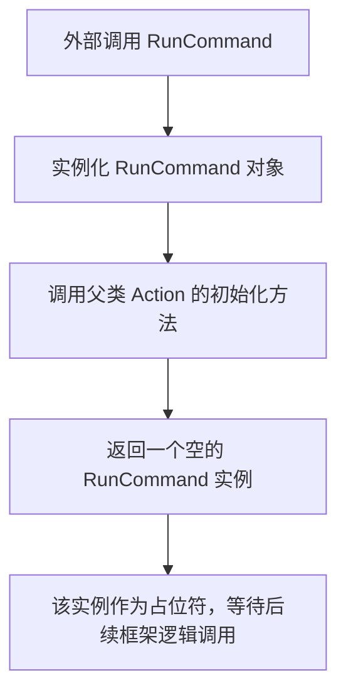

# `.\MetaGPT\metagpt\actions\di\run_command.py` 详细设计文档

该文件定义了一个名为 `RunCommand` 的类，它继承自 `metagpt.actions` 模块中的 `Action` 基类。其核心功能是作为一个占位符或符号，用于在更大的框架（如 MetaGPT）中表示“运行命令”这一概念，但当前并未实现具体的命令执行逻辑。

## 整体流程



## 类结构

```
Action (来自 metagpt.actions)
└── RunCommand (占位符类)
```

## 全局变量及字段


    

## 全局函数及方法


## 关键组件


### Action 基类

`RunCommand` 类继承自 `metagpt.actions` 模块中的 `Action` 基类，这表明它是 MetaGPT 框架中定义的一个具体动作（Action）。`Action` 是 MetaGPT 智能体（Agent）执行任务的核心抽象，每个 `Action` 代表一个可执行的、具有明确输入输出的原子操作或步骤。

### 符号化动作（Symbolic Action）

`RunCommand` 类被设计为一个“虚拟的”（dummy）动作，仅用作一个符号（symbol）。这意味着它可能不包含实际的执行逻辑（如 `run` 方法），其主要目的是在系统设计、流程编排或类型系统中作为一个占位符或标识符，代表“执行命令”这一概念，具体的实现可能由其他机制（如子类、插件或外部调用）提供。


## 问题及建议


### 已知问题

-   **功能缺失**：`RunCommand` 类目前仅作为一个“符号”或占位符存在，其 `run` 方法（继承自 `Action` 基类）未被重写或实现。这意味着它无法执行任何实际的命令运行逻辑，调用其 `run` 方法可能导致未定义行为或抛出 `NotImplementedError`（取决于基类的实现）。
-   **文档误导性**：类文档字符串（`"""A dummy RunCommand action used as a symbol only"""`）明确指出了其“虚拟”性质，但这与一个名为 `RunCommand` 的类的预期功能严重不符。这会给代码的使用者和维护者带来困惑，他们可能期望这个类能实际运行命令。
-   **违反接口契约**：作为 `Action` 的子类，它隐式承诺了会实现特定的行为（通常是 `run` 方法）。当前的“虚拟”实现破坏了这一契约，使得该类无法在需要实际 `Action` 实例的上下文中正常工作。

### 优化建议

-   **实现核心功能**：重写 `run` 方法，为其添加实际的命令行执行逻辑。例如，可以使用 `subprocess` 模块来运行系统命令，并处理输入、输出、错误及返回码。这是消除当前所有问题的根本解决方案。
-   **重构或移除**：如果该类确实仅作为占位符或用于某些元编程场景（如类型提示、注册），应考虑将其重命名为更能反映其用途的名称（例如 `PlaceholderRunCommand` 或 `RunCommandStub`），或者完全移除它，如果存在更好的替代方案。
-   **完善文档**：如果决定保留其作为“虚拟”类的用途，应在文档字符串中更详细地说明其存在的具体目的、使用场景以及为什么它不实现具体功能。同时，应明确警告使用者不要直接调用其 `run` 方法。
-   **添加类型提示和验证**：在实现 `run` 方法时，应为参数和返回值添加清晰的类型提示。同时，考虑对输入参数（如命令字符串）进行基本的验证，以提高代码的健壮性。


## 其它


### 设计目标与约束

该代码的设计目标是创建一个名为 `RunCommand` 的占位符或符号类，它继承自 `metagpt.actions` 模块中的 `Action` 基类。其主要约束是：1. 作为框架或流程中的一个标识性组件，可能用于后续的依赖注入、注册或类型检查，而非立即实现具体功能。2. 保持最小化实现，仅通过类定义和文档字符串来表明其存在和意图，不包含任何业务逻辑或状态。3. 依赖于外部定义的 `Action` 基类，其行为（如初始化、执行方法）由该基类决定。

### 错误处理与异常设计

当前代码未显式定义任何错误处理逻辑或抛出异常。所有的错误处理行为将继承自其父类 `Action`。如果 `Action` 基类定义了标准化的错误处理机制（例如，在执行方法中捕获并封装异常），那么 `RunCommand` 类在将来实现具体功能时也应遵循这一模式。目前，作为一个“dummy”（虚拟）类，它本身不引入新的错误点。

### 数据流与状态机

由于该类是一个未实现具体功能的虚拟类，目前不存在明确的数据流或状态机。其实例化后的对象状态完全由父类 `Action` 定义。如果未来被实例化并集成到某个工作流中，数据流将取决于其 `run` 方法（或其他由父类定义的核心方法）的输入参数和返回值。当前它仅作为一个类型标识符在系统中流动。

### 外部依赖与接口契约

1.  **外部依赖**：
    *   `metagpt.actions.Action`：这是唯一且关键的外部依赖。`RunCommand` 类的存在和类型定义完全依赖于这个基类。对 `Action` 基类的任何接口变更都可能影响 `RunCommand`。

2.  **接口契约**：
    *   **继承契约**：`RunCommand` 承诺遵循 `Action` 基类的公共接口。这意味着，一旦 `Action` 基类要求子类实现特定方法（例如 `run`），`RunCommand` 在未来必须实现该方法以履行契约。
    *   **语义契约**：通过类名 `RunCommand` 和文档字符串 `“A dummy RunCommand action used as a symbol only”`，该类向代码阅读者和框架使用者声明了其意图——这是一个代表“运行命令”概念的符号，当前暂无实现，但为未来的功能扩展预留了位置和类型。

### 测试策略建议

鉴于当前实现为空，无需编写具体的单元测试。但建议在测试策略中考虑：
1.  **导入与继承测试**：确保类可以正确导入，并且确实是 `Action` 的子类。
2.  **未来功能测试占位**：当该类被实现具体功能时，应为其编写完整的单元测试，覆盖其命令执行、参数解析、成功/失败场景等。
3.  **集成测试**：在更大的框架或工作流集成测试中，验证 `RunCommand` 类型能否被正确识别、加载和使用。

### 部署与配置考虑

该类作为纯Python代码，没有特殊的部署要求。其配置完全依赖于父类 `Action` 的配置机制（如果存在）。例如，如果 `Action` 框架支持通过配置文件或装饰器注册动作，那么 `RunCommand` 可能需要相应的注册条目才能被系统发现和使用。目前，它仅作为源代码的一部分存在。

### 安全考量

当前虚拟类不涉及任何安全操作。然而，考虑到其类名 `RunCommand` 暗示了未来可能执行系统命令或外部进程，在实现时必须高度重视安全风险：
1.  **命令注入**：必须对构建命令的参数进行严格的验证、净化和转义。
2.  **权限控制**：执行命令时应遵循最小权限原则。
3.  **输入验证**：所有输入到 `run` 方法的参数都需要进行有效性检查。
这些安全措施应在未来实现具体逻辑时作为核心需求进行设计和评审。

    