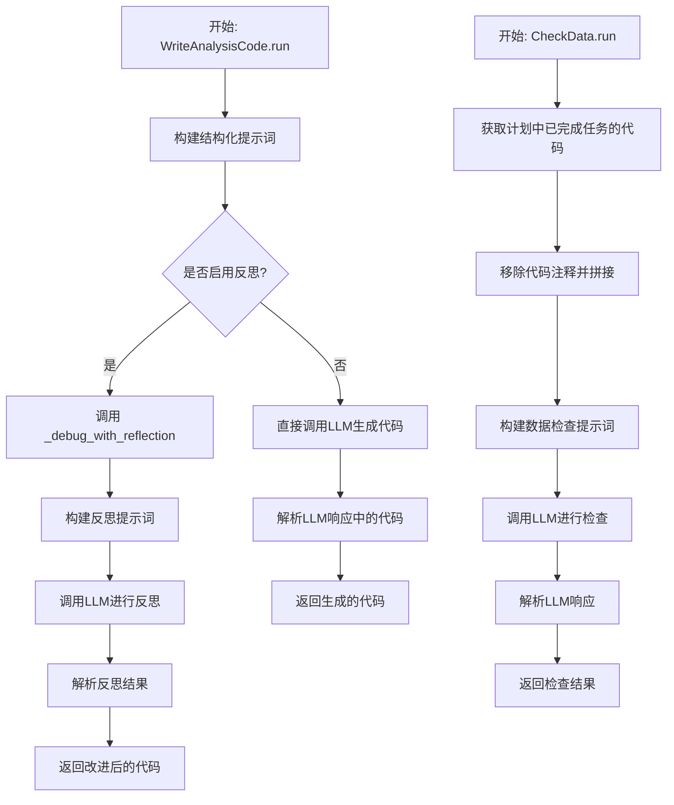
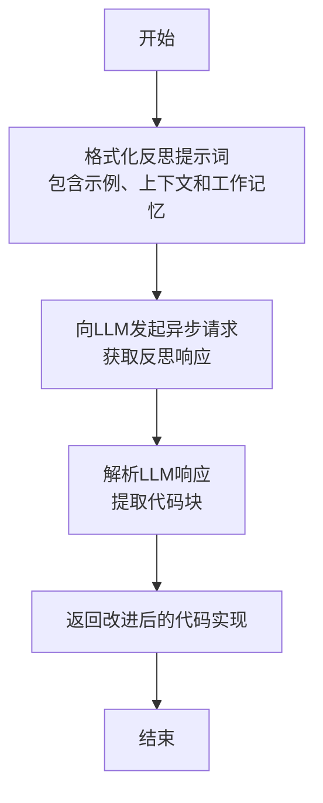
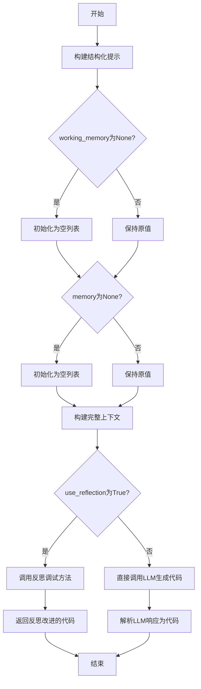
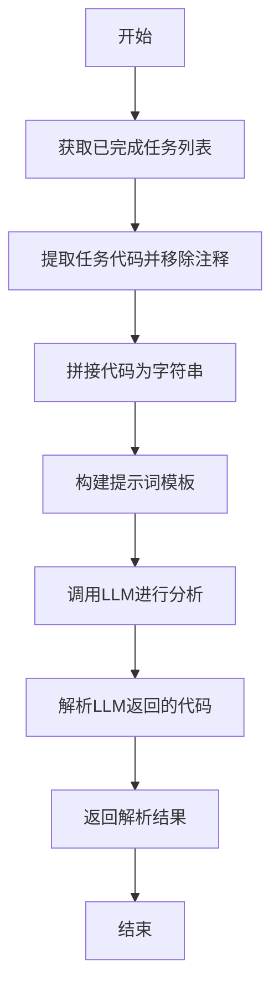

# `.\MetaGPT\metagpt\actions\di\write_analysis_code.py` 详细设计文档

该文件定义了两个Action类：`WriteAnalysisCode` 和 `CheckData`。`WriteAnalysisCode` 的核心功能是根据用户需求、计划状态和工具信息，通过大语言模型（LLM）生成结构化的分析代码，并可选地通过反思机制（reflection）来调试和改进生成的代码。`CheckData` 的核心功能是检查一个计划（Plan）中已完成任务所生成的代码，通过LLM评估其数据处理的正确性或完整性。

## 整体流程



## 类结构

```
Action (基类，来自metagpt.actions)
├── WriteAnalysisCode
│   ├── _debug_with_reflection (私有方法)
│   └── run (主方法)
└── CheckData
    └── run (主方法)
```

## 全局变量及字段


    

## 全局函数及方法

### `WriteAnalysisCode._debug_with_reflection`

该方法通过“反思”机制来调试和改进代码实现。它利用一个包含调试示例、当前上下文和先前实现的工作记忆的提示词，向大语言模型（LLM）请求一个经过反思和改进的代码版本，旨在解决现有实现中的问题或不足。

参数：

- `context`：`list[Message]`，包含当前对话上下文的消息列表，用于为LLM提供生成改进代码所需的背景信息。
- `working_memory`：`list[Message]`，包含先前代码实现或相关步骤的工作记忆消息列表，作为反思和改进的起点。

返回值：`str`，返回一个经过LLM反思和改进后的代码实现字符串。

#### 流程图



#### 带注释源码

```python
async def _debug_with_reflection(self, context: list[Message], working_memory: list[Message]):
    # 1. 构建反思提示词：将调试示例、当前上下文和先前实现格式化为一个完整的提示。
    reflection_prompt = REFLECTION_PROMPT.format(
        debug_example=DEBUG_REFLECTION_EXAMPLE,
        context=context,
        previous_impl=working_memory,
    )

    # 2. 异步调用LLM：使用特定的系统消息（反思系统消息）来引导LLM进行反思和改进。
    rsp = await self._aask(reflection_prompt, system_msgs=[REFLECTION_SYSTEM_MSG])
    
    # 3. 解析响应：从LLM的响应中提取出代码部分。
    #    注释掉的代码展示了另一种可能的解析方式（解析为JSON并提取特定字段）。
    # reflection = json.loads(CodeParser.parse_code(block=None, text=rsp))
    # return reflection["improved_impl"]
    reflection = CodeParser.parse_code(block=None, text=rsp)
    
    # 4. 返回结果：将解析出的改进代码返回给调用者。
    return reflection
```

### `WriteAnalysisCode.run`

该方法根据用户需求、计划状态、工具信息等上下文，通过结构化提示生成或调试分析代码。它可以选择使用反思机制来改进代码实现，最终返回生成的Python代码。

参数：

- `user_requirement`：`str`，用户的需求描述
- `plan_status`：`str`，计划执行状态信息，默认为空字符串
- `tool_info`：`str`，可用工具信息，默认为空字符串
- `working_memory`：`list[Message]`，工作记忆中的消息列表，默认为None
- `use_reflection`：`bool`，是否使用反思机制改进代码，默认为False
- `memory`：`list[Message]`，长期记忆中的消息列表，默认为None
- `**kwargs`：`Any`，传递给LLM的额外参数

返回值：`str`，生成的Python代码字符串

#### 流程图



#### 带注释源码

```python
async def run(
    self,
    user_requirement: str,
    plan_status: str = "",
    tool_info: str = "",
    working_memory: list[Message] = None,
    use_reflection: bool = False,
    memory: list[Message] = None,
    **kwargs,
) -> str:
    # 构建结构化提示，整合用户需求、计划状态和工具信息
    structual_prompt = STRUCTUAL_PROMPT.format(
        user_requirement=user_requirement,
        plan_status=plan_status,
        tool_info=tool_info,
    )

    # 初始化工作记忆和长期记忆（如果为None）
    working_memory = working_memory or []
    memory = memory or []
    
    # 构建完整的上下文：长期记忆 + 结构化提示 + 工作记忆
    context = self.llm.format_msg(memory + [Message(content=structual_prompt, role="user")] + working_memory)

    # 根据是否使用反思机制选择不同的代码生成路径
    if use_reflection:
        # 使用反思机制调试和改进代码
        code = await self._debug_with_reflection(context=context, working_memory=working_memory)
    else:
        # 直接调用LLM生成代码
        rsp = await self.llm.aask(context, system_msgs=[INTERPRETER_SYSTEM_MSG], **kwargs)
        # 从响应中解析Python代码
        code = CodeParser.parse_code(text=rsp, lang="python")

    # 返回生成的代码
    return code
```

### `CheckData.run`

该方法用于检查已完成任务中生成的代码，通过调用LLM分析代码内容，并返回分析结果。

参数：

- `plan`：`Plan`，包含任务计划的对象，用于获取已完成的任务列表

返回值：`dict`，包含LLM分析后的代码解析结果

#### 流程图



#### 带注释源码

```python
async def run(self, plan: Plan) -> dict:
    # 获取已完成的任务列表
    finished_tasks = plan.get_finished_tasks()
    
    # 提取每个任务的代码并移除注释
    code_written = [remove_comments(task.code) for task in finished_tasks]
    
    # 将代码拼接为字符串，用两个换行符分隔
    code_written = "\n\n".join(code_written)
    
    # 使用代码字符串填充提示词模板
    prompt = CHECK_DATA_PROMPT.format(code_written=code_written)
    
    # 调用LLM进行分析
    rsp = await self._aask(prompt)
    
    # 解析LLM返回的代码
    code = CodeParser.parse_code(text=rsp)
    
    # 返回解析结果
    return code
```

## 关键组件


### 张量索引与惰性加载

通过`WriteAnalysisCode`类的`run`方法，根据用户需求、计划状态和工具信息动态生成分析代码，支持在生成过程中通过`use_reflection`参数启用基于历史工作记忆的反思与调试机制，实现代码生成的按需（惰性）执行和迭代优化。

### 反量化支持

`WriteAnalysisCode`类的`_debug_with_reflection`方法提供了代码生成后的反思与改进机制，它利用`REFLECTION_PROMPT`和`DEBUG_REFLECTION_EXAMPLE`对生成的初步实现进行分析，并输出改进后的代码，实现了对初步生成结果的“反量化”评估与修正。

### 量化策略

`CheckData`类的`run`方法实现了对已完成的计划任务中生成代码的检查策略，它提取所有已完成任务的代码，移除注释后拼接，并通过`CHECK_DATA_PROMPT`引导LLM进行分析，最终返回结构化的检查结果，这是一种对生成代码质量进行量化和评估的后处理策略。


## 问题及建议


### 已知问题

-   **`_debug_with_reflection` 方法中的注释代码**：`_debug_with_reflection` 方法中包含了两行被注释掉的代码（`# reflection = json.loads(CodeParser.parse_code(block=None, text=rsp))` 和 `# return reflection["improved_impl"]`）。这表明可能存在一个未完成的代码重构或功能切换，导致当前逻辑（直接返回解析后的文本）与注释中暗示的逻辑（解析JSON并返回特定字段）不一致，这会造成混淆并可能隐藏潜在的错误处理逻辑。
-   **`WriteAnalysisCode.run` 方法中 `context` 构建的潜在问题**：在构建 `context` 时，代码将 `memory`、新的用户消息（包含 `structual_prompt`）和 `working_memory` 拼接起来。如果 `memory` 或 `working_memory` 中包含大量历史消息，可能会导致上下文过长，超出语言模型的令牌限制，从而影响生成质量或导致调用失败。
-   **`CheckData.run` 方法中 `code_written` 的构建方式**：`code_written` 是通过简单地将所有已完成任务的代码（去除注释后）用两个换行符连接而成。如果任务代码量很大，这种拼接方式可能效率不高，并且如果代码本身包含特定的格式或结构要求，简单的拼接可能会破坏这些结构。
-   **异常处理缺失**：代码中大量使用了 `await` 进行异步调用（如 `self._aask`, `self.llm.aask`），但未见对可能发生的异常（如网络错误、API调用失败、解析错误等）进行捕获和处理。这可能导致程序在遇到意外情况时崩溃。
-   **类型注解不完整**：例如，`WriteAnalysisCode.run` 方法的参数 `working_memory` 和 `memory` 的默认值为 `None`，但类型注解为 `list[Message]`，这在使用静态类型检查工具（如mypy）时会产生警告。`kwargs` 参数也缺少类型注解。

### 优化建议

-   **清理或实现注释代码**：应决定是彻底删除 `_debug_with_reflection` 方法中的注释代码，还是根据注释的意图实现完整的JSON解析逻辑。如果当前直接返回文本的逻辑是正确的，应删除注释以避免误导。如果需要JSON解析，则应实现它并添加适当的错误处理（如 `json.JSONDecodeError`）。
-   **优化上下文管理**：在 `WriteAnalysisCode.run` 方法中，应考虑对 `memory` 和 `working_memory` 进行智能截断或总结，以确保最终的 `context` 长度在模型限制之内。可以实现一个辅助函数来管理上下文长度。
-   **改进代码拼接逻辑**：对于 `CheckData.run` 方法，可以考虑在拼接 `code_written` 时，检查代码块之间的依赖关系或结构，采用更智能的合并方式，或者仅在确实需要全部代码时才进行拼接。也可以评估是否真的需要拼接所有代码，或许只需要关键部分的代码或元信息。
-   **增加健壮性异常处理**：在关键的执行路径上，特别是所有异步LLM调用和代码解析步骤周围，添加 `try-except` 块。捕获可能发生的特定异常（如 `aiohttp.ClientError`, `json.JSONDecodeError`, `ValueError` 等），并记录错误日志，或者返回一个友好的错误信息/默认值，使系统能够优雅地降级或恢复。
-   **完善类型注解**：为所有方法和函数参数、返回值提供完整的类型注解。将 `working_memory: list[Message] = None` 修正为 `working_memory: list[Message] | None = None`。为 `**kwargs` 添加 `Any` 或更具体的类型注解。这可以提高代码的可读性和可维护性，并利用静态检查工具提前发现潜在问题。
-   **考虑引入配置或常量**：`INTERPRETER_SYSTEM_MSG` 等系统消息作为硬编码的列表传入。考虑将这些配置项集中管理，例如放在类的常量中或从配置文件中读取，以提高可配置性。
-   **代码解析的健壮性**：`CodeParser.parse_code` 被多处调用，但其内部可能对输入格式有特定要求。建议在其调用点添加更多验证，或者确保 `parse_code` 方法本身能处理边缘情况（如空输入、无法解析的格式），并返回明确的结果或抛出清晰的异常。


## 其它


### 设计目标与约束

该代码模块的设计目标是提供一个可扩展的代码生成与验证框架，用于根据用户需求自动生成数据分析代码，并支持通过反思机制进行迭代优化。核心约束包括：1) 必须与MetaGPT框架中的`Action`基类兼容，遵循其异步执行模式；2) 需要处理来自LLM的文本响应，并从中可靠地解析出代码块；3) 需要支持两种代码生成模式（直接生成与反思调试）；4) 代码生成过程需能结合历史上下文（`memory`）和当前工作状态（`working_memory`）。

### 错误处理与异常设计

当前代码中显式的错误处理逻辑较少，主要依赖外部调用链和LLM响应的正确性。潜在的风险点包括：1) `CodeParser.parse_code`方法在解析LLM响应失败时可能返回空值或格式错误的字符串，导致后续流程出错；2) `_debug_with_reflection`方法中，从反思提示词生成的`rsp`可能不符合预期的JSON或代码块格式；3) `CheckData`类的`run`方法中，`plan.get_finished_tasks()`可能返回空列表，导致`code_written`为空字符串，影响后续提示词构造。目前这些情况均未设置异常捕获或默认值回退机制。

### 数据流与状态机

1.  **`WriteAnalysisCode.run` 数据流**：
    *   **输入**：`user_requirement`（原始需求）、`plan_status`（计划状态）、`tool_info`（工具信息）、`working_memory`（当前工作记忆）、`use_reflection`（模式开关）、`memory`（历史记忆）。
    *   **处理**：根据输入构造结构化提示词（`structual_prompt`），与`memory`和`working_memory`组合形成最终上下文（`context`）。根据`use_reflection`标志，选择直接调用LLM或进入反思调试流程（`_debug_with_reflection`）来生成代码。
    *   **输出**：解析后的代码字符串。
2.  **`WriteAnalysisCode._debug_with_reflection` 数据流**：
    *   **输入**：`context`（当前上下文）、`working_memory`（先前实现）。
    *   **处理**：构造反思提示词，调用LLM获取改进建议，并解析出“改进后的实现”代码。
    *   **输出**：改进后的代码字符串。
3.  **`CheckData.run` 数据流**：
    *   **输入**：`Plan`对象。
    *   **处理**：从计划中提取已完成任务的代码，拼接后构造数据检查提示词，调用LLM获取检查结果代码。
    *   **输出**：解析后的检查代码（以字典形式返回？代码中返回`code`，但类型标注为`dict`，可能存在不一致）。
4.  **状态机**：`WriteAnalysisCode`的行为由`use_reflection`参数控制，形成两种主要状态：**直接生成状态**和**反思优化状态**。`CheckData`是一个独立的验证状态，通常在代码生成流程的后期被调用。

### 外部依赖与接口契约

1.  **LLM服务**：强依赖外部大语言模型服务。通过`self.llm.aask`和`self._aask`方法进行交互。接口契约要求LLM返回包含可解析代码块的文本。
2.  **Prompt模板**：强依赖定义在`metagpt.prompts.di.write_analysis_code`中的一系列提示词模板（`STRUCTUAL_PROMPT`, `REFLECTION_PROMPT`, `CHECK_DATA_PROMPT`, `DEBUG_REFLECTION_EXAMPLE`, `INTERPRETER_SYSTEM_MSG`, `REFLECTION_SYSTEM_MSG`）。这些模板的格式和内容直接影响代码生成的质量。
3.  **`CodeParser`工具**：依赖`metagpt.utils.common.CodeParser`来从LLM的非结构化响应中提取代码块。契约是输入文本和语言标识，输出纯净的代码字符串。
4.  **`remove_comments`工具**：依赖`metagpt.utils.common.remove_comments`来清理代码中的注释，可能用于避免提示词过长或干扰LLM判断。
5.  **`Message`与`Plan`数据结构**：依赖`metagpt.schema`中定义的`Message`和`Plan`类作为核心数据载体。`Message`用于构建LLM上下文，`Plan`用于在`CheckData`中组织任务和代码。
6.  **`Action`基类**：继承自`metagpt.actions.Action`，必须实现异步的`run`方法，并遵循其生命周期和上下文管理约定。

### 安全与合规考虑

1.  **代码注入**：生成的代码直接来自LLM，存在执行恶意代码的风险。当前设计中没有对生成的代码进行沙箱执行、静态安全扫描或人工审核的环节。
2.  **数据泄露**：`user_requirement`、`plan_status`、`tool_info`以及`memory`中的历史消息可能包含敏感信息。这些信息被完整地填入提示词并发送给外部LLM服务，存在数据泄露风险。
3.  **提示词注入**：如果用户输入（`user_requirement`）或工作记忆中的内容包含特殊格式或指令，可能破坏预设的提示词结构，导致LLM执行非预期操作（提示词注入攻击）。当前代码未对输入进行清洗或转义。
4.  **依赖合规性**：生成的代码可能建议安装或使用未经审核的第三方Python库，可能引入许可证冲突或含有漏洞的依赖。

### 性能考量

1.  **LLM调用延迟**：`run`方法和`_debug_with_reflection`方法的核心操作是调用LLM，这是主要的性能瓶颈。网络延迟和模型推理时间直接影响整体响应速度。
2.  **上下文长度**：`context`由`memory`、`structual_prompt`和`working_memory`拼接而成。随着对话或任务进行，`memory`和`working_memory`可能增长，导致提示词过长，进而增加LLM处理时间、成本和可能因超过模型上下文窗口而导致的失败。
3.  **反思模式开销**：`use_reflection=True`时，需要额外进行一次LLM调用（反思）来优化代码，虽然可能提升代码质量，但代价是双倍的延迟和成本。
4.  **序列化/反序列化**：虽然当前代码中注释掉了`json.loads`，但如果启用，从LLM响应解析JSON也是一项开销。`CodeParser.parse_code`的内部实现复杂度也会影响性能。

### 测试策略建议

1.  **单元测试**：
    *   `WriteAnalysisCode._debug_with_reflection`：模拟LLM返回各种格式的反思结果，测试`CodeParser`的解析鲁棒性。
    *   `WriteAnalysisCode.run`：分别测试`use_reflection`为`True`和`False`时的执行路径，模拟LLM成功响应和异常响应。
    *   `CheckData.run`：测试`plan`为空、包含一个任务、包含多个任务等情况下的代码拼接逻辑。
2.  **集成测试**：
    *   模拟真实的LLM端点（或使用轻量级测试模型），测试从用户需求到代码生成的完整流程。
    *   测试`WriteAnalysisCode`与`CheckData`的串联使用，验证生成的代码是否能通过数据检查。
3.  **提示词测试**：由于强依赖提示词，需要设计测试用例验证各提示词模板（`STRUCTUAL_PROMPT`, `REFLECTION_PROMPT`等）在不同边界输入下的有效性，确保其能引导LLM生成正确格式的响应。
4.  **模糊/安全测试**：向`user_requirement`输入特殊字符、超长字符串、或模拟恶意指令，观察系统行为，测试其抗注入能力和稳定性。

    