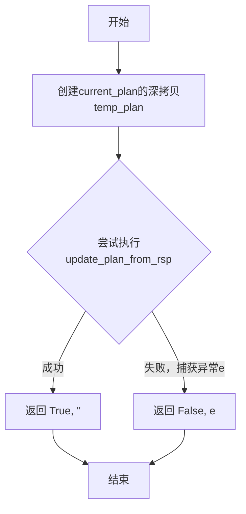
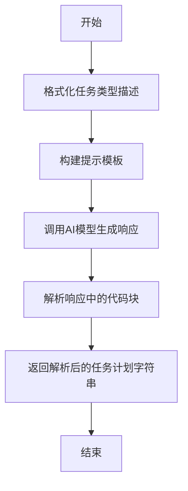

# `.\MetaGPT\metagpt\actions\di\write_plan.py` 详细设计文档

该文件定义了一个用于生成和更新任务计划的Action类（WritePlan）以及相关的辅助函数。其核心功能是：根据给定的上下文信息（如对话历史或目标描述），利用大语言模型生成一个结构化的任务计划（Plan），该计划由多个任务（Task）组成；同时提供对现有计划进行更新、替换和校验的功能。

## 整体流程

```mermaid
graph TD
    A[开始: 调用WritePlan.run] --> B[构建Prompt]
    B --> C[调用LLM (_aask)]
    C --> D[解析LLM响应 (CodeParser.parse_code)]
    D --> E[返回JSON格式的任务列表]
    F[开始: 调用update_plan_from_rsp] --> G{解析响应为Task列表}
    G --> H{响应任务数量==1 或 首个任务有依赖?}
    H -- 是 --> I{当前计划中是否存在此task_id?}
    I -- 是 --> J[替换现有任务 (replace_task)]
    I -- 否 --> K[追加新任务 (append_task)]
    H -- 否 --> L[批量添加任务 (add_tasks)]
    M[开始: 调用precheck_update_plan_from_rsp] --> N[深拷贝当前计划]
    N --> O[尝试调用update_plan_from_rsp]
    O --> P{是否发生异常?}
    P -- 否 --> Q[返回 (True, '')]
    P -- 是 --> R[返回 (False, 异常信息)]
```

## 类结构

```
Action (来自metagpt.actions)
└── WritePlan
Plan (来自metagpt.schema)
Task (来自metagpt.schema)
TaskType (来自metagpt.strategy.task_type)
```

## 全局变量及字段


### `PROMPT_TEMPLATE`
    
一个用于生成任务计划的提示词模板，定义了LLM的输入格式和输出要求。

类型：`str`
    


    

## 全局函数及方法


### `update_plan_from_rsp`

该函数用于根据一个JSON格式的响应字符串（`rsp`）来更新一个现有的计划对象（`current_plan`）。它解析响应字符串，将其转换为任务列表，并根据任务列表的长度、任务间的依赖关系以及任务ID是否已存在于当前计划中，来决定是替换现有任务、追加新任务还是批量添加任务。

参数：

-  `rsp`：`str`，一个包含任务配置列表的JSON格式字符串。
-  `current_plan`：`Plan`，需要被更新的当前计划对象。

返回值：`None`，该函数不返回任何值，直接修改传入的`current_plan`对象。

#### 流程图

```mermaid
flowchart TD
    A[开始: update_plan_from_rsp(rsp, current_plan)] --> B[解析JSON字符串 rsp 为列表]
    B --> C[将列表中的每个字典转换为 Task 对象]
    C --> D{判断任务列表 tasks 长度及首个任务的依赖?}
    D -- “tasks 长度为1 或<br>tasks[0]有依赖” --> E{首个任务ID是否已存在于当前计划?}
    D -- “tasks 长度>1 且<br>tasks[0]无依赖” --> F[调用 current_plan.add_tasks(tasks) 批量添加]
    E -- “是” --> G[调用 current_plan.replace_task 替换现有任务]
    E -- “否” --> H[调用 current_plan.append_task 追加新任务]
    G --> I[结束]
    H --> I
    F --> I
```

#### 带注释源码

```python
def update_plan_from_rsp(rsp: str, current_plan: Plan):
    # 1. 解析传入的JSON字符串，将其转换为Python列表（列表元素为字典）
    rsp = json.loads(rsp)
    # 2. 将列表中的每个字典（任务配置）实例化为Task对象，生成任务列表
    tasks = [Task(**task_config) for task_config in rsp]

    # 3. 核心逻辑：根据生成的任务列表特征，决定如何更新当前计划
    #    条件：如果只生成了一个任务，或者生成的第一个任务有前置依赖（dependent_task_ids不为空）
    if len(tasks) == 1 or tasks[0].dependent_task_ids:
        # 3.1 如果第一个任务有依赖，且任务列表长度大于1，说明生成的不是一个完整的新计划，
        #     而是基于现有计划的部分更新。目前逻辑仅支持每次更新一个任务，因此发出警告。
        if tasks[0].dependent_task_ids and len(tasks) > 1:
            logger.warning(
                "Current plan will take only the first generated task if the generated tasks are not a complete plan"
            )
        # 3.2 处理单个任务（可能是替换或追加）
        #     检查当前计划中是否已存在该任务的ID
        if current_plan.has_task_id(tasks[0].task_id):
            # 3.2.1 如果ID已存在，则替换该任务
            current_plan.replace_task(
                tasks[0].task_id, tasks[0].dependent_task_ids, tasks[0].instruction, tasks[0].assignee
            )
        else:
            # 3.2.2 如果ID不存在，则将该任务追加到计划末尾
            current_plan.append_task(
                tasks[0].task_id, tasks[0].dependent_task_ids, tasks[0].instruction, tasks[0].assignee
            )

    else:
        # 4. 如果生成了多个任务，且第一个任务没有依赖，则视为一个完整的新计划片段，进行批量添加
        current_plan.add_tasks(tasks)
```


### `precheck_update_plan_from_rsp`

该函数用于预检查从响应字符串（`rsp`）更新计划（`current_plan`）的操作是否能够成功执行。它通过创建一个当前计划的深拷贝，并尝试在该拷贝上执行更新操作来实现。如果更新成功，则返回成功标志和空字符串；如果更新过程中发生任何异常，则返回失败标志和异常信息。这允许调用者在实际修改原始计划之前验证更新操作的可行性。

参数：
- `rsp`：`str`，包含计划更新信息的JSON格式字符串。
- `current_plan`：`Plan`，当前待更新的计划对象。

返回值：`Tuple[bool, str]`，返回一个元组，其中第一个元素是布尔值，表示预检查是否成功（`True`为成功，`False`为失败）；第二个元素是字符串，成功时为空字符串，失败时为捕获的异常信息。

#### 流程图



#### 带注释源码

```python
def precheck_update_plan_from_rsp(rsp: str, current_plan: Plan) -> Tuple[bool, str]:
    # 创建当前计划对象的深拷贝，避免在预检查过程中修改原始数据
    temp_plan = deepcopy(current_plan)
    try:
        # 尝试在临时计划上执行更新操作
        update_plan_from_rsp(rsp, temp_plan)
        # 如果更新成功，返回成功标志和空错误信息
        return True, ""
    except Exception as e:
        # 如果在更新过程中捕获到任何异常，返回失败标志和异常信息
        return False, e
```

### `WritePlan.run`

该方法根据给定的上下文信息和最大任务数，生成或修改一个任务计划。它通过格式化提示模板，调用AI模型生成响应，并解析响应中的JSON格式任务列表，最终返回解析后的任务计划字符串。

参数：

- `context`：`list[Message]`，上下文信息列表，包含生成计划所需的相关消息。
- `max_tasks`：`int`，计划中允许的最大任务数，默认为5。

返回值：`str`，解析后的任务计划字符串，格式为JSON列表。

#### 流程图



#### 带注释源码

```python
async def run(self, context: list[Message], max_tasks: int = 5) -> str:
    # 生成任务类型的描述字符串，用于提示模板
    task_type_desc = "\n".join([f"- **{tt.type_name}**: {tt.value.desc}" for tt in TaskType])
    
    # 格式化提示模板，将上下文、最大任务数和任务类型描述填入模板
    prompt = PROMPT_TEMPLATE.format(
        context="\n".join([str(ct) for ct in context]), max_tasks=max_tasks, task_type_desc=task_type_desc
    )
    
    # 调用AI模型生成响应
    rsp = await self._aask(prompt)
    
    # 解析响应中的代码块，提取JSON格式的任务计划
    rsp = CodeParser.parse_code(text=rsp)
    
    # 返回解析后的任务计划字符串
    return rsp
```

## 关键组件


### WritePlan 类

一个用于生成或修改任务计划的 Action 类，它通过调用大语言模型（LLM）并解析其响应来创建结构化的任务列表。

### update_plan_from_rsp 函数

一个用于根据 LLM 的响应字符串来更新现有 `Plan` 对象的函数。它根据响应是单个任务还是完整计划，来决定是替换、追加还是批量添加任务。

### precheck_update_plan_from_rsp 函数

一个用于安全预检查 `update_plan_from_rsp` 操作的函数。它通过在一个深拷贝的临时 `Plan` 对象上执行更新来验证响应字符串的有效性，避免直接修改原计划。

### Plan 和 Task 数据结构

`Plan` 和 `Task` 是用于表示任务计划及其组成任务的核心数据结构。`Plan` 管理一个任务集合，`Task` 定义了任务的 ID、依赖关系、指令、类型和执行者等属性。

### TaskType 枚举

一个定义了可用任务类型及其描述的枚举，用于在生成计划时约束和指导任务类型的选取。

### PROMPT_TEMPLATE 模板

一个用于构造发送给 LLM 的提示词（Prompt）的字符串模板。它整合了上下文、可用任务类型描述和任务数量限制，以引导 LLM 生成符合特定格式的 JSON 计划。


## 问题及建议


### 已知问题

-   **`update_plan_from_rsp` 函数逻辑复杂且职责不单一**：该函数同时处理了“完整计划更新”和“单个任务更新”两种场景，并且通过检查 `tasks[0].dependent_task_ids` 和任务数量来区分。这种隐式的、基于数据状态的逻辑分支使得函数难以理解、测试和维护。特别是当 `tasks[0].dependent_task_ids` 非空但 `len(tasks) == 1` 时，其行为（替换或追加）依赖于 `current_plan.has_task_id` 的检查，逻辑链条较长。
-   **`precheck_update_plan_from_rsp` 函数存在性能与副作用风险**：该函数通过 `deepcopy` 整个当前计划 (`current_plan`) 来执行预检查。如果 `Plan` 对象较大或包含复杂嵌套结构，深拷贝操作可能带来显著的性能开销。此外，该函数捕获了所有 `Exception`，这可能会掩盖一些本应暴露的编程错误或系统级异常，不利于调试。
-   **`WritePlan.run` 方法对 `max_tasks` 参数缺乏验证**：`max_tasks` 参数直接插入到提示词模板中，但未对其值进行有效性检查（例如，是否为正整数）。如果传入无效值（如0或负数），可能导致生成的计划不符合预期或引发下游处理逻辑的混淆。
-   **`update_plan_from_rsp` 函数对输入 `rsp` 的健壮性不足**：函数假设 `json.loads(rsp)` 成功后的数据结构完全符合 `Task` 的构造要求。如果响应的 JSON 结构不完整或包含未知字段，`Task(**task_config)` 可能会抛出异常（如 `TypeError`），而错误处理仅由外部的 `precheck_update_plan_from_rsp` 捕获，函数本身没有提供更细致的错误信息。
-   **日志警告信息可能不够明确**：当 `tasks[0].dependent_task_ids` 为真且 `len(tasks) > 1` 时，日志记录了一条警告，但并未明确指出哪些生成的 task_id 被忽略，或者为什么这种“不完整的计划”场景下只支持更新单个任务，这不利于问题排查。

### 优化建议

-   **重构 `update_plan_from_rsp` 函数，明确职责分离**：建议将该函数拆分为两个或三个更小、功能更专注的函数。例如：一个函数专门处理“完整计划替换”（`len(tasks) > 1 且 tasks[0].dependent_task_ids 为空`），另一个函数专门处理“单个任务更新”（`len(tasks) == 1`），并通过一个清晰的入口函数（如 `apply_plan_update`）根据输入特征调用相应的子函数。这能极大提升代码的可读性和可测试性。
-   **优化 `precheck_update_plan_from_rsp` 的实现**：考虑是否可以通过其他方式实现预检查而避免深拷贝。例如，可以创建一个轻量级的、仅包含必要验证逻辑的模拟 `Plan` 对象，或者重构 `update_plan_from_rsp` 使其先进行纯验证（不修改状态），再进行实际更新。同时，应将捕获的异常类型具体化（如 `json.JSONDecodeError`, `KeyError`, `ValueError` 等），只捕获与数据格式和业务逻辑相关的预期异常，让其他异常正常抛出。
-   **在 `WritePlan.run` 中添加参数验证**：在方法开始处对 `max_tasks` 参数进行验证，确保其值大于等于1。可以抛出 `ValueError` 并提供明确的错误信息，防止无效参数流入后续流程。
-   **增强 `update_plan_from_rsp` 的数据验证和错误反馈**：在 `Task(**task_config)` 构造之前，可以增加一步数据校验，检查必要的字段（如 `task_id`, `instruction`）是否存在，`task_type` 是否在 `TaskType` 枚举范围内等。校验失败时，抛出包含具体任务配置和错误原因的 `ValueError`，便于调用方定位问题。
-   **改进日志信息**：在发出警告日志时，可以附带更详细的上下文信息，例如被忽略的任务ID列表、当前操作的目标计划ID等。这有助于在分布式或并发环境中跟踪特定计划更新的生命周期和问题。
-   **考虑引入 Pydantic 模型进行数据验证**：对于从 JSON 反序列化而来的任务配置，可以使用 Pydantic 的 `BaseModel` 来定义 `TaskConfig` 模型。这能自动处理类型转换、字段验证和默认值，使 `update_plan_from_rsp` 函数更加简洁和健壮，减少手动的校验代码。


## 其它


### 设计目标与约束

本模块的核心设计目标是提供一个灵活、可扩展的智能体（Agent）任务规划与更新机制。它旨在根据给定的上下文和目标，生成或修改一个由多个任务组成的计划（Plan）。主要约束包括：1) 任务数量上限可配置（默认为5个），以控制计划复杂度；2) 任务类型必须从预定义的枚举（TaskType）中选择，确保任务语义的规范性；3) 计划更新需遵循特定逻辑（如单任务更新、完整计划替换），以维持计划结构的一致性和正确性。

### 错误处理与异常设计

模块的错误处理主要分为两类：输入/处理过程中的逻辑错误和运行时异常。对于逻辑错误，如生成的响应（`rsp`）不符合JSON格式或任务依赖关系无效，`update_plan_from_rsp`函数会抛出`json.JSONDecodeError`或其他`Exception`。`precheck_update_plan_from_rsp`函数专门用于安全地预检查更新操作，捕获任何异常并返回（`False`, 错误信息）元组，供调用方决定是否继续。对于潜在的数据不一致（如生成的多个任务却存在依赖关系），代码通过日志（`logger.warning`）发出警告并采取保守策略（仅处理第一个任务），这是一种优雅降级而非硬性失败的设计。

### 数据流与状态机

数据流始于`WritePlan.run`方法，它接收上下文消息列表和最大任务数，通过提示词模板调用大语言模型（LLM）生成计划描述文本。该文本经`CodeParser.parse_code`提取JSON部分后，作为字符串传递给`update_plan_from_rsp`函数。此函数是核心状态转换器：它解析JSON，创建`Task`对象列表，并根据列表长度、首个任务的`dependent_task_ids`属性以及该任务ID是否已存在于当前计划（`current_plan`）中，决定是替换现有任务、追加新任务还是批量添加任务，从而驱动`Plan`对象从一个状态更新到下一个状态。`precheck_update_plan_from_rsp`是此数据流的一个只读分支，用于验证转换的有效性而不实际修改状态。

### 外部依赖与接口契约

1.  **大语言模型（LLM）服务**：`WritePlan`继承自`Action`，其`_aask`方法依赖于外部LLM API。接口契约是：输入为符合`PROMPT_TEMPLATE`格式的提示词字符串，输出为包含JSON代码块的自由文本。
2.  **`Plan` 与 `Task` 类**：`update_plan_from_rsp`函数强依赖于`metagpt.schema`中的`Plan`和`Task`类。它调用`Plan`的方法（`has_task_id`, `replace_task`, `append_task`, `add_tasks`）并期望`Task`的构造函数能接受特定字段。这是模块与项目核心数据模型的关键契约。
3.  **`TaskType` 枚举**：`WritePlan.run`方法依赖`metagpt.strategy.task_type.TaskType`来生成可供LLM选择的任务类型描述。这确保了生成任务类型的合法性。
4.  **`CodeParser` 工具**：依赖`metagpt.utils.common.CodeParser.parse_code`从LLM响应中提取JSON代码块，假设响应格式包含特定的代码标记（如```json）。

    