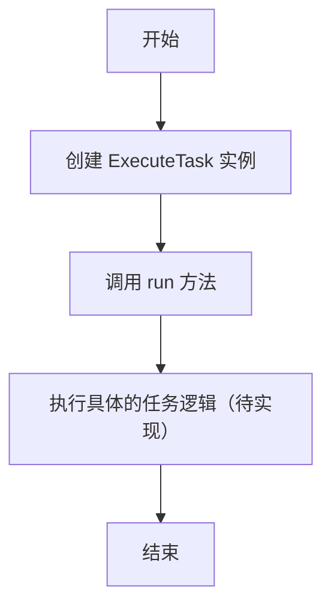
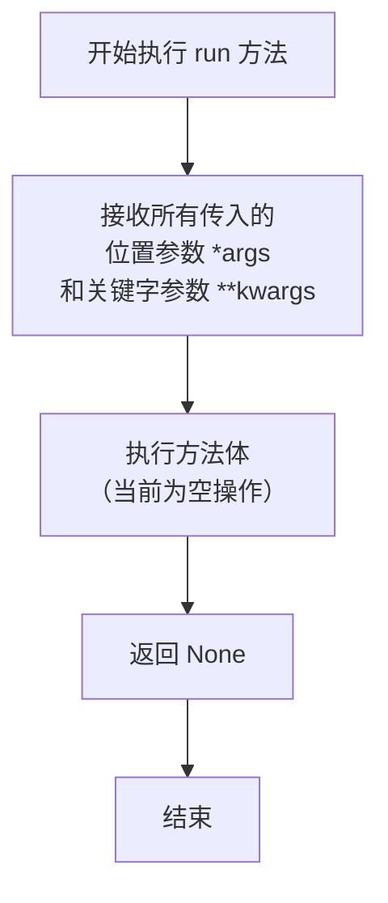

# `.\MetaGPT\metagpt\actions\execute_task.py` 详细设计文档

该文件定义了一个名为 `ExecuteTask` 的类，它是 `Action` 基类的子类。其核心功能是作为一个占位符或抽象模板，用于执行特定的任务。它定义了一个任务名称和一个用于存储输入上下文的列表，但具体的任务执行逻辑（`run` 方法）尚未实现，需要由子类或具体实例来填充。

## 整体流程



## 类结构

```
Action (基类，来自 metagpt.actions)
└── ExecuteTask
```

## 全局变量及字段


### `ExecuteTask.name`
    
表示该Action的名称，用于标识和区分不同的Action。

类型：`str`
    


### `ExecuteTask.i_context`
    
存储执行任务时所需的上下文信息，通常包含一系列消息对象。

类型：`list[Message]`
    
    

## 全局函数及方法


### `ExecuteTask.run`

`ExecuteTask.run` 方法是 `ExecuteTask` 类的核心异步执行方法。根据当前代码实现，它是一个占位符方法，旨在被子类重写以实现具体的任务执行逻辑。其设计目标是接收任意位置参数和关键字参数，并返回一个 `None` 值，表明默认情况下不执行任何操作。

参数：

-  `*args`：`tuple`，可变长度的位置参数元组，用于接收调用时传入的所有未命名的参数。
-  `**kwargs`：`dict`，可变长度的关键字参数字典，用于接收调用时传入的所有命名的参数。

返回值：`None`，此方法默认不返回任何值。

#### 流程图



#### 带注释源码

```python
    async def run(self, *args, **kwargs):
        # 这是一个异步方法，用于执行任务。
        # *args: 接收任意数量的位置参数，打包成元组。
        # **kwargs: 接收任意数量的关键字参数，打包成字典。
        # 当前实现为空（pass），等待子类重写以提供具体功能。
        # 返回值: 默认返回 None。
        pass
```


## 关键组件


### ExecuteTask 类

一个继承自 Action 的类，用于执行任务，但目前其核心方法 `run` 的实现为空，表明这是一个待具体实现的框架或基类。

### Action 基类

ExecuteTask 类所继承的基类，提供了动作（Action）的基本框架和结构，是 MetaGPT 框架中定义可执行操作的核心组件。

### Message 类

用于在 MetaGPT 框架中传递信息和上下文的数据结构，作为 `ExecuteTask` 类中 `i_context` 字段的类型，是组件间通信的关键载体。


## 问题及建议


### 已知问题

-   **`run` 方法未实现核心逻辑**：`ExecuteTask` 类的 `run` 方法仅包含 `pass` 语句，未实现任何具体的任务执行逻辑，这使得该类目前无法执行任何功能。
-   **`i_context` 字段用途不明确**：`i_context` 字段被定义为 `list[Message]` 类型，但其在代码中未被使用，也未在 `run` 方法中体现其作用，存在设计意图不清晰或字段冗余的风险。
-   **缺乏错误处理机制**：代码中没有包含任何错误处理逻辑（如 `try-except` 块），在实际执行任务时，如果遇到异常，程序将直接崩溃，缺乏健壮性。
-   **缺少输入参数验证**：`run` 方法接受任意 `*args` 和 `**kwargs`，但没有对传入的参数进行任何验证或类型检查，可能导致运行时错误或逻辑混乱。

### 优化建议

-   **实现 `run` 方法的核心逻辑**：根据 `ExecuteTask` 类的命名和上下文，应在 `run` 方法中实现具体的任务执行流程，例如解析 `i_context` 中的消息、调用其他动作、处理结果等。
-   **明确 `i_context` 字段的用途**：应在类文档或代码注释中明确说明 `i_context` 字段的作用，例如“存储任务执行所需的上下文消息列表”。如果该字段确实无用，应考虑将其移除。
-   **添加错误处理与日志记录**：在 `run` 方法中引入 `try-except` 块来捕获和处理潜在异常，并使用日志记录（如 `logging` 模块）来记录执行过程、错误信息和调试信息，提高系统的可维护性和可观测性。
-   **定义并验证输入参数**：为 `run` 方法定义明确的参数（例如 `task_description: str`），并添加参数类型注解和验证逻辑（可以使用 Pydantic 或手动检查），以确保输入的有效性。
-   **考虑异步执行的优化**：由于 `run` 方法是异步的，应确保其内部调用的其他操作（如 I/O、网络请求）也是异步的，以避免阻塞事件循环。同时，可以考虑添加超时控制机制。
-   **完善类文档字符串**：为 `ExecuteTask` 类添加更详细的文档字符串，说明其设计目的、使用方式以及 `i_context` 和 `run` 方法的具体职责。


## 其它


### 设计目标与约束

该代码定义了一个名为 `ExecuteTask` 的类，它是 `Action` 类的子类。其核心设计目标是提供一个可扩展的、用于执行具体任务的基类或模板。主要约束包括：
1.  **继承约束**：必须遵循父类 `Action` 的接口和行为约定。
2.  **异步设计**：`run` 方法被设计为异步方法，以适应现代异步编程模型，这要求调用者必须在异步上下文中使用。
3.  **数据模型约束**：`i_context` 字段使用了 `Message` 类型，这意味着其数据必须符合 `metagpt.schema.Message` 所定义的结构。
4.  **框架集成**：作为 `metagpt` 框架的一部分，其生命周期、配置和依赖管理可能受框架整体设计约束。

### 错误处理与异常设计

当前代码未显式实现任何错误处理逻辑。
1.  **`run` 方法**：目前为空实现（`pass`），不执行任何操作，因此也不会抛出任何业务相关的异常。在实际实现中，需要根据具体任务定义清晰的异常类型（如 `TaskExecutionError`、`ResourceNotFoundError` 等）并在 `run` 方法中合适的位置抛出。
2.  **参数验证**：`run` 方法接收 `*args` 和 `**kwargs`，但未对传入参数进行任何验证。在实际使用中，应添加参数校验逻辑，并在参数不符合预期时抛出 `ValueError` 或 `TypeError` 等异常。
3.  **`i_context` 字段**：虽然定义为 `list[Message]`，但未在代码中看到初始化或验证。依赖外部调用者确保其有效性。可考虑在 `__init__` 方法或属性设置器中进行初始化或类型检查。

### 数据流与状态机

由于当前类为空实现，数据流和状态机非常简单且不完整。
1.  **数据流**：
    *   **输入**：通过 `run` 方法的 `*args` 和 `**kwargs` 参数传入，以及类实例化时可能设置的 `i_context` 字段。
    *   **处理**：当前无处理逻辑。
    *   **输出**：`run` 方法当前返回 `None`。预期中，它应返回任务执行的结果，其类型需根据具体任务定义。
2.  **状态机**：`ExecuteTask` 实例本身没有定义明确的状态（如 `PENDING`, `RUNNING`, `SUCCESS`, `FAILED`）。在实际任务执行中，可能需要引入状态属性来跟踪任务生命周期，并定义状态转换规则（例如，从 `PENDING` 到 `RUNNING` 再到 `SUCCESS` 或 `FAILED`）。

### 外部依赖与接口契约

1.  **外部依赖**：
    *   **父类**：`metagpt.actions.Action`。`ExecuteTask` 的行为和部分接口由其父类定义。
    *   **数据模型**：`metagpt.schema.Message`。`i_context` 字段依赖此类型，任何操作 `i_context` 的代码都需理解 `Message` 的结构。
    *   **Python 环境**：依赖 Python 3.x 及 `asyncio` 库以支持异步方法。
2.  **接口契约**：
    *   **`run` 方法**：作为 `Action` 子类的核心方法，它承诺提供一个异步的执行入口。调用者契约是必须在异步环境中调用并等待；提供者契约（待实现）是执行定义好的任务并返回结果。
    *   **`name` 属性**：覆盖了父类的 `name` 属性，值为 `"ExecuteTask"`。这可能在框架中用于标识或注册此 Action 类型。
    *   **`i_context` 字段**：提供了一个存储 `Message` 列表的容器，其使用契约（如何设置、何时被读取）需要由使用该类的上下游组件共同约定。

### 配置与初始化

1.  **初始化**：类定义了 `name` 和 `i_context` 两个字段。`name` 有默认值，`i_context` 被初始化为空列表。目前没有自定义的 `__init__` 方法，依赖 Pydantic 基类（如果 `Action` 是 Pydantic Model）或 Python 默认机制进行初始化。若需要复杂的初始化逻辑（如依赖注入、配置加载），需重写 `__init__` 方法。
2.  **配置项**：当前类没有显式的配置项（如从文件或环境变量读取）。`name` 虽然可视为一种标识配置，但被硬编码。在实际应用中，可能需要使任务类型、资源路径等成为可配置项。

### 并发与线程安全

1.  **并发模型**：`run` 方法被声明为 `async`，表明该类设计用于异步并发（单线程并发），而非多线程并行。
2.  **线程安全**：`i_context` 是一个实例变量。在异步环境中，如果多个协程同时操作同一个 `ExecuteTask` 实例的 `i_context`，可能会发生数据竞争。当前代码未提供任何锁或同步机制。如果实例需要在多个并发任务间共享，则需要考虑将 `i_context` 改为线程安全的数据结构或添加异步锁（`asyncio.Lock`）进行保护。

### 测试策略建议

1.  **单元测试**：
    *   测试 `ExecuteTask` 实例化后 `name` 和 `i_context` 的默认值。
    *   测试 `run` 方法在子类实现后的基本功能、返回值及异常抛出。
    *   模拟 `Message` 数据，测试 `i_context` 被正确使用。
2.  **集成测试**：在 `metagpt` 框架上下文中测试 `ExecuteTask` 子类是否能被正确发现、调用，并与其他组件（如生成 `Message` 的组件）协同工作。
3.  **异步测试**：使用 `pytest-asyncio` 等工具对 `run` 方法进行异步测试，确保其在并发场景下的行为符合预期。

    