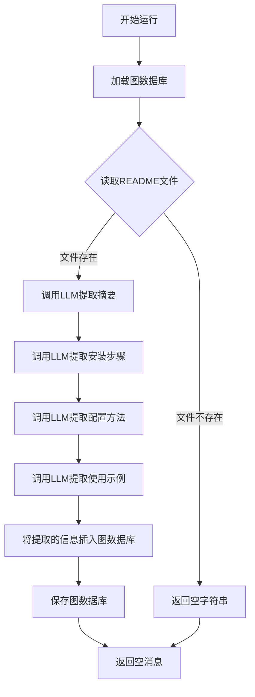
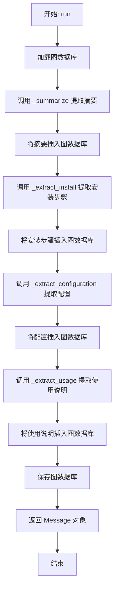
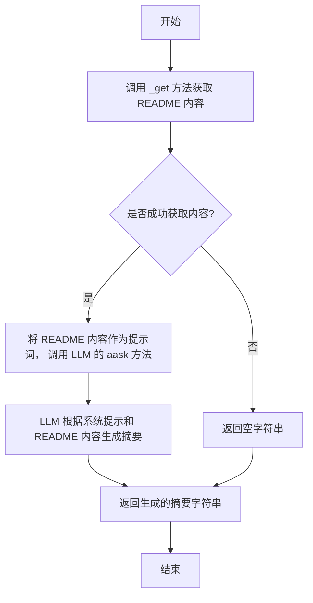
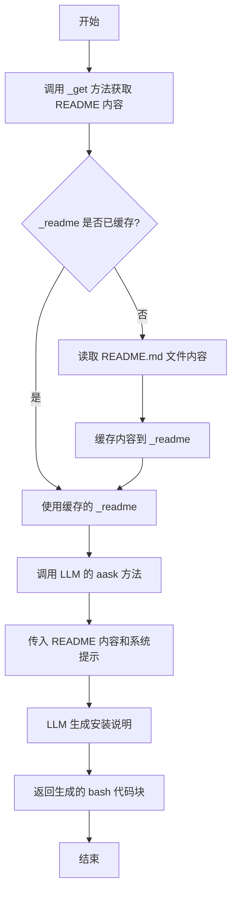
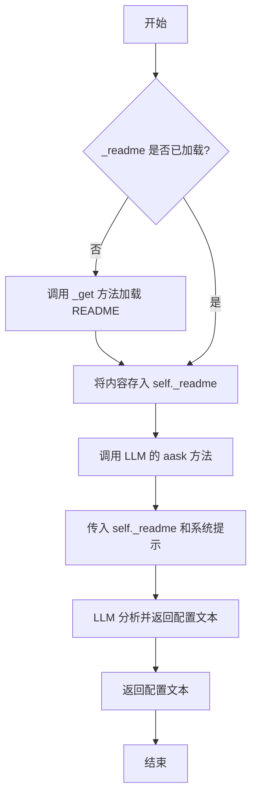
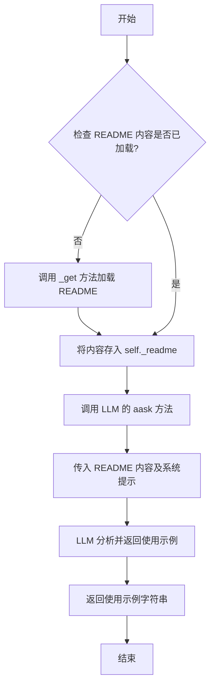
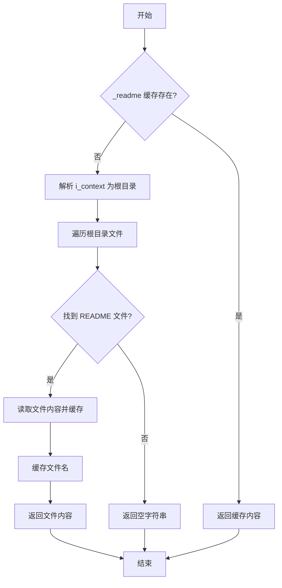

# `.\MetaGPT\metagpt\actions\extract_readme.py` 详细设计文档

该脚本定义了一个名为 ExtractReadMe 的 Action 类，其核心功能是解析并处理指定 Git 仓库根目录下的 README.md 文件。它利用大语言模型（LLM）从 README 内容中提取摘要、安装步骤、配置方法和使用示例，并将这些结构化信息存储到图数据库中，以便后续检索和使用。

## 整体流程



## 类结构

```
Action (基类)
└── ExtractReadMe (提取README信息的动作类)
```

## 全局变量及字段


### `ExtractReadMe.graph_db`
    
用于存储和操作从README.md文件中提取的结构化信息的图数据库存储库。

类型：`Optional[GraphRepository]`
    


### `ExtractReadMe.install_to_path`
    
指定在提取安装步骤时，用于生成克隆和安装命令的目标路径。

类型：`Optional[str]`
    


### `ExtractReadMe._readme`
    
缓存从文件系统读取的README.md文件内容，避免重复读取。

类型：`Optional[str]`
    


### `ExtractReadMe._filename`
    
缓存找到的README.md文件的完整路径名，用于在图数据库中作为节点标识。

类型：`Optional[str]`
    
    

## 全局函数及方法

### `ExtractReadMe.run`

`ExtractReadMe.run` 是 `ExtractReadMe` 类的核心异步方法，负责执行从 README.md 文件中提取关键信息的完整流程。它首先加载图数据库，然后依次调用内部方法提取摘要、安装、配置和使用说明，并将这些信息作为三元组存储到图数据库中，最后保存数据库并返回一个空的 `Message` 对象。

参数：

- `with_messages`：`Optional[Type]`，一个可选参数，指定要响应的消息。
- `**kwargs`：`dict`，可变关键字参数，用于接收其他可能的参数。

返回值：`Message`，返回一个内容为空、但包含执行原因（`cause_by`）的 `Message` 对象。

#### 流程图



#### 带注释源码

```python
async def run(self, with_messages=None, **kwargs):
    """
    执行从 README.md 文件中提取关键信息并存储到图数据库的完整流程。

    流程：
    1. 根据上下文中的 Git 仓库工作目录路径，构建图数据库文件的路径并加载图数据库。
    2. 调用 `_summarize` 方法，使用 LLM 从 README 内容中提取项目摘要。
    3. 将摘要作为三元组（文件名， HAS_SUMMARY， 摘要文本）插入图数据库。
    4. 调用 `_extract_install` 方法，使用 LLM 从 README 内容中提取安装步骤。
    5. 将安装步骤作为三元组（文件名， HAS_INSTALL， 安装文本）插入图数据库。
    6. 调用 `_extract_configuration` 方法，使用 LLM 从 README 内容中提取配置信息。
    7. 将配置信息作为三元组（文件名， HAS_CONFIG， 配置文本）插入图数据库。
    8. 调用 `_extract_usage` 方法，使用 LLM 从 README 内容中提取使用说明。
    9. 将使用说明作为三元组（文件名， HAS_USAGE， 使用说明文本）插入图数据库。
    10. 保存更新后的图数据库到文件。
    11. 返回一个空的 Message 对象，其 `cause_by` 属性指向当前 Action 实例。

    参数:
        with_messages (Optional[Type]): 一个可选参数，指定要响应的消息。在本方法中未使用。
        **kwargs (dict): 可变关键字参数，用于接收其他可能的参数。

    返回值:
        Message: 一个内容为空、但 `cause_by` 属性为当前 Action 实例的 Message 对象。
    """
    # 1. 构建图数据库文件路径并加载图数据库
    graph_repo_pathname = self.context.git_repo.workdir / GRAPH_REPO_FILE_REPO / self.context.git_repo.workdir.name
    self.graph_db = await DiGraphRepository.load_from(str(graph_repo_pathname.with_suffix(".json")))

    # 2. 提取摘要并存储
    summary = await self._summarize()
    await self.graph_db.insert(subject=self._filename, predicate=GraphKeyword.HAS_SUMMARY, object_=summary)

    # 3. 提取安装步骤并存储
    install = await self._extract_install()
    await self.graph_db.insert(subject=self._filename, predicate=GraphKeyword.HAS_INSTALL, object_=install)

    # 4. 提取配置信息并存储
    conf = await self._extract_configuration()
    await self.graph_db.insert(subject=self._filename, predicate=GraphKeyword.HAS_CONFIG, object_=conf)

    # 5. 提取使用说明并存储
    usage = await self._extract_usage()
    await self.graph_db.insert(subject=self._filename, predicate=GraphKeyword.HAS_USAGE, object_=usage)

    # 6. 保存图数据库
    await self.graph_db.save()

    # 7. 返回结果消息
    return Message(content="", cause_by=self)
```

### `ExtractReadMe._summarize`

该方法用于从README.md文件的内容中提取并生成项目的核心摘要。它通过调用大语言模型（LLM）来理解README的内容，并生成一段描述项目是什么的总结性文字。

参数：
-  `self`：`ExtractReadMe`，当前`ExtractReadMe`类的实例。

返回值：`str`，返回一个由LLM生成的、描述项目核心内容的字符串摘要。

#### 流程图



#### 带注释源码

```python
async def _summarize(self) -> str:
    # 1. 调用内部方法 `_get` 来获取 README.md 文件的内容。
    #    该方法会缓存内容，避免重复读取文件。
    readme = await self._get()

    # 2. 使用类中可用的 `llm` 对象（大语言模型客户端）的 `aask` 方法。
    #    - 第一个参数 `readme` 是发送给LLM的主要提示词，即README的内容。
    #    - `system_msgs` 参数定义了系统提示，用于指导LLM的角色和任务。
    #        这里指示LLM作为一个能够总结README文件的工具，并要求它返回关于仓库是什么的摘要。
    #    - `stream=False` 表示以非流式（一次性）方式获取响应。
    summary = await self.llm.aask(
        readme,
        system_msgs=[
            "You are a tool can summarize git repository README.md file.",
            "Return the summary about what is the repository.",
        ],
        stream=False,
    )
    # 3. 将LLM生成的摘要文本返回给调用者。
    return summary
```

### `ExtractReadMe._extract_install`

该方法用于从项目的 README.md 文件中提取安装说明。它通过调用大语言模型（LLM）来解析 README 内容，并生成一个包含克隆仓库、进入目录和安装步骤的 bash 代码块。

参数：
-  `self`：`ExtractReadMe`，`ExtractReadMe` 类的实例，用于访问类属性和其他方法。

返回值：`str`，返回一个包含安装步骤的 bash 代码块的字符串，格式为 Markdown 代码块。

#### 流程图



#### 带注释源码

```python
async def _extract_install(self) -> str:
    # 1. 确保 README 内容已加载到内存中。
    #    调用内部方法 `_get`，该方法会检查 `self._readme` 是否已缓存。
    #    如果未缓存，则从文件系统中读取 README.md 文件的内容并缓存。
    await self._get()

    # 2. 使用大语言模型（LLM）从 README 内容中提取安装说明。
    #    `self.llm.aask` 是一个异步方法，用于向 LLM 发送请求。
    #    第一个参数 `self._readme` 是用户输入，即 README 的完整内容。
    #    `system_msgs` 参数定义了 LLM 的角色和任务。
    install = await self.llm.aask(
        self._readme,
        system_msgs=[
            # 系统提示 1: 定义 LLM 的角色。
            "You are a tool can install git repository according to README.md file.",
            # 系统提示 2: 明确要求 LLM 返回一个 bash 代码块。
            #             代码块需要包含三个具体步骤：
            #             1. 克隆仓库到 `self.install_to_path` 指定的目录。
            #             2. 进入该目录。
            #             3. 执行安装命令。
            "Return a bash code block of markdown including:\n"
            f"1. git clone the repository to the directory `{self.install_to_path}`;\n"
            f"2. cd `{self.install_to_path}`;\n"
            f"3. install the repository.",
        ],
        stream=False, # 设置为 False 表示等待完整响应，而不是流式输出。
    )

    # 3. 返回 LLM 生成的安装说明字符串。
    #    这个字符串预期是一个 Markdown 格式的 bash 代码块，例如：
    #    ```bash
    #    git clone <repo_url> /TO/PATH
    #    cd /TO/PATH
    #    pip install -e .
    #    ```
    return install
```

### `ExtractReadMe._extract_configuration`

该方法用于从项目的 `README.md` 文件中提取配置信息。它通过调用大语言模型（LLM）来分析和理解 README 的内容，并生成一个包含配置步骤的 Bash 代码块（Markdown 格式）。如果 README 中没有配置说明，则返回一个空的 Bash 代码块。

参数：
-  `self`：`ExtractReadMe`，`ExtractReadMe` 类的实例，用于访问类属性和其他方法。

返回值：`str`，一个包含配置步骤的 Bash 代码块（Markdown 格式），如果无需配置则返回空代码块。

#### 流程图



#### 带注释源码

```python
async def _extract_configuration(self) -> str:
    # 1. 确保 README 文件内容已加载到内存中。
    #    如果 `self._readme` 为 None，则调用 `_get` 方法读取文件。
    await self._get()
    # 2. 调用大语言模型（LLM）的异步提问接口 `aask`。
    #    传入 `self._readme` 作为待分析的文本。
    #    通过 `system_msgs` 参数提供系统提示，指导 LLM 扮演一个配置工具的角色，
    #    并指定其输出格式：一个包含配置步骤的 Bash 代码块（Markdown 格式），
    #    如果 README 中没有配置说明，则返回一个空的 Bash 代码块。
    #    `stream=False` 表示等待完整响应，而非流式输出。
    configuration = await self.llm.aask(
        self._readme,
        system_msgs=[
            "You are a tool can configure git repository according to README.md file.",
            "Return a bash code block of markdown object to configure the repository if necessary, otherwise return"
            " a empty bash code block of markdown object",
        ],
        stream=False,
    )
    # 3. 将 LLM 生成的配置文本返回给调用者。
    return configuration
```

### `ExtractReadMe._extract_usage`

该方法用于从项目的 README.md 文件中提取所有使用示例。它通过调用大语言模型（LLM）来分析和总结 README 内容，并返回一个包含所有使用示例的 Markdown 代码块列表。

参数：
-  `self`：`ExtractReadMe`，`ExtractReadMe` 类的实例，用于访问类属性和其他方法。

返回值：`str`，一个字符串，包含从 README.md 文件中提取出的所有使用示例，格式为 Markdown 代码块列表。

#### 流程图



#### 带注释源码

```python
async def _extract_usage(self) -> str:
    # 1. 确保 README.md 文件内容已加载到 self._readme 属性中。
    await self._get()
    # 2. 调用大语言模型（LLM）的异步提问方法。
    usage = await self.llm.aask(
        # 传入已加载的 README 内容作为用户输入。
        self._readme,
        # 定义系统提示，指导 LLM 扮演一个工具角色，专门用于总结 README 中的使用示例。
        system_msgs=[
            "You are a tool can summarize all usages of git repository according to README.md file.",
            # 明确要求 LLM 返回一个 Markdown 代码块列表，用于展示仓库的各种用法。
            "Return a list of code block of markdown objects to demonstrates the usage of the repository.",
        ],
        # 指定非流式输出，等待完整响应。
        stream=False,
    )
    # 3. 将 LLM 返回的使用示例字符串返回给调用者。
    return usage
```

### `ExtractReadMe._get`

该方法用于从指定目录中查找并读取 `README.md` 文件的内容。如果文件内容已缓存，则直接返回缓存内容，避免重复读取。

参数：
-  `self`：`ExtractReadMe`，`ExtractReadMe` 类的实例

返回值：`str`，返回读取到的 `README.md` 文件内容字符串。如果未找到文件，则返回空字符串。

#### 流程图



#### 带注释源码

```python
async def _get(self) -> str:
    # 检查是否已有缓存的 README 内容，有则直接返回，避免重复 I/O 操作
    if self._readme is not None:
        return self._readme
    # 将 i_context 解析为绝对路径，作为搜索的根目录
    root = Path(self.i_context).resolve()
    filename = None
    # 遍历根目录下的所有条目
    for file_path in root.iterdir():
        # 检查是否为文件且文件名（不含扩展名）为 "README"
        if file_path.is_file() and file_path.stem == "README":
            filename = file_path
            break
    # 如果未找到 README 文件，返回空字符串
    if not filename:
        return ""
    # 异步读取找到的 README 文件内容，使用 UTF-8 编码
    self._readme = await aread(filename=filename, encoding="utf-8")
    # 缓存文件名（完整路径字符串）
    self._filename = str(filename)
    # 返回读取到的内容
    return self._readme
```

## 关键组件


### 图数据库存储组件

用于存储和检索从README.md文件中提取的结构化信息（如摘要、安装步骤、配置和用法），支持将提取的信息持久化到图数据库中。

### 大语言模型（LLM）驱动的内容提取组件

利用大语言模型（LLM）的能力，通过自然语言指令从README.md文件中智能提取和总结关键信息，包括项目摘要、安装脚本、配置步骤和使用示例。

### 文件读取与缓存组件

负责定位并读取项目根目录下的README.md文件内容，并实现惰性加载机制，仅在首次需要时读取文件内容并进行缓存，以提高后续操作的效率。

### 动作执行框架组件

定义了标准化的动作执行流程，作为具体动作（如`ExtractReadMe`）的基类，提供了与上下文环境、消息传递和异步执行集成的框架。


## 问题及建议


### 已知问题

-   **硬编码的安装路径**：`install_to_path` 字段的默认值被硬编码为 `"/TO/PATH"`。这在实际使用中几乎肯定需要被覆盖，否则会导致脚本尝试将仓库克隆到一个不存在的或错误的系统路径，从而引发运行时错误。
-   **潜在的 `_get` 方法性能问题**：`_get` 方法每次被调用时都会遍历目录以查找 `README.md` 文件，即使 `self._readme` 已被缓存。虽然缓存机制避免了重复读取文件，但目录遍历操作仍然是不必要的开销。
-   **`_get` 方法的错误处理不完善**：当 `i_context` 路径不存在或无法访问时，`Path(self.i_context).resolve()` 可能会抛出异常。此外，如果目录遍历过程中发生错误（如权限问题），也没有相应的异常处理。
-   **`_get` 方法对文件名的匹配逻辑可能不健壮**：代码使用 `file_path.stem == "README"` 进行匹配，这只会匹配名为 `README` 的文件（不区分大小写，但依赖于 `Path.stem` 的行为）。它可能会错过 `README.md`、`Readme.md`、`readme.txt` 等常见变体，导致无法找到 README 文件。
-   **`run` 方法中的 `with_messages` 参数未使用**：`run` 方法签名包含了 `with_messages` 参数，但在方法体内并未使用，这可能意味着接口设计不一致或存在未实现的功能。
-   **LLM 提示词（Prompt）硬编码在方法中**：`_summarize`、`_extract_install` 等方法的提示词直接以字符串形式写在代码里。这使得提示词的调整、优化或国际化变得困难，并且如果多个动作类使用相似的提示词，会导致代码重复。
-   **缺乏对 LLM 调用失败的容错处理**：`llm.aask` 调用可能因网络问题、API 限制或模型错误而失败。当前代码没有包含任何重试机制或降级策略，这可能导致整个动作执行失败。
-   **`run` 方法返回值信息量低**：`run` 方法返回一个内容为空的 `Message` 对象。调用者无法直接从返回值中获取提取的摘要、安装步骤等信息，这些信息被存储在图数据库中，但缺乏一个直接的接口来获取它们，降低了代码的可用性。

### 优化建议

-   **移除或提供合理的 `install_to_path` 默认值**：建议将 `install_to_path` 的默认值设置为 `None` 或一个更合理的、基于当前工作目录的相对路径（例如 `"."`），并在文档中明确说明用户需要根据实际情况配置此字段。更好的做法是将其设计为必填字段。
-   **优化 `_get` 方法**：在 `_get` 方法开始时，如果 `self._readme` 已缓存，应直接返回，避免执行不必要的目录遍历和文件存在性检查。
-   **增强 `_get` 方法的鲁棒性**：
    -   使用 `try-except` 块包裹路径解析和文件读取操作，以处理 `FileNotFoundError`、`PermissionError` 等异常，并返回有意义的错误信息或空字符串。
    -   改进文件查找逻辑，例如使用 `glob` 模式（如 `root.glob("README*")`）来匹配更广泛的文件名变体，并可能通过文件扩展名或内容启发式方法选择最合适的文件。
-   **清理未使用的参数**：如果 `with_messages` 参数确实不需要，应从 `run` 方法签名中移除，以保持接口的清晰。如果需要，则应实现其功能。
-   **外部化配置 LLM 提示词**：考虑将 LLM 的提示词（系统消息）提取到配置文件、常量类或独立的模板文件中。这样可以方便地进行统一管理、修改和复用。
-   **增加 LLM 调用的容错机制**：
    -   为 `llm.aask` 调用添加重试逻辑（例如，使用指数退避策略）。
    -   考虑在 LLM 调用失败时，提供降级方案，例如返回一个默认文本或记录错误后跳过当前提取步骤。
-   **增强 `run` 方法的返回值**：修改 `run` 方法，使其返回一个包含提取结果（如摘要、安装步骤等）的结构化数据对象或字典，而不仅仅是空消息。这可以是一个新的 `Pydantic` 模型，包含各个提取字段。同时，保留将数据保存到图数据库的功能。
-   **考虑添加输入验证**：在 `run` 方法开始时，验证 `self.i_context` 是否存在且是一个目录，以及 `self.llm` 是否已正确初始化，提前失败并给出明确错误信息。
-   **提高代码可测试性**：将文件读取（`aread`）和 LLM 调用（`llm.aask`）等外部依赖通过依赖注入或设置为类属性，以便在单元测试中轻松模拟（mock）。
-   **添加日志记录**：在关键步骤（如开始提取、找到文件、调用 LLM、保存到图数据库）添加日志记录，便于调试和监控执行过程。


## 其它


### 设计目标与约束

本模块的设计目标是自动化地从Git仓库的README.md文件中提取关键信息（摘要、安装、配置、使用说明），并将其结构化地存储到图数据库中，以供后续查询和使用。主要约束包括：1）依赖外部大语言模型（LLM）进行文本理解和信息提取，因此其性能和准确性受限于所选LLM的能力；2）假设目标仓库的根目录下存在名为`README.md`（或类似）的文件；3）图数据库的存储路径和格式是预定义的，与项目结构强耦合。

### 错误处理与异常设计

当前代码的错误处理较为薄弱。`_get`方法在未找到README文件时返回空字符串，这可能导致后续LLM调用处理空内容或产生无意义输出。`run`方法中的`graph_db`加载、LLM调用、文件读取等操作均可能抛出异常（如`FileNotFoundError`, `JSONDecodeError`, 网络异常等），但代码中未进行显式的捕获和处理，异常会直接向上层传播。建议增加更健壮的错误处理，例如：为`_get`方法定义明确的异常（如`ReadmeNotFoundError`）；在`run`方法中使用`try-except`块包裹关键操作，记录错误日志并返回包含错误信息的`Message`对象，而不是让进程崩溃。

### 数据流与状态机

1.  **数据流**：
    *   **输入**：`Action`基类提供的上下文（`self.context`），其中包含Git仓库工作目录信息（`self.context.git_repo.workdir`）。
    *   **处理**：
        *   根据上下文构建图数据库文件路径并加载。
        *   调用`_get`方法读取README文件内容。
        *   依次调用`_summarize`、`_extract_install`、`_extract_configuration`、`_extract_usage`方法，每个方法都使用LLM对README内容进行解析和提取。
        *   将提取出的四类信息（摘要、安装、配置、使用）作为“对象”（object），以README文件名作为“主体”（subject），以预定义的关系关键词（如`HAS_SUMMARY`）作为“谓词”（predicate），插入到图数据库中。
    *   **输出**：将提取的信息持久化到图数据库文件，并返回一个空的`Message`对象（`cause_by`标记为本动作）。
2.  **状态机**：本类没有复杂的状态机。主要内部状态是`_readme`和`_filename`的缓存。首次调用`_get`或任何提取方法（它们内部调用`_get`）时会触发文件读取并填充缓存；后续调用直接使用缓存值，避免重复IO。

### 外部依赖与接口契约

1.  **外部依赖**：
    *   **大语言模型（LLM）**：通过`self.llm.aask`方法调用。这是核心依赖，用于理解自然语言并生成结构化输出。契约要求LLM服务能够接收系统提示词和用户消息，并返回文本响应。
    *   **图数据库（GraphRepository）**：具体为`DiGraphRepository`。用于存储提取出的结构化知识。契约要求其提供`load_from`、`insert`、`save`等方法。
    *   **文件系统**：通过`pathlib.Path`和`metagpt.utils.common.aread`读取README文件。
    *   **父类`Action`及框架上下文**：依赖`Action`基类定义的`run`接口和`context`属性来获取执行环境和输入信息。
2.  **接口契约**：
    *   **`run`方法**：作为`Action`的标准接口，接收`with_messages`和`**kwargs`参数，并返回一个`Message`对象。本实现中`with_messages`未使用，主要工作从上下文获取输入。
    *   **图数据库模式**：插入数据时遵循固定的三元组模式：`(subject=文件名, predicate=GraphKeyword.*, object=提取的文本)`。这定义了对图数据库存储结构的预期。

### 性能考量

1.  **LLM调用延迟**：`run`方法需要串行进行四次LLM API调用（摘要、安装、配置、使用），这是主要的性能瓶颈。总耗时大致为四次LLM响应时间之和，可能达到数十秒。
2.  **缓存机制**：`_readme`的缓存避免了同一任务内对文件的重复读取，是有效的优化。
3.  **IO操作**：图数据库的加载和保存涉及文件读写，但相对于LLM调用，其开销通常较小。
4.  **优化空间**：可以考虑将四个提取任务（摘要、安装、配置、使用）并行化（例如使用`asyncio.gather`），前提是LLM客户端支持并发且API有足够的配额。这可以显著减少总执行时间。

### 安全考量

1.  **LLM提示词注入**：代码将整个README内容作为用户消息发送给LLM。如果README内容包含恶意构造的提示词，可能试图操纵LLM输出或泄露系统提示词。风险较低但存在。
2.  **命令执行风险**：`_extract_install`和`_extract_configuration`方法期望LLM返回bash代码块。这些代码块被存储但**在本模块内并未执行**。然而，如果下游系统或用户盲目执行这些存储的脚本，则存在安全风险（例如，脚本中包含`rm -rf /`等危险命令）。需要在存储或使用这些脚本的环节增加安全审查或沙箱执行机制。
3.  **路径遍历**：`self.i_context`（在`_get`中使用）和`self.install_to_path`是来自上下文的路径参数。如果这些参数被恶意控制，可能导致读取系统敏感文件（`_get`）或将代码克隆/安装到意外位置。需要对输入路径进行验证和规范化（`Path.resolve()`已部分处理）。

    