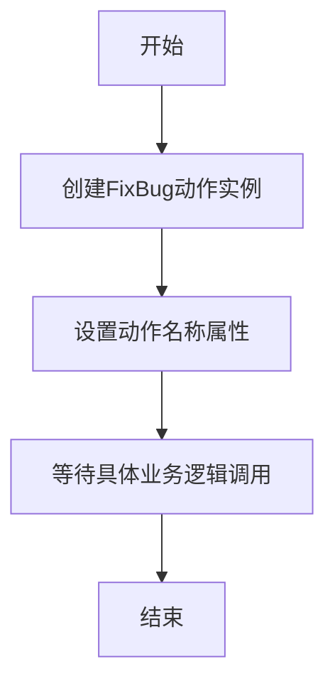

# `.\MetaGPT\metagpt\actions\fix_bug.py` 详细设计文档

该代码定义了一个名为FixBug的Action类，继承自metagpt.actions.Action基类，用于表示修复bug的动作。当前该类仅包含基本的类定义和名称属性，没有具体的实现逻辑，是一个占位符或抽象动作定义。

## 整体流程



## 类结构

```
Action (基类)
└── FixBug (修复bug动作类)
```

## 全局变量及字段


### `FixBug.name`
    
表示该Action的名称，用于标识和调用，此处固定为'FixBug'。

类型：`str`
    
    

## 全局函数及方法


## 关键组件


### Action基类

提供动作（Action）的通用基类，定义了动作的基本结构和行为，包括动作名称等属性。

### FixBug类

继承自Action基类，表示一个修复bug的动作，当前版本仅定义了动作名称，没有具体的实现逻辑。

### 类字段：name

类型为str，用于存储动作的名称，此处固定为"FixBug"。


## 问题及建议


### 已知问题

-   **功能缺失**：`FixBug` 类目前仅定义了名称，没有任何具体的实现逻辑。它继承了 `Action` 基类，但未重写或实现任何核心方法（如 `run` 方法），因此无法执行任何实际的修复bug操作。
-   **缺乏上下文**：该类没有定义任何字段来接收或处理与bug相关的信息（如错误描述、代码上下文、测试用例等），导致其无法在具体的开发或调试流程中发挥作用。
-   **命名与职责模糊**：类名 `FixBug` 暗示了一个非常宽泛的职责，但没有任何实现细节或文档说明其具体修复哪类bug、使用何种策略，这使得类的意图不明确，难以集成到更大的系统中。

### 优化建议

-   **实现核心逻辑**：重写 `Action` 基类的 `run` 方法，提供具体的bug修复逻辑。这可以包括分析错误报告、定位问题代码、生成修复补丁、验证修复结果等步骤。
-   **添加上下文字段**：在类中定义必要的字段，例如 `bug_description`（str类型，描述bug现象）、`code_context`（str类型，相关代码片段）、`test_cases`（List[str]类型，用于验证的测试用例）等，以便动作能够接收和处理具体的任务信息。
-   **明确职责与接口**：通过类文档字符串或方法注释，明确说明 `FixBug` 动作的适用范围、输入输出格式以及它如何与其他组件（如问题跟踪系统、代码仓库、测试框架）交互。考虑是否应该拆分为更具体的动作（如 `FixSyntaxError`， `FixLogicError`）。
-   **增加配置与扩展点**：考虑将修复策略（如使用静态分析、调用LLM生成补丁、应用预定义规则模板）设计为可配置或可插拔的组件，以提高动作的灵活性和可维护性。


## 其它


### 设计目标与约束

该代码的设计目标是定义一个名为 `FixBug` 的 Action 类，作为元编程框架中用于修复 Bug 的特定动作的抽象基类或占位符。其核心约束包括：
1.  **继承性**：必须继承自 `metagpt.actions.Action` 基类，以遵循框架的 Action 协议和生命周期。
2.  **最小化实现**：当前版本仅定义了类的结构（类名 `FixBug` 和动作名称 `name`），不包含任何具体的 Bug 修复逻辑实现，这符合其作为模板或待实现组件的定位。
3.  **框架集成**：其存在是为了在更大的元编程智能体工作流中，作为一个可被调度和执行的标准动作节点。

### 错误处理与异常设计

当前代码未显式定义任何错误处理或异常抛出机制。其错误行为完全依赖于其父类 `metagpt.actions.Action` 的实现。
1.  **继承父类行为**：任何在 `FixBug` 动作执行过程中可能发生的异常（例如，调用未实现的 `run` 方法），预期将由基类 `Action` 定义的默认错误处理逻辑进行捕获和处理。具体的处理方式（如日志记录、状态回滚、工作流终止）需参考框架文档。
2.  **未来实现的考虑**：当 `FixBug` 类被具体实现时，需要在 `run` 等方法内部加入适当的 `try-except` 块，以处理诸如代码解析失败、补丁生成错误、测试验证不通过等特定于 Bug 修复领域的异常，并可能定义自定义异常类型以提升错误信息的清晰度。

### 数据流与状态机

由于当前类为空实现，其完整的数据流和状态机由父类 `Action` 定义。但可以推断其在元编程工作流中的预期角色：
1.  **输入数据流**：预期接收的输入可能包括：触发动作的上下文信息、存在 Bug 的源代码文件路径或内容、相关的错误报告或日志、以及可能的问题描述。
2.  **内部状态**：作为 `Action` 子类，可能拥有 `is_done`, `result` 等状态属性，用于标记动作执行是否完成及存储执行结果。
3.  **输出数据流**：执行完成后，预期输出可能包括：修复后的代码（补丁形式）、修复说明、关联的测试用例更新、以及动作执行状态（成功/失败）。
4.  **状态转移**：在智能体工作流引擎驱动下，其状态可能经历 `PENDING` -> `RUNNING` -> `SUCCEEDED/FAILED` 的转移。

### 外部依赖与接口契约

1.  **强依赖**：
    *   `metagpt.actions.Action`：这是 `FixBug` 类存在的基石，定义了动作的公共接口（如 `run` 方法）和行为规范。任何对 `Action` 基类的修改都可能影响 `FixBug`。
2.  **接口契约**：
    *   **类名契约**：类名 `FixBug` 清晰地表明了其功能域。
    *   **属性契约**：`name: str = "FixBug"` 属性定义了该动作在系统中的唯一标识符，工作流引擎可能通过此名称来查找和实例化该动作。
    *   **方法契约**：虽然当前未重写，但预期必须实现父类 `Action` 定义的抽象方法（例如 `run`），以提供具体的 Bug 修复逻辑。其方法签名和返回值需与父类契约保持一致。
3.  **未来潜在依赖**：具体的实现可能会引入对代码分析库（如 `ast`）、差分工具、版本控制系统接口或 LLM API 客户端等的外部依赖。

### 测试策略与验证要点

鉴于当前为空实现，测试策略主要围绕其作为框架组件的合规性：
1.  **单元测试**：
    *   验证 `FixBug` 类能否被正确实例化。
    *   验证其 `name` 属性值是否为 `"FixBug"`。
    *   验证其继承关系，确认是 `Action` 的子类。
2.  **集成测试（未来）**：
    *   当实现 `run` 方法后，需要测试其能否在模拟的智能体工作流中被正确调用和执行。
    *   测试其输入/输出数据格式是否符合上下游组件的期望。
3.  **契约测试**：确保任何对 `Action` 基类接口的更改不会破坏 `FixBug` 类的可实例化性或预期行为。

### 部署与配置考虑

1.  **作为库组件部署**：`FixBug` 类作为 `metagpt` 框架内部的一个动作组件，随框架一同打包和分发。无需独立的部署步骤。
2.  **配置**：当前类没有可配置参数。未来实现时，可能需要通过配置文件或环境变量来设置诸如使用的 AI 模型、代码分析工具路径、超时时间等参数。
3.  **发现与注册**：框架可能需要一种机制（如入口点）来自动发现和注册所有 `Action` 的子类，包括 `FixBug`，以便工作流引擎能够根据名称 (`"FixBug"`) 动态加载和使用它。

    