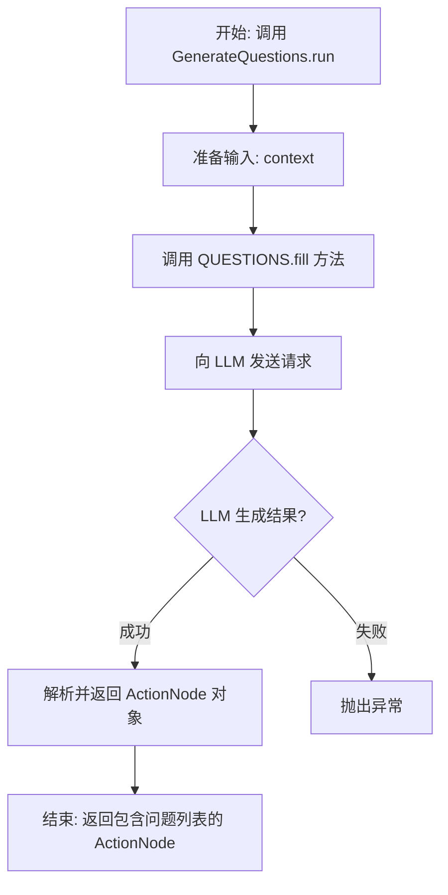

# `.\MetaGPT\metagpt\actions\generate_questions.py` 详细设计文档

该代码定义了一个名为 GenerateQuestions 的动作类，其核心功能是基于给定的上下文（包含讨论主题和讨论记录），利用大语言模型（LLM）生成一系列后续问题，以深入挖掘和探讨相关细节。

## 整体流程



## 类结构

```
Action (来自 metagpt.actions)
└── GenerateQuestions
```

## 全局变量及字段


### `QUESTIONS`
    
一个预定义的 ActionNode 实例，用于生成基于上下文的问题列表，其结构定义了LLM生成问题的格式、类型和约束。

类型：`ActionNode`
    


### `GenerateQuestions.name`
    
标识此 Action 子类的名称，固定为 'GenerateQuestions'，用于在系统中唯一标识此动作。

类型：`str`
    
    

## 全局函数及方法

### `GenerateQuestions.run`

该方法是一个异步方法，用于根据给定的上下文（讨论主题和记录），驱动大语言模型（LLM）生成一系列进一步探究细节的问题。它通过调用预定义的 `QUESTIONS` ActionNode 的 `fill` 方法来完成核心逻辑，将上下文和 LLM 实例作为参数传入，最终返回一个填充了问题列表的 ActionNode 对象。

参数：

- `context`：`Any`，包含讨论主题（##TOPIC）和讨论记录（##RECORD）的上下文信息，将作为提示词的一部分传递给 LLM 以生成相关问题。

返回值：`ActionNode`，一个已填充的 ActionNode 对象，其 `content` 属性预期为一个字符串列表，包含了由 LLM 生成的、针对输入上下文的具体问题。

#### 流程图

```mermaid
graph TD
    A[开始: run(context)] --> B[调用 QUESTIONS.fill<br/>req=context, llm=self.llm]
    B --> C{LLM 处理并生成问题列表}
    C --> D[返回填充后的 QUESTIONS ActionNode]
    D --> E[结束]
```

#### 带注释源码

```python
async def run(self, context) -> ActionNode:
    # 调用预定义的 QUESTIONS ActionNode 的 fill 方法。
    # 参数 `req` 接收外部传入的上下文信息，用于构建LLM提示词。
    # 参数 `llm` 传入当前Action实例持有的LLM客户端，用于执行生成请求。
    # 该方法将异步执行，等待LLM返回结果并填充到QUESTIONS节点中，最后返回该节点。
    return await QUESTIONS.fill(req=context, llm=self.llm)
```

## 关键组件


### ActionNode (QUESTIONS)

一个预定义的、用于生成问题的动作节点，它封装了LLM生成问题列表的指令、期望输出类型和示例，实现了任务指令的结构化与复用。

### GenerateQuestions Action

一个继承自`Action`的特定动作类，其核心功能是利用LLM，基于给定的讨论主题和记录上下文，生成进一步深化讨论的详细问题列表。

### 惰性执行与结构化输出

`GenerateQuestions.run`方法通过调用`QUESTIONS.fill`，将执行委托给预定义的`ActionNode`。这实现了逻辑的封装与复用，并确保了输出严格符合`list[str]`的结构化格式。


## 问题及建议


### 已知问题

-   **硬编码的提示词与示例**：`QUESTIONS` 节点的 `instruction` 和 `example` 字段内容被硬编码在代码中。这降低了代码的灵活性和可维护性，当需要根据不同场景调整问题生成逻辑时，必须修改源代码。
-   **缺乏输入验证与错误处理**：`run` 方法直接使用传入的 `context` 参数，没有对其内容、格式或有效性进行任何检查。如果 `context` 不符合预期（例如为空、格式错误），可能导致 `ActionNode.fill` 方法调用失败或生成无意义的问题，但当前代码没有相应的错误处理或日志记录机制。
-   **类职责单一但扩展性受限**：`GenerateQuestions` 类的功能非常单一，仅包装了一个固定的 `ActionNode`。虽然符合单一职责原则，但若未来需要生成不同类型、格式或约束的问题（例如不同字数限制、不同示例），需要创建新的类或修改此类，扩展方式不够灵活。
-   **对元框架的强依赖**：该类深度依赖 `metagpt` 框架的 `Action` 和 `ActionNode` 类。这使其难以独立复用或集成到其他不使用该框架的项目中，可移植性较差。

### 优化建议

-   **将提示词配置化**：将 `QUESTIONS` 节点的 `instruction`、`example` 甚至 `expected_type` 等属性提取为类参数（`__init__` 中初始化）或配置文件（如 YAML、JSON）。这样可以在不修改代码的情况下，通过配置来适应不同的任务需求。
-   **增强输入验证与健壮性**：在 `run` 方法开始处，对 `context` 参数进行基础检查（如类型、非空、关键字段存在性）。使用 `try-except` 块捕获 `llm` 调用或 `fill` 方法可能抛出的异常，并记录清晰的错误日志或抛出更有意义的业务异常。
-   **设计更通用的问题生成器**：考虑重构此类，使其接收一个“问题生成模板”或“策略”作为参数。可以定义一个基类或接口，然后通过组合不同的模板（如 `QuestionTemplate`）来实现多样化的问题生成，提高代码的复用性和扩展性。
-   **降低框架耦合度**：可以创建一个轻量级的适配器层或抽象基类，将核心的“问题生成”逻辑与 `metagpt` 框架的特定类解耦。核心逻辑应只依赖于标准库和 LLM 调用接口，而框架特定的 `Action` 包装则作为可选的实现之一。这样核心逻辑更容易被其他项目复用。
-   **补充单元测试**：为 `GenerateQuestions` 类编写单元测试，覆盖正常流程、边界情况（如空 `context`、超长 `context`）和异常流程。这有助于在重构和优化时保证功能正确性，并提前发现潜在问题。


## 其它


### 设计目标与约束

本模块的核心设计目标是提供一个可复用的动作（Action），用于驱动大型语言模型（LLM）基于给定的上下文（讨论主题和记录）生成一系列后续追问问题。其设计遵循以下约束：
1.  **功能单一性**：`GenerateQuestions` 类仅负责“生成问题”这一特定任务，符合单一职责原则。
2.  **与框架集成**：作为 `metagpt.actions.Action` 的子类，必须实现 `run` 异步方法，以适配 MetaGPT 智能体（Agent）的工作流。
3.  **结构化输出**：通过 `ActionNode` 定义输出的结构和约束（如类型为字符串列表），确保生成内容格式的稳定性和可预测性，便于下游处理。
4.  **上下文驱动**：问题的生成完全依赖于输入的 `context` 参数，确保问题的相关性和针对性。

### 错误处理与异常设计

当前代码未显式包含错误处理逻辑，依赖其父类 `Action` 及 `ActionNode.fill` 方法的内部实现。潜在的异常场景及处理方式如下：
1.  **LLM 调用失败**：`self.llm` 调用可能因网络、认证或服务不可用而失败。这些异常可能由 `llm` 属性对应的方法（如 `aask`）抛出，并向上传播给 `run` 方法的调用者。
2.  **上下文格式错误**：如果传入的 `context` 不符合 `QUESTIONS` 节点处理所需的格式或内容不足，可能导致 `ActionNode.fill` 方法生成无意义或空的问题列表。目前依赖 LLM 的上下文理解能力，缺乏前置验证。
3.  **输出格式异常**：`ActionNode.fill` 方法会尝试将 LLM 的响应解析为 `list[str]`。如果解析失败（如 LLM 返回了非列表格式），该方法可能抛出解析异常。
   **当前策略**：错误处理是“乐观的”或“委托的”，主要依赖外部调用方（如 MetaGPT 框架的异常处理机制）来捕获和处理这些异常。

### 数据流与状态机

本模块的数据流清晰且无内部状态：
1.  **输入**：`run` 方法接收一个 `context` 参数（类型未严格限定，通常为字符串或包含讨论主题和记录的字典/字符串），作为生成问题的依据。
2.  **处理**：
    a. `run` 方法将 `context` 和自身的 `llm` 实例传递给预定义的 `QUESTIONS`（`ActionNode`）的 `fill` 方法。
    b. `fill` 方法内部构建包含 `instruction`、`example` 和 `context` 的提示词（Prompt），调用 `llm` 获取响应。
    c. `fill` 方法解析 LLM 的响应，将其转换为 `list[str]` 格式。
3.  **输出**：`run` 方法返回填充好的 `QUESTIONS` `ActionNode` 对象，其 `content` 属性包含了生成的问题列表（`list[str]`）。
   **状态机**：该类是无状态的（Stateless）。每次 `run` 调用都是独立的，输出仅取决于当次输入的 `context` 和 `llm` 的行为，不依赖于任何实例变量（`name` 是常量）。

### 外部依赖与接口契约

1.  **外部依赖**：
    a. **MetaGPT 框架**：强依赖 `metagpt.actions.Action` 基类和 `metagpt.actions.action_node.ActionNode` 类。版本变更可能导致兼容性问题。
    b. **大型语言模型 (LLM)**：通过 `self.llm` 属性（在父类 `Action` 中初始化）进行交互。`llm` 对象必须提供 `aask` 或类似异步方法以响应提示词。
    c. **`context` 数据提供方**：依赖调用者提供有意义、结构良好的上下文信息，否则生成的问题质量无法保证。
2.  **接口契约**：
    a. **`run(context)` 方法**：
       - **输入契约**：调用者需提供 `context` 参数。其具体格式和内容要求由 `QUESTIONS` 节点的 `instruction` 隐含定义，但未在代码中强制。
       - **输出契约**：返回一个 `ActionNode` 对象，其 `key` 为 `"Questions"`，`content` 为 `list[str]` 类型。调用者应通过 `node.content` 获取问题列表。
    b. **`QUESTIONS` 节点定义**：作为模块的公共配置，定义了与 LLM 交互的提示词模板、输出格式和示例。修改此定义将直接影响所有 `GenerateQuestions` 实例的行为。

### 配置与可扩展性

1.  **配置**：核心配置是全局常量 `QUESTIONS`（`ActionNode`）。通过修改其 `instruction`、`example` 或 `expected_type`，可以调整生成问题的风格、引导方式和输出格式，而无需修改 `GenerateQuestions` 类的代码。
2.  **可扩展性**：
    a. **问题生成策略**：目前策略固定。可通过继承 `GenerateQuestions` 并重写 `run` 方法，引入更复杂的逻辑（如多轮提示、结果过滤、问题分类）。
    b. **上下文预处理**：可在 `run` 方法中增加对 `context` 的清洗、格式化或增强步骤。
    c. **多节点输出**：可以定义多个 `ActionNode` 来生成不同类型的问题（如封闭式、开放式），并在 `run` 方法中协调填充和返回。
    **限制**：当前的简单设计牺牲了一定的灵活性，例如无法在运行时动态修改提示词模板。

### 测试策略建议

1.  **单元测试**：
    a. **Mock LLM**：使用 `unittest.mock` 模拟 `self.llm` 的行为，测试 `run` 方法是否能正确调用 `QUESTIONS.fill` 并返回其结果。验证传入的 `context` 是否正确传递。
    b. **边界测试**：测试空 `context`、超长 `context`、特殊字符 `context` 下的行为（尽管目前依赖 LLM 处理）。
    c. **输出解析测试**：模拟 LLM 返回各种格式（合规的列表、非列表文本、JSON 等），测试 `ActionNode.fill` 的解析鲁棒性（这部分测试可能更适用于 `ActionNode` 本身）。
2.  **集成测试**：将 `GenerateQuestions` 与真实的 LLM 服务（或测试用的 LLM 沙箱）连接，验证其能否基于给定的典型 `context` 生成合理、相关的问题列表。
3.  **场景测试**：在完整的 MetaGPT 智能体工作流中测试此 Action，确保其能与其他 Action 正确协作。

    