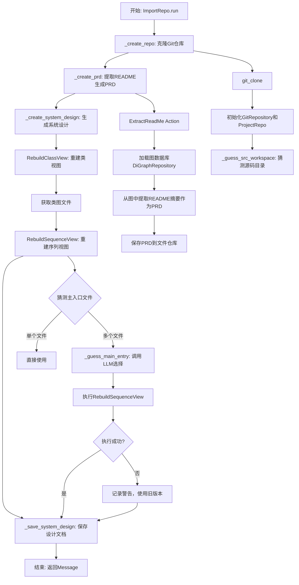
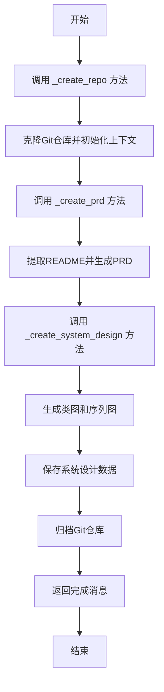
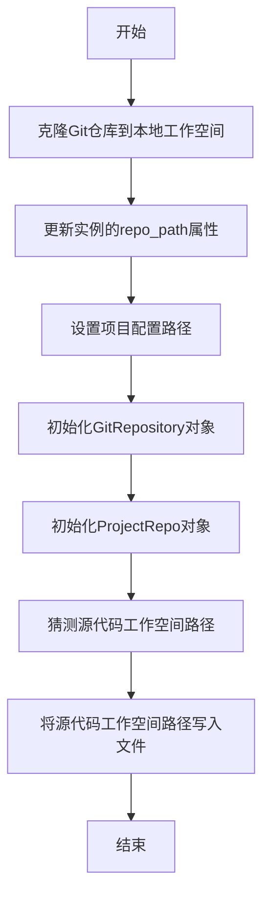
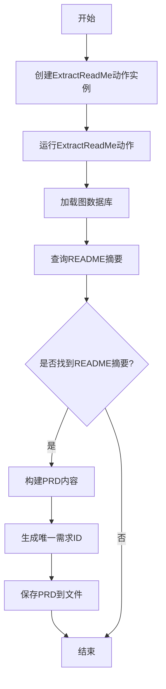
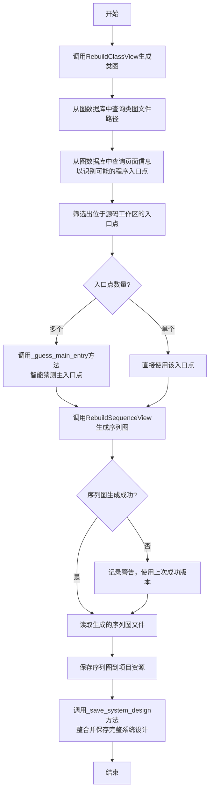
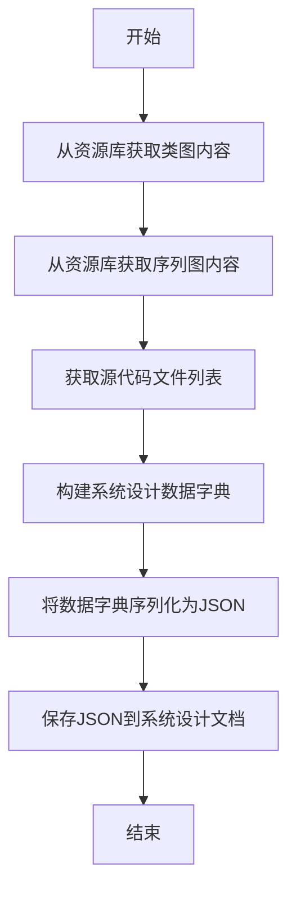
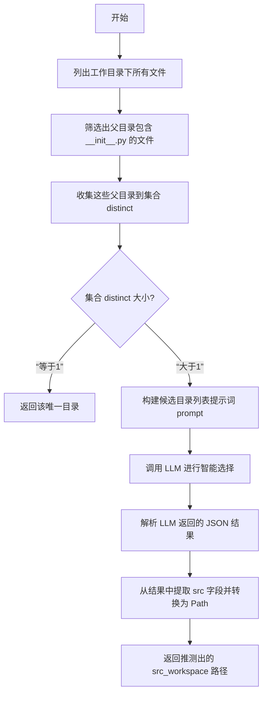

# `.\MetaGPT\metagpt\actions\import_repo.py` 详细设计文档

该脚本定义了一个名为 ImportRepo 的 Action 类，其核心功能是将一个 Git 仓库导入到 MetaGPT 项目格式中。这个过程包括克隆仓库、从 README 文件中提取原始需求（PRD）、通过逆向工程重建类视图和序列视图以生成系统设计文档，并将所有相关信息（如类图、序列图、文件列表）保存到图数据库和项目仓库中，从而为后续的增量需求追加和 AI 驱动的开发工作流提供结构化基础。

## 整体流程



## 类结构

```
Action (基类，来自metagpt.actions)
└── ImportRepo
    ├── 字段: repo_path, graph_db, rid
    ├── 方法: run, _create_repo, _create_prd, _create_system_design, _save_system_design, _guess_src_workspace, _guess_main_entry
    └── 依赖的外部类/函数:
        ├── ExtractReadMe (Action)
        ├── RebuildClassView (Action)
        ├── RebuildSequenceView (Action)
        ├── DiGraphRepository
        ├── FileRepository
        ├── GitRepository
        ├── ProjectRepo
        ├── Message (Schema)
        └── 工具函数: git_clone, aread, awrite, list_files, parse_json_code_block, split_namespace
```

## 全局变量及字段


### `ImportRepo.repo_path`
    
输入的Git仓库URL，指定要导入的远程仓库地址。

类型：`str`
    


### `ImportRepo.graph_db`
    
输出的图数据库对象，用于存储和分析导入仓库的结构化信息。

类型：`Optional[GraphRepository]`
    


### `ImportRepo.rid`
    
输出的需求ID，用于唯一标识本次导入过程生成的需求文档。

类型：`str`
    
    

## 全局函数及方法

### `ImportRepo.run`

该方法负责执行Git仓库的导入流程，包括克隆仓库、提取PRD（产品需求文档）、生成系统设计（类图和序列图），并将相关数据保存到项目结构中。

参数：

- `with_messages`：`List[Message]`，可选参数，用于传递额外的消息，通常用于上下文传递或日志记录。
- `**kwargs`：`dict`，可选参数，用于接收其他关键字参数，提供扩展性。

返回值：`Message`，返回一个消息对象，表示导入过程已完成。

#### 流程图



#### 带注释源码

```python
async def run(self, with_messages: List[Message] = None, **kwargs) -> Message:
    """
    执行Git仓库的导入流程，包括克隆仓库、提取PRD、生成系统设计，并保存相关数据。

    Args:
        with_messages (List[Message], optional): 额外的消息列表，用于上下文传递或日志记录。
        **kwargs: 其他关键字参数，提供扩展性。

    Returns:
        Message: 表示导入过程已完成的消息对象。
    """
    # 1. 克隆Git仓库并初始化上下文
    await self._create_repo()
    # 2. 提取README并生成PRD
    await self._create_prd()
    # 3. 生成系统设计（类图和序列图）
    await self._create_system_design()
    # 4. 归档Git仓库，记录导入操作
    self.context.git_repo.archive(comments="Import")
```

### `ImportRepo._create_repo`

该方法负责克隆指定的Git仓库到本地工作空间，并初始化相关的上下文对象，包括Git仓库、项目仓库和源代码工作空间。

参数：
-  `self`：`ImportRepo`，当前`ImportRepo`类的实例，用于访问类属性和其他方法。
-  无其他显式参数。

返回值：`None`，该方法不返回任何值，但会更新`self`实例的多个属性。

#### 流程图



#### 带注释源码

```python
async def _create_repo(self):
    # 克隆指定的Git仓库URL到配置的工作空间目录，返回本地路径
    path = await git_clone(url=self.repo_path, output_dir=self.config.workspace.path)
    # 将实例的repo_path属性更新为克隆后的本地路径字符串
    self.repo_path = str(path)
    # 将配置中的项目路径设置为克隆后的路径
    self.config.project_path = path
    # 使用克隆的路径初始化一个GitRepository对象，并设置为上下文的git_repo
    self.context.git_repo = GitRepository(local_path=path, auto_init=True)
    # 使用上一步初始化的Git仓库，创建一个ProjectRepo对象，并设置为上下文的repo
    self.context.repo = ProjectRepo(self.context.git_repo)
    # 调用内部方法猜测源代码工作空间（src_workspace）的路径
    self.context.src_workspace = await self._guess_src_workspace()
    # 将猜测出的源代码工作空间相对路径写入项目工作目录下的一个隐藏文件`.src_workspace`中
    await awrite(
        filename=self.context.repo.workdir / ".src_workspace",
        data=str(self.context.src_workspace.relative_to(self.context.repo.workdir)),
    )
```

### `ImportRepo._create_prd`

该方法用于从导入的Git仓库中提取README文件内容，生成产品需求文档（PRD），并将其保存到项目文档目录中。

参数：
- `self`：`ImportRepo`，当前`ImportRepo`类的实例，用于访问类属性和上下文信息。

返回值：`None`，该方法不返回任何值，但会更新实例的`graph_db`和`rid`属性，并将PRD保存到文件系统中。

#### 流程图



#### 带注释源码

```python
async def _create_prd(self):
    # 创建ExtractReadMe动作实例，传入当前工作目录和上下文
    action = ExtractReadMe(i_context=str(self.context.repo.workdir), context=self.context)
    # 运行ExtractReadMe动作，提取README内容并更新图数据库
    await action.run()
    # 构建图数据库文件的路径
    graph_repo_pathname = self.context.git_repo.workdir / GRAPH_REPO_FILE_REPO / self.context.git_repo.workdir.name
    # 从JSON文件加载图数据库到实例的graph_db属性
    self.graph_db = await DiGraphRepository.load_from(str(graph_repo_pathname.with_suffix(".json")))
    # 查询图数据库中所有具有HAS_SUMMARY谓语的节点
    rows = await self.graph_db.select(predicate=GraphKeyword.HAS_SUMMARY)
    # 初始化PRD字典，包含项目名称
    prd = {"Project Name": self.context.repo.workdir.name}
    # 遍历查询结果，查找README文件的摘要
    for r in rows:
        if Path(r.subject).stem == "README":
            prd["Original Requirements"] = r.object_  # 将README摘要添加到PRD
            break
    # 生成一个唯一的文件名作为需求ID
    self.rid = FileRepository.new_filename()
    # 将PRD字典转换为JSON字符串并保存到项目文档的PRD目录中
    await self.repo.docs.prd.save(filename=self.rid + ".json", content=json.dumps(prd))
```

### `ImportRepo._create_system_design`

该方法负责在导入Git仓库后，创建系统的设计文档。它通过调用`RebuildClassView`和`RebuildSequenceView`两个动作，分别生成类视图（类图）和序列视图（序列图），并将这些视图与项目文件列表一起保存为系统设计文档。

参数：
- `self`：`ImportRepo`，当前`ImportRepo`类的实例，用于访问上下文、配置和其他类方法。

返回值：`None`，该方法不返回任何值，其操作结果（如生成的设计文件）保存在项目上下文中。

#### 流程图



#### 带注释源码

```python
async def _create_system_design(self):
    # 1. 生成类视图（类图）
    # 创建一个RebuildClassView动作，传入源码工作区路径和上下文，然后运行它。
    action = RebuildClassView(
        name="ReverseEngineering", i_context=str(self.context.src_workspace), context=self.context
    )
    await action.run()
    
    # 2. 获取生成的类图文件路径
    # 从动作关联的图数据库中查询标记为“hasMermaidClassDiagramFile”的节点，获取类图文件路径。
    rows = await action.graph_db.select(predicate="hasMermaidClassDiagramFile")
    class_view_filename = rows[0].object_
    logger.info(f"class view:{class_view_filename}")

    # 3. 识别程序的主入口点（用于生成序列图）
    # 查询图数据库，获取包含页面信息的行，这些信息可能指示了程序的执行入口。
    rows = await action.graph_db.select(predicate=GraphKeyword.HAS_PAGE_INFO)
    tag = "__name__:__main__" # 用于标识主模块的标签
    entries = [] # 存储可能的入口点路径
    src_workspace = self.context.src_workspace.relative_to(self.context.repo.workdir) # 计算源码工作区的相对路径
    for r in rows:
        # 检查标签是否出现在主题或对象中，以提取文件路径。
        if tag in r.subject:
            path = split_namespace(r.subject)[0]
        elif tag in r.object_:
            path = split_namespace(r.object_)[0]
        else:
            continue
        # 确保提取的路径位于源码工作区内。
        if Path(path).is_relative_to(src_workspace):
            entries.append(Path(path))
    
    # 4. 确定用于序列图生成的主入口点
    # 如果只有一个候选入口点，直接使用；否则调用辅助方法进行智能猜测。
    main_entry = await self._guess_main_entry(entries)
    
    # 5. 生成序列视图（序列图）
    # 根据确定的主入口点，构建完整的文件路径，并创建RebuildSequenceView动作。
    full_path = RebuildSequenceView.get_full_filename(self.context.repo.workdir, main_entry)
    action = RebuildSequenceView(context=self.context, i_context=str(full_path))
    try:
        await action.run() # 运行动作生成序列图
    except Exception as e:
        # 如果生成失败（例如，代码无法解析），记录警告并使用可能存在的旧版本。
        logger.warning(f"{e}, use the last successful version.")
    
    # 6. 保存生成的序列图
    # 列出设计API目录下的所有文件。
    files = list_files(self.context.repo.resources.data_api_design.workdir)
    # 对入口点路径进行规范化处理，生成安全的文件名。
    pattern = re.compile(r"[^a-zA-Z0-9]")
    name = re.sub(pattern, "_", str(main_entry))
    filename = Path(name).with_suffix(".sequence_diagram.mmd")
    postfix = str(filename)
    # 找到与新文件名匹配的序列图文件（即刚生成或已存在的文件）。
    sequence_files = [i for i in files if postfix in str(i)]
    # 读取序列图的内容。
    content = await aread(filename=sequence_files[0])
    # 将序列图内容保存到项目资源中，使用项目根目录名作为基础文件名。
    await self.context.repo.resources.data_api_design.save(
        filename=self.repo.workdir.stem + ".sequence_diagram.mmd", content=content
    )
    
    # 7. 整合并保存完整的系统设计文档
    # 调用另一个方法，将类图、序列图和文件列表整合成一个JSON文档并保存。
    await self._save_system_design()
```

### `ImportRepo._save_system_design`

该方法负责将系统设计相关的视图（类图和序列图）以及项目文件列表整合并保存为一个JSON格式的系统设计文档。

参数：
-  `self`：`ImportRepo`，当前`ImportRepo`类的实例，用于访问类属性和上下文信息。

返回值：`None`，该方法不返回任何值，其功能是异步地将数据写入文件。

#### 流程图



#### 带注释源码

```python
async def _save_system_design(self):
    # 1. 从项目的资源库中获取类图文件的内容。
    #    文件名基于当前工作目录的名称构建。
    class_view = await self.context.repo.resources.data_api_design.get(
        filename=self.repo.workdir.stem + ".class_diagram.mmd"
    )
    # 2. 从项目的资源库中获取序列图文件的内容。
    #    文件名基于当前工作目录的名称构建。
    sequence_view = await self.context.repo.resources.data_api_design.get(
        filename=self.repo.workdir.stem + ".sequence_diagram.mmd"
    )
    # 3. 获取Git仓库中相对于源代码工作区的所有文件列表。
    file_list = self.context.git_repo.get_files(relative_path=".", root_relative_path=self.context.src_workspace)
    # 4. 构建一个包含系统设计核心信息的字典。
    #    - 键“Data structures and interfaces”对应类图内容。
    #    - 键“Program call flow”对应序列图内容。
    #    - 键“File list”对应源代码文件路径列表。
    data = {
        "Data structures and interfaces": class_view.content,
        "Program call flow": sequence_view.content,
        "File list": [str(i) for i in file_list],
    }
    # 5. 将上述字典序列化为JSON字符串，并保存到系统设计文档目录下。
    #    文件名使用之前生成的唯一需求ID（self.rid）。
    await self.context.repo.docs.system_design.save(filename=self.rid + ".json", content=json.dumps(data))
```

### `ImportRepo._guess_src_workspace`

该方法用于从克隆的Git仓库工作目录中，智能推测出源代码（src）所在的根目录路径。它通过分析工作目录下的文件结构，特别是寻找包含 `__init__.py` 文件的目录，来识别潜在的Python包根目录。当存在多个候选目录时，它会调用大语言模型（LLM）来辅助决策，选择最可能是源代码主目录的路径。

参数：
-  `self`：`ImportRepo`，当前`ImportRepo`类的实例。

返回值：`Path`，推测出的源代码工作区（src_workspace）的路径对象。

#### 流程图



#### 带注释源码

```python
async def _guess_src_workspace(self) -> Path:
    # 1. 列出当前项目仓库工作目录下的所有文件
    files = list_files(self.context.repo.workdir)
    # 2. 筛选出所有名为 `__init__.py` 的文件，并获取它们的父目录。
    #    `__init__.py` 是Python包的标志，其父目录通常是包的根目录。
    dirs = [i.parent for i in files if i.name == "__init__.py"]
    # 3. 初始化一个空集合，用于存放去重且具有层级代表性的目录。
    distinct = set()
    # 4. 遍历所有包含 `__init__.py` 的目录。
    for i in dirs:
        done = False
        # 5. 检查当前目录 `i` 是否已经是集合中某个目录 `j` 的子目录。
        for j in distinct:
            if i.is_relative_to(j):
                # 如果是子目录，说明 `j` 已经是更上层的包根目录，`i` 无需加入。
                done = True
                break
            # 6. 检查集合中的目录 `j` 是否是当前目录 `i` 的子目录。
            if j.is_relative_to(i):
                # 如果是，说明 `i` 是比 `j` 更上层的包根目录，需要跳出内层循环，
                # 并在后续逻辑中清理集合中的子目录 `j`，然后加入 `i`。
                break
        # 7. 如果当前目录 `i` 不是任何已有目录的子目录，则处理它。
        if not done:
            # 8. 从集合中移除所有是 `i` 子目录的项，因为它们被更上层的 `i` 代表了。
            distinct = {j for j in distinct if not j.is_relative_to(i)}
            # 9. 将当前目录 `i` 加入集合。
            distinct.add(i)
    # 10. 决策点：如果最终集合中只有一个目录，直接返回它。
    if len(distinct) == 1:
        return list(distinct)[0]
    # 11. 如果存在多个候选目录，构建一个提示词列表供LLM选择。
    prompt = "\n".join([f"- {str(i)}" for i in distinct])
    # 12. 调用大语言模型（LLM），要求其从候选目录中选择源代码路径。
    rsp = await self.llm.aask(
        prompt,
        system_msgs=[
            "You are a tool to choose the source code path from a list of paths based on the directory name.",
            "You should identify the source code path among paths such as unit test path, examples path, etc.",
            "Return a markdown JSON object containing:\n"
            '- a "src" field containing the source code path;\n'
            '- a "reason" field containing explaining why other paths is not the source code path\n',
        ],
    )
    # 13. 记录LLM的原始回复（调试用）。
    logger.debug(rsp)
    # 14. 从LLM的回复中解析出JSON代码块。
    json_blocks = parse_json_code_block(rsp)

    # 15. 定义一个Pydantic模型来验证和结构化解析出的JSON数据。
    class Data(BaseModel):
        src: str   # 源代码路径
        reason: str # 选择理由

    # 16. 验证JSON数据并加载到Data模型实例中。
    data = Data.model_validate_json(json_blocks[0])
    # 17. 记录最终选择的源代码工作区路径。
    logger.info(f"src_workspace: {data.src}")
    # 18. 将字符串路径转换为Path对象并返回。
    return Path(data.src)
```

### `ImportRepo._guess_main_entry`

该方法用于从一组候选的Python文件路径中，智能推测出项目的主入口文件。它通过结合代码库的“使用说明”（通常来自README）和文件列表，利用大语言模型（LLM）进行分析和选择，以确定最可能作为程序启动点的文件。

参数：

- `entries`：`List[Path]`，一个包含多个`Path`对象的列表，这些路径是候选的主入口文件路径。

返回值：`Path`，返回被推测为项目主入口文件的`Path`对象。

#### 流程图

```mermaid
flowchart TD
    A[开始: _guess_main_entry(entries)] --> B{判断候选列表长度}
    B -- 长度等于1 --> C[直接返回唯一候选路径]
    B -- 长度大于1 --> D[构建提示词<br>包含文件列表和README中的使用说明]
    D --> E[调用LLM进行分析和选择]
    E --> F[解析LLM返回的JSON结果]
    F --> G[记录日志并返回选中的路径]
    C --> H[结束: 返回Path对象]
    G --> H
```

#### 带注释源码

```python
async def _guess_main_entry(self, entries: List[Path]) -> Path:
    # 如果候选列表只有一个文件，直接返回该文件路径，无需复杂判断
    if len(entries) == 1:
        return entries[0]

    # 构建提示词的第一部分：文件列表
    # 将候选路径格式化为Markdown列表，作为LLM的输入上下文
    file_list = "## File List\n"
    file_list += "\n".join([f"- {i}" for i in entries])

    # 从图数据库中查询README文件中的“使用说明”部分
    # HAS_USAGE谓词关联了README文件及其内容摘要
    rows = await self.graph_db.select(predicate=GraphKeyword.HAS_USAGE)
    usage = "## Usage\n"
    for r in rows:
        # 找到README文件对应的行，提取其使用说明内容
        if Path(r.subject).stem == "README":
            usage += r.object_

    # 组合文件列表和使用说明，形成完整的提示词
    prompt = file_list + "\n---\n" + usage

    # 调用大语言模型（LLM）进行分析
    # 系统指令要求LLM根据使用说明中的类名、包名等信息，从文件列表中选择最匹配的主入口文件
    rsp = await self.llm.aask(
        prompt,
        system_msgs=[
            'You are a tool to choose the source file path from "File List" which is used in "Usage".',
            'You choose the source file path based on the name of file and the class name and package name used in "Usage".',
            "Return a markdown JSON object containing:\n"
            '- a "filename" field containing the chosen source file path from "File List" which is used in "Usage";\n'
            '- a "reason" field explaining why.',
        ],
        stream=False, # 非流式响应，等待完整结果
    )
    # 记录LLM的原始响应，便于调试
    logger.debug(rsp)

    # 从LLM的响应中解析出JSON代码块
    json_blocks = parse_json_code_block(rsp)

    # 定义用于验证和解析JSON响应的Pydantic模型
    class Data(BaseModel):
        filename: str  # 选中的文件名
        reason: str    # 选择理由

    # 验证并解析第一个JSON块为Data对象
    data = Data.model_validate_json(json_blocks[0])

    # 记录最终选择的主入口文件路径
    logger.info(f"main: {data.filename}")

    # 将字符串路径转换为Path对象并返回
    return Path(data.filename)
```

## 关键组件

### ImportRepo 类

一个用于将 Git 仓库导入图数据库并创建相关制品（如 PRD、系统设计文档）的核心动作类。它封装了从克隆仓库、提取需求到逆向工程生成类图和序列图的完整流程。

### 图数据库 (GraphRepository)

用于存储和管理从源代码中提取的语义信息（如类、方法、调用关系）的抽象层。它支持通过谓词（如 `HAS_SUMMARY`, `HAS_USAGE`）进行查询，是代码分析和知识图谱构建的基础设施。

### 文件仓库 (FileRepository)

提供项目文件系统的抽象，用于管理项目中的各种文档和资源文件（如 PRD、设计图）。它支持文件的保存、加载和命名，是项目结构化数据持久化的关键组件。

### 逆向工程动作 (RebuildClassView, RebuildSequenceView)

用于从源代码中自动提取和重建系统设计视图的组件。`RebuildClassView` 负责生成类图，`RebuildSequenceView` 负责生成序列图，共同构成系统设计的可视化表示。

### 需求提取动作 (ExtractReadMe)

负责从项目的 README 文件中提取原始需求，并将其结构化存储为产品需求文档（PRD）。它是连接原始项目文档与 MetaGPT 结构化需求流程的桥梁。

### Git 仓库操作 (git_clone, GitRepository)

提供 Git 仓库的克隆和本地管理功能。`git_clone` 用于将远程仓库克隆到本地工作区，`GitRepository` 则封装了本地 Git 仓库的操作，如文件管理和版本控制。

### 路径推断与猜测逻辑 (`_guess_src_workspace`, `_guess_main_entry`)

智能推断源代码根目录和项目主入口文件的逻辑组件。它结合了启发式规则（如寻找 `__init__.py` 文件）和大语言模型（LLM）的推理能力，以在复杂的项目结构中做出最佳选择。

## 问题及建议

### 已知问题

-   **错误处理不充分**：`_create_system_design` 方法中的 `RebuildSequenceView` 执行失败时，仅记录警告并使用“最后一个成功版本”，但未明确定义何为“最后一个成功版本”，也未提供回退机制，可能导致后续流程使用无效或过时数据。
-   **潜在的运行时错误**：`_create_system_design` 方法中，`sequence_files` 列表可能为空（例如，当没有匹配的序列图文件时），此时访问 `sequence_files[0]` 会引发 `IndexError`。
-   **硬编码的路径和文件名逻辑**：多处使用硬编码的字符串（如 `".src_workspace"`、`"README"`、`"__name__:__main__"`）和文件后缀（如 `".json"`, `".sequence_diagram.mmd"`），降低了代码的可配置性和可维护性。
-   **依赖外部工具（LLM）的稳定性**：`_guess_src_workspace` 和 `_guess_main_entry` 方法依赖大语言模型（LLM）的响应来做出关键决策。LLM响应的不稳定、格式错误或内容偏差可能导致整个导入流程失败或产生错误结果。
-   **资源清理缺失**：脚本克隆了Git仓库到本地工作空间，但在流程结束后或发生异常时，没有显式的清理逻辑来删除这些临时文件，可能导致磁盘空间浪费。
-   **代码可读性与结构**：`_create_system_design` 方法逻辑较为复杂，混合了文件查找、路径处理、图数据库查询和异常处理，可读性有待提高。

### 优化建议

-   **增强错误处理与回退机制**：
    -   在 `_create_system_design` 中，为 `RebuildSequenceView` 的失败提供明确的回退策略，例如使用一个默认的或空的序列图内容，并记录更详细的错误信息。
    -   在访问 `sequence_files[0]` 之前，检查列表是否为空，并给出明确的错误提示或使用默认内容。
-   **提取配置与常量**：将硬编码的字符串（如文件路径模板、关键词、后缀名）提取为类常量或配置文件，提高代码的可维护性和可测试性。
-   **解耦与模块化**：考虑将 `_create_system_design` 方法中复杂的逻辑（如主入口猜测、序列图文件查找与处理）拆分为独立的辅助函数或子方法，使主流程更清晰。
-   **增加输入验证与前置检查**：在 `run` 方法开始时，验证 `repo_path` 的有效性（例如，是否为合法的Git URL）。在执行关键操作（如克隆、调用LLM）前，检查必要的上下文或依赖是否已就绪。
-   **实现资源管理**：考虑使用上下文管理器（`with` 语句）或 `try...finally` 块来确保在流程结束或发生异常时，能够清理临时克隆的仓库目录。
-   **改进日志记录**：在关键决策点（如LLM选择源码路径、主入口）、异常捕获点以及流程阶段转换处，增加更详细、结构化的日志输出，便于调试和监控。
-   **添加单元测试与集成测试**：为关键方法（如 `_guess_src_workspace`, `_guess_main_entry`, `_create_system_design` 中的文件处理逻辑）编写单元测试。同时，构建集成测试以验证整个仓库导入流程的端到端功能。

## 其它


### 设计目标与约束

本模块的核心设计目标是将一个外部的 Git 仓库导入到 MetaGPT 的项目结构中，并自动生成项目需求文档（PRD）和系统设计文档。主要约束包括：1) 必须处理任意结构的 Git 仓库，并智能识别源代码目录和主入口文件；2) 生成的设计文档（类图、序列图）需要与 MetaGPT 的后续工作流兼容；3) 整个过程需要是异步的，以支持大规模或网络操作；4) 需要将仓库的元数据和生成的设计文档持久化到图数据库和文件系统中。

### 错误处理与异常设计

模块中的错误处理主要分为几个层次：1) 对于 Git 克隆等外部操作，依赖底层库抛出异常，本模块未显式捕获，由调用方处理；2) 在 `_create_system_design` 方法中，对 `RebuildSequenceView` 的 `run` 方法进行了 `try-except` 捕获，如果序列图生成失败，则记录警告并使用上一次的成功版本，保证了流程的健壮性；3) 在 `_guess_src_workspace` 和 `_guess_main_entry` 方法中，依赖 LLM 进行智能选择，如果 LLM 返回的 JSON 解析失败，`parse_json_code_block` 或 `model_validate_json` 会抛出异常，导致流程中断。整体上，错误处理策略是让关键步骤失败快速暴露，对非核心的增强功能（如序列图生成）则允许降级。

### 数据流与状态机

1.  **输入数据流**：起始于 `repo_path`（Git 仓库 URL）和可选的 `with_messages`。
2.  **核心处理流程（状态转换）**：
    *   **状态：初始化** -> `_create_repo`：克隆仓库，初始化 `GitRepository` 和 `ProjectRepo` 上下文，猜测并设置 `src_workspace`。
    *   **状态：仓库就绪** -> `_create_prd`：运行 `ExtractReadMe` 动作，从 README 中提取原始需求，生成 PRD 文档并保存，同时加载图数据库。
    *   **状态：PRD 生成** -> `_create_system_design`：运行 `RebuildClassView` 生成类图；基于类图信息猜测主入口文件；运行 `RebuildSequenceView` 生成序列图；最后整合类图、序列图和文件列表，保存为系统设计文档。
    *   **状态：完成**：对 Git 仓库进行归档操作，流程结束。
3.  **输出数据流**：生成并持久化以下产物：1) 克隆到本地的代码仓库；2) 包含原始需求的 PRD JSON 文件；3) 包含类图、序列图和文件列表的系统设计 JSON 文件；4) 更新到上下文中的 `graph_db`（图数据库）和 `rid`（需求ID）。

### 外部依赖与接口契约

1.  **内部依赖（MetaGPT框架）**：
    *   `Action` 基类：定义了动作的通用接口和上下文。
    *   `ExtractReadMe`, `RebuildClassView`, `RebuildSequenceView`：其他动作类，本模块通过调用它们的 `run` 方法协作。
    *   `GitRepository`, `ProjectRepo`, `FileRepository`, `DiGraphRepository`：提供仓库、项目和持久化操作的核心数据结构。
    *   `Message`, `logger`, `CONFIG`：框架提供的消息、日志和配置机制。
    *   `git_clone`, `aread`, `awrite`, `list_files`, `parse_json_code_block`, `split_namespace`：工具函数。
2.  **外部依赖**：
    *   `git` 命令行工具：通过 `metagpt.tools.libs.git.git_clone` 调用，用于克隆远程仓库。
    *   **大语言模型 (LLM)**：在 `_guess_src_workspace` 和 `_guess_main_entry` 方法中，通过 `self.llm.aask` 发起请求，用于智能分析路径和文件。这是关键的外部服务依赖。
3.  **接口契约**：
    *   **输入**：`run` 方法遵循 `Action` 的通用接口，接受 `Message` 列表和关键字参数。
    *   **输出**：返回一个 `Message` 对象。更重要的是，其副作用是修改了 `self.context` 中的多个对象（如 `git_repo`, `repo`, `graph_db`）并在文件系统中生成了文档，这构成了与下游动作或模块的隐式契约。
    *   **配置契约**：依赖 `self.config.workspace.path` 作为克隆仓库的工作空间路径。

### 安全与合规考虑

1.  **代码安全**：脚本会执行 `git clone` 操作，从外部 URL 拉取代码。这存在潜在风险，如果 URL 指向恶意仓库，可能引入恶意代码。建议在可信环境中使用，或对 `repo_path` 进行来源校验。
2.  **数据隐私**：在 `_guess_src_workspace` 和 `_guess_main_entry` 方法中，会将项目目录结构、文件列表和 README 内容发送给外部的 LLM 服务进行分析。这可能导致源代码信息泄露给第三方服务。需要确保 LLM 服务提供商的数据处理政策符合项目的数据隐私要求，或考虑使用本地模型。
3.  **依赖合规**：依赖于外部的 Git 和可能的 LLM API。需要确保使用环境拥有合法的 Git 客户端和相应的 LLM API 访问权限与配额。

### 测试策略建议

1.  **单元测试**：
    *   `_guess_src_workspace` 和 `_guess_main_entry`：模拟 LLM 返回，测试不同目录结构和 README 内容下的路径选择逻辑。
    *   `_save_system_design`：测试数据组装和文件保存的正确性。
2.  **集成测试**：
    *   使用一个已知结构的小型公共 Git 仓库（如一个简单的 Flask 应用）作为输入，执行完整的 `run` 流程。
    *   验证：1) 仓库是否被正确克隆；2) PRD JSON 文件是否生成且包含正确内容；3) 系统设计 JSON 文件是否生成，并包含类图、序列图和文件列表。
3.  **模拟与依赖注入**：在测试中，应模拟 `git_clone`、`LLM.aask` 以及 `ExtractReadMe` 等依赖动作的 `run` 方法，以隔离测试本模块的逻辑，并避免网络调用和外部依赖。

    