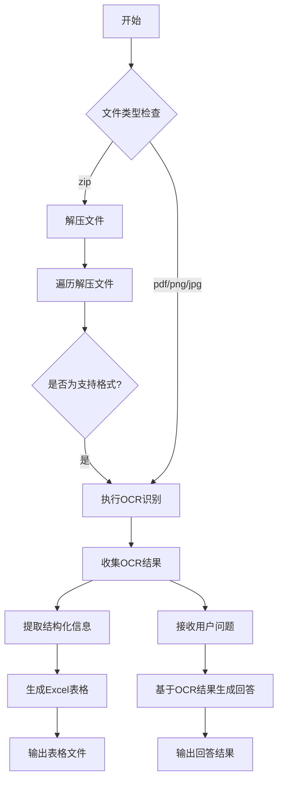
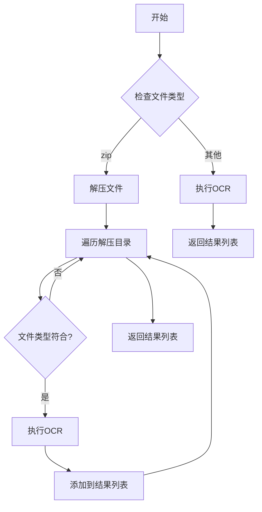
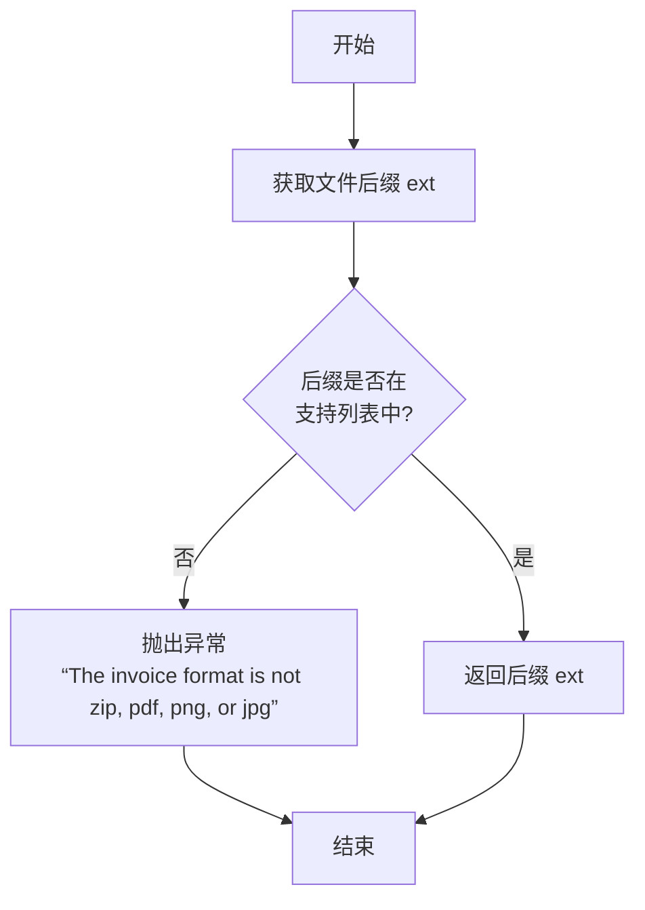
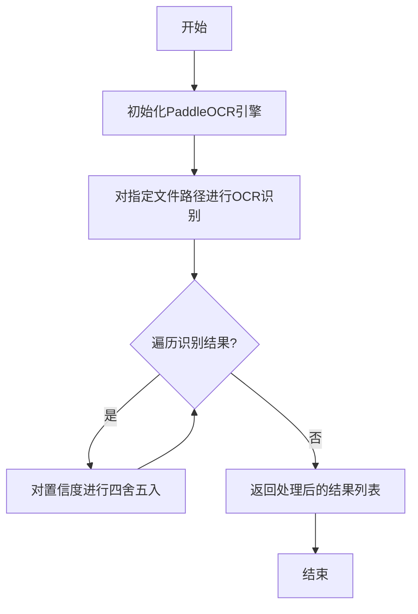
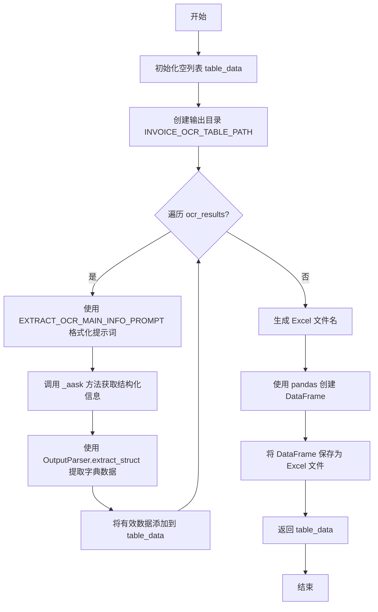
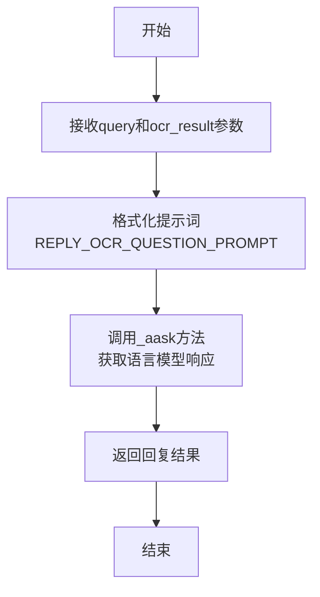

# `.\MetaGPT\metagpt\actions\invoice_ocr.py` 详细设计文档

该代码实现了一个发票OCR处理系统，包含三个核心动作：InvoiceOCR类负责对发票文件（支持zip、pdf、png、jpg格式）进行OCR识别；GenerateTable类负责从OCR结果中提取结构化信息并生成Excel表格；ReplyQuestion类负责基于OCR结果回答用户问题。整个系统构成了一个从发票文件输入到信息提取和问答的完整流程。

## 整体流程



## 类结构

```
Action (基类)
├── InvoiceOCR
├── GenerateTable
└── ReplyQuestion
```

## 全局变量及字段


### `InvoiceOCR.name`
    
动作类的名称，默认值为'InvoiceOCR'，用于标识该动作。

类型：`str`
    


### `InvoiceOCR.i_context`
    
可选的上下文信息，用于存储与当前动作执行相关的额外数据或状态。

类型：`Optional[str]`
    


### `GenerateTable.name`
    
动作类的名称，默认值为'GenerateTable'，用于标识该动作。

类型：`str`
    


### `GenerateTable.i_context`
    
可选的上下文信息，用于存储与当前动作执行相关的额外数据或状态。

类型：`Optional[str]`
    


### `GenerateTable.language`
    
生成表格时使用的语言，默认值为'ch'（中文），影响提示词和输出内容。

类型：`str`
    


### `ReplyQuestion.language`
    
生成回复时使用的语言，默认值为'ch'（中文），影响提示词和输出内容。

类型：`str`
    
    

## 全局函数及方法

### `InvoiceOCR.run`

执行对发票文件的OCR识别，支持zip、PDF、png和jpg格式。如果是zip文件，会先解压，然后对其中符合格式的文件逐一进行OCR识别；如果是单个文件，则直接进行OCR识别。最终返回一个包含所有OCR结果的列表。

参数：

- `file_path`：`Path`，输入文件的路径。
- `*args`：`tuple`，可变位置参数。
- `**kwargs`：`dict`，可变关键字参数。

返回值：`list`，一个包含所有OCR结果的列表。

#### 流程图



#### 带注释源码

```python
async def run(self, file_path: Path, *args, **kwargs) -> list:
    """Execute the action to identify invoice files through OCR.

    Args:
        file_path: The path to the input file.

    Returns:
        A list of OCR results.
    """
    # 1. 检查文件类型
    file_ext = await self._check_file_type(file_path)

    # 2. 如果是zip文件，进行批量处理
    if file_ext == ".zip":
        # 解压zip文件
        unzip_path = await self._unzip(file_path)
        ocr_list = []
        # 遍历解压后的目录
        for root, _, files in os.walk(unzip_path):
            for filename in files:
                invoice_file_path = Path(root) / Path(filename)
                # 检查文件类型是否符合要求
                if Path(filename).suffix in [".zip", ".pdf", ".png", ".jpg"]:
                    # 对符合条件的文件执行OCR
                    ocr_result = await self._ocr(str(invoice_file_path))
                    ocr_list.append(ocr_result)
        # 返回所有OCR结果的列表
        return ocr_list

    else:
        # 3. 如果是单个文件，直接执行OCR
        ocr_result = await self._ocr(file_path)
        # 将结果包装在列表中返回
        return [ocr_result]
```


### `InvoiceOCR._check_file_type`

检查给定文件路径的文件类型，确保其为支持的发票格式（.zip、.pdf、.png、.jpg）。如果文件格式不受支持，则抛出异常。

参数：
-  `file_path`：`Path`，需要检查类型的文件路径。

返回值：`str`，返回文件的后缀名（扩展名），例如 ".zip"、".pdf"。

#### 流程图



#### 带注释源码

```python
@staticmethod
async def _check_file_type(file_path: Path) -> str:
    """Check the file type of the given filename.

    Args:
        file_path: The path of the file.

    Returns:
        The file type based on FileExtensionType enum.

    Raises:
        Exception: If the file format is not zip, pdf, png, or jpg.
    """
    # 1. 从文件路径对象中提取后缀名（扩展名）
    ext = file_path.suffix
    # 2. 检查后缀名是否在支持的格式列表中
    if ext not in [".zip", ".pdf", ".png", ".jpg"]:
        # 3. 如果不在列表中，抛出异常，提示用户支持的格式
        raise Exception("The invoice format is not zip, pdf, png, or jpg")
    # 4. 如果检查通过，返回文件后缀名
    return ext
```


### `InvoiceOCR._unzip`

静态方法，用于解压指定的ZIP文件到以当前时间戳命名的子目录中，并返回解压目录的路径。该方法支持处理包含中文字符的文件名，通过编码转换避免乱码问题。

参数：

- `file_path`：`Path`，ZIP文件的路径对象。

返回值：`Path`，解压后目录的路径对象。

#### 流程图

```mermaid
flowchart TD
    A[开始] --> B[构造解压目标目录路径<br/>file_directory]
    B --> C{打开ZIP文件<br/>zip_ref}
    C --> D[遍历ZIP文件列表<br/>zip_info in zip_ref.infolist()]
    D --> E[处理文件名编码<br/>relative_name]
    E --> F{判断是否为文件<br/>relative_name.suffix?}
    F -- 是 --> G[构造完整文件路径<br/>full_filename]
    G --> H[写入文件内容<br/>File.write]
    H --> D
    F -- 否 --> D
    D --> I[遍历结束]
    I --> J[记录日志<br/>logger.info]
    J --> K[返回解压目录路径<br/>file_directory]
    K --> L[结束]
```

#### 带注释源码

```python
@staticmethod
async def _unzip(file_path: Path) -> Path:
    """Unzip a file and return the path to the unzipped directory.

    Args:
        file_path: The path to the zip file.

    Returns:
        The path to the unzipped directory.
    """
    # 构造解压目标目录路径：在ZIP文件同级目录下创建 `unzip_invoices/{当前时间戳}` 目录
    file_directory = file_path.parent / "unzip_invoices" / datetime.now().strftime("%Y%m%d%H%M%S")
    # 以只读模式打开ZIP文件
    with zipfile.ZipFile(file_path, "r") as zip_ref:
        # 遍历ZIP文件中的每一项
        for zip_info in zip_ref.infolist():
            # 处理文件名编码：使用CP437编码，再用GBK解码，以正确还原ZIP文件中的中文字符，防止乱码
            relative_name = Path(zip_info.filename.encode("cp437").decode("gbk"))
            # 判断是否为文件（通过是否有后缀名判断，忽略目录项）
            if relative_name.suffix:
                # 构造解压后文件的完整路径
                full_filename = file_directory / relative_name
                # 异步调用File.write方法，将ZIP项的内容写入到目标文件
                # 参数：目标目录（full_filename.parent），文件名（relative_name.name），文件内容（zip_ref.read读取）
                await File.write(full_filename.parent, relative_name.name, zip_ref.read(zip_info.filename))

    # 记录解压完成的日志信息
    logger.info(f"unzip_path: {file_directory}")
    # 返回解压目录的路径
    return file_directory
```


### `InvoiceOCR._ocr`

该方法使用 PaddleOCR 对指定的发票文件进行光学字符识别（OCR），并返回处理后的识别结果。识别结果中的置信度会被四舍五入以减少后续处理的 token 开销。

参数：

-  `invoice_file_path`：`Path`，需要进行 OCR 识别的发票文件路径。

返回值：`list`，PaddleOCR 处理后的识别结果列表。该列表的结构通常为 `[[[文本框坐标], (识别文本, 置信度)], ...]`。

#### 流程图



#### 带注释源码

```python
    @staticmethod
    async def _ocr(invoice_file_path: Path):
        # 初始化PaddleOCR引擎，启用角度分类，设置语言为中文，页数为1
        ocr = PaddleOCR(use_angle_cls=True, lang="ch", page_num=1)
        # 对指定路径的文件进行OCR识别，并返回原始结果
        ocr_result = ocr.ocr(str(invoice_file_path), cls=True)
        # 遍历第一页（索引0）的所有识别结果
        for result in ocr_result[0]:
            # 将置信度（result[1][1]）四舍五入到两位小数，以减少后续LLM处理的token成本
            result[1] = (result[1][0], round(result[1][1], 2))
        # 返回处理后的OCR结果列表
        return ocr_result
```


### `GenerateTable.run`

该方法处理OCR识别结果，提取发票关键信息，生成结构化数据表格，并保存为Excel文件。

参数：

- `ocr_results`：`list`，从发票处理中获取的OCR结果列表。
- `filename`：`str`，输出Excel文件的名称。

返回值：`dict[str, str]`，包含提取的发票信息的字典。

#### 流程图



#### 带注释源码

```python
async def run(self, ocr_results: list, filename: str, *args, **kwargs) -> dict[str, str]:
    """Processes OCR results, extracts invoice information, generates a table, and saves it as an Excel file.

    Args:
        ocr_results: A list of OCR results obtained from invoice processing.
        filename: The name of the output Excel file.

    Returns:
        A dictionary containing the invoice information.

    """
    # 初始化一个空列表，用于存储从每个OCR结果中提取的发票数据
    table_data = []
    # 获取或创建用于存储输出表格的目录路径
    pathname = INVOICE_OCR_TABLE_PATH
    pathname.mkdir(parents=True, exist_ok=True)

    # 遍历传入的OCR结果列表
    for ocr_result in ocr_results:
        # 使用预定义的提示词模板，将当前OCR结果和语言设置格式化，生成用于提取信息的提示词
        prompt = EXTRACT_OCR_MAIN_INFO_PROMPT.format(ocr_result=ocr_result, language=self.language)
        # 调用父类Action的异步方法 _aask，将提示词发送给LLM，获取包含结构化信息的文本回复
        ocr_info = await self._aask(prompt=prompt)
        # 使用OutputParser工具从LLM的回复文本中提取结构化的字典数据
        invoice_data = OutputParser.extract_struct(ocr_info, dict)
        # 如果成功提取到数据（非空），则将其添加到结果列表中
        if invoice_data:
            table_data.append(invoice_data)

    # 生成Excel文件名：使用输入文件名的基本名称（不含扩展名），并加上.xlsx后缀
    filename = f"{filename.split('.')[0]}.xlsx"
    # 拼接完整的文件路径
    full_filename = f"{pathname}/{filename}"
    # 使用pandas将提取的数据列表转换为DataFrame
    df = pd.DataFrame(table_data)
    # 将DataFrame写入到指定路径的Excel文件中，不包含行索引
    df.to_excel(full_filename, index=False)
    # 返回提取的发票数据列表（虽然返回类型标注为dict，但实际返回的是list）
    return table_data
```

### `ReplyQuestion.run`

该方法基于OCR结果生成对问题的回复。它接收一个问题查询和OCR结果列表，通过格式化提示词调用语言模型，返回一个字符串类型的回复。

参数：

- `query`：`str`，需要回复的问题内容
- `ocr_result`：`list`，OCR识别结果的列表
- `*args`：可变位置参数，用于接收额外的位置参数
- `**kwargs`：可变关键字参数，用于接收额外的关键字参数

返回值：`str`，基于OCR结果生成的回复内容

#### 流程图



#### 带注释源码

```python
async def run(self, query: str, ocr_result: list, *args, **kwargs) -> str:
    """Reply to questions based on ocr results.

    Args:
        query: The question for which a reply is generated.
        ocr_result: A list of OCR results.

    Returns:
        A reply result of string type.
    """
    # 使用预定义的提示词模板，将查询、OCR结果和语言参数格式化
    prompt = REPLY_OCR_QUESTION_PROMPT.format(query=query, ocr_result=ocr_result, language=self.language)
    # 调用父类的_aask方法，向语言模型发送提示词并获取响应
    resp = await self._aask(prompt=prompt)
    # 返回语言模型生成的回复
    return resp
```

## 关键组件


### InvoiceOCR

执行发票文件的OCR识别，支持ZIP、PDF、PNG和JPG格式，包括批量处理ZIP压缩包内的文件。

### GenerateTable

处理OCR识别结果，提取结构化发票信息，并生成Excel表格文件进行保存。

### ReplyQuestion

基于OCR识别结果，回答用户提出的关于发票内容的问题。


## 问题及建议


### 已知问题

-   **文件类型检查不完整**：`_check_file_type` 方法仅检查了 `.zip`, `.pdf`, `.png`, `.jpg` 四种扩展名，但实际在 `run` 方法中，对于解压后的文件，又使用了 `Path(filename).suffix in [".zip", ".pdf", ".png", ".jpg"]` 进行过滤。这可能导致逻辑不一致，且未考虑如 `.jpeg`, `.PDF`（大写）等常见变体，存在潜在的文件处理遗漏风险。
-   **硬编码的语言设置**：`InvoiceOCR._ocr` 方法中，`PaddleOCR` 初始化时硬编码了 `lang="ch"`。在 `GenerateTable` 和 `ReplyQuestion` 类中，`language` 字段默认为 `"ch"`，但 `InvoiceOCR` 类并未暴露或使用此配置，导致整个OCR流程的语言配置不统一，缺乏灵活性。
-   **异常处理不充分**：`_check_file_type` 方法在遇到不支持的文件格式时直接抛出通用的 `Exception`，这不利于上层调用者进行精确的错误处理和恢复。此外，`_ocr` 和 `_unzip` 等方法内部可能发生的异常（如文件损坏、OCR引擎错误）未被捕获和处理，可能导致整个 `run` 流程意外中断。
-   **资源管理潜在风险**：`_ocr` 方法中，`PaddleOCR` 实例在每次调用时都会创建。对于批量处理（如解压后的多个文件），这会重复初始化OCR引擎，可能造成不必要的性能开销和资源浪费。
-   **路径处理与平台兼容性**：`_unzip` 方法中，使用 `Path` 对象与字符串路径（`str(invoice_file_path)`）混用。虽然 `Path` 对象在传递给 `PaddleOCR.ocr` 时被转换为字符串，但整体路径处理风格可以更统一。解压路径的构建使用了硬编码的目录名 `"unzip_invoices"`，缺乏配置性。
-   **数据精度损失**：`InvoiceOCR._ocr` 方法中，将置信度 `result[1][1]` 四舍五入到两位小数以减少 `token` 成本，这一操作会永久性地丢失原始精度信息，可能影响后续需要高精度置信度的分析或调试场景。

### 优化建议

-   **统一并扩展文件类型检查**：建议创建一个集中的文件类型检查函数或常量列表（如 `SUPPORTED_EXTENSIONS = {".zip", ".pdf", ".png", ".jpg", ".jpeg", ".PDF"}`），并在 `_check_file_type` 和文件过滤逻辑中统一使用。检查时可将扩展名转换为小写以确保兼容性。
-   **统一配置管理**：将 `language` 等配置参数提升到 `InvoiceOCR` 类的初始化参数中，并确保在 `_ocr` 方法中调用。或者，设计一个配置类或从环境变量/配置文件中读取，使整个模块的OCR语言、输出目录等设置可配置、可覆盖。
-   **增强异常处理**：定义自定义异常类（如 `UnsupportedFileFormatError`, `OCRProcessingError`），在 `_check_file_type` 等位置抛出，使错误信息更具体。在 `run` 方法中使用 `try-except` 块捕获关键步骤的异常，进行日志记录并可能返回错误指示或部分结果，提高鲁棒性。
-   **优化OCR实例管理**：考虑将 `PaddleOCR` 实例作为 `InvoiceOCR` 类的一个实例变量（`self.ocr_engine`）在 `__init__` 中初始化，并在 `_ocr` 方法中复用。对于多线程/异步环境，需评估实例的线程安全性或采用其他池化机制。
-   **改进路径与资源管理**：坚持使用 `pathlib.Path` 对象进行所有路径操作，确保跨平台兼容性。解压目录等路径可通过配置或参数传入，增加灵活性。确保在文件处理完成后，必要时清理临时解压文件（可考虑使用 `tempfile.TemporaryDirectory`）。
-   **保留原始数据并提供处理选项**：修改 `_ocr` 方法，使其返回包含原始置信度数据和处理后（如四舍五入后）数据的结构体或字典，而不是直接修改原始结果。或者，将精度处理作为一个可配置的选项或后处理步骤，让调用方决定是否需要保留精度。
-   **提升代码可测试性**：将 `_ocr`、`_unzip` 等静态方法改为实例方法或通过依赖注入传入相关依赖（如OCR引擎、文件操作接口），以便在单元测试中更容易地模拟（mock）这些外部依赖。
-   **添加类型注解与文档**：为所有方法参数和返回值添加更精确的类型注解（例如，`ocr_results: list` 可以更具体为 `list[list]` 或使用 `TypedDict`）。完善类和方法级别的文档字符串，特别是对复杂的数据结构（如OCR结果格式）进行描述。


## 其它


### 设计目标与约束

1.  **核心目标**：提供一个可复用的动作（Action）集合，用于处理发票图像的OCR识别、结构化信息提取、表格生成以及基于OCR结果的问答。
2.  **功能约束**：
    *   支持 `.zip`, `.pdf`, `.png`, `.jpg` 格式的输入文件。
    *   对于 `.zip` 文件，需自动解压并批量处理其中的发票文件。
    *   使用 PaddleOCR 作为底层OCR引擎，并固定使用中文（`lang="ch"`）识别。
    *   提取的发票结构化信息需能输出为 Excel 表格。
    *   能够基于单张发票的OCR结果进行自然语言问答。
3.  **非功能约束**：
    *   **性能**：OCR处理可能较耗时，尤其是PDF和多页文件，代码通过 `page_num=1` 进行了限制。批量处理时需考虑内存和耗时。
    *   **可维护性**：将不同职责（OCR处理、表格生成、问答）分离到不同的 `Action` 子类中，符合单一职责原则。
    *   **错误处理**：对不支持的输入文件格式进行基础校验。

### 错误处理与异常设计

1.  **输入校验**：`InvoiceOCR._check_file_type` 方法检查文件后缀，若不在允许列表 `[".zip", ".pdf", ".png", ".jpg"]` 内，则抛出 `Exception`。此异常类型较为宽泛，建议使用更具体的自定义异常（如 `UnsupportedFileFormatError`）。
2.  **文件操作**：
    *   `InvoiceOCR._unzip` 使用 `zipfile.ZipFile`，其内部可能抛出 `zipfile.BadZipFile` 等异常，当前代码未显式捕获。
    *   `File.write` 方法（来自 `metagpt.utils.file`）的异常未在本地处理。
    *   `GenerateTable.run` 中创建目录 (`pathname.mkdir`) 和写入 Excel 文件 (`df.to_excel`) 可能因权限、磁盘空间等问题失败，未进行异常处理。
3.  **OCR处理**：`PaddleOCR` 初始化及 `ocr.ocr` 调用可能因模型文件缺失、图像损坏、内存不足等原因失败，未进行异常捕获。
4.  **LLM交互**：`_aask` 方法（继承自 `Action`）用于与大型语言模型交互，可能遇到网络错误、API限制、模型生成内容格式错误等问题。`OutputParser.extract_struct` 解析失败时返回 `None`，但未对解析失败的情况进行后续处理（如记录日志或使用默认值）。
5.  **设计缺陷**：错误处理策略不统一，部分关键操作缺乏异常恢复或降级机制。建议增加日志记录、更细粒度的异常捕获以及用户友好的错误信息返回。

### 数据流与状态机

1.  **主数据流（发票处理与表格生成）**：
    *   **起点**：用户提供一个发票文件路径 (`file_path: Path`)。
    *   **步骤1 (InvoiceOCR.run)**：检查文件类型 -> 若是ZIP则解压 -> 对每个发票文件调用 `_ocr` -> 返回 `ocr_results: list`。
    *   **步骤2 (GenerateTable.run)**：接收 `ocr_results` -> 对每个结果调用LLM (`EXTRACT_OCR_MAIN_INFO_PROMPT`) 提取结构化信息 -> 解析为字典 -> 将所有字典存入列表 `table_data` -> 使用 `pandas` 将列表转换为 `DataFrame` -> 写入Excel文件。
    *   **终点**：本地生成一个Excel文件，并返回 `table_data` (List[dict])。
2.  **问答数据流**：
    *   **起点**：用户提供一个问题 (`query: str`) 和对应的单张发票OCR结果 (`ocr_result: list`)。
    *   **步骤 (ReplyQuestion.run)**：将问题和OCR结果填充到提示词模板 (`REPLY_OCR_QUESTION_PROMPT`) -> 调用LLM (`_aask`) 生成回答。
    *   **终点**：返回LLM生成的回答字符串 (`resp: str`)。
3.  **状态说明**：本模块无复杂的内部状态机。`InvoiceOCR` 和 `GenerateTable` 类的 `i_context` 字段声明了但未在提供代码中使用。三个 `Action` 子类的实例本身是无状态的，其行为完全由输入参数驱动。

### 外部依赖与接口契约

1.  **第三方库**：
    *   `paddleocr`: 核心OCR功能提供者。版本兼容性及模型下载是潜在依赖。
    *   `pandas`: 用于将结构化数据列表转换为Excel文件。
    *   `zipfile`, `os`, `pathlib`, `datetime`: Python标准库，用于文件系统操作。
2.  **项目内部依赖**：
    *   `metagpt.actions.Action`: 所有动作类的基类，提供 `_aask` 等方法。
    *   `metagpt.const.INVOICE_OCR_TABLE_PATH`: 配置常量，指定生成的Excel表格存储路径。
    *   `metagpt.prompts.invoice_ocr.EXTRACT_OCR_MAIN_INFO_PROMPT`, `REPLY_OCR_QUESTION_PROMPT`: 预定义的提示词模板。
    *   `metagpt.utils.common.OutputParser`: 用于解析LLM返回的结构化信息。
    *   `metagpt.utils.file.File`: 提供文件写入的辅助方法。
    *   `metagpt.logs.logger`: 项目统一的日志记录器。
3.  **接口契约**：
    *   **`InvoiceOCR.run`**:
        *   **输入**: `file_path: Path` (必须)。
        *   **输出**: `list` (OCR结果列表，结构由PaddleOCR决定)。
        *   **前置条件**: 文件存在且格式受支持。
    *   **`GenerateTable.run`**:
        *   **输入**: `ocr_results: list` (必须，来自 `InvoiceOCR.run` 的输出), `filename: str` (必须，用于命名输出文件)。
        *   **输出**: `dict[str, str]` (实际代码返回 `table_data: List[dict]`，与文档字符串不符，需修正)。
        *   **副作用**: 在 `INVOICE_OCR_TABLE_PATH` 目录下生成一个Excel文件。
    *   **`ReplyQuestion.run`**:
        *   **输入**: `query: str` (必须), `ocr_result: list` (必须，单张发票的OCR结果)。
        *   **输出**: `str` (LLM生成的回答)。
4.  **隐式依赖**：访问LLM服务的配置（如API Key、Base URL）由 `Action` 基类或 `metagpt` 框架的上下文管理，未在本代码中显式设置。

    