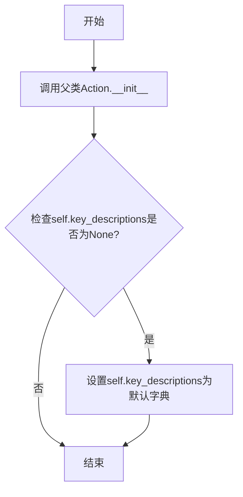
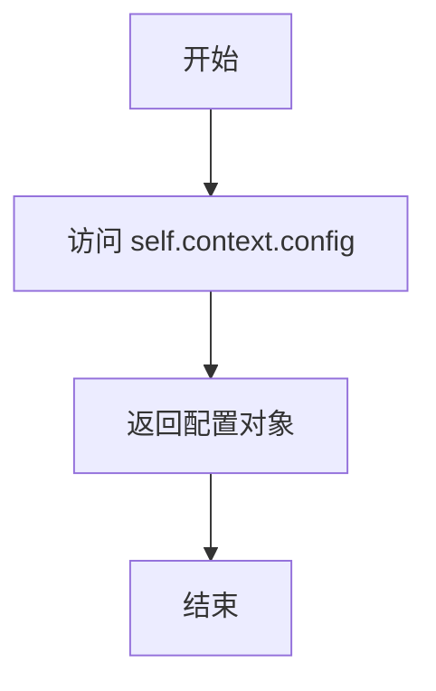
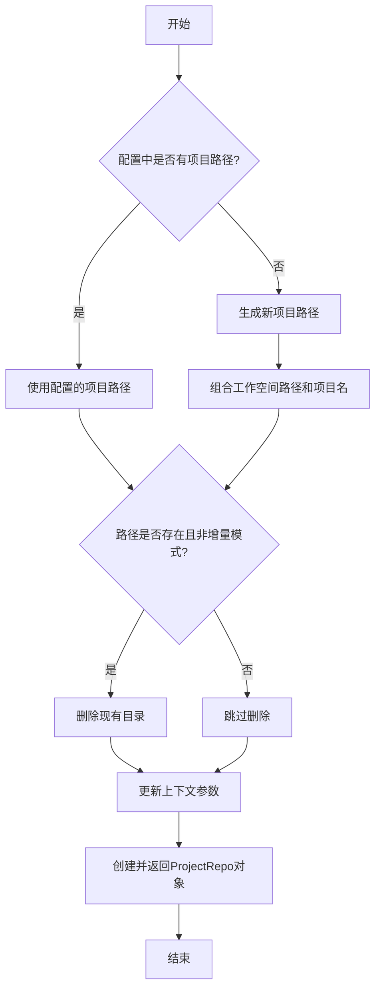
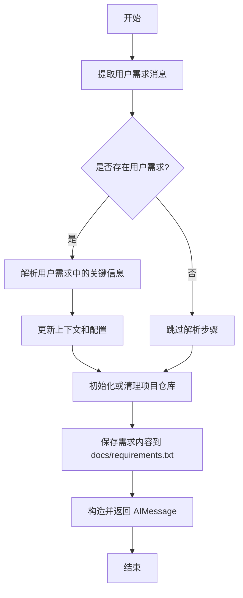

# `.\MetaGPT\metagpt\actions\prepare_documents.py` 详细设计文档

该代码实现了一个名为PrepareDocuments的动作类，主要功能是初始化项目文件夹结构，并将新的用户需求添加到文档中的requirements.txt文件。它负责项目工作空间的创建或清理，解析用户需求中的关键信息（如项目路径），并将处理结果传递给后续的PRD编写动作。

## 整体流程

```mermaid
graph TD
    A[开始: PrepareDocuments.run()] --> B{检查用户需求消息}
    B -- 有用户需求且无项目路径 --> C[解析用户需求中的关键信息]
    C --> D[更新配置和上下文参数]
    B -- 其他情况 --> D
    D --> E[调用_init_repo初始化项目仓库]
    E --> F{项目路径是否存在且非增量模式?}
    F -- 是 --> G[清理现有项目文件夹]
    F -- 否 --> H[创建或使用现有路径]
    H --> I[保存需求到docs/requirements.txt]
    I --> J[创建AIMessage通知后续动作]
    J --> K[结束]
```

## 类结构

```
Action (基类)
└── PrepareDocuments (文档准备动作)
    ├── 字段: name, i_context, key_descriptions, send_to
    ├── 方法: __init__, config(property), _init_repo, run
```

## 全局变量及字段


### `REQUIREMENT_FILENAME`
    
从metagpt.const导入的常量，表示需求文档的文件名，通常为'requirements.txt'。

类型：`str`
    


### `PrepareDocuments.name`
    
Action的名称，固定为'PrepareDocuments'，用于标识该Action的类型。

类型：`str`
    


### `PrepareDocuments.i_context`
    
可选的初始化上下文信息，用于在Action执行时提供额外的上下文数据。

类型：`Optional[str]`
    


### `PrepareDocuments.key_descriptions`
    
可选的键值对描述字典，用于解析用户需求时提供关键字段的描述信息，默认为包含'project_path'的描述。

类型：`Optional[Dict[str, str]]`
    


### `PrepareDocuments.send_to`
    
指定消息发送的目标Action名称，用于在Action执行完成后将消息路由到下一个处理环节。

类型：`str`
    
    

## 全局函数及方法

### `PrepareDocuments.__init__`

该方法用于初始化`PrepareDocuments`类的实例。它首先调用父类`Action`的构造函数，然后检查并设置`key_descriptions`字段的默认值。

参数：

-  `kwargs`：`dict`，传递给父类构造函数的任意关键字参数

返回值：`None`，无返回值

#### 流程图



#### 带注释源码

```python
def __init__(self, **kwargs):
    # 调用父类Action的构造函数，传递所有关键字参数
    super().__init__(**kwargs)
    # 如果key_descriptions字段为None，则将其初始化为一个默认字典
    # 该字典包含一个键值对，用于描述项目路径
    if not self.key_descriptions:
        self.key_descriptions = {"project_path": 'the project path if exists in "Original Requirement"'}
```

### `PrepareDocuments.config`

该属性用于获取当前上下文中的配置对象，该对象包含了项目路径、项目名称、工作空间路径等运行时配置信息。

参数：无

返回值：`metagpt.config.Config`，返回当前动作上下文中的配置对象实例。

#### 流程图



#### 带注释源码

```python
@property
def config(self):
    # 从当前动作的上下文（self.context）中获取配置对象（config）
    # 该配置对象包含了项目的运行时设置，如项目路径、工作空间等
    return self.context.config
```

### `PrepareDocuments._init_repo`

初始化Git仓库环境，根据配置确定项目路径，并创建或清理项目目录。

参数：
- 无显式参数，但方法内部依赖于`self.config`对象。

返回值：`ProjectRepo`，返回一个初始化后的项目仓库对象。

#### 流程图



#### 带注释源码

```python
def _init_repo(self) -> ProjectRepo:
    """Initialize the Git environment."""
    # 检查配置中是否指定了项目路径
    if not self.config.project_path:
        # 如果未指定，则生成新的项目名（或使用默认生成的文件名）
        name = self.config.project_name or FileRepository.new_filename()
        # 组合工作空间路径和项目名作为完整路径
        path = Path(self.config.workspace.path) / name
    else:
        # 如果已指定，则直接使用配置的项目路径
        path = Path(self.config.project_path)
    # 如果路径已存在且不是增量模式，则删除整个目录
    if path.exists() and not self.config.inc:
        shutil.rmtree(path)
    # 更新上下文中的项目路径和增量模式标志
    self.context.kwargs.project_path = path
    self.context.kwargs.inc = self.config.inc
    # 创建并返回ProjectRepo对象
    return ProjectRepo(path)
```

### `PrepareDocuments.run`

该方法负责初始化项目工作区，解析用户需求，并将需求内容写入文档。它首先从传入的消息中提取用户需求，解析其中的关键信息（如项目路径），然后初始化或清理项目仓库。最后，它将需求内容保存到 `docs/requirements.txt` 文件中，并返回一个 `AIMessage` 通知后续的 `WritePRD` 动作，携带项目路径、需求文件路径和现有 PRD 文件列表等信息。

参数：

- `with_messages`：`List[Message]`，包含用户需求和其他消息的列表，用于提取和解析需求信息。
- `kwargs`：`Dict`，其他可选参数，用于扩展功能。

返回值：`AIMessage`，返回一个 `AIMessage` 对象，其中包含项目路径、需求文件路径和现有 PRD 文件列表等信息，用于通知后续动作。

#### 流程图



#### 带注释源码

```python
async def run(self, with_messages, **kwargs):
    """Create and initialize the workspace folder, initialize the Git environment."""
    # 从传入的消息中筛选出用户需求消息
    user_requirements = [i for i in with_messages if i.cause_by == any_to_str(UserRequirement)]
    # 如果未配置项目路径且存在用户需求，则解析用户需求中的关键信息
    if not self.config.project_path and user_requirements and self.key_descriptions:
        args = await user_requirements[0].parse_resources(llm=self.llm, key_descriptions=self.key_descriptions)
        for k, v in args.items():
            if not v or k in ["resources", "reason"]:
                continue
            # 将解析出的关键信息更新到上下文和配置中
            self.context.kwargs.set(k, v)
            logger.info(f"{k}={v}")
        if self.context.kwargs.project_path:
            self.config.update_via_cli(
                project_path=self.context.kwargs.project_path,
                project_name="",
                inc=False,
                reqa_file=self.context.kwargs.reqa_file or "",
                max_auto_summarize_code=0,
            )

    # 初始化或清理项目仓库
    repo = self._init_repo()

    # 将需求内容保存到 docs/requirements.txt 文件中
    await repo.docs.save(filename=REQUIREMENT_FILENAME, content=with_messages[0].content)
    # 构造并返回 AIMessage，通知后续动作处理需求
    return AIMessage(
        content="",
        instruct_content=AIMessage.create_instruct_value(
            kvs={
                "project_path": str(repo.workdir),
                "requirements_filename": str(repo.docs.workdir / REQUIREMENT_FILENAME),
                "prd_filenames": [str(repo.docs.prd.workdir / i) for i in repo.docs.prd.all_files],
            },
            class_name="PrepareDocumentsOutput",
        ),
        cause_by=self,
        send_to=self.send_to,
    )
```

## 关键组件


### PrepareDocuments 类

一个用于初始化项目文件夹、解析用户需求并将新需求写入文档的 Action 类，是项目启动流程的关键组件。

### 项目仓库初始化 (_init_repo 方法)

根据配置（如项目路径、是否增量更新）初始化或清理项目工作目录，并创建 ProjectRepo 对象以管理项目文件结构。

### 用户需求解析 (run 方法中的逻辑)

利用 LLM 解析用户输入消息，提取关键信息（如项目路径），并根据解析结果动态更新运行配置。

### 需求文档管理 (run 方法中的逻辑)

将用户提供的核心需求内容持久化到项目文档目录下的 `requirements.txt` 文件中，作为后续流程（如编写产品需求文档）的输入。

### 消息传递与流程控制 (run 方法的返回值)

生成一个包含项目路径、需求文件路径和现有 PRD 文件列表的结构化 AIMessage，用于触发和指导工作流中的下一个 Action（如 WritePRD）。


## 问题及建议


### 已知问题

-   **初始化逻辑存在潜在的数据丢失风险**：`_init_repo` 方法中，当 `self.config.inc` 为 `False` 且目标路径已存在时，会直接使用 `shutil.rmtree(path)` 删除整个目录。如果 `project_path` 配置错误或用户误操作，可能导致重要数据被意外删除。
-   **对输入消息的过滤逻辑可能不健壮**：`run` 方法中通过 `i.cause_by == any_to_str(UserRequirement)` 来筛选用户需求消息。如果 `UserRequirement` 类的字符串表示方式发生变化，或者存在其他具有相同字符串表示但非用户需求的消息，此逻辑可能失效或产生错误。
-   **配置更新逻辑存在条件冲突**：在 `run` 方法中，当满足特定条件（无 `project_path` 配置、有用户需求、有 `key_descriptions`）时，会解析用户需求并更新配置。然而，更新配置时强制将 `inc` 设为 `False`，这与 `_init_repo` 中依赖 `self.config.inc` 来决定是否删除已有目录的逻辑相冲突。如果解析出的 `project_path` 指向一个已存在的目录，此配置更新将导致该目录在 `_init_repo` 中被删除，这可能与用户“增量”（`inc`）的意图相悖。
-   **`send_to` 字段的初始化与使用存在风险**：类字段 `send_to: str` 没有默认值，且在 `run` 方法返回的 `AIMessage` 中被使用。如果实例化时未正确提供此字段，运行时将引发 `AttributeError`。
-   **资源解析结果的过滤逻辑可能过于宽松**：在 `run` 方法中，对解析出的参数 `args` 进行过滤时，仅排除了值为空或键为 `"resources"`, `"reason"` 的项。对于其他可能无意义或不应设置到上下文中的键（例如，解析模型可能返回的无关字段），缺乏有效的过滤或验证机制。

### 优化建议

-   **增强目录删除操作的安全性**：在 `_init_repo` 方法执行 `shutil.rmtree` 前，应添加明确的确认机制或至少记录警告日志。更好的做法是，将“是否覆盖”作为配置项或运行时决策的一部分，并向用户或调用者明确此行为的后果。
-   **改进消息类型判断逻辑**：避免直接比较 `cause_by` 的字符串表示。建议使用类型检查（如 `isinstance(i, UserRequirement)`）或定义一个更可靠的枚举或常量来标识消息类型。
-   **重构配置管理与初始化流程**：明确“全新初始化”与“增量处理”的边界。建议将 `_init_repo` 的职责拆分为“确定工作目录路径”和“初始化/清理目录”两步。配置更新逻辑应确保 `inc` 标志的一致性，或者在更新 `project_path` 后，根据路径是否存在等因素重新评估 `inc` 的实际值。
-   **为 `send_to` 字段提供默认值或进行防御性检查**：为 `send_to` 设置一个合理的默认值（例如，下一个处理环节的 Action 名称），或者在 `run` 方法中使用前检查其有效性，并提供清晰的错误信息。
-   **强化参数解析结果的验证**：定义明确的、允许设置到 `context.kwargs` 的参数键白名单。在将解析出的参数更新到上下文前，依据此白名单进行过滤，避免污染上下文或引入意外行为。
-   **提升错误处理与日志记录**：在关键步骤（如目录操作、文件保存、配置更新）周围添加更详细的 `try-except` 块和错误日志，便于问题追踪和调试。当前代码中的日志记录可以更丰富一些。
-   **考虑代码可测试性**：将 `shutil.rmtree`、`FileRepository` 等外部依赖通过依赖注入或设置为类属性，以便在单元测试中进行模拟（Mock），提高代码的可测试性。


## 其它


### 设计目标与约束

该代码模块的设计目标是实现一个自动化项目文档初始化与需求收集的动作（Action）。它作为项目启动流程的一部分，负责创建或清理项目工作空间，初始化Git仓库，并将用户输入的新需求追加到指定的需求文档文件中。设计上遵循了RFC 135 2.2.3.5.1规范。主要约束包括：需要与MetaGPT框架的`Action`基类、`ProjectRepo`文件仓库管理、`UserRequirement`消息类型以及配置系统（`self.config`）紧密集成。代码必须能够处理新项目创建和增量更新（`inc`模式）两种场景，并正确地将处理结果通过`AIMessage`传递给后续的`WritePRD`动作。

### 错误处理与异常设计

当前代码中的错误处理较为隐式，主要依赖于Python内置异常和外部库（如`shutil.rmtree`）的异常传播。例如，在`_init_repo`方法中，如果`shutil.rmtree`因权限问题失败，异常将直接抛出，导致整个`run`方法失败。对于文件操作（如`repo.docs.save`）可能出现的IO错误，代码没有显式的`try-catch`块进行处理。此外，在解析用户需求（`user_requirements[0].parse_resources`）时，如果LLM调用失败或返回格式异常，也没有相应的容错机制。整体上，错误处理策略是“快速失败”（fail-fast），依赖上层调用者或框架进行统一捕获和处理。

### 数据流与状态机

1.  **输入数据流**：主要输入是`run`方法的`with_messages`参数（一个消息列表），从中筛选出`UserRequirement`类型的消息作为需求来源。`self.config`提供了项目路径、名称、是否增量等配置信息。`self.key_descriptions`用于指导如何从用户需求中解析出关键参数（如`project_path`）。
2.  **内部状态转换**：
    *   **初始化判断**：检查`self.config.project_path`是否存在。若不存在，则可能根据用户消息解析或生成新路径。
    *   **路径处理**：根据`inc`（增量）标志决定是清理现有目录还是复用。
    *   **上下文更新**：将解析出的参数（如`project_path`）更新到`self.context.kwargs`和`self.config`中。
3.  **输出数据流**：
    *   **文件输出**：将用户需求内容写入`docs/requirements.txt`文件。
    *   **消息输出**：生成一个`AIMessage`，其`instruct_content`字段封装了项目路径、需求文件路径和PRD文件列表，并指定了接收者（`send_to`），从而驱动工作流进入下一个环节（如`WritePRD`）。

### 外部依赖与接口契约

1.  **框架依赖**：
    *   `metagpt.actions.Action`：作为所有动作的基类，定义了`run`等接口。
    *   `metagpt.schema.UserRequirement`, `AIMessage`：定义了消息的数据结构和行为。
    *   `metagpt.utils.project_repo.ProjectRepo`：提供了项目文件仓库的抽象，用于文件操作。
    *   `metagpt.utils.file_repository.FileRepository`：用于生成新文件名。
2.  **配置系统依赖**：通过`self.config`访问项目全局配置（如`workspace.path`, `project_name`, `inc`等），并调用`update_via_cli`方法动态更新配置。
3.  **LLM服务依赖**：在`parse_resources`方法调用中隐含了对LLM（大语言模型）的依赖，用于从自然语言需求中提取结构化信息。
4.  **系统调用依赖**：使用`shutil.rmtree`进行目录删除操作，依赖于操作系统的文件系统权限和环境。
5.  **接口契约**：
    *   `run(with_messages, **kwargs) -> AIMessage`：这是该动作的主要对外接口，接收消息列表，返回一个携带指令的`AIMessage`。
    *   `_init_repo() -> ProjectRepo`：内部方法，负责初始化项目仓库，其行为受到`self.config`中多个参数的约束。

    