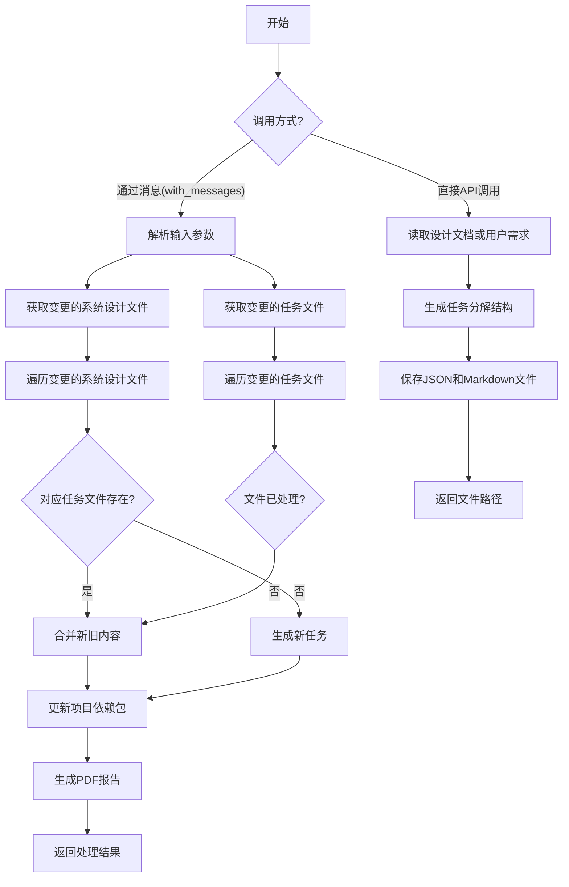
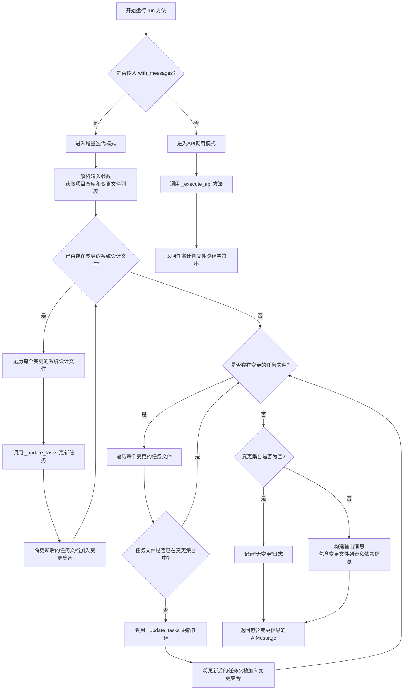
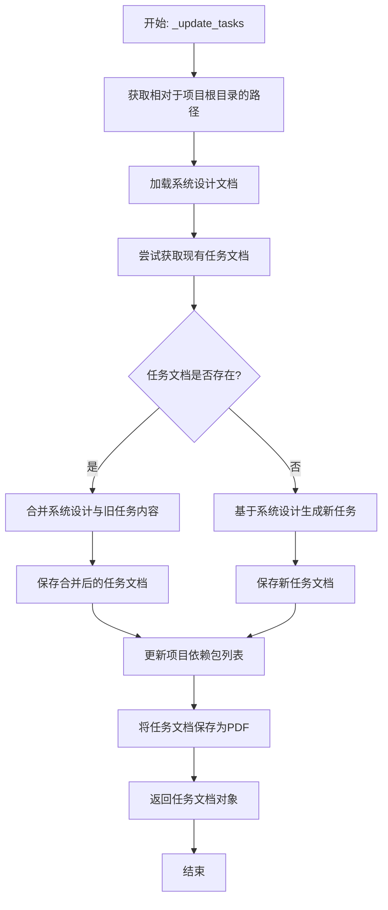
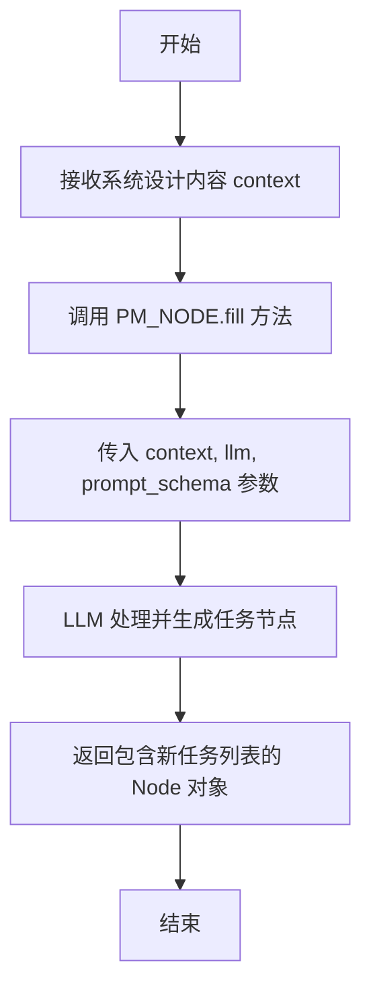
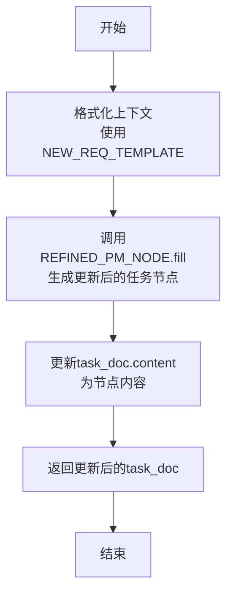
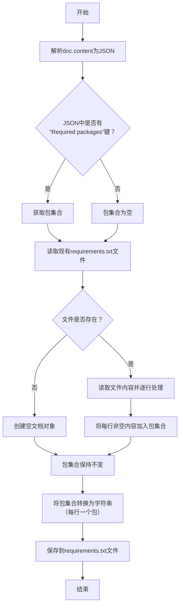
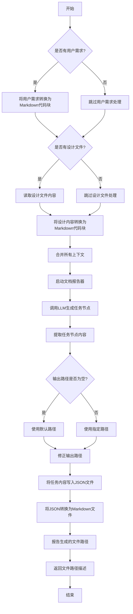

# `.\MetaGPT\metagpt\actions\project_management.py` 详细设计文档

该代码实现了一个项目任务管理功能，主要根据系统设计文档或用户需求生成项目任务分解结构（WBS）。它支持增量迭代，能够检测系统设计或现有任务的变更，并相应地更新任务文档和项目依赖包列表。

## 整体流程



## 类结构

```
Action (基类)
└── WriteTasks (项目任务管理)
    ├── run (主入口方法)
    ├── _update_tasks (更新任务文件)
    ├── _run_new_tasks (生成新任务)
    ├── _merge (合并新旧任务)
    ├── _update_requirements (更新依赖包)
    └── _execute_api (API执行模式)
```

## 全局变量及字段


### `NEW_REQ_TEMPLATE`
    
用于合并旧任务和新需求的模板字符串，格式化时使用旧任务内容和新需求上下文。

类型：`str`
    


### `WriteTasks.name`
    
动作的名称，标识该动作为'CreateTasks'。

类型：`str`
    


### `WriteTasks.i_context`
    
可选的输入上下文字符串，用于存储或传递额外的上下文信息。

类型：`Optional[str]`
    


### `WriteTasks.repo`
    
项目仓库实例，用于管理项目文件、文档和资源，被标记为排除在序列化之外。

类型：`Optional[ProjectRepo]`
    


### `WriteTasks.input_args`
    
存储输入参数的Pydantic模型实例，通常来自消息的指令内容，被标记为排除在序列化之外。

类型：`Optional[BaseModel]`
    
    

## 全局函数及方法

### `WriteTasks.run`

该方法根据用户需求或系统设计文档，生成或更新项目任务计划（WBS）。它支持增量迭代，能够基于变更的系统设计或任务文件，智能地合并新需求与旧任务，并更新项目依赖包列表。最终输出任务计划文档及其相关文件。

参数：

- `with_messages`：`List[Message]`，可选，包含指令内容的消息列表，用于增量迭代模式。
- `user_requirement`：`str`，可选，用户需求描述，用于API调用模式。
- `design_filename`：`str`，系统设计文档的文件路径，用于API调用模式。
- `output_pathname`：`str`，可选，输出任务计划文件的路径，用于API调用模式。
- `**kwargs`：`Any`，其他关键字参数。

返回值：`Union[AIMessage, str]`，在增量迭代模式下返回包含变更信息的AIMessage；在API调用模式下返回任务计划文件的路径字符串。

#### 流程图



#### 带注释源码

```python
async def run(
    self,
    with_messages: List[Message] = None,
    *,
    user_requirement: str = "",
    design_filename: str = "",
    output_pathname: str = "",
    **kwargs,
) -> Union[AIMessage, str]:
    """
    根据用户需求或系统设计文档，生成或更新项目任务计划（WBS）。
    支持两种模式：
    1. 增量迭代模式（传入 with_messages）：基于变更的文件进行智能合并和更新。
    2. API调用模式（不传入 with_messages）：根据用户需求和设计文档生成全新的任务计划。

    Args:
        with_messages: 包含指令内容的消息列表，用于触发增量迭代模式。
        user_requirement: 用户需求描述，用于API调用模式。
        design_filename: 系统设计文档的文件路径，用于API调用模式。
        output_pathname: 输出任务计划文件的路径，用于API调用模式。
        **kwargs: 其他关键字参数。

    Returns:
        在增量迭代模式下，返回包含变更文件列表和项目信息的AIMessage。
        在API调用模式下，返回生成的任务计划文件的路径字符串。
    """
    # 判断运行模式：如果传入了 with_messages，则进入增量迭代模式
    if not with_messages:
        # API调用模式：直接执行外部API逻辑
        return await self._execute_api(
            user_requirement=user_requirement, design_filename=design_filename, output_pathname=output_pathname
        )

    # --- 增量迭代模式逻辑开始 ---
    # 1. 解析输入参数，获取项目仓库和变更信息
    self.input_args = with_messages[-1].instruct_content  # 从最后一条消息中提取指令内容
    self.repo = ProjectRepo(self.input_args.project_path)  # 初始化项目仓库对象
    changed_system_designs = self.input_args.changed_system_design_filenames  # 获取变更的系统设计文件列表
    # 获取变更的任务文件列表（相对于项目根目录的路径）
    changed_tasks = [str(self.repo.docs.task.workdir / i) for i in list(self.repo.docs.task.changed_files.keys())]
    change_files = Documents()  # 初始化一个文档集合，用于存储所有发生变更的任务文档

    # 2. 处理变更的系统设计文件：为每个变更的设计文件更新对应的任务
    for filename in changed_system_designs:
        task_doc = await self._update_tasks(filename=filename)  # 更新或创建任务文档
        # 将更新后的文档以完整路径为键存入集合
        change_files.docs[str(self.repo.docs.task.workdir / task_doc.filename)] = task_doc

    # 3. 处理变更的任务文件：为每个变更的任务文件本身进行更新（避免重复处理）
    for filename in changed_tasks:
        if filename in change_files.docs:  # 如果该任务已在上述步骤中更新过，则跳过
            continue
        task_doc = await self._update_tasks(filename=filename)  # 更新任务文档
        change_files.docs[filename] = task_doc  # 存入集合

    # 4. 处理无变更的情况
    if not change_files.docs:
        logger.info("Nothing has changed.")  # 记录日志

    # 5. 构建返回结果：准备包含所有变更信息的AIMessage
    kvs = self.input_args.model_dump()  # 将输入参数转换为字典
    # 添加变更的任务文件名列表
    kvs["changed_task_filenames"] = [
        str(self.repo.docs.task.workdir / i) for i in list(self.repo.docs.task.changed_files.keys())
    ]
    # 添加Python包依赖文件路径
    kvs["python_package_dependency_filename"] = str(self.repo.workdir / PACKAGE_REQUIREMENTS_FILENAME)

    # 返回AIMessage，包含操作完成提示和变更的文件列表
    return AIMessage(
        content="WBS is completed. "
        + "\n".join(
            [PACKAGE_REQUIREMENTS_FILENAME]  # 依赖文件
            + list(self.repo.docs.task.changed_files.keys())  # 变更的任务文件
            + list(self.repo.resources.api_spec_and_task.changed_files.keys())  # 变更的API/任务资源文件
        ),
        instruct_content=AIMessage.create_instruct_value(kvs=kvs, class_name="WriteTaskOutput"),  # 结构化指令内容
        cause_by=self,  # 指明由当前Action触发
    )
```

### `WriteTasks._update_tasks`

该方法用于更新或创建与给定系统设计文件关联的任务文档。它首先检查是否存在对应的现有任务文档。如果存在，则基于新的系统设计内容与旧任务内容进行合并更新；如果不存在，则基于系统设计内容生成全新的任务文档。更新后，它会同步更新项目的依赖包列表，并将任务文档转换为PDF格式进行保存。

参数：

- `filename`：`str`，系统设计文档的完整文件路径，用于作为生成或更新任务文档的输入依据。

返回值：`Document`，返回更新或创建后的任务文档对象。

#### 流程图



#### 带注释源码

```python
async def _update_tasks(self, filename):
    # 1. 计算相对于项目工作目录的路径
    root_relative_path = Path(filename).relative_to(self.repo.workdir)
    # 2. 从指定文件路径加载系统设计文档
    system_design_doc = await Document.load(filename=filename, project_path=self.repo.workdir)
    # 3. 尝试从任务文档存储中获取与系统设计同名的现有任务文档
    task_doc = await self.repo.docs.task.get(root_relative_path.name)
    # 4. 初始化文档报告器，用于记录处理过程（如流式LLM输出）
    async with DocsReporter(enable_llm_stream=True) as reporter:
        await reporter.async_report({"type": "task"}, "meta")
        # 5. 判断逻辑分支：存在旧任务则合并，否则创建新任务
        if task_doc:
            # 5a. 合并：将新系统设计与旧任务内容结合，生成更新后的任务
            task_doc = await self._merge(system_design_doc=system_design_doc, task_doc=task_doc)
            # 5b. 保存合并后的任务文档，并记录其依赖（即对应的系统设计文档）
            await self.repo.docs.task.save_doc(doc=task_doc, dependencies={system_design_doc.root_relative_path})
        else:
            # 5c. 创建：基于系统设计内容，通过LLM生成全新的任务节点
            rsp = await self._run_new_tasks(context=system_design_doc.content)
            # 5d. 将生成的新任务内容保存为文档，并记录其依赖
            task_doc = await self.repo.docs.task.save(
                filename=system_design_doc.filename,
                content=rsp.instruct_content.model_dump_json(),
                dependencies={system_design_doc.root_relative_path},
            )
        # 6. 根据新任务文档的内容，更新项目的依赖包列表（如requirements.txt）
        await self._update_requirements(task_doc)
        # 7. 将最终的任务文档转换为PDF格式并保存到资源目录
        md = await self.repo.resources.api_spec_and_task.save_pdf(doc=task_doc)
        # 8. 报告生成的PDF文件路径
        await reporter.async_report(self.repo.workdir / md.root_relative_path, "path")
    # 9. 返回处理完成的任务文档对象
    return task_doc
```

### `WriteTasks._run_new_tasks`

该方法根据给定的系统设计文档内容，调用项目管理节点（PM_NODE）生成新的任务列表（WBS，工作分解结构）。它是`WriteTasks`动作中用于创建初始项目计划的核心方法。

参数：

- `context`：`str`，包含系统设计内容的字符串，作为生成新任务列表的输入上下文。

返回值：`Node`，返回一个`Node`对象，其中`instruct_content`属性包含了新生成的任务列表的结构化数据（通常为JSON格式）。

#### 流程图



#### 带注释源码

```python
async def _run_new_tasks(self, context: str):
    # 调用 PM_NODE 的 fill 方法，传入系统设计内容、LLM实例和提示词模式
    # 该方法利用LLM，根据给定的上下文生成项目管理节点（即任务分解结构）
    node = await PM_NODE.fill(req=context, llm=self.llm, schema=self.prompt_schema)
    # 返回生成的节点，其中包含结构化的任务列表信息
    return node
```

### `WriteTasks._merge`

该方法用于合并系统设计文档和现有任务文档，生成更新后的任务文档。它通过将系统设计内容与旧任务内容结合，使用预定义的模板生成新的上下文，然后调用`REFINED_PM_NODE.fill`方法生成更新后的任务节点，最后将节点内容更新到任务文档中。

参数：

- `system_design_doc`：`Document`，系统设计文档对象，包含系统设计的内容。
- `task_doc`：`Document`，现有任务文档对象，包含旧任务的内容。

返回值：`Document`，更新后的任务文档对象，包含合并后的任务内容。

#### 流程图



#### 带注释源码

```python
async def _merge(self, system_design_doc, task_doc) -> Document:
    # 使用预定义的模板将系统设计内容和旧任务内容合并为新上下文
    context = NEW_REQ_TEMPLATE.format(context=system_design_doc.content, old_task=task_doc.content)
    # 调用REFINED_PM_NODE.fill方法，基于新上下文生成更新后的任务节点
    node = await REFINED_PM_NODE.fill(req=context, llm=self.llm, schema=self.prompt_schema)
    # 将任务文档的内容更新为生成节点的序列化内容
    task_doc.content = node.instruct_content.model_dump_json()
    # 返回更新后的任务文档
    return task_doc
```

### `WriteTasks._update_requirements`

该方法用于更新项目的依赖包列表。它从给定的任务文档中提取所需的包，并与现有的依赖包列表合并，然后保存更新后的依赖包列表到项目根目录的 `requirements.txt` 文件中。

参数：

- `doc`：`Document`，包含任务信息的文档对象，其 `content` 字段是一个 JSON 字符串，其中可能包含 `"Required packages"` 键。

返回值：`None`，该方法不返回任何值，但会异步地将更新后的依赖包列表写入文件。

#### 流程图



#### 带注释源码

```python
async def _update_requirements(self, doc):
    # 1. 从任务文档的JSON内容中解析出所需的包集合
    m = json.loads(doc.content)
    packages = set(m.get("Required packages", set()))

    # 2. 尝试从项目仓库中读取现有的依赖包文件（requirements.txt）
    requirement_doc = await self.repo.get(filename=PACKAGE_REQUIREMENTS_FILENAME)
    if not requirement_doc:
        # 如果文件不存在，则创建一个空的文档对象
        requirement_doc = Document(filename=PACKAGE_REQUIREMENTS_FILENAME, root_path=".", content="")

    # 3. 读取现有文件中的每一行（每个包），并将其添加到包集合中
    lines = requirement_doc.content.splitlines()
    for pkg in lines:
        if pkg == "":
            continue
        packages.add(pkg)

    # 4. 将合并后的包集合（去重）保存回 requirements.txt 文件
    await self.repo.save(filename=PACKAGE_REQUIREMENTS_FILENAME, content="\n".join(packages))
```

### `WriteTasks._execute_api`

该方法用于根据用户需求或系统设计文件生成项目计划（WBS），并将结果保存为JSON和Markdown格式。它首先整合用户需求和系统设计内容作为上下文，然后调用LLM生成任务节点，最后将结果写入文件并生成报告。

参数：

- `user_requirement`：`str`，用户需求描述，默认为空字符串
- `design_filename`：`str`，系统设计文件的路径，默认为空字符串
- `output_pathname`：`str`，输出项目计划文件的路径，默认为空字符串

返回值：`str`，返回生成的计划文件路径的字符串描述

#### 流程图



#### 带注释源码

```python
async def _execute_api(
    self, user_requirement: str = "", design_filename: str = "", output_pathname: str = ""
) -> str:
    # 将用户需求转换为Markdown代码块格式
    context = to_markdown_code_block(user_requirement)
    # 如果提供了设计文件路径，则读取文件内容并追加到上下文中
    if design_filename:
        design_filename = rectify_pathname(path=design_filename, default_filename="system_design.md")
        content = await aread(filename=design_filename)
        context += to_markdown_code_block(content)

    # 启动文档报告器，用于记录生成过程
    async with DocsReporter(enable_llm_stream=True) as reporter:
        # 报告任务类型元数据
        await reporter.async_report({"type": "task"}, "meta")
        # 调用LLM生成新的任务节点
        node = await self._run_new_tasks(context)
        # 提取任务节点的结构化内容
        file_content = node.instruct_content.model_dump_json()

        # 处理输出路径：如果未指定则使用默认路径，否则确保为绝对路径
        if not output_pathname:
            output_pathname = Path(output_pathname) / "docs" / "project_schedule.json"
        elif not Path(output_pathname).is_absolute():
            output_pathname = self.config.workspace.path / output_pathname
        # 修正路径名，确保文件扩展名为.json
        output_pathname = rectify_pathname(path=output_pathname, default_filename="project_schedule.json")
        # 将任务内容写入JSON文件
        await awrite(filename=output_pathname, data=file_content)
        # 生成对应的Markdown文件（用于可读性展示）
        md_output_filename = output_pathname.with_suffix(".md")
        await save_json_to_markdown(content=file_content, output_filename=md_output_filename)
        # 报告生成的Markdown文件路径
        await reporter.async_report(md_output_filename, "path")
    # 返回生成的文件路径描述
    return f'Project Schedule filename: "{str(output_pathname)}"'
```

## 关键组件

### WriteTasks 类

一个用于生成和更新项目任务计划（WBS）的 Action 类，它能够根据系统设计文档或用户需求，创建新的项目任务计划，或增量式地合并更新现有任务计划。

### 项目任务管理流程

该代码的核心流程是：接收系统设计变更或用户需求，通过调用大语言模型（LLM）生成或更新对应的任务计划文档（JSON格式），并同步更新项目依赖包列表，最后将结果保存为 JSON 和 Markdown 格式。

### 增量迭代功能

根据 RFC 135 的设计，实现了增量迭代功能。代码能够识别出已变更的系统设计文件和任务文件，并仅对这些文件进行更新和合并，而不是全量重写，从而支持项目的持续演进。

### 文档存储与操作分离

遵循 RFC 236 的设计，将文档存储操作（如保存任务计划、更新依赖）从核心的业务逻辑中分离出来，通过 `ProjectRepo` 和 `Document` 等组件进行统一管理，提高了代码的模块化和可维护性。

### 工具注册与集成

通过 `@register_tool` 装饰器将 `WriteTasks` 类注册为工具，使其 `run` 方法能够被外部系统（如工作流引擎）发现和调用，增强了代码的集成能力。

## 问题及建议


### 已知问题

-   **`run` 方法逻辑分支复杂且职责不单一**：`run` 方法同时处理两种调用模式（通过 `with_messages` 参数区分），导致方法体过长，逻辑分支复杂，违反了单一职责原则。这增加了代码的理解和维护难度。
-   **`_update_requirements` 方法存在潜在的数据覆盖风险**：该方法从现有需求文档中读取包列表，与新的包集合合并后，直接覆盖原文件。如果文件读取失败或并发写入，可能导致数据丢失或不一致。
-   **硬编码的文件路径和模板字符串**：代码中多处使用了硬编码的路径（如 `"docs/tasks/"`）和模板字符串（如 `NEW_REQ_TEMPLATE`）。这降低了代码的灵活性和可配置性，当项目结构或需求变更时，需要修改多处代码。
-   **异常处理不完善**：代码中缺乏对文件读写、JSON解析、路径操作等可能失败操作的详细异常处理。例如，`json.loads(doc.content)` 如果遇到无效JSON会抛出异常，但未在代码中看到相应的捕获和处理逻辑。
-   **`_execute_api` 方法路径处理逻辑可能产生非预期结果**：当 `output_pathname` 为空字符串时，会构建 `Path("") / "docs" / "project_schedule.json"` 这样的路径，这可能不是预期的行为，且依赖于 `self.config.workspace.path` 的配置。

### 优化建议

-   **重构 `run` 方法，分离不同调用模式**：建议将 `run` 方法拆分为两个私有方法，例如 `_run_with_messages` 和 `_run_with_api_params`，由 `run` 方法根据 `with_messages` 参数进行路由。这可以使每个方法的职责更清晰，逻辑更简单。
-   **改进 `_update_requirements` 方法的稳健性**：建议采用“读取-修改-写入”的原子操作模式，并考虑使用文件锁或更安全的数据合并策略（如使用 `set` 进行去重合并）。同时，增加对文件不存在、读取失败等情况的异常处理。
-   **将硬编码值提取为配置或常量**：将文件路径模板（如 `"docs/tasks/"`）、默认文件名、模板字符串等提取到类的常量或配置文件中。这提高了代码的可维护性，便于统一管理和修改。
-   **增强异常处理机制**：在关键操作（如文件I/O、JSON解析、网络请求`PM_NODE.fill`）周围添加 `try-except` 块，记录详细的错误日志，并根据业务逻辑决定是抛出异常、返回错误信息还是进行降级处理。
-   **优化路径构建逻辑**：明确 `output_pathname` 为空时的默认行为。可以设置一个合理的默认路径，或者当 `output_pathname` 为空时，直接抛出 `ValueError` 提示用户必须提供输出路径，避免产生模糊的路径。
-   **考虑引入依赖注入以提高可测试性**：`ProjectRepo`、`DocsReporter` 等依赖目前直接在方法内部创建或通过属性访问。考虑通过构造函数或方法参数注入这些依赖，便于在单元测试中进行模拟（Mock）。
-   **添加更详细的代码注释和类型提示**：虽然已有部分注释，但对于复杂的业务逻辑（如增量更新、文件变更检测）可以添加更详细的说明。同时，确保所有函数和方法都有完整的类型注解，以提高代码的可读性和IDE支持。


## 其它


### 设计目标与约束

本模块（`WriteTasks`）是项目管理系统中的一个核心动作（Action），旨在根据用户需求或系统设计文档，自动生成或更新项目的工作分解结构（WBS）或项目计划。其核心设计目标包括：
1.  **自动化任务生成**：基于LLM，将高层次的需求或设计文档自动转化为结构化的、可执行的任务列表。
2.  **增量式迭代**：支持在已有任务计划的基础上，根据新的需求或变更的设计进行智能合并与更新，而非全量重写。
3.  **与项目仓库集成**：深度集成 `ProjectRepo`，能够感知代码仓库中文档（如系统设计、任务文件）的变更，并据此触发相应的任务更新流程。
4.  **依赖管理**：自动从生成的任务中提取所需的Python包依赖，并更新项目的 `requirements.txt` 文件。
5.  **多格式输出**：生成结构化的JSON任务文件，并自动转换为可读性更强的Markdown格式。

主要约束包括：
*   **输入依赖**：高质量的任务生成严重依赖于输入的系统设计文档（`design_filename`）或清晰、具体的用户需求（`user_requirement`）。
*   **LLM能力限制**：任务分解的粒度、合理性和优先级排序受限于底层LLM模型的理解与规划能力。
*   **文件结构约定**：模块假设项目遵循特定的目录结构（如 `docs/system_designs/`, `docs/tasks/`），并与 `ProjectRepo` 的抽象紧密耦合。

### 错误处理与异常设计

模块中的错误处理主要采用以下策略：
1.  **静默处理与日志记录**：对于非关键性错误，如文件未找到或内容为空，通常进行日志记录（`logger.info`）并继续执行或返回默认值，避免中断整个流程。例如，在 `_update_tasks` 中，如果 `task_doc` 不存在，则创建新任务。
2.  **输入验证**：在 `run` 方法的API模式（`_execute_api`）中，对输入参数（如 `design_filename`）进行路径修正和读取，但未显式处理文件读取失败（`aread` 可能抛出异常）。调用者需确保文件存在或处理相关异常。
3.  **LLM调用异常**：对 `PM_NODE.fill` 和 `REFINED_PM_NODE.fill` 的调用未包裹在显式的异常处理块中。这些调用可能因网络、模型或提示词问题而失败，异常会向上传播给调用者。
4.  **资源管理**：使用 `async with DocsReporter(...) as reporter:` 确保报告器资源的正确初始化和清理。
5.  **数据一致性**：在 `_update_requirements` 中更新 `requirements.txt` 时，采用读取-合并-写入的方式，但此过程非原子操作，在并发场景下可能存在竞态条件。

### 数据流与状态机

**主要数据流**：
1.  **触发**：由上游组件（如 `Role`）调用 `WriteTasks.run` 方法触发。
2.  **输入**：
    *   **消息模式**：接收包含 `WriteTaskInput` 指令内容的 `Message` 列表。输入包含项目路径、变更的系统设计文件列表等信息。
    *   **API模式**：直接接收 `user_requirement`, `design_filename`, `output_pathname` 参数。
3.  **处理**：
    *   **消息模式**：遍历变更的系统设计文件和任务文件，对每个文件调用 `_update_tasks`。该方法内部根据是否存在旧任务，决定调用 `_run_new_tasks`（新建）或 `_merge`（合并更新）。
    *   **API模式**：直接组合用户需求和设计文档内容，调用 `_run_new_tasks` 生成全新任务。
4.  **输出**：
    *   **消息模式**：返回一个 `AIMessage`，其 `instruct_content` 包含更新后的任务文件名列表、依赖文件等，用于驱动下游动作。
    *   **API模式**：返回一个字符串，指示生成的项目计划文件路径。
    *   **副作用**：在项目仓库的 `docs/tasks/` 目录下生成或更新 `.json` 和 `.md` 格式的任务文件；更新项目根目录的 `requirements.txt` 文件。

**状态机（简化）**：
模块本身没有复杂的状态机，但其行为由输入模式决定：
```
          [调用 run 方法]
                 |
                 v
        +-------------------+
        |   判断 with_messages   |
        |    是否为空？         |
        +-------------------+
                 |
        +--------+--------+
        |                 |
        v                 v
(为空，API模式)    (非空，消息模式)
        |                 |
        v                 v
  _execute_api       遍历 changed_system_designs
        |                 | 和 changed_tasks
        v                 v
  组合输入内容        对每个文件调用
        |            _update_tasks
        v                 |
  调用 _run_new_tasks     v
        |           更新 requirements.txt
        v                 |
  保存文件到本地          v
        |           返回 AIMessage
        v
  返回文件路径
```

### 外部依赖与接口契约

**外部依赖**：
1.  **LLM服务**：通过 `self.llm` 属性依赖外部大语言模型服务来执行 `PM_NODE.fill` 和 `REFINED_PM_NODE.fill`。
2.  **项目仓库 (`ProjectRepo`)**：依赖其进行文件系统的抽象操作，包括文档的获取、保存、变更检测（`changed_files`）以及路径管理。
3.  **文档系统 (`Documents`, `Document`)**：依赖其加载、保存和表示结构化文档。
4.  **工具注册表 (`register_tool`)**：用于将本动作注册为可用的工具，可能用于工作流编排。
5.  **工具函数 (`aread`, `awrite`, `rectify_pathname` 等)**：来自 `metagpt.utils.common`，用于异步文件操作和路径处理。
6.  **报告器 (`DocsReporter`)**：用于生成处理过程的报告或日志流。

**接口契约**：
1.  **`run` 方法**：
    *   **输入**：支持两种调用约定。一是传统的关键字参数（`user_requirement`, `design_filename`, `output_pathname`）；二是通过 `with_messages` 参数传递消息列表，其中最后一条消息的 `instruct_content` 必须是一个符合 `WriteTaskInput` 模式（虽未在代码中直接定义，但从使用方式推断）的 `BaseModel` 实例。
    *   **输出**：返回 `Union[AIMessage, str]`。消息模式返回 `AIMessage`；API模式返回路径字符串。
2.  **与 `PM_NODE`/`REFINED_PM_NODE` 的契约**：期望这些节点（来自 `project_management_an`）的 `fill` 方法返回一个包含 `instruct_content` 属性的对象，该属性是一个Pydantic模型，具有 `model_dump_json()` 方法。
3.  **与 `ProjectRepo.docs.task` 的契约**：期望其 `get`, `save`, `save_doc` 等方法能正确处理 `Document` 对象，并管理文档间的依赖关系。
4.  **文件结构契约**：假设系统设计文档存放在 `docs/system_designs/`（或类似）目录下，任务文档输出到 `docs/tasks/` 目录下，`requirements.txt` 位于项目根目录。

    