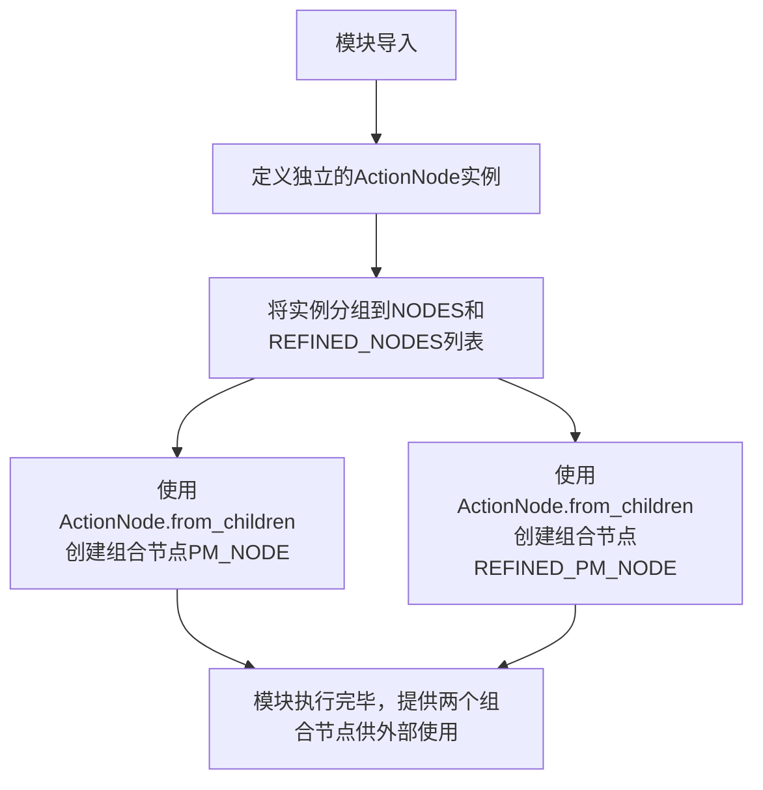

# `.\MetaGPT\metagpt\actions\project_management_an.py` 详细设计文档

该代码定义了一个项目管理相关的ActionNode配置模块，用于在MetaGPT框架中构建项目管理相关的结构化输出模板。它创建了一系列预定义的ActionNode实例，每个实例对应项目管理中的一个特定方面（如依赖包分析、逻辑分析、任务列表等），并将它们组织成两个主要节点：基础项目管理节点（PM_NODE）和精炼版项目管理节点（REFINED_PM_NODE）。这些节点为AI代理生成结构化的项目管理文档提供了模板和约束。

## 整体流程



## 类结构

```
ActionNode (外部导入类)
├── REQUIRED_PACKAGES (独立实例)
├── REQUIRED_OTHER_LANGUAGE_PACKAGES (独立实例)
├── LOGIC_ANALYSIS (独立实例)
├── REFINED_LOGIC_ANALYSIS (独立实例)
├── TASK_LIST (独立实例)
├── REFINED_TASK_LIST (独立实例)
├── FULL_API_SPEC (独立实例)
├── SHARED_KNOWLEDGE (独立实例)
├── REFINED_SHARED_KNOWLEDGE (独立实例)
└── ANYTHING_UNCLEAR_PM (独立实例)
组合节点:
├── PM_NODE (由NODES列表创建)
└── REFINED_PM_NODE (由REFINED_NODES列表创建)
```

## 全局变量及字段


### `REQUIRED_PACKAGES`
    
定义项目所需的Python第三方包列表的ActionNode

类型：`ActionNode`
    


### `REQUIRED_OTHER_LANGUAGE_PACKAGES`
    
定义项目所需的非Python语言第三方包列表的ActionNode

类型：`ActionNode`
    


### `LOGIC_ANALYSIS`
    
定义项目逻辑分析（文件、类、方法、依赖关系）的ActionNode

类型：`ActionNode`
    


### `REFINED_LOGIC_ANALYSIS`
    
定义合并遗留内容和增量内容后的精炼逻辑分析的ActionNode

类型：`ActionNode`
    


### `TASK_LIST`
    
定义按依赖顺序优先级的任务分解列表的ActionNode

类型：`ActionNode`
    


### `REFINED_TASK_LIST`
    
定义合并遗留内容和增量内容后的精炼任务列表的ActionNode

类型：`ActionNode`
    


### `FULL_API_SPEC`
    
定义完整API规范（OpenAPI 3.0）的ActionNode

类型：`ActionNode`
    


### `SHARED_KNOWLEDGE`
    
定义项目共享知识（如公共函数、配置变量）的ActionNode

类型：`ActionNode`
    


### `REFINED_SHARED_KNOWLEDGE`
    
定义合并遗留内容和增量内容后的精炼共享知识的ActionNode

类型：`ActionNode`
    


### `ANYTHING_UNCLEAR_PM`
    
定义项目管理中任何不明确方面及澄清的ActionNode

类型：`ActionNode`
    


### `NODES`
    
包含标准项目管理所需ActionNode的列表

类型：`List[ActionNode]`
    


### `REFINED_NODES`
    
包含精炼（增量开发）项目管理所需ActionNode的列表

类型：`List[ActionNode]`
    


### `PM_NODE`
    
由NODES列表生成的根级项目管理ActionNode

类型：`ActionNode`
    


### `REFINED_PM_NODE`
    
由REFINED_NODES列表生成的根级精炼项目管理ActionNode

类型：`ActionNode`
    


### `ActionNode.key`
    
ActionNode的唯一标识符或名称

类型：`str`
    


### `ActionNode.expected_type`
    
定义ActionNode期望的输出数据类型

类型：`type`
    


### `ActionNode.instruction`
    
提供如何填充或使用此ActionNode的指导说明

类型：`str`
    


### `ActionNode.example`
    
提供ActionNode预期输出值的示例

类型：`Any`
    
    

## 全局函数及方法

### `ActionNode.from_children`

这是一个类方法，用于根据提供的子节点列表创建一个新的 `ActionNode` 实例。它通过整合所有子节点的信息（如键、期望类型、指令和示例）来构建父节点的内容，从而简化了复杂、嵌套的 `ActionNode` 结构的创建过程。

参数：
-  `key`：`str`，要创建的新父节点的键（名称）。
-  `children`：`List[ActionNode]`，用于构建父节点内容的子 `ActionNode` 对象列表。

返回值：`ActionNode`，返回一个整合了所有子节点信息的新 `ActionNode` 实例。

#### 流程图

```mermaid
flowchart TD
    A[开始: from_children(key, children)] --> B[初始化空列表<br>keys, types, instructions, examples]
    B --> C{遍历 children 列表?}
    C -- 是 --> D[将子节点的 key, expected_type,<br>instruction, example 分别追加到对应列表]
    D --> C
    C -- 否 --> E[使用 key 和整合后的列表<br>创建新的 ActionNode 实例]
    E --> F[返回新创建的 ActionNode 实例]
    F --> G[结束]
```

#### 带注释源码

```python
@classmethod
def from_children(cls, key: str, children: List["ActionNode"]) -> "ActionNode":
    """
    类方法：根据子节点列表创建一个新的 ActionNode。
    通过聚合所有子节点的信息来构建父节点的内容。

    Args:
        key (str): 新创建的父 ActionNode 的键（名称）。
        children (List[ActionNode]): 用于构建父节点内容的子 ActionNode 对象列表。

    Returns:
        ActionNode: 一个整合了所有子节点信息的新 ActionNode 实例。
    """
    # 初始化空列表，用于收集所有子节点的信息
    keys = []
    types = []
    instructions = []
    examples = []

    # 遍历每个子节点，提取其属性并添加到对应的列表中
    for child in children:
        keys.append(child.key)  # 收集子节点的键
        types.append(child.expected_type)  # 收集子节点的期望类型
        instructions.append(child.instruction)  # 收集子节点的指令
        examples.append(child.example)  # 收集子节点的示例

    # 使用传入的 key 和整合后的子节点信息列表，创建一个新的 ActionNode 实例并返回
    # 新节点的内容由子节点的键、类型、指令和示例组合而成
    return cls(
        key=key,
        expected_type=types,
        instruction=instructions,
        example=examples,
    )
```

## 关键组件


### ActionNode 类

用于定义和管理项目开发流程中各个关键环节（如需求分析、逻辑设计、任务分解等）的结构化数据节点，每个节点包含键名、期望数据类型、指令说明和示例，以规范化和自动化项目信息的收集与处理。

### 项目初始化与依赖管理组件

包含 `REQUIRED_PACKAGES` 和 `REQUIRED_OTHER_LANGUAGE_PACKAGES` 节点，用于分别定义项目所需的 Python 第三方包和其他编程语言（如 JavaScript、Go 等）的第三方依赖，确保开发环境的一致性。

### 逻辑分析与设计组件

包含 `LOGIC_ANALYSIS` 和 `REFINED_LOGIC_ANALYSIS` 节点，用于指导开发者进行系统逻辑结构分析，列出需要实现或修改的文件及其包含的类、方法、函数，并进行依赖分析和导入声明，支持增量开发场景下的设计合并与精炼。

### 任务分解与规划组件

包含 `TASK_LIST` 和 `REFINED_TASK_LIST` 节点，用于将开发工作分解为具体的文件任务列表，并根据依赖关系确定优先级，支持在合并增量内容后对任务列表进行优化和重新排序，以指导高效的开发流程。

### API 规范与共享知识组件

包含 `FULL_API_SPEC`、`SHARED_KNOWLEDGE` 和 `REFINED_SHARED_KNOWLEDGE` 节点，分别用于定义前后端通信的 API 接口规范（使用 OpenAPI 3.0）、记录项目中的公共知识（如工具函数、配置变量），以及在增量开发后更新和扩展这些共享内容。

### 项目上下文澄清组件

包含 `ANYTHING_UNCLEAR_PM` 节点，用于在项目管理和开发过程中，识别并记录任何不明确或需要澄清的方面，以促进团队沟通和降低项目风险。

### 节点聚合与组织组件

包含 `NODES`、`REFINED_NODES`、`PM_NODE` 和 `REFINED_PM_NODE` 全局变量，用于将上述各个独立的 `ActionNode` 实例按不同场景（标准流程 vs 精炼/增量流程）分组，并最终聚合为更高层级的、可执行的复合节点，形成完整的项目管理工作流。


## 问题及建议


### 已知问题

-   **代码重复与冗余**：`LOGIC_ANALYSIS` 与 `REFINED_LOGIC_ANALYSIS`、`TASK_LIST` 与 `REFINED_TASK_LIST`、`SHARED_KNOWLEDGE` 与 `REFINED_SHARED_KNOWLEDGE` 在结构和功能上高度相似，仅 `instruction` 字段存在差异。这种重复增加了维护成本，当需要修改公共逻辑时，必须在多个地方进行同步更新，容易导致不一致。
-   **硬编码的节点列表**：`NODES` 和 `REFINED_NODES` 列表是硬编码的。当需要动态增删或调整节点顺序时，必须直接修改源代码，缺乏灵活性，也不利于基于配置或运行时的逻辑来构建节点集合。
-   **类型注解不精确**：多个 `ActionNode` 的 `expected_type` 使用了宽泛的类型，如 `Optional[List[str]]` 或 `List[List[str]]`。这虽然提供了灵活性，但牺牲了类型安全性和自描述性。例如，`List[List[str]]` 无法明确表达内部列表的固定长度（如总是两个元素：文件名和描述）或结构约束。
-   **潜在的魔法字符串**：`ActionNode` 的 `key` 字段（如 `"Required packages"`）作为标识符在代码中多处使用。这些字符串如果拼写错误，只能在运行时发现，增加了出错风险。
-   **缺乏输入验证与默认值**：`ActionNode` 的构造依赖于外部输入来填充其内容。当前代码没有展示如何验证这些输入是否符合 `expected_type` 和 `instruction` 的约束，也没有为可选字段（如 `REQUIRED_PACKAGES` 的 `Optional` 类型）提供清晰的默认值处理逻辑。

### 优化建议

-   **重构为工厂方法或配置驱动**：为不同类型的分析节点（如“基础分析”和“精炼分析”）创建工厂函数或基于配置字典动态生成。这可以消除 `NODES` 和 `REFINED_NODES` 的重复定义，通过参数化 `instruction` 等差异部分来复用共同的节点定义。
-   **使用枚举或常量定义 Key**：将 `ActionNode` 的 `key` 值定义为模块级别的常量或枚举（`Enum`）。这样可以实现集中管理、避免拼写错误，并利用 IDE 的自动补全和引用查找功能，提高代码的可维护性和安全性。
-   **引入更精确的数据模型**：为具有特定结构的数据（如 `LOGIC_ANALYSIS` 期望的 `List[List[str]]`）定义专用的数据类（`dataclass`）或命名元组（`NamedTuple`），例如 `FileDescription(name: str, description: str)`。然后在 `ActionNode` 的 `expected_type` 中使用这个新类型，使意图更清晰，并可在实例化时进行结构验证。
-   **增强节点集合的构建逻辑**：将 `NODES` 和 `REFINED_NODES` 的构建逻辑封装到函数中。这些函数可以接收参数来决定包含哪些基础节点以及是否使用“精炼”版本的指令，从而提高灵活性和可测试性。
-   **补充文档与示例**：在模块或类级别增加文档字符串，说明 `PM_NODE` 和 `REFINED_PM_NODE` 的预期使用场景、如何解析其输出、以及 `expected_type` 与返回数据结构的对应关系。特别是对于复杂类型（如 OpenAPI 规范字符串），可以链接到更详细的示例或规范文档。


## 其它


### 设计目标与约束

本模块的设计目标是提供一个可扩展、结构化的项目管理信息定义框架，用于在AI驱动的软件开发流程中，标准化地收集和传递项目需求、依赖、逻辑分析、任务分解等关键信息。其核心约束包括：1) 必须与`ActionNode`基类兼容，确保能无缝集成到更大的工作流中；2) 定义的信息节点需具备清晰的键名、类型、指令和示例，以指导AI代理生成格式化的内容；3) 支持“基础”和“精炼”两种模式，以适应初始项目规划和增量开发两种场景。

### 错误处理与异常设计

当前代码未显式定义错误处理逻辑。错误处理主要依赖于`ActionNode`基类的实现以及使用这些节点的外部工作流。潜在的异常场景包括：1) 在创建`ActionNode`时，如果提供的`expected_type`与实际示例不匹配，可能导致运行时类型检查错误；2) 在`ActionNode.from_children`方法中，如果子节点列表为空或存在键名冲突，可能引发异常。建议的改进是：在模块层面定义自定义异常类（如`InvalidNodeDefinitionError`），并在节点初始化时进行更严格的验证，例如检查`instruction`是否为空、`example`是否符合`expected_type`。

### 数据流与状态机

本模块定义的是静态的数据结构（`ActionNode`实例）和结构集合（`NODES`, `REFINED_NODES`, `PM_NODE`, `REFINED_PM_NODE`）。数据流由外部驱动：上游（如“撰写产品需求文档”的Action）产生原始项目信息，传递给本模块定义的`PM_NODE`或`REFINED_PM_NODE`。这些节点作为模板，指导下游的AI代理（如“架构师”角色）填充具体内容，生成结构化的输出字典。状态简单：从“未填充的模板”到“已填充的结构化数据”，没有复杂的状态转换。

### 外部依赖与接口契约

1.  **内部依赖**：强依赖`metagpt.actions.action_node.ActionNode`类。本模块所有功能都建立在`ActionNode`的`__init__`和`from_children`方法之上。
2.  **接口契约**：
    *   **输入**：本模块本身不直接处理输入。它定义的节点被其他组件用于解析非结构化的自然语言描述。
    *   **输出**：`PM_NODE`和`REFINED_PM_NODE`是两个主要的输出接口。它们是由多个子`ActionNode`组合而成的复合节点，其`serialize`方法能生成一个包含所有子节点键及其AI生成内容的字典。这个字典的结构是下游任务（如生成代码、创建任务列表）的权威输入。
    *   **节点定义契约**：每个`ActionNode`的`key`在其所属的列表（`NODES`或`REFINED_NODES`）中必须唯一。`expected_type`和`example`应保持一致，以提供有效的类型提示。

### 安全性与合规性考虑

当前模块不直接处理用户数据、网络请求或敏感操作，因此主要的安全考虑在于依赖管理：`REQUIRED_PACKAGES`和`REQUIRED_OTHER_LANGUAGE_PACKAGES`节点定义的依赖包列表，最终可能被用于`pip install`或`npm install`等命令。需要确保生成的依赖说明中不包含来源不可信或已知有漏洞的包版本。建议在后续的工作流中，增加一个依赖安全检查或提示的环节。

### 部署与运维考量

本模块是纯Python代码库的一部分，无独立部署需求。运维考量在于其定义的模板的维护：当项目管理的需求发生变化（例如需要增加一个新的信息收集项“数据库Schema设计”），需要在此模块中定义新的`ActionNode`，并更新`NODES`和`REFINED_NODES`列表以及顶层的`PM_NODE`。这要求对模块的修改有良好的版本管理和变更记录。

    