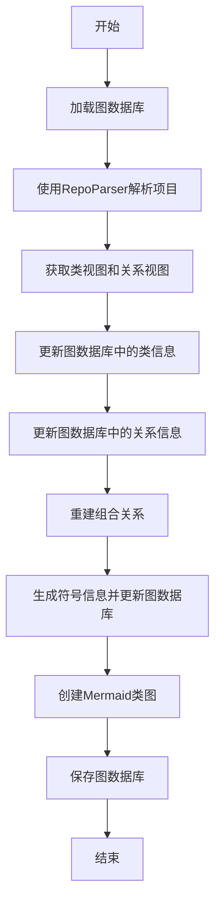
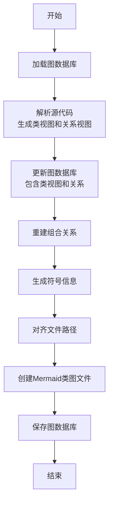
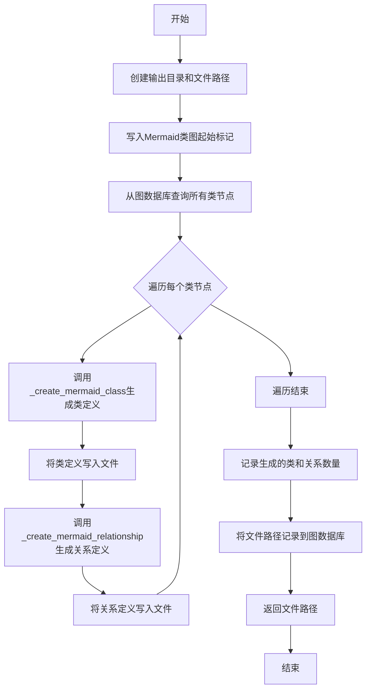
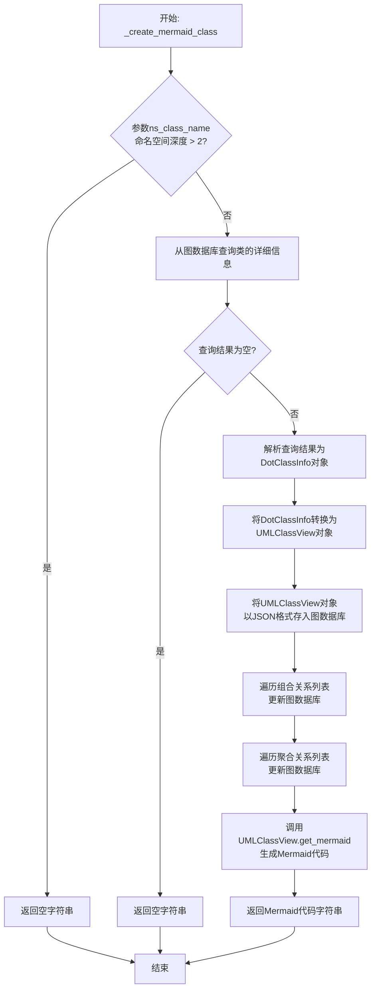
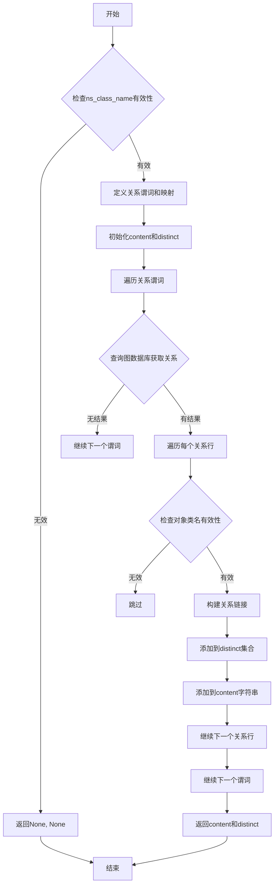
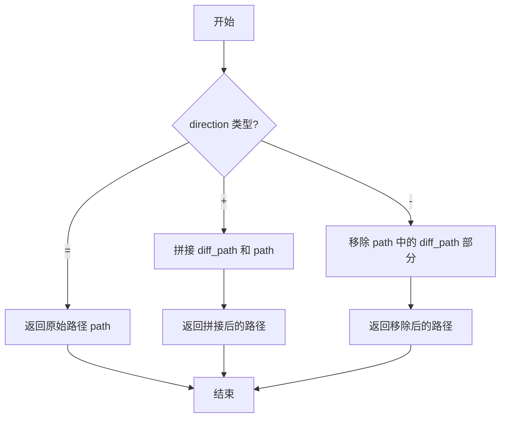

# `.\MetaGPT\metagpt\actions\rebuild_class_view.py` 详细设计文档

该代码实现了一个名为RebuildClassView的Action类，其核心功能是从源代码项目中重建类图。它通过解析项目结构，提取类信息、类之间的关系（泛化、组合、聚合），并使用图数据库存储这些信息，最终生成Mermaid格式的类图文件。

## 整体流程



## 类结构

```
Action (基类)
└── RebuildClassView (重建类图)
```

## 全局变量及字段


### `RebuildClassView.graph_db`
    
用于存储和操作类图数据的图数据库实例，初始为None，在run方法中加载数据后使用。

类型：`Optional[GraphRepository]`
    
    

## 全局函数及方法

### `RebuildClassView.run`

该方法作为`Action`类的`run`方法的具体实现，负责从源代码项目中重建类图。它首先加载图数据库，然后使用`RepoParser`解析源代码，生成类视图和关系视图，并更新图数据库。接着，它处理符号信息，对齐文件路径，并最终创建Mermaid格式的类图文件。

参数：

- `with_messages`：`Optional[Type]`，可选参数，指定要响应的消息。
- `format`：`str`，提示模式的格式。

返回值：`None`，无返回值。

#### 流程图



#### 带注释源码

```python
async def run(self, with_messages=None, format=None):
    """
    实现`Action`类的`run`方法。

    参数：
        with_messages (Optional[Type]): 可选参数，指定要响应的消息。
        format (str): 提示模式的格式。
    """
    # 设置提示模式格式，默认为配置中的格式
    format = format if format else self.config.prompt_schema
    # 构建图数据库文件路径
    graph_repo_pathname = self.context.git_repo.workdir / GRAPH_REPO_FILE_REPO / self.context.git_repo.workdir.name
    # 从JSON文件加载图数据库
    self.graph_db = await DiGraphRepository.load_from(str(graph_repo_pathname.with_suffix(".json")))
    # 初始化源代码解析器
    repo_parser = RepoParser(base_directory=Path(self.i_context))
    # 使用pylint解析源代码，生成类视图、关系视图和包根路径
    class_views, relationship_views, package_root = await repo_parser.rebuild_class_views(path=Path(self.i_context))
    # 更新图数据库，添加类视图信息
    await GraphRepository.update_graph_db_with_class_views(self.graph_db, class_views)
    # 更新图数据库，添加类关系视图信息
    await GraphRepository.update_graph_db_with_class_relationship_views(self.graph_db, relationship_views)
    # 重建组合关系
    await GraphRepository.rebuild_composition_relationship(self.graph_db)
    # 使用AST生成符号信息
    # 计算路径差异
    direction, diff_path = self._diff_path(path_root=Path(self.i_context).resolve(), package_root=package_root)
    # 生成符号信息
    symbols = repo_parser.generate_symbols()
    for file_info in symbols:
        # 对齐文件路径，确保与类视图的根目录一致
        file_info.file = self._align_root(file_info.file, direction, diff_path)
        # 更新图数据库，添加文件信息
        await GraphRepository.update_graph_db_with_file_info(self.graph_db, file_info)
    # 创建Mermaid类图文件
    await self._create_mermaid_class_views()
    # 保存图数据库
    await self.graph_db.save()
```

### `RebuildClassView._create_mermaid_class_views`

该方法从图数据库（`graph_db`）中提取类信息，生成Mermaid格式的类图，并将其写入文件。它首先创建类图的基本结构，然后遍历所有类节点，为每个类生成Mermaid类定义和类之间的关系定义，最后将生成的类图保存到指定文件中，并记录文件路径到图数据库中。

参数：

-  `self`：`RebuildClassView`，当前`RebuildClassView`类的实例，用于访问类属性和其他方法。

返回值：`str`，生成的Mermaid类图文件的完整路径。

#### 流程图



#### 带注释源码

```python
async def _create_mermaid_class_views(self) -> str:
    """Creates a Mermaid class diagram using data from the `graph_db` graph repository.

    This method utilizes information stored in the graph repository to generate a Mermaid class diagram.
    Returns:
        mermaid class diagram file name.
    """
    # 1. 确定并创建输出目录，构建输出文件路径。
    path = self.context.git_repo.workdir / DATA_API_DESIGN_FILE_REPO
    path.mkdir(parents=True, exist_ok=True)
    pathname = path / self.context.git_repo.workdir.name
    filename = str(pathname.with_suffix(".class_diagram.mmd"))

    # 2. 异步打开文件准备写入。
    async with aiofiles.open(filename, mode="w", encoding="utf-8") as writer:
        # 3. 写入Mermaid类图的起始行。
        content = "classDiagram\n"
        logger.debug(content)
        await writer.write(content)

        # 4. 从图数据库中查询所有标记为“类”的节点。
        rows = await self.graph_db.select(predicate=GraphKeyword.IS, object_=GraphKeyword.CLASS)
        class_distinct = set()  # 用于去重统计类
        relationship_distinct = set()  # 用于去重统计关系

        # 5. 第一遍遍历：为每个类生成Mermaid类定义并写入文件。
        for r in rows:
            content = await self._create_mermaid_class(r.subject)
            if content:
                await writer.write(content)
                class_distinct.add(r.subject)  # 记录已处理的类

        # 6. 第二遍遍历：为每个类生成与其他类的关系定义并写入文件。
        for r in rows:
            content, distinct = await self._create_mermaid_relationship(r.subject)
            if content:
                logger.debug(content)
                await writer.write(content)
                if distinct:
                    relationship_distinct.update(distinct)  # 记录已处理的关系

    # 7. 记录生成统计信息（类数量和关系数量）。
    logger.info(f"classes: {len(class_distinct)}, relationship: {len(relationship_distinct)}")

    # 8. 如果存在上下文信息（`i_context`），则将生成的Mermaid文件路径作为属性插入图数据库。
    if self.i_context:
        r_filename = Path(filename).relative_to(self.context.git_repo.workdir)
        await self.graph_db.insert(
            subject=self.i_context, predicate="hasMermaidClassDiagramFile", object_=str(r_filename)
        )
        logger.info(f"{self.i_context} hasMermaidClassDiagramFile {filename}")

    # 9. 返回生成的Mermaid类图文件的完整路径。
    return filename
```

### `RebuildClassView._create_mermaid_class`

该方法用于为指定的类生成Mermaid类图代码块。它从图数据库中查询类的详细信息，构建UML类视图，并更新图数据库中的类视图和关联关系（组合与聚合），最后返回该类的Mermaid表示。

参数：

- `ns_class_name`：`str`，带命名空间前缀的类名，用于在图数据库中唯一标识该类。

返回值：`str`，表示该类的Mermaid代码块字符串。如果类不存在或为子类（命名空间深度大于2），则返回空字符串。

#### 流程图



#### 带注释源码

```python
async def _create_mermaid_class(self, ns_class_name) -> str:
    """Generates a Mermaid class diagram for a specific class using data from the `graph_db` graph repository.

    Args:
        ns_class_name (str): The namespace-prefixed name of the class for which the Mermaid class diagram is to be created.

    Returns:
        str: A Mermaid code block object in markdown representing the class diagram.
    """
    # 1. 检查命名空间深度，深度大于2（如包含子类）则忽略
    fields = split_namespace(ns_class_name)
    if len(fields) > 2:
        # Ignore sub-class
        return ""

    # 2. 从图数据库中查询指定类的详细信息
    rows = await self.graph_db.select(subject=ns_class_name, predicate=GraphKeyword.HAS_DETAIL)
    if not rows:
        return ""
    # 3. 将查询结果反序列化为DotClassInfo对象
    dot_class_info = DotClassInfo.model_validate_json(rows[0].object_)
    # 4. 将DotClassInfo对象转换为UMLClassView对象
    class_view = UMLClassView.load_dot_class_info(dot_class_info)

    # 5. 将UMLClassView对象以JSON格式存入图数据库，便于后续查询
    await self.graph_db.insert(ns_class_name, GraphKeyword.HAS_CLASS_VIEW, class_view.model_dump_json())
    # 6. 遍历组合关系，更新图数据库中的组合关系边
    for c in dot_class_info.compositions:
        await self.graph_db.insert(
            subject=ns_class_name,
            predicate=GraphKeyword.IS + COMPOSITION + GraphKeyword.OF,
            object_=concat_namespace("?", c),
        )

    # 7. 遍历聚合关系，更新图数据库中的聚合关系边
    for a in dot_class_info.aggregations:
        await self.graph_db.insert(
            subject=ns_class_name,
            predicate=GraphKeyword.IS + AGGREGATION + GraphKeyword.OF,
            object_=concat_namespace("?", a),
        )

    # 8. 调用UMLClassView的方法生成Mermaid格式的类定义代码块
    content = class_view.get_mermaid(align=1)
    logger.debug(content)
    return content
```

### `RebuildClassView._create_mermaid_relationship`

该方法用于为指定的命名空间前缀类名生成Mermaid类关系图，基于图数据库中的关系数据构建类之间的泛化、组合和聚合关系。

参数：

- `ns_class_name`：`str`，命名空间前缀的类名，用于指定需要生成关系图的类。

返回值：`Tuple[Optional[str], Optional[Set]]`，返回一个元组，包含关系图的字符串表示和一个用于去重的集合。如果输入类名无效或没有关系数据，则返回`(None, None)`。

#### 流程图



#### 带注释源码

```python
async def _create_mermaid_relationship(self, ns_class_name: str) -> Tuple[Optional[str], Optional[Set]]:
    """Generates a Mermaid class relationship diagram for a specific class using data from the `graph_db` graph repository.

    Args:
        ns_class_name (str): The namespace-prefixed class name for which the Mermaid relationship diagram is to be created.

    Returns:
        Tuple[str, Set]: A tuple containing the relationship diagram as a string and a set of deduplication.
    """
    # 分割命名空间前缀类名，检查是否为子类（命名空间层级大于2则忽略）
    s_fields = split_namespace(ns_class_name)
    if len(s_fields) > 2:
        # Ignore sub-class
        return None, None

    # 定义关系谓词及其对应的Mermaid关系类型映射
    predicates = {GraphKeyword.IS + v + GraphKeyword.OF: v for v in [GENERALIZATION, COMPOSITION, AGGREGATION]}
    mappings = {
        GENERALIZATION: " <|-- ",
        COMPOSITION: " *-- ",
        AGGREGATION: " o-- ",
    }
    content = ""  # 存储生成的关系图字符串
    distinct = set()  # 用于去重的集合，避免重复关系
    # 遍历每种关系类型（泛化、组合、聚合）
    for p, v in predicates.items():
        # 从图数据库中查询当前类作为主语，当前关系谓词的所有三元组
        rows = await self.graph_db.select(subject=ns_class_name, predicate=p)
        for r in rows:
            # 分割关系对象的命名空间，检查是否为子类
            o_fields = split_namespace(r.object_)
            if len(o_fields) > 2:
                # Ignore sub-class
                continue
            # 获取对应的Mermaid关系符号
            relationship = mappings.get(v, " .. ")
            # 构建关系链接字符串，格式为：对象类名 + 关系符号 + 主语类名
            link = f"{o_fields[1]}{relationship}{s_fields[1]}"
            distinct.add(link)  # 添加到去重集合
            content += f"\t{link}\n"  # 添加到关系图字符串，每行以制表符开头

    return content, distinct
```

### `RebuildClassView._diff_path`

该方法用于计算并返回两个路径（`path_root` 和 `package_root`）之间的差异方向和相对路径。它通过比较两个路径字符串的长度来确定它们的关系，并返回一个表示差异方向的符号（`+`、`-` 或 `=`）以及差异部分的路径。

参数：
- `path_root`：`Path`，表示根路径。
- `package_root`：`Path`，表示包根路径。

返回值：`Tuple[str, str]`，返回一个元组，包含差异方向（`+`、`-` 或 `=`）和差异部分的路径字符串。

#### 流程图

```mermaid
graph TD
    A[开始] --> B{比较 path_root 和 package_root 的长度}
    B -- path_root 更长 --> C[返回 "+", path_root 相对于 package_root 的路径]
    B -- package_root 更长 --> D[返回 "-", package_root 相对于 path_root 的路径]
    B -- 长度相等 --> E[返回 "=", "."]
    C --> F[结束]
    D --> F
    E --> F
```

#### 带注释源码

```python
@staticmethod
def _diff_path(path_root: Path, package_root: Path) -> (str, str):
    """Returns the difference between the root path and the path information represented in the package name.

    Args:
        path_root (Path): The root path.
        package_root (Path): The package root path.

    Returns:
        Tuple[str, str]: A tuple containing the representation of the difference ("+", "-", "=") and the path detail of the differing part.

    Example:
        >>> _diff_path(path_root=Path("/Users/x/github/MetaGPT"), package_root=Path("/Users/x/github/MetaGPT/metagpt"))
        "-", "metagpt"

        >>> _diff_path(path_root=Path("/Users/x/github/MetaGPT/metagpt"), package_root=Path("/Users/x/github/MetaGPT/metagpt"))
        "=", "."
    """
    # 比较两个路径字符串的长度
    if len(str(path_root)) > len(str(package_root)):
        # 如果 path_root 更长，返回 "+" 和 path_root 相对于 package_root 的路径
        return "+", str(path_root.relative_to(package_root))
    if len(str(path_root)) < len(str(package_root)):
        # 如果 package_root 更长，返回 "-" 和 package_root 相对于 path_root 的路径
        return "-", str(package_root.relative_to(path_root))
    # 如果长度相等，返回 "=" 和当前目录符号 "."
    return "=", "."
```

### `RebuildClassView._align_root`

该方法用于根据给定的方向（`direction`）和路径差异（`diff_path`）调整文件路径，使其与指定的根目录对齐。它支持三种对齐方向：`"="` 表示路径不变，`"+"` 表示在路径前添加差异路径，`"-"` 表示从路径中移除差异路径。

参数：

- `path`：`str`，需要对齐的原始文件路径。
- `direction`：`str`，对齐方向，取值为 `"+"`、`"-"` 或 `"="`。
- `diff_path`：`str`，表示路径差异的字符串，用于调整路径。

返回值：`str`，返回对齐后的文件路径。

#### 流程图



#### 带注释源码

```python
@staticmethod
def _align_root(path: str, direction: str, diff_path: str) -> str:
    """Aligns the path to the same root represented by `diff_path`.

    Args:
        path (str): The path to be aligned.
        direction (str): The direction of alignment ('+', '-', '=').
        diff_path (str): The path representing the difference.

    Returns:
        str: The aligned path.

    Example:
        >>> _align_root(path="metagpt/software_company.py", direction="+", diff_path="MetaGPT")
        "MetaGPT/metagpt/software_company.py"

        >>> _align_root(path="metagpt/software_company.py", direction="-", diff_path="metagpt")
        "software_company.py"
    """
    if direction == "=":
        # 如果方向为"="，直接返回原始路径
        return path
    if direction == "+":
        # 如果方向为"+"，在路径前添加差异路径
        return diff_path + "/" + path
    else:
        # 如果方向为"-"，从路径中移除差异路径部分
        return path[len(diff_path) + 1 :]
```

## 关键组件

### 张量索引与惰性加载

代码中未直接实现张量索引与惰性加载功能。该功能通常用于高效处理大型数据集或模型参数，通过按需加载数据块而非一次性全部加载到内存中来实现。在本代码中，数据（如类图信息）是通过图数据库（`GraphRepository`）进行查询和管理的，其加载和保存机制可能封装在`DiGraphRepository.load_from`和`graph_db.save()`方法中，但具体的惰性加载逻辑并未在提供的代码片段中体现。

### 反量化支持

代码中未涉及反量化支持。反量化通常指将量化后的数据（如低精度整数）转换回原始高精度浮点数的过程，常见于机器学习模型的推理阶段以平衡性能与精度。本代码的核心任务是解析源代码并重建类图，属于静态代码分析和数据建模领域，不涉及数值计算或模型量化。

### 量化策略

代码中未涉及量化策略。量化策略是指在机器学习中，为减少模型大小和加速推理，将模型权重和激活值从高精度（如FP32）转换为低精度（如INT8）时所采用的具体方法、配置和规则。本代码专注于通过`RepoParser`解析代码结构、提取类与关系信息，并利用图数据库存储和可视化这些信息，其处理对象是代码的抽象语法树（AST）和符号信息，而非数值型模型参数。

## 问题及建议


### 已知问题

-   **方法 `run` 职责过重**：`run` 方法承担了过多职责，包括初始化图数据库、解析代码库、更新图数据库、生成Mermaid图表等。这违反了单一职责原则，使得方法难以理解、测试和维护。
-   **硬编码的路径和文件扩展名**：代码中多处硬编码了文件路径（如 `GRAPH_REPO_FILE_REPO`, `DATA_API_DESIGN_FILE_REPO`）和文件扩展名（如 `.json`, `.class_diagram.mmd`）。这降低了代码的灵活性和可配置性。
-   **潜在的循环依赖风险**：在 `_create_mermaid_class` 方法中，更新图数据库（`insert` 操作）和生成Mermaid内容耦合在一起。如果图数据库的更新逻辑发生变化，可能会影响图表生成功能，反之亦然。
-   **异常处理不完善**：代码中大量使用了 `await` 进行异步操作，但缺乏对可能出现的异常（如文件读写错误、数据库操作失败、数据解析错误等）的捕获和处理，这可能导致程序在遇到意外情况时崩溃。
-   **静态方法 `_diff_path` 和 `_align_root` 的命名和逻辑可读性有待提高**：这两个方法的命名和内部逻辑（特别是 `_align_root` 中对字符串的切片操作）不够直观，增加了理解代码意图的难度。
-   **重复的忽略子类逻辑**：在 `_create_mermaid_class` 和 `_create_mermaid_relationship` 方法中，都存在通过 `split_namespace` 判断并忽略子类的逻辑。这部分逻辑可以抽取为公共方法，避免重复。

### 优化建议

-   **重构 `run` 方法，分解职责**：将 `run` 方法中的主要步骤（加载图数据库、解析代码、更新关系、生成图表）拆分为独立的私有方法或引入新的服务类（如 `ClassDiagramBuilder`、`MermaidGenerator`）来分别处理。这能显著提高代码的模块化和可测试性。
-   **将配置项外部化**：将硬编码的路径常量、文件扩展名等提取到配置文件（如YAML、JSON）或环境变量中。通过依赖注入或配置类（如 `DiagramConfig`）来管理这些配置，提高系统的可配置性和部署灵活性。
-   **解耦数据更新与视图生成**：考虑将图数据库的更新逻辑（如插入组合、聚合关系）与Mermaid图表的生成逻辑分离。可以先生成完整的中间数据结构（如 `ClassDiagramModel`），然后分别由 `GraphRepositoryUpdater` 和 `MermaidRenderer` 进行处理，降低耦合度。
-   **增强异常处理与日志记录**：在关键异步操作（如文件I/O、数据库查询/插入）周围添加 `try-except` 块，捕获特定异常并记录详细的错误日志。对于可恢复的错误，应考虑重试或提供默认值；对于严重错误，应优雅地终止或向上层抛出。
-   **重命名并优化辅助方法**：将 `_diff_path` 重命名为更清晰的名称，如 `_compare_path_roots`。优化 `_align_root` 方法，使用 `pathlib.Path` 的 `relative_to` 和 `/` 操作符来替代字符串切片，使路径操作更安全、更易读。
-   **提取公共的忽略子类逻辑**：创建一个如 `_is_subclass(namespace: str) -> bool` 的辅助方法，封装通过 `split_namespace` 判断是否为子类的逻辑。在 `_create_mermaid_class` 和 `_create_mermaid_relationship` 中调用此方法，消除代码重复。
-   **考虑性能优化**：`_create_mermaid_class_views` 方法中，对每个类都执行了多次数据库查询（如 `select` 和后续的 `insert`）。可以考虑批量查询或使用更高效的图遍历算法来减少数据库交互次数，特别是在处理大型代码库时。
-   **添加类型注解的完整性**：确保所有方法参数和返回值都有完整的类型注解。例如，`run` 方法的 `with_messages` 参数类型可以更具体（如 `Optional[List[Message]]`），`_diff_path` 的返回值类型应为 `Tuple[str, str]`。


## 其它


### 设计目标与约束

本模块的核心设计目标是从源代码项目中自动重建类图，并将其持久化为Mermaid格式的类图文件。主要约束包括：1) 需要兼容不同编程语言（当前主要针对Python）的源代码解析；2) 需要处理复杂的包/模块结构，并正确映射到命名空间；3) 需要从源代码中准确提取类、字段、方法以及类之间的关系（泛化、组合、聚合）；4) 生成的图数据需要存储在图数据库中，以便后续查询和更新；5) 最终输出需要是标准、可读的Mermaid图表。

### 错误处理与异常设计

代码中显式的错误处理较少，主要依赖Python的默认异常传播机制。潜在的错误点包括：1) 文件I/O操作（如`aiofiles.open`）可能因权限或路径问题失败；2) 图数据库的加载、查询、保存操作可能失败；3) 源代码解析（`RepoParser.rebuild_class_views`）可能因语法错误或不支持的代码结构而失败；4) 路径操作（`_diff_path`, `_align_root`）可能因路径逻辑错误导致异常。当前设计未包含对这些异常的捕获和处理，也未定义模块特定的异常类型，这可能导致上层调用者难以区分错误来源。

### 数据流与状态机

1.  **主数据流**：输入源代码目录 -> `RepoParser`解析生成`UMLClassView`和关系列表 -> 更新图数据库 -> 从图数据库查询数据 -> 生成Mermaid格式字符串 -> 写入`.mmd`文件。
2.  **图数据库状态**：初始为空或从文件加载 -> 被`class_views`和`relationship_views`更新 -> 被`rebuild_composition_relationship`进一步补充 -> 被`file_info`更新 -> 最终状态被保存到文件。
3.  **关键状态转换**：`graph_db`属性从`None`变为初始化的`DiGraphRepository`实例；`i_context`（输入上下文，即源代码路径）作为整个流程的起点和后续数据关联的锚点。

### 外部依赖与接口契约

1.  **`metagpt.repo_parser.RepoParser`**：核心外部组件，负责解析源代码。本类依赖其`rebuild_class_views`和`generate_symbols`方法。契约是这些方法返回特定格式的数据结构（如`UMLClassView`列表）。
2.  **`metagpt.utils.graph_repository.GraphRepository`**：抽象图数据库接口。本类通过其静态方法（`update_graph_db_with_class_views`等）操作图数据，并依赖其`select`, `insert`, `save`等方法。契约是这些方法能正确执行图查询和更新操作。
3.  **`metagpt.utils.di_graph_repository.DiGraphRepository`**：`GraphRepository`的具体实现，用于持久化图数据到JSON文件。依赖其`load_from`方法。
4.  **`aiofiles`**：用于异步文件写入，是标准`open`的异步替代。
5.  **`metagpt.const`**：定义了关键的常量字符串（如`GRAPH_REPO_FILE_REPO`, `DATA_API_DESIGN_FILE_REPO`, `GENERALIZATION`等），用于构建图数据库的谓词和确定文件路径。

### 并发与线程安全

代码广泛使用`async/await`语法，表明其设计运行在异步环境中（如asyncio事件循环）。主要耗时操作（文件I/O、图数据库操作）都是异步的，以避免阻塞。然而，代码本身没有显式处理并发访问。例如，如果多个`RebuildClassView`实例并发操作同一个图数据库文件，可能导致数据损坏。`GraphRepository`及其实现`DiGraphRepository`需要确保其`save`和`load`操作的原子性，或者本类应通过锁机制来协调对共享资源（图数据库文件）的访问。

### 配置与可扩展性

1.  **配置**：通过`self.config.prompt_schema`读取配置（尽管在当前`run`方法中仅用于设置`format`变量，其作用未完全体现）。输出目录（`GRAPH_REPO_FILE_REPO`, `DATA_API_DESIGN_FILE_REPO`）由常量定义，缺乏运行时配置的灵活性。
2.  **可扩展性**：
    *   **支持新语言**：需要扩展或替换`RepoParser`，并可能调整`DotClassInfo`和`UMLClassView`的数据模型。
    *   **输出格式**：当前硬编码为Mermaid格式。要支持其他图表格式（如PlantUML），需要修改`_create_mermaid_class_views`及相关方法，或抽象出一个图表渲染器接口。
    *   **关系类型**：当前支持泛化、组合、聚合。要增加新的关系类型（如依赖、实现），需要在常量、图数据库谓词构建和Mermaid映射逻辑中进行扩展。

### 测试策略建议

1.  **单元测试**：
    *   `_diff_path`和`_align_root`：测试各种路径组合，验证方向判断和路径裁剪/拼接逻辑。
    *   `_create_mermaid_class`和`_create_mermaid_relationship`：使用模拟的图数据库数据，验证生成的Mermaid代码片段的正确性。
    *   `run`方法：高度集成，适合用集成测试或模拟（Mock）外部依赖（`RepoParser`, `GraphRepository`）进行测试。
2.  **集成测试**：使用一个已知的小型Python项目作为输入，执行完整的`run`流程，验证最终生成的`.mmd`文件和图数据库JSON文件的内容是否符合预期。
3.  **异常测试**：模拟文件不存在、权限错误、无效源代码等场景，验证系统的健壮性和错误反馈。

    