# `.\MetaGPT\metagpt\actions\rebuild_sequence_view.py` 详细设计文档

该代码实现了一个通过逆向工程重构序列图视图的动作类。它从图数据库中读取代码结构信息（类、用例、关系等），利用LLM生成Mermaid格式的序列图，并支持合并多个参与者的序列图，最终将生成的序列图保存到资源库中。

## 整体流程

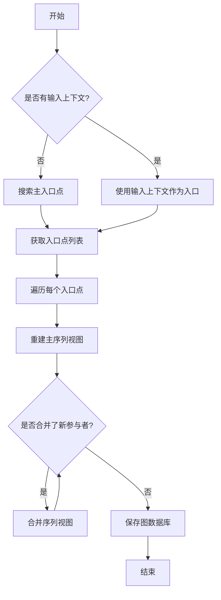

## 类结构

```
BaseModel (Pydantic基类)
├── ReverseUseCase
├── ReverseUseCaseDetails
└── Action (metagpt.actions.Action)
    └── RebuildSequenceView
```

## 全局变量及字段


### `ReverseUseCase.description`
    
A description of the reverse use case.

类型：`str`
    


### `ReverseUseCase.inputs`
    
List of inputs for the reverse use case.

类型：`List[str]`
    


### `ReverseUseCase.outputs`
    
List of outputs for the reverse use case.

类型：`List[str]`
    


### `ReverseUseCase.actors`
    
List of actors involved in the reverse use case.

类型：`List[str]`
    


### `ReverseUseCase.steps`
    
List of steps for the reverse use case.

类型：`List[str]`
    


### `ReverseUseCase.reason`
    
The reason behind the reverse use case.

类型：`str`
    


### `ReverseUseCaseDetails.description`
    
A description of the reverse use case details.

类型：`str`
    


### `ReverseUseCaseDetails.use_cases`
    
List of reverse use cases.

类型：`List[ReverseUseCase]`
    


### `ReverseUseCaseDetails.relationship`
    
List of relationships associated with the reverse use case details.

类型：`List[str]`
    


### `RebuildSequenceView.graph_db`
    
An optional instance of GraphRepository for graph database operations.

类型：`Optional[GraphRepository]`
    
    

## 全局函数及方法

### `RebuildSequenceView.run`

该方法作为`Action`基类的具体实现，负责通过逆向工程重构代码的序列图视图。它首先加载图数据库，然后查找代码的主入口点（或使用给定的上下文），为每个入口点重建主序列图，并迭代地合并新发现的参与者，直到没有新的参与者可添加为止，最后将更新后的图数据保存回数据库。

参数：

- `with_messages`：`Optional[Type]`，可选参数，指定要响应的消息，在此方法中未使用。
- `format`：`str`，提示词的模式格式，如果未提供则使用配置中的默认模式。

返回值：`None`，此方法不返回任何值，其主要作用是通过副作用更新图数据库。

#### 流程图

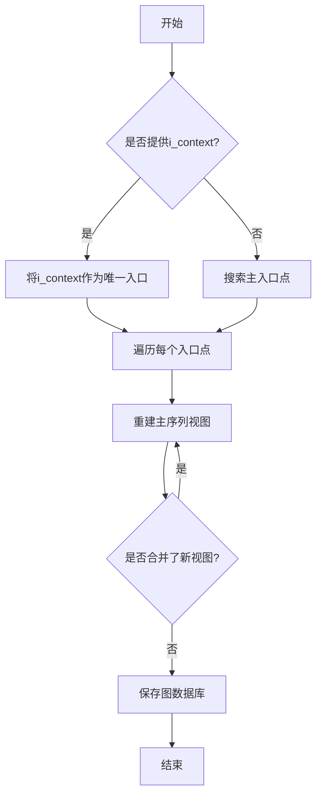

#### 带注释源码

```python
async def run(self, with_messages=None, format=None):
    """
    实现`Action`基类的`run`方法。
    核心流程：加载图数据库 -> 确定入口点 -> 为每个入口点重建并合并序列图 -> 保存结果。
    """
    # 1. 确定使用的提示词格式，默认为配置中的格式
    format = format if format else self.config.prompt_schema
    # 2. 构建图数据库文件的路径并加载图数据库
    graph_repo_pathname = self.context.git_repo.workdir / GRAPH_REPO_FILE_REPO / self.context.git_repo.workdir.name
    self.graph_db = await DiGraphRepository.load_from(str(graph_repo_pathname.with_suffix(".json")))
    
    # 3. 确定要处理的入口点列表
    if not self.i_context:
        # 如果没有提供特定上下文，则搜索所有标记为`__main__`的入口点
        entries = await self._search_main_entry()
    else:
        # 如果提供了上下文，则将其作为唯一的入口点
        entries = [SPO(subject=self.i_context, predicate="", object_="")]
    
    # 4. 遍历每个入口点，进行序列图重建和合并
    for entry in entries:
        # 4.1 为主入口点重建序列图
        await self._rebuild_main_sequence_view(entry)
        # 4.2 循环合并新发现的参与者，直到没有新的可合并项
        while await self._merge_sequence_view(entry):
            pass
    
    # 5. 所有处理完成后，将更新后的图数据保存到文件
    await self.graph_db.save()
```

### `RebuildSequenceView._rebuild_main_sequence_view`

该方法通过逆向工程为源代码的 `__main__` 入口点重建序列图。它首先从图数据库中检索与主入口点相关的类信息，然后为每个类重建用例，收集参与者信息，并组装包含用例、参与者、类视图和源代码的提示文本。接着，它调用大语言模型（LLM）生成Mermaid格式的序列图，并将结果保存回图数据库，同时记录版本信息和参与者关系。

参数：

- `entry`：`SPO`，图数据库中与 `__name__:__main__` 相关的SPO（主语、谓语、宾语）对象。

返回值：`None`，该方法不返回任何值，但会更新图数据库并保存生成的序列图。

#### 流程图

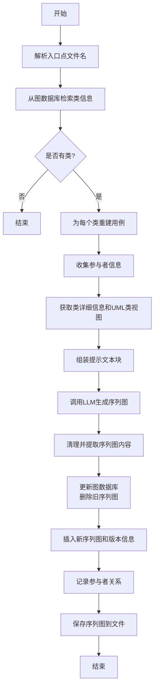

#### 带注释源码

```python
    @retry(
        wait=wait_random_exponential(min=1, max=20),
        stop=stop_after_attempt(6),
        after=general_after_log(logger),
    )
    async def _rebuild_main_sequence_view(self, entry: SPO):
        """
        通过逆向工程为源代码的 __main__ 入口点重建序列图。

        参数:
            entry (SPO): 图数据库中与主题 `__name__:__main__` 相关的SPO对象。
        """
        # 1. 从SPO对象中提取文件名
        filename = entry.subject.split(":", 1)[0]
        # 2. 从图数据库中查询所有标记为"类"的节点
        rows = await self.graph_db.select(predicate=GraphKeyword.IS, object_=GraphKeyword.CLASS)
        classes = []
        prefix = filename + ":"
        # 3. 筛选出属于当前文件的类
        for r in rows:
            if prefix in r.subject:
                classes.append(r)
                # 4. 为每个类异步重建用例
                await self._rebuild_use_case(r.subject)
        # 5. 搜索该文件中的所有参与者（类名）
        participants = await self._search_participants(split_namespace(entry.subject)[0])
        class_details = []
        class_views = []
        # 6. 遍历筛选出的类，获取其详细信息和UML类视图
        for c in classes:
            detail = await self._get_class_detail(c.subject)
            if not detail:
                continue
            class_details.append(detail)
            view = await self._get_uml_class_view(c.subject)
            if view:
                class_views.append(view)

            # 7. 获取每个类的参与者并更新总参与者集合
            actors = await self._get_participants(c.subject)
            participants.update(set(actors))

        # 8. 组装用例部分的提示文本
        use_case_blocks = []
        for c in classes:
            use_cases = await self._get_class_use_cases(c.subject)
            use_case_blocks.append(use_cases)
        prompt_blocks = ["## Use Cases\n" + "\n".join(use_case_blocks)]
        # 9. 组装参与者部分的提示文本
        block = "## Participants\n"
        for p in participants:
            block += f"- {p}\n"
        prompt_blocks.append(block)
        # 10. 组装Mermaid类视图部分的提示文本
        block = "## Mermaid Class Views\n```mermaid\n"
        block += "\n\n".join([c.get_mermaid() for c in class_views])
        block += "\n```\n"
        prompt_blocks.append(block)
        # 11. 组装源代码部分的提示文本
        block = "## Source Code\n```python\n"
        block += await self._get_source_code(filename)
        block += "\n```\n"
        prompt_blocks.append(block)
        # 12. 将所有提示文本块用分隔符连接
        prompt = "\n---\n".join(prompt_blocks)

        # 13. 调用大语言模型，请求其将提示文本翻译为Mermaid序列图
        rsp = await self.llm.aask(
            msg=prompt,
            system_msgs=[
                "You are a python code to Mermaid Sequence Diagram translator in function detail.",
                "Translate the given markdown text to a Mermaid Sequence Diagram.",
                "Return the merged Mermaid sequence diagram in a markdown code block format.",
            ],
            stream=False,
        )
        # 14. 清理LLM返回的响应，提取纯Mermaid代码
        sequence_view = rsp.removeprefix("```mermaid").removesuffix("```")
        # 15. 从图数据库中删除该入口点旧的序列图记录
        rows = await self.graph_db.select(subject=entry.subject, predicate=GraphKeyword.HAS_SEQUENCE_VIEW)
        for r in rows:
            if r.predicate == GraphKeyword.HAS_SEQUENCE_VIEW:
                await self.graph_db.delete(subject=r.subject, predicate=r.predicate, object_=r.object_)
        # 16. 将新生成的序列图插入图数据库
        await self.graph_db.insert(
            subject=entry.subject, predicate=GraphKeyword.HAS_SEQUENCE_VIEW, object_=sequence_view
        )
        # 17. 插入带有时间戳版本的序列图记录
        await self.graph_db.insert(
            subject=entry.subject,
            predicate=GraphKeyword.HAS_SEQUENCE_VIEW_VER,
            object_=concat_namespace(datetime.now().strftime("%Y%m%d%H%M%S%f")[:-3], add_affix(sequence_view)),
        )
        # 18. 记录该序列图的所有参与者（类）
        for c in classes:
            await self.graph_db.insert(
                subject=entry.subject, predicate=GraphKeyword.HAS_PARTICIPANT, object_=auto_namespace(c.subject)
            )
        # 19. 将序列图内容保存到文件系统中
        await self._save_sequence_view(subject=entry.subject, content=sequence_view)
```

### `RebuildSequenceView._merge_sequence_view`

该方法用于向给定的序列图条目（SPO对象）中合并新的参与者（participant）信息。它会检查是否存在尚未合并到主序列图中的新参与者，如果存在，则将该参与者的序列图信息合并到主序列图中，并更新图数据库中的相关记录。

参数：

- `entry`：`SPO`，表示图数据库中的一个关系条目，通常指向一个主序列图（如`__main__`入口点）。
- `self`：`RebuildSequenceView`，当前类的实例，用于访问图数据库和其他辅助方法。

返回值：`bool`，如果成功合并了新的参与者信息则返回`True`，否则返回`False`。

#### 流程图

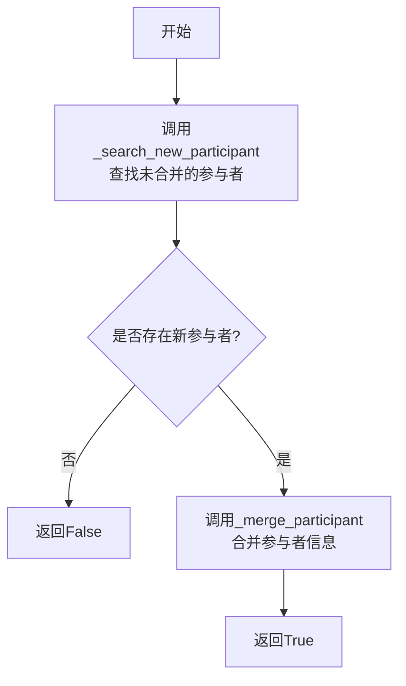

#### 带注释源码

```python
async def _merge_sequence_view(self, entry: SPO) -> bool:
    """
    向提供的SPO（Subject, Predicate, Object）条目中的序列图合并附加信息。

    该方法首先查找尚未合并到主序列图中的新参与者。如果找到新参与者，
    则调用_merge_participant方法将其序列图信息合并到主序列图中，
    并更新图数据库中的相关记录。

    Args:
        entry (SPO): 表示图数据库中关系的SPO对象。

    Returns:
        bool: 如果成功合并了附加信息则返回True，否则返回False。
    """
    # 1. 查找未合并的新参与者
    new_participant = await self._search_new_participant(entry)
    if not new_participant:
        # 如果没有找到新参与者，返回False
        return False

    # 2. 合并新参与者的序列图信息
    await self._merge_participant(entry, new_participant)
    # 合并成功，返回True
    return True
```

### `RebuildSequenceView._search_main_entry`

该方法用于异步搜索图数据库中与 `__name__:__main__` 相关的 SPO（Subject-Predicate-Object）条目，这些条目通常代表程序的入口点（如主模块或主函数）。它通过查询图数据库的 `HAS_PAGE_INFO` 谓词，筛选出包含 `__name__:__main__` 标签的条目，并返回这些条目的列表。

参数：
- 无显式参数（类方法，隐式包含 `self` 参数）

返回值：`List`，返回一个包含与 `__name__:__main__` 相关的 SPO 条目的列表。每个条目代表一个可能的程序入口点。

#### 流程图

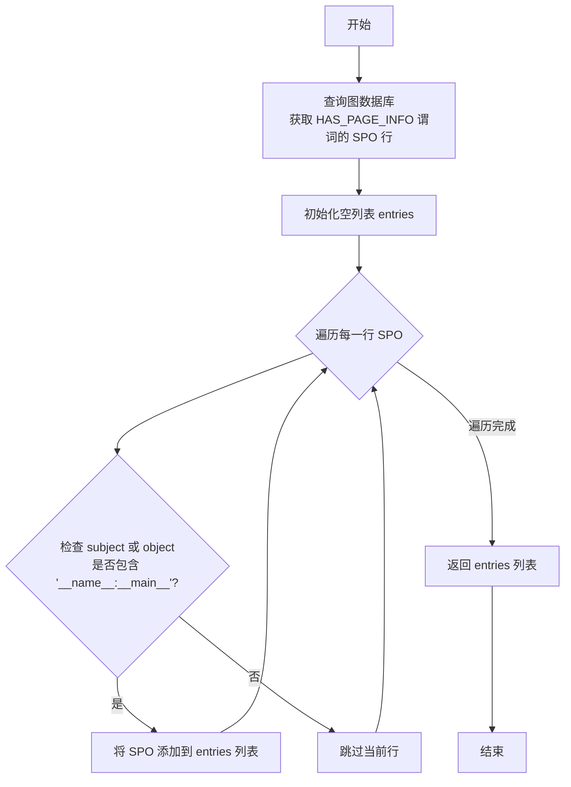

#### 带注释源码

```python
async def _search_main_entry(self) -> List:
    """
    异步搜索与 `__name__:__main__` 相关的 SPO 对象。

    该方法通过查询图数据库中所有带有 `HAS_PAGE_INFO` 谓词的 SPO 行，
    筛选出主题（subject）或对象（object）中包含 `__name__:__main__` 标签的条目。
    这些条目通常代表 Python 模块中的主程序入口点（即 `if __name__ == "__main__":` 部分）。

    返回:
        List: 包含与 `__name__:__main__` 相关的 SPO 条目的列表。
              每个条目是一个 SPO 对象，表示图数据库中的一个关系。
    """
    # 查询图数据库中所有谓词为 `HAS_PAGE_INFO` 的 SPO 行
    rows = await self.graph_db.select(predicate=GraphKeyword.HAS_PAGE_INFO)
    tag = "__name__:__main__"  # 定义搜索标签
    entries = []  # 初始化结果列表

    # 遍历查询结果
    for r in rows:
        # 检查当前 SPO 的主题或对象是否包含目标标签
        if tag in r.subject or tag in r.object_:
            entries.append(r)  # 如果包含，则添加到结果列表

    return entries  # 返回结果列表
```

### `RebuildSequenceView._rebuild_use_case`

该方法通过逆向工程为指定的命名空间前缀类名重建用例信息。它首先检查图数据库中是否已存在该类的用例信息，如果不存在，则通过LLM生成用例描述、输入、输出、参与者、步骤和原因等详细信息，并将结果保存到图数据库中。

参数：

- `ns_class_name`：`str`，命名空间前缀的类名，用于标识需要重建用例的类。

返回值：`None`，该方法不返回任何值，但会将生成的用例信息保存到图数据库中。

#### 流程图

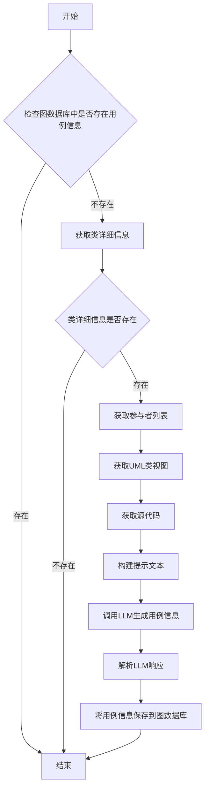

#### 带注释源码

```python
@retry(
    wait=wait_random_exponential(min=1, max=20),
    stop=stop_after_attempt(6),
    after=general_after_log(logger),
)
async def _rebuild_use_case(self, ns_class_name: str):
    """
    异步重建指定命名空间前缀类名的用例信息。

    参数：
        ns_class_name (str): 命名空间前缀的类名，用于标识需要重建用例的类。
    """
    # 检查图数据库中是否已存在该类的用例信息
    rows = await self.graph_db.select(subject=ns_class_name, predicate=GraphKeyword.HAS_CLASS_USE_CASE)
    if rows:
        return  # 如果已存在，直接返回

    # 获取类的详细信息
    detail = await self._get_class_detail(ns_class_name)
    if not detail:
        return  # 如果类详细信息不存在，直接返回

    # 获取参与者列表
    participants = set()
    participants.update(set(detail.compositions))
    participants.update(set(detail.aggregations))

    # 获取UML类视图
    class_view = await self._get_uml_class_view(ns_class_name)
    # 获取源代码
    source_code = await self._get_source_code(ns_class_name)

    # 构建提示文本
    prompt_blocks = []
    block = "## Participants\n"
    for p in participants:
        block += f"- {p}\n"
    prompt_blocks.append(block)
    block = "## Mermaid Class Views\n```mermaid\n"
    block += class_view.get_mermaid()
    block += "\n```\n"
    prompt_blocks.append(block)
    block = "## Source Code\n```python\n"
    block += source_code
    block += "\n```\n"
    prompt_blocks.append(block)
    prompt = "\n---\n".join(prompt_blocks)

    # 调用LLM生成用例信息
    rsp = await self.llm.aask(
        msg=prompt,
        system_msgs=[
            "You are a python code to UML 2.0 Use Case translator.",
            'The generated UML 2.0 Use Case must include the roles or entities listed in "Participants".',
            "The functional descriptions of Actors and Use Cases in the generated UML 2.0 Use Case must not "
            'conflict with the information in "Mermaid Class Views".',
            'The section under `if __name__ == "__main__":` of "Source Code" contains information about external '
            "system interactions with the internal system.",
            "Return a markdown JSON object with:\n"
            '- a "description" key to explain what the whole source code want to do;\n'
            '- a "use_cases" key list all use cases, each use case in the list should including a `description` '
            "key describes about what the use case to do, a `inputs` key lists the input names of the use case "
            "from external sources, a `outputs` key lists the output names of the use case to external sources, "
            "a `actors` key lists the participant actors of the use case, a `steps` key lists the steps about how "
            "the use case works step by step, a `reason` key explaining under what circumstances would the "
            "external system execute this use case.\n"
            '- a "relationship" key lists all the descriptions of relationship among these use cases.\n',
        ],
        stream=False,
    )

    # 解析LLM响应并保存用例信息到图数据库
    code_blocks = parse_json_code_block(rsp)
    for block in code_blocks:
        detail = ReverseUseCaseDetails.model_validate_json(block)
        await self.graph_db.insert(
            subject=ns_class_name, predicate=GraphKeyword.HAS_CLASS_USE_CASE, object_=detail.model_dump_json()
        )
```

### `RebuildSequenceView._rebuild_sequence_view`

该方法通过逆向工程为指定的命名空间前缀类名重建序列图。它首先调用 `_rebuild_use_case` 方法确保用例信息存在，然后收集用例、参与者、类视图和源代码等信息，构造提示词发送给大语言模型（LLM）生成 Mermaid 序列图，最后将生成的序列图存储到图数据库中。

参数：

- `ns_class_name`：`str`，命名空间前缀的类名，用于标识需要重建序列图的类。

返回值：`None`，该方法不返回任何值，其操作结果（生成的序列图）直接存储在图数据库中。

#### 流程图

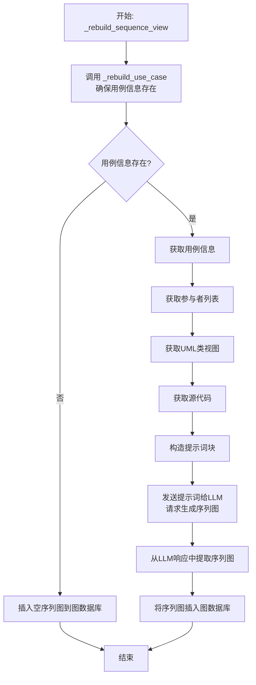

#### 带注释源码

```python
    @retry(
        wait=wait_random_exponential(min=1, max=20),
        stop=stop_after_attempt(6),
        after=general_after_log(logger),
    )
    async def _rebuild_sequence_view(self, ns_class_name: str):
        """
        Asynchronously reconstructs the sequence diagram for the provided namespace-prefixed class name.

        Args:
            ns_class_name (str): The namespace-prefixed class name for which the sequence diagram is to be reconstructed.
        """
        # 1. 确保目标类的用例信息已存在
        await self._rebuild_use_case(ns_class_name)

        # 2. 准备用于生成序列图的提示词块
        prompts_blocks = []
        # 2.1 获取并添加用例信息
        use_case_markdown = await self._get_class_use_cases(ns_class_name)
        if not use_case_markdown:  # 如果是外部类，没有用例信息
            # 插入一个空的序列图占位符
            await self.graph_db.insert(subject=ns_class_name, predicate=GraphKeyword.HAS_SEQUENCE_VIEW, object_="")
            return
        block = f"## Use Cases\n{use_case_markdown}"
        prompts_blocks.append(block)

        # 2.2 获取并添加参与者列表
        participants = await self._get_participants(ns_class_name)
        block = "## Participants\n" + "\n".join([f"- {s}" for s in participants])
        prompts_blocks.append(block)

        # 2.3 获取并添加UML类视图
        view = await self._get_uml_class_view(ns_class_name)
        block = "## Mermaid Class Views\n```mermaid\n"
        block += view.get_mermaid()
        block += "\n```\n"
        prompts_blocks.append(block)

        # 2.4 获取并添加源代码
        block = "## Source Code\n```python\n"
        block += await self._get_source_code(ns_class_name)
        block += "\n```\n"
        prompts_blocks.append(block)

        # 3. 组合所有提示词块
        prompt = "\n---\n".join(prompts_blocks)

        # 4. 调用大语言模型生成序列图
        rsp = await self.llm.aask(
            prompt,
            system_msgs=[
                "You are a Mermaid Sequence Diagram translator in function detail.",
                "Translate the markdown text to a Mermaid Sequence Diagram.",
                "Response must be concise.",
                "Return a markdown mermaid code block.",
            ],
            stream=False,
        )

        # 5. 处理LLM响应，提取Mermaid代码
        sequence_view = rsp.removeprefix("```mermaid").removesuffix("```")
        # 6. 将生成的序列图存储到图数据库中
        await self.graph_db.insert(
            subject=ns_class_name, predicate=GraphKeyword.HAS_SEQUENCE_VIEW, object_=sequence_view
        )
```

### `RebuildSequenceView._get_participants`

该方法用于异步获取指定命名空间前缀类名的序列图参与者列表。它通过查询类的详细信息（如组合和聚合关系）来收集参与者，并返回去重后的参与者名称列表。

参数：

- `ns_class_name`：`str`，命名空间前缀的类名，用于标识要获取参与者的类

返回值：`List[str]`，返回一个字符串列表，包含序列图中的参与者名称

#### 流程图

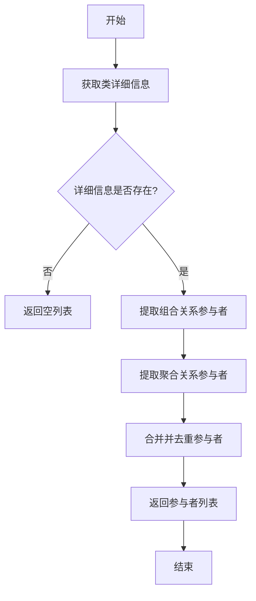

#### 带注释源码

```python
async def _get_participants(self, ns_class_name: str) -> List[str]:
    """
    异步返回指定命名空间前缀SPO对象的序列图参与者列表。

    该方法通过查询类的详细信息（包括组合和聚合关系）来收集参与者，
    并返回去重后的参与者名称列表。

    Args:
        ns_class_name (str): 命名空间前缀的类名，用于标识要获取参与者的类

    Returns:
        List[str]: 序列图中的参与者列表
    """
    # 初始化参与者集合
    participants = set()
    
    # 获取类的详细信息
    detail = await self._get_class_detail(ns_class_name)
    
    # 如果类详细信息不存在，返回空列表
    if not detail:
        return []
    
    # 添加组合关系中的参与者
    participants.update(set(detail.compositions))
    
    # 添加聚合关系中的参与者
    participants.update(set(detail.aggregations))
    
    # 将集合转换为列表并返回
    return list(participants)
```

### `RebuildSequenceView._get_class_use_cases`

该方法用于异步组装指定命名空间前缀类名的用例信息，从图数据库中检索已存储的用例详情，并将其格式化为结构化的Markdown文本。

参数：

- `ns_class_name`：`str`，命名空间前缀的类名，用于在图数据库中定位对应的用例信息

返回值：`str`，返回一个包含用例详细信息的Markdown格式字符串，包括用例描述、输入、输出、参与者和步骤等信息

#### 流程图

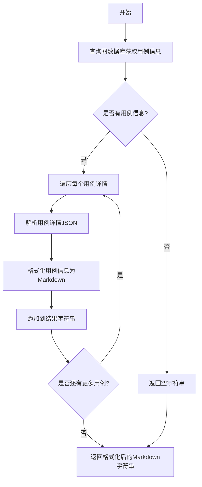

#### 带注释源码

```python
async def _get_class_use_cases(self, ns_class_name: str) -> str:
    """
    异步组装指定命名空间前缀类名的用例信息。

    该方法从图数据库中检索与给定类名关联的用例信息，并将这些信息格式化为结构化的Markdown文本。
    每个用例包括描述、输入、输出、参与者和步骤等详细信息。

    Args:
        ns_class_name (str): 命名空间前缀的类名，用于在图数据库中定位对应的用例信息。

    Returns:
        str: 返回一个包含用例详细信息的Markdown格式字符串。如果没有找到用例信息，则返回空字符串。
    """
    block = ""  # 初始化结果字符串
    # 从图数据库中查询指定类名的用例信息
    rows = await self.graph_db.select(subject=ns_class_name, predicate=GraphKeyword.HAS_CLASS_USE_CASE)
    # 遍历查询结果
    for i, r in enumerate(rows):
        # 将JSON格式的用例详情解析为ReverseUseCaseDetails对象
        detail = ReverseUseCaseDetails.model_validate_json(r.object_)
        # 添加用例描述标题
        block += f"\n### {i + 1}. {detail.description}"
        # 遍历每个用例的详细信息
        for j, use_case in enumerate(detail.use_cases):
            # 添加用例子标题
            block += f"\n#### {i + 1}.{j + 1}. {use_case.description}\n"
            # 添加输入信息
            block += "\n##### Inputs\n" + "\n".join([f"- {s}" for s in use_case.inputs])
            # 添加输出信息
            block += "\n##### Outputs\n" + "\n".join([f"- {s}" for s in use_case.outputs])
            # 添加参与者信息
            block += "\n##### Actors\n" + "\n".join([f"- {s}" for s in use_case.actors])
            # 添加步骤信息
            block += "\n##### Steps\n" + "\n".join([f"- {s}" for s in use_case.steps])
        # 添加用例关系信息
        block += "\n#### Use Case Relationship\n" + "\n".join([f"- {s}" for s in detail.relationship])
    # 返回格式化后的Markdown字符串
    return block + "\n"
```

### `RebuildSequenceView._get_class_detail`

该方法用于异步获取指定命名空间前缀类名的点格式类详细信息。它通过查询图数据库获取类的详细信息，并返回一个`DotClassInfo`对象，如果信息不存在则返回`None`。

参数：

- `ns_class_name`：`str`，命名空间前缀的类名，用于在图数据库中查询对应的类详细信息。

返回值：`Union[DotClassInfo, None]`，返回一个`DotClassInfo`对象，表示类的点格式详细信息；如果数据库中不存在该信息，则返回`None`。

#### 流程图

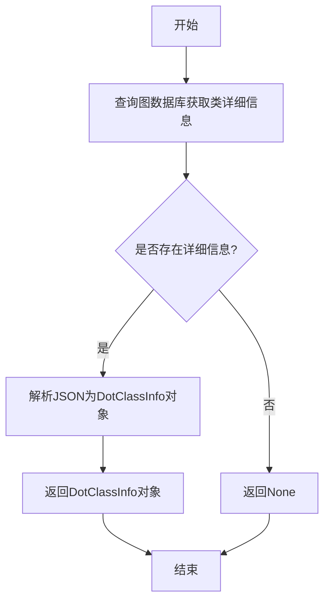

#### 带注释源码

```python
async def _get_class_detail(self, ns_class_name: str) -> DotClassInfo | None:
    """
    异步获取指定命名空间前缀类名的点格式类详细信息。

    该方法通过查询图数据库获取类的详细信息，并返回一个`DotClassInfo`对象。
    如果数据库中不存在该信息，则返回`None`。

    Args:
        ns_class_name (str): 命名空间前缀的类名，用于在图数据库中查询对应的类详细信息。

    Returns:
        Union[DotClassInfo, None]: 返回一个`DotClassInfo`对象，表示类的点格式详细信息；
                                   如果数据库中不存在该信息，则返回`None`。
    """
    # 查询图数据库，获取指定类名的详细信息
    rows = await self.graph_db.select(subject=ns_class_name, predicate=GraphKeyword.HAS_DETAIL)
    # 如果查询结果为空，返回None
    if not rows:
        return None
    # 将查询结果中的JSON字符串解析为DotClassInfo对象
    dot_class_info = DotClassInfo.model_validate_json(rows[0].object_)
    # 返回解析后的DotClassInfo对象
    return dot_class_info
```

### `RebuildSequenceView._get_uml_class_view`

该方法用于异步获取指定命名空间前缀类名的UML 2.0格式类视图信息。它通过查询图数据库，检索与给定类名关联的UML类视图数据，并将其反序列化为`UMLClassView`对象返回。如果未找到相关数据，则返回`None`。

参数：

- `ns_class_name`：`str`，命名空间前缀的类名，用于在图数据库中定位对应的UML类视图信息。

返回值：`UMLClassView | None`，如果找到对应的UML类视图，则返回`UMLClassView`对象；否则返回`None`。

#### 流程图

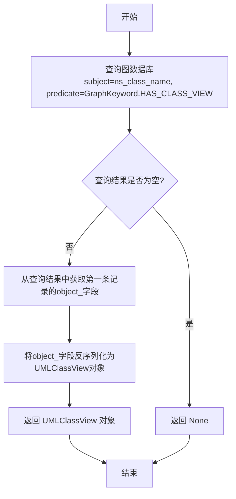

#### 带注释源码

```python
async def _get_uml_class_view(self, ns_class_name: str) -> UMLClassView | None:
    """
    异步检索命名空间前缀SPO对象的UML 2.0格式类详细信息。

    参数:
        ns_class_name (str): 要检索UML类详细信息的命名空间前缀类名。

    返回:
        Union[UMLClassView, None]: 表示UML 2.0格式类详细信息的UMLClassView对象，
                                   如果详细信息不可用，则返回None。
    """
    # 1. 查询图数据库，查找与给定类名关联且谓词为HAS_CLASS_VIEW的记录
    rows = await self.graph_db.select(subject=ns_class_name, predicate=GraphKeyword.HAS_CLASS_VIEW)
    
    # 2. 检查查询结果是否为空
    if not rows:
        # 如果没有找到相关记录，返回None
        return None
    
    # 3. 将查询结果中的第一条记录的object_字段（JSON字符串）反序列化为UMLClassView对象
    class_view = UMLClassView.model_validate_json(rows[0].object_)
    
    # 4. 返回反序列化后的UMLClassView对象
    return class_view
```

### `RebuildSequenceView._get_source_code`

该方法用于异步获取指定命名空间前缀类名的源代码。首先尝试从图数据库中查询该类的页面信息，如果存在则读取对应的代码块；如果不存在，则根据文件名在文件系统中查找并读取整个文件。

参数：

- `ns_class_name`：`str`，命名空间前缀的类名，用于标识要获取源代码的类

返回值：`str`，返回指定类的源代码字符串

#### 流程图

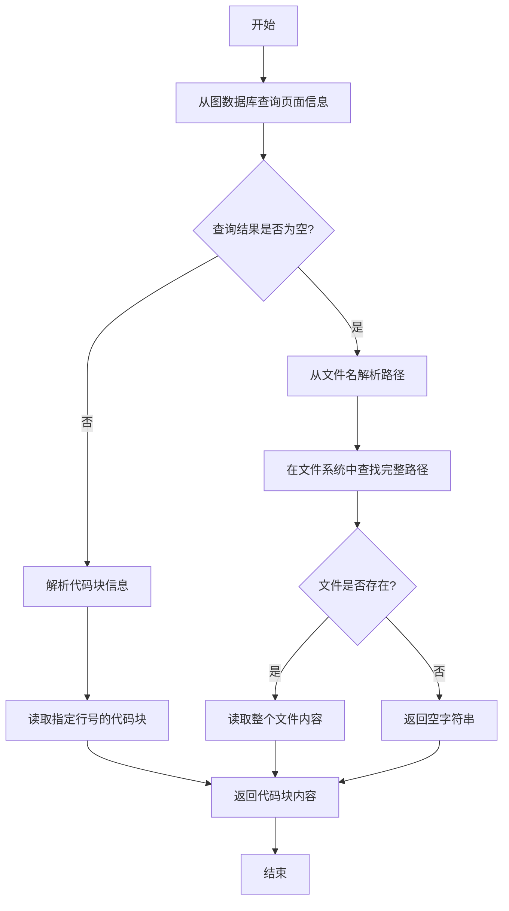

#### 带注释源码

```python
async def _get_source_code(self, ns_class_name: str) -> str:
    """
    异步获取指定命名空间前缀类名的源代码。
    
    首先尝试从图数据库中查询该类的页面信息（HAS_PAGE_INFO关系），
    如果存在则使用代码块信息读取文件中的特定代码块。
    如果不存在页面信息，则根据类名解析出文件名，在文件系统中查找并读取整个文件。
    
    Args:
        ns_class_name (str): 命名空间前缀的类名，格式通常为"文件名:类名"
    
    Returns:
        str: 指定类的源代码字符串，如果找不到文件则返回空字符串
    """
    # 从图数据库查询该类的页面信息
    rows = await self.graph_db.select(subject=ns_class_name, predicate=GraphKeyword.HAS_PAGE_INFO)
    
    # 从类名中解析出文件名部分（去掉命名空间前缀）
    filename = split_namespace(ns_class_name=ns_class_name)[0]
    
    # 如果没有查询到页面信息
    if not rows:
        # 获取文件的完整路径
        src_filename = RebuildSequenceView.get_full_filename(root=self.i_context, pathname=filename)
        
        # 如果找不到文件，返回空字符串
        if not src_filename:
            return ""
        
        # 读取整个文件内容
        return await aread(filename=src_filename, encoding="utf-8")
    
    # 如果有页面信息，解析代码块信息
    code_block_info = CodeBlockInfo.model_validate_json(rows[0].object_)
    
    # 读取文件中指定行号范围的代码块
    return await read_file_block(
        filename=filename, 
        lineno=code_block_info.lineno, 
        end_lineno=code_block_info.end_lineno
    )
```

### `RebuildSequenceView.get_full_filename`

该方法是一个静态方法，用于将给定的包名或模块名转换为模块的完整文件路径。它通过在一个根目录下搜索匹配指定路径后缀的文件来实现。如果路径名已经是绝对路径，则直接返回；否则，在根目录下的所有文件中查找以指定路径名结尾的文件，并返回第一个匹配的文件路径。如果未找到匹配的文件，则返回 `None`。

参数：

- `root`：`Union[str, Path]`，表示包或模块的根目录路径。
- `pathname`：`Union[str, Path]`，表示模块的相对路径或包名。

返回值：`Union[Path, None]`，返回模块的完整文件路径，如果无法确定路径则返回 `None`。

#### 流程图

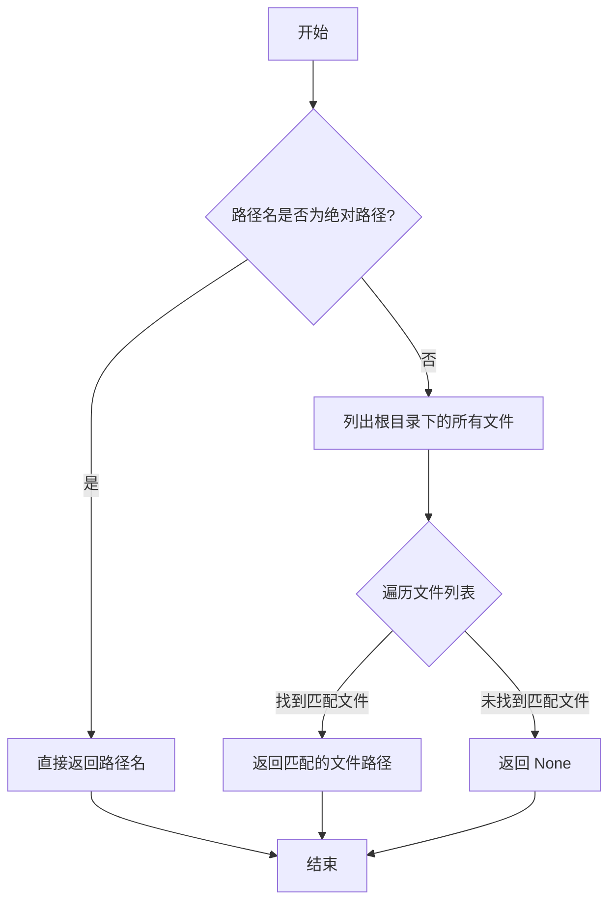

#### 带注释源码

```python
@staticmethod
def get_full_filename(root: str | Path, pathname: str | Path) -> Path | None:
    """
    Convert package name to the full path of the module.

    Args:
        root (Union[str, Path]): The root path or string representing the package.
        pathname (Union[str, Path]): The pathname or string representing the module.

    Returns:
        Union[Path, None]: The full path of the module, or None if the path cannot be determined.

    Examples:
        If `root`(workdir) is "/User/xxx/github/MetaGPT/metagpt", and the `pathname` is
        "metagpt/management/skill_manager.py", then the returned value will be
        "/User/xxx/github/MetaGPT/metagpt/management/skill_manager.py"
    """
    # 检查路径名是否为绝对路径
    if re.match(r"^/.+", str(pathname)):
        return pathname
    # 列出根目录下的所有文件
    files = list_files(root=root)
    # 构建要匹配的后缀
    postfix = "/" + str(pathname)
    # 遍历文件列表，查找匹配的文件
    for i in files:
        if str(i).endswith(postfix):
            return i
    # 如果未找到匹配的文件，返回 None
    return None
```

### `RebuildSequenceView.parse_participant`

该方法用于解析给定的Mermaid序列图字符串，提取并返回所有参与者的名称列表。

参数：

- `mermaid_sequence_diagram`：`str`，需要解析的Mermaid序列图字符串。

返回值：`List[str]`，从序列图中提取出的参与者名称列表。

#### 流程图

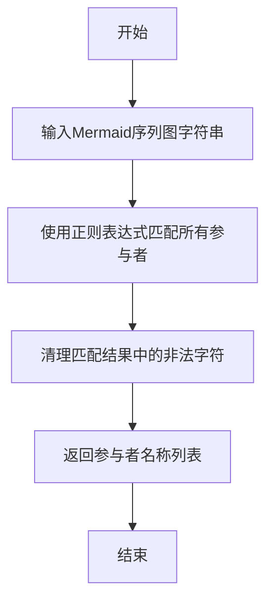

#### 带注释源码

```python
@staticmethod
def parse_participant(mermaid_sequence_diagram: str) -> List[str]:
    """
    解析给定的Mermaid序列图字符串，提取并返回所有参与者的名称列表。

    参数:
        mermaid_sequence_diagram (str): 需要解析的Mermaid序列图字符串。

    返回:
        List[str]: 从序列图中提取出的参与者名称列表。
    """
    # 定义正则表达式模式，用于匹配以"participant "开头的参与者声明
    pattern = r"participant ([\w\.]+)"
    # 使用正则表达式查找所有匹配项
    matches = re.findall(pattern, mermaid_sequence_diagram)
    # 清理匹配结果中的非法字符（如反斜杠、斜杠、单引号、双引号）
    matches = [re.sub(r"[\\/'\"]+", "", i) for i in matches]
    # 返回清理后的参与者名称列表
    return matches
```

### `RebuildSequenceView._search_new_participant`

该方法用于在给定的入口（entry）的序列图中查找尚未被合并（augmented）的参与者。它通过比较已合并的参与者列表与序列图中声明的参与者列表，找出尚未被处理的参与者。

参数：

- `entry`：`SPO`，表示图数据库中的关系对象，包含主序列图的信息。

返回值：`Union[str, None]`，返回一个尚未被合并的参与者名称，如果所有参与者都已合并则返回`None`。

#### 流程图

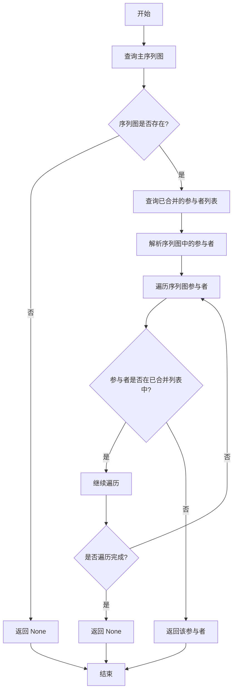

#### 带注释源码

```python
async def _search_new_participant(self, entry: SPO) -> str | None:
    """
    异步检索尚未被合并的参与者。

    该方法首先查询给定入口（entry）的主序列图，然后获取已合并的参与者列表。
    接着解析序列图中的参与者，并遍历这些参与者，找出尚未出现在已合并列表中的参与者。

    Args:
        entry (SPO): 表示图数据库中关系的SPO对象，包含主序列图的信息。

    Returns:
        Union[str, None]: 返回一个尚未被合并的参与者名称，如果所有参与者都已合并则返回None。
    """
    # 查询主序列图
    rows = await self.graph_db.select(subject=entry.subject, predicate=GraphKeyword.HAS_SEQUENCE_VIEW)
    if not rows:
        return None  # 如果没有序列图，直接返回None
    sequence_view = rows[0].object_  # 获取序列图内容

    # 查询已合并的参与者列表
    rows = await self.graph_db.select(subject=entry.subject, predicate=GraphKeyword.HAS_PARTICIPANT)
    merged_participants = []
    for r in rows:
        name = split_namespace(r.object_)[-1]  # 提取参与者名称（去除命名空间）
        merged_participants.append(name)

    # 解析序列图中的参与者
    participants = self.parse_participant(sequence_view)

    # 遍历序列图中的参与者，找出尚未合并的参与者
    for p in participants:
        if p in merged_participants:
            continue  # 如果参与者已在合并列表中，跳过
        return p  # 返回尚未合并的参与者

    return None  # 如果所有参与者都已合并，返回None
```

### `RebuildSequenceView._merge_participant`

该方法用于将指定类名的序列图合并到主入口的序列图中。它会先检查类名对应的参与者是否存在，如果存在则获取其序列图，然后通过LLM将两个序列图合并，更新主入口的序列图，并记录合并后的版本和参与者信息。

参数：

- `entry`：`SPO`，表示主入口序列图的SPO对象，包含主入口的标识信息。
- `class_name`：`str`，表示要合并的类名，其序列图将被合并到主入口序列图中。

返回值：`None`，该方法没有返回值，但会更新图数据库中的序列图信息和参与者关系。

#### 流程图

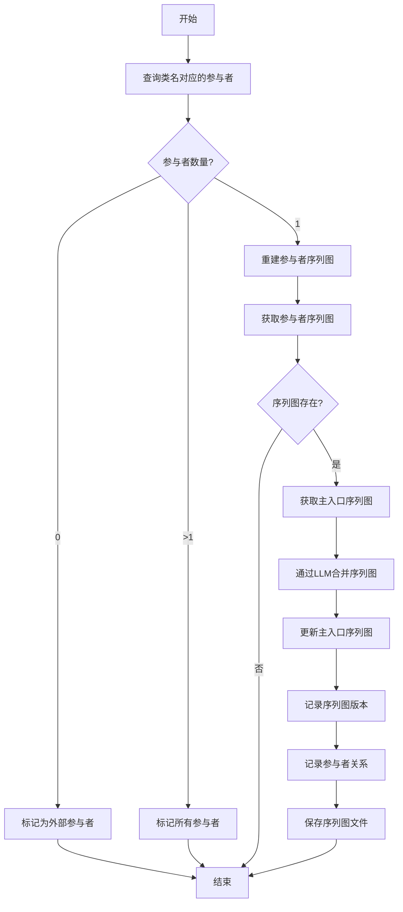

#### 带注释源码

```python
@retry(
    wait=wait_random_exponential(min=1, max=20),
    stop=stop_after_attempt(6),
    after=general_after_log(logger),
)
async def _merge_participant(self, entry: SPO, class_name: str):
    """
    将 `class_name` 的序列图合并到 `entry` 的序列图中。

    参数:
        entry (SPO): 表示基础序列图的SPO对象。
        class_name (str): 要合并其序列图的类名。
    """
    # 查询所有类节点
    rows = await self.graph_db.select(predicate=GraphKeyword.IS, object_=GraphKeyword.CLASS)
    participants = []
    for r in rows:
        name = split_namespace(r.subject)[-1]
        if name == class_name:
            participants.append(r)
    # 如果没有找到参与者，标记为外部参与者
    if len(participants) == 0:  # external participants
        await self.graph_db.insert(
            subject=entry.subject, predicate=GraphKeyword.HAS_PARTICIPANT, object_=concat_namespace("?", class_name)
        )
        return
    # 如果找到多个同名参与者，全部标记
    if len(participants) > 1:
        for r in participants:
            await self.graph_db.insert(
                subject=entry.subject, predicate=GraphKeyword.HAS_PARTICIPANT, object_=auto_namespace(r.subject)
            )
        return

    # 只有一个参与者，获取其序列图
    participant = participants[0]
    await self._rebuild_sequence_view(participant.subject)
    sequence_views = await self.graph_db.select(
        subject=participant.subject, predicate=GraphKeyword.HAS_SEQUENCE_VIEW
    )
    if not sequence_views:  # external class
        return
    # 获取主入口的序列图
    rows = await self.graph_db.select(subject=entry.subject, predicate=GraphKeyword.HAS_SEQUENCE_VIEW)
    # 构建合并提示
    prompt = f"```mermaid\n{sequence_views[0].object_}\n```\n---\n```mermaid\n{rows[0].object_}\n```"

    # 调用LLM合并序列图
    rsp = await self.llm.aask(
        prompt,
        system_msgs=[
            "You are a tool to merge sequence diagrams into one.",
            "Participants with the same name are considered identical.",
            "Return the merged Mermaid sequence diagram in a markdown code block format.",
        ],
        stream=False,
    )

    # 提取合并后的序列图
    sequence_view = rsp.removeprefix("```mermaid").removesuffix("```")
    # 删除旧的序列图记录
    rows = await self.graph_db.select(subject=entry.subject, predicate=GraphKeyword.HAS_SEQUENCE_VIEW)
    for r in rows:
        await self.graph_db.delete(subject=r.subject, predicate=r.predicate, object_=r.object_)
    # 插入新的序列图
    await self.graph_db.insert(
        subject=entry.subject, predicate=GraphKeyword.HAS_SEQUENCE_VIEW, object_=sequence_view
    )
    # 记录序列图版本
    await self.graph_db.insert(
        subject=entry.subject,
        predicate=GraphKeyword.HAS_SEQUENCE_VIEW_VER,
        object_=concat_namespace(datetime.now().strftime("%Y%m%d%H%M%S%f")[:-3], add_affix(sequence_view)),
    )
    # 记录参与者关系
    await self.graph_db.insert(
        subject=entry.subject, predicate=GraphKeyword.HAS_PARTICIPANT, object_=auto_namespace(participant.subject)
    )
    # 保存序列图到文件
    await self._save_sequence_view(subject=entry.subject, content=sequence_view)
```

### `RebuildSequenceView._save_sequence_view`

该方法负责将生成的序列图内容保存到文件系统中。它接收一个主题字符串和序列图内容，通过正则表达式清理主题字符串以生成安全的文件名，然后将内容保存为 `.sequence_diagram.mmd` 格式的文件。

参数：
- `subject`：`str`，表示序列图关联的主题或标识符，用于生成文件名。
- `content`：`str`，表示要保存的 Mermaid 序列图内容。

返回值：`None`，该方法不返回任何值。

#### 流程图

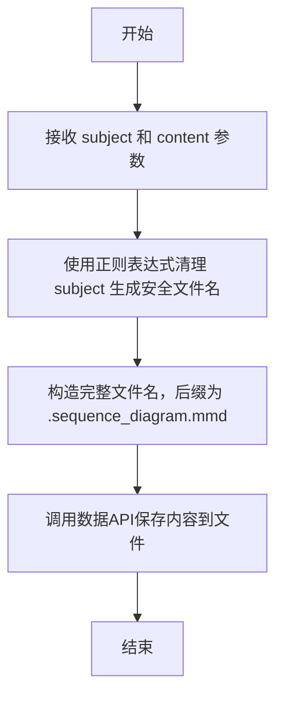

#### 带注释源码

```python
async def _save_sequence_view(self, subject: str, content: str):
    # 使用正则表达式将 subject 中的非字母数字字符替换为下划线，生成安全的文件名
    pattern = re.compile(r"[^a-zA-Z0-9]")
    name = re.sub(pattern, "_", subject)
    # 构造完整的文件名，后缀为 .sequence_diagram.mmd
    filename = Path(name).with_suffix(".sequence_diagram.mmd")
    # 通过上下文的数据API将序列图内容保存到指定文件
    await self.context.repo.resources.data_api_design.save(filename=str(filename), content=content)
```

### `RebuildSequenceView._search_participants`

该方法通过分析给定源文件的内容，使用大语言模型（LLM）识别文件中使用的所有类名，并返回这些类名的集合。它主要用于在重构序列图时，确定可能参与交互的类。

参数：

- `filename`：`str`，源文件的路径或名称，用于获取文件内容并分析其中使用的类名。

返回值：`Set`，包含源文件中使用的所有类名的集合。

#### 流程图

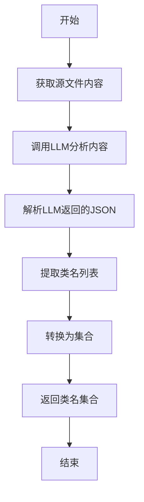

#### 带注释源码

```python
async def _search_participants(self, filename: str) -> Set:
    # 获取源文件的内容
    content = await self._get_source_code(filename)

    # 调用大语言模型（LLM）分析源文件内容，识别其中使用的类名
    rsp = await self.llm.aask(
        msg=content,
        system_msgs=[
            "You are a tool for listing all class names used in a source file.",
            "Return a markdown JSON object with: "
            '- a "class_names" key containing the list of class names used in the file; '
            '- a "reasons" key lists all reason objects, each object containing a "class_name" key for class name, a "reference" key explaining the line where the class has been used.',
        ],
    )

    # 定义用于解析LLM返回数据的内部数据模型
    class _Data(BaseModel):
        class_names: List[str]
        reasons: List

    # 解析LLM返回的JSON代码块
    json_blocks = parse_json_code_block(rsp)
    # 将JSON数据反序列化为_Data对象
    data = _Data.model_validate_json(json_blocks[0])
    # 将类名列表转换为集合并返回
    return set(data.class_names)
```

## 关键组件

### 图数据库交互组件

用于存储和查询代码的结构化信息（如类、方法、关系、用例、序列图），是逆向工程和视图重建的核心数据源。通过`GraphRepository`及其子类`DiGraphRepository`实现，支持插入、删除、查询等操作，并定义了标准谓词（如`GraphKeyword.IS`、`GraphKeyword.HAS_SEQUENCE_VIEW`）来描述实体间的关系。

### 逆向用例建模组件

通过分析源代码和已有的类图信息，利用大语言模型（LLM）自动生成UML用例图描述。该组件定义了`ReverseUseCase`和`ReverseUseCaseDetails`数据模型来结构化存储用例信息，并通过`_rebuild_use_case`方法驱动生成过程，将结果存储回图数据库。

### 序列图重建与合并组件

负责从代码的入口点（如`__main__`）开始，递归地重建和合并Mermaid格式的序列图。它通过`_rebuild_main_sequence_view`方法生成主序列图，并利用`_merge_sequence_view`和`_merge_participant`方法发现并整合新参与者的序列图，最终生成一个完整的、描述系统交互流程的序列图。

### 代码信息提取与组装组件

提供从图数据库和源代码文件中提取各类信息（如类详情、UML类视图、源代码块、参与者列表）的工具方法。这些方法（如`_get_class_detail`、`_get_uml_class_view`、`_get_source_code`）为用例重建和序列图生成提供了必要的数据输入。

### 大语言模型（LLM）驱动翻译与生成组件

作为整个逆向工程过程的“智能引擎”，将提取的代码信息、类图、用例描述等上下文信息，通过精心设计的系统提示词（System Prompt），引导LLM完成从代码到UML用例图、从代码到序列图、以及序列图合并等翻译和生成任务。这是实现自动化设计文档重建的关键。

## 问题及建议

### 已知问题

1.  **硬编码的图数据库路径**：`run` 方法中构建 `graph_repo_pathname` 时，直接拼接了 `GRAPH_REPO_FILE_REPO` 和 `self.context.git_repo.workdir.name`。这假设了图数据库的存储结构和命名规则是固定的，缺乏灵活性。如果存储策略发生变化，代码需要多处修改。
2.  **潜在的无限循环风险**：`run` 方法中的 `while await self._merge_sequence_view(entry): pass` 循环依赖 `_merge_sequence_view` 返回 `False` 来终止。如果 `_merge_sequence_view` 的逻辑存在缺陷（例如，在特定条件下总是返回 `True`），可能导致无限循环。
3.  **重复的 LLM 调用与重试逻辑**：多个方法（如 `_rebuild_main_sequence_view`, `_rebuild_use_case`, `_rebuild_sequence_view`, `_merge_participant`）都使用了相同的 `@retry` 装饰器进行 LLM 调用。这种重复不仅增加了代码量，也使得统一调整重试策略（如等待时间、重试次数）变得困难。
4.  **错误处理不完善**：代码中多处对可能返回 `None` 的方法（如 `_get_class_detail`, `_get_uml_class_view`）进行了调用，但后续处理有时只是跳过（`continue`），缺乏更细致的错误记录或恢复机制。例如，在 `_rebuild_main_sequence_view` 中，如果 `_get_class_detail` 返回 `None`，该类将被跳过，但用户可能不知道具体跳过了哪些类以及原因。
5.  **静态方法 `get_full_filename` 的效率问题**：该方法通过遍历 `list_files(root)` 返回的列表来查找匹配 `postfix` 的文件。如果项目文件很多，这种线性查找可能成为性能瓶颈。此外，它被设计为静态方法，但逻辑上依赖于实例状态（`self.i_context` 作为 `root` 传入），设计上略显矛盾。
6.  **字符串处理逻辑可能不健壮**：在 `_rebuild_main_sequence_view` 和 `_merge_participant` 等方法中，使用 `rsp.removeprefix("```mermaid").removesuffix("```")` 来提取 Mermaid 代码。这假设 LLM 的响应严格遵循该格式。如果响应格式稍有变化（如多余的空格、使用其他标记），可能导致提取错误。
7.  **`_search_participants` 方法的职责模糊**：该方法通过 LLM 分析源代码来提取类名，但其名称 `_search_participants` 与 `_get_participants`（从图数据库获取组合/聚合关系）容易混淆。它更像是“从源码静态分析类引用”，而非通用的“搜索参与者”。

### 优化建议

1.  **解耦图数据库路径配置**：将图数据库的存储路径和命名规则抽象为可配置项（例如，通过 `self.config` 注入），而不是硬编码在业务逻辑中。这提高了代码的灵活性和可测试性。
2.  **为循环添加安全机制**：在 `run` 方法的 `while` 循环中，可以添加一个最大迭代次数限制（例如，`max_merges=10`），以防止因逻辑错误导致的无限循环。
3.  **抽象并集中管理 LLM 调用与重试逻辑**：创建一个专门的 `LLMClient` 或类似的服务类，封装带有重试、日志和错误处理的 LLM 调用。业务方法（如 `_rebuild_use_case`）只需关注 prompt 构建和结果解析，将网络交互和重试策略委托给该服务。这符合单一职责原则，便于维护和监控。
4.  **增强错误处理与日志记录**：对可能失败的操作（如图数据库查询、文件读取、LLM 调用）进行更细致的异常捕获和日志记录。例如，当 `_get_class_detail` 返回 `None` 时，可以记录一条警告日志，说明是哪个类缺失了详细信息。考虑定义自定义异常类型来区分不同类型的错误。
5.  **优化 `get_full_filename` 方法**：可以预先构建一个从模块路径到文件系统路径的映射（缓存），避免每次调用都进行全量文件遍历。如果无法缓存，至少应使用更高效的数据结构（如字典）进行查找。同时，考虑将其改为实例方法或接收必要参数的普通函数，以消除设计上的歧义。
6.  **使用更健壮的 Markdown/代码块解析器**：替换简单的 `removeprefix/removesuffix` 字符串操作，使用一个专门的工具函数或库来解析 Markdown 中的代码块。这可以处理更复杂的格式变化，提高代码的鲁棒性。
7.  **重构并重命名 `_search_participants` 方法**：考虑将其重命名为 `_extract_class_references_from_source` 或类似名称，以更准确地反映其功能。同时，评估是否可以将这部分静态分析功能提前（例如，在代码解析入库阶段完成），避免在序列图重建时进行昂贵的 LLM 调用。
8.  **引入缓存机制**：对于频繁查询且不常变化的数据，如类详情 (`_get_class_detail`)、UML视图 (`_get_uml_class_view`)，可以考虑在内存或磁盘中引入缓存层，以减少对图数据库的重复查询，提升性能。
9.  **代码结构优化**：`_rebuild_sequence_view` 方法目前仅调用了 `_rebuild_use_case`，然后直接返回。如果其功能尚未完全实现或与其他方法（如 `_rebuild_main_sequence_view`）有重叠，应考虑重构，消除冗余或明确其职责。将一些通用的步骤（如构建包含参与者、类视图、源码的提示块）抽取为辅助方法，以减少代码重复。

## 其它


### 设计目标与约束

本模块的核心设计目标是通过逆向工程，从已有的代码仓库和知识图谱中，重构出描述系统关键交互流程的序列图。主要约束包括：1) 输入为已通过静态分析生成的、存储于图数据库中的代码结构信息（如类、方法、关系）；2) 依赖大语言模型（LLM）进行语义理解和图表生成，因此其输出质量受限于LLM的能力和提示词（Prompt）的设计；3) 作为自动化流程的一部分，需要在可接受的时间范围内完成对代码库的分析和视图重建。

### 错误处理与异常设计

模块中的错误处理主要采用以下策略：1) **重试机制**：对于关键且可能因瞬时问题（如网络波动、LLM服务不稳定）失败的操作（如 `_rebuild_main_sequence_view`, `_rebuild_use_case`），使用 `tenacity` 库实现了指数退避的重试逻辑。2) **空值检查**：在链式调用中（如 `_get_class_detail`, `_get_uml_class_view`），对可能返回 `None` 的方法结果进行显式检查，避免后续操作因空值而崩溃。3) **静默处理**：对于某些非致命性错误，如未找到对应的源码文件（`get_full_filename` 返回 `None`）或未找到类详情，相关方法会返回空值或空列表，由调用方决定后续流程（通常是跳过）。目前缺乏集中式的异常日志记录和更细粒度的错误分类。

### 数据流与状态机

1.  **主数据流**：
    *   **输入**：图数据库（`GraphRepository`）中存储的代码元素（SPO三元组）和可选的上下文入口（`i_context`）。
    *   **处理**：
        a. 定位入口点（`__main__` 或指定上下文）。
        b. 为入口点及相关的类重建用例描述（`ReverseUseCaseDetails`）。
        c. 聚合参与者、类视图、源码等信息，构造Prompt，调用LLM生成主序列图。
        d. 循环查找并合并新发现的参与者（`_merge_sequence_view`），直至没有新参与者，实现序列图的逐步完善。
    *   **输出**：更新图数据库（插入 `HAS_SEQUENCE_VIEW` 等关系），并将最终生成的Mermaid序列图内容保存至资源仓库。
2.  **状态机（简化）**：
    *   **初始状态**：加载图数据库，确定入口点。
    *   **重建状态**：为入口点生成初始序列图。
    *   **合并循环状态**：检查并合并新参与者，每合并一次，序列图被更新。此状态循环直至无新参与者。
    *   **完成状态**：保存所有更新到图数据库和文件系统。

### 外部依赖与接口契约

1.  **外部依赖**：
    *   **`metagpt.utils.graph_repository.GraphRepository`**：抽象的数据访问接口，用于查询和持久化代码知识图谱。本模块依赖其 `select`, `insert`, `delete` 等方法。
    *   **`metagpt.llm` (通过 `self.llm.aask`)**：大语言模型服务接口，是序列图和用例生成的核心依赖。
    *   **`metagpt.utils.common`**：提供一系列工具函数，如文件读取（`aread`）、命名空间处理（`concat_namespace`, `split_namespace`）、JSON解析（`parse_json_code_block`）等。
    *   **`metagpt.context.repo.resources.data_api_design`**：资源存储接口，用于保存生成的序列图文件。
2.  **接口契约**：
    *   **`Action.run()`**：作为 `Action` 子类，必须实现此方法，它是模块执行的统一入口。
    *   **`GraphKeyword`**：定义了与图数据库交互时使用的标准谓词词汇（如 `IS`, `HAS_SEQUENCE_VIEW`, `HAS_CLASS_USE_CASE`），模块假设这些关键词已在图数据库中使用并具有特定语义。
    *   **LLM Prompt 契约**：模块向LLM发送的Prompt具有特定的结构（包含“## Use Cases”、“## Participants”等章节），并期望LLM返回特定格式的响应（如Markdown代码块包裹的Mermaid图或JSON）。这是一个隐含的、脆弱的契约。

### 安全与合规考虑

1.  **数据安全**：模块会读取代码文件内容并将其作为Prompt的一部分发送给外部LLM服务。这可能导致敏感信息（如内部API密钥、硬编码密码、专有算法）泄露。当前实现未对源码内容进行过滤或脱敏处理。
2.  **模型输出合规**：依赖LLM生成图表和描述，可能存在生成内容不准确、包含偏见或不符合内部规范的风险。模块没有对LLM输出进行有效性校验或内容审核的环节。
3.  **依赖库安全**：使用了 `tenacity`, `pydantic` 等第三方库，需要确保这些依赖的版本没有已知的安全漏洞。

### 测试策略建议

1.  **单元测试**：
    *   **工具函数**：测试 `parse_participant`、`get_full_filename` 等静态方法的正确性。
    *   **数据解析**：测试从图数据库查询结果到 `DotClassInfo`、`UMLClassView`、`ReverseUseCaseDetails` 等Pydantic模型的解析逻辑。
    *   **参与者搜索与合并逻辑**：模拟图数据库状态，测试 `_search_new_participant` 和 `_merge_participant` 的核心逻辑。
2.  **集成测试**：
    *   **与模拟图数据库集成**：使用一个内存或模拟的 `GraphRepository` 实现，测试从数据查询到Prompt构建的全流程。
    *   **与模拟LLM集成**：使用一个模拟的LLM，返回预定义的、结构化的响应，测试整个 `_rebuild_main_sequence_view` 和 `_rebuild_use_case` 流程能否正确解析响应并更新图数据库。
3.  **组件测试（困难但重要）**：由于高度依赖LLM，真正的端到端测试成本高且不稳定。可考虑在可控环境下，对小规模、已知的代码库运行整个模块，人工验证生成的序列图是否合理。

    