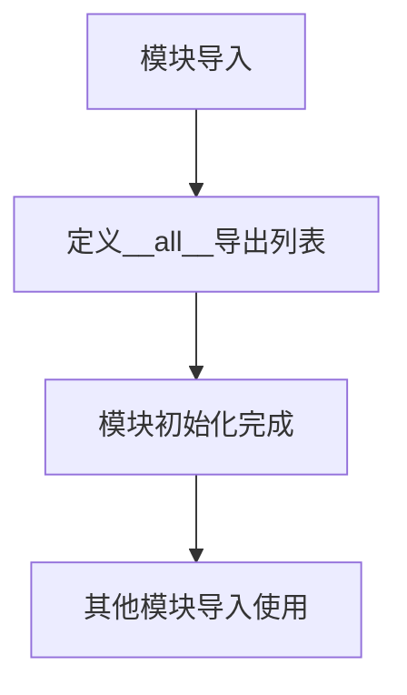

# `.\MetaGPT\metagpt\actions\requirement_analysis\__init__.py` 详细设计文档

该文件是RFC243实现的模块入口文件，主要功能是导出需求分析评估相关的类和动作，为其他模块提供评估功能的访问接口。

## 整体流程



## 类结构

```
模块结构
├── 导入语句
│   ├── EvaluationData (数据类)
│   └── EvaluateAction (动作类)
└── 导出声明
```

## 全局变量及字段


### `__all__`
    
一个模块级别的公开接口列表，用于控制使用 'from module import *' 语法时导出的符号，此处指定了本模块对外公开的类：EvaluationData 和 EvaluateAction。

类型：`List[str]`
    


    

## 全局函数及方法


## 关键组件


### EvaluationData

一个数据类，用于封装和传递需求分析评估过程中所需的数据，可能包含评估指标、输入输出等信息。

### EvaluateAction

一个动作类，继承自`Action`基类，负责执行具体的需求分析评估逻辑，例如根据给定的需求文档或用户输入，生成评估结果或建议。


## 问题及建议


### 已知问题

-   **模块导出定义错误**：`__all__` 列表中包含了类对象 `EvaluationData` 和 `EvaluateAction`，而不是它们的字符串名称。这不符合 Python 的约定，`__all__` 应为一个包含公开对象名称的字符串列表。当前写法可能导致导入行为不符合预期或工具（如 `help()` 函数）无法正确识别模块的公开接口。
-   **缺少模块级文档**：虽然文件头部有注释，但缺少一个正式的模块文档字符串（`"""` 包裹的多行字符串）来描述此 `__init__.py` 文件的目的、它所属的包以及它导出的主要功能。这降低了代码的可读性和可维护性。
-   **潜在的循环导入风险**：`__init__.py` 直接导入了子模块中的具体类。如果包结构复杂或未来重构，这种直接导入方式可能无意中引入循环导入问题，尤其是在 `metagpt.actions.requirement_analysis` 包内部其他模块相互引用时。

### 优化建议

-   **修正 `__all__` 定义**：将 `__all__` 修改为包含公开对象名称的字符串列表。例如：`__all__ = ["EvaluationData", "EvaluateAction"]`。这符合 Python 标准，并确保导入机制和代码检查工具能正常工作。
-   **添加模块文档字符串**：在文件顶部，版权信息之后，添加一个清晰的多行文档字符串。描述本模块作为 `metagpt.actions.requirement_analysis` 包的入口点，负责导出用于需求分析评估的关键组件（`EvaluateAction` 及其相关数据类 `EvaluationData`），并提及相关的 RFC 文档。
-   **考虑延迟导入或重构导入方式**：如果包结构复杂，可以考虑在 `__init__.py` 中使用延迟导入（例如在函数内部导入）来避免潜在的循环依赖。或者，确保包内的模块设计清晰，依赖关系单向，从根本上避免循环导入。当前直接导入的方式在简单包中是可接受的，但需在后续开发中留意此风险。


## 其它


### 设计目标与约束

该模块的设计目标是实现一个用于需求分析阶段动作评估的框架，其核心是`EvaluateAction`类。它旨在接收一个待评估的动作（`Action`对象）和一组评估数据（`EvaluationData`对象），通过执行该动作并分析其结果，生成一个包含评估结论和详细信息的`EvaluationResult`对象。主要约束包括：1) 必须与MetaGPT框架中的`Action`基类兼容；2) 评估过程应具备可扩展性，以便未来集成不同的评估标准或算法；3) 评估结果需要结构化和可序列化，便于后续流程（如报告生成、决策制定）使用。

### 错误处理与异常设计

模块的错误处理主要围绕`EvaluateAction.run`方法的执行。预期可能发生的异常包括：1) `Action`对象执行失败（如网络错误、逻辑错误），这应被捕获并封装到`EvaluationResult`的`error`字段中，同时设置`success`为`False`；2) 输入参数无效（如`EvaluationData`为空或格式错误），应抛出`ValueError`或自定义的`InvalidInputError`；3) 评估逻辑本身的运行时错误，应抛出`RuntimeError`。设计上，`run`方法应使用`try-except`块来捕获动作执行异常，确保评估流程不会因单个动作失败而完全中断，并能提供有意义的错误反馈。

### 数据流与状态机

该模块的核心数据流始于`EvaluationData`（输入），经由`EvaluateAction.run`方法处理，最终产出`EvaluationResult`（输出）。`EvaluationData`作为评估的上下文或输入条件。`EvaluateAction`是处理器，其内部状态相对简单，主要在执行`run`方法时激活。流程可描述为：初始化`EvaluateAction` -> 调用`run(EvaluationData)` -> `run`方法内部调用`Action.run` -> 收集`Action`的执行结果与上下文 -> 应用评估逻辑（如规则检查、质量分析） -> 组装并返回`EvaluationResult`。整个过程是线性的，无复杂的状态转换。

### 外部依赖与接口契约

1.  **对MetaGPT框架的依赖**：强依赖于`metagpt.actions`中的`Action`基类。`EvaluateAction`本身是一个`Action`，其评估的目标也是一个`Action`对象。这构成了一个“动作评估动作”的递归依赖模式。
2.  **接口契约**：
    *   `EvaluateAction.run`方法：契约要求输入一个`EvaluationData`实例，该实例必须包含一个有效的`action`属性（类型为`Action`）。方法承诺返回一个`EvaluationResult`实例，无论内部动作执行成功与否。
    *   `EvaluationData`类：作为一个数据容器（DTO），其字段（如`action`, `context`）的语义和类型构成了与调用者之间的隐式契约。
    *   `__all__`导出列表：定义了模块的公共API，即`EvaluationData`和`EvaluateAction`类，外部代码应仅依赖这些导出项。

### 配置与可扩展性

当前模块作为初始化文件（`__init__.py`），主要职责是导出公共类，其本身不包含运行时配置。可扩展性体现在以下几个方面：1) `EvaluationData`可以扩展新的字段以承载更多评估上下文；2) `EvaluateAction`的子类可以通过重写`run`方法或内部的评估逻辑来实现不同的评估策略（如基于规则的评估、基于机器学习模型的评估）；3) `EvaluationResult`的结构可以扩展以包含更丰富的评估指标。未来可以考虑引入配置文件或插件机制来动态加载不同的评估器（`Evaluator`）。

### 安全考虑

由于`EvaluateAction`会执行传入的`Action`对象，这带来了代码注入或恶意动作执行的风险。安全考虑包括：1) **信任边界**：必须确保传入的`Action`对象来自可信源，例如框架内部生成的动作，而非不可信的用户输入。2) **沙箱环境**：在高度敏感的场景下，应考虑在受限环境（如容器、沙箱）中执行被评估的动作，以隔离潜在风险。3) **权限最小化**：执行动作的进程应仅拥有完成评估所需的最小权限。当前代码未显式处理这些安全问题，这在使用时需要由上层调用者保证。

    