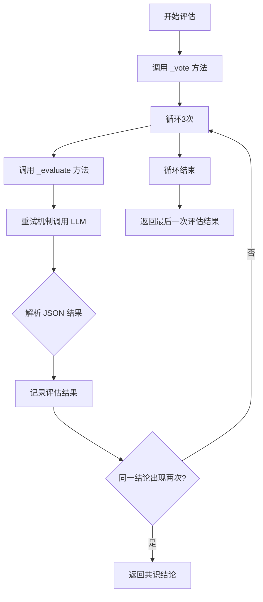
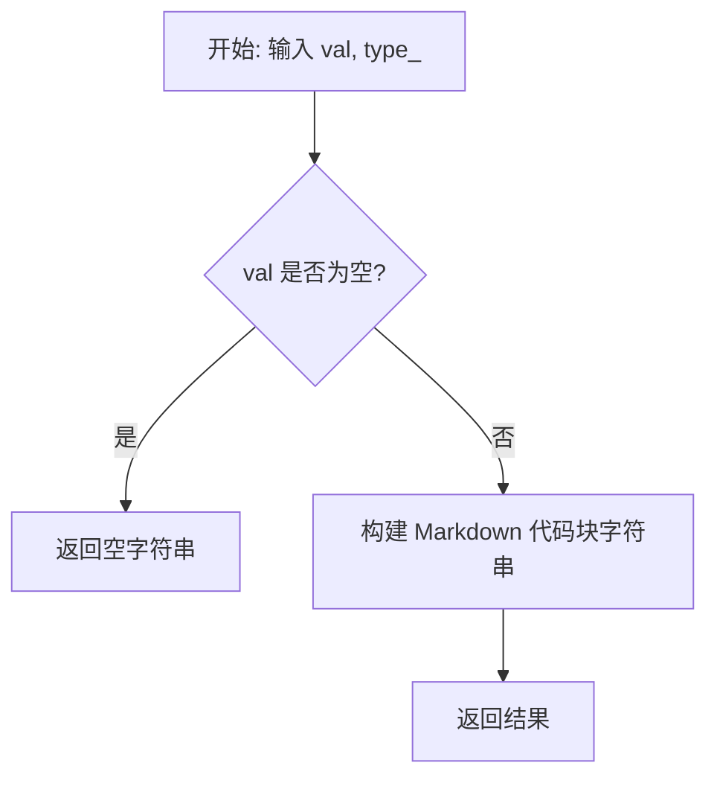
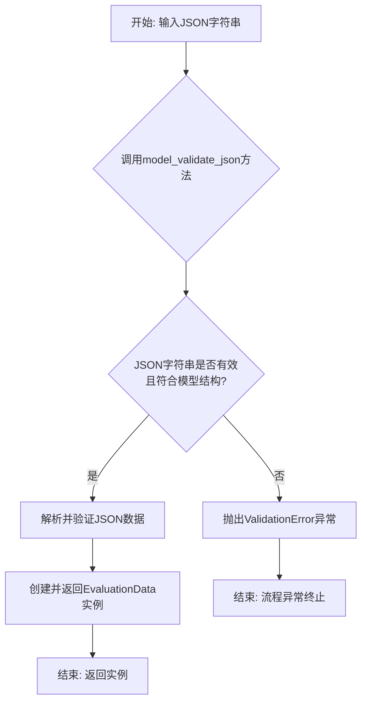
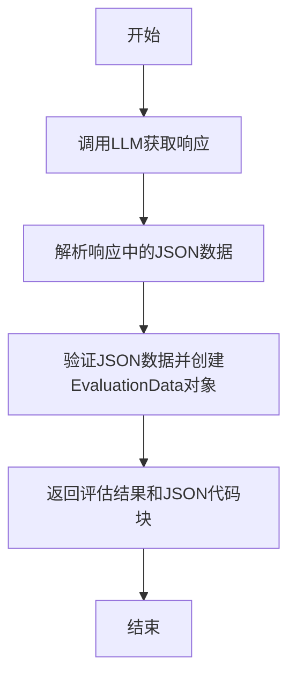

# `.\MetaGPT\metagpt\actions\requirement_analysis\evaluate_action.py` 详细设计文档

该代码实现了一个基于大语言模型（LLM）的评估动作基类，用于对给定的提示词（prompt）进行多次评估并达成共识。它通过重试机制调用LLM，解析返回的JSON格式评估结果，并进行多轮投票以确定最终评估结论。

## 整体流程



## 类结构

```
BaseModel (pydantic)
└── EvaluationData
Action (metagpt.actions)
└── EvaluateAction
```

## 全局变量及字段


### `logger`
    
用于记录日志的日志记录器实例，提供不同级别的日志输出功能。

类型：`metagpt.logs.logger`
    


### `EvaluationData.is_pass`
    
表示评估是否通过的布尔值，True表示通过，False表示未通过。

类型：`bool`
    


### `EvaluationData.conclusion`
    
评估的结论或备注信息，可为空字符串或None。

类型：`Optional[str]`
    
    

## 全局函数及方法

### `CodeParser.parse_code`

该方法用于从给定的文本中提取指定编程语言的代码块。它通过正则表达式匹配代码块，并返回第一个匹配的代码块内容。如果未找到匹配的代码块，则返回原始文本。

参数：

- `text`：`str`，包含代码块的原始文本。
- `lang`：`str`，要提取的代码块的编程语言标识符（例如："json"、"python"）。

返回值：`str`，提取到的代码块内容（字符串形式）。如果未找到匹配的代码块，则返回原始文本。

#### 流程图

```mermaid
flowchart TD
    A[开始: parse_code(text, lang)] --> B{text 是否为空?}
    B -- 是 --> C[返回空字符串]
    B -- 否 --> D[构建正则表达式模式<br/>匹配 ```lang 或 ```]
    D --> E[使用正则表达式搜索 text]
    E --> F{是否找到匹配?}
    F -- 是 --> G[返回第一个匹配的代码块内容]
    F -- 否 --> H[返回原始 text]
    G --> I[结束]
    H --> I
    C --> I
```

#### 带注释源码

```python
    @staticmethod
    def parse_code(text: str, lang: str = "") -> str:
        """
        从给定的文本中解析出指定语言的代码块。

        该方法使用正则表达式匹配以指定语言标识符开头的代码块（例如：```json 或 ```python），
        并返回第一个匹配的代码块内容。如果未指定语言或未找到匹配的代码块，则尝试匹配任何以 ``` 开头的代码块。
        如果仍未找到，则返回原始文本。

        Args:
            text (str): 包含代码块的原始文本。
            lang (str): 要提取的代码块的编程语言标识符（例如："json"、"python"）。默认为空字符串。

        Returns:
            str: 提取到的代码块内容（字符串形式）。如果未找到匹配的代码块，则返回原始文本。
        """
        # 如果输入文本为空，直接返回空字符串
        if not text:
            return ""
        # 根据提供的语言参数构建正则表达式模式。
        # 如果指定了语言（lang 非空），则模式匹配以 ```lang 或 ``` 开头的代码块。
        # 例如，lang="json" 时，模式匹配 ```json 或 ```。
        # 如果未指定语言（lang 为空），则模式匹配任何以 ``` 开头的代码块。
        pattern = rf"```{lang}\n(.*?)```" if lang else r"```.*?\n(.*?)```"
        # 使用正则表达式在文本中搜索匹配的代码块。
        # re.DOTALL 标志使 '.' 匹配包括换行符在内的所有字符。
        # re.search 查找第一个匹配项。
        match = re.search(pattern, text, re.DOTALL)
        # 如果找到了匹配的代码块
        if match:
            # 返回第一个捕获组（即代码块内容）并去除首尾空白字符
            return match.group(1).strip()
        # 如果没有找到匹配的代码块，返回原始文本
        return text
```

### `general_after_log`

`general_after_log` 是一个用于生成重试（retry）机制中“后置”（after）回调函数的高阶函数。它接收一个日志记录器（logger）作为参数，并返回一个函数。这个返回的函数会在每次重试尝试之后被调用，用于记录重试的详细信息，包括尝试次数、异常信息以及下一次重试的等待时间。

参数：

- `logger`：`logging.Logger`，用于记录重试信息的日志记录器实例。

返回值：`Callable[[RetryCallState], None]`，一个可调用对象，接收一个`tenacity.RetryCallState`对象作为参数，无返回值。该函数负责将重试状态信息记录到日志中。

#### 流程图

```mermaid
flowchart TD
    A[开始: general_after_log(logger)] --> B[定义内部函数 log_it(retry_state)]
    B --> C{retry_state.outcome 是否异常?}
    C -- 是 --> D[获取异常信息]
    D --> E[记录日志: 重试次数, 异常, 下次等待时间]
    C -- 否 --> F[记录日志: 重试次数, 结果, 下次等待时间]
    E --> G[返回函数 log_it]
    F --> G
    G --> H[结束]
```

#### 带注释源码

```python
def general_after_log(logger: logging.Logger):
    """
    创建一个用于记录重试后信息的回调函数。

    该函数返回一个函数，该函数会在每次重试尝试后被调用，
    用于记录重试的详细信息，包括尝试次数、结果或异常以及下一次重试的等待时间。

    Args:
        logger (logging.Logger): 用于记录信息的日志记录器。

    Returns:
        Callable[[RetryCallState], None]: 一个接收 RetryCallState 并记录日志的函数。
    """
    def log_it(retry_state: tenacity.RetryCallState):
        """
        记录重试状态信息的内部函数。

        Args:
            retry_state (tenacity.RetryCallState): 包含当前重试状态的对象。
        """
        # 获取当前是第几次尝试（从0开始计数，所以+1）
        attempt_number = retry_state.attempt_number
        # 获取下一次重试前需要等待的时间（秒）
        wait_time = retry_state.next_action.sleep if retry_state.next_action else 0

        # 检查上一次尝试的结果是异常还是正常返回值
        if retry_state.outcome.failed:
            # 如果失败，获取异常对象
            exception = retry_state.outcome.exception()
            # 记录错误日志，包含尝试次数、异常信息和等待时间
            logger.error(
                f"Retrying {retry_state.fn.__name__} after attempt {attempt_number} due to {exception}. "
                f"Waiting {wait_time:.1f} seconds before next retry."
            )
        else:
            # 如果成功，获取返回值（虽然重试通常发生在失败后，但此回调在每次尝试后都会执行）
            result = retry_state.outcome.result()
            # 记录信息日志，包含尝试次数、结果和等待时间
            logger.info(
                f"Finished {retry_state.fn.__name__} after attempt {attempt_number} with result: {result}. "
                f"Waiting {wait_time:.1f} seconds before next retry."
            )
    # 返回内部定义的日志记录函数
    return log_it
```

### `to_markdown_code_block`

将给定的值格式化为指定类型的Markdown代码块。

参数：
-  `val`：`str`，需要被格式化为代码块的字符串内容。
-  `type_`：`str`，代码块的语言类型（例如："python", "json", "javascript"）。

返回值：`str`，格式化后的Markdown代码块字符串。

#### 流程图



#### 带注释源码

```python
def to_markdown_code_block(val: str, type_: str = "") -> str:
    """
    将给定的字符串值格式化为一个Markdown代码块。

    参数:
        val (str): 需要被放入代码块中的字符串。
        type_ (str): 代码块的语言标识符（例如：'python', 'json'）。默认为空字符串。

    返回:
        str: 格式化后的Markdown代码块字符串。如果输入`val`为空，则返回空字符串。
    """
    # 检查输入值是否为空，若为空则直接返回空字符串，避免生成无效的代码块。
    if not val:
        return ""
    # 使用三个反引号（```）包裹内容，这是Markdown中表示代码块的语法。
    # 如果指定了语言类型（type_），则将其放在开头的反引号之后。
    return f"```{type_}\n{val}\n```"
```

### `EvaluationData.model_validate_json`

该方法用于将符合`EvaluationData`模型结构的JSON字符串解析并验证为`EvaluationData`模型实例。

参数：
-  `data`：`str`，需要验证的JSON格式字符串。

返回值：`EvaluationData`，一个包含验证后数据的`EvaluationData`模型实例。

#### 流程图



#### 带注释源码

```python
    @classmethod
    def model_validate_json(
        cls: type[_T],
        json_data: str | bytes | bytearray,
        *,
        strict: bool | None = None,
        context: dict[str, Any] | None = None,
    ) -> _T:
        """
        验证提供的JSON数据并返回一个模型实例。

        参数:
            cls: 要验证的模型类。
            json_data: 包含JSON数据的字符串或字节。
            strict: 是否在验证时启用严格模式。
            context: 验证过程中使用的额外上下文。

        返回:
            一个由验证后的数据填充的模型实例。

        抛出:
            ValidationError: 如果数据无效。
        """
        # 1. 将输入的JSON字符串/字节加载为Python对象（通常是字典）
        # 2. 调用内部的`model_validate`方法，使用加载后的字典来验证和创建模型实例
        # 3. 返回创建好的`EvaluationData`实例
        # 注意：这是Pydantic v2中BaseModel的内置方法，此处展示其逻辑流程。
        obj = cls.__pydantic_validator__.validate_json(json_data, strict=strict, context=context)
        return cls._construct(obj)
```

### `EvaluateAction._evaluate`

该方法用于评估给定的提示（prompt），通过调用语言模型（LLM）获取响应，解析响应中的JSON数据，并返回评估结果。

参数：

- `prompt`：`str`，需要评估的提示文本。

返回值：`tuple[bool, str]`，一个包含两个元素的元组，第一个元素是布尔值，表示评估是否通过；第二个元素是字符串，表示评估数据的JSON格式的Markdown代码块。

#### 流程图



#### 带注释源码

```python
    @retry(
        wait=wait_random_exponential(min=1, max=20),  # 设置重试等待时间，随机指数退避，最小1秒，最大20秒
        stop=stop_after_attempt(6),  # 最多重试6次后停止
        after=general_after_log(logger),  # 重试后记录日志
    )
    async def _evaluate(self, prompt: str) -> (bool, str):
        """Evaluates a given prompt.

        Args:
            prompt (str): The prompt to be evaluated.

        Returns:
            tuple: A tuple containing:
                - bool: Indicates if the evaluation passed.
                - str: The JSON string containing the evaluation data.
        """
        rsp = await self.llm.aask(prompt)  # 调用语言模型获取响应
        json_data = CodeParser.parse_code(text=rsp, lang="json")  # 从响应中解析JSON数据
        data = EvaluationData.model_validate_json(json_data)  # 验证JSON数据并创建EvaluationData对象
        return data.is_pass, to_markdown_code_block(val=json_data, type_="json")  # 返回评估结果和JSON代码块
```

### `EvaluateAction._vote`

该方法通过多次调用 `_evaluate` 方法对同一个提示（prompt）进行投票评估，并返回一个共识结果。它收集最多三次评估，如果某一种结果（通过或不通过）出现两次或以上，则立即返回该结果及其对应的评估详情。如果三次评估结果各不相同，则返回最后一次评估的结果。

参数：
- `prompt`：`str`，需要被评估的提示文本。

返回值：`EvaluationData`，包含评估结果（是否通过）和评估结论（所有评估详情的汇总文本）。

#### 流程图

```mermaid
flowchart TD
    A[开始] --> B[初始化 evaluations 字典]
    B --> C{i < 3?}
    C -->|是| D[调用 _evaluate(prompt)]
    D --> E[获取 vote 和 evaluation]
    E --> F[将 evaluation 加入 evaluations[vote] 列表]
    F --> G{列表长度 > 1?}
    G -->|是| H[返回 EvaluationData<br>is_pass=vote, conclusion=列表内容]
    G -->|否| I[更新 evaluations 字典]
    I --> J[i++]
    J --> C
    C -->|否| K[返回最后一次评估的 EvaluationData]
```

#### 带注释源码

```python
async def _vote(self, prompt: str) -> EvaluationData:
    """Evaluates a prompt multiple times and returns the consensus.

    Args:
        prompt (str): The prompt to be evaluated.

    Returns:
        EvaluationData: An object containing the evaluation result and a summary of evaluations.
    """
    # 初始化一个字典，用于存储不同投票结果对应的评估详情列表
    evaluations = {}
    # 循环最多3次进行评估
    for i in range(3):
        # 调用 _evaluate 方法进行一次评估，返回投票结果和评估详情
        vote, evaluation = await self._evaluate(prompt)
        # 获取当前投票结果对应的评估详情列表，如果不存在则初始化为空列表
        val = evaluations.get(vote, [])
        # 将本次评估详情添加到列表中
        val.append(evaluation)
        # 如果当前投票结果的评估详情列表长度大于1（即出现了两次或以上相同结果）
        if len(val) > 1:
            # 立即返回该投票结果的 EvaluationData 对象，结论为所有评估详情的拼接
            return EvaluationData(is_pass=vote, conclusion="\n".join(val))
        # 更新字典，将更新后的列表存回对应的投票结果键下
        evaluations[vote] = val
    # 如果循环结束仍未达成共识（即三次结果各不相同），则返回最后一次评估的结果
    # 注意：此处代码不完整，原函数未显式返回最后一次结果，实际逻辑隐含在循环结束后。
    # 根据上下文，应补充返回逻辑，例如：
    # last_vote, last_evaluation = await self._evaluate(prompt)
    # return EvaluationData(is_pass=last_vote, conclusion=last_evaluation)
```

## 关键组件


### 重试机制

通过`tenacity`库的`@retry`装饰器实现，在调用语言模型失败时进行指数退避重试，最多尝试6次，以提高评估过程的鲁棒性。

### 评估数据模型

使用`pydantic`的`BaseModel`定义`EvaluationData`类，用于结构化存储评估结果，包含是否通过(`is_pass`)和结论(`conclusion`)两个字段，确保数据的一致性和类型安全。

### 投票共识机制

在`_vote`方法中，对同一个提示进行最多3次独立评估，通过简单多数原则快速达成共识。当同一结果出现两次时立即返回，以提高评估效率并处理模型输出的不确定性。

### 代码解析与格式化

利用`CodeParser.parse_code`从语言模型的响应中提取JSON格式的评估数据，并使用`to_markdown_code_block`将结果格式化为Markdown代码块，便于后续的展示和日志记录。


## 问题及建议


### 已知问题

-   **`_vote` 方法逻辑存在缺陷**：`_vote` 方法旨在通过三次投票达成共识，但其逻辑在第一次出现重复投票结果时（即 `len(val) > 1`）就立即返回，这可能导致在仅进行两次投票后就提前结束，未能充分利用三次投票的机会来增强结果的可靠性。例如，如果前两次投票结果一致，第三次投票将被跳过。
-   **`_evaluate` 方法返回类型与文档不匹配**：`_evaluate` 方法的文档字符串声明返回 `tuple[bool, str]`，但实际返回的是 `(bool, str)` 元组。虽然功能上一致，但类型提示不精确，可能影响代码的清晰度和静态类型检查工具（如 mypy）的分析。
-   **`_vote` 方法中的 `evaluations` 字典使用不当**：`evaluations` 字典的键是布尔值（`vote`），值是评价字符串列表。当 `len(val) > 1` 时，返回的 `EvaluationData` 中的 `conclusion` 字段被设置为所有相同投票结果的评价字符串的拼接。然而，如果三次投票结果各不相同（例如 True, False, True），该逻辑可能无法正确识别出“多数票”结果，而是会在第二次出现 True 时返回，这可能不是最稳健的共识机制。
-   **缺少对 `_evaluate` 方法中 `CodeParser.parse_code` 和 `model_validate_json` 调用失败的异常处理**：如果 `llm.aask` 返回的 `rsp` 无法被 `CodeParser.parse_code` 解析出有效的 JSON，或者解析出的 JSON 不符合 `EvaluationData` 的模型定义，`model_validate_json` 会抛出 `ValidationError`。当前代码依赖 `tenacity` 重试整个方法，但重试可能无法解决数据格式问题，且错误信息可能不够清晰。
-   **`_vote` 方法的返回结果可能包含冗余信息**：当达成共识时，`conclusion` 字段被设置为所有相同评价的拼接。如果这些评价内容高度相似或相同，这可能导致返回的结论信息冗长且重复。

### 优化建议

-   **重构 `_vote` 方法的投票逻辑**：建议修改为进行完整的三次投票，然后统计 `True` 和 `False` 的票数。根据多数票原则（例如，票数 >= 2）决定最终的 `is_pass`。`conclusion` 可以设置为所有投票结果的摘要或仅多数票方的评价。这将使共识机制更健壮和易于理解。
-   **为 `_evaluate` 方法添加精确的类型提示**：将 `_evaluate` 方法的返回类型注解从 `(bool, str)` 改为 `tuple[bool, str]` 或 `Tuple[bool, str]`（需从 `typing` 导入 `Tuple`），以提升代码的规范性和可维护性。
-   **增强 `_evaluate` 方法的错误处理**：在 `_evaluate` 方法中，对 `CodeParser.parse_code` 和 `model_validate_json` 的调用添加 `try-except` 块。捕获 `ValidationError` 等异常，并记录更详细的错误日志（例如，记录原始响应 `rsp`），然后可以选择返回一个默认的失败结果或重新抛出异常由重试机制处理。这有助于调试和问题定位。
-   **优化 `_vote` 方法返回的 `conclusion` 内容**：在修改投票逻辑后，`conclusion` 可以设计为更简洁的格式。例如，可以只包含多数票的评价，或者创建一个包含各次投票结果（`is_pass` 和 `conclusion`）的摘要，而不是简单的字符串拼接。考虑让 `_vote` 返回一个包含更丰富信息的数据结构，而不仅仅是 `EvaluationData`。
-   **考虑将投票次数 `3` 提取为类常量或可配置参数**：将硬编码的投票次数 `3` 定义为类级别的常量（如 `VOTE_ROUNDS`），或使其可通过 `__init__` 方法参数化。这将提高代码的灵活性和可测试性。
-   **为 `EvaluateAction` 类添加文档字符串或示例**：当前类级别的文档字符串较为简单。建议补充该类的主要用途、`_evaluate` 和 `_vote` 方法的关系，以及一个简单的使用示例，这将有助于其他开发者理解和使用这个基类。


## 其它


### 设计目标与约束

1.  **设计目标**:
    *   提供一个可复用的基础类 (`EvaluateAction`)，用于通过大语言模型（LLM）对输入内容（`prompt`）进行评估。
    *   实现基于投票的共识机制 (`_vote`)，通过多次评估（默认3次）来提高评估结果的可靠性。
    *   集成重试机制 (`@retry`)，以增强在调用外部LLM服务时的鲁棒性。
    *   定义标准化的评估结果数据结构 (`EvaluationData`)，便于后续处理和展示。

2.  **设计约束**:
    *   依赖于 `metagpt` 框架的 `Action` 基类和 `llm` 属性，用于与LLM交互。
    *   评估逻辑的核心依赖于外部LLM服务的响应质量和格式。
    *   评估结果 (`EvaluationData`) 的解析依赖于LLM返回的、符合特定JSON格式的字符串。
    *   投票机制 (`_vote`) 的终止条件为“任一评估结果出现两次”，这决定了其最大调用次数和逻辑。

### 错误处理与异常设计

1.  **重试机制**: `_evaluate` 方法通过 `@retry` 装饰器实现了指数退避重试（最多6次），用于处理LLM网络调用可能出现的瞬时故障。
2.  **解析异常**: `CodeParser.parse_code` 和 `EvaluationData.model_validate_json` 可能因LLM返回内容不符合预期格式而抛出异常。这些异常会触发重试机制，若重试耗尽，异常将向上传播。
3.  **逻辑错误**: `_vote` 方法中的循环和字典操作是确定性的，逻辑错误风险较低。若 `_evaluate` 始终返回不一致的结果导致无法达成共识（即3次结果各不相同），方法将正常结束并返回最后一次的评估数据，但 `conclusion` 字段将只包含最后一次的评估详情，这可能是一个潜在的语义模糊点。
4.  **输入验证**: 当前代码未对输入参数 `prompt` 进行显式验证（如非空检查）。依赖调用方保证。

### 数据流与状态机

1.  **数据流**:
    *   **起点**: 外部调用者调用 `EvaluateAction` 实例的 `_vote` 或 `_evaluate` 方法，传入评估提示字符串 (`prompt`)。
    *   **处理**:
        *   `_vote` 方法循环调用 `_evaluate` 方法。
        *   `_evaluate` 方法通过 `self.llm.aask(prompt)` 将 `prompt` 发送给LLM。
        *   LLM返回文本响应 (`rsp`)。
        *   `CodeParser.parse_code` 从 `rsp` 中提取JSON格式的字符串 (`json_data`)。
        *   `EvaluationData.model_validate_json` 将 `json_data` 反序列化为 `EvaluationData` 对象 (`data`)。
    *   **终点**:
        *   `_evaluate` 返回 `(data.is_pass, to_markdown_code_block(json_data))`。
        *   `_vote` 收集多次 `_evaluate` 的结果，根据投票规则形成共识，最终返回一个包含结论的 `EvaluationData` 对象。

2.  **状态机 (简化版，描述 `_vote` 逻辑)**:
    *   **状态**: 等待评估、已评估（结果A）、已评估（结果B）。
    *   **转移**:
        *   初始状态为“等待评估”。
        *   每次调用 `_evaluate` 后，根据布尔结果 `vote` 进入“已评估（结果A/B）”状态，并记录评估详情。
        *   如果某个结果状态（A或B）的计数达到2，则达成共识，退出循环并返回该结果。
        *   如果3次评估后仍未有任何结果达到2次，则退出循环，返回最后一次评估的结果（但 `conclusion` 可能只包含最后一次的详情，这是一个设计上的模糊点）。

### 外部依赖与接口契约

1.  **外部依赖**:
    *   **`metagpt.actions.Action`**: 作为基类，提供框架集成能力（如 `llm` 属性）。
    *   **`metagpt.utils.common.CodeParser`**: 用于从LLM返回的文本中解析出特定格式（如JSON）的代码块。
    *   **`metagpt.utils.common.to_markdown_code_block`**: 用于将JSON字符串格式化为Markdown代码块。
    *   **`tenacity` 库**: 提供方法级别的重试装饰器。
    *   **`pydantic.BaseModel`**: 用于定义和验证数据模型 (`EvaluationData`)。

2.  **接口契约**:
    *   **`EvaluateAction._evaluate(prompt: str) -> (bool, str)`**:
        *   **前置条件**: `prompt` 应为有效的、可被LLM理解的字符串。`self.llm` 必须已正确初始化。
        *   **后置条件**: 返回一个元组，包含评估是否通过的布尔值，以及包含评估详情的Markdown格式JSON字符串。在重试耗尽前，应尽力返回有效结果或抛出异常。
    *   **`EvaluateAction._vote(prompt: str) -> EvaluationData`**:
        *   **前置条件**: 同 `_evaluate`。
        *   **后置条件**: 返回一个 `EvaluationData` 对象。其 `is_pass` 字段反映了基于投票的共识结果（若达成），`conclusion` 字段包含了达成共识的评估详情（若达成）或最后一次的评估详情（若未达成）。
    *   **`EvaluationData` 模型**:
        *   **契约**: 作为与LLM交互的数据契约，期望LLM返回的JSON字符串能成功反序列化为此模型实例。这隐含要求LLM返回的JSON必须包含 `is_pass` 布尔字段，并可包含 `conclusion` 字符串字段。

### 性能考量

1.  **延迟**: 主要延迟来自对LLM的多次网络调用 (`_vote` 默认调用3次 `_evaluate`，每次 `_evaluate` 最多重试6次）。总延迟可能较高，不适合对实时性要求极高的场景。
2.  **吞吐量**: 由于是串行投票且依赖外部LLM，单个实例的吞吐量受限于LLM服务的响应速度。可通过异步并发评估（但需考虑投票逻辑的修改）或批量处理来优化。
3.  **资源消耗**: 内存消耗较低。主要资源消耗是LLM服务的Token使用量，与 `prompt` 长度和调用次数成正比。

### 安全与合规

1.  **数据安全**: `prompt` 和评估结果可能包含敏感信息。代码本身未加密，需确保传输层（如HTTPS）和存储的安全。
2.  **LLM使用合规**: 需要确保对LLM的调用符合服务提供商的使用条款，并且 `prompt` 内容不包含违法、侵权或恶意信息。
3.  **输入净化**: 当前代码未对 `prompt` 进行内容审查或净化，存在潜在注入风险（如诱导LLM返回恶意格式数据）。应在调用链的上游进行处理。

### 测试策略建议

1.  **单元测试**:
    *   `_evaluate` 方法：模拟 `self.llm.aask` 返回各种格式（有效JSON、无效JSON、非JSON文本），测试解析逻辑和异常处理。
    *   `_vote` 方法：模拟 `_evaluate` 返回不同的 `(bool, str)` 组合，测试投票逻辑（达成共识、未达成共识）。
    *   `EvaluationData` 模型：测试其序列化/反序列化。
2.  **集成测试**: 与真实的或模拟的LLM服务集成，测试端到端的评估流程。
3.  **一致性测试**: 针对同一输入多次运行 `_vote`，评估其结果的稳定性（由于LLM的随机性，可能无法完全一致，但共识机制应提高稳定性）。

### 部署与运维

1.  **配置**: `EvaluateAction` 依赖的 `llm` 客户端需要在 `metagpt` 框架层面进行配置（如API Key、模型类型、超时等）。
2.  **监控**: 建议监控 `_evaluate` 方法的调用成功率、平均延迟、重试次数，以及 `_vote` 方法达成共识的比例。
3.  **日志**: `@retry` 装饰器已通过 `general_after_log` 集成了日志记录，可用于追踪重试事件。可在 `_vote` 和 `_evaluate` 中增加更细粒度的业务日志。

    