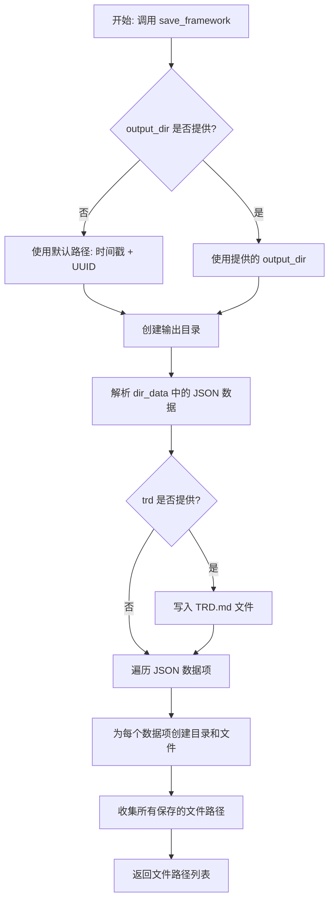
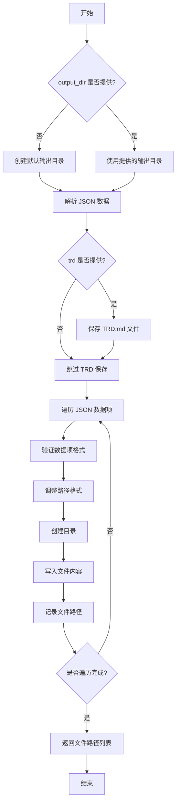

# `.\MetaGPT\metagpt\actions\requirement_analysis\framework\__init__.py` 详细设计文档

该模块是RFC243的实现，主要功能是处理需求分析框架的写入和评估。它提供了一个异步函数 `save_framework`，用于将JSON格式的目录数据（包含文件路径、文件名和内容）和可选的TRD（技术需求文档）内容保存到指定的输出目录中。该函数会解析输入的JSON字符串，创建相应的目录结构，并将内容写入文件。模块还导出了 `WriteFramework` 和 `EvaluateFramework` 两个类，用于框架的编写和评估。

## 整体流程



## 类结构

```
BaseModel (来自 pydantic)
└── Data (内部类)

WriteFramework (导入自 metagpt.actions.requirement_analysis.framework.write_framework)
EvaluateFramework (导入自 metagpt.actions.requirement_analysis.framework.evaluate_framework)
```

## 全局变量及字段


### `Data.path`
    
文件或目录的路径，用于指定框架文档的存储位置。

类型：`str`
    


### `Data.filename`
    
文件名，用于指定框架文档的具体文件名称。

类型：`str`
    


### `Data.content`
    
文件内容，包含框架文档的具体文本或数据。

类型：`str`
    
    

## 全局函数及方法

### `save_framework`

`save_framework` 是一个异步函数，用于将框架数据保存到文件中。它接收一个包含JSON格式数据的字符串，解析后根据数据中的路径和文件名创建目录并写入内容。同时，可选地保存一个技术需求文档（TRD）。函数返回所有保存文件的路径列表。

参数：

- `dir_data`：`str`，包含JSON数据的字符串，格式为 "```json ...data... ```"，其中数据是一个列表，每个元素包含 `path`、`filename` 和 `content` 字段。
- `trd`：`Optional[str]`，可选的技术需求文档内容，如果提供，将保存为 "TRD.md" 文件。
- `output_dir`：`Optional[Union[str, Path]]`，可选的输出目录路径。如果未提供，将使用当前时间戳和随机UUID后缀创建一个默认目录。

返回值：`List[str]`，返回所有保存文件的路径列表。

#### 流程图



#### 带注释源码

```python
async def save_framework(
    dir_data: str, trd: Optional[str] = None, output_dir: Optional[Union[str, Path]] = None
) -> List[str]:
    """
    Saves framework data to files based on input JSON data and optionally saves a TRD (technical requirements document).

    Args:
        dir_data (str): JSON data in string format enclosed in triple backticks ("```json" "...data..." "```").
        trd (str, optional): Technical requirements document content to be saved. Defaults to None.
        output_dir (Union[str, Path], optional): Output directory path where files will be saved. If not provided,
            a default directory is created based on the current timestamp and a random UUID suffix.

    Returns:
        List[str]: List of file paths where data was saved.

    Raises:
        Any exceptions raised during file writing operations.

    Notes:
        - JSON data should be provided in the format "```json ...data... ```".
        - The function ensures that paths and filenames are correctly formatted and creates necessary directories.

    Example:
        ```python
        dir_data = "```json\n[{\"path\": \"/folder\", \"filename\": \"file1.txt\", \"content\": \"Some content\"}]\n```"
        trd = "Technical requirements document content."
        output_dir = '/path/to/output/dir'
        saved_files = await save_framework(dir_data, trd, output_dir)
        print(saved_files)
        ```
    """
    # 处理输出目录：如果未提供，则创建一个基于时间戳和UUID的默认目录
    output_dir = (
        Path(output_dir)
        if output_dir
        else config.workspace.path / (datetime.now().strftime("%Y%m%d%H%M%ST") + uuid.uuid4().hex[0:8])
    )
    output_dir.mkdir(parents=True, exist_ok=True)  # 创建目录，如果已存在则忽略

    # 解析 JSON 数据：移除前后的 "```json" 和 "```" 标记，然后加载为 Python 对象
    json_data = dir_data.removeprefix("```json").removesuffix("```")
    items = json.loads(json_data)

    # 定义数据模型，用于验证 JSON 数据的结构
    class Data(BaseModel):
        path: str
        filename: str
        content: str

    # 如果提供了 TRD 内容，则保存为 TRD.md 文件
    if trd:
        pathname = output_dir / "TRD.md"
        await awrite(filename=pathname, data=trd)

    files = []  # 用于存储所有保存的文件路径
    for i in items:
        v = Data.model_validate(i)  # 验证数据项格式
        # 如果路径以 "/" 开头，则添加 "." 前缀，使其成为相对路径
        if v.path and v.path[0] == "/":
            v.path = "." + v.path
        pathname = output_dir / v.path
        pathname.mkdir(parents=True, exist_ok=True)  # 创建目录
        pathname = pathname / v.filename
        await awrite(filename=pathname, data=v.content)  # 异步写入文件内容
        files.append(str(pathname))  # 记录文件路径
    return files  # 返回所有保存文件的路径列表
```

## 关键组件


### WriteFramework

负责生成框架代码或文档的核心组件，基于需求分析结果构建项目的基础结构。

### EvaluateFramework

负责评估生成的框架代码或文档的质量，确保其符合项目需求和技术标准。

### save_framework 函数

一个异步工具函数，负责将框架数据（包括JSON格式的目录结构和可选的TRD文档）持久化保存到文件系统中，并处理路径创建和文件写入。


## 问题及建议


### 已知问题

-   **硬编码的默认输出目录生成逻辑**：当`output_dir`参数未提供时，代码使用`config.workspace.path`拼接一个基于当前时间和UUID的目录名。这种逻辑与业务功能（保存框架数据）耦合，使得函数职责不单一，且难以测试和复用。如果`config.workspace.path`未正确配置，可能导致运行时错误。
-   **脆弱的JSON数据预处理**：使用`removeprefix("```json").removesuffix("```")`来剥离Markdown代码块标记。这种方法假设输入字符串严格遵循“```json”开头和“```”结尾的格式，且没有多余的空格或换行符。对于格式不规范的输入（例如，标记前后有空格、使用了不同的标记如`~~~`、或根本没有标记），此处理会失败或导致JSON解析错误。
-   **潜在的路径遍历安全风险**：代码对`v.path`进行了处理，如果以`/`开头则添加`.`前缀。然而，这并不能完全防止路径遍历攻击（例如，`v.path`为`../../../etc/passwd`）。虽然在本上下文中输入可能受控，但从安全最佳实践来看，路径验证和净化不足。
-   **同步的目录创建与异步的文件写入混合**：函数使用同步的`Path.mkdir()`创建目录，但使用异步的`awrite()`写入文件。在高度并发的场景下，这可能存在竞态条件（尽管概率较低），即多个协程同时判断目录不存在并尝试创建它。
-   **缺少输入验证和错误处理**：函数对`dir_data`和`trd`参数的格式和内容缺少前置验证。如果`json.loads`失败，异常会直接抛出，调用方可能难以理解根本原因（是JSON格式错误，还是预处理失败？）。此外，对`items`是否为列表、其元素是否包含必要字段的检查也依赖于`Data.model_validate`，错误信息可能不够友好。
-   **临时定义的Pydantic模型**：`Data`类在函数内部定义。虽然这解决了类型验证问题，但如果其他函数也需要相同的结构，会导致代码重复。这属于一种局部的、临时的设计。

### 优化建议

-   **分离关注点，重构默认路径生成逻辑**：将默认输出目录的生成逻辑提取到一个独立的函数或配置项中。`save_framework`函数应专注于“保存”这一核心职责，接收一个确定的`output_dir`参数。调用方负责提供有效的目录路径，这提高了函数的可测试性和清晰度。
-   **增强JSON数据解析的健壮性**：实现一个更健壮的解析器来提取JSON数据。例如，使用正则表达式匹配代码块，或先尝试直接解析，失败后再尝试剥离常见标记。同时，在解析失败时提供更清晰的错误信息，指出是格式问题还是内容问题。
-   **加强路径安全处理**：使用`Path.resolve()`或`os.path.normpath`来规范化路径，并确保最终路径在预期的输出目录之内。可以定义一个安全函数，将用户提供的路径部分与基准目录拼接，并验证结果是否仍在基准目录下。
-   **统一异步操作**：考虑将目录创建也改为异步操作（如果存在异步的文件系统库），或者至少在创建目录前进行存在性检查，以减少竞态条件的影响。或者，在函数文档中明确说明其非线程/协程安全。
-   **增加详尽的输入验证和错误处理**：在函数开始处，验证`dir_data`是否为字符串且包含有效内容。对解析出的`items`，可以先检查其是否为列表。使用`try-except`块包裹`json.loads`和`Data.model_validate`，并抛出更具上下文信息的自定义异常（如`FrameworkDataFormatError`）。这能极大提升调试体验和API的健壮性。
-   **将数据模型提升为模块级定义**：将`Data`这个Pydantic模型移到模块的顶层定义，并赋予一个更具业务含义的名称（如`FrameworkFile`）。这样可以被模块内的其他函数复用，也使得代码结构更清晰。
-   **考虑性能优化**：当前代码是顺序写入每个文件。如果文件数量很多，可以考虑使用`asyncio.gather`并发执行多个`awrite`操作，以提高I/O效率。但需要注意系统的文件描述符限制和磁盘I/O负载。
-   **完善文档和类型注解**：函数文档字符串中的示例使用了过时的参数名（`dir_data`在示例中名为`dir_data`，但描述是`dir_data`，应保持一致）。确保所有参数和返回值的类型注解与描述完全匹配。


## 其它


### 设计目标与约束

该模块的设计目标是提供一个可复用的框架，用于解析、验证和持久化由AI生成的代码框架结构数据。核心约束包括：1) 输入数据必须遵循特定的JSON格式，并包裹在代码块标记中；2) 输出目录结构需动态生成，确保隔离性和可追溯性；3) 支持可选的技术需求文档（TRD）的并行保存；4) 依赖`pydantic`进行数据验证，确保数据完整性。

### 错误处理与异常设计

模块的错误处理主要围绕数据解析和文件I/O操作。`json.loads`可能抛出`json.JSONDecodeError`，表示输入JSON格式无效。`Data.model_validate`可能抛出`pydantic.ValidationError`，表示数据字段缺失或类型不匹配。文件写入操作`awrite`可能抛出`OSError`或`IOError`。当前设计将这些异常直接向上抛出，由调用者处理。对于路径处理，通过字符串操作（如`removeprefix`）来剥离标记，若标记缺失可能导致逻辑错误而非显式异常。

### 数据流与状态机

数据流始于一个包含JSON字符串的`dir_data`输入。处理流程为线性状态转换：1) **解析状态**：剥离标记，将JSON字符串反序列化为Python对象列表。2) **验证与转换状态**：使用Pydantic模型将列表中的每个字典转换为强类型的`Data`对象，并进行路径规范化（如处理根路径`/`）。3) **持久化状态**：根据`Data`对象创建目录结构并写入文件内容；同时，如果提供了`trd`参数，将其写入独立的`TRD.md`文件。整个过程无循环依赖或复杂的状态分支，是一个简单的ETL（提取、转换、加载）管道。

### 外部依赖与接口契约

*   **外部依赖**：
    *   `json`：标准库，用于JSON解析。
    *   `uuid`：标准库，用于生成唯一标识符。
    *   `datetime`：标准库，用于生成时间戳。
    *   `pathlib.Path`：标准库，用于面向对象的路径操作。
    *   `pydantic.BaseModel`：第三方库，用于数据验证和序列化。
    *   `metagpt.config2.config`：项目配置，用于获取默认工作空间路径。
    *   `metagpt.utils.common.awrite`：项目工具函数，用于异步文件写入。
*   **接口契约**：
    *   **输入契约**：`dir_data`参数期望一个被` ```json`和` ``` `包裹的JSON字符串。其JSON内容应为对象列表，每个对象必须包含`path`（字符串）、`filename`（字符串）、`content`（字符串）字段。
    *   **输出契约**：函数返回一个字符串列表，包含所有成功写入的文件的绝对路径。函数成功执行后，在指定的`output_dir`下会生成与输入数据描述一致的目录和文件结构。

### 安全与合规考量

1.  **路径遍历风险**：代码对`v.path`进行了简单处理（`if v.path and v.path[0] == "/": v.path = "." + v.path`），旨在防止绝对路径逃逸，但此防护较为基础。恶意构造的`path`（如`../../../etc/passwd`）仍可能导致文件被写入预期外的目录。建议增加更严格的路径净化或验证逻辑。
2.  **输入验证**：依赖`pydantic`进行基础的类型和存在性验证，但未对`path`和`filename`的内容（如长度、禁止字符）或`content`的大小进行额外约束，在接收不可信输入时存在风险。
3.  **资源消耗**：函数同步处理整个文件列表并一次性写入，如果输入数据量极大（如数万文件），可能阻塞事件循环或耗尽内存/磁盘空间。应考虑流式处理或增加分块机制。

    