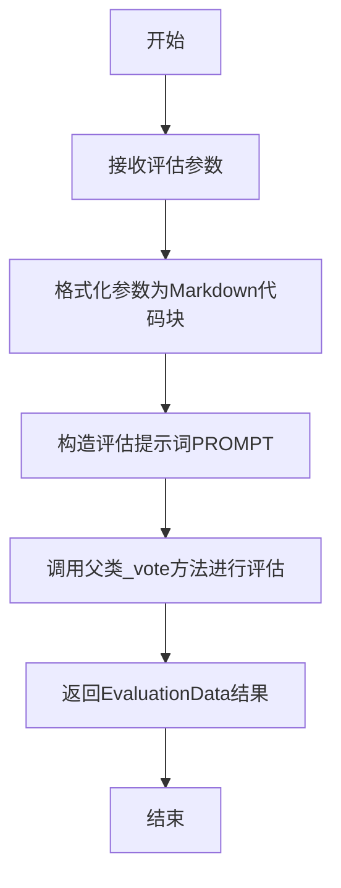

# `.\MetaGPT\metagpt\actions\requirement_analysis\framework\evaluate_framework.py` 详细设计文档

该代码实现了一个评估框架，用于根据技术需求文档（TRD）评估软件框架的质量。它继承自`EvaluateAction`，通过`run`方法接收用例参与者、TRD、外部接口确认、历史框架输出和附加技术需求等参数，构造提示词并调用父类的投票机制，最终返回包含评估结果（是否通过、问题列表、结论等）的`EvaluationData`对象。

## 整体流程



## 类结构

```
EvaluateAction (父类，来自metagpt.actions.requirement_analysis)
└── EvaluateFramework (评估框架类)
    └── run (评估执行方法)
```

## 全局变量及字段


### `PROMPT`
    
一个多行字符串模板，定义了评估软件框架质量时使用的提示词，包含占位符用于插入评估所需的具体信息。

类型：`str`
    


    

## 全局函数及方法

### `EvaluateFramework.run`

`EvaluateFramework.run` 方法是 `EvaluateFramework` 类的核心方法，用于评估基于给定技术需求文档（TRD）和相关参数的软件框架质量。它通过整合所有输入信息，构建一个提示词（prompt），并调用父类的 `_vote` 方法，利用大语言模型（LLM）来执行评估，最终返回一个包含评估结果（如是否通过、问题列表、结论等）的 `EvaluationData` 对象。

参数：

- `use_case_actors`：`str`，描述用例中涉及的参与者（Actor）、系统（System）和外部系统（External System）。
- `trd`：`str`，技术需求文档（TRD），概述了软件框架的需求。
- `acknowledge`：`str`，与框架相关的外部确认或接口信息。
- `legacy_output`：`str`，由 `WriteFramework` 返回的先前版本的软件框架代码或描述。
- `additional_technical_requirements`：`str`，评估过程中需要考虑的额外技术要求。

返回值：`EvaluationData`，一个包含评估结果的对象，其中包含 `is_pass`（是否通过）、`conclusion`（结论）、`issues`（问题列表）和 `misalignment`（与TRD不匹配的细节）等字段。

#### 流程图

```mermaid
flowchart TD
    A[开始: run方法被调用] --> B[接收参数: use_case_actors, trd, acknowledge, legacy_output, additional_technical_requirements]
    B --> C[使用to_markdown_code_block格式化参数]
    C --> D[将格式化后的参数填入PROMPT模板]
    D --> E[调用父类方法 self._vote(prompt)]
    E --> F[LLM处理prompt并生成评估结果]
    F --> G[返回EvaluationData对象]
    G --> H[结束]
```

#### 带注释源码

```python
async def run(
    self,
    *,
    use_case_actors: str,
    trd: str,
    acknowledge: str,
    legacy_output: str,
    additional_technical_requirements: str,
) -> EvaluationData:
    """
    运行基于提供的TRD和相关参数的软件框架评估。

    参数:
        use_case_actors (str): 用例中涉及的参与者的描述。
        trd (str): 技术需求文档（TRD），概述了软件框架的需求。
        acknowledge (str): 与框架相关的外部确认或接口信息。
        legacy_output (str): 由 `WriteFramework` 返回的先前版本的软件框架。
        additional_technical_requirements (str): 评估过程中需要考虑的额外技术要求。

    返回:
        EvaluationData: 包含评估结果的对象。

    示例:
        >>> evaluate_framework = EvaluateFramework()
        >>> use_case_actors = "- Actor: game player;\\n- System: snake game; \\n- External System: game center;"
        >>> trd = "## TRD\\n..."
        >>> acknowledge = "## Interfaces\\n..."
        >>> framework = '{"path":"balabala", "filename":"...", ...'
        >>> constraint = "Using Java language, ..."
        >>> evaluation = await evaluate_framework.run(
        >>>     use_case_actors=use_case_actors,
        >>>     trd=trd,
        >>>     acknowledge=acknowledge,
        >>>     legacy_output=framework,
        >>>     additional_technical_requirements=constraint,
        >>> )
        >>> is_pass = evaluation.is_pass
        >>> print(is_pass)
        True
        >>> evaluation_conclusion = evaluation.conclusion
        >>> print(evaluation_conclusion)
        Balabala...
    """
    # 1. 使用工具函数 to_markdown_code_block 将所有字符串参数格式化为Markdown代码块。
    #    这有助于在后续的提示词中清晰地展示代码或结构化文本，避免与提示词指令混淆。
    prompt = PROMPT.format(
        use_case_actors=use_case_actors,
        trd=to_markdown_code_block(val=trd),
        acknowledge=to_markdown_code_block(val=acknowledge),
        legacy_output=to_markdown_code_block(val=legacy_output),
        additional_technical_requirements=to_markdown_code_block(val=additional_technical_requirements),
    )
    # 2. 调用从父类 `EvaluateAction` 继承的 `_vote` 方法。
    #    该方法负责将构建好的提示词发送给大语言模型（LLM），并解析LLM的返回结果，
    #    将其封装成结构化的 `EvaluationData` 对象返回。
    return await self._vote(prompt)
```

## 关键组件


### 评估框架类 (EvaluateFramework)

继承自 `EvaluateAction` 的注册工具类，用于根据技术需求文档（TRD）评估软件框架的质量。

### 工具注册机制 (Tool Registry)

通过 `@register_tool` 装饰器将 `EvaluateFramework` 类注册为工具，使其功能可被系统发现和调用。

### 提示词模板 (Prompt Template)

一个结构化的字符串模板（`PROMPT`），用于组织和格式化评估所需的所有输入信息（如用例参与者、TRD、确认信息、遗留输出等），并指导评估逻辑。

### 评估数据模型 (EvaluationData)

由 `run` 方法返回的数据结构，包含评估结论（`conclusion`）、是否通过（`is_pass`）、发现的问题（`issues`）以及与TRD的偏差详情（`misalignment`）等信息。

### 通用工具函数 (Common Utilities)

`to_markdown_code_block` 函数，用于将输入的字符串格式化为 Markdown 代码块，确保在提示词中代码内容的清晰展示。


## 问题及建议


### 已知问题

-   **硬编码的提示词模板**：`PROMPT` 变量是一个硬编码的多行字符串模板。这导致提示词逻辑与业务逻辑紧密耦合，难以维护、复用和测试。任何对提示词的修改都需要直接修改源代码，增加了出错的风险，并且无法根据不同场景或环境动态调整提示词。
-   **缺乏输入验证**：`run` 方法接收多个字符串参数，但代码中没有对这些输入进行任何验证（例如，检查是否为空、格式是否正确、长度是否合理）。如果传入无效或恶意的输入，可能导致下游的 LLM 调用失败、产生无意义的评估结果，或者引发未处理的异常。
-   **继承带来的潜在耦合**：`EvaluateFramework` 类继承自 `EvaluateAction`，并直接调用了父类的 `_vote` 方法。这种设计使得本类的功能严重依赖于父类的内部实现细节。如果父类 `_vote` 方法的接口或行为发生变更，或者其内部依赖（如 LLM 客户端、配置）出现问题，本类会直接受到影响且难以独立测试和调试。
-   **错误处理机制不明确**：代码中没有展示对 `_vote` 方法可能抛出的异常（如网络错误、LLM API 错误、解析错误）的处理。整个评估过程的健壮性不足，一个环节的失败可能导致整个任务崩溃，且没有向调用者提供清晰的错误信息或恢复路径。
-   **配置和依赖外部化不足**：提示词模板、以及通过父类 `_vote` 方法间接使用的模型参数（如模型类型、温度、token 限制等）都固化在代码中。这使得在不修改代码的情况下，难以针对不同的评估任务调整生成策略或切换不同的底层模型服务。

### 优化建议

-   **将提示词模板外部化**：将 `PROMPT` 模板移至配置文件（如 YAML、JSON）或数据库中。可以创建一个 `PromptTemplateManager` 类来负责加载和渲染模板。这样便于统一管理、支持多语言/多场景模板、并允许在运行时或通过配置热更新提示词，而无需重新部署代码。
-   **增加输入参数验证与清洗**：在 `run` 方法的开始处，添加对各个输入参数的验证逻辑。可以使用 Pydantic 模型来定义输入的数据结构和约束，或者手动检查关键参数的非空性和基本格式。对于 `trd`, `legacy_output` 等可能包含代码或复杂结构的内容，可以增加基础的语法或格式检查。
-   **降低继承耦合，明确依赖**：考虑将父类的功能通过组合（Composition）而非继承（Inheritance）的方式引入。例如，在 `__init__` 方法中接收一个 `evaluator` 对象（遵循特定接口），`run` 方法内部调用 `self.evaluator.vote(prompt)`。这提高了代码的模块化程度，使得可以轻松替换评估策略，并便于进行单元测试（通过 Mock `evaluator`）。
-   **完善错误处理与重试机制**：在 `run` 方法中使用 `try-except` 块包裹对 `_vote` 的调用。捕获特定的异常类型（如 `LLMException`, `TimeoutError`, `ValidationError`），并转换为对用户友好的错误信息，封装在 `EvaluationData` 中或抛出定义良好的业务异常。对于暂时性失败（如网络波动），可以实现指数退避的重试逻辑。
-   **将配置参数化**：将模型参数、评估阈值等配置项从硬编码中抽离，通过类的构造参数或配置文件传入。例如，可以设计一个 `EvaluationConfig` 数据类，包含 `model_name`, `temperature`, `max_tokens` 等属性，并在初始化 `EvaluateFramework` 时传入。这增强了系统的灵活性和可配置性。


## 其它


### 设计目标与约束

本模块的核心设计目标是提供一个可复用的、基于大语言模型（LLM）的软件框架质量评估工具。它旨在自动化地检查由`WriteFramework`等组件生成的软件框架代码，是否满足给定的技术需求文档（TRD）、外部接口契约以及额外的技术要求。主要约束包括：1) 评估逻辑高度依赖于LLM对自然语言提示词（PROMPT）的理解和推理能力；2) 输入参数（如TRD、框架代码）均为非结构化的文本字符串，需要LLM进行语义解析和比对；3) 作为`EvaluateAction`的子类，其执行流程（如`_vote`方法）依赖于父类或框架提供的LLM调用与结果解析机制。

### 错误处理与异常设计

当前代码未显式定义错误处理逻辑。所有异常处理依赖于其父类`EvaluateAction`的`run`或`_vote`方法实现。潜在的异常场景包括：1) LLM服务调用失败（网络错误、API错误）；2) LLM返回的响应格式不符合`PROMPT`中要求的Markdown JSON对象格式，导致`EvaluationData`对象构造失败；3) 输入参数（如`trd`, `legacy_output`）为空或格式异常，可能影响LLM评估的准确性。建议在后续迭代中，在`run`方法内部增加对关键输入参数的验证，并考虑对`_vote`方法可能抛出的异常进行捕获和封装，返回一个包含错误信息的`EvaluationData`对象，而非直接向上抛出。

### 数据流与状态机

该模块的数据流是线性的、无状态的请求-响应模式：
1.  **输入**：调用者通过`run`方法传入五个字符串参数（`use_case_actors`, `trd`, `acknowledge`, `legacy_output`, `additional_technical_requirements`）。
2.  **处理**：`run`方法使用`to_markdown_code_block`函数将部分输入参数格式化为Markdown代码块，然后使用`PROMPT`模板将所有参数组装成一个结构化的提示词字符串。
3.  **核心评估**：组装好的提示词被传递给`self._vote(prompt)`方法。该方法（继承自`EvaluateAction`）负责与LLM交互，发送提示词并获取响应。
4.  **输出解析与返回**：`_vote`方法预期LLM的响应是一个Markdown JSON字符串，并将其解析为`EvaluationData`对象。该对象最终由`run`方法返回给调用者。
模块本身不维护任何状态，每次调用都是独立的。

### 外部依赖与接口契约

1.  **父类依赖**：继承自`metagpt.actions.requirement_analysis.EvaluateAction`。强依赖其`_vote`方法的实现细节、返回的`EvaluationData`数据结构以及潜在的LLM客户端配置。
2.  **工具注册依赖**：通过`@register_tool(include_functions=["run"])`装饰器将自身注册为工具。这依赖于`metagpt.tools.tool_registry.register_tool`的机制，可能影响该模块在特定工具链中的可发现性和调用方式。
3.  **工具函数依赖**：使用了`metagpt.utils.common.to_markdown_code_block`函数来格式化输入字符串。这是一个弱依赖，但需确保该函数行为符合预期（如正确处理特殊字符）。
4.  **隐式LLM依赖**：虽然不直接导入，但通过`_vote`方法强依赖一个底层的大语言模型服务（如OpenAI GPT系列）。其性能、成本、响应格式稳定性直接影响本模块的功能和可靠性。
5.  **输入接口契约**：`run`方法的参数构成了明确的输入契约。调用者必须提供所有参数，且参数应具有特定的语义（如`trd`是需求文档，`legacy_output`是待评估的框架代码）。文档中的示例明确了这一契约。
6.  **输出接口契约**：返回类型为`EvaluationData`。这定义了一个包含`is_pass`（布尔值）、`conclusion`（字符串）、`issues`（字符串列表）等字段的数据结构契约。`PROMPT`中要求LLM返回的JSON格式必须与此数据结构兼容。

    