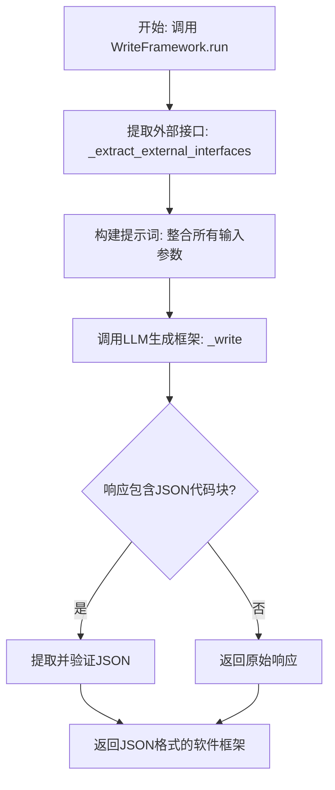
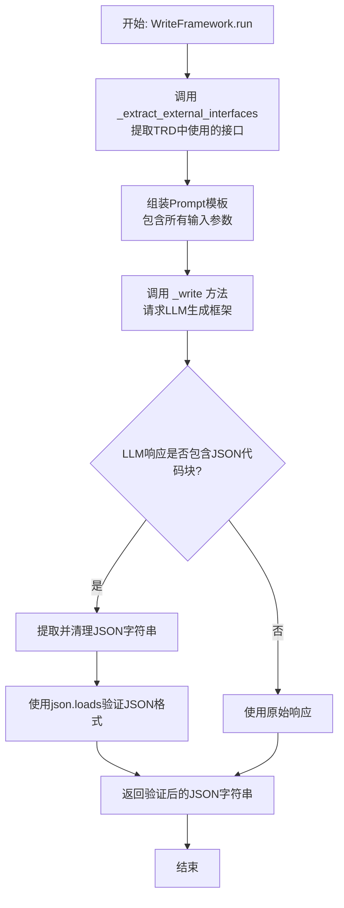
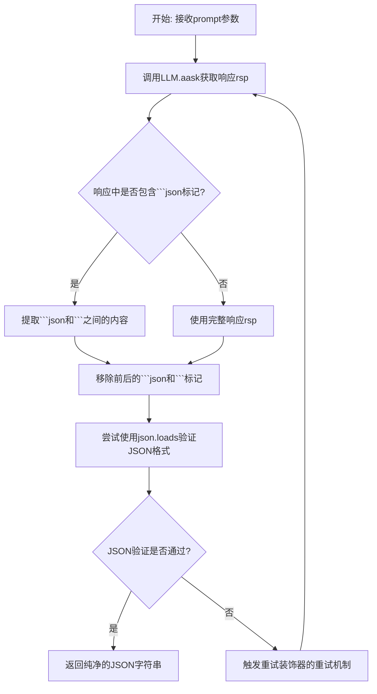
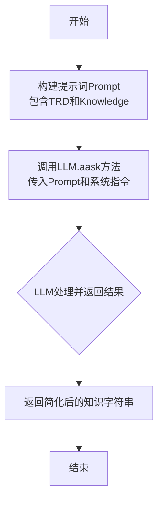

# `.\MetaGPT\metagpt\actions\requirement_analysis\framework\write_framework.py` 详细设计文档

该代码实现了一个名为 WriteFramework 的 Action 类，其核心功能是根据技术需求文档（TRD）、用例参与者描述、外部接口确认、历史输出、评估结论以及附加技术约束，通过调用大语言模型（LLM）生成一个完整的软件框架代码。该框架包括项目结构、类图、序列图、源代码文件和配置文件，并以结构化的 JSON 格式返回。

## 整体流程



## 类结构

```
Action (基类，来自 metagpt.actions)
└── WriteFramework (继承自 Action)
    ├── 类字段: llm (继承自 Action)
    ├── 类方法: run
    ├── 类方法: _write
    └── 类方法: _extract_external_interfaces
```

## 全局变量及字段


### `PROMPT`
    
一个多行字符串模板，用于生成指导LLM创建软件框架的提示词，包含所有必要的输入参数占位符。

类型：`str`
    


### `WriteFramework.llm`
    
一个大型语言模型实例，用于处理提示词并生成文本响应，是执行核心AI生成功能的关键依赖。

类型：`LLM (Large Language Model)`
    
    

## 全局函数及方法

### `WriteFramework.run`

`WriteFramework.run` 方法是 `WriteFramework` 类的核心异步方法，负责根据输入的技术需求文档（TRD）及相关信息，生成一个完整的软件框架。该方法首先通过内部方法提取外部接口信息，然后组装提示词（Prompt），最后调用大语言模型（LLM）生成框架代码，并对返回的JSON格式结果进行验证和清理。

参数：

- `use_case_actors`：`str`，描述用例图中涉及的参与者（Actor）、系统（System）和外部系统（External System）。
- `trd`：`str`，详细描述需求的技术需求文档（Technical Requirements Document）。
- `acknowledge`：`str`，外部接口知识或需要确认的接口信息。
- `legacy_output`：`str`，上一次由`WriteFramework.run`生成的软件框架代码，用于迭代改进。
- `evaluation_conclusion`：`str`，对需求评估的结论，用于指导对旧框架的改进。
- `additional_technical_requirements`：`str`，任何额外的技术约束或要求（如编程语言、框架等）。

返回值：`str`，生成的软件框架代码，格式为JSON字符串，包含文件路径、文件名和文件内容。

#### 流程图



#### 带注释源码

```python
    async def run(
        self,
        *,
        use_case_actors: str,
        trd: str,
        acknowledge: str,
        legacy_output: str,
        evaluation_conclusion: str,
        additional_technical_requirements: str,
    ) -> str:
        """
        Run the action to generate a software framework based on the provided TRD and related information.

        Args:
            use_case_actors (str): Description of the use case actors involved.
            trd (str): Technical Requirements Document detailing the requirements.
            acknowledge (str): External acknowledgements or acknowledgements required.
            legacy_output (str): Previous version of the software framework returned by `WriteFramework.run`.
            evaluation_conclusion (str): Conclusion from the evaluation of the requirements.
            additional_technical_requirements (str): Any additional technical requirements.

        Returns:
            str: The generated software framework as a string.

        Example:
            >>> write_framework = WriteFramework()
            >>> use_case_actors = "- Actor: game player;\\n- System: snake game; \\n- External System: game center;"
            >>> trd = "## TRD\\n..."
            >>> acknowledge = "## Interfaces\\n..."
            >>> legacy_output = '{"path":"balabala", "filename":"...", ...'
            >>> evaluation_conclusion = "Balabala..."
            >>> constraint = "Using Java language, ..."
            >>> framework = await write_framework.run(
            >>>    use_case_actors=use_case_actors,
            >>>    trd=trd,
            >>>    acknowledge=acknowledge,
            >>>    legacy_output=framework,
            >>>    evaluation_conclusion=evaluation_conclusion,
            >>>    additional_technical_requirements=constraint,
            >>> )
            >>> print(framework)
            {"path":"balabala", "filename":"...", ...

        """
        # 步骤1: 从知识库中提取TRD实际使用的外部接口，过滤无关信息。
        acknowledge = await self._extract_external_interfaces(trd=trd, knowledge=acknowledge)
        # 步骤2: 将输入参数格式化并填充到预定义的PROMPT模板中。
        prompt = PROMPT.format(
            use_case_actors=use_case_actors,
            trd=to_markdown_code_block(val=trd),
            acknowledge=to_markdown_code_block(val=acknowledge),
            legacy_output=to_markdown_code_block(val=legacy_output),
            evaluation_conclusion=evaluation_conclusion,
            additional_technical_requirements=to_markdown_code_block(val=additional_technical_requirements),
        )
        # 步骤3: 调用内部方法，将组装好的Prompt发送给LLM并处理返回结果。
        return await self._write(prompt)
```

### `WriteFramework._write`

该方法是一个重试装饰的异步方法，负责处理由LLM生成的响应字符串。它从响应中提取JSON格式的代码块，验证其JSON格式的有效性，并返回纯净的JSON字符串。

参数：
-  `prompt`：`str`，发送给大语言模型（LLM）的提示词字符串。

返回值：`str`，从LLM响应中提取并验证后的、纯净的JSON格式字符串。

#### 流程图



#### 带注释源码

```python
    @retry(
        wait=wait_random_exponential(min=1, max=20), # 重试等待策略：指数随机等待，最小1秒，最大20秒
        stop=stop_after_attempt(6), # 停止策略：最多重试6次后停止
        after=general_after_log(logger), # 重试后执行的回调函数，用于记录日志
    )
    async def _write(self, prompt: str) -> str:
        # 调用大语言模型（LLM）的异步接口，传入提示词，获取响应
        rsp = await self.llm.aask(prompt)
        # 注释：此处明确说明不使用`CodeParser`进行解析。
        # 定义用于标记JSON代码块的标签
        tags = ["```json", "```"]
        # 查找第一个```json标签的起始位置
        bix = rsp.find(tags[0])
        # 查找最后一个```标签的起始位置
        eix = rsp.rfind(tags[1])
        # 如果找到了```json标签，则提取从该标签开始到最后一个```标签结束之间的内容
        if bix >= 0:
            rsp = rsp[bix : eix + len(tags[1])]
        # 移除字符串开头可能存在的"```json"和结尾可能存在的"```"，得到纯净的JSON字符串
        json_data = rsp.removeprefix("```json").removesuffix("```")
        # 使用json.loads验证提取出的字符串是否为有效的JSON格式，如果无效会抛出json.JSONDecodeError异常
        json.loads(json_data)  # validate
        # 返回验证通过的纯净JSON字符串
        return json_data
```

### `WriteFramework._extract_external_interfaces`

该方法用于从给定的“知识”（Knowledge）中提取与“技术需求文档”（TRD）相关的外部接口信息。它通过向大型语言模型（LLM）发送一个提示，要求模型识别TRD中使用的接口，并从知识库中移除那些未被TRD使用的接口相关内容，从而返回一个简化的、只包含相关接口信息的“知识”字符串。

参数：

- `trd`：`str`，技术需求文档（TRD）的详细内容。
- `knowledge`：`str`，包含外部接口等信息的原始知识库内容。

返回值：`str`，经过LLM处理后的、仅包含TRD中提及的外部接口相关信息的简化知识字符串。

#### 流程图



#### 带注释源码

```python
    @retry(
        wait=wait_random_exponential(min=1, max=20), # 使用指数退避策略等待重试，最小1秒，最大20秒
        stop=stop_after_attempt(6), # 最多重试6次后停止
        after=general_after_log(logger), # 重试后记录日志
    )
    async def _extract_external_interfaces(self, trd: str, knowledge: str) -> str:
        # 构建提示词，将TRD和Knowledge格式化为Markdown代码块
        prompt = f"## TRD\n{to_markdown_code_block(val=trd)}\n\n## Knowledge\n{to_markdown_code_block(val=knowledge)}\n"
        # 调用LLM的异步ask方法，传入提示词和系统指令
        rsp = await self.llm.aask(
            prompt,
            system_msgs=[
                "You are a tool that removes impurities from articles; you can remove irrelevant content from articles.",
                'Identify which interfaces are used in "TRD"? Remove the relevant content of the interfaces NOT used in "TRD" from "Knowledge" and return the simplified content of "Knowledge".',
            ],
        )
        # 返回LLM处理后的结果
        return rsp
```

## 关键组件


### 张量索引与惰性加载

代码中未直接涉及张量索引与惰性加载机制。该组件通常用于高效处理大型数据集或模型参数，通过按需加载数据块来减少内存占用。在本代码中，数据处理主要围绕文本（TRD文档、知识库内容）的解析和LLM的交互，不涉及数值张量操作。

### 反量化支持

代码中未涉及反量化（Dequantization）支持。反量化通常指将低精度（如INT8）的量化数据转换回高精度（如FP32）格式的过程，常见于模型推理优化。本代码的核心功能是文本处理和基于LLM的代码生成，属于自然语言处理领域，不涉及数值模型的量化与反量化。

### 量化策略

代码中未涉及量化（Quantization）策略。量化策略通常指为了减少模型存储空间和加速计算而将模型参数从高精度浮点数转换为低精度整数的方法和配置。本代码实现的是一个基于规则和LLM的软件框架生成动作，其“策略”体现在提示工程（PROMPT模板）和重试逻辑上，而非数值模型的量化。


## 问题及建议


### 已知问题

-   **JSON解析容错性不足**：`_write`方法在提取和解析JSON时，使用了硬编码的标记`["```json", "```"]`进行查找，并直接调用`json.loads()`进行验证。如果大语言模型（LLM）的响应格式与预期不符（例如，使用了不同的代码块标记如`~~~json`，或JSON格式错误），此方法将抛出异常，导致重试或最终失败。
-   **外部接口提取逻辑依赖LLM且缺乏验证**：`_extract_external_interfaces`方法完全依赖LLM来理解TRD和知识库，并执行“杂质去除”任务。该过程没有对LLM的输出进行结构化验证或后处理，如果LLM未能正确理解指令或返回了无关内容，可能导致后续框架生成步骤基于不准确或缺失的接口信息。
-   **提示词（PROMPT）内容冗长且为硬编码**：`PROMPT`模板字符串内容非常长，直接嵌入在代码中。这降低了代码的可读性和可维护性。如果需要调整提示词的结构或内容，必须直接修改源代码，增加了出错风险且不利于多环境配置。
-   **方法职责边界模糊**：`run`方法承担了过多的协调职责，包括调用`_extract_external_interfaces`处理输入、组装复杂的提示词、以及调用`_write`生成输出。这使得`run`方法变得臃肿，且单元测试难度增加，因为需要模拟多个内部方法调用和LLM交互。
-   **缺乏输入验证与清理**：所有输入参数（如`trd`, `acknowledge`等）在传入`run`方法后没有进行基本的有效性检查（如非空检查、格式初筛）或清理（如去除多余空白字符）。无效或格式混乱的输入可能直接导致LLM调用失败或产生无意义的输出。

### 优化建议

-   **增强JSON处理的健壮性**：在`_write`方法中，实现一个更健壮的JSON提取和解析函数。可以尝试使用正则表达式匹配更灵活的代码块模式，并在`json.loads`调用周围添加更详细的异常处理，记录解析失败的原始响应，便于调试。也可以考虑使用`json.JSONDecodeError`异常来提供更清晰的错误信息。
-   **为外部接口提取增加后处理与验证层**：在`_extract_external_interfaces`方法返回后，可以增加一个验证步骤。例如，检查返回的文本是否确实包含预期的接口关键词，或者尝试将其解析为某种结构化的格式（如列表）以确保质量。也可以考虑提供一种回退机制，当LLM提取失败时，返回原始的知识库内容或一个安全的默认值。
-   **将提示词外部化**：将`PROMPT`模板字符串移出代码，存储到配置文件（如YAML、JSON）或单独的模板文件中。这样可以在不修改代码的情况下调整提示词，也便于为不同场景（如开发、测试、生产）使用不同的提示词版本。
-   **重构以遵循单一职责原则**：考虑将`run`方法中的步骤拆分为更小、更专注的私有方法或辅助函数。例如，可以分离出`_prepare_input_data`方法负责处理`acknowledge`和组装输入数据，`_build_prompt`方法专门负责构建发送给LLM的提示词。这可以提高代码的可测试性和可读性。
-   **添加输入参数验证**：在`run`方法的开始处，添加对关键输入参数（特别是`trd`）的验证。确保它们不为空或仅包含空白字符。对于字符串参数，可以进行基本的修剪（trim）操作。可以使用Pydantic模型或简单的断言来实现，并在验证失败时抛出具有描述性的`ValueError`。
-   **考虑缓存机制**：鉴于`_extract_external_interfaces`和`_write`方法都可能被频繁调用且涉及成本较高的LLM API调用，可以考虑为相同的输入引入缓存机制（例如，使用`functools.lru_cache`或外部缓存如Redis），以提升性能并降低API成本。需要注意缓存键的设计应包含所有相关输入参数。
-   **改进错误处理与日志**：当前的重试机制（`tenacity`）已经提供了基本的重试逻辑。可以进一步丰富日志内容，在重试时记录尝试次数和失败原因，在最终成功或失败时记录更详细的结果摘要。这有助于监控和故障排查。


## 其它


### 设计目标与约束

本模块的核心设计目标是作为一个智能代理（Action），根据技术需求文档（TRD）及相关输入，自动生成一个结构化的软件框架。其核心约束包括：
1.  **输入驱动**：框架的生成严格依赖于输入的TRD、用例参与者、评估结论、遗留输出等技术信息。
2.  **格式约束**：输出必须是一个符合特定结构的JSON对象列表，包含路径、文件名和内容。
3.  **外部接口最小化**：仅实现TRD中明确使用的外部系统接口，通过`_extract_external_interfaces`方法进行过滤。
4.  **LLM依赖**：核心的框架生成和接口提取逻辑依赖于底层大语言模型（LLM）的能力，通过`self.llm.aask`调用。
5.  **向后兼容与迭代**：能够接收并参考上一次生成的框架（`legacy_output`），结合新的评估结论（`evaluation_conclusion`）进行改进。

### 错误处理与异常设计

模块通过装饰器和显式验证来处理潜在错误：
1.  **重试机制**：`_write`和`_extract_external_interfaces`方法均使用`@retry`装饰器，在LLM调用失败或返回格式异常时进行指数退避重试（最多6次），以应对网络波动或LLM服务不稳定。
2.  **JSON格式验证**：在`_write`方法中，从LLM响应提取JSON字符串后，使用`json.loads()`进行解析验证。如果JSON格式无效，将抛出`json.JSONDecodeError`异常，触发重试机制。
3.  **响应解析容错**：`_write`方法通过查找"```json"和"```"标记来定位响应中的JSON代码块，即使LLM的响应包含额外的前缀或后缀文本，也能尝试提取有效部分。
4.  **日志记录**：重试装饰器配置了`after=general_after_log(logger)`，在每次重试尝试后记录日志，便于监控和调试。

### 数据流与状态机

模块的数据流清晰，无复杂内部状态，主要流程如下：
1.  **输入汇聚**：`run`方法接收多个字符串参数（用例参与者、TRD等）。
2.  **数据预处理**：调用`_extract_external_interfaces`方法，使用LLM过滤出TRD中实际使用的外部接口知识。
3.  **提示词构建**：将所有输入参数（包括处理后的`acknowledge`）格式化为一个结构化的提示词（`PROMPT`模板）。
4.  **LLM调用与生成**：将构建好的提示词传递给`_write`方法，该方法调用LLM生成包含软件框架的JSON响应。
5.  **响应后处理与验证**：`_write`方法从LLM响应中提取JSON代码块，并验证其格式。
6.  **输出**：将验证通过的JSON字符串作为最终结果返回。

整个过程是线性的、无状态的，每次调用都是独立的。

### 外部依赖与接口契约

1.  **外部依赖**：
    *   **`tenacity`库**：提供重试装饰器，实现弹性调用。
    *   **`metagpt.actions.Action`基类**：提供`WriteFramework`类的行为基类定义和可能的上下文（如`self.llm`）。
    *   **`metagpt.tools.tool_registry.register_tool`装饰器**：用于将此类注册为可用工具。
    *   **`metagpt.utils.common.to_markdown_code_block`函数**：用于将文本包装为Markdown代码块格式。
    *   **`json`标准库**：用于JSON数据的解析和验证。

2.  **接口契约**：
    *   **输入契约**：`run`方法定义了明确的参数列表、类型（均为`str`）和描述。调用者必须提供这些信息。
    *   **输出契约**：`run`方法承诺返回一个字符串，该字符串是一个有效的JSON数组，其每个元素是一个包含`path`、`filename`、`content`键的对象。这构成了与下游组件（如文件写入器）的契约。
    *   **LLM服务契约**：`self.llm.aask`方法被期望接收一个提示词字符串和可选的系统消息，并返回一个文本响应。模块的性能和质量高度依赖于该LLM服务的可靠性和能力。
    *   **工具注册契约**：通过`@register_tool`装饰，此类承诺提供一个`run`方法作为其主要执行入口，以便在更大的Agent或工作流系统中被发现和调用。

    