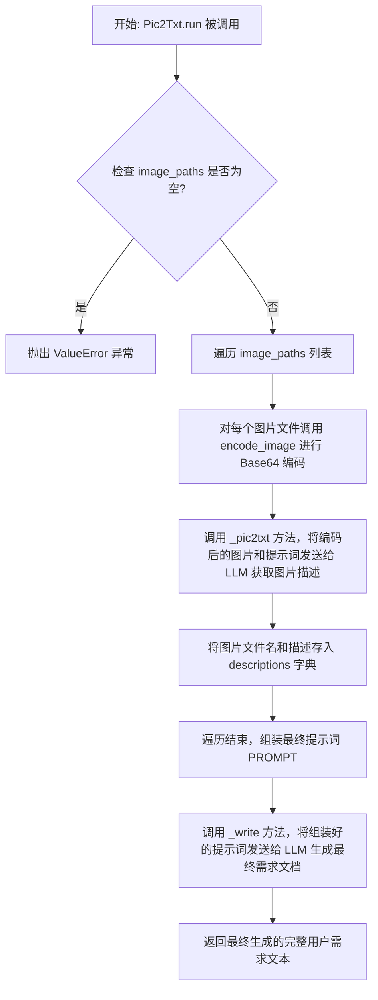
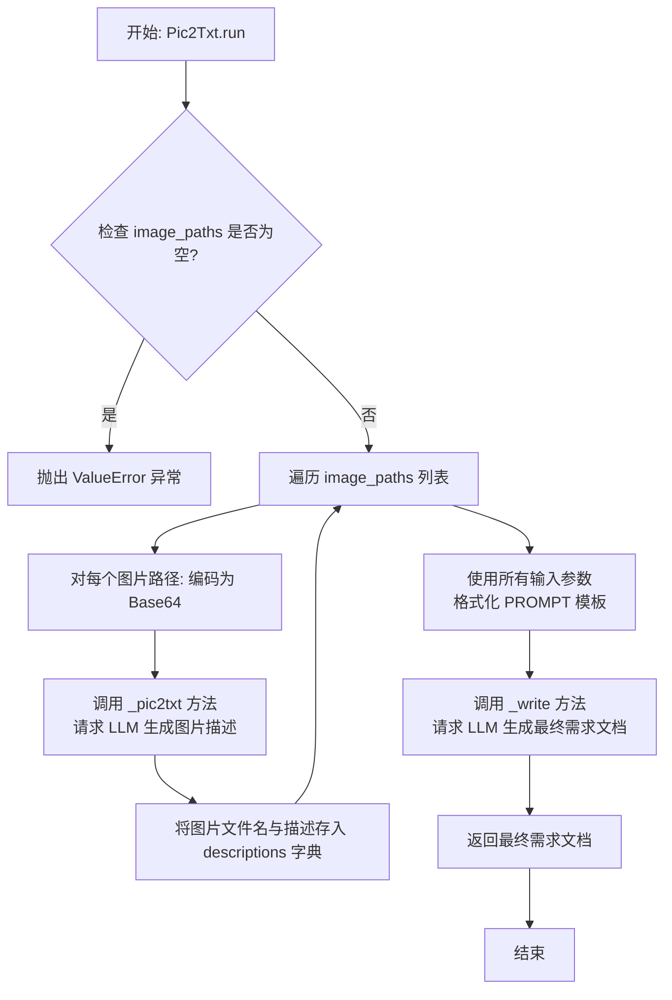
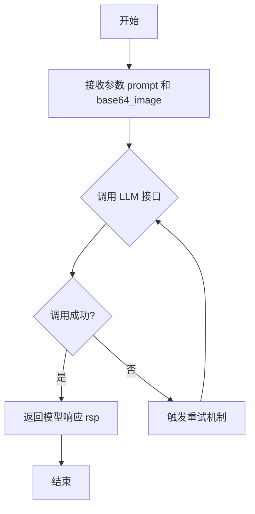

# `.\MetaGPT\metagpt\actions\requirement_analysis\requirement\pic2txt.py` 详细设计文档

该代码实现了一个名为 Pic2Txt 的动作类，其核心功能是处理包含用户需求的图片和文本片段，通过调用大语言模型（LLM）的视觉理解能力，将图片内容转换为文本描述，并最终整合所有信息（包括已有的文本需求、历史输出、评估结论和技术要求），生成一份完整、连贯、自然的文本化用户需求文档。

## 整体流程



## 类结构

```
Action (基类，来自 metagpt.actions)
└── Pic2Txt (继承自 Action，注册为工具)
```

## 全局变量及字段


### `PROMPT`
    
一个多行字符串模板，用于构建最终发送给大语言模型的提示词，它整合了文本需求、图片描述、历史输出、评估结论和附加技术需求等所有输入信息。

类型：`str`
    


    

## 全局函数及方法


### `Pic2Txt.run`

该方法接收一系列图片路径和相关的文本上下文，通过调用视觉语言模型（LLM）分析图片内容，生成图片描述，并结合所有输入信息（包括历史输出、评估结论等），最终生成一份完整、连贯的文本化用户需求文档。

参数：

-  `image_paths`：`List[str]`，输入图片的文件路径列表，这些图片描绘了用户需求。
-  `textual_user_requirement`：`str`，可选的、与图片一同提供的文本化用户需求片段。
-  `legacy_output`：`str`，可选的、上一次调用该方法生成的完整用户需求文本，用于迭代改进。
-  `evaluation_conclusion`：`str`，可选的、基于之前处理结果的评估结论或反馈。
-  `additional_technical_requirements`：`str`，可选的、与需求生成过程相关的补充性技术细节或要求。

返回值：`str`，从提供的图片和文本上下文中提取并整合生成的完整文本化用户需求。

#### 流程图



#### 带注释源码

```python
async def run(
    self,
    *,
    image_paths: List[str],
    textual_user_requirement: str = "",
    legacy_output: str = "",
    evaluation_conclusion: str = "",
    additional_technical_requirements: str = "",
) -> str:
    """
    给定一些描绘用户需求的图片以及上下文描述，写出完整的文本化用户需求。

    Args:
        image_paths (List[str]): 输入图片的文件路径列表，这些图片描绘了用户需求。
        textual_user_requirement (str, optional): 与给定图片一同提供的文本化用户需求（如果有的话）。
        legacy_output (str, optional): 你上次生成的完整文本化用户需求（如果有的话）。
        evaluation_conclusion (str, optional): 基于已处理需求的结论或评估。
        additional_technical_requirements (str, optional): 与该过程相关的任何补充技术细节。

    Returns:
        str: 从提供的图片中提取的用户需求的文本表示。

    Raises:
        ValueError: 如果 image_paths 列表为空。
        OSError: 如果访问或读取图像文件时出现问题。

    Example:
        >>> images = ["requirements/pic/1.png", "requirements/pic/2.png", "requirements/pic/3.png"]
        >>> textual_user_requirements = "User requirement paragraph 1 ..., . paragraph 2......"
        >>> action = Pic2Txt()
        >>> intact_textual_user_requirements = await action.run(image_paths=images, textual_user_requirement=textual_user_requirements)
        >>> print(intact_textual_user_requirements)
        "User requirement paragraph 1 ...,  This picture describes... paragraph 2......"
    """
    # 初始化一个字典，用于存储图片文件名和其对应的描述
    descriptions = {}
    # 遍历输入的每张图片路径
    for i in image_paths:
        # 将路径字符串转换为 Path 对象，便于操作
        filename = Path(i)
        # 调用工具函数将图片文件编码为 Base64 字符串
        base64_image = encode_image(filename)
        # 调用内部方法 _pic2txt，请求 LLM 根据图片内容生成一段描述性文字
        rsp = await self._pic2txt(
            "Generate a paragraph of text based on the content of the image, the language of the text is consistent with the language in the image.",
            base64_image=base64_image,
        )
        # 将图片文件名（不含路径）作为键，LLM 生成的描述作为值，存入字典
        descriptions[filename.name] = rsp

    # 使用所有输入参数和生成的图片描述，格式化预定义的 PROMPT 模板
    prompt = PROMPT.format(
        textual_user_requirement=textual_user_requirement,
        # 将图片描述字典转换为格式化的 JSON Markdown 代码块
        acknowledge=to_markdown_code_block(val=json.dumps(descriptions), type_="json"),
        # 将历史输出转换为 Markdown 代码块
        legacy_output=to_markdown_code_block(val=legacy_output),
        evaluation_conclusion=evaluation_conclusion,
        # 将附加技术需求转换为 Markdown 代码块
        additional_technical_requirements=to_markdown_code_block(val=additional_technical_requirements),
    )
    # 调用内部方法 _write，将组装好的 prompt 发送给 LLM，生成并返回最终的完整需求文档
    return await self._write(prompt)
```


### `Pic2Txt._write`

`Pic2Txt._write` 方法是 `Pic2Txt` 类的核心私有方法，负责将经过组装的提示词（`prompt`）发送给大语言模型（LLM）并获取其生成的文本响应。该方法被 `@retry` 装饰器包装，具备指数退避的重试机制，以增强在网络不稳定或LLM服务暂时不可用情况下的鲁棒性。

参数：

-  `prompt`：`str`，发送给大语言模型的完整提示词文本，其中包含了用户需求文本片段、图片描述、历史输出、评估结论和附加技术需求等信息。

返回值：`str`，大语言模型根据提示词生成的、完整的、连贯的用户需求文本。

#### 流程图

```mermaid
graph TD
    A[开始: 调用 _write 方法] --> B{输入参数: prompt};
    B --> C[使用 @retry 装饰器进行重试逻辑];
    C --> D[调用 self.llm.aask(prompt) 异步请求LLM];
    D --> E{请求成功?};
    E -- 是 --> F[返回LLM响应文本 rsp];
    E -- 否/异常 --> G[触发重试机制];
    G --> H{重试次数 < 6?};
    H -- 是 --> I[等待随机指数时间后];
    I --> D;
    H -- 否 --> J[重试耗尽，抛出异常];
    J --> K[结束];
    F --> K;
```

#### 带注释源码

```python
    @retry(
        wait=wait_random_exponential(min=1, max=20),  # 重试等待策略：随机指数退避，最小1秒，最大20秒
        stop=stop_after_attempt(6),                   # 停止条件：最多重试6次
        after=general_after_log(logger),              # 重试后动作：记录日志
    )
    async def _write(self, prompt: str) -> str:
        # 核心操作：异步调用大语言模型的 `aask` 方法，传入组装好的提示词。
        # `self.llm` 是 `Action` 基类提供的语言模型客户端实例。
        rsp = await self.llm.aask(prompt)
        # 返回大语言模型生成的文本响应。
        return rsp
```


### `Pic2Txt._pic2txt`

该方法是一个异步方法，用于向大语言模型（LLM）发送一个包含图片的提示，并获取模型生成的文本描述。它被设计为可重试的，以应对网络或服务的不稳定性。

参数：

- `prompt`：`str`，发送给大语言模型的文本提示，用于指导模型如何描述图片内容。
- `base64_image`：`str`，经过Base64编码的图片数据字符串。

返回值：`str`，大语言模型根据图片和提示生成的文本描述。

#### 流程图



#### 带注释源码

```python
    @retry(
        wait=wait_random_exponential(min=1, max=20), # 重试等待策略：指数退避，最小1秒，最大20秒
        stop=stop_after_attempt(6), # 停止策略：最多重试6次
        after=general_after_log(logger), # 重试后执行的回调函数，用于记录日志
    )
    async def _pic2txt(self, prompt: str, base64_image: str) -> str:
        # 调用大语言模型的异步接口，发送提示和图片数据
        rsp = await self.llm.aask(prompt, images=base64_image)
        # 返回模型生成的文本响应
        return rsp
```

## 关键组件


### 图像处理与编码

通过 `encode_image` 函数将图片文件路径转换为 Base64 编码的字符串，以便于后续通过大语言模型（LLM）进行图像内容理解。

### 大语言模型（LLM）驱动的图像内容理解

通过 `_pic2txt` 方法调用 LLM，根据给定的提示词和 Base64 编码的图像，生成对图像内容的文本描述。

### 基于模板的文本整合与生成

使用预定义的 `PROMPT` 模板，将原始文本需求、图像描述、历史输出、评估结论和附加技术需求等信息结构化，并通过 `_write` 方法调用 LLM 生成最终整合后的、完整且连贯的用户需求文本。

### 重试与容错机制

利用 `tenacity` 库为 `_write` 和 `_pic2txt` 方法添加了指数退避重试逻辑，以增强在调用外部 LLM 服务时的鲁棒性和容错能力。

### 工具注册与集成

通过 `@register_tool` 装饰器将 `Pic2Txt` 类注册为一个可用的工具，使其能够被框架内的其他组件发现和调用，实现了功能的模块化和可复用性。


## 问题及建议


### 已知问题

-   **硬编码的提示词模板**：`PROMPT` 变量作为全局字符串常量硬编码在代码中。这降低了代码的可维护性和可配置性，当需要调整提示词逻辑或支持多语言时，必须直接修改源代码。
-   **缺乏输入验证与错误处理**：`run` 方法虽然声明了可能抛出 `ValueError` 和 `OSError`，但仅在文档中说明。代码中并未对 `image_paths` 列表为空或 `encode_image` 可能引发的文件访问错误进行主动检查和处理，依赖调用方或底层函数抛出异常，健壮性不足。
-   **潜在的资源泄漏与性能问题**：`run` 方法通过循环同步调用 `encode_image` 处理多张图片。如果图片数量多或体积大，可能占用大量内存且是同步阻塞操作，未充分利用异步IO的优势，可能影响整体性能。
-   **方法职责边界模糊**：`_pic2txt` 方法接收一个通用的 `prompt` 参数，但其内部逻辑（调用 `llm.aask` 并传入 `images` 参数）表明它专门用于图像描述生成。这种设计使得方法名与具体实现强耦合，通用性差，且提示词内容在调用处硬编码，不利于复用和测试。
-   **配置参数硬编码**：`@retry` 装饰器中的重试策略（如 `wait_random_exponential(min=1, max=20)` 和 `stop_after_attempt(6)`）直接硬编码在方法定义中。这使得调整重试逻辑（例如根据不同环境或LLM服务特性）变得困难，缺乏灵活性。

### 优化建议

-   **外部化配置提示词与参数**：将 `PROMPT` 模板字符串以及 `@retry` 装饰器的参数（如等待时间、重试次数）移至配置文件（如 YAML、JSON）或环境变量中管理。通过依赖注入或从配置中心读取的方式加载，提升代码的可维护性和部署灵活性。
-   **增强输入验证与防御性编程**：在 `run` 方法开始处显式检查 `image_paths` 是否为空列表，并立即抛出清晰的 `ValueError`。使用 `try...except` 块捕获 `encode_image` 可能抛出的 `OSError` 等异常，并记录详细日志或转换为更合适的业务异常向上传递，提高代码健壮性。
-   **优化图片处理流程**：考虑使用异步IO来并行处理多张图片的编码和描述生成。例如，利用 `asyncio.gather` 并发调用 `_pic2txt` 方法，以减少总体的I/O等待时间，提升处理效率。
-   **重构与明确方法职责**：考虑将 `_pic2txt` 方法拆分为更细粒度的函数。例如，一个纯函数用于构造图像描述的提示词，另一个异步函数专门负责调用带图像输入的LLM。或者，将硬编码的提示词内容提取为类常量或配置项，使 `_pic2txt` 方法更专注于“调用视觉模型”这一单一职责。
-   **引入配置类或工厂模式**：创建一个配置类（如 `Pic2TxtConfig`）来集中管理重试策略、提示词模板、模型选择等参数。通过依赖注入将该配置类的实例传递给 `Pic2Txt` 类的构造函数，使得在不同场景下定制组件行为更加方便，也便于单元测试的Mock。


## 其它


### 设计目标与约束

该代码的设计目标是提供一个能够从包含用户需求的图片中提取并整合出完整、连贯的文本化用户需求的工具。核心约束包括：必须能够处理多张图片；需要结合已有的文本片段、历史输出、评估结论和附加技术需求进行综合生成；必须通过重试机制保证在调用外部大语言模型（LLM）服务时的鲁棒性；生成的输出需要是自然、连贯的Markdown格式文本。

### 错误处理与异常设计

代码中明确声明了两种可能抛出的异常：当`image_paths`列表为空时抛出`ValueError`；当访问或读取图片文件出现问题时抛出`OSError`。主要的错误处理机制体现在两个核心方法`_write`和`_pic2txt`上，它们都使用了`@retry`装饰器。该装饰器配置了指数退避等待策略（`wait_random_exponential`）和最大尝试次数限制（`stop_after_attempt(6)`），用于在网络请求失败或LLM服务不稳定时自动重试，以提高整体流程的容错性。重试前后的日志记录通过`general_after_log`函数处理。

### 数据流与状态机

1.  **输入数据流**：`run`方法接收多个输入源：图片路径列表、文本需求片段、历史输出、评估结论、附加技术需求。
2.  **内部处理流**：
    a.  **图片解析流**：遍历`image_paths`，对每张图片进行Base64编码，然后通过`_pic2txt`方法调用LLM生成图片描述，结果存入`descriptions`字典。
    b.  **提示词构建流**：将输入参数和图片描述字典格式化到预定义的`PROMPT`模板中，构建出给LLM的完整指令。
    c.  **需求生成流**：通过`_write`方法将构建好的提示词发送给LLM，生成最终的完整文本化用户需求。
3.  **输出数据流**：`run`方法返回一个字符串，即LLM生成的、整合了所有输入信息的完整用户需求文本。
4.  **状态**：该类本质上是无状态的（Stateless），每次`run`调用都是独立的。重试机制引入了短暂的“尝试-失败-等待-重试”循环状态，但对业务逻辑透明。

### 外部依赖与接口契约

1.  **大语言模型 (LLM) 服务**：通过父类`Action`继承或注入的`self.llm`对象进行交互。`_pic2txt`和`_write`方法分别调用其`aask`方法。这是最核心的外部依赖，其可用性和响应格式直接决定了本工具的功能。
2.  **`tenacity` 库**：用于实现重试逻辑，是保证可靠性的关键依赖。
3.  **`metagpt` 框架内部组件**：
    *   `Action` 基类：提供基础的动作执行框架和可能的`llm`客户端。
    *   `register_tool` 装饰器：用于将本类注册到框架的工具注册表中，声明其对外暴露的接口（`run`方法）。
    *   `encode_image` 函数：用于将图片文件转换为Base64字符串。
    *   `to_markdown_code_block` 函数：用于将文本或JSON数据格式化为Markdown代码块。
    *   `general_after_log` 函数和 `logger`：用于重试过程中的日志记录。
4.  **接口契约**：`run`方法的参数列表和返回类型构成了该工具的主要对外契约。它被设计为异步接口，接收结构化的输入并返回一个字符串结果。通过`register_tool`装饰器，此契约被注册到更大的系统中供其他组件调用。

    