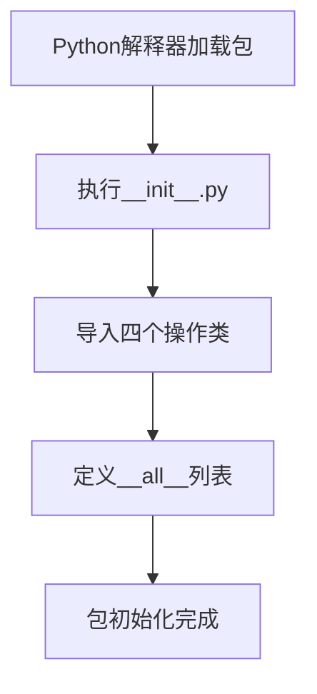

# `.\MetaGPT\metagpt\actions\requirement_analysis\trd\__init__.py` 详细设计文档

这是一个Python包的初始化文件，它实现了RFC243规范，主要功能是导入并公开一组用于需求分析的技术需求文档（TRD）处理相关的操作类，包括检测交互、评估TRD、编写TRD和压缩外部接口。

## 整体流程



## 类结构

```
metagpt.actions.requirement_analysis.trd (Python包)
├── __init__.py (当前文件)
├── detect_interaction.py (包含DetectInteraction类)
├── evaluate_trd.py (包含EvaluateTRD类)
├── write_trd.py (包含WriteTRD类)
└── compress_external_interfaces.py (包含CompressExternalInterfaces类)
```

## 全局变量及字段


### `__all__`
    
一个公开导出的模块变量列表，定义了当前包（__init__.py文件所在目录）对外暴露的、可导入的类，这些类均继承自Action基类，用于需求分析阶段的TRD（技术需求文档）相关操作。

类型：`List[Type[Action]]`
    


    

## 全局函数及方法


## 关键组件


### CompressExternalInterfaces

一个用于压缩外部接口的组件，旨在优化或简化系统与外部服务或模块之间的交互接口。

### DetectInteraction

一个用于检测交互的组件，负责识别和分析系统内部或系统与外部实体之间的交互行为。

### WriteTRD

一个用于编写技术需求文档（TRD）的组件，负责根据分析结果生成结构化的技术需求文档。

### EvaluateTRD

一个用于评估技术需求文档（TRD）的组件，负责对已编写的技术需求文档进行质量、完整性和可行性评估。


## 问题及建议


### 已知问题

-   **模块导入与导出不一致**：`__all__` 列表中导出的是类对象本身（如 `CompressExternalInterfaces`），而按照 Python 惯例，`__all__` 应包含字符串形式的模块公开成员名称。这可能导致在使用 `from module import *` 时，某些工具或 IDE 无法正确识别导出的成员。
-   **缺少模块级文档**：虽然文件头部有基本的元信息（时间、作者、文件、RFC链接），但缺少对该 `__init__.py` 文件具体作用的描述，即它如何组织或重新导出其子模块中的功能，这对于新开发者理解模块结构不够清晰。
-   **潜在的循环导入风险**：该 `__init__.py` 文件从其子模块（如 `metagpt.actions.requirement_analysis.trd.detect_interaction`）导入多个类。如果这些子模块反过来尝试从当前包或兄弟模块导入，可能会引发循环导入错误，尤其是在包结构复杂时。
-   **硬编码的RFC链接**：文档字符串中的RFC链接（`https://deepwisdom.feishu.cn/wiki/QobGwPkImijoyukBUKHcrYetnBb`）是硬编码的。如果该链接地址发生变化，所有引用了此文档字符串的代码都需要更新，维护性较差。

### 优化建议

-   **修正 `__all__` 列表**：将 `__all__` 中的内容改为字符串列表，例如 `__all__ = ["CompressExternalInterfaces", "DetectInteraction", "WriteTRD", "EvaluateTRD"]`。这符合 Python 标准，并能确保通配符导入 (`from module import *`) 和代码检查工具正常工作。
-   **补充模块职责描述**：在模块文档字符串中增加一段话，简要说明此 `__init__.py` 文件的作用。例如：“本文件作为 `metagpt.actions.requirement_analysis.trd` 包的入口点，集中导出用于技术需求文档（TRD）处理的核心操作类，以简化外部导入。”
-   **审视并解耦导入依赖**：检查从 `detect_interaction`、`evaluate_trd` 等子模块导入的类，确保这些子模块没有隐式或显式地导入当前 `__init__.py` 或形成循环依赖。必要时，可以考虑使用局部导入或在函数/方法内部导入来打破循环。
-   **将外部链接配置化或提供备用访问方式**：考虑将重要的外部文档链接（如RFC链接）移至配置文件、常量文件或通过环境变量管理。至少，可以在项目的主文档或README中提供核心资源的链接索引，减少代码中对易变URL的直接依赖。


## 其它


### 设计目标与约束

本模块旨在实现RFC-243中定义的TRD（Technical Requirements Document）生成流程。核心设计目标是将需求分析阶段中识别出的外部接口进行压缩、检测交互模式、评估TRD质量，并最终生成TRD文档。约束包括：必须遵循MetaGPT框架下的Action设计模式，确保各步骤可独立执行且结果可组合；模块需具备良好的可扩展性，以支持未来可能增加的TRD评估维度或交互检测算法。

### 错误处理与异常设计

模块中的各个Action类应遵循MetaGPT框架的异常处理规范。预期错误类型包括：输入数据格式错误（如非预期的数据结构）、外部依赖调用失败（如模型API调用异常）、以及业务逻辑错误（如无法检测到有效的交互模式）。每个Action的`run`方法应通过`try-except`块捕获异常，并抛出`ActionOutput`或封装了错误信息的特定异常，确保上层调用者能够获取明确的失败原因。对于可恢复的错误（如网络超时），应考虑实现重试机制。

### 数据流与状态机

数据流起始于原始的、可能冗余的外部接口列表（`List[ExternalInterface]`），经过`CompressExternalInterfaces` Action进行去重和合并，输出精简后的接口列表。此列表随后作为输入传递给`DetectInteraction` Action，该Action分析接口间的调用关系或数据依赖，输出交互模式信息（如`InteractionPattern`）。`WriteTRD` Action接收前两步的结果，结合需求上下文，生成初步的TRD文档草稿。最后，`EvaluateTRD` Action对生成的TRD草稿进行评估，输出评估结果（如评分或修改建议）。整个过程构成一个线性的、有状态的数据处理管道，每个Action的输出状态是下一个Action的输入状态。

### 外部依赖与接口契约

1.  **模型依赖**：`DetectInteraction`和`EvaluateTRD` Action可能依赖大型语言模型（LLM，如GPT系列）进行模式识别和文档评估。它们通过MetaGPT框架提供的`LLM`接口进行交互，契约是输入特定的提示词（Prompt）并接收结构化的文本输出。
2.  **框架依赖**：所有Action类继承自`metagpt.actions.ActionBase`，必须实现`run`方法，其输入和输出需符合`ActionOutput`或其它约定的数据结构。模块通过`__all__`列表对外暴露其公共接口。
3.  **数据契约**：各Action间传递的数据对象（如`ExternalInterface`, `InteractionPattern`, `TRDDocument`）应有明确的属性定义和类型注解，这些类型通常定义在`metagpt.schema`或相关模块中，构成了模块间数据交换的契约。

### 配置与可调参数

各Action的行为可能通过配置参数进行调整。例如：
*   `CompressExternalInterfaces`：可能包含相似度阈值参数，用于控制接口合并的严格程度。
*   `DetectInteraction`：可能包含用于引导LLM的提示词模板或模式匹配的规则配置。
*   `EvaluateTRD`：可能包含评估维度的权重配置或评分标准。
这些参数应设计为可通过Action的初始化参数或配置文件进行注入，以提高模块的灵活性和可测试性。

### 测试策略

针对本模块的测试应包含：
1.  **单元测试**：对每个Action的`run`方法进行独立测试，使用模拟（Mock）对象替代LLM调用等外部依赖，验证其内部逻辑和输入输出转换的正确性。
2.  **集成测试**：测试多个Action串联执行的数据流，验证整个TRD生成流程的端到端功能，可以使用轻量级模型或固定的模拟响应。
3.  **契约测试**：验证Action之间以及模块与外部框架之间数据接口的稳定性。
测试数据应覆盖典型场景、边界情况（如空输入、大量接口）和异常情况。

    