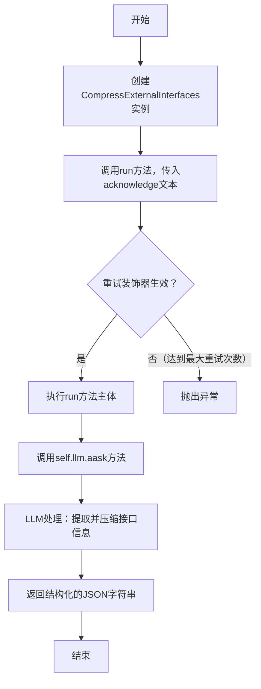
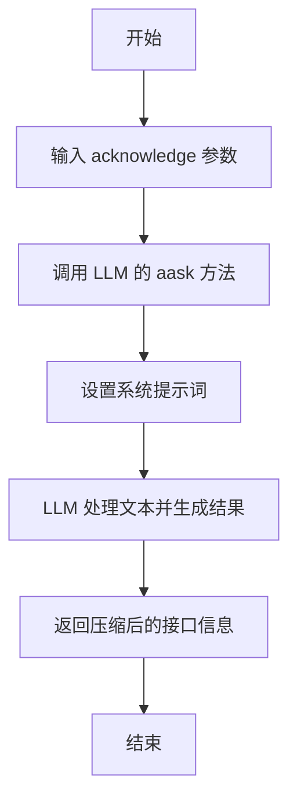

# `.\MetaGPT\metagpt\actions\requirement_analysis\trd\compress_external_interfaces.py` 详细设计文档

该代码实现了一个名为`CompressExternalInterfaces`的动作类，其核心功能是接收一段包含外部系统接口信息的自然文本（确认文本），通过调用大语言模型（LLM）提取并压缩这些接口信息，最终返回一个结构化的JSON列表，其中每个对象包含接口ID、输入参数和输出参数。

## 整体流程



## 类结构

```
Action (基类，来自metagpt.actions)
└── CompressExternalInterfaces (继承自Action，用于压缩外部接口信息)
```

## 全局变量及字段


    

## 全局函数及方法

### `CompressExternalInterfaces.run`

该方法用于从给定的自然语言确认文本中提取并压缩关于外部系统接口的信息。它通过调用大语言模型（LLM）来处理文本，并返回一个结构化的JSON列表，其中包含接口的ID、输入参数和输出参数。

参数：

- `acknowledge`：`str`，包含外部系统接口详细信息的自然语言确认文本。

返回值：`str`，压缩后的外部系统接口信息，以JSON格式的字符串返回。

#### 流程图



#### 带注释源码

```python
@retry(
    wait=wait_random_exponential(min=1, max=20),
    stop=stop_after_attempt(6),
    after=general_after_log(logger),
)
async def run(
    self,
    *,
    acknowledge: str,
) -> str:
    """
    Extracts and compresses information about external system interfaces from a given acknowledgement text.

    Args:
        acknowledge (str): A natural text of acknowledgement containing details about external system interfaces.

    Returns:
        str: A compressed version of the information about external system interfaces.

    Example:
        >>> compress_acknowledge = CompressExternalInterfaces()
        >>> acknowledge = "## Interfaces\\n..."
        >>> available_external_interfaces = await compress_acknowledge.run(acknowledge=acknowledge)
        >>> print(available_external_interfaces)
        ```json\n[\n{\n"id": 1,\n"inputs": {...
    """
    # 调用大语言模型的异步方法 aask，传入待处理的文本和系统提示词
    return await self.llm.aask(
        msg=acknowledge,  # 待处理的确认文本
        system_msgs=[
            "Extracts and compresses the information about external system interfaces.",  # 系统提示词1：说明任务目标
            "Return a markdown JSON list of objects, each object containing:\n"  # 系统提示词2：指定返回格式
            '- an "id" key containing the interface id;\n'  # 要求包含接口ID
            '- an "inputs" key containing a dict of input parameters that consist of name and description pairs;\n'  # 要求包含输入参数
            '- an "outputs" key containing a dict of returns that consist of name and description pairs;\n',  # 要求包含输出参数
        ],
    )
```

## 关键组件

### CompressExternalInterfaces 类

这是一个继承自 `Action` 的类，作为工具被注册，其核心功能是接收一段包含外部系统接口信息的自然文本，通过大语言模型（LLM）提取并压缩这些信息，最终返回一个结构化的 JSON 列表。

### 重试机制

通过 `@retry` 装饰器实现，当 `run` 方法执行失败时，会以指数退避策略（等待时间在1到20秒之间随机）自动重试，最多重试6次，并在每次重试前后记录日志，以提高操作的健壮性和容错性。

### 工具注册

通过 `@register_tool(include_functions=["run"])` 装饰器，将 `CompressExternalInterfaces` 类及其 `run` 方法注册到系统的工具注册表中，使其可以被其他组件发现和调用。

### 大语言模型（LLM）交互

在 `run` 方法内部，通过调用 `self.llm.aask` 方法与大语言模型进行交互。该方法将用户提供的文本（`acknowledge`）和一系列系统提示信息发送给 LLM，以指导其完成信息提取和压缩的任务，并返回 LLM 生成的响应。

## 问题及建议


### 已知问题

-   **硬编码的提示词**：`run` 方法中的 `system_msgs` 提示词是硬编码的字符串。这降低了代码的灵活性和可维护性。如果提示词需要根据不同的场景进行调整，或者需要支持多语言，就必须修改源代码。
-   **缺乏输入验证**：`run` 方法直接接收 `acknowledge` 字符串参数，但没有对其进行任何验证（例如，检查是否为空、是否为字符串类型）。这可能导致下游处理（如 LLM 调用）出现意外错误或产生无意义的结果。
-   **错误处理不充分**：虽然使用了 `tenacity` 库进行重试，但重试逻辑仅针对网络或 LLM 服务端的瞬时故障。对于业务逻辑错误（例如，LLM 返回了不符合预期的格式）、输入数据错误或认证失败等非重试性错误，没有明确的处理机制。`run` 方法可能直接抛出异常，调用方需要自行处理。
-   **依赖隐式上下文**：`run` 方法通过 `self.llm.aask` 调用 LLM，但 `self.llm` 的初始化和配置依赖于 `Action` 基类或其父类的上下文。这使得 `CompressExternalInterfaces` 类的可测试性降低，因为需要模拟或构建完整的 `Action` 上下文才能进行单元测试。
-   **返回格式耦合**：方法强制要求返回 Markdown 格式的 JSON 字符串。虽然这明确了契约，但将数据序列化格式（Markdown+JSON）与核心业务逻辑（信息提取与压缩）耦合在一起。如果未来需要改变返回格式（如纯 JSON、YAML），或直接返回 Python 对象，则需要修改此方法。

### 优化建议

-   **将提示词配置化**：将 `system_msgs` 中的提示词内容提取到配置文件（如 YAML、JSON）或环境变量中。这样可以在不修改代码的情况下调整提示词，也便于进行 A/B 测试或支持不同场景的提示词模板。
-   **增加输入验证与清理**：在 `run` 方法的开始处，添加对 `acknowledge` 参数的验证。例如，检查其是否为非空字符串，并可能进行基本的清理（如去除首尾空白字符）。对于无效输入，可以抛出一个清晰的、自定义的异常（如 `ValueError`）。
-   **增强错误处理与结果解析**：
    1.  在 `llm.aask` 调用周围添加更精细的异常捕获，区分网络错误、API 错误和业务逻辑错误。
    2.  对 LLM 返回的字符串进行解析和验证，确保其符合承诺的 Markdown JSON 格式。如果格式不正确，可以记录警告、返回默认值或抛出结构化的异常，而不是直接将可能无效的字符串返回给调用方。
-   **改进可测试性**：
    1.  考虑将 `llm.aask` 的调用抽象为一个单独的方法或依赖注入一个 `LLMClient` 接口。这样在单元测试中，可以轻松地用模拟对象（Mock）替换真实的 LLM 调用，从而独立测试 `CompressExternalInterfaces` 类的业务逻辑（如参数组装、错误处理）。
    2.  确保类的主要逻辑不依赖于难以模拟的全局状态。
-   **解耦数据格式与业务逻辑**：
    1.  修改 `run` 方法，使其核心职责是“提取和压缩外部接口信息”，并返回一个结构化的 Python 对象（如 `List[Dict]` 或 `List[Pydantic Model]`）。
    2.  将“格式化为 Markdown JSON 字符串”这一职责分离出去，可以作为一个独立的工具函数或由调用方根据需求处理。这样使核心类的职责更单一，也更灵活。
-   **补充文档与示例**：在类的文档字符串中，可以增加更多关于输入 `acknowledge` 文本预期格式的说明，以及返回数据结构的更详细定义（例如，使用 Pydantic 模型定义）。提供一个更完整、真实的输入输出示例也会非常有帮助。


## 其它


### 设计目标与约束

该代码的设计目标是实现一个名为`CompressExternalInterfaces`的动作（Action），其核心功能是从一段自然语言描述的确认文本（acknowledge）中，提取并压缩关于外部系统接口的信息，并以结构化的JSON列表格式返回。主要约束包括：
1.  **功能约束**：必须能够处理包含外部接口描述的文本输入，并输出压缩后的结构化数据。
2.  **接口约束**：作为`Action`的子类，必须实现`run`方法，并遵循其异步调用约定。
3.  **输出格式约束**：输出必须是一个Markdown格式的JSON列表，每个对象包含`id`、`inputs`和`outputs`三个键。
4.  **可靠性约束**：通过`@retry`装饰器实现重试机制，以应对可能出现的临时性故障（如网络波动、LLM服务不稳定），提高操作的健壮性。
5.  **集成约束**：通过`@register_tool`装饰器将自身注册为工具，以便在更大的系统（如MetaGPT框架）中被发现和调用。

### 错误处理与异常设计

代码中的错误处理主要依赖于`tenacity`库提供的重试机制：
1.  **重试策略**：`@retry`装饰器定义了在`run`方法执行失败时的重试行为。它配置为：
    *   **等待策略**：`wait_random_exponential(min=1, max=20)`，在每次重试前等待一个随机时间，该时间随重试次数指数增长（在1到20秒之间），有助于避免在服务恢复初期造成拥塞。
    *   **停止策略**：`stop_after_attempt(6)`，最多重试6次（包括首次尝试）。
    *   **后置处理**：`after=general_after_log(logger)`，每次重试尝试（无论成功与否）后，会通过`general_after_log`函数记录日志。
2.  **异常传播**：如果经过最大重试次数后操作仍然失败，`tenacity`会停止重试并抛出最后一次尝试所捕获的异常。这个异常（例如来自`self.llm.aask`的异常）会向上传播给`run`方法的调用者。
3.  **日志记录**：通过`general_after_log`和内部的`logger`，重试事件会被记录，便于监控和调试。
4.  **局限性**：当前设计主要针对可重试的瞬时故障（如网络超时）。对于业务逻辑错误（如输入文本格式完全无法解析）或认证失败等非瞬时错误，重试可能无效，这些异常会直接抛出。

### 数据流与状态机

该组件的核心数据流相对简单直接：
1.  **输入**：调用者通过`run`方法的`acknowledge`参数传入一个字符串，即包含外部接口描述的自然文本。
2.  **处理**：
    a. `run`方法将`acknowledge`文本和预定义的系统提示（`system_msgs`）组合，形成对大型语言模型（LLM）的请求。
    b. 通过`self.llm.aask`方法异步调用LLM服务。
    c. LLM根据提示词，从输入文本中提取、压缩并格式化接口信息。
3.  **输出**：LLM返回一个符合要求的Markdown JSON字符串，该字符串直接作为`run`方法的返回值。
4.  **状态**：组件本身是无状态的（Stateless）。`run`方法的每次调用都是独立的，不依赖于之前的调用结果。唯一的“状态”变化体现在重试机制上，但其内部计数器等状态由`tenacity`库管理，对组件逻辑透明。

### 外部依赖与接口契约

1.  **外部依赖**：
    *   **`metagpt`框架**：继承自`Action`基类，依赖于`metagpt.logs.logger`进行日志记录，使用`metagpt.tools.tool_registry.register_tool`进行工具注册，并利用`metagpt.utils.common.general_after_log`辅助函数。
    *   **`tenacity`库**：用于实现重试逻辑。
    *   **大型语言模型（LLM）服务**：通过`self.llm.aask`属性访问，这是执行核心功能（文本理解与生成）的关键外部服务。其具体实现和配置由`Action`基类或运行时环境提供。
2.  **接口契约**：
    *   **对调用者（上游）的契约**：`run`方法接受一个名为`acknowledge`的字符串参数，并返回一个字符串。它承诺尝试从输入中提取结构化接口信息，并在失败时进行有限次重试。
    *   **对LLM服务（下游）的契约**：通过`system_msgs`定义了精确的提示词，要求LLM严格按照指定的JSON格式返回结果。这是确保输出可被后续流程解析的关键契约。
    *   **对工具框架的契约**：通过`@register_tool(include_functions=["run"])`装饰器，声明本类的`run`方法应作为一个可调用工具被注册到框架的工具注册表中。

    