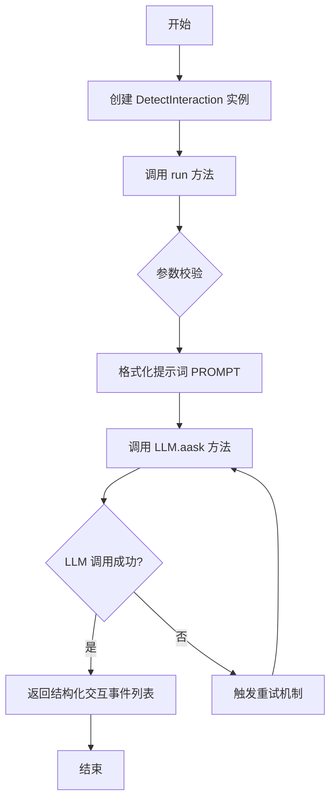
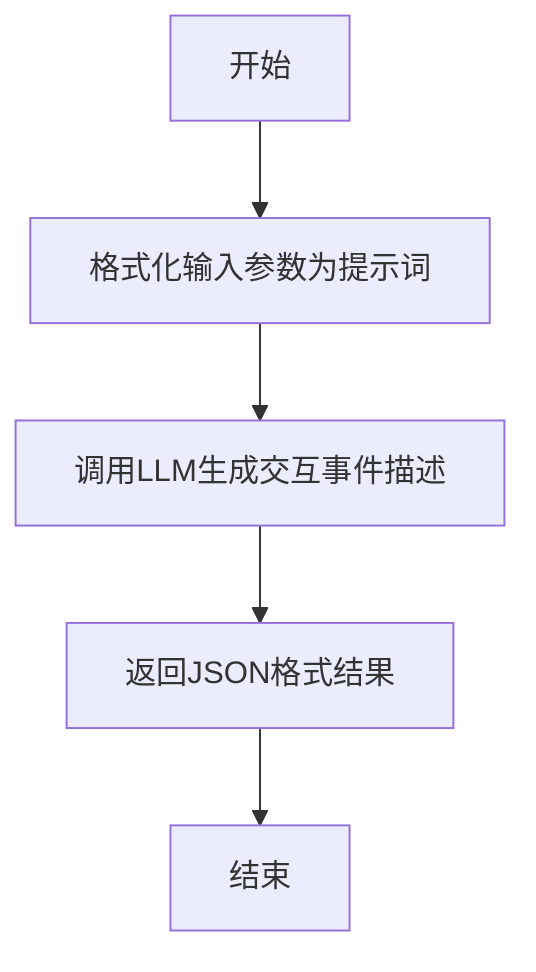

# `.\MetaGPT\metagpt\actions\requirement_analysis\trd\detect_interaction.py` 详细设计文档

该文件实现了一个名为 DetectInteraction 的 Action 类，其核心功能是作为一个智能工具，从用户需求文本中识别出交互事件及其参与者。它接收用户需求、用例参与者、历史交互事件和外部评估结论作为输入，通过格式化提示词调用大语言模型（LLM），最终输出一个结构化的 JSON 列表，详细描述每个交互事件的名称、参与者、发起者和输入数据。

## 整体流程



## 类结构

```
Action (基类)
└── DetectInteraction (交互事件检测工具)
```

## 全局变量及字段


### `PROMPT`
    
一个多行字符串模板，定义了用于指导大语言模型（LLM）识别和提取用户需求中交互事件的提示词结构。

类型：`str`
    


    

## 全局函数及方法

### `DetectInteraction.run`

该方法用于从用户需求文本中识别交互事件及其参与者，基于给定的用例参与者、历史交互事件和评估结论，通过LLM生成交互事件的JSON格式描述。

参数：

- `user_requirements`：`str`，用户需求的自然语言文本
- `use_case_actors`：`str`，用例参与者的描述
- `legacy_interaction_events`：`str`，先前版本的交互事件内容
- `evaluation_conclusion`：`str`，对先前交互事件的外部评估结论

返回值：`str`，包含识别出的交互事件及其参与者的JSON格式字符串

#### 流程图



#### 带注释源码

```python
@retry(
    wait=wait_random_exponential(min=1, max=20),
    stop=stop_after_attempt(6),
    after=general_after_log(logger),
)
async def run(
    self,
    *,
    user_requirements: str,
    use_case_actors: str,
    legacy_interaction_events: str,
    evaluation_conclusion: str,
) -> str:
    """
    从用户需求中识别交互事件和参与者。

    参数:
        user_requirements: 用户需求的自然语言文本
        use_case_actors: 用例参与者的描述
        legacy_interaction_events: 先前版本的交互事件内容
        evaluation_conclusion: 对先前交互事件的外部评估结论

    返回:
        包含识别出的交互事件及其参与者的JSON格式字符串

    示例:
        >>> detect_interaction = DetectInteraction()
        >>> user_requirements = "用户需求 1. ..."
        >>> use_case_actors = "- 参与者: 游戏玩家;\\n- 系统: 贪吃蛇游戏; \\n- 外部系统: 游戏中心;"
        >>> previous_version_interaction_events = "['交互 ...', ...]"
        >>> evaluation_conclusion = "问题: ..."
        >>> interaction_events = await detect_interaction.run(
        >>>    user_requirements=user_requirements,
        >>>    use_case_actors=use_case_actors,
        >>>    legacy_interaction_events=previous_version_interaction_events,
        >>>    evaluation_conclusion=evaluation_conclusion,
        >>> )
        >>> print(interaction_events)
        "['交互 ...', ...]"
    """
    # 格式化输入参数为提示词模板
    msg = PROMPT.format(
        use_case_actors=use_case_actors,
        original_user_requirements=to_markdown_code_block(val=user_requirements),
        previous_version_of_interaction_events=legacy_interaction_events,
        the_evaluation_conclusion_of_previous_version_of_trd=evaluation_conclusion,
    )
    # 调用LLM生成交互事件描述
    return await self.llm.aask(msg=msg)
```

## 关键组件


### 张量索引与惰性加载

代码中未直接涉及张量索引与惰性加载机制。该组件通常用于高效处理大型数据集或模型参数，通过按需加载数据块而非一次性全部加载到内存中来优化性能。在本代码中，数据处理主要围绕文本字符串的输入和输出，不涉及大规模数值数据的索引或延迟加载。

### 反量化支持

代码中未涉及反量化支持。反量化通常指将低精度（如INT8）的量化数据转换回高精度（如FP32）表示的过程，常见于模型推理优化。本代码的核心功能是基于LLM进行自然语言处理，输入和输出均为文本格式，不涉及任何数值量化或反量化操作。

### 量化策略

代码中未涉及量化策略。量化策略是指为了减少模型存储空间和加速推理而将模型权重和激活值从高精度浮点数转换为低精度整数（如INT8）的一系列方法和技术。本代码实现的是一个基于提示词工程和LLM的交互事件检测工具，其逻辑处理在语义层面，而非数值计算层面，因此不包含模型权重量化相关的策略。

### 工具注册与集成

通过 `@register_tool(include_functions=["run"])` 装饰器，将 `DetectInteraction` 类的 `run` 方法注册为一个可被系统发现和调用的工具。这体现了代码作为更大框架（MetaGPT）一部分的集成设计，允许该功能被统一管理和调度。

### 重试机制与错误处理

通过 `@retry` 装饰器为 `run` 方法实现了指数退避重试逻辑，在调用底层LLM服务可能失败时自动重试，增强了系统的鲁棒性。`after=general_after_log(logger)` 确保了每次重试尝试后都会记录日志，便于监控和调试。

### 提示词工程模板

`PROMPT` 变量定义了一个结构化的提示词模板，用于引导大型语言模型（LLM）执行特定的交互事件识别任务。该模板清晰地将输入信息（参与者、需求、旧事件、评估结论）组织成不同的章节，并给出了详细的任务指令和期望的输出格式，是驱动核心功能的关键组件。


## 问题及建议


### 已知问题

-   **硬编码的提示词模板**：`PROMPT` 变量是一个硬编码的字符串模板。这导致提示词逻辑与业务逻辑紧密耦合，难以维护、复用和进行A/B测试。任何对提示词的修改都需要直接修改源代码。
-   **缺乏输入验证**：`run` 方法接收多个字符串参数，但未对参数的有效性（如非空、格式）进行任何检查。如果传入空字符串或格式错误的`legacy_interaction_events`，可能导致大语言模型（LLM）调用失败或产生不可预测的输出。
-   **错误处理机制不完善**：虽然使用了`tenacity`库进行重试，但重试策略仅针对网络或LLM服务端的瞬时故障。对于由无效输入、提示词问题或LLM返回内容格式错误导致的逻辑错误，当前代码没有捕获和处理机制，可能导致任务整体失败。
-   **返回格式依赖LLM**：方法的返回值期望是一个Markdown格式的JSON对象列表字符串。这个格式的正确性完全依赖于LLM对复杂提示词的理解和遵循能力，存在解析失败的风险，且没有后续的格式校验或解析步骤。
-   **类职责边界模糊**：`DetectInteraction` 类继承自 `Action`，但其 `run` 方法的核心是拼接提示词并调用LLM。这更像一个特定的“提示词工程”任务，而非一个通用的“动作”。将业务规则（如“最多2个参与者”）直接写入提示词，使得业务逻辑分散且难以测试。

### 优化建议

-   **将提示词外部化**：将 `PROMPT` 模板移至配置文件（如YAML、JSON）或数据库中。这样可以实现提示词的热更新，方便进行版本管理和多环境配置，也使代码更清晰。
-   **增加输入参数验证**：在 `run` 方法开始处，添加对 `user_requirements`, `use_case_actors` 等关键参数的验证逻辑。例如，检查是否为空，或使用Pydantic模型来定义和验证输入的数据结构。
-   **增强错误处理与结果解析**：
    1.  在 `llm.aask` 调用外围添加更精细的异常捕获（如 `asyncio.TimeoutError`, `json.JSONDecodeError` 等）。
    2.  对LLM返回的字符串尝试进行解析（如使用 `json.loads` 在去除Markdown代码块标记后），并验证其是否符合预期的结构（包含`name`, `participants`等键）。解析失败时应提供明确的错误信息或降级方案。
-   **分离关注点**：考虑将“交互事件探测”的核心逻辑（如解析用户需求、识别参与者和事件）与“调用LLM执行提示词”的操作分离。可以设计一个 `InteractionDetector` 类负责业务逻辑，而 `DetectInteraction` 作为其一个基于LLM的实现。这提高了可测试性，并为未来替换为基于规则或其它模型的实现留出空间。
-   **完善文档与类型提示**：为 `run` 方法添加更详细的类型注解（例如使用 `TypedDict` 来描述返回的JSON结构）。在类或方法文档中，明确说明重试策略（`tenacity`装饰器）所覆盖的异常类型和场景。


## 其它


### 设计目标与约束

本模块的核心设计目标是实现一个能够从自然语言用户需求文本中，自动识别并提取交互事件及其参与者的工具。它遵循 RFC243 第 2.1.6 章的规范，旨在将非结构化的需求描述转化为结构化的交互事件列表，为后续的系统设计（如序列图生成）提供输入。

主要约束包括：
1.  **输入约束**：必须接收用户需求文本、参与者列表、历史交互事件版本以及外部评估结论作为输入，以确保识别过程能够结合上下文和历史反馈进行迭代优化。
2.  **输出约束**：输出必须是一个结构化的 Markdown JSON 对象列表，严格遵循 `name`、`participants`、`initiator`、`input` 的键值格式，以确保下游处理的一致性。
3.  **处理约束**：交互事件的识别必须基于给定的用户需求文本逐字进行，确保提取的准确性。每个交互事件最多只能有两个参与者，若发现多个参与者，则需进一步拆分事件。
4.  **集成约束**：作为 `Action` 的子类，必须实现 `run` 方法，并能够通过 `@register_tool` 装饰器注册到工具注册表中，以便在更大的智能体框架中被发现和调用。

### 错误处理与异常设计

模块的错误处理主要依赖于 `tenacity` 库提供的重试机制和 `Action` 基类的异常处理框架。

1.  **重试机制**：`run` 方法被 `@retry` 装饰器修饰，当方法执行过程中发生异常（如网络超时、LLM服务不稳定）时，会自动进行重试。重试策略为指数退避等待（`wait_random_exponential(min=1, max=20)`），最多重试6次（`stop_after_attempt(6)`）。这提高了在外部服务（如LLM API）暂时不可用时的鲁棒性。
2.  **日志记录**：重试机制配置了 `after=general_after_log(logger)`，每次重试尝试后都会记录日志，便于监控和调试。
3.  **异常传播**：如果重试次数耗尽后仍然失败，或者发生非预期的运行时错误（如输入参数格式错误），异常将向上抛出，由调用者（通常是智能体或工作流引擎）负责捕获和处理。这符合框架的责任划分原则。
4.  **输入验证**：当前代码未在 `run` 方法内部显式验证输入参数（如 `user_requirements` 是否为空）。依赖调用方提供有效输入。这是一个潜在的改进点。

### 数据流与状态机

本模块的数据流清晰，是一个无状态的、函数式的处理单元。

1.  **数据输入**：外部调用者（如一个工作流或另一个 `Action`）提供四个字符串参数：`user_requirements`、`use_case_actors`、`legacy_interaction_events`、`evaluation_conclusion`。
2.  **数据预处理**：`run` 方法接收参数后，使用 `to_markdown_code_block` 函数将 `user_requirements` 格式化为 Markdown 代码块，以防止其内容干扰提示词模板的解析。
3.  **提示词组装**：将格式化后的输入数据，按照预定义的 `PROMPT` 模板进行填充，生成一个完整的、上下文丰富的提示词字符串 (`msg`)。
4.  **核心处理**：将组装好的提示词 (`msg`) 发送给大语言模型 (`self.llm.aask`)。这是模块的核心处理步骤，依赖外部 LLM 服务执行自然语言理解和信息提取任务。
5.  **数据输出**：LLM 返回一个字符串，该字符串预期是符合 `PROMPT` 中指定格式的 Markdown JSON 列表。`run` 方法将此字符串直接返回给调用者。

**状态机**：本模块自身不维护任何状态。每次 `run` 方法的调用都是独立的，输出完全由当前输入决定。历史交互事件 (`legacy_interaction_events`) 和评估结论 (`evaluation_conclusion`) 是作为输入参数传入的上下文信息，而非模块内部持久化的状态。

### 外部依赖与接口契约

1.  **外部依赖**：
    *   **`metagpt` 框架**：继承自 `Action` 基类，依赖于其提供的 `llm` 属性（一个配置好的大语言模型客户端）和框架的运行环境。
    *   **`tenacity` 库**：用于实现 `run` 方法的自动重试逻辑。
    *   **大语言模型 (LLM) 服务**：通过 `self.llm.aask` 调用，是功能实现的核心依赖。其性能、准确性和稳定性直接影响本模块的输出质量。
    *   **工具注册表 (`metagpt.tools.tool_registry`)**：通过 `@register_tool` 装饰器将本类注册为可用工具，使其能够被框架内的其他组件发现和调用。

2.  **接口契约**：
    *   **类定义契约**：作为 `Action` 的子类，必须实现异步的 `run` 方法。通过 `@register_tool(include_functions=["run"])` 声明，将 `run` 方法作为对外的工具接口。
    *   **`run` 方法输入契约**：
        *   `user_requirements: str`：原始用户需求文本。
        *   `use_case_actors: str`：参与者描述，通常为列表形式。
        *   `legacy_interaction_events: str`：上一次识别出的交互事件（字符串形式，如JSON列表）。
        *   `evaluation_conclusion: str`：针对 `legacy_interaction_events` 的外部评估结论或问题反馈。
    *   **`run` 方法输出契约**：返回一个 `str` 类型的结果，该结果必须是 `PROMPT` 中规定的 Markdown JSON 对象列表字符串。下游组件将依赖此格式进行解析。
    *   **提示词 (`PROMPT`) 契约**：`PROMPT` 变量定义了一个严格的、与LLM交互的契约。它规定了输入信息的组织方式、LLM需要扮演的角色、具体的分析任务以及必须遵守的输出格式。任何对 `PROMPT` 的修改都可能破坏与已部署LLM的默契，需要重新评估和测试。

    