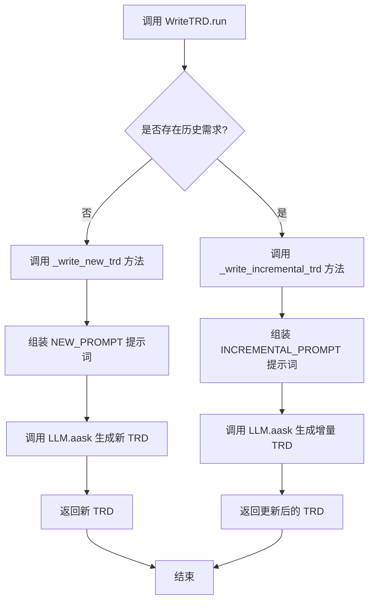
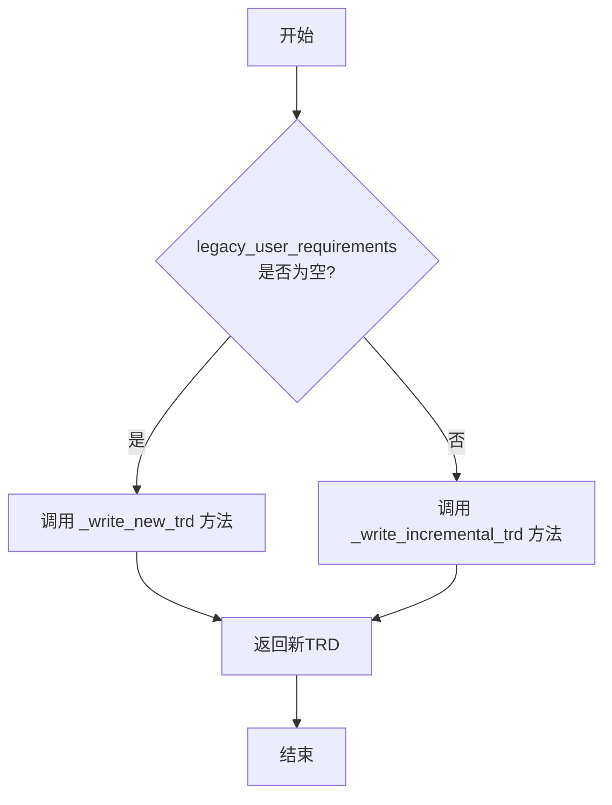
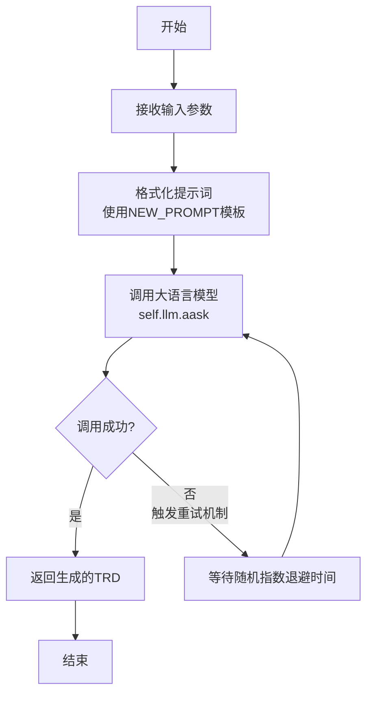
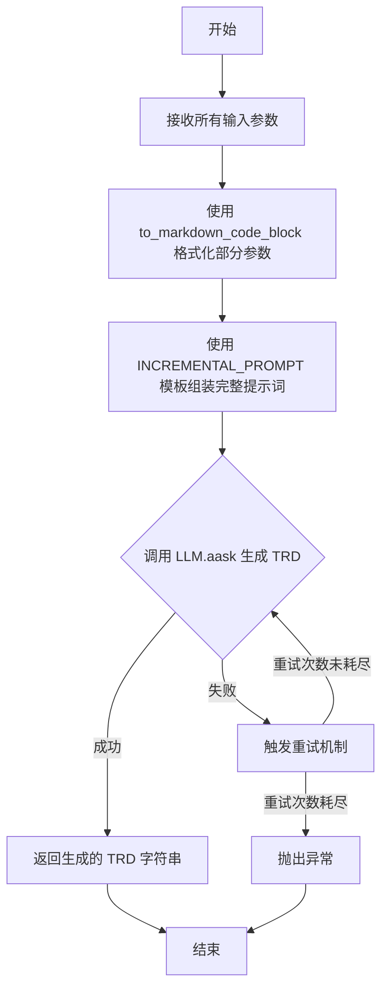

# `.\MetaGPT\metagpt\actions\requirement_analysis\trd\write_trd.py` 详细设计文档

该文件实现了一个名为 WriteTRD 的 Action 类，其核心功能是根据用户需求（全新的或增量的）以及相关的上下文信息（如用例参与者、可用外部接口、交互事件、历史文档等），利用大语言模型（LLM）生成或更新一份技术需求文档（TRD）。它通过判断是否存在历史需求来决定是创建全新文档还是增量更新现有文档。

## 整体流程



## 类结构

```
Action (基类)
└── WriteTRD (技术需求文档编写器)
    ├── run (主入口方法)
    ├── _write_new_trd (创建新TRD)
    └── _write_incremental_trd (增量更新TRD)
```

## 全局变量及字段


### `NEW_PROMPT`
    
用于生成全新技术需求文档（TRD）的提示词模板，定义了输入参数的格式和生成TRD的详细规则。

类型：`str`
    


### `INCREMENTAL_PROMPT`
    
用于基于现有TRD和增量需求更新技术需求文档（TRD）的提示词模板，定义了如何整合新旧需求的规则。

类型：`str`
    


    

## 全局函数及方法

### `WriteTRD.run`

该方法负责根据用户需求编写或更新技术需求文档（TRD）。它根据输入参数判断是创建新TRD还是增量更新现有TRD，并调用相应的内部方法进行处理。

参数：

- `user_requirements`：`str`，新的或增量的用户需求。
- `use_case_actors`：`str`，用例中涉及的参与者描述。
- `available_external_interfaces`：`str`，可用的外部接口列表。
- `evaluation_conclusion`：`str`，对之前TRD的评估结论，默认为空字符串。
- `interaction_events`：`str`，与当前处理的用户需求相关的交互事件。
- `previous_version_trd`：`str`，之前版本的TRD，用于更新，默认为空字符串。
- `legacy_user_requirements`：`str`，由外部对象处理的现有用户需求，默认为空字符串。
- `legacy_user_requirements_trd`：`str`，与现有用户需求关联的TRD，默认为空字符串。
- `legacy_user_requirements_interaction_events`：`str`，与现有用户需求相关的交互事件，默认为空字符串。

返回值：`str`，新创建或更新后的TRD。

#### 流程图



#### 带注释源码

```python
async def run(
    self,
    *,
    user_requirements: str = "",
    use_case_actors: str,
    available_external_interfaces: str,
    evaluation_conclusion: str = "",
    interaction_events: str,
    previous_version_trd: str = "",
    legacy_user_requirements: str = "",
    legacy_user_requirements_trd: str = "",
    legacy_user_requirements_interaction_events: str = "",
) -> str:
    """
    Handles the writing or updating of a Technical Requirements Document (TRD) based on user requirements.

    Args:
        user_requirements (str): The new/incremental user requirements.
        use_case_actors (str): Description of the actors involved in the use case.
        available_external_interfaces (str): List of available external interfaces.
        evaluation_conclusion (str, optional): The conclusion of the evaluation of the TRD written by you. Defaults to an empty string.
        interaction_events (str): The interaction events related to the user requirements that you are handling.
        previous_version_trd (str, optional): The previous version of the TRD written by you, for updating.
        legacy_user_requirements (str, optional): Existing user requirements handled by an external object for your use. Defaults to an empty string.
        legacy_user_requirements_trd (str, optional): The TRD associated with the existing user requirements handled by an external object for your use. Defaults to an empty string.
        legacy_user_requirements_interaction_events (str, optional): Interaction events related to the existing user requirements handled by an external object for your use. Defaults to an empty string.

    Returns:
        str: The newly created or updated TRD written by you.
    """
    # 判断是否存在遗留用户需求，以决定是创建新TRD还是增量更新
    if legacy_user_requirements:
        # 存在遗留需求，调用增量更新方法
        return await self._write_incremental_trd(
            use_case_actors=use_case_actors,
            legacy_user_requirements=legacy_user_requirements,
            available_external_interfaces=available_external_interfaces,
            legacy_user_requirements_trd=legacy_user_requirements_trd,
            legacy_user_requirements_interaction_events=legacy_user_requirements_interaction_events,
            incremental_user_requirements=user_requirements,
            previous_version_trd=previous_version_trd,
            evaluation_conclusion=evaluation_conclusion,
            incremental_user_requirements_interaction_events=interaction_events,
        )
    # 不存在遗留需求，调用创建新TRD方法
    return await self._write_new_trd(
        use_case_actors=use_case_actors,
        original_user_requirement=user_requirements,
        available_external_interfaces=available_external_interfaces,
        legacy_trd=previous_version_trd,
        evaluation_conclusion=evaluation_conclusion,
        interaction_events=interaction_events,
    )
```

### `WriteTRD._write_new_trd`

该方法用于根据给定的用户需求、用例参与者、可用外部接口等信息，生成一份全新的技术需求文档（TRD）。它通过构建一个结构化的提示词（Prompt），调用大语言模型（LLM）来生成文档内容，并内置了重试机制以增强鲁棒性。

参数：

- `use_case_actors`：`str`，描述用例图中涉及的参与者、系统和外部系统。
- `original_user_requirement`：`str`，原始的用户需求描述。
- `available_external_interfaces`：`str`，可用的外部接口列表，包含候选步骤及其输入输出。
- `legacy_trd`：`str`，基于相同用户需求的旧版本TRD，可作为新TRD的参考。
- `evaluation_conclusion`：`str`，对旧版本TRD的评估结论，可作为新TRD的参考。
- `interaction_events`：`str`，基于用户需求识别出的交互事件及其参与者。

返回值：`str`，返回由大语言模型生成的全新版本的技术需求文档（TRD）。

#### 流程图



#### 带注释源码

```python
    @retry(
        wait=wait_random_exponential(min=1, max=20), # 重试等待策略：随机指数退避，最小1秒，最大20秒
        stop=stop_after_attempt(6), # 停止策略：最多重试6次
        after=general_after_log(logger), # 重试后执行日志记录
    )
    async def _write_new_trd(
        self,
        *,
        use_case_actors: str,
        original_user_requirement: str,
        available_external_interfaces: str,
        legacy_trd: str,
        evaluation_conclusion: str,
        interaction_events: str,
    ) -> str:
        # 使用NEW_PROMPT模板，将所有输入参数格式化为一个结构化的提示词。
        # to_markdown_code_block 函数将部分参数内容包装为Markdown代码块，以提高LLM的理解准确性。
        prompt = NEW_PROMPT.format(
            use_case_actors=use_case_actors,
            original_user_requirement=to_markdown_code_block(val=original_user_requirement),
            available_external_interfaces=available_external_interfaces,
            legacy_trd=to_markdown_code_block(val=legacy_trd),
            evaluation_conclusion=evaluation_conclusion,
            interaction_events=interaction_events,
        )
        # 调用大语言模型的异步接口，传入构建好的提示词，并返回生成的TRD文本。
        return await self.llm.aask(prompt)
```

### `WriteTRD._write_incremental_trd`

该方法用于处理增量用户需求，基于已有的遗留技术需求文档（TRD）和交互事件，结合新的增量需求，生成一个更新后的、完整的技术需求文档。它通过格式化一个特定的提示词模板，调用大语言模型（LLM）来生成文档内容，并内置了重试机制以增强鲁棒性。

参数：

- `use_case_actors`：`str`，描述用例中涉及的参与者（Actor）、系统（System）和外部系统（External System）。
- `legacy_user_requirements`：`str`，由其他模块处理的、已有的遗留用户需求描述。
- `available_external_interfaces`：`str`，可用的外部接口列表，包含候选步骤及其输入输出。
- `legacy_user_requirements_trd`：`str`，基于`legacy_user_requirements`由其他模块生成的遗留TRD。
- `legacy_user_requirements_interaction_events`：`str`，基于`legacy_user_requirements`由其他模块生成的遗留交互事件列表。
- `incremental_user_requirements`：`str`，需要处理的增量用户需求描述。
- `previous_version_trd`：`str`，基于`incremental_user_requirements`之前生成的旧版本TRD，可作为新TRD的参考。
- `evaluation_conclusion`：`str`，对`previous_version_trd`中旧TRD的评估结论总结，可作为新TRD的参考。
- `incremental_user_requirements_interaction_events`：`str`，基于`incremental_user_requirements`识别出的交互事件及参与者。

返回值：`str`，返回由大语言模型生成的、更新后的完整技术需求文档（TRD）。

#### 流程图



#### 带注释源码

```python
    @retry(
        wait=wait_random_exponential(min=1, max=20), # 重试等待策略：随机指数退避，最小1秒，最大20秒
        stop=stop_after_attempt(6), # 停止策略：最多重试6次
        after=general_after_log(logger), # 重试后执行的回调函数，用于记录日志
    )
    async def _write_incremental_trd(
        self,
        *,
        use_case_actors: str,
        legacy_user_requirements: str,
        available_external_interfaces: str,
        legacy_user_requirements_trd: str,
        legacy_user_requirements_interaction_events: str,
        incremental_user_requirements: str,
        previous_version_trd: str,
        evaluation_conclusion: str,
        incremental_user_requirements_interaction_events: str,
    ):
        # 使用 INCREMENTAL_PROMPT 模板，并将所有参数格式化后填入模板中。
        # 其中 legacy_user_requirements, legacy_user_requirements_trd, incremental_user_requirements, previous_version_trd 被转换为 Markdown 代码块格式。
        prompt = INCREMENTAL_PROMPT.format(
            use_case_actors=use_case_actors,
            legacy_user_requirements=to_markdown_code_block(val=legacy_user_requirements),
            available_external_interfaces=available_external_interfaces,
            legacy_user_requirements_trd=to_markdown_code_block(val=legacy_user_requirements_trd),
            legacy_user_requirements_interaction_events=legacy_user_requirements_interaction_events,
            incremental_user_requirements=to_markdown_code_block(val=incremental_user_requirements),
            previous_version_trd=to_markdown_code_block(val=previous_version_trd),
            evaluation_conclusion=evaluation_conclusion,
            incremental_user_requirements_interaction_events=incremental_user_requirements_interaction_events,
        )
        # 调用大语言模型的异步接口，传入组装好的提示词，获取生成的 TRD 内容并返回。
        return await self.llm.aask(prompt)
```

## 关键组件


### 张量索引与惰性加载

该代码不涉及张量操作或惰性加载机制。

### 反量化支持

该代码不涉及量化或反量化操作。

### 量化策略

该代码不涉及模型量化策略。

### 工具注册与集成

通过 `@register_tool` 装饰器将 `WriteTRD` 类注册为工具，使其能够被工具注册表发现和调用，实现了与外部系统的集成。

### 重试机制

使用 `@retry` 装饰器为 `_write_new_trd` 和 `_write_incremental_trd` 方法实现了指数退避的重试逻辑，增强了调用外部大语言模型（LLM）服务的鲁棒性。

### 提示词模板

定义了 `NEW_PROMPT` 和 `INCREMENTAL_PROMPT` 两个字符串常量作为提示词模板，用于构造发送给大语言模型（LLM）的指令，指导其生成或更新技术需求文档（TRD）。

### 需求处理路由

`run` 方法根据输入参数（特别是 `legacy_user_requirements`）判断当前任务是创建新 TRD 还是增量更新 TRD，并据此将请求路由到 `_write_new_trd` 或 `_write_incremental_trd` 方法。

### 大语言模型（LLM）交互

通过 `self.llm.aask(prompt)` 调用底层的大语言模型服务，将构造好的提示词发送给模型并获取生成的 TRD 文本，这是整个组件的核心功能实现。

### 文档格式化工具

利用 `to_markdown_code_block` 函数将用户需求、旧版 TRD 等文本内容格式化为 Markdown 代码块，以便在提示词中清晰地呈现给大语言模型（LLM）。


## 问题及建议


### 已知问题

-   **参数命名与逻辑不一致**：`run` 方法中的参数 `previous_version_trd` 在两种场景下含义不同。在创建新TRD时，它指代“旧版本TRD”；在增量更新TRD时，它指代“基于增量需求的上一个版本TRD”。这容易造成混淆。
-   **参数验证缺失**：代码未对输入参数进行有效性验证。例如，`user_requirements` 和 `interaction_events` 在某些场景下是必需的，但代码未检查它们是否为空或格式正确，可能导致后续处理出错或生成无意义的输出。
-   **错误处理不完善**：`_write_new_trd` 和 `_write_incremental_trd` 方法虽然使用了 `@retry` 装饰器进行重试，但重试仅针对网络或LLM调用异常。对于因输入数据问题（如格式错误、逻辑矛盾）导致的LLM生成内容质量问题，没有相应的错误处理或回退机制。
-   **硬编码的提示词模板**：`NEW_PROMPT` 和 `INCREMENTAL_PROMPT` 作为全局字符串常量硬编码在代码中。这使得提示词的维护、版本管理和根据不同场景进行动态调整变得困难。
-   **潜在的循环依赖风险**：`run` 方法根据 `legacy_user_requirements` 是否存在来决定调用 `_write_incremental_trd` 还是 `_write_new_trd`。如果调用方错误地传递了参数（例如，提供了 `legacy_user_requirements` 但未提供对应的 `legacy_user_requirements_trd`），可能导致逻辑错误或异常。
-   **代码重复**：`_write_new_trd` 和 `_write_incremental_trd` 两个方法结构高度相似，都包含重试逻辑、提示词格式化和LLM调用，存在明显的代码重复。

### 优化建议

-   **重构参数设计**：考虑将 `run` 方法的参数进行拆分或重组，使用不同的数据类（`dataclass`）来明确区分“创建新TRD”和“增量更新TRD”两种场景的输入，提高接口的清晰度和类型安全性。
-   **增加输入验证**：在 `run` 方法开始处或各个私有方法内部，添加对关键参数的验证逻辑。例如，检查必需参数非空，验证字符串格式是否符合预期（如是否为有效的Markdown代码块），并抛出具有明确信息的异常（如 `ValueError`）。
-   **增强错误处理与内容验证**：除了网络重试，应考虑对LLM返回的TRD内容进行基础验证（例如，检查是否包含必要的章节标题、关键字段）。可以引入一个轻量级的验证步骤，或在重试逻辑中加入对返回结果质量的简单判断。
-   **外部化提示词配置**：将 `NEW_PROMPT` 和 `INCREMENTAL_PROMPT` 移至配置文件（如YAML、JSON）或数据库中。这样可以实现提示词的热更新、A/B测试以及根据不同环境或模型版本使用不同的提示词。
-   **明确依赖契约并添加防御性代码**：在文档中明确 `legacy_user_requirements`、`legacy_user_requirements_trd` 等参数之间的依赖关系。在代码中，当进入增量更新分支时，检查这些关联参数是否一并提供，否则给出明确的错误提示。
-   **提取公共逻辑以消除重复**：创建一个内部方法（如 `_call_llm_with_prompt`）来封装重试逻辑、日志记录和LLM调用。`_write_new_trd` 和 `_write_incremental_trd` 只需负责构建各自的提示词，然后调用这个公共方法。这符合DRY（Don‘t Repeat Yourself）原则。
-   **提升可观测性**：在重试逻辑和LLM调用前后增加更详细的日志记录，包括输入参数的摘要、重试次数、最终使用的提示词（可脱敏）等，便于问题排查和性能监控。


## 其它


### 设计目标与约束

本模块的核心设计目标是提供一个可复用的、基于LLM的TRD（技术需求文档）生成与更新组件。它需要处理两种主要场景：1) 基于全新的用户需求生成一份完整的TRD；2) 基于增量用户需求，在已有的TRD基础上进行更新和整合。设计约束包括：必须严格遵循输入参数中定义的各类上下文信息（如用例参与者、可用外部接口、交互事件等），不得自行编造需求；生成的TRD步骤必须符合特定格式规范（如每个步骤最多两个参与者、需包含详细描述、输入输出、参与者、发起者及存在理由等）；同时，组件需要具备一定的鲁棒性，通过重试机制应对LLM服务可能的不稳定性。

### 错误处理与异常设计

模块的错误处理主要依赖于`tenacity`库提供的重试装饰器。在`_write_new_trd`和`_write_incremental_trd`这两个核心私有方法上，应用了`@retry`装饰器，配置为：使用随机指数等待策略（最小1秒，最大20秒），最多重试6次。每次重试尝试后，会通过`general_after_log`函数记录日志。这种设计旨在处理LLM API调用可能出现的瞬时故障（如网络超时、服务限流）。然而，当前设计未显式处理业务逻辑错误（例如，输入参数格式错误、LLM返回内容不符合预期格式等）。这些错误可能会直接向上层抛出，由调用者处理。

### 数据流与状态机

该模块的数据流是单向且无状态的。输入数据通过`run`方法的参数传入，根据`legacy_user_requirements`参数是否为空，决定执行`_write_new_trd`（新需求）或`_write_incremental_trd`（增量需求）分支。每个分支内部，将输入参数组装成特定的提示词模板（`NEW_PROMPT`或`INCREMENTAL_PROMPT`），然后调用`self.llm.aask(prompt)`方法获取LLM的响应，并将此响应（即生成的TRD文本）作为最终输出返回。整个过程不维护任何内部状态，每次调用都是独立的。

### 外部依赖与接口契约

1.  **LLM服务**：核心依赖是`self.llm`对象（从父类`Action`继承），通过其`aask`方法生成文本。这是一个关键的外部服务依赖，其可用性和性能直接影响本模块的功能。
2.  **工具注册框架**：依赖`metagpt.tools.tool_registry.register_tool`装饰器，将本类注册为可用工具，使其能够被MetaGPT框架内的其他组件发现和调用。
3.  **日志系统**：依赖`metagpt.logs.logger`进行日志记录，并在重试机制中通过`general_after_log`使用。
4.  **工具函数**：依赖`metagpt.utils.common.to_markdown_code_block`函数对输入文本进行格式化处理。
5.  **输入接口契约**：`run`方法定义了严格的参数契约，包括必需参数（`use_case_actors`, `available_external_interfaces`, `interaction_events`）和可选参数。调用者必须提供符合描述的数据，特别是`legacy_*`系列参数在增量更新场景下必须配套提供。
6.  **输出接口契约**：`run`方法返回一个字符串，即生成或更新后的完整TRD文档内容。文档格式需符合提示词中定义的规范（Markdown格式，包含特定章节和步骤描述）。

### 安全与合规考虑

1.  **提示词注入**：模块将用户控制的输入（如`user_requirements`）通过`to_markdown_code_block`放入Markdown代码块中，这在一定程度上可以隔离提示词指令与用户数据，防止用户输入篡改提示词逻辑，是一种基本的防护措施。
2.  **数据泄露**：所有用户需求、历史TRD等敏感信息都会作为提示词的一部分发送给外部LLM服务。这要求调用方确保相关数据不包含敏感或机密信息，或者所使用的LLM服务符合组织的数据安全和隐私政策。
3.  **资源消耗与限流**：重试机制可能在被调用服务持续故障时导致长时间的等待和资源占用。依赖于外部LLM服务，需考虑其调用成本、速率限制和配额管理。

### 测试策略建议

1.  **单元测试**：
    *   测试`run`方法在`legacy_user_requirements`为空和非空时，能否正确路由到`_write_new_trd`和`_write_incremental_trd`。
    *   测试`to_markdown_code_block`函数是否正确包装输入文本。
    *   模拟`self.llm.aask`方法，测试提示词模板的组装逻辑是否正确，特别是参数替换和格式化。
2.  **集成测试**：
    *   与模拟的或测试环境的LLM服务集成，验证给定一组标准输入参数后，能否返回结构大致正确的TRD文档。
    *   测试重试机制：模拟LLM服务在前几次调用时抛出可重试异常，验证组件是否按预期进行重试并最终成功或失败。
3.  **场景测试**：
    *   **新需求场景**：提供完整的用例参与者、新用户需求、外部接口等，验证生成的TRD是否包含原始需求、步骤划分是否合理、参与者是否匹配。
    *   **增量需求场景**：提供遗留需求及其TRD，再提供增量需求，验证生成的TRD是否正确整合了新旧内容，且没有冲突。
    *   **边界测试**：测试空字符串输入、极长的输入文本等边界情况下的行为。

    