# `.\MetaGPT\metagpt\actions\research.py` 详细设计文档

该代码实现了一个AI研究助手系统，包含三个核心动作类：CollectLinks用于收集和排序与主题相关的网页链接；WebBrowseAndSummarize用于浏览网页并生成内容摘要；ConductResearch用于基于收集的摘要内容生成结构化的研究报告。系统通过搜索引擎和网页浏览器引擎协同工作，支持多语言输出，并遵循APA格式生成详细的研究报告。

## 整体流程

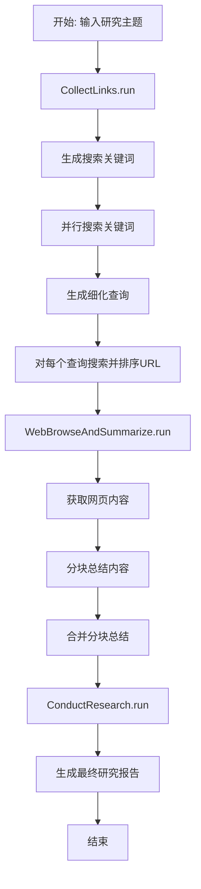

## 类结构

```
Action (基类，来自metagpt.actions)
├── CollectLinks
├── WebBrowseAndSummarize
└── ConductResearch
```

## 全局变量及字段


### `LANG_PROMPT`
    
用于指定响应语言的提示语模板，包含一个语言占位符。

类型：`str`
    


### `RESEARCH_BASE_SYSTEM`
    
定义AI研究助手基本角色和目标的系统提示语，强调撰写客观、结构化的报告。

类型：`str`
    


### `RESEARCH_TOPIC_SYSTEM`
    
包含特定研究主题的系统提示语模板，用于初始化研究任务。

类型：`str`
    


### `SEARCH_TOPIC_PROMPT`
    
引导LLM为研究主题生成相关搜索关键词的提示语，要求JSON格式输出。

类型：`str`
    


### `SUMMARIZE_SEARCH_PROMPT`
    
基于搜索结果引导LLM生成进一步研究查询的提示语模板，包含结果信息和分解数量参数。

类型：`str`
    


### `COLLECT_AND_RANKURLS_PROMPT`
    
用于评估、过滤和排序搜索结果URL的提示语模板，考虑相关性、时效性和来源可信度。

类型：`str`
    


### `WEB_BROWSE_AND_SUMMARIZE_PROMPT`
    
引导LLM基于参考信息回答问题或生成摘要的提示语模板，包含查询和内容占位符。

类型：`str`
    


### `CONDUCT_RESEARCH_PROMPT`
    
指导LLM生成详细研究报告的综合性提示语模板，规定了报告的结构、格式和内容要求。

类型：`str`
    


### `CollectLinks.name`
    
Action类的名称标识符，固定为'CollectLinks'。

类型：`str`
    


### `CollectLinks.i_context`
    
可选的上下文信息字段，用于存储或传递与当前Action执行相关的额外上下文。

类型：`Optional[str]`
    


### `CollectLinks.desc`
    
对CollectLinks Action功能的简短描述。

类型：`str`
    


### `CollectLinks.search_func`
    
可选的搜索函数，用于自定义搜索行为，如果未设置则使用默认的SearchEngine。

类型：`Optional[Any]`
    


### `CollectLinks.search_engine`
    
用于执行网络搜索的搜索引擎实例，在验证后由配置自动初始化。

类型：`Optional[SearchEngine]`
    


### `CollectLinks.rank_func`
    
可选的排名函数，用于对收集到的URL链接进行自定义排序。

类型：`Optional[Callable[[list[str]], None]]`
    


### `WebBrowseAndSummarize.name`
    
Action类的名称标识符，固定为'WebBrowseAndSummarize'。

类型：`str`
    


### `WebBrowseAndSummarize.i_context`
    
可选的上下文信息字段，用于存储或传递与当前Action执行相关的额外上下文。

类型：`Optional[str]`
    


### `WebBrowseAndSummarize.desc`
    
对WebBrowseAndSummarize Action功能的简短描述。

类型：`str`
    


### `WebBrowseAndSummarize.browse_func`
    
可选的网页浏览函数，用于自定义网页抓取行为，如果未设置则使用默认的WebBrowserEngine。

类型：`Union[Callable[[list[str]], None], None]`
    


### `WebBrowseAndSummarize.web_browser_engine`
    
用于获取和解析网页内容的浏览器引擎实例，在验证后由配置自动初始化。

类型：`Optional[WebBrowserEngine]`
    
    

## 全局函数及方法

### `get_research_system_text`

该函数用于生成进行研究的系统提示文本。它接收一个研究主题和语言参数，将研究主题系统提示与语言提示拼接，返回一个完整的、指定了语言的研究系统指令字符串。

参数：

- `topic`：`str`，研究主题。
- `language`：`str`，要求系统回复所使用的语言。

返回值：`str`，拼接后的系统提示文本。

#### 流程图

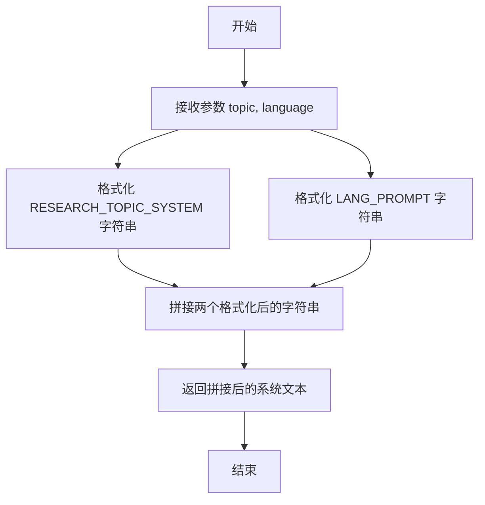

#### 带注释源码

```python
def get_research_system_text(topic: str, language: str):
    """Get the system text for conducting research.

    Args:
        topic: The research topic.
        language: The language for the system text.

    Returns:
        The system text for conducting research.
    """
    # 1. 使用传入的 topic 格式化 RESEARCH_TOPIC_SYSTEM 常量字符串。
    # 2. 使用传入的 language 格式化 LANG_PROMPT 常量字符串。
    # 3. 使用空格将两个格式化后的字符串拼接成一个完整的系统提示。
    # 4. 返回拼接后的字符串。
    return " ".join((RESEARCH_TOPIC_SYSTEM.format(topic=topic), LANG_PROMPT.format(language=language)))
```

### `CollectLinks.validate_engine_and_run_func`

该方法是一个Pydantic模型验证器，用于在`CollectLinks`类实例化后自动验证并初始化`search_engine`字段。如果`search_engine`字段为`None`，则根据配置自动创建一个`SearchEngine`实例。

参数：

-  `self`：`CollectLinks`，`CollectLinks`类的实例，用于访问实例的属性和配置。

返回值：`CollectLinks`，返回经过验证和可能初始化后的`CollectLinks`实例本身。

#### 流程图

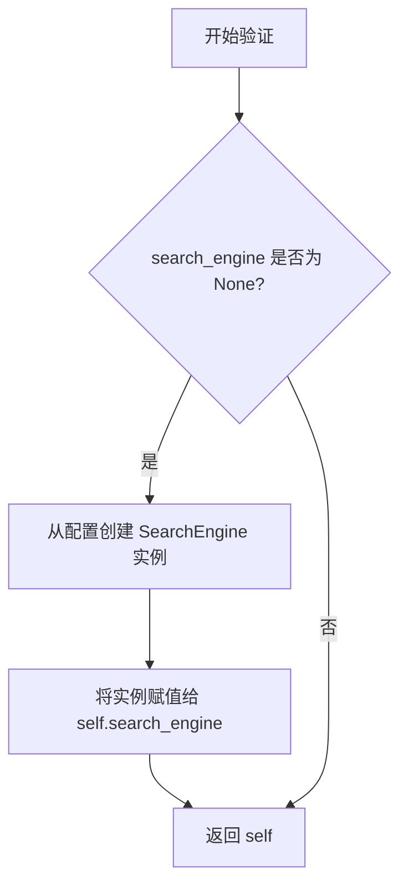

#### 带注释源码

```python
    @model_validator(mode="after")  # 这是一个Pydantic模型验证器，在模型实例化后运行
    def validate_engine_and_run_func(self):
        # 检查实例的 search_engine 字段是否未被设置（为None）
        if self.search_engine is None:
            # 如果未设置，则根据配置创建 SearchEngine 实例
            # 使用 self.config.search 获取搜索配置，self.config.proxy 获取代理设置
            self.search_engine = SearchEngine.from_search_config(self.config.search, proxy=self.config.proxy)
        # 验证器必须返回模型实例本身
        return self
```

### `CollectLinks.run`

`CollectLinks.run` 是 `CollectLinks` 类的核心异步方法，负责执行一个完整的研究主题链接收集流程。它首先根据研究主题生成搜索关键词，然后使用这些关键词进行搜索，接着分析搜索结果以生成更具体的子查询，最后对每个子查询执行搜索并基于相关性和可信度对结果URL进行排序和筛选，最终返回一个字典，其中键为子查询，值为对应的、经过排序的URL列表。

参数：

- `topic`：`str`，需要研究的主题。
- `decomposition_nums`：`int`，默认为4，指定要从初始搜索结果中分解出的子查询数量。
- `url_per_query`：`int`，默认为4，指定每个子查询最终要收集的URL数量。
- `system_text`：`str | None`，默认为`None`，用于与语言模型交互的系统提示文本。如果未提供，将使用默认的`RESEARCH_TOPIC_SYSTEM`模板。

返回值：`dict[str, list[str]]`，返回一个字典，其键为生成的子查询字符串，值为对应子查询下收集到的、经过排序和筛选的URL字符串列表。

#### 流程图

```mermaid
flowchart TD
    A[开始: run(topic, decomposition_nums, url_per_query, system_text)] --> B[生成或格式化系统提示文本 system_text]
    B --> C[调用 _aask 生成研究主题关键词 keywords]
    C --> D{关键词解析成功?}
    D -- 是 --> E[并行搜索所有关键词]
    D -- 否 --> F[使用 topic 作为唯一关键词]
    F --> E
    E --> G[循环: 合并搜索结果并生成提示，<br>调用 reduce_message_length 确保长度，<br>再调用 _aask 生成子查询 queries]
    G --> H{子查询解析成功?}
    H -- 是 --> I[遍历每个子查询 query]
    H -- 否 --> J[使用 keywords 作为子查询]
    J --> I
    I --> K[对每个 query 调用 _search_and_rank_urls<br>收集并排序URL]
    K --> L[将 query 和其URL列表存入结果字典 ret]
    L --> M[返回结果字典 ret]
```

#### 带注释源码

```python
async def run(
    self,
    topic: str,
    decomposition_nums: int = 4,
    url_per_query: int = 4,
    system_text: str | None = None,
) -> dict[str, list[str]]:
    """运行动作以收集链接。

    参数:
        topic: 研究主题。
        decomposition_nums: 要生成的搜索问题数量。
        url_per_query: 每个搜索问题要收集的URL数量。
        system_text: 系统文本。

    返回:
        一个字典，包含搜索问题作为键，收集到的URL作为值。
    """
    # 1. 初始化系统提示：如果未提供，则使用默认模板格式化研究主题。
    system_text = system_text if system_text else RESEARCH_TOPIC_SYSTEM.format(topic=topic)
    # 2. 生成关键词：调用语言模型，基于系统提示和 SEARCH_TOPIC_PROMPT 生成与主题相关的关键词。
    keywords = await self._aask(SEARCH_TOPIC_PROMPT, [system_text])
    try:
        # 3. 解析关键词：尝试从LLM响应中提取列表结构并验证。
        keywords = OutputParser.extract_struct(keywords, list)
        keywords = TypeAdapter(list[str]).validate_python(keywords)
    except Exception as e:
        # 4. 异常处理：如果解析失败，记录错误并使用主题本身作为关键词。
        logger.exception(f"fail to get keywords related to the research topic '{topic}' for {e}")
        keywords = [topic]
    # 5. 并行搜索：使用所有关键词并发执行搜索，获取初步结果。
    results = await asyncio.gather(*(self.search_engine.run(i, as_string=False) for i in keywords))

    # 6. 定义生成器函数：用于在提示信息过长时，逐步移除最长的搜索结果以缩短内容。
    def gen_msg():
        while True:
            # 6.1 格式化当前所有搜索结果。
            search_results = "\n".join(
                f"#### Keyword: {i}\n Search Result: {j}\n" for (i, j) in zip(keywords, results)
            )
            # 6.2 使用格式化后的结果和 decomposition_nums 生成提示。
            prompt = SUMMARIZE_SEARCH_PROMPT.format(
                decomposition_nums=decomposition_nums, search_results=search_results
            )
            yield prompt
            # 6.3 找到并移除最长的那个搜索结果列表中的最后一项，以缩减总长度。
            remove = max(results, key=len)
            remove.pop()
            # 6.4 如果所有结果列表都为空，则停止循环。
            if len(remove) == 0:
                break

    # 7. 控制提示长度：使用 reduce_message_length 函数，结合模型令牌限制，确保最终的提示不会过长。
    model_name = self.config.llm.model
    prompt = reduce_message_length(gen_msg(), model_name, system_text, self.config.llm.max_token)
    logger.debug(prompt) # 记录调试信息。
    # 8. 生成子查询：调用语言模型，基于缩短后的提示生成更具体的研究子查询。
    queries = await self._aask(prompt, [system_text])
    try:
        # 9. 解析子查询：尝试从LLM响应中提取列表结构并验证。
        queries = OutputParser.extract_struct(queries, list)
        queries = TypeAdapter(list[str]).validate_python(queries)
    except Exception as e:
        # 10. 异常处理：如果解析失败，记录错误并使用之前的关键词作为子查询。
        logger.exception(f"fail to break down the research question due to {e}")
        queries = keywords
    # 11. 初始化结果字典。
    ret = {}
    # 12. 遍历每个子查询，进行深度搜索和URL排序。
    for query in queries:
        # 12.1 对每个查询，调用 _search_and_rank_urls 方法获取排序后的URL列表。
        ret[query] = await self._search_and_rank_urls(topic, query, url_per_query)
    # 13. 返回最终结果：一个映射子查询到其相关URL列表的字典。
    return ret
```

### `CollectLinks._search_and_rank_urls`

该方法用于执行网络搜索，并根据相关性、可信度和时效性对搜索结果进行筛选和排序，最终返回排名靠前的URL列表。

参数：

- `topic`：`str`，研究主题，用于在筛选时判断搜索结果的相关性。
- `query`：`str`，具体的搜索查询词。
- `num_results`：`int`，默认值为4，指定最终需要返回的URL数量。
- `max_num_results`：`int`，可选参数，指定初始搜索时获取的最大结果数量。如果未提供，则根据 `num_results` 计算得出。

返回值：`list[str]`，一个包含排名靠前的URL的列表。

#### 流程图

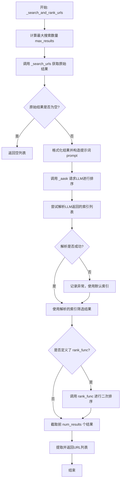

#### 带注释源码

```python
async def _search_and_rank_urls(
    self, topic: str, query: str, num_results: int = 4, max_num_results: int = None
) -> list[str]:
    """Search and rank URLs based on a query.

    Args:
        topic: The research topic.
        query: The search query.
        num_results: The number of URLs to collect.
        max_num_results: The max number of URLs to collect.

    Returns:
        A list of ranked URLs.
    """
    # 1. 确定初始搜索的最大结果数量
    max_results = max_num_results or max(num_results * 2, 6)
    # 2. 执行搜索，获取原始结果列表
    results = await self._search_urls(query, max_results=max_results)
    # 3. 如果搜索结果为空，直接返回空列表
    if len(results) == 0:
        return []
    # 4. 格式化搜索结果，为每个结果添加索引，用于后续引用
    _results = "\n".join(f"{i}: {j}" for i, j in zip(range(max_results), results))
    # 5. 获取当前时间戳，用于时效性判断
    time_stamp = datetime.now().strftime("%Y-%m-%d %H:%M:%S")
    # 6. 构造提示词，要求LLM根据主题、查询、时效性和可信度对结果进行筛选和排序
    prompt = COLLECT_AND_RANKURLS_PROMPT.format(topic=topic, query=query, results=_results, time_stamp=time_stamp)
    logger.debug(prompt)
    # 7. 请求LLM处理，期望返回一个排序后的索引列表
    indices = await self._aask(prompt)
    try:
        # 8. 尝试从LLM的回复中提取结构化的列表
        indices = OutputParser.extract_struct(indices, list)
        # 9. 验证列表中的每个元素都是整数
        assert all(isinstance(i, int) for i in indices)
    except Exception as e:
        # 10. 如果解析失败，记录异常并使用默认的完整索引列表（即不进行筛选和重排）
        logger.exception(f"fail to rank results for {e}")
        indices = list(range(max_results))
    # 11. 根据LLM返回的索引，从原始结果中筛选出对应的项
    results = [results[i] for i in indices]
    # 12. 如果类中定义了额外的排序函数（rank_func），则应用它进行二次排序
    if self.rank_func:
        results = self.rank_func(results)
    # 13. 从最终排序后的结果中，提取指定数量（num_results）的URL并返回
    return [i["link"] for i in results[:num_results]]
```

### `CollectLinks._search_urls`

该方法使用配置的搜索引擎执行搜索查询，并返回包含标题、链接和摘要的搜索结果列表。

参数：

- `query`：`str`，搜索查询字符串
- `max_results`：`int`，要返回的最大结果数量

返回值：`list[dict[str, str]]`，包含搜索结果的字典列表，每个字典包含"title"、"link"和"snippet"字段

#### 流程图

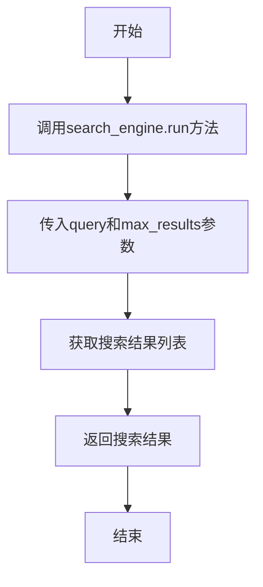

#### 带注释源码

```python
async def _search_urls(self, query: str, max_results: int) -> list[dict[str, str]]:
    """使用搜索引擎获取URL。

    返回：
        例如 [{"title": "...", "link": "...", "snippet": "..."}]
    """
    # 调用搜索引擎的run方法执行搜索
    # query: 搜索查询字符串
    # max_results: 最大返回结果数量
    # as_string=False: 返回结构化数据而非字符串
    return await self.search_engine.run(query, max_results=max_results, as_string=False)
```

### `CollectLinks.validate_engine_and_run_func`

该方法是一个 Pydantic 模型验证器，在 `CollectLinks` 类实例化后自动执行。它的核心功能是检查并确保 `search_engine` 字段被正确初始化。如果 `search_engine` 为 `None`，则根据配置自动创建一个 `SearchEngine` 实例。

参数：
-  `self`：`CollectLinks`，`CollectLinks` 类的实例，包含配置信息。

返回值：`CollectLinks`，返回经过验证和初始化后的 `CollectLinks` 实例本身。

#### 流程图

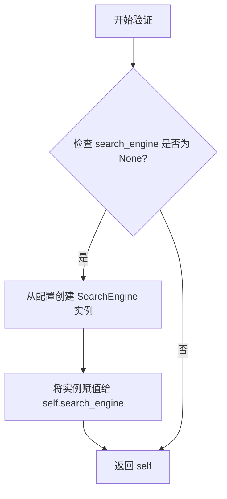

#### 带注释源码

```python
    @model_validator(mode="after")  # 这是一个 Pydantic 模型验证器，在模型实例化后运行。
    def validate_engine_and_run_func(self):
        # 检查 `search_engine` 字段是否未被初始化（为 None）。
        if self.search_engine is None:
            # 如果未初始化，则使用类配置（self.config）中的搜索配置和代理设置，
            # 通过 `SearchEngine.from_search_config` 工厂方法创建一个新的 `SearchEngine` 实例。
            self.search_engine = SearchEngine.from_search_config(self.config.search, proxy=self.config.proxy)
        # 验证器必须返回模型实例本身。
        return self
```

### `WebBrowseAndSummarize.run`

该方法负责浏览一个或多个网页，并根据给定的研究问题（`query`）对网页内容进行总结。它首先并行或顺序地抓取所有指定URL的网页内容，然后对每个网页的内容进行分析和总结，最终返回一个字典，其中键为URL，值为对应的总结文本。

参数：

- `url`：`str`，要浏览的主要网页URL。
- `urls`：`*str`，要浏览的额外网页URL列表（可变参数）。
- `query`：`str`，用于指导总结过程的研究问题或主题。
- `system_text`：`str`，提供给大语言模型（LLM）的系统提示文本，默认为`RESEARCH_BASE_SYSTEM`。
- `use_concurrent_summarization`：`bool`，是否并发执行多个网页的总结任务，默认为`False`。
- `per_page_timeout`：`Optional[float]`，抓取单个网页的超时时间（秒），默认为`None`。

返回值：`dict[str, str]`，一个字典，键为URL字符串，值为该URL对应网页内容的总结文本。

#### 流程图

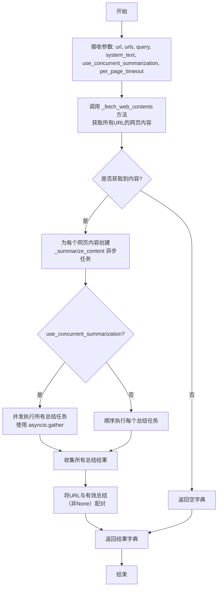

#### 带注释源码

```python
async def run(
    self,
    url: str,
    *urls: str,
    query: str,
    system_text: str = RESEARCH_BASE_SYSTEM,
    use_concurrent_summarization: bool = False,
    per_page_timeout: Optional[float] = None,
) -> dict[str, str]:
    """Run the action to browse the web and provide summaries.

    Args:
        url: The main URL to browse.
        urls: Additional URLs to browse.
        query: The research question.
        system_text: The system text.
        use_concurrent_summarization: Whether to concurrently summarize the content of the webpage by LLM.
        per_page_timeout: The maximum time for fetching a single page in seconds.

    Returns:
        A dictionary containing the URLs as keys and their summaries as values.
    """
    # 1. 获取网页内容：调用内部方法，传入所有URL和超时设置。
    contents = await self._fetch_web_contents(url, *urls, per_page_timeout=per_page_timeout)

    # 2. 准备URL列表：将主URL和额外URL合并成一个列表。
    all_urls = [url] + list(urls)
    # 3. 创建总结任务：为每个网页内容创建一个异步总结任务。
    summarize_tasks = [self._summarize_content(content, query, system_text) for content in contents]

    # 4. 执行总结任务：根据`use_concurrent_summarization`标志决定并发或顺序执行。
    summaries = await self._execute_summarize_tasks(summarize_tasks, use_concurrent_summarization)

    # 5. 构建结果字典：将URL与有效的总结（非None）配对。
    result = {url: summary for url, summary in zip(all_urls, summaries) if summary}

    # 6. 返回结果。
    return result
```

### `WebBrowseAndSummarize._fetch_web_contents`

该方法用于从给定的一个或多个URL中异步获取网页内容。它通过配置的`WebBrowserEngine`实例来执行网页抓取任务，并支持为每个页面设置独立的超时时间。该方法将抓取到的网页内容封装在`WebPage`对象列表中返回。

参数：

- `url`：`str`，要获取内容的主URL。
- `*urls`：`str`，可变参数，用于接收零个或多个额外的URL。
- `per_page_timeout`：`Optional[float]`，可选参数，指定抓取单个页面的最大超时时间（秒）。如果为`None`，则使用引擎的默认超时设置。

返回值：`list[WebPage]`，返回一个`WebPage`对象列表，每个对象代表一个成功抓取的网页内容。如果只提供了一个URL，则返回一个包含单个`WebPage`的列表；如果提供了多个URL，则返回一个包含所有`WebPage`的列表。

#### 流程图

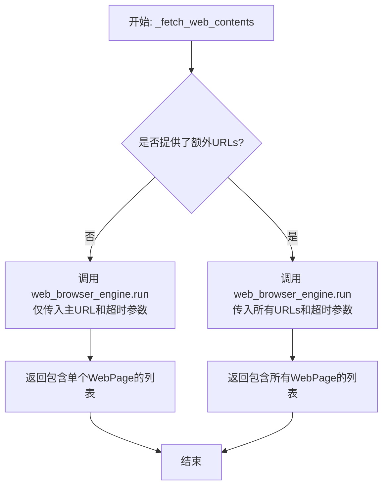

#### 带注释源码

```python
async def _fetch_web_contents(
    self, url: str, *urls: str, per_page_timeout: Optional[float] = None
) -> list[WebPage]:
    """Fetch web contents from given URLs."""

    # 调用配置好的WebBrowserEngine实例的run方法执行网页抓取。
    # 参数`url`是主URL，`*urls`是可变参数，代表零个或多个额外URL。
    # `per_page_timeout`参数被传递给引擎，用于控制每个页面的抓取超时。
    contents = await self.web_browser_engine.run(url, *urls, per_page_timeout=per_page_timeout)

    # 根据传入的URL数量决定返回值的格式。
    # 如果`urls`为空（即只传入了主URL`url`），则`contents`是一个`WebPage`对象。
    # 此时将其包装在列表中返回，以保持接口返回类型`list[WebPage]`的一致性。
    # 如果传入了多个URL，则`contents`已经是一个`WebPage`对象列表，直接返回。
    return [contents] if not urls else contents
```

### `WebBrowseAndSummarize._summarize_content`

该方法用于对给定的网页内容进行摘要总结。它首先检查内容是否有效，然后将长内容分块处理，使用LLM对每个块进行摘要，最后将所有块的摘要合并成一个完整的摘要。如果内容不相关，则返回`None`。

参数：

- `page`：`WebPage`，包含网页内容的WebPage对象，包括URL和inner_text等属性。
- `query`：`str`，研究问题或查询，用于指导摘要生成。
- `system_text`：`str`，系统提示文本，用于定义LLM的角色和行为。

返回值：`str`，返回生成的摘要字符串。如果内容无效或不相关，则返回`None`。

#### 流程图

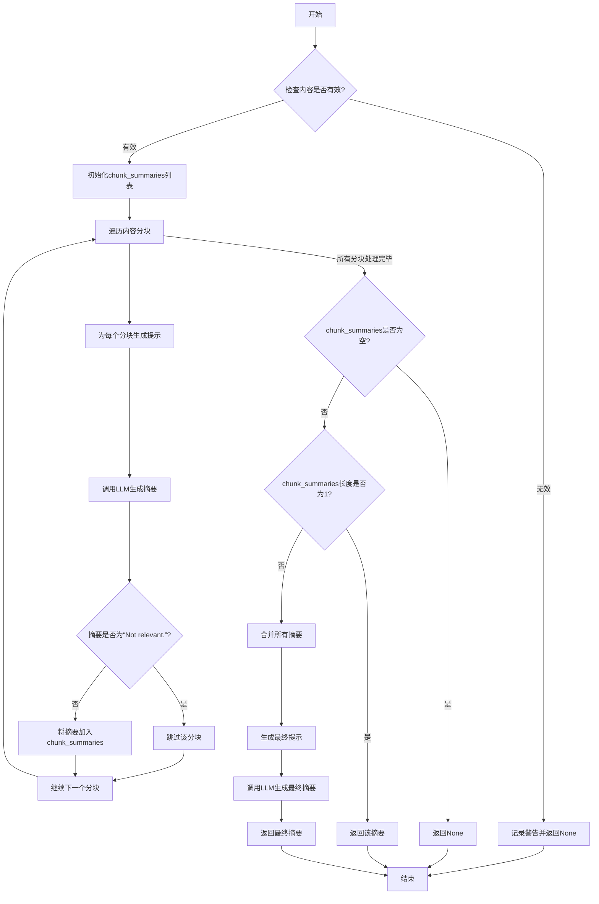

#### 带注释源码

```python
async def _summarize_content(self, page: WebPage, query: str, system_text: str) -> str:
    """Summarize web content."""
    try:
        # 定义提示模板，用于格式化查询和内容
        prompt_template = WEB_BROWSE_AND_SUMMARIZE_PROMPT.format(query=query, content="{}")

        # 获取网页的纯文本内容
        content = page.inner_text

        # 检查内容是否有效（例如，是否以特定错误短语开头）
        if self._is_content_invalid(content):
            logger.warning(f"Invalid content detected for URL {page.url}: {content[:10]}...")
            return None

        # 初始化列表，用于存储每个内容块的摘要
        chunk_summaries = []
        # 将长内容分块，并为每个块生成提示
        for prompt in generate_prompt_chunk(content, prompt_template, self.llm.model, system_text, 4096):
            logger.debug(prompt)
            # 调用LLM生成摘要
            summary = await self._aask(prompt, [system_text])
            # 如果摘要表明内容不相关，则跳过该块
            if summary == "Not relevant.":
                continue
            chunk_summaries.append(summary)

        # 如果没有生成任何摘要，返回None
        if not chunk_summaries:
            return None

        # 如果只有一个摘要块，直接返回
        if len(chunk_summaries) == 1:
            return chunk_summaries[0]

        # 合并所有摘要块的内容
        content = "\n".join(chunk_summaries)
        # 使用合并后的内容生成最终提示
        prompt = WEB_BROWSE_AND_SUMMARIZE_PROMPT.format(query=query, content=content)
        # 调用LLM生成最终摘要
        summary = await self._aask(prompt, [system_text])
        return summary
    except Exception as e:
        # 记录异常并返回None
        logger.error(f"Error summarizing content: {e}")
        return None
```

### `WebBrowseAndSummarize._is_content_invalid`

该方法用于检查给定的网页内容字符串是否无效。其判断逻辑是检查内容是否以预定义的一组无效起始短语开头，例如“Fail to load page”或“Access Denied”。如果内容以这些短语中的任何一个开头，则被视为无效。

参数：

- `content`：`str`，需要被检查的网页内容字符串。

返回值：`bool`，如果内容无效则返回 `True`，否则返回 `False`。

#### 流程图

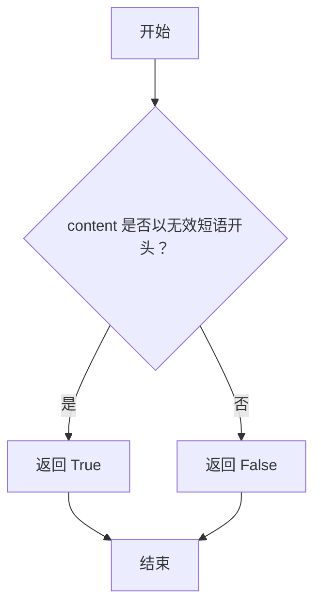

#### 带注释源码

```python
def _is_content_invalid(self, content: str) -> bool:
    """Check if the content is invalid based on specific starting phrases."""

    # 定义一组表示无效内容的起始短语列表
    invalid_starts = ["Fail to load page", "Access Denied"]

    # 检查传入的 content 字符串（去除首尾空白后）是否以 invalid_starts 列表中的任何一个短语开头
    # any() 函数返回 True 如果存在任何一个匹配项
    return any(content.strip().startswith(phrase) for phrase in invalid_starts)
```

### `WebBrowseAndSummarize._execute_summarize_tasks`

该方法负责执行一系列网页内容摘要生成任务。它根据 `use_concurrent` 参数决定是并行执行所有任务以提高效率，还是顺序执行所有任务以控制资源消耗或确保执行顺序。

参数：

- `tasks`：`list[Coroutine[Any, Any, str]]`，一个协程（Coroutine）列表，每个协程代表一个待执行的摘要生成任务。这些协程通常由 `_summarize_content` 方法生成。
- `use_concurrent`：`bool`，一个布尔标志，指示是否并发执行任务。如果为 `True`，则使用 `asyncio.gather` 并行执行所有任务；如果为 `False`，则按顺序逐个等待每个任务完成。

返回值：`list[str]`，一个字符串列表，包含每个摘要任务的结果。列表顺序与输入的 `tasks` 参数顺序一致。如果某个任务执行失败或返回 `None`，其对应位置的结果可能为 `None`。

#### 流程图

```mermaid
flowchart TD
    A[开始: _execute_summarize_tasks] --> B{use_concurrent?}
    B -- 是 --> C[使用 asyncio.gather<br>并发执行所有任务]
    C --> D[收集所有结果<br>results = await asyncio.gather(*tasks)]
    D --> E[返回结果列表 results]
    B -- 否 --> F[初始化空结果列表 results = []]
    F --> G[遍历任务列表 tasks]
    G --> H[顺序执行单个任务<br>result = await task]
    H --> I[将结果 result 追加到 results 列表]
    I --> J{是否还有下一个任务?}
    J -- 是 --> G
    J -- 否 --> K[返回结果列表 results]
    E --> L[结束]
    K --> L
```

#### 带注释源码

```python
async def _execute_summarize_tasks(self, tasks: list[Coroutine[Any, Any, str]], use_concurrent: bool) -> list[str]:
    """Execute summarize tasks either concurrently or sequentially."""

    # 如果 use_concurrent 标志为 True，则并发执行所有摘要任务。
    if use_concurrent:
        # 使用 asyncio.gather 并行运行所有传入的协程（tasks）。
        # gather 会等待所有任务完成，并返回一个结果列表，顺序与输入任务列表一致。
        return await asyncio.gather(*tasks)

    # 如果 use_concurrent 标志为 False，则顺序执行任务。
    # 使用列表推导式，通过 `await task` 逐个等待并执行每个协程。
    # 这种方式会阻塞，直到当前任务完成才执行下一个，但更易于控制执行流和资源。
    return [await task for task in tasks]
```

### `ConductResearch.__init__`

该方法用于初始化 `ConductResearch` 类的实例，继承自父类 `Action` 的初始化逻辑，并允许通过关键字参数进行自定义配置。

参数：

- `**kwargs`：`dict`，可变关键字参数，用于传递给父类 `Action` 的初始化方法，以设置实例的配置、日志、语言模型等属性。

返回值：`None`，无返回值。

#### 流程图

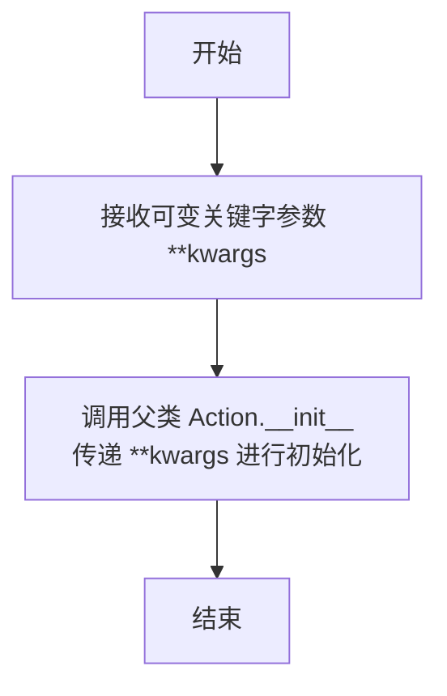

#### 带注释源码

```python
def __init__(self, **kwargs):
    # 调用父类 Action 的 __init__ 方法，将传入的所有关键字参数 **kwargs 传递给父类进行初始化。
    # 这确保了 ConductResearch 实例继承了 Action 的所有基础属性和配置。
    super().__init__(**kwargs)
```

### `ConductResearch.run`

该方法属于`ConductResearch`类，是执行研究并生成研究报告的核心方法。它接收一个研究主题和相关内容，利用大语言模型（LLM）生成一份结构化的、详细的、符合APA格式的研究报告。

参数：

- `topic`：`str`，研究主题。
- `content`：`str`，用于生成研究报告的参考内容。
- `system_text`：`str`，提供给LLM的系统提示文本，默认为`RESEARCH_BASE_SYSTEM`。

返回值：`str`，生成的详细研究报告。

#### 流程图

```mermaid
flowchart TD
    A[开始运行] --> B[格式化提示词<br>CONDUCT_RESEARCH_PROMPT]
    B --> C[设置LLM自动最大token数<br>self.llm.auto_max_tokens = True]
    C --> D[调用LLM生成报告<br>await self._aask(prompt, [system_text])]
    D --> E[返回研究报告]
    E --> F[结束]
```

#### 带注释源码

```python
async def run(
    self,
    topic: str,
    content: str,
    system_text: str = RESEARCH_BASE_SYSTEM,
) -> str:
    """运行该方法以进行研究并生成研究报告。

    参数:
        topic: 研究主题。
        content: 用于研究的参考内容。
        system_text: 提供给LLM的系统提示文本。

    返回:
        生成的研究报告。
    """
    # 1. 将研究主题和内容填充到预设的提示词模板中，生成最终的LLM输入。
    prompt = CONDUCT_RESEARCH_PROMPT.format(topic=topic, content=content)
    # 记录调试日志，便于追踪和问题排查。
    logger.debug(prompt)
    # 2. 设置LLM模型自动处理最大token长度，避免报告因过长而被截断。
    self.llm.auto_max_tokens = True
    # 3. 调用父类Action的异步提问方法，将格式化后的提示词和系统文本发送给LLM。
    #    该方法负责与LLM API交互并返回生成的文本。
    return await self._aask(prompt, [system_text])
```

## 关键组件


### 张量索引与惰性加载

代码中未直接涉及张量索引与惰性加载机制。该代码主要处理基于LLM的自动化网络信息检索、内容抓取、摘要生成及研究报告撰写流程。

### 反量化支持

代码中未直接涉及反量化支持。该代码主要处理基于LLM的自动化网络信息检索、内容抓取、摘要生成及研究报告撰写流程。

### 量化策略

代码中未直接涉及量化策略。该代码主要处理基于LLM的自动化网络信息检索、内容抓取、摘要生成及研究报告撰写流程。

### 网络信息检索与链接收集 (`CollectLinks`)

负责根据研究主题生成搜索关键词，执行网络搜索，并对搜索结果进行筛选、排序和去重，最终返回与主题相关的、高质量的URL列表。

### 网页内容抓取与摘要生成 (`WebBrowseAndSummarize`)

负责抓取指定URL的网页内容，利用LLM对内容进行摘要总结，支持并发处理和长文本分块处理，并过滤无效或无关内容。

### 研究报告撰写 (`ConductResearch`)

负责整合经过筛选和摘要的网页内容，根据研究主题和APA格式要求，利用LLM生成结构化的、详细的研究报告。

### 提示词工程与流程控制

定义了从关键词生成、查询分解、结果排序、内容摘要到最终报告生成的一系列提示词模板，并通过`Action`基类的方法（如`_aask`）与LLM交互，驱动整个研究流程。


## 问题及建议


### 已知问题

-   **错误处理不充分**：在 `CollectLinks.run` 和 `_search_and_rank_urls` 方法中，当 `OutputParser.extract_struct` 或 `TypeAdapter.validate_python` 解析失败时，代码仅记录异常并回退到默认值（如 `keywords = [topic]` 或 `indices = list(range(max_results))`）。这种静默回退可能掩盖了关键的结构化数据解析错误，导致后续流程基于错误或质量低下的数据运行，影响最终研究报告的质量和可靠性。
-   **硬编码的模型参数**：在 `CollectLinks.run` 方法中，调用 `reduce_message_length` 函数时，使用了硬编码的 `self.config.llm.max_token` 作为最大令牌数。同时，在 `WebBrowseAndSummarize._summarize_content` 方法中，`generate_prompt_chunk` 函数使用了硬编码的 `4096` 作为上下文窗口大小。这些硬编码值缺乏灵活性，无法适应不同LLM模型的特性，可能导致令牌计算不准确、内容截断不当或资源浪费。
-   **潜在的资源泄漏与性能瓶颈**：`WebBrowseAndSummarize._fetch_web_contents` 方法使用 `WebBrowserEngine.run` 获取网页内容，但未显式处理网络请求超时、重试或连接池管理。`per_page_timeout` 参数虽然提供了单页超时控制，但缺乏整体任务级别的超时和并发控制，在爬取大量或响应慢的页面时，可能导致长时间阻塞或资源（如网络连接、内存）未及时释放。
-   **代码重复与职责模糊**：`CollectLinks` 和 `WebBrowseAndSummarize` 类都通过 `@model_validator(mode="after")` 来初始化引擎（`search_engine`, `web_browser_engine`）。这种模式虽然利用了Pydantic的特性，但将对象构造逻辑分散在验证器中，而非 `__init__` 方法，降低了代码的可读性和可维护性。同时，`Action` 基类的 `_aask` 方法被频繁调用，但具体的提示词构建和结果处理逻辑散落在各个子类方法中，存在一定的重复。
-   **缺乏配置验证与默认值管理**：`CollectLinks._search_and_rank_urls` 方法中，`max_num_results` 参数默认值为 `None`，随后通过 `max_num_results or max(num_results * 2, 6)` 计算 `max_results`。这种逻辑虽然提供了默认行为，但使得参数的实际默认值不直观，且 `max(num_results * 2, 6)` 这个启发式规则缺乏配置化，难以调整以适应不同的搜索场景。

### 优化建议

-   **增强错误处理与降级策略**：建议为关键的数据解析步骤（如从LLM响应中提取JSON）定义更明确的异常类型和降级策略。例如，可以创建自定义异常（如 `ResearchParsingError`），并在捕获异常后，根据异常类型和上下文决定是重试、使用更简单的解析方法、还是向上层抛出异常。同时，可以增加输入数据的验证和清洗步骤。
-   **参数化模型相关配置**：将模型特定的参数（如最大令牌数、上下文窗口大小）从硬编码改为从配置对象（`self.config.llm`）中动态获取，或作为方法的可选参数传入。确保配置对象包含这些模型属性，并考虑为不同的任务（如搜索总结、报告生成）设置不同的配置剖面。
-   **引入资源管理与并发控制**：
    -   在 `WebBrowseAndSummarize` 中，考虑使用 `asyncio.wait` 或 `asyncio.as_completed` 配合超时设置，为整个 `_fetch_web_contents` 或批量摘要任务添加总超时控制。
    -   为 `WebBrowserEngine` 和 `SearchEngine` 的使用引入连接池或会话管理，并在 `Action` 类的生命周期方法（如 `__aenter__`/`__aexit__`）中确保资源的正确初始化和清理。
    -   在 `WebBrowseAndSummarize.run` 中，即使 `use_concurrent_summarization=False`，网页抓取（`_fetch_web_contents`）本身也可以是并发的，建议评估并优化此处的并发策略。
-   **重构以提升代码清晰度与可维护性**：
    -   考虑将引擎（`SearchEngine`, `WebBrowserEngine`）的初始化逻辑移至 `__init__` 方法中，或使用明确的工厂方法/依赖注入，减少对Pydantic验证器的依赖，使对象构造流程更清晰。
    -   将通用的提示词模板管理、LLM调用封装、结果后处理（如解析、验证）逻辑抽取到独立的工具类或混合类中，供各个 `Action` 子类复用，减少代码重复。
    -   使用常量或枚举来管理魔术字符串，如 `RESEARCH_BASE_SYSTEM`、`RESEARCH_TOPIC_SYSTEM` 等，提高可维护性。
-   **优化配置与默认值设计**：
    -   为 `CollectLinks._search_and_rank_urls` 中的 `max_results` 计算逻辑提供明确的配置项，例如在 `config.search` 中设置 `max_results_multiplier` 和 `min_max_results`，使行为更可预测和可配置。
    -   考虑使用Pydantic的 `Field` 和 `validator` 为配置模型和动作参数提供更丰富的默认值、描述和验证逻辑，确保输入的有效性。


## 其它


### 设计目标与约束

该代码模块旨在实现一个自动化的网络研究助手，能够根据用户给定的研究主题，自动执行以下流程：生成搜索关键词、进行网络搜索、筛选和排序搜索结果、抓取并总结网页内容，最终生成一份结构化的研究报告。核心设计目标包括：
1.  **自动化与智能化**：最小化人工干预，通过LLM驱动关键词生成、查询分解、内容总结和报告撰写。
2.  **模块化与可扩展性**：将研究流程分解为`CollectLinks`、`WebBrowseAndSummarize`、`ConductResearch`三个独立的`Action`类，便于单独测试、替换或扩展。
3.  **信息可靠性与相关性**：通过基于查询和主题的URL筛选、基于可信度的排序以及对时效性内容的处理，力求收集高质量、相关的信息来源。
4.  **处理长文本与大信息量**：通过`reduce_message_length`和`generate_prompt_chunk`等工具函数处理LLM的上下文长度限制，确保能处理大量搜索返回和长篇网页内容。

主要约束包括：
*   **依赖外部服务**：严重依赖外部搜索引擎（`SearchEngine`）和网页浏览器引擎（`WebBrowserEngine`）的可用性与性能。
*   **LLM能力与成本**：研究质量受限于所配置LLM的能力，且多次调用LLM进行总结和生成报告会产生显著的Token消耗成本。
*   **网络延迟与稳定性**：网页抓取和搜索请求受网络条件影响，可能成为性能瓶颈和失败点。

### 错误处理与异常设计

代码中采用了多层级的错误处理策略，以确保单个步骤的失败不会导致整个流程崩溃，并尽可能提供降级方案：
1.  **结构化数据解析异常**：在`CollectLinks.run`和`_search_and_rank_urls`方法中，使用`try...except`块捕获`OutputParser.extract_struct`和`TypeAdapter.validate_python`可能抛出的异常。当LLM返回的JSON格式不符合预期时，会记录异常日志，并回退到使用原始关键词或默认索引列表，保证流程继续。
2.  **网络内容获取与处理异常**：
    *   在`WebBrowseAndSummarize._summarize_content`中，使用`try...except`捕获总结过程中的异常，记录错误并返回`None`，避免因单个网页问题影响其他网页的处理。
    *   通过`_is_content_invalid`方法主动检测并过滤已知的无效内容（如“Fail to load page”），提前终止对该内容的处理。
3.  **日志记录**：广泛使用`logger.debug`记录关键提示词和中间状态，使用`logger.exception`和`logger.error`记录异常和错误，便于调试和监控流程状态。
4.  **资源限制与超时**：`WebBrowseAndSummarize.run`方法支持`per_page_timeout`参数，为单个网页的抓取设置超时，防止因个别慢响应或无响应页面阻塞整个抓取任务。

潜在的改进包括：为搜索引擎调用添加重试机制；对`asyncio.gather`包装的并发任务进行更细粒度的异常隔离，防止一个任务异常导致整个`gather`失败。

### 数据流与状态机

该模块的数据流遵循一个清晰的、分阶段的管道模式，但并未实现一个严格的状态机。数据在各`Action`之间以特定格式传递：
1.  **输入**：用户提供研究`topic`和可选参数（如`language`, `decomposition_nums`）。
2.  **阶段一：链接收集 (`CollectLinks`)**：
    *   **输入**：`topic` -> **处理**：生成关键词 -> 并行搜索 -> 生成子查询 -> 对每个子查询进行搜索并排序URLs。
    *   **输出**：`Dict[str, List[str]]`，即 `{查询1: [url1, url2, ...], 查询2: [...], ...}`。
3.  **阶段二：网页浏览与总结 (`WebBrowseAndSummarize`)**：
    *   **输入**：上一阶段输出的URL字典（通常会被展平为URL列表）和原始`topic`或`query`。
    *   **处理**：并发或顺序抓取网页内容 -> 对每个网页内容进行分块总结 -> 合并分块总结（如果需要）。
    *   **输出**：`Dict[str, str]`，即 `{url1: summary1, url2: summary2, ...}`。
4.  **阶段三：研究报告生成 (`ConductResearch`)**：
    *   **输入**：原始`topic`和第二阶段输出的所有总结文本（合并为一个`content`字符串）。
    *   **处理**：构造最终提示词，调用LLM生成报告。
    *   **输出**：`str`，即最终的研究报告（Markdown格式）。

状态是非持久化的，每个`Action`的`run`方法都是无状态的纯函数式调用。流程的推进由外部调用者（未在代码中显示）控制，负责将上一个`Action`的输出转换为下一个`Action`的输入。

### 外部依赖与接口契约

该模块严重依赖以下外部组件，并对其有明确的接口契约假设：

1.  **大语言模型 (LLM)**：
    *   **契约**：通过父类`Action`的`_aask`方法调用。假设LLM能够理解并遵循复杂的指令，生成结构化的JSON输出（当提示要求时），并处理长文本总结任务。
    *   **配置**：通过`self.config.llm`获取模型名称、最大token数等配置。

2.  **搜索引擎 (`SearchEngine`)**：
    *   **契约**：`SearchEngine.run`方法应接受查询字符串和`max_results`参数，返回一个字典列表，每个字典至少包含`"title"`, `"link"`, `"snippet"`键。`as_string=False`模式返回原始结构。
    *   **初始化**：在`CollectLinks.validate_engine_and_run_func`中通过配置懒加载初始化。

3.  **网页浏览器引擎 (`WebBrowserEngine`)**：
    *   **契约**：`WebBrowserEngine.run`方法应接受一个或多个URL，返回`WebPage`对象或`WebPage`对象列表。`WebPage`对象需提供`inner_text`和`url`属性。
    *   **初始化**：在`WebBrowseAndSummarize.validate_engine_and_run_func`中通过配置懒加载初始化。

4.  **工具函数库**：
    *   `metagpt.utils.common.OutputParser`：用于从LLM回复中提取JSON结构。
    *   `metagpt.utils.text.reduce_message_length` 和 `generate_prompt_chunk`：用于管理提示词长度，适配LLM上下文窗口。
    *   `metagpt.utils.parse_html.WebPage`：定义了网页内容的数据结构。

5.  **配置系统**：
    *   依赖全局或上下文的`self.config`对象来获取`search`、`browser`、`llm`、`proxy`等配置项，实现了配置与代码逻辑的分离。

这些依赖的接口稳定性直接影响本模块的稳定性。任何不兼容的变更都需要在本模块中进行适配。

    