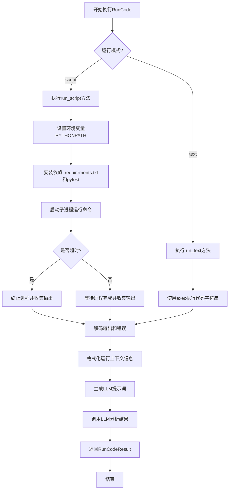
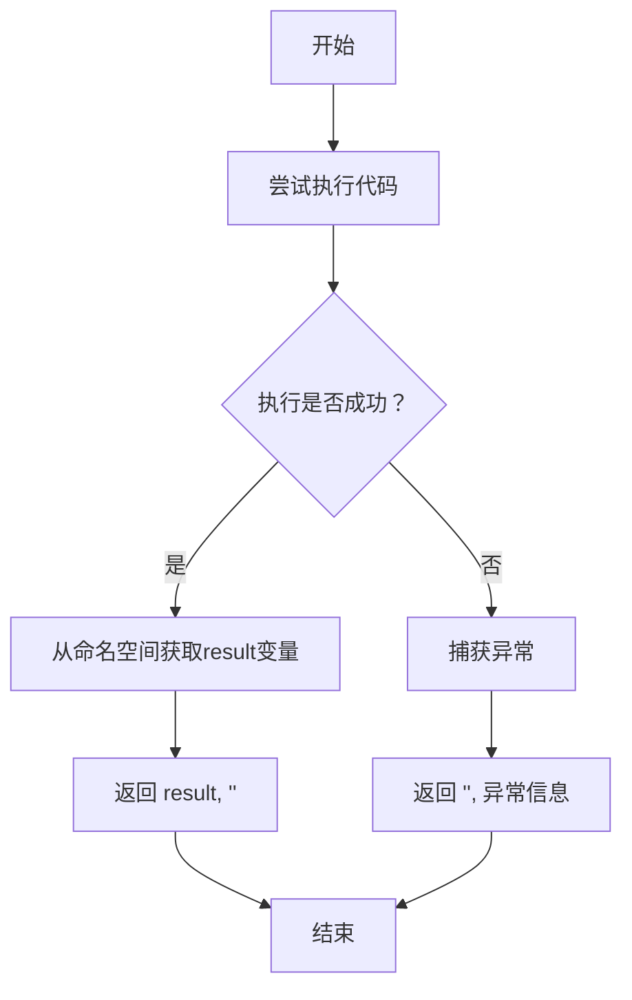
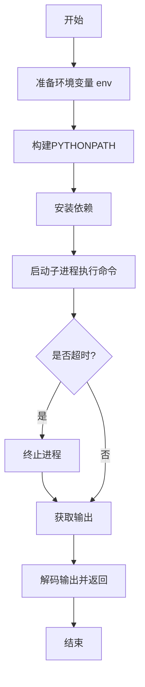
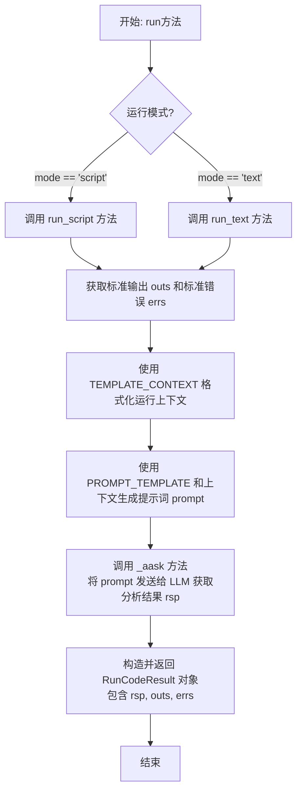
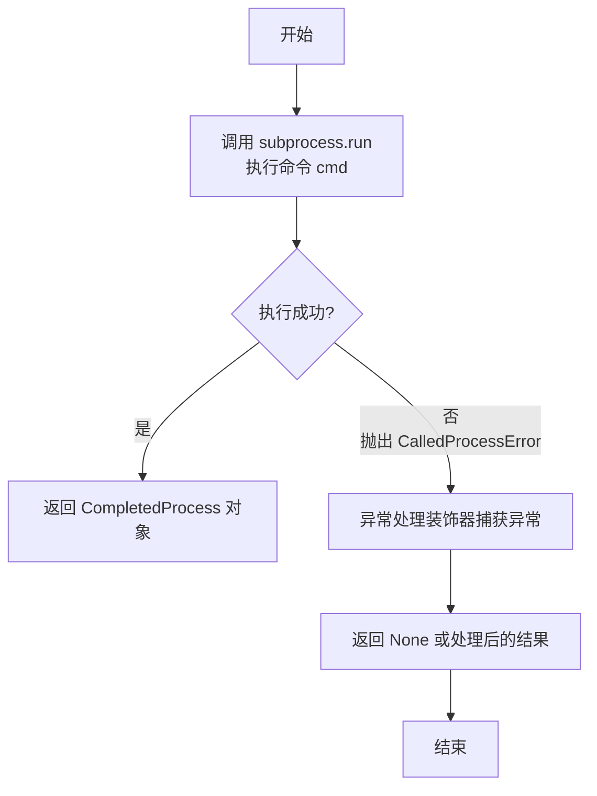
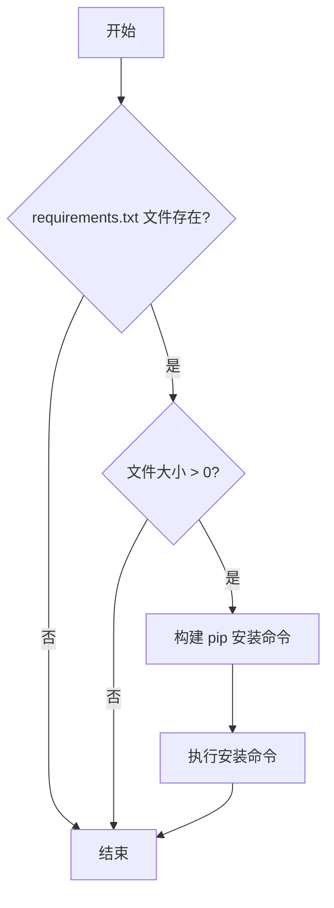
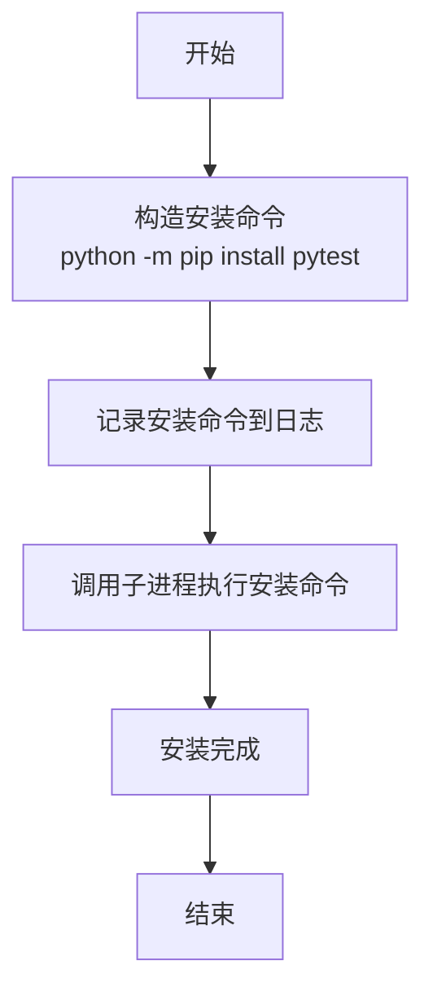
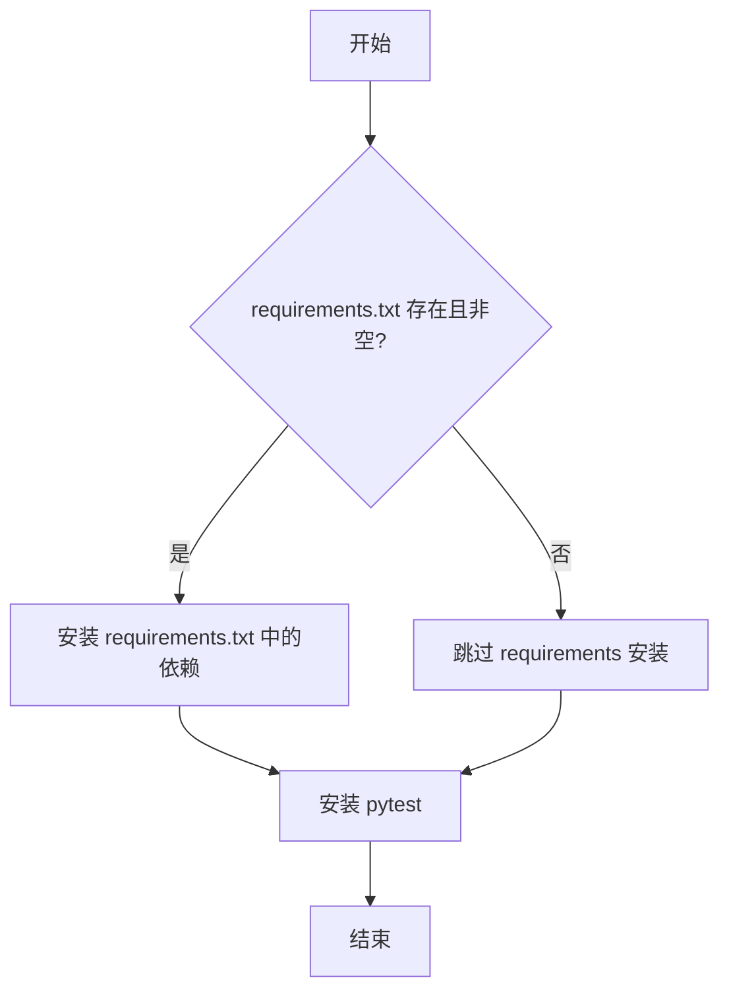

# `.\MetaGPT\metagpt\actions\run_code.py` 详细设计文档

该代码实现了一个名为RunCode的Action类，其主要功能是执行Python代码或脚本，并分析运行结果。它支持两种运行模式：'text'模式直接执行代码字符串，'script'模式通过子进程运行脚本文件。在执行过程中，它会自动安装依赖（如requirements.txt中的包和pytest），捕获标准输出和错误，然后使用LLM分析运行结果，判断代码是否通过测试，并给出修复建议。

## 整体流程



## 类结构

```
Action (基类)
└── RunCode (执行代码并分析结果)
    ├── 类方法: run_text
    ├── 实例方法: run_script
    ├── 实例方法: run
    ├── 静态方法: _install_via_subprocess
    ├── 静态方法: _install_requirements
    ├── 静态方法: _install_pytest
    └── 静态方法: _install_dependencies
```

## 全局变量及字段


### `PROMPT_TEMPLATE`
    
一个用于指导LLM分析代码运行结果的提示词模板，定义了输出格式和需要分析的内容。

类型：`str`
    


### `TEMPLATE_CONTEXT`
    
一个用于填充`PROMPT_TEMPLATE`中`{context}`占位符的模板，包含了代码、测试、命令和运行输出等详细信息。

类型：`str`
    


### `RunCode.name`
    
Action的名称，固定为'RunCode'，用于标识该Action。

类型：`str`
    


### `RunCode.i_context`
    
运行代码所需的上下文信息，包含代码文件、测试文件、工作目录、运行命令等参数。

类型：`RunCodeContext`
    
    

## 全局函数及方法

### `RunCode.run_text`

`RunCode.run_text` 是一个静态类方法，用于在内存中动态执行传入的Python代码字符串，并捕获执行结果和可能发生的异常。它通过Python的`exec`函数执行代码，并将执行结果存储在一个临时的命名空间中，最后返回执行结果和错误信息。

参数：

- `code`：`str`，需要执行的Python代码字符串。

返回值：`Tuple[str, str]`，返回一个包含两个字符串的元组。第一个字符串是代码执行的结果（如果代码定义了`result`变量），第二个字符串是执行过程中捕获的异常信息（如果没有异常则为空字符串）。

#### 流程图



#### 带注释源码

```python
    @classmethod
    async def run_text(cls, code) -> Tuple[str, str]:
        try:
            # 创建一个空的命名空间字典，用于存储exec执行代码后定义的变量
            namespace = {}
            # 使用exec函数执行传入的代码字符串，执行环境为namespace字典
            exec(code, namespace)
        except Exception as e:
            # 如果执行过程中发生任何异常，捕获异常并返回空字符串和异常信息
            return "", str(e)
        # 如果执行成功，从namespace中获取名为'result'的变量值，如果没有则返回空字符串
        # 返回一个元组：(执行结果, 空错误字符串)
        return namespace.get("result", ""), ""
```

### `RunCode.run_script`

该方法用于在指定的工作目录中运行一个脚本或命令，通过设置环境变量（特别是PYTHONPATH）和安装必要的依赖（如requirements.txt中指定的包和pytest），然后使用子进程执行给定的命令。它处理超时情况，并返回命令的标准输出和标准错误。

参数：

- `self`：`RunCode`，当前RunCode类的实例
- `working_directory`：`str`，脚本运行的工作目录路径
- `additional_python_paths`：`list`，需要添加到PYTHONPATH中的额外路径列表，默认为空列表
- `command`：`list`，要执行的命令及其参数列表

返回值：`Tuple[str, str]`，返回一个包含两个字符串的元组，第一个是标准输出内容，第二个是标准错误内容

#### 流程图



#### 带注释源码

```python
async def run_script(self, working_directory, additional_python_paths=[], command=[]) -> Tuple[str, str]:
    # 将工作目录和额外路径转换为字符串形式，确保路径格式正确
    working_directory = str(working_directory)
    additional_python_paths = [str(path) for path in additional_python_paths]

    # 复制当前的环境变量，以便后续修改而不影响原始环境
    env = self.context.new_environ()

    # 构建新的PYTHONPATH：将工作目录和额外路径添加到现有PYTHONPATH之前
    additional_python_paths = [working_directory] + additional_python_paths
    additional_python_paths = ":".join(additional_python_paths)
    env["PYTHONPATH"] = additional_python_paths + ":" + env.get("PYTHONPATH", "")
    
    # 安装依赖：检查并安装requirements.txt中的包以及pytest
    RunCode._install_dependencies(working_directory=working_directory, env=env)

    # 启动子进程执行命令，设置工作目录、环境变量，并捕获标准输出和标准错误
    process = subprocess.Popen(
        command, cwd=working_directory, stdout=subprocess.PIPE, stderr=subprocess.PIPE, env=env
    )
    logger.info(" ".join(command))  # 记录执行的命令

    try:
        # 等待进程完成，设置超时时间为10秒
        stdout, stderr = process.communicate(timeout=10)
    except subprocess.TimeoutExpired:
        # 如果超时，记录日志并终止进程
        logger.info("The command did not complete within the given timeout.")
        process.kill()  # 终止进程
        stdout, stderr = process.communicate()  # 获取终止后的输出
    
    # 将字节流解码为UTF-8字符串并返回
    return stdout.decode("utf-8"), stderr.decode("utf-8")
```

### `RunCode.run`

`RunCode.run` 是 `RunCode` 类的核心异步方法，负责根据指定的运行模式（脚本或文本）执行代码，收集执行结果（标准输出和标准错误），并将这些结果与代码上下文信息一起格式化后，通过大语言模型（LLM）进行分析，最终返回一个结构化的运行结果对象。

参数：

-  `self`：`RunCode` 类的实例。
-  `*args`：可变位置参数，当前方法中未使用。
-  `**kwargs`：可变关键字参数，当前方法中未使用。

返回值：`RunCodeResult`，一个包含运行摘要、标准输出和标准错误的结构化结果对象。

#### 流程图



#### 带注释源码

```python
async def run(self, *args, **kwargs) -> RunCodeResult:
    # 1. 记录开始执行的命令
    logger.info(f"Running {' '.join(self.i_context.command)}")
    
    # 2. 根据运行模式选择执行路径
    if self.i_context.mode == "script":
        # 2.1 脚本模式：在指定工作目录下，通过子进程运行命令
        outs, errs = await self.run_script(
            command=self.i_context.command,
            working_directory=self.i_context.working_directory,
            additional_python_paths=self.i_context.additional_python_paths,
        )
    elif self.i_context.mode == "text":
        # 2.2 文本模式：直接在Python解释器中执行代码字符串
        outs, errs = await self.run_text(code=self.i_context.code)

    # 3. 记录执行产生的输出和错误（用于调试）
    logger.info(f"{outs=}")
    logger.info(f"{errs=}")

    # 4. 构建详细的运行上下文信息，用于后续的LLM分析
    #    这里对outs和errs进行了截断，以防止提示词过长超出模型限制
    context = TEMPLATE_CONTEXT.format(
        code=self.i_context.code, # 开发代码内容
        code_file_name=self.i_context.code_filename, # 开发代码文件名
        test_code=self.i_context.test_code, # 测试代码内容
        test_file_name=self.i_context.test_filename, # 测试代码文件名
        command=" ".join(self.i_context.command), # 执行的命令
        outs=outs[:500],  # 标准输出，截取前500字符
        errs=errs[:10000], # 标准错误，截取前10000字符
    )

    # 5. 将运行上下文填入预设的提示词模板，生成最终发送给LLM的提示词
    prompt = PROMPT_TEMPLATE.format(context=context)
    
    # 6. 调用父类Action的_aask方法，与LLM交互，获取对运行结果的分析摘要
    rsp = await self._aask(prompt)
    
    # 7. 将LLM的分析结果、原始输出和错误封装成RunCodeResult对象并返回
    return RunCodeResult(summary=rsp, stdout=outs, stderr=errs)
```

### `RunCode._install_via_subprocess`

这是一个静态方法，用于通过子进程执行给定的命令。它封装了 `subprocess.run` 的调用，并集成了异常处理装饰器，以便在命令执行失败时能够优雅地处理 `subprocess.CalledProcessError` 异常。

参数：

- `cmd`：`list` 或 `str`，要执行的命令及其参数列表。
- `check`：`bool`，如果为 `True`，则在命令返回非零退出码时抛出 `subprocess.CalledProcessError` 异常。
- `cwd`：`str` 或 `Path`，子进程的当前工作目录。
- `env`：`dict`，子进程的环境变量字典。

返回值：`subprocess.CompletedProcess`，表示已完成的进程，包含 `returncode`、`stdout`、`stderr` 等属性。

#### 流程图



#### 带注释源码

```python
    @staticmethod
    @handle_exception(exception_type=subprocess.CalledProcessError)
    def _install_via_subprocess(cmd, check, cwd, env):
        # 使用 subprocess.run 执行给定的命令
        # cmd: 命令列表，例如 ['python', '-m', 'pip', 'install', 'pytest']
        # check: 布尔值，如果为 True，命令失败（返回非零退出码）时将抛出 CalledProcessError
        # cwd: 子进程的工作目录
        # env: 子进程的环境变量
        # 返回值: subprocess.CompletedProcess 对象，包含命令执行结果
        return subprocess.run(cmd, check=check, cwd=cwd, env=env)
```

### `RunCode._install_requirements`

该方法用于检查并安装指定工作目录下的 `requirements.txt` 文件中列出的 Python 依赖包。如果文件不存在或为空，则跳过安装过程。

参数：

- `working_directory`：`str`，工作目录的路径，用于定位 `requirements.txt` 文件。
- `env`：`dict`，环境变量字典，用于传递给子进程以控制安装环境。

返回值：`None`，无返回值。

#### 流程图



#### 带注释源码

```python
@staticmethod
def _install_requirements(working_directory, env):
    # 构建 requirements.txt 文件的完整路径
    file_path = Path(working_directory) / "requirements.txt"
    # 检查文件是否存在，如果不存在则直接返回，不执行安装
    if not file_path.exists():
        return
    # 检查文件是否为空（大小为0），如果为空则直接返回，不执行安装
    if file_path.stat().st_size == 0:
        return
    # 构建 pip 安装命令，用于安装 requirements.txt 中列出的所有依赖包
    install_command = ["python", "-m", "pip", "install", "-r", "requirements.txt"]
    # 记录安装命令到日志，便于调试和追踪
    logger.info(" ".join(install_command))
    # 调用静态方法 _install_via_subprocess 执行安装命令
    # check=True 表示如果命令执行失败（返回非零状态码）将抛出 CalledProcessError 异常
    # cwd=working_directory 设置子进程的工作目录
    # env=env 传递环境变量字典给子进程
    RunCode._install_via_subprocess(install_command, check=True, cwd=working_directory, env=env)
```

### `RunCode._install_pytest`

该方法用于在指定工作目录下安装 `pytest` 测试框架，确保运行单元测试时所需的依赖已就绪。

参数：

- `working_directory`：`str`，指定安装 `pytest` 的工作目录路径。
- `env`：`dict`，包含环境变量的字典，用于传递给子进程执行环境。

返回值：`None`，该方法不返回任何值，仅执行安装操作。

#### 流程图



#### 带注释源码

```python
@staticmethod
def _install_pytest(working_directory, env):
    # 构造安装 pytest 的命令，使用 pip 进行安装
    install_pytest_command = ["python", "-m", "pip", "install", "pytest"]
    # 记录安装命令到日志，便于调试和追踪
    logger.info(" ".join(install_pytest_command))
    # 调用静态方法 _install_via_subprocess 执行安装命令
    # 参数说明：
    # - cmd: 安装命令列表
    # - check: 设置为 True，确保命令执行失败时抛出异常
    # - cwd: 工作目录，指定命令执行的位置
    # - env: 环境变量字典，传递给子进程
    RunCode._install_via_subprocess(install_pytest_command, check=True, cwd=working_directory, env=env)
```

### `RunCode._install_dependencies`

该方法用于在指定的工作目录中安装项目依赖，包括通过 `requirements.txt` 文件安装的依赖和 `pytest` 测试框架。

参数：

- `working_directory`：`str`，项目的工作目录路径，用于定位 `requirements.txt` 文件和执行安装命令。
- `env`：`dict`，环境变量字典，用于传递给子进程以控制安装环境。

返回值：`None`，该方法不返回任何值，仅执行安装操作。

#### 流程图



#### 带注释源码

```python
@staticmethod
def _install_dependencies(working_directory, env):
    # 安装 requirements.txt 中列出的依赖
    RunCode._install_requirements(working_directory, env)
    # 安装 pytest 测试框架
    RunCode._install_pytest(working_directory, env)
```

## 关键组件


### RunCode 类

一个用于执行代码（脚本或文本）并分析运行结果的 Action 类，封装了代码执行、依赖安装和结果解析的核心逻辑。

### RunCodeContext 与 RunCodeResult 数据类

用于标准化和统一 RunCode 动作的输入参数与输出结果的数据结构，分别封装了执行上下文（如代码、命令、工作目录）和执行结果（如摘要、标准输出、标准错误）。

### 代码执行引擎

包含 `run_text` 和 `run_script` 方法，分别负责执行纯文本代码片段和通过子进程运行完整的脚本或测试命令。

### 依赖管理组件

包含 `_install_dependencies`、`_install_requirements` 和 `_install_pytest` 等静态方法，用于在执行代码前自动安装项目依赖（通过 `requirements.txt`）和测试框架（pytest）。

### 结果分析与提示生成

通过 `PROMPT_TEMPLATE` 和 `TEMPLATE_CONTEXT` 模板，将代码、测试、命令及运行输出（标准输出和错误）组织成结构化的上下文，并调用大语言模型（LLM）进行分析，生成包含错误定位、状态和后续操作建议的摘要。


## 问题及建议


### 已知问题

-   **硬编码的超时时间**：`run_script` 方法中，子进程的 `communicate` 超时时间被硬编码为 10 秒 (`timeout=10`)。对于执行时间较长的复杂测试或脚本，这可能导致进程被意外终止，产生误报。
-   **输出截断可能导致信息丢失**：在构建 `context` 时，标准输出 (`outs`) 被截断为前 500 个字符，标准错误 (`errs`) 被截断为前 10000 个字符。虽然这是为了避免 LLM 提示词令牌溢出，但可能截断掉关键的错误信息或日志尾部，影响后续的 `_aask` 分析准确性。
-   **依赖安装的异常处理不足**：`_install_dependencies` 方法调用的 `_install_via_subprocess` 虽然使用了 `@handle_exception` 装饰器，但装饰器主要处理 `subprocess.CalledProcessError`。对于网络超时、权限错误、pip 版本不兼容等其他潜在异常，缺乏明确的处理和日志记录，可能导致静默失败。
-   **`run_text` 方法的潜在安全风险**：`run_text` 类方法使用 `exec(code, namespace)` 直接执行任意代码字符串。虽然这在当前上下文中可能是可控的，但若输入来源不可信，存在代码注入和执行任意命令的安全风险。
-   **环境变量修改的副作用**：`run_script` 方法中直接修改了进程环境变量 `PYTHONPATH`。虽然是在复制的环境变量上操作，但若同一进程内多次调用此方法，或与其他修改环境变量的操作并发，可能产生非预期的相互影响。

### 优化建议

-   **将超时时间配置化**：将 `run_script` 中的超时时间提取为类属性或从配置中读取，允许根据不同的任务类型（如单元测试、集成测试、长时运行脚本）进行灵活配置。
-   **实现更智能的输出处理**：考虑对输出进行更精细的处理，例如：优先保留错误流的完整内容；对输出流进行摘要提取（如提取最后 N 行关键日志）而非简单头部截断；或在令牌数超限时，采用更高级的压缩或摘要算法。
-   **增强依赖安装的健壮性**：在 `_install_dependencies` 及相关方法中，增加更全面的异常捕获和日志记录。例如，可以捕获 `subprocess.TimeoutExpired`、`FileNotFoundError` 等，并提供明确的警告或错误信息，便于问题排查。
-   **限制或沙箱化 `run_text` 的执行**：如果 `run_text` 必须存在，应考虑在受限制的环境（如使用 `ast` 模块进行语法检查、限制可用的内置函数和模块）或独立的子进程中执行代码，以隔离潜在风险。或者，明确注释该方法仅用于受信任的输入。
-   **隔离环境变量作用域**：确保每次 `run_script` 调用都使用一个全新的、独立的环境变量副本，避免残留修改影响后续调用。可以更明确地在方法开始时创建 `env = os.environ.copy()`。
-   **考虑异步执行**：当前 `run_script` 使用 `subprocess.Popen` 是同步等待（带超时）。对于需要并发运行多个测试或任务的场景，可以考虑使用 `asyncio.create_subprocess_exec` 等异步接口，提高整体系统的吞吐量。
-   **增加运行结果的结构化信息**：`RunCodeResult` 目前包含原始输出和 LLM 摘要。可以考虑增加更多结构化数据，如退出码、运行耗时、是否超时等，便于上游逻辑（如 `DebugError` Action）做出更精准的决策。


## 其它


### 设计目标与约束

1. **核心目标**：提供一个可执行Python代码（脚本或文本片段）并分析其运行结果的自动化组件，用于支持代码开发、测试与调试的迭代流程。
2. **主要约束**：
    *   **环境隔离**：运行代码时需修改`PYTHONPATH`以包含指定工作目录和额外路径，确保模块导入正确。
    *   **依赖管理**：在执行用户代码前，需自动安装工作目录下的`requirements.txt`中声明的依赖以及`pytest`测试框架。
    *   **资源与安全**：通过子进程执行代码，设置超时机制（10秒）以防止无限循环或阻塞；不直接`exec`不可信的用户输入代码文本（`run_text`方法仅用于简单片段，需谨慎使用）。
    *   **输出处理**：对标准输出和错误输出进行长度截断，以防止下游大语言模型（LLM）提示词（Prompt）令牌溢出。
    *   **接口标准化**：输入使用`RunCodeContext`封装，输出使用`RunCodeResult`封装，以实现与`WriteCode`、`DebugError`等动作间的参数传递规范化。

### 错误处理与异常设计

1. **异常捕获层级**：
    *   **方法级**：`run_text`方法使用`try...except`捕获代码执行时的任何异常，并将其作为错误字符串返回。
    *   **子进程级**：`run_script`方法通过`subprocess.Popen`和`communicate(timeout=10)`管理外部进程，处理超时异常(`TimeoutExpired`)并终止进程。
    *   **依赖安装级**：`_install_via_subprocess`方法被`@handle_exception`装饰器包装，专门处理`subprocess.CalledProcessError`（即安装命令执行失败）。
2. **错误信息传递**：所有捕获的异常或进程错误信息，最终都汇聚到`stderr`字段，并连同`stdout`一起被格式化到`TEMPLATE_CONTEXT`中，供后续的LLM分析提示词使用。
3. **降级策略**：当依赖安装失败时，当前设计是让异常被`@handle_exception`装饰器处理（具体行为取决于装饰器实现，如记录日志并继续），代码执行可能会因缺少依赖而失败，此结果将被记录并传递给LLM分析。

### 数据流与状态机

1. **主要数据流**：
    *   **输入流**：`RunCodeContext`对象 (`i_context`) -> 包含模式(`mode`)、命令(`command`)、代码(`code`)、工作目录(`working_directory`)等。
    *   **执行流**：根据`mode` (`"script"`或`"text"`) 分流至`run_script`或`run_text`方法 -> 执行代码/脚本 -> 获取`stdout`和`stderr`。
    *   **分析流**：将执行结果、原始代码/测试代码等信息填入`TEMPLATE_CONTEXT` -> 生成给LLM的完整提示词(`PROMPT_TEMPLATE`) -> 调用`_aask`获取LLM分析结果(`rsp`)。
    *   **输出流**：封装LLM分析结果(`summary`)、原始`stdout`和`stderr`到`RunCodeResult`对象并返回。
2. **状态机（简化）**：
    *   **初始状态**：等待`run`方法调用。
    *   **执行状态**：根据`i_context.mode`进入`run_script`或`run_text`子状态，执行代码并收集输出。
    *   **后处理状态**：格式化输出，调用LLM进行分析。
    *   **完成状态**：返回`RunCodeResult`。整个动作是线性的，无循环或复杂状态转移。

### 外部依赖与接口契约

1. **外部依赖**：
    *   **Python标准库**：`subprocess`（用于运行外部命令和脚本）、`pathlib`（用于路径操作）。
    *   **第三方库**：`pydantic`（用于`RunCodeContext`和`RunCodeResult`的数据验证与序列化）。
    *   **项目内部模块**：
        *   `metagpt.actions.action.Action`：父类，提供动作框架和`_aask`等方法。
        *   `metagpt.schema.RunCodeContext/RunCodeResult`：定义了输入输出的数据结构契约。
        *   `metagpt.utils.exceptions.handle_exception`：异常处理装饰器。
        *   `metagpt.logs.logger`：日志记录器。
2. **接口契约**：
    *   **输入契约**：`run`方法接受一个正确填充的`RunCodeContext`实例（通过`i_context`属性）。`RunCodeContext`必须明确指定`mode`、`command`（对于脚本模式）或`code`（对于文本模式）等关键字段。
    *   **输出契约**：`run`方法返回一个`RunCodeResult`实例，该实例必须包含`summary` (LLM分析摘要)、`stdout`（原始标准输出）、`stderr`（原始标准错误）。
    *   **环境契约**：`run_script`方法期望在`working_directory`下可能存在`requirements.txt`文件，并会尝试修改执行环境的`PYTHONPATH`。
    *   **LLM提示词契约**：传递给LLM的提示词(`PROMPT_TEMPLATE`)要求LLM以特定格式（包含`## instruction:`、`## File To Rewrite:`、`## Status:`、`## Send To:`等章节）进行回复，以便后续动作（如`DebugError`）能够解析。

### 配置与可调参数

1. **超时配置**：`run_script`方法中`subprocess.Popen.communicate`调用的超时时间固定为10秒。这是一个硬编码值，是执行时间的核心约束。
2. **输出截断配置**：在格式化`TEMPLATE_CONTEXT`时，`stdout`被截断至前500字符，`stderr`被截断至前10000字符。这些长度限制是防止提示词过长的关键参数。
3. **依赖安装命令**：安装`requirements.txt`和`pytest`的命令是固定的（`["python", "-m", "pip", "install", ...]`），假定系统`python`可调用且指向正确的解释器。
4. **环境变量修改**：`PYTHONPATH`的修改逻辑是预设的，将工作目录和`additional_python_paths`置于原有路径之前。

### 安全考虑

1. **代码执行**：`run_script`通过子进程在独立环境中运行代码，提供了一定的隔离性。`run_text`使用`exec`执行代码片段，存在安全风险，应仅用于可信或生成的代码。
2. **命令注入**：`command`参数通过列表形式传递给`subprocess.Popen`，避免了通过字符串拼接可能导致的shell命令注入风险。
3. **资源限制**：通过超时机制防止进程长时间运行，但缺乏对CPU、内存等资源的显式限制。
4. **依赖安装**：自动安装`requirements.txt`中的依赖可能存在安装恶意包的风险，需确保`working_directory`的来源可信。
5. **信息泄露**：运行结果（包括可能的错误信息）会传递给LLM并可能记录在日志中，需注意其中是否包含敏感信息。

    