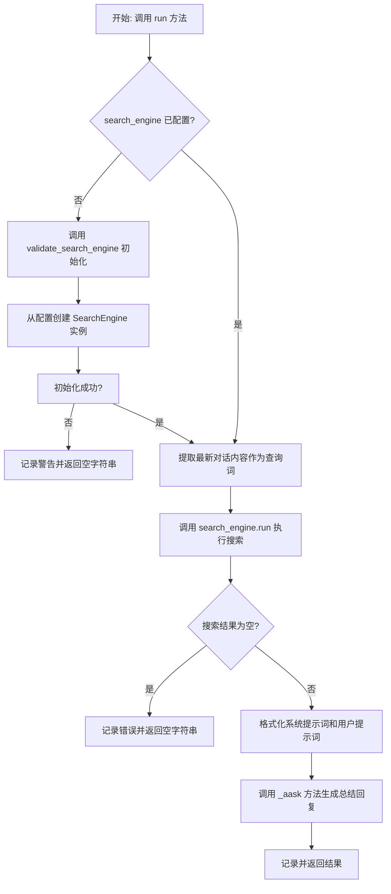
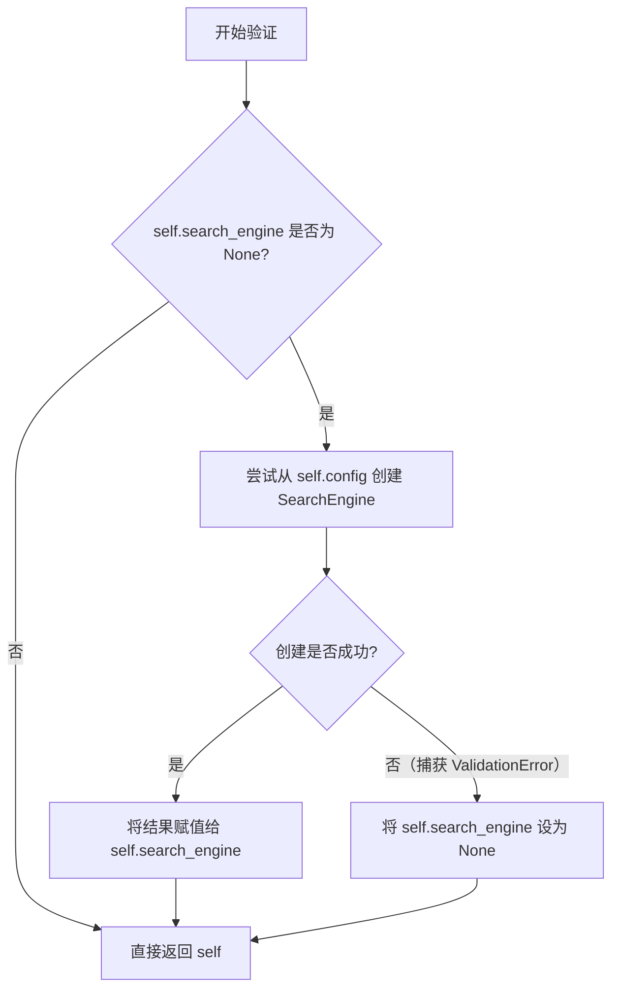

# `.\MetaGPT\metagpt\actions\search_and_summarize.py` 详细设计文档

该代码定义了一个名为 SearchAndSummarize 的动作类，其核心功能是接收对话历史作为上下文，使用搜索引擎查询最新对话内容，获取搜索结果后，结合预设的系统提示词模板，生成一个结构化的、经过总结的回复。

## 整体流程



## 类结构

```
Action (基类，来自 metagpt.actions)
└── SearchAndSummarize
```

## 全局变量及字段


### `SEARCH_AND_SUMMARIZE_SYSTEM`
    
用于定义搜索和总结任务通用系统提示的模板字符串，包含任务要求和格式规范。

类型：`str`
    


### `SEARCH_AND_SUMMARIZE_SYSTEM_EN_US`
    
英文版本的搜索和总结任务系统提示，由通用模板格式化生成。

类型：`str`
    


### `SEARCH_AND_SUMMARIZE_PROMPT`
    
用于构建搜索和总结任务用户提示的模板字符串，包含上下文、历史对话和当前查询的占位符。

类型：`str`
    


### `SEARCH_AND_SUMMARIZE_SALES_SYSTEM`
    
用于销售场景的搜索和总结任务系统提示，包含特定于销售对话的格式要求和示例。

类型：`str`
    


### `SEARCH_AND_SUMMARIZE_SALES_PROMPT`
    
用于构建销售场景搜索和总结任务用户提示的模板字符串。

类型：`str`
    


### `SEARCH_FOOD`
    
用于美食推荐场景的特定搜索任务提示，定义了专业管家的回复风格和格式要求。

类型：`str`
    


### `SearchAndSummarize.name`
    
Action的名称标识符，用于区分不同的动作。

类型：`str`
    


### `SearchAndSummarize.content`
    
可选字段，用于存储Action的附加内容或上下文信息。

类型：`Optional[str]`
    


### `SearchAndSummarize.search_engine`
    
执行网络搜索的搜索引擎实例，用于获取外部信息。

类型：`SearchEngine`
    


### `SearchAndSummarize.result`
    
存储最近一次搜索引擎查询返回的原始结果字符串。

类型：`str`
    
    

## 全局函数及方法

### `SearchAndSummarize.validate_search_engine`

该方法是一个Pydantic模型验证器，用于在`SearchAndSummarize`类实例化后，自动验证并初始化`search_engine`字段。如果`search_engine`字段为`None`，则尝试从配置中创建并赋值一个`SearchEngine`实例。

参数：
-  `self`：`SearchAndSummarize`，`SearchAndSummarize`类的实例。

返回值：`SearchAndSummarize`，返回经过验证和可能修改后的`self`实例本身。

#### 流程图



#### 带注释源码

```python
    @model_validator(mode="after")  # 这是一个Pydantic模型验证器，在模型实例化后运行
    def validate_search_engine(self):
        # 检查当前实例的 search_engine 字段是否为 None
        if self.search_engine is None:
            try:
                # 尝试从实例的 config 属性中获取搜索配置，并创建 SearchEngine 实例
                config = self.config
                search_engine = SearchEngine.from_search_config(config.search, proxy=config.proxy)
            except pydantic.ValidationError:
                # 如果创建过程中发生 Pydantic 验证错误，则将 search_engine 设为 None
                search_engine = None

            # 将创建（或为None）的 search_engine 赋值给当前实例的字段
            self.search_engine = search_engine
        # 验证器必须返回模型实例本身（或一个包含字段的字典）
        return self
```

### `SearchAndSummarize.run`

该方法是一个异步方法，属于 `SearchAndSummarize` 类。它的核心功能是接收一个对话历史上下文，提取最新的用户查询，使用配置的搜索引擎执行搜索，然后将搜索结果与对话历史结合，通过一个大型语言模型（LLM）生成一个结构化的、总结性的回复。该方法整合了信息检索和文本生成，旨在提供基于上下文的、信息丰富的答案。

参数：

- `context`：`list[Message]`，一个包含对话历史消息的列表，列表中的最后一个元素是当前需要处理的查询。
- `system_text`：`str`，可选参数，用于定义LLM系统提示的模板文本，默认为 `SEARCH_AND_SUMMARIZE_SYSTEM`。它设定了回复的格式、风格和要求。

返回值：`str`，返回由LLM生成的、基于搜索和对话历史的总结性文本回复。如果搜索引擎未配置或搜索返回空结果，则返回空字符串。

#### 流程图

```mermaid
graph TD
    A[开始: run(context, system_text)] --> B{搜索引擎 search_engine 已配置?};
    B -- 否 --> C[记录警告日志并返回空字符串];
    B -- 是 --> D[从context中提取最新查询 query];
    D --> E[异步调用搜索引擎: search_engine.run(query)];
    E --> F{搜索结果 rsp 是否为空?};
    F -- 是 --> G[记录错误日志并返回空字符串];
    F -- 否 --> H[构建系统提示 system_prompt];
    H --> I[使用 rsp 和 context 格式化用户提示 prompt];
    I --> J[异步调用 _aask 方法请求LLM生成结果];
    J --> K[记录调试日志并返回LLM生成的结果 result];
    C --> L[结束];
    G --> L;
    K --> L;
```

#### 带注释源码

```python
async def run(self, context: list[Message], system_text=SEARCH_AND_SUMMARIZE_SYSTEM) -> str:
    # 1. 检查搜索引擎是否可用。如果未配置，记录警告并返回空结果。
    if self.search_engine is None:
        logger.warning("Configure one of SERPAPI_API_KEY, SERPER_API_KEY, GOOGLE_API_KEY to unlock full feature")
        return ""

    # 2. 从传入的对话上下文（Message列表）中提取最新的用户查询。
    query = context[-1].content
    # logger.debug(query)

    # 3. 使用配置的搜索引擎异步执行搜索，获取与查询相关的信息。
    rsp = await self.search_engine.run(query)
    self.result = rsp  # 将搜索结果存储到实例变量中

    # 4. 检查搜索结果是否为空。如果为空，记录错误并返回空字符串。
    if not rsp:
        logger.error("empty rsp...")
        return ""
    # logger.info(rsp)

    # 5. 准备用于大语言模型（LLM）的提示信息。
    #    系统提示定义了回复的规则和格式。
    system_prompt = [system_text]

    # 6. 构建用户提示。该提示模板将搜索结果（作为参考信息）、完整的对话历史以及当前查询组合在一起，
    #    引导LLM基于这些信息生成回复。
    prompt = SEARCH_AND_SUMMARIZE_PROMPT.format(
        ROLE=self.prefix,           # 发言者角色（例如“Salesperson”）
        CONTEXT=rsp,                # 搜索引擎返回的参考信息
        QUERY_HISTORY="\n".join([str(i) for i in context[:-1]]), # 当前查询之前的历史对话
        QUERY=str(context[-1]),     # 当前查询
    )

    # 7. 异步调用 `_aask` 方法（继承自父类 Action），将构建好的提示发送给LLM，并获取生成的文本回复。
    result = await self._aask(prompt, system_prompt)

    # 8. 记录构建的提示和LLM返回的结果（调试级别），便于问题追踪。
    logger.debug(prompt)
    logger.debug(result)

    # 9. 返回LLM生成的最终回复。
    return result
```

## 关键组件


### 搜索与总结系统提示模板

定义了用于指导大语言模型（LLM）进行网络搜索结果总结和回复生成的系统提示（System Prompt）和用户提示（User Prompt）模板，支持通用场景和特定销售场景。

### 搜索引擎集成与配置

通过 `SearchEngine` 类封装了对不同搜索引擎（如SerpAPI、Serper、Google Custom Search）的调用，并在 `SearchAndSummarize` 类的验证器中实现了基于配置的惰性初始化，以支持可插拔的搜索后端。

### 对话历史与上下文处理

`SearchAndSummarize` 类的 `run` 方法接收一个 `Message` 列表作为上下文，能够提取最新的查询，并将整个对话历史格式化后嵌入到发送给LLM的提示中，实现了基于多轮对话的连贯性搜索与总结。

### 动作执行框架集成

`SearchAndSummarize` 类继承自 `Action` 基类，遵循MetaGPT框架中定义的动作执行模式，通过 `run` 方法作为主要入口点，并利用 `_aask` 方法与LLM进行异步交互，将框架的通用能力与具体的搜索总结逻辑解耦。


## 问题及建议


### 已知问题

-   **硬编码的提示词模板**：代码中包含了多个硬编码的提示词模板字符串（如 `SEARCH_AND_SUMMARIZE_SYSTEM`, `SEARCH_AND_SUMMARIZE_PROMPT` 等）。这降低了代码的灵活性和可维护性，当需要调整提示词格式或支持新的场景时，必须直接修改源代码。
-   **搜索引擎初始化逻辑耦合**：`SearchEngine` 的初始化逻辑直接内嵌在 `validate_search_engine` 方法中，并依赖于 `self.config`。这使得 `SearchAndSummarize` 类与特定的配置结构（`config.search`, `config.proxy`）强耦合，难以在单元测试中模拟或替换 `SearchEngine` 实例。
-   **错误处理不充分**：当 `search_engine` 为 `None` 时，`run` 方法仅记录一条警告并返回空字符串。这可能导致调用方无法区分“无搜索结果”和“搜索引擎未配置”这两种不同的失败情况，不利于上层逻辑进行针对性的错误处理或降级。
-   **潜在的日志信息泄露**：`run` 方法中使用了 `logger.debug(prompt)` 和 `logger.debug(result)`。如果日志级别设置为 `DEBUG`，可能会将包含用户查询和搜索结果的敏感信息输出到日志中，存在数据安全风险。
-   **结果字段未充分利用**：类字段 `result` 用于存储原始的搜索结果（`rsp`），但在 `run` 方法返回后，这个字段的值对于外部调用者来说是不可见的，其作用仅限于类内部，设计意图不明确。
-   **方法职责不单一**：`run` 方法承担了过多职责，包括：检查搜索引擎、执行搜索、格式化提示词、调用大模型进行总结。这违反了单一职责原则，使得方法难以测试和理解。

### 优化建议

-   **外部化配置提示词模板**：将 `SEARCH_AND_SUMMARIZE_SYSTEM`、`SEARCH_AND_SUMMARIZE_PROMPT` 等提示词模板移出代码，改为从配置文件（如 YAML、JSON）或数据库中加载。可以为不同的使用场景（如销售、美食搜索）定义不同的模板配置项，通过参数动态选择。
-   **依赖注入搜索引擎**：将 `SearchEngine` 实例作为构造参数传入 `SearchAndSummarize` 类，而不是在类内部根据配置创建。这遵循了依赖注入原则，提高了类的可测试性和灵活性，使其不依赖于具体的配置加载方式。
-   **细化异常类型**：定义更具体的异常类（如 `SearchEngineNotConfiguredError`, `SearchExecutionError`, `EmptySearchResultError`）并在相应场景中抛出，而不是简单地返回空字符串或记录日志。这允许调用方进行更精细的异常捕获和处理。
-   **审查并保护日志输出**：移除或重写 `logger.debug(prompt)` 和 `logger.debug(result)` 语句，避免记录可能包含用户隐私或敏感数据的完整内容。可以考虑记录元信息（如查询长度、结果条数）或对敏感信息进行脱敏处理。
-   **明确字段用途或重构**：如果 `result` 字段旨在缓存结果供后续使用，应提供相应的访问方法或属性。如果仅用于临时存储，可考虑将其改为局部变量，以简化类的状态管理。
-   **重构 `run` 方法**：将 `run` 方法拆分为更小的、功能单一的方法，例如：`_validate_and_get_engine()`, `_perform_search(query)`, `_build_summarize_prompt(context, search_result)`, `_summarize_with_llm(prompt, system_prompt)`。这可以提高代码的可读性、可测试性和可复用性。


## 其它


### 设计目标与约束

本模块的核心设计目标是提供一个可复用的、可配置的“搜索并总结”动作（Action），作为智能体（Agent）能力的一部分。它需要从外部搜索引擎获取信息，并根据给定的系统提示词（System Prompt）和对话历史，生成结构化的、高质量的文本回复。主要约束包括：
1.  **外部依赖**：严重依赖外部搜索引擎（通过`SearchEngine`类抽象），其可用性、速率限制和结果质量直接影响本模块功能。
2.  **配置驱动**：搜索引擎的实例化依赖于运行时配置（`config`），要求配置系统必须正确提供`search`和`proxy`等参数。
3.  **提示词工程**：回复的质量和格式高度依赖于预设的系统提示词（`SEARCH_AND_SUMMARIZE_SYSTEM`等）和用户提示词模板（`SEARCH_AND_SUMMARIZE_PROMPT`），修改需求可能需要调整这些模板。
4.  **异步执行**：为适应高并发场景，核心方法`run`被设计为异步方法。

### 错误处理与异常设计

模块的错误处理策略相对简单，主要侧重于容错和日志记录：
1.  **搜索引擎初始化失败**：在`validate_search_engine`方法中，若从配置创建`SearchEngine`实例失败（如缺少必要的API密钥），会将`self.search_engine`设置为`None`，并在后续`run`方法中通过日志警告并返回空字符串，避免进程崩溃。
2.  **搜索引擎运行时错误**：`search_engine.run(query)`的异常处理依赖于`SearchEngine`类自身的实现。本模块仅在其返回空结果（`if not rsp`）时记录错误日志并返回空字符串。
3.  **大模型请求错误**：对`self._aask`的调用（向大语言模型提问）的异常处理同样上抛至其父类`Action`或更上层处理，本模块未进行捕获。
4.  **输入验证**：对输入参数`context`（`Message`列表）的完整性检查较弱，仅假设其至少包含一个元素（`context[-1]`）。

### 数据流与状态机

1.  **数据流**：
    *   **输入**：`run`方法接收一个`Message`对象列表作为`context`，其中最后一个`Message`的`content`被提取为搜索查询词（`query`）。
    *   **处理**：
        a. 使用`query`调用`search_engine.run`进行网络搜索，获取原始结果`rsp`。
        b. 将`rsp`、整个`context`历史等信息填充到预定义的提示词模板`SEARCH_AND_SUMMARIZE_PROMPT`中，生成最终的用户提示（`prompt`）。
        c. 将系统提示（`system_text`）和用户提示（`prompt`）发送给大语言模型（通过`_aask`方法）。
    *   **输出**：`run`方法返回大语言模型生成的文本总结（`result`）。同时，将原始搜索结果`rsp`存储在`self.result`字段中。
2.  **状态机**：本模块类（`SearchAndSummarize`）本身无复杂状态变迁。其生命周期内的关键状态是`search_engine`字段的初始化状态（`None`或有效对象），该状态在首次运行`run`方法前通过`validate_search_engine`方法确定。

### 外部依赖与接口契约

1.  **外部依赖**：
    *   **`metagpt.tools.search_engine.SearchEngine`**：核心依赖，负责执行实际的网络搜索。本模块通过其`run`方法获取信息。
    *   **`metagpt.actions.Action`**：父类，提供了`_aask`等方法用于与大语言模型交互，并定义了动作的基本框架（如`name`, `run`接口）。
    *   **`pydantic`**：用于数据验证和设置管理（`@model_validator`）。
    *   **第三方搜索引擎API（间接）**：如SerpAPI、Serper、Google Custom Search等，通过`SearchEngine`类封装。
2.  **接口契约**：
    *   **对上游调用者**：承诺提供一个异步的`run(context: list[Message], system_text: str) -> str`方法，接收对话历史，返回总结文本。当搜索引擎未配置或搜索失败时，可能返回空字符串。
    *   **对`SearchEngine`**：期望其提供一个异步的`run(query: str) -> str`方法，返回搜索结果的文本摘要。
    *   **对父类`Action`**：遵循其接口规范，特别是使用`_aask`进行LLM调用，并可能依赖父类注入的`config`属性。

    