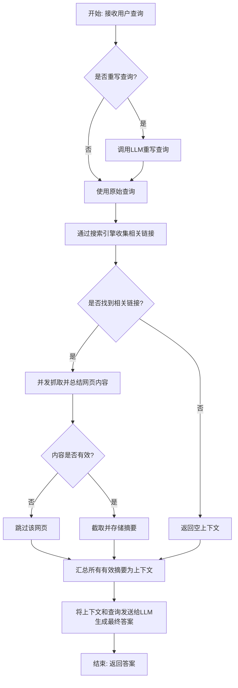
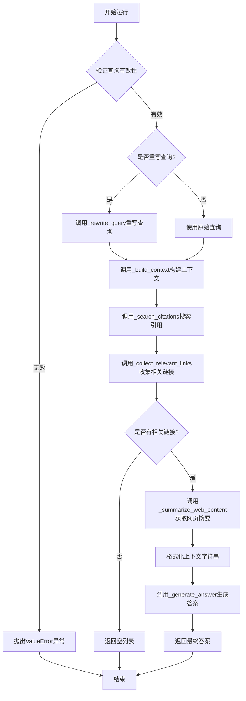
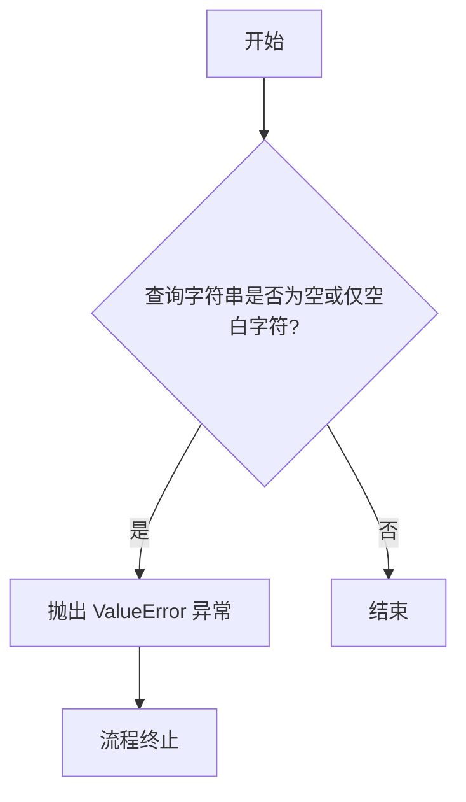
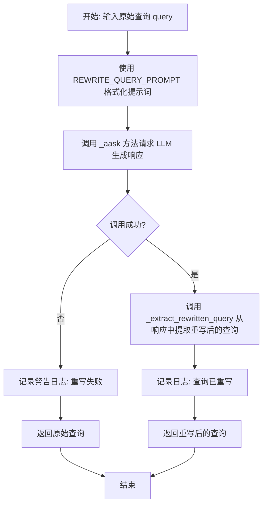
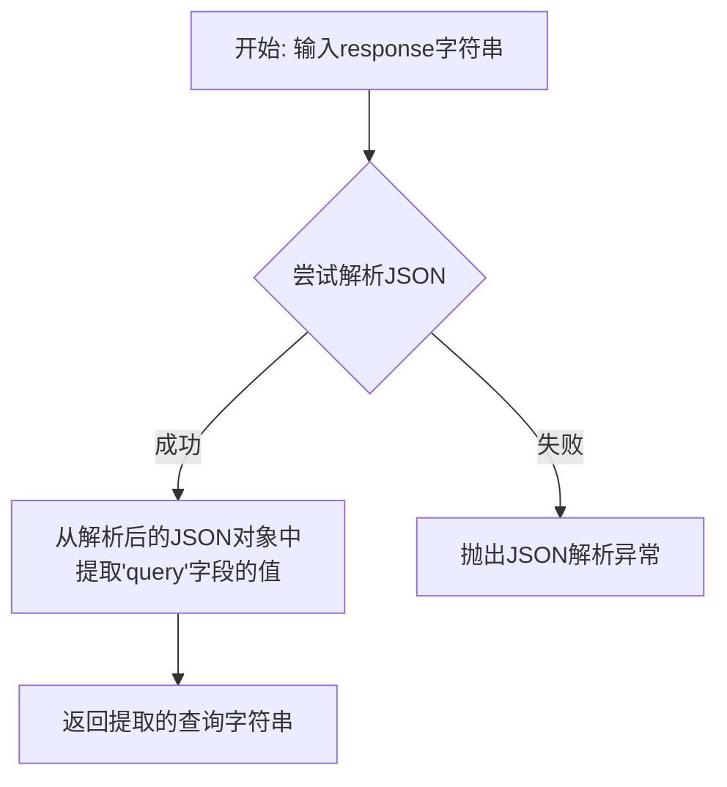
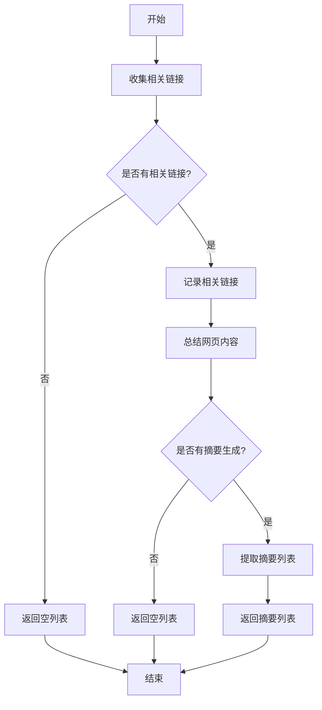
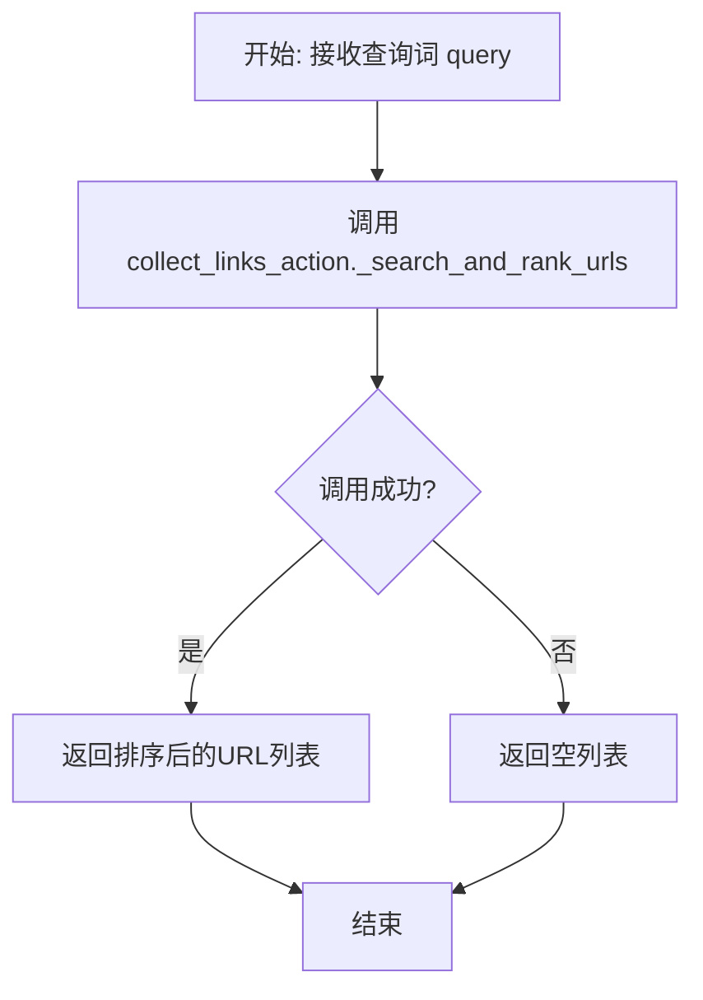
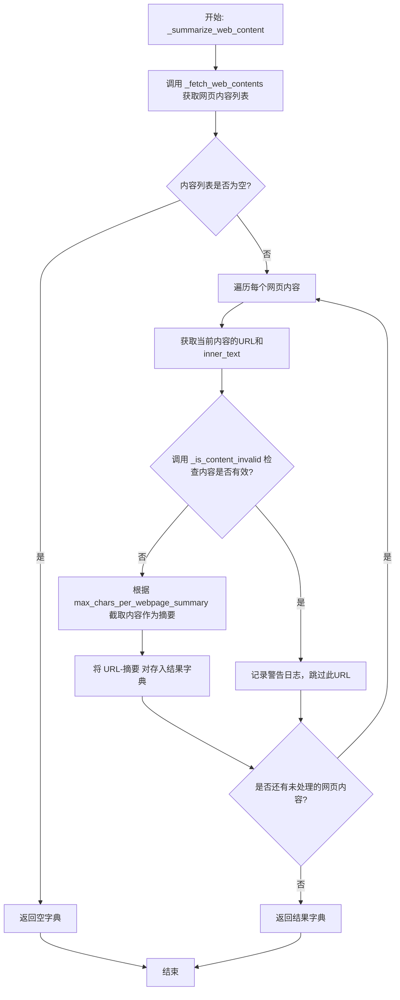
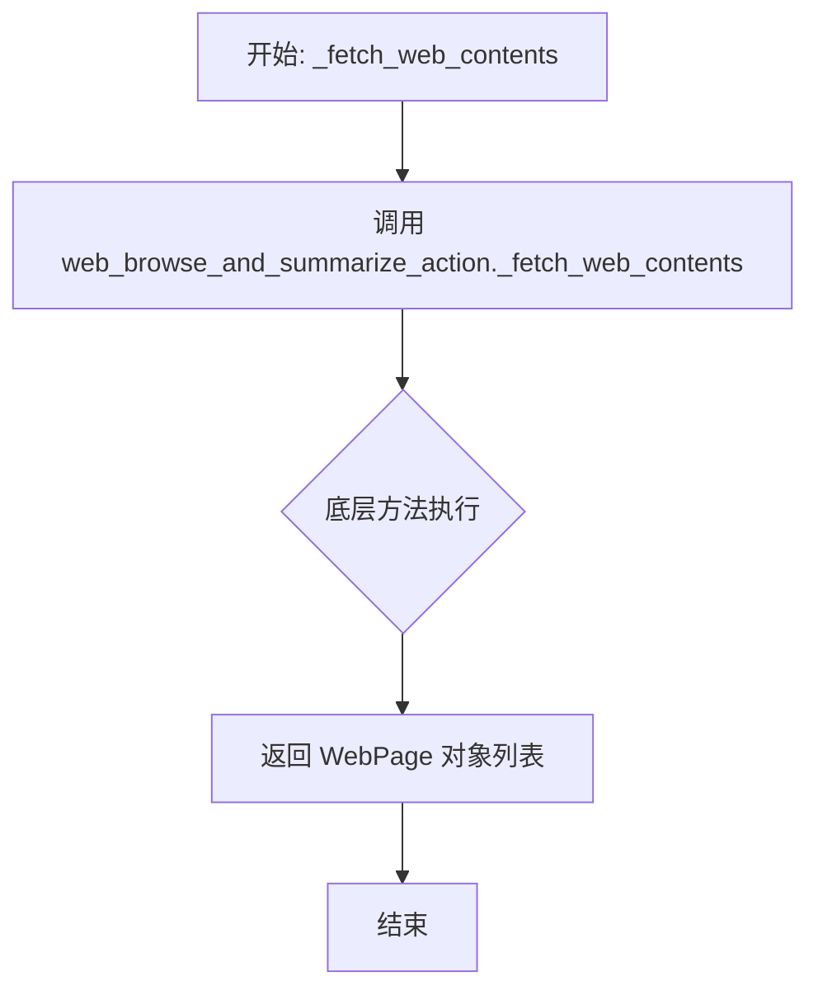
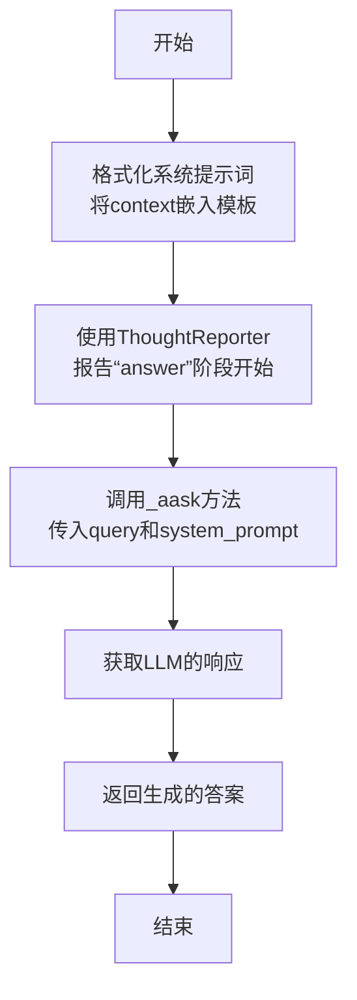

# `.\MetaGPT\metagpt\actions\search_enhanced_qa.py` 详细设计文档

该代码实现了一个名为SearchEnhancedQA的智能问答动作类，它通过集成搜索引擎来增强问答能力。核心功能是接收用户查询，可选地重写查询以获得更好的搜索结果，然后收集相关网页链接，浏览并总结网页内容，最后基于这些总结的上下文信息，使用大语言模型生成准确、专业的答案。

## 整体流程



## 类结构

```
Action (元类)
└── SearchEnhancedQA (搜索增强问答类)
    ├── 字段: name, desc, collect_links_action, web_browse_and_summarize_action, per_page_timeout, java_script_enabled, user_agent, extra_http_headers, max_chars_per_webpage_summary, max_search_results
    ├── 私有字段: _reporter
    ├── 方法: __init__, initialize, run, _validate_query, _process_query, _rewrite_query, _extract_rewritten_query, _build_context, _search_citations, _collect_relevant_links, _summarize_web_content, _fetch_web_contents, _generate_answer
```

## 全局变量及字段


### `REWRITE_QUERY_PROMPT`
    
用于指导大语言模型（LLM）将用户问题重写为更适合搜索引擎查询的提示词模板。

类型：`str`
    


### `SEARCH_ENHANCED_QA_SYSTEM_PROMPT`
    
用于指导大语言模型（LLM）基于提供的网络搜索上下文来生成最终答案的系统提示词模板。

类型：`str`
    


### `SearchEnhancedQA.name`
    
该Action的名称，固定为'SearchEnhancedQA'。

类型：`str`
    


### `SearchEnhancedQA.desc`
    
对该Action功能的简短描述，说明其通过集成搜索引擎结果来回答问题。

类型：`str`
    


### `SearchEnhancedQA.collect_links_action`
    
用于从搜索引擎收集与查询相关链接的Action实例。

类型：`CollectLinks`
    


### `SearchEnhancedQA.web_browse_and_summarize_action`
    
用于浏览网页并生成内容摘要的Action实例，在类初始化时若未提供则自动创建。

类型：`WebBrowseAndSummarize`
    


### `SearchEnhancedQA.per_page_timeout`
    
获取单个网页内容的最大超时时间（秒），用于控制网络请求的等待时长。

类型：`float`
    


### `SearchEnhancedQA.java_script_enabled`
    
控制网页浏览器引擎是否启用JavaScript，影响对动态加载网页内容的抓取能力。

类型：`bool`
    


### `SearchEnhancedQA.user_agent`
    
发起网络请求时使用的特定用户代理字符串，用于模拟特定浏览器以避免被网站屏蔽。

类型：`str`
    


### `SearchEnhancedQA.extra_http_headers`
    
随每个网络请求发送的额外HTTP头部信息字典，用于传递特定的请求元数据。

类型：`dict`
    


### `SearchEnhancedQA.max_chars_per_webpage_summary`
    
每个网页内容摘要的最大字符数限制，用于控制输入给LLM的上下文长度。

类型：`int`
    


### `SearchEnhancedQA.max_search_results`
    
通过collect_links_action收集的最大搜索结果（链接）数量，控制用于回答问题的潜在信息来源数量。

类型：`int`
    
    

## 全局函数及方法

### `SearchEnhancedQA.run`

该方法通过整合搜索引擎结果来回答用户问题。它首先验证查询，然后可选地重写查询以优化搜索效果，接着收集相关链接并获取网页内容摘要，最后基于这些上下文信息生成答案。

参数：

- `query`：`str`，原始用户查询字符串
- `rewrite_query`：`bool`，是否重写查询以获取更好的搜索结果，默认为True

返回值：`str`，基于网络搜索结果生成的详细答案

#### 流程图



#### 带注释源码

```python
async def run(self, query: str, rewrite_query: bool = True) -> str:
    """Answer a query by leveraging web search results.

    Args:
        query (str): The original user query.
        rewrite_query (bool): Whether to rewrite the query for better web search results. Defaults to True.

    Returns:
        str: A detailed answer based on web search results.

    Raises:
        ValueError: If the query is invalid.
    """
    # 使用ThoughtReporter进行异步报告，记录搜索初始化阶段
    async with self._reporter:
        await self._reporter.async_report({"type": "search", "stage": "init"})
        
        # 1. 验证查询有效性
        self._validate_query(query)

        # 2. 处理查询（可选重写）
        processed_query = await self._process_query(query, rewrite_query)
        
        # 3. 构建上下文信息
        context = await self._build_context(processed_query)

        # 4. 生成最终答案
        return await self._generate_answer(processed_query, context)
```


### `SearchEnhancedQA._validate_query`

该方法用于验证用户输入的查询字符串是否有效。它检查查询是否为空或仅包含空白字符，如果无效则抛出异常。

参数：

- `query`：`str`，需要验证的用户查询字符串

返回值：`None`，无返回值。如果验证失败，将抛出 `ValueError` 异常。

#### 流程图



#### 带注释源码

```python
def _validate_query(self, query: str) -> None:
    """Validate the input query.

    Args:
        query (str): The query to validate.

    Raises:
        ValueError: If the query is invalid.
    """

    # 检查查询字符串是否为空或仅由空白字符（如空格、制表符、换行符）组成
    if not query.strip():
        # 如果验证失败，抛出 ValueError 异常，提示用户查询不能为空
        raise ValueError("Query cannot be empty or contain only whitespace.")
```


### `SearchEnhancedQA._process_query`

该方法负责处理用户查询，根据 `should_rewrite` 标志决定是否对查询进行重写以优化搜索引擎的搜索结果。如果启用重写，它会调用 `_rewrite_query` 方法；否则，直接返回原始查询。

参数：

-  `query`：`str`，需要处理的原始用户查询字符串。
-  `should_rewrite`：`bool`，指示是否需要对查询进行重写的标志。

返回值：`str`，处理后的查询字符串。如果启用了重写且成功，则返回重写后的查询；如果重写失败或未启用重写，则返回原始查询。

#### 流程图

```mermaid
flowchart TD
    A[开始: _process_query] --> B{should_rewrite == True?}
    B -- 是 --> C[调用 _rewrite_query(query)]
    C --> D{重写成功?}
    D -- 是 --> E[返回重写后的查询]
    D -- 否 --> F[返回原始查询]
    B -- 否 --> F
    E --> G[结束]
    F --> G
```

#### 带注释源码

```python
async def _process_query(self, query: str, should_rewrite: bool) -> str:
    """Process the query, optionally rewriting it."""

    # 检查是否需要重写查询
    if should_rewrite:
        # 如果需要重写，则调用 _rewrite_query 方法
        return await self._rewrite_query(query)

    # 如果不需要重写，直接返回原始查询
    return query
```


### `SearchEnhancedQA._rewrite_query`

该方法用于优化用户的原始查询，生成更适合搜索引擎的查询语句。它通过调用大语言模型（LLM）并遵循特定的提示词模板来重写查询。如果重写过程失败，则返回原始查询。

参数：

- `query`：`str`，原始的搜索查询字符串。

返回值：`str`，重写后的查询字符串。如果重写失败，则返回原始查询。

#### 流程图



#### 带注释源码

```python
async def _rewrite_query(self, query: str) -> str:
    """Write a better search query for web search engine.

    If the rewrite process fails, the original query is returned.

    Args:
        query (str): The original search query.

    Returns:
        str: The rewritten query if successful, otherwise the original query.
    """

    # 1. 使用预定义的提示词模板，将原始查询 `query` 填充到模板中，生成最终的提示词。
    prompt = REWRITE_QUERY_PROMPT.format(q=query)

    try:
        # 2. 调用父类 Action 的 `_aask` 方法，将提示词发送给大语言模型 (LLM) 并获取响应。
        resp = await self._aask(prompt)
        # 3. 调用 `_extract_rewritten_query` 方法，从 LLM 的响应中解析出 JSON 格式的重写后查询。
        rewritten_query = self._extract_rewritten_query(resp)

        # 4. 记录成功重写的日志，展示原始查询和重写后查询的对比。
        logger.info(f"Query rewritten: '{query}' -> '{rewritten_query}'")
        # 5. 返回重写后的查询。
        return rewritten_query
    except Exception as e:
        # 6. 如果在上述任何步骤中发生异常（如网络错误、LLM 响应格式错误等），则捕获异常。
        # 7. 记录警告日志，说明重写失败并返回原始查询。
        logger.warning(f"Query rewrite failed. Returning original query. Error: {e}")
        # 8. 返回原始的查询字符串作为兜底方案。
        return query
```

### `SearchEnhancedQA._extract_rewritten_query`

该方法用于从大语言模型（LLM）的JSON格式响应中提取重写后的查询字符串。它解析响应文本，定位并返回JSON对象中的`query`字段值。

参数：

- `response`：`str`，包含LLM响应的原始字符串，预期格式为JSON。

返回值：`str`，从JSON响应中提取出的重写后的查询字符串。

#### 流程图



#### 带注释源码

```python
def _extract_rewritten_query(self, response: str) -> str:
    """Extract the rewritten query from the LLM's JSON response."""

    # 1. 使用json.loads将字符串response解析为Python字典对象。
    #    这里依赖CodeParser.parse_code先对response进行预处理（例如提取JSON代码块），
    #    但根据提供的代码，parse_code的lang参数为"json"，其行为可能是直接返回response或提取其中的JSON部分。
    resp_json = json.loads(CodeParser.parse_code(response, lang="json"))
    
    # 2. 从解析后的字典resp_json中，获取键为"query"的值。
    #    这是重写后查询字符串的存储位置。
    return resp_json["query"]
```


### `SearchEnhancedQA._build_context`

该方法用于构建一个包含网络搜索结果的上下文字符串。它通过调用内部方法获取与查询相关的网页内容摘要，并将这些摘要格式化为带编号的引用（citation），最终拼接成一个完整的上下文字符串返回。

参数：

-  `query`：`str`，用于搜索相关网页内容的查询字符串。

返回值：`str`，一个格式化后的上下文字符串，其中每一行代表一个网页内容的摘要，并以 `[[citation:x]]` 的格式进行编号。

#### 流程图

```mermaid
flowchart TD
    A[开始: _build_context(query)] --> B[调用 _search_citations(query) 获取摘要列表]
    B --> C{摘要列表是否为空?}
    C -- 是 --> D[返回空字符串]
    C -- 否 --> E[遍历摘要列表<br>为每个摘要添加 citation 编号]
    E --> F[使用换行符连接所有带编号的摘要]
    F --> G[返回构建好的上下文字符串]
    G --> H[结束]
```

#### 带注释源码

```python
async def _build_context(self, query: str) -> str:
    """Construct a context string from web search citations.

    Args:
        query (str): The search query.

    Returns:
        str: Formatted context with numbered citations.
    """

    # 1. 执行搜索并获取网页内容摘要列表
    citations = await self._search_citations(query)
    # 2. 将摘要列表格式化为带编号的字符串
    #    使用 enumerate 为每个摘要生成从1开始的编号 (i+1)
    #    格式为 "[[citation:{i+1}]] {摘要内容}"
    #    使用两个换行符 `\n\n` 连接所有格式化后的摘要
    context = "\n\n".join([f"[[citation:{i+1}]] {c}" for i, c in enumerate(citations)])

    # 3. 返回构建好的上下文字符串
    return context
```


### `SearchEnhancedQA._search_citations`

该方法负责执行网络搜索并总结相关内容，以构建用于回答问题的引用列表。它首先收集与查询相关的URL，然后获取并总结这些网页的内容，最后返回一个包含摘要的列表。

参数：

- `query`：`str`，搜索查询字符串，用于查找相关信息。

返回值：`list[str]`，包含相关网页内容摘要的列表，每个摘要对应一个引用。

#### 流程图



#### 带注释源码

```python
async def _search_citations(self, query: str) -> list[str]:
    """执行网络搜索并总结相关内容。

    参数:
        query (str): 搜索查询。

    返回:
        list[str]: 相关网页内容的摘要列表。
    """

    # 步骤1: 收集与查询相关的URL
    relevant_urls = await self._collect_relevant_links(query)
    
    # 报告搜索阶段和收集到的URL
    await self._reporter.async_report({"type": "search", "stage": "searching", "urls": relevant_urls})
    
    # 如果没有找到相关URL，记录警告并返回空列表
    if not relevant_urls:
        logger.warning(f"No relevant URLs found for query: {query}")
        return []

    # 记录找到的相关链接
    logger.info(f"The Relevant links are: {relevant_urls}")

    # 步骤2: 总结网页内容
    web_summaries = await self._summarize_web_content(relevant_urls)
    
    # 如果没有生成摘要，记录警告并返回空列表
    if not web_summaries:
        logger.warning(f"No summaries generated for query: {query}")
        return []

    # 步骤3: 从摘要字典中提取值（摘要列表）
    citations = list(web_summaries.values())

    # 返回摘要列表
    return citations
```


### `SearchEnhancedQA._collect_relevant_links`

该方法负责根据给定的查询词，通过调用底层的链接收集动作（`CollectLinks`）来搜索并获取相关的网页链接。它是构建问答上下文的关键步骤，旨在为后续的网页内容抓取和摘要提供高质量的URL来源。

参数：

-  `query`：`str`，用户提出的搜索查询词，用于在搜索引擎中查找相关信息。

返回值：`list[str]`，一个经过排序的、与查询词最相关的网页URL列表。

#### 流程图



#### 带注释源码

```python
async def _collect_relevant_links(self, query: str) -> list[str]:
    """Search and rank URLs relevant to the query.

    Args:
        query (str): The search query.

    Returns:
        list[str]: Ranked list of relevant URLs.
    """

    # 核心操作：委托给专门的链接收集动作（CollectLinks）执行搜索和排名。
    # 传入参数：
    #   - topic: 搜索主题，此处与query相同。
    #   - query: 搜索查询词。
    #   - max_num_results: 最大返回结果数，由类字段`max_search_results`控制。
    return await self.collect_links_action._search_and_rank_urls(
        topic=query, query=query, max_num_results=self.max_search_results
    )
```


### `SearchEnhancedQA._summarize_web_content`

该方法负责从给定的URL列表中获取网页内容，并进行初步的筛选和摘要生成。它通过调用底层的网页抓取引擎获取原始内容，然后根据配置的最大长度限制对内容进行截取，生成摘要。同时，它会过滤掉被判定为无效的内容。

参数：

- `urls`：`list[str]`，需要抓取和摘要的网页URL列表。

返回值：`dict[str, str]`，一个字典，键为URL，值为该URL对应网页内容的摘要。

#### 流程图



#### 带注释源码

```python
async def _summarize_web_content(self, urls: list[str]) -> dict[str, str]:
    """Fetch and summarize content from given URLs.

    Args:
        urls (list[str]): List of URLs to summarize.

    Returns:
        dict[str, str]: Mapping of URLs to their summaries.
    """

    # 1. 获取网页原始内容：调用内部方法，传入URL列表，获取WebPage对象列表。
    contents = await self._fetch_web_contents(urls)

    # 2. 初始化摘要字典。
    summaries = {}
    # 3. 报告浏览阶段开始，将WebPage对象列表转换为字典列表以便上报。
    await self._reporter.async_report(
        {"type": "search", "stage": "browsing", "pages": [i.model_dump() for i in contents]}
    )
    # 4. 遍历每个获取到的网页内容。
    for content in contents:
        url = content.url
        # 5. 获取网页的纯文本内容，并移除换行符。
        inner_text = content.inner_text.replace("\n", "")
        # 6. 有效性检查：使用关联的WebBrowseAndSummarize动作中的方法判断内容是否无效（如广告、错误页）。
        if self.web_browse_and_summarize_action._is_content_invalid(inner_text):
            # 7. 如果内容无效，记录警告日志并跳过此URL。
            logger.warning(f"Invalid content detected for URL {url}: {inner_text[:10]}...")
            continue

        # 8. 生成摘要：根据类字段`max_chars_per_webpage_summary`配置的最大长度，对文本进行截取。
        summary = inner_text[: self.max_chars_per_webpage_summary]
        # 9. 将URL和摘要存入结果字典。
        summaries[url] = summary

    # 10. 返回包含有效URL及其摘要的字典。
    return summaries
```


### `SearchEnhancedQA._fetch_web_contents`

该方法负责异步获取给定URL列表对应的网页内容。它通过调用`WebBrowseAndSummarize`动作的`_fetch_web_contents`方法，批量抓取网页，并返回一个包含网页原始数据（如HTML、文本内容等）的`WebPage`对象列表。

参数：

-  `urls`：`list[str]`，需要抓取内容的网页URL列表。
-  `per_page_timeout`：`float`，抓取单个网页时的超时时间（秒）。此参数通过`*urls`解包后传递给底层方法。

返回值：`list[WebPage]`，一个`WebPage`对象列表，每个对象代表一个成功抓取的网页的详细信息（如URL、页面标题、内部文本等）。

#### 流程图



#### 带注释源码

```python
async def _fetch_web_contents(self, urls: list[str]) -> list[WebPage]:
    # 调用内部 WebBrowseAndSummarize 动作的 _fetch_web_contents 方法。
    # 将当前实例的 per_page_timeout 配置传递给底层方法，以控制单个页面的抓取超时。
    # 该方法负责实际的网络请求、页面渲染（如果启用JavaScript）和内容解析。
    # 返回一个 WebPage 对象列表，每个对象封装了一个URL的抓取结果。
    return await self.web_browse_and_summarize_action._fetch_web_contents(
        *urls, per_page_timeout=self.per_page_timeout
    )
```


### `SearchEnhancedQA._generate_answer`

该方法根据用户查询和从网络搜索收集的上下文信息，生成一个详细的答案。它通过格式化系统提示词，调用大语言模型（LLM）来综合上下文并生成最终的回答。

参数：

- `query`：`str`，用户的原始问题。
- `context`：`str`，从网络搜索中收集并格式化后的相关上下文信息，通常包含带编号的引用。

返回值：`str`，基于提供的上下文生成的、针对用户问题的最终答案。

#### 流程图



#### 带注释源码

```python
async def _generate_answer(self, query: str, context: str) -> str:
    """Generate an answer using the query and context.

    Args:
        query (str): The user's question.
        context (str): Relevant information from web search.

    Returns:
        str: Generated answer based on the context.
    """

    # 1. 格式化系统提示词：将收集到的上下文（context）嵌入到预定义的提示词模板中。
    system_prompt = SEARCH_ENHANCED_QA_SYSTEM_PROMPT.format(context=context)

    # 2. 创建一个新的ThoughtReporter实例，用于记录LLM生成答案的过程。
    #    使用与主流程相同的UUID，并启用LLM流式输出记录。
    async with ThoughtReporter(uuid=self._reporter.uuid, enable_llm_stream=True) as reporter:
        # 3. 报告状态：进入“answer”生成阶段。
        await reporter.async_report({"type": "search", "stage": "answer"})
        # 4. 调用LLM：使用格式化后的系统提示词和用户查询，请求LLM生成答案。
        rsp = await self._aask(query, [system_prompt])
    # 5. 返回LLM生成的答案。
    return rsp
```

## 关键组件


### 搜索增强问答 (SearchEnhancedQA)

一个通过集成搜索引擎结果来增强问答能力的动作类，它能够重写查询、收集相关链接、浏览网页并生成摘要，最终利用这些上下文信息生成准确的答案。

### 查询重写器 (Query Rewriter)

一个基于提示词工程（`REWRITE_QUERY_PROMPT`）的组件，用于将用户的原始查询优化为更适合搜索引擎检索的查询语句，以提高搜索结果的相关性。

### 链接收集器 (CollectLinks)

一个负责调用搜索引擎、执行搜索并收集和排序相关网页链接的动作组件，是构建答案上下文的数据源入口。

### 网页浏览与摘要器 (WebBrowseAndSummarize)

一个负责抓取指定网页内容、进行初步清洗（如去除无效内容）并生成摘要的动作组件，将原始网页内容转化为可用于生成答案的文本片段。

### 上下文构建器 (Context Builder)

一个逻辑组件，负责将收集到的网页摘要组织成带有引用编号（如 `[[citation:x]]`）的格式化上下文字符串，为最终的大语言模型问答提供结构化输入。

### 答案生成器 (Answer Generator)

一个基于大语言模型的组件，它接收用户查询和构建好的上下文，遵循特定的系统提示（`SEARCH_ENHANCED_QA_SYSTEM_PROMPT`）生成最终的回答，并确保答案准确、简洁且不直接复制上下文。

### 网页浏览器引擎 (WebBrowserEngine)

一个底层工具，为 `WebBrowseAndSummarize` 提供网页抓取能力，支持配置如 JavaScript 启用、用户代理、HTTP 头等参数，以适应不同网站的访问需求。

### 思维报告器 (ThoughtReporter)

一个用于追踪和报告搜索问答过程中各个阶段（初始化、搜索中、浏览中、生成答案）状态和中间数据的工具，有助于调试和监控流程执行情况。


## 问题及建议


### 已知问题

-   **错误处理不完善**：`_rewrite_query` 方法在解析LLM响应失败时，仅记录警告并返回原始查询。这可能导致后续搜索基于一个不理想的查询进行，影响最终答案质量。异常处理过于宽泛（捕获所有`Exception`），不利于问题诊断。
-   **内容摘要方法过于简单**：`_summarize_web_content` 方法中的摘要生成逻辑过于简单，仅对网页文本进行截断（`inner_text[: self.max_chars_per_webpage_summary]`）。这可能导致关键信息丢失（如果信息在截断点之后），或包含大量无关内容（如导航栏、广告文本），影响LLM生成答案的准确性和相关性。
-   **潜在的性能瓶颈**：`_fetch_web_contents` 方法可能同步获取多个网页内容。如果`per_page_timeout`设置较长或网页响应慢，会显著增加整体响应时间。当前代码未体现出明显的并发优化。
-   **配置与逻辑耦合**：`initialize` 方法中硬编码了 `WebBrowseAndSummarize` 的初始化逻辑，使得 `web_browse_and_summarize_action` 字段的 `default=None` 设置显得有些矛盾，且降低了该组件的可替换性和可测试性。
-   **代码可读性与维护性**：部分私有方法（如 `_search_and_rank_urls`, `_fetch_web_contents`, `_is_content_invalid`）是从依赖的Action类中调用的，这增加了对内部实现的依赖，违反了封装原则，使得代码更脆弱，且理解代码流程需要跳转到其他类。

### 优化建议

-   **增强错误处理与降级策略**：在 `_rewrite_query` 方法中，应更精细地捕获JSON解析等特定异常。可考虑实现多级降级策略，例如首次重写失败后，尝试一种更简单的查询重构规则，而非直接回退到原始查询。
-   **引入智能内容摘要**：将简单的文本截断替换为更智能的摘要方法。可以调用LLM对网页主要内容进行提取和总结，或者集成专门的文本提取库（如`readability`、`trafilatura`）来获取干净的正文内容，再进行摘要或关键信息提取。
-   **实现并发抓取与超时控制优化**：使用异步并发（如`asyncio.gather`）来并行抓取多个网页，并设置合理的总超时和单个任务超时。考虑实现一个优先级队列或根据域名权重调整抓取策略，以提高整体效率。
-   **解耦配置与初始化逻辑**：考虑将 `WebBrowseAndSummarize` 的创建完全通过配置或依赖注入来完成。可以将 `web_browse_and_summarize_action` 的 `default_factory` 设置为一个从配置构建实例的函数，使初始化逻辑更清晰，并提升可测试性。
-   **减少内部依赖与提升封装性**：审查对 `CollectLinks` 和 `WebBrowseAndSummarize` 内部方法的调用。理想情况下，应通过这些Action类公开的`run`方法或定义良好的公共接口进行交互，而不是直接调用其私有方法。这需要评估并可能修改这些依赖类的设计。同时，为当前类的关键方法添加更详细的文档字符串和类型注解。
-   **增加缓存机制**：对于相同的搜索查询和URL，可以考虑引入缓存层（如内存缓存或分布式缓存）来存储摘要结果，避免重复的网络请求和计算，特别是在频繁问答的场景下可以显著提升性能。
-   **完善日志与监控**：在关键步骤（如开始搜索、获得链接、开始抓取、生成答案）增加更结构化的日志和性能指标上报，便于监控系统运行状态、诊断问题和进行性能分析。


## 其它


### 设计目标与约束

本模块的核心设计目标是通过集成搜索引擎能力，增强大型语言模型在问答任务中的准确性和信息时效性。其主要约束包括：1) 必须能够处理开放式、需要最新或外部知识的用户问题；2) 需要在有限的网络请求时间（`per_page_timeout`）和资源（`max_search_results`）内完成信息检索；3) 生成的答案必须基于检索到的上下文，并遵循特定的格式要求（如不包含引用标记、语言一致等）；4) 作为`Action`子类，需遵循MetaGPT框架的交互协议。

### 错误处理与异常设计

模块采用分层防御策略进行错误处理。在入口方法`run`中，通过`_validate_query`进行基础输入验证，抛出`ValueError`。在查询重写（`_rewrite_query`）和内容提取（`_extract_rewritten_query`）环节，使用`try-except`捕获JSON解析等异常，并降级为使用原始查询，同时记录警告日志。在网页内容获取（`_fetch_web_contents`）和摘要生成（`_summarize_web_content`）过程中，依赖底层`WebBrowseAndSummarize`和`WebBrowserEngine`组件的异常处理，并对无效内容进行过滤和日志记录。整体设计倾向于韧性，在非关键步骤失败时（如重写失败、单个网页获取失败）尝试继续流程，而非立即终止。

### 数据流与状态机

数据流遵循清晰的“查询处理 -> 上下文构建 -> 答案生成”管道。1) **输入**：原始查询字符串。2) **查询处理阶段**：可选地通过LLM重写查询，输出优化后的搜索词。3) **上下文构建阶段**：使用优化后的查询进行网络搜索（`CollectLinks`），获取URL列表；并发抓取并截断这些URL的网页内容（`WebBrowseAndSummarize`）；将内容整理为带编号引用的上下文字符串。4) **答案生成阶段**：将原始查询和构建的上下文组合成提示词，发送给LLM生成最终答案。模块内部通过`ThoughtReporter`报告“init”、“searching”、“browsing”、“answer”等关键阶段的状态，用于监控和调试，但并未实现严格的状态机。

### 外部依赖与接口契约

1.  **MetaGPT框架**：继承自`Action`基类，需实现`run`方法。依赖`config`属性获取浏览器和代理配置。
2.  **工具注册**：通过`@register_tool`装饰器将自身注册为工具，仅暴露`run`方法。
3.  **动作依赖**：
    *   `CollectLinks`：负责执行搜索引擎查询并返回相关URL列表。依赖其`_search_and_rank_urls`方法。
    *   `WebBrowseAndSummarize`：负责抓取网页并提取文本内容。依赖其`_fetch_web_contents`方法和`_is_content_invalid`方法。
4.  **浏览器引擎**：通过`WebBrowserEngine`进行实际的网页抓取，依赖其配置（JavaScript、HTTP头、用户代理、代理等）。
5.  **大语言模型（LLM）**：隐式依赖，通过继承的`_aask`方法调用，用于查询重写和最终答案生成。
6.  **数据结构**：使用`WebPage`（来自`metagpt.utils.parse_html`）作为网页内容的容器。
7.  **报告系统**：依赖`ThoughtReporter`进行过程报告。

### 配置管理与参数化

模块高度可配置，关键参数通过`Field`定义并暴露：
*   **搜索控制**：`max_search_results`（控制搜索广度）、`per_page_timeout`（控制单页抓取超时）。
*   **内容处理**：`max_chars_per_webpage_summary`（控制上下文长度，影响LLM输入大小和成本）。
*   **浏览器行为**：`java_script_enabled`、`user_agent`、`extra_http_headers`（适应不同网站的反爬策略）。
*   **组件替换**：`collect_links_action`和`web_browse_and_summarize_action`允许注入自定义实现。
配置在`initialize`方法中通过`self.config`读取并用于初始化`WebBrowserEngine`，体现了与框架配置的集成。

### 性能考量与优化空间

1.  **并发与超时**：`_fetch_web_contents`理论上支持并发抓取多个URL，`per_page_timeout`防止单个慢请求阻塞整体流程。
2.  **内容截断**：`max_chars_per_webpage_summary`硬截断网页文本，是控制上下文长度、避免模型令牌超限和降低计算成本的关键措施，但可能导致信息丢失。
3.  **缓存**：当前未实现任何缓存机制。对于频繁出现的相同或相似查询，重复执行搜索和抓取会造成资源浪费和响应延迟。
4.  **降级策略**：当查询重写失败、未找到相关链接或网页内容无效时，模块有相应的日志记录和流程继续机制，但最终答案质量可能下降。`_generate_answer`方法中的系统提示词要求模型在信息不足时声明“information is missing on”，这是一种面向用户的降级。

    