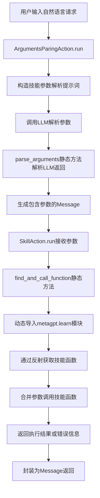
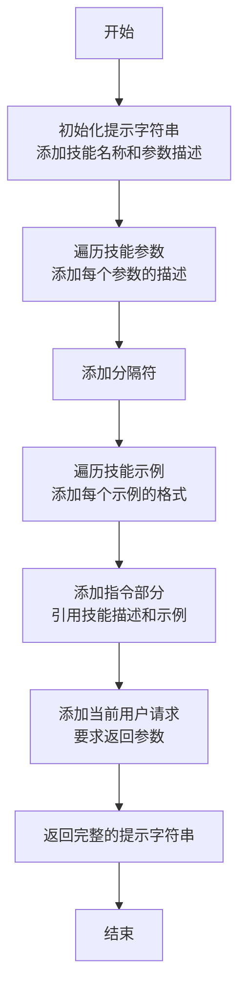
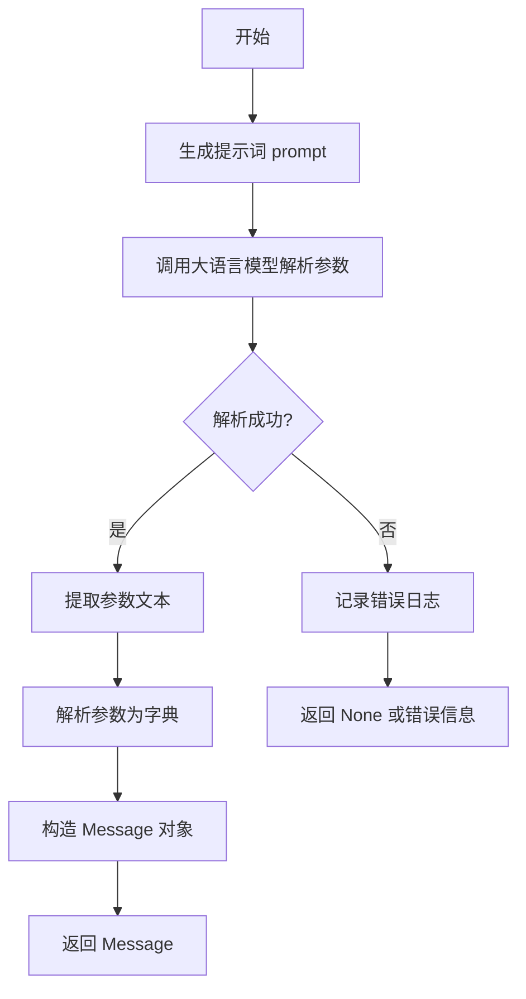
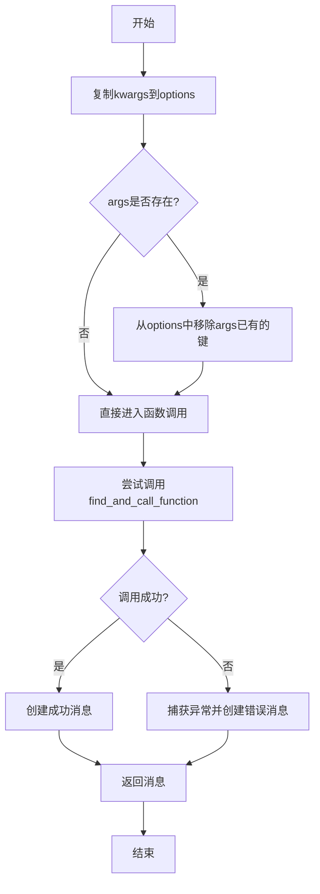
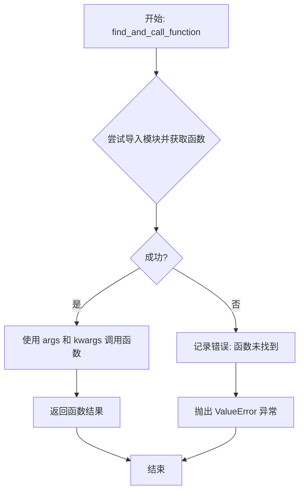

# `.\MetaGPT\metagpt\actions\skill_action.py` 详细设计文档

该代码实现了一个技能调用系统，包含两个核心动作类：`ArgumentsParingAction` 用于解析用户自然语言请求，将其转换为特定技能所需的参数字典；`SkillAction` 用于根据解析出的参数动态查找并调用对应的技能函数。整个模块作为智能体学习技能的调用执行层，连接自然语言指令与底层技能实现。

## 整体流程



## 类结构

```
Action (基类)
├── ArgumentsParingAction (参数解析动作)
└── SkillAction (技能执行动作)
```

## 全局变量及字段


### `ArgumentsParingAction.skill`
    
要解析参数的技能对象，包含技能名称、参数描述和示例等信息。

类型：`Skill`
    


### `ArgumentsParingAction.ask`
    
用户输入的原始请求文本，用于生成参数解析的提示词。

类型：`str`
    


### `ArgumentsParingAction.rsp`
    
存储LLM返回的原始响应消息，包含解析后的参数内容。

类型：`Optional[Message]`
    


### `ArgumentsParingAction.args`
    
存储从LLM响应中解析出的技能函数参数字典。

类型：`Optional[Dict]`
    


### `SkillAction.skill`
    
要执行的技能对象，包含技能名称和实现函数等信息。

类型：`Skill`
    


### `SkillAction.args`
    
技能函数执行时需要的参数字典，由ArgumentsParingAction解析生成。

类型：`Dict`
    


### `SkillAction.rsp`
    
存储技能函数执行结果或错误信息的消息对象。

类型：`Optional[Message]`
    
    

## 全局函数及方法

### `ArgumentsParingAction.prompt`

`ArgumentsParingAction.prompt` 是一个属性方法，用于生成一个提示字符串，该字符串基于 `Skill` 对象的信息，指导大语言模型（LLM）如何将用户的自然语言请求（`ask`）解析为特定技能函数所需的参数。它通过提供函数参数描述、示例以及当前用户请求来构造一个清晰的指令。

参数：

-  `self`：`ArgumentsParingAction` 实例，包含 `skill` 和 `ask` 属性。

返回值：`str`，构造好的提示字符串，用于引导 LLM 进行参数解析。

#### 流程图



#### 带注释源码

```python
    @property
    def prompt(self):
        # 1. 初始化提示字符串，包含技能名称和参数描述标题
        prompt = f"{self.skill.name} function parameters description:\n"
        # 2. 遍历技能的所有参数，将每个参数的名称和描述添加到提示中
        for k, v in self.skill.arguments.items():
            prompt += f"parameter `{k}`: {v}\n"
        # 3. 添加一个分隔符，用于区分不同部分
        prompt += "\n---\n"
        # 4. 添加示例部分的标题
        prompt += "Examples:\n"
        # 5. 遍历技能的所有示例，将每个示例的请求（ask）和期望的回答格式（answer）添加到提示中
        for e in self.skill.examples:
            prompt += f"If want you to do `{e.ask}`, return `{e.answer}` brief and clear.\n"
        # 6. 再次添加分隔符
        prompt += "\n---\n"
        # 7. 添加核心指令：要求模型参考函数描述和示例，将当前用户的请求（self.ask）解析成函数参数
        prompt += (
            f"\nRefer to the `{self.skill.name}` function description, and fill in the function parameters according "
            'to the example "I want you to do xx" in the Examples section.'
            f"\nNow I want you to do `{self.ask}`, return function parameters in Examples format above, brief and "
            "clear."
        )
        # 8. 返回构造好的完整提示字符串
        return prompt
```

### `ArgumentsParingAction.run`

该方法是一个异步方法，用于解析用户输入的文本，根据预定义的技能描述和示例，提取出调用该技能所需的参数，并返回一个包含解析结果的`Message`对象。

参数：

- `with_message`：`Optional[Message]`，可选参数，通常用于传递上下文消息，但在此方法中未直接使用。
- `**kwargs`：`Dict`，可变关键字参数，用于传递额外的配置或上下文信息，但在此方法中未直接使用。

返回值：`Message`，返回一个`Message`对象，其中包含解析后的参数信息。

#### 流程图



#### 带注释源码

```python
async def run(self, with_message=None, **kwargs) -> Message:
    # 生成用于提示大语言模型的文本，包含技能描述、参数说明和示例
    prompt = self.prompt
    # 异步调用大语言模型，请求其根据提示词解析用户输入`self.ask`，生成参数文本
    rsp = await self.llm.aask(
        msg=prompt,
        system_msgs=["You are a function parser.", "You can convert spoken words into function parameters."],
        stream=False,
    )
    # 记录详细的调试日志，包含原始提示词和模型返回结果
    logger.debug(f"SKILL:{prompt}\n, RESULT:{rsp}")
    # 调用静态方法`parse_arguments`，将模型返回的文本解析为参数字典
    self.args = ArgumentsParingAction.parse_arguments(skill_name=self.skill.name, txt=rsp)
    # 将解析结果封装到Message对象中。`instruct_content`字段存储解析后的参数字典。
    self.rsp = Message(content=rsp, role="assistant", instruct_content=self.args, cause_by=self)
    # 返回包含解析结果的Message对象
    return self.rsp
```

### `ArgumentsParingAction.parse_arguments`

该方法用于从给定的文本中解析出指定技能的函数参数。它通过查找技能名称和括号，提取参数文本，并使用Python的`ast`模块将参数文本解析为字典格式。

参数：

- `skill_name`：`str`，技能的名称，用于在文本中定位参数部分。
- `txt`：`str`，包含技能调用和参数的文本。

返回值：`dict`，解析后的参数字典，如果解析失败则返回`None`。

#### 流程图

```mermaid
flowchart TD
    A[开始] --> B{skill_name( 是否在 txt 中?}
    B -->|否| C[记录错误并返回 None]
    B -->|是| D{')' 是否在 txt 中?}
    D -->|否| E[记录错误并返回 None]
    D -->|是| F[提取参数文本 args_txt]
    F --> G[构造假表达式 dict(args_txt)]
    G --> H[使用 ast.parse 解析表达式]
    H --> I[遍历关键字参数并提取键值对]
    I --> J[返回参数字典 args]
    C --> K[结束]
    E --> K
    J --> K
```

#### 带注释源码

```python
@staticmethod
def parse_arguments(skill_name, txt) -> dict:
    # 定义技能名称和左括号的组合，用于在文本中定位参数部分的开始
    prefix = skill_name + "("
    # 检查技能名称和左括号是否在文本中，如果不在则记录错误并返回None
    if prefix not in txt:
        logger.error(f"{skill_name} not in {txt}")
        return None
    # 检查右括号是否在文本中，如果不在则记录错误并返回None
    if ")" not in txt:
        logger.error(f"')' not in {txt}")
        return None
    # 找到技能名称和左括号在文本中的起始位置
    begin_ix = txt.find(prefix)
    # 找到右括号在文本中的最后出现位置
    end_ix = txt.rfind(")")
    # 提取参数文本，即左括号之后、右括号之前的部分
    args_txt = txt[begin_ix + len(prefix) : end_ix]
    # 记录提取的参数文本，便于调试
    logger.info(args_txt)
    # 构造一个假的Python表达式，将参数文本包装成字典形式，便于使用ast解析
    fake_expression = f"dict({args_txt})"
    # 使用ast模块解析假表达式，得到抽象语法树（AST）
    parsed_expression = ast.parse(fake_expression, mode="eval")
    # 初始化一个空字典，用于存储解析后的参数
    args = {}
    # 遍历AST中的关键字参数节点（即参数名和参数值对）
    for keyword in parsed_expression.body.keywords:
        # 获取参数名
        key = keyword.arg
        # 使用ast.literal_eval安全地评估参数值（只支持Python字面量，如字符串、数字、列表等）
        value = ast.literal_eval(keyword.value)
        # 将参数名和值存入字典
        args[key] = value
    # 返回解析后的参数字典
    return args
```

### `SkillAction.run`

该方法用于执行一个已学习的技能（Skill）。它首先尝试根据技能名称动态导入并调用对应的函数，传入解析好的参数。如果调用成功，则返回函数执行结果；如果发生异常（如模块未找到、属性错误或其他运行时错误），则捕获异常并返回错误信息。

参数：

- `with_message`：`Optional[Any]`，可选参数，通常用于传递消息上下文，但在此方法中未直接使用。
- `**kwargs`：`Dict[str, Any]`，关键字参数，用于传递额外的选项或配置，这些参数会在调用技能函数时与解析的参数合并。

返回值：`Message`，返回一个消息对象，其中包含技能函数的执行结果或错误信息。消息的角色为"assistant"，原因由当前`SkillAction`实例引起。

#### 流程图



#### 带注释源码

```python
async def run(self, with_message=None, **kwargs) -> Message:
    """运行动作"""
    # 深拷贝kwargs到options，避免修改原始参数
    options = deepcopy(kwargs)
    # 如果存在预解析的参数args，则从options中移除这些键，防止重复
    if self.args:
        for k in self.args.keys():
            if k in options:
                options.pop(k)
    try:
        # 调用静态方法find_and_call_function，传入技能名称、解析的参数和剩余选项
        rsp = await self.find_and_call_function(self.skill.name, args=self.args, **options)
        # 创建成功的消息对象，内容为函数返回结果，角色为助手，原因为当前动作
        self.rsp = Message(content=rsp, role="assistant", cause_by=self)
    except Exception as e:
        # 如果发生任何异常，记录异常日志
        logger.exception(f"{e}, traceback:{traceback.format_exc()}")
        # 创建错误消息对象，内容为错误描述
        self.rsp = Message(content=f"Error: {e}", role="assistant", cause_by=self)
    # 返回消息对象（无论是成功还是失败）
    return self.rsp
```

### `SkillAction.find_and_call_function`

这是一个静态异步方法，用于动态查找并调用指定名称的函数。它首先尝试从`metagpt.learn`模块中导入目标函数，然后使用提供的参数（包括位置参数和关键字参数）执行该函数，并返回其执行结果。如果函数未找到，则记录错误并抛出异常。

参数：

- `function_name`：`str`，要查找和调用的函数名称。
- `args`：`Dict`，一个字典，包含传递给目标函数的位置参数。
- `kwargs`：`**kwargs`，可变关键字参数，将与`args`合并后传递给目标函数。

返回值：`str`，目标函数执行后返回的字符串结果。

#### 流程图



#### 带注释源码

```python
    @staticmethod
    async def find_and_call_function(function_name, args, **kwargs) -> str:
        try:
            # 1. 动态导入 `metagpt.learn` 模块。
            module = importlib.import_module("metagpt.learn")
            # 2. 从导入的模块中获取指定名称的函数对象。
            function = getattr(module, function_name)
            # 3. 异步调用获取到的函数，将 `args` 字典和 `kwargs` 关键字参数解包后传入。
            result = await function(**args, **kwargs)
            # 4. 返回函数的执行结果。
            return result
        except (ModuleNotFoundError, AttributeError):
            # 5. 异常处理：如果模块不存在或模块中没有指定名称的函数，则记录错误日志。
            logger.error(f"{function_name} not found")
            # 6. 抛出 `ValueError` 异常，通知调用者函数未找到。
            raise ValueError(f"{function_name} not found")
```

## 关键组件


### 技能参数解析组件 (ArgumentsParingAction)

负责将用户的自然语言请求（`ask`）解析为特定技能（`Skill`）所需的、符合其参数定义（`arguments`）和示例（`examples`）格式的结构化参数字典（`args`）。

### 技能执行组件 (SkillAction)

负责根据给定的技能名称（`skill.name`）和结构化参数（`args`），动态查找并调用对应的技能函数，执行具体的技能逻辑并返回结果。

### 技能加载与定义组件 (Skill)

（在导入的`metagpt.learn.skill_loader`模块中定义）作为核心数据结构，封装了技能的名称、参数描述、示例等元信息，是连接参数解析与技能执行的桥梁。

### 动态函数调用机制

通过`importlib.import_module`和`getattr`实现运行时动态导入模块并获取函数对象，支持技能的灵活注册与调用，无需硬编码。


## 问题及建议


### 已知问题

-   **脆弱的参数解析逻辑**：`ArgumentsParingAction.parse_arguments` 方法通过字符串查找和 `ast.literal_eval` 来解析 LLM 返回的文本，这种方法非常脆弱。如果 LLM 的返回格式稍有偏差（例如，参数值包含未转义的特殊字符、使用了不同的括号格式、或返回了更复杂的表达式），解析就会失败或引发异常。
-   **错误处理不充分**：在 `parse_arguments` 方法中，当解析失败时（如 `skill_name` 或 `)` 未找到），仅记录错误日志并返回 `None`。调用方 `run` 方法未对此 `None` 值进行有效处理，可能导致后续流程出错。同样，`SkillAction.run` 中捕获异常后仅返回一个包含错误信息的 `Message`，但未区分错误类型或提供恢复机制。
-   **硬编码的模块路径**：`SkillAction.find_and_call_function` 方法硬编码了 `import_module("metagpt.learn")`，这意味着所有技能函数都必须定义在 `metagpt.learn` 模块中。这严重限制了技能的部署位置和代码的组织灵活性，违反了依赖倒置原则。
-   **潜在的资源与状态问题**：`SkillAction.run` 方法使用 `deepcopy(kwargs)` 来创建 `options` 副本，如果 `kwargs` 中包含不可深拷贝的对象（如数据库连接、文件句柄、网络套接字等），将导致错误。同时，技能函数被异步调用，但未考虑其可能存在的副作用（如修改共享状态）或资源管理（如打开文件未关闭）。
-   **技能加载与验证缺失**：代码假设传入的 `Skill` 对象是完整且有效的，但未对其内容（如 `skill.name`, `skill.arguments`, `skill.examples`）进行验证。例如，`skill.name` 可能不对应 `metagpt.learn` 模块中的任何实际函数，或者 `skill.arguments` 的描述可能与实际函数签名不匹配，这将在运行时导致失败。
-   **提示词工程风险**：`ArgumentsParingAction.prompt` 属性生成的提示词依赖于 `skill.examples` 的格式。如果示例格式不一致或不清晰，将直接影响 LLM 解析用户请求 (`self.ask`) 的准确性，进而导致参数解析错误。

### 优化建议

-   **重构参数解析机制**：建议使用更鲁棒的方法来解析 LLM 返回的结构化数据。例如，可以要求 LLM 直接返回 JSON 格式的参数对象，然后使用 `json.loads` 进行解析。或者，结合 Pydantic 模型来定义和验证参数结构，利用 LLM 的函数调用（Function Calling）能力来获取结构化输出。
-   **增强错误处理与反馈**：在 `parse_arguments` 中，应定义明确的异常类型（如 `ArgumentParseError`）并在解析失败时抛出，而不是静默返回 `None`。在 `run` 方法中应捕获这些异常，并可能通过重试、提供更明确的提示给用户或回退到默认流程来处理。对于技能执行错误，应分类处理（如参数错误、函数未找到、执行异常），并提供更有指导性的错误信息。
-   **解耦技能函数定位**：引入一个技能注册表（Skill Registry）或依赖注入机制。`Skill` 对象应包含其实现函数的完整导入路径（如 `module_path:function_name`），或者通过一个配置层来映射技能名到具体的可调用对象。这样可以将技能的实现与 `SkillAction` 类解耦，提高可扩展性。
-   **改进资源与状态管理**：避免对未知的 `kwargs` 进行 `deepcopy`。可以考虑只传递技能函数明确需要的参数，或者通过一个清晰的上下文对象来传递共享资源。对于技能函数，应在其接口文档中明确其副作用和资源需求，并在 `SkillAction` 中提供相应的生命周期管理（如使用上下文管理器）。
-   **增加技能验证步骤**：在 `SkillAction` 初始化或执行前，应验证 `Skill` 对象的有效性。例如，检查 `skill.name` 对应的函数是否存在于指定的模块中，并且其函数签名是否与 `skill.arguments` 的描述兼容。这可以在系统启动或技能加载时完成，避免运行时错误。
-   **优化提示词设计与测试**：将 `ArgumentsParingAction.prompt` 的构建逻辑抽取为可配置的模板，便于调整和测试。建立一套针对不同技能和示例的提示词测试用例，以评估和提升 LLM 解析的准确率。考虑使用更少的示例（Few-shot）或思维链（Chain-of-Thought）技术来提高复杂参数解析的可靠性。
-   **提升代码可测试性**：将 `llm.aask` 的调用、模块导入 (`importlib.import_module`) 和函数获取 (`getattr`) 等依赖项通过依赖注入（如构造函数参数）的方式提供，以便在单元测试中轻松模拟（mock），提高测试覆盖率。
-   **添加日志与监控**：在关键步骤（如收到用户请求、生成提示词、收到LLM回复、解析参数、调用技能函数）增加更详细的结构化日志，便于调试和监控系统行为。可以记录技能执行的耗时、成功率等指标。


## 其它


### 设计目标与约束

本模块的设计目标是实现一个能够动态调用已学习技能的框架，核心在于将自然语言描述的用户请求（`ask`）解析为特定技能函数所需的参数，并安全地执行该技能。主要约束包括：1) 技能函数必须预定义在 `metagpt.learn` 模块中；2) 参数解析依赖于大语言模型（LLM）的准确性，且LLM的输出格式需符合特定模式（`skill_name(arg1=val1, arg2=val2)`）；3) 执行过程需具备错误隔离能力，避免单个技能失败导致整个系统崩溃。

### 错误处理与异常设计

模块采用分层错误处理策略。在参数解析阶段（`ArgumentsParingAction.run`），若LLM返回的文本不符合预期格式（如缺少函数名或括号），则记录错误并返回`None`。在技能执行阶段（`SkillAction.run`），通过`try-except`块捕获所有异常，将异常信息封装到返回的`Message`对象中，并记录详细堆栈跟踪，确保主流程不被中断。静态方法`find_and_call_function`会捕获模块或函数未找到的特定异常，并转换为`ValueError`向上抛出。

### 数据流与状态机

数据流始于用户请求（`ask`字符串）。`ArgumentsParingAction`接收`ask`和`Skill`对象，通过LLM生成参数字典，输出为携带`instruct_content`（即参数）的`Message`。此`Message`或直接解析出的`args`字典作为输入传递给`SkillAction`。`SkillAction`结合`args`和可能的额外`kwargs`，动态导入并调用目标技能函数，将函数返回结果封装为新的`Message`输出。两个Action类均通过`rsp`字段缓存最近一次运行结果，构成一个简单的“运行-缓存”状态。

### 外部依赖与接口契约

1.  **LLM服务**：`ArgumentsParingAction.run` 方法依赖 `self.llm.aask` 方法，该接口需提供异步文本生成能力，并接受系统消息提示。
2.  **技能函数库**：`SkillAction.find_and_call_function` 方法硬性依赖 `metagpt.learn` 模块的存在。每个技能函数必须是一个可异步调用的函数，其函数签名（参数名）必须与`Skill.arguments`中定义的键以及LLM解析出的键保持一致。
3.  **数据结构**：依赖 `metagpt.schema.Message` 类作为输入输出的通用载体；依赖 `metagpt.learn.skill_loader.Skill` 类提供技能的名称、参数描述和示例。
4.  **日志系统**：依赖 `metagpt.logs.logger` 进行各级别（DEBUG, INFO, ERROR, EXCEPTION）的日志记录。

### 安全与合规性考虑

1.  **代码注入防护**：`ArgumentsParingAction.parse_arguments` 使用 `ast.literal_eval` 来安全地评估参数值，这能有效防止任意代码执行，因为它只解析Python字面量（字符串、数字、元组、列表、字典、布尔值、None）。
2.  **动态导入限制**：技能调用严格限定在 `metagpt.learn` 模块内，防止加载或执行未经授权的代码。
3.  **输入净化**：虽然`ask`内容直接拼接进LLM提示词，但最终执行的函数参数来源于经过`ast.literal_eval`处理的、结构化的字典，而非原始文本，这增加了一层安全屏障。
4.  **错误信息暴露**：在异常情况下，返回给用户的消息可能包含原始错误信息（`f"Error: {e}"`），在生产环境中可能需要对此进行泛化处理，避免泄露内部实现细节。

### 性能考量

1.  **LLM调用延迟**：`ArgumentsParingAction.run` 的核心开销是调用LLM进行参数解析，这是性能瓶颈。应考虑对解析结果进行缓存，特别是对于相同或相似的`ask`请求。
2.  **动态导入开销**：`SkillAction` 每次执行都通过 `importlib.import_module` 动态导入模块。虽然Python有导入缓存机制，但对于高频调用的技能，可以考虑在初始化时预加载或缓存函数引用。
3.  **深拷贝开销**：`SkillAction.run` 中使用 `deepcopy(kwargs)` 来避免修改传入的参数字典。如果`kwargs`结构复杂或庞大，这可能带来不必要的性能损耗。可以考虑使用浅拷贝或直接创建新字典的方式替代。

    