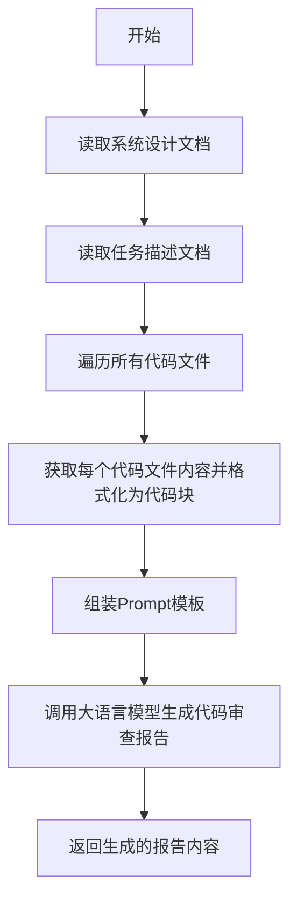
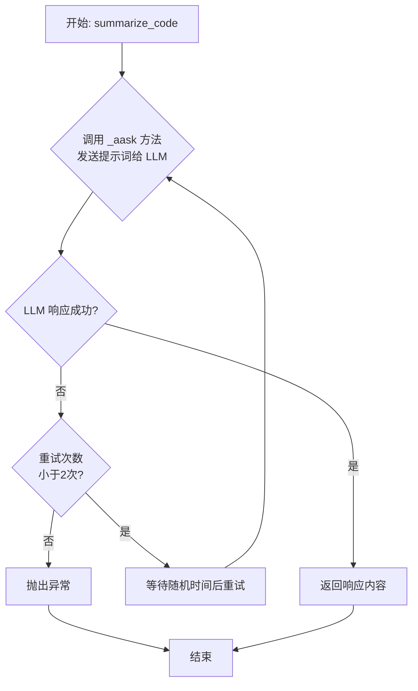
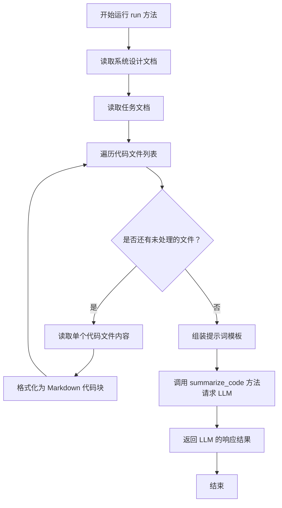

# `.\MetaGPT\metagpt\actions\summarize_code.py` 详细设计文档

该代码实现了一个名为SummarizeCode的动作类，其主要功能是分析给定的系统设计文档、任务描述和源代码文件，通过调用大语言模型生成代码审查报告。报告内容包括：对所有历史文件的代码审查（查找潜在bug、未实现功能、调用错误等）、基于已实现功能绘制完整的调用链图（mermaid格式）、对历史文件实现的总结、以及需要修改的文件列表和原因（TODO列表）。

## 整体流程



## 类结构

```
Action (基类)
└── SummarizeCode (代码总结动作类)
```

## 全局变量及字段


### `PROMPT_TEMPLATE`
    
用于生成代码总结提示词的多行字符串模板，包含系统设计、任务描述、代码块等占位符。

类型：`str`
    


### `FORMAT_EXAMPLE`
    
展示代码总结输出格式示例的多行字符串，包含代码审查、调用流程图、总结和待办事项等部分的示例。

类型：`str`
    


### `SummarizeCode.name`
    
动作类的名称，固定为'SummarizeCode'，用于标识该动作。

类型：`str`
    


### `SummarizeCode.i_context`
    
代码总结的上下文信息，包含设计文件、任务文件和代码文件列表等元数据。

类型：`CodeSummarizeContext`
    


### `SummarizeCode.repo`
    
项目仓库的引用，用于访问设计文档、任务文档和源代码文件，默认为None且从序列化中排除。

类型：`Optional[ProjectRepo]`
    


### `SummarizeCode.input_args`
    
动作的输入参数，遵循Pydantic BaseModel格式，默认为None且从序列化中排除。

类型：`Optional[BaseModel]`
    
    

## 全局函数及方法

### `SummarizeCode.summarize_code`

该方法是一个异步方法，用于生成代码的总结报告。它接收一个包含系统设计、任务描述和待分析代码块的格式化提示词（prompt），通过调用大语言模型（LLM）来执行代码审查、生成调用流程图、撰写总结并列出待办事项（TODOs）。该方法使用了重试机制来增强网络请求的鲁棒性。

参数：

-  `prompt`：`str`，包含系统设计、任务描述和待分析代码块的格式化提示词。

返回值：`str`，大语言模型（LLM）返回的代码总结报告字符串。

#### 流程图



#### 带注释源码

```python
    @retry(stop=stop_after_attempt(2), wait=wait_random_exponential(min=1, max=60)) # 装饰器：定义重试逻辑。失败后最多重试2次，每次重试前等待1到60秒之间的随机指数退避时间。
    async def summarize_code(self, prompt): # 异步方法定义，接收一个提示词字符串作为参数。
        code_rsp = await self._aask(prompt) # 调用父类 Action 的 _aask 方法，将提示词发送给大语言模型（LLM）并等待其响应。
        return code_rsp # 返回 LLM 生成的响应内容（字符串格式的代码总结报告）。
```

### `SummarizeCode.run`

该方法负责执行代码总结任务。它首先从项目仓库中读取系统设计文档、任务文档以及指定的代码文件，然后构建一个包含这些内容的提示词模板，最后调用大语言模型进行代码总结分析，并返回分析结果。

参数：

-  `self`：`SummarizeCode`，`SummarizeCode` 类的实例，用于访问类属性和其他方法。

返回值：`str`，大语言模型返回的代码总结分析结果字符串。

#### 流程图



#### 带注释源码

```python
async def run(self):
    # 1. 从项目仓库中读取系统设计文档
    design_pathname = Path(self.i_context.design_filename)
    design_doc = await self.repo.docs.system_design.get(filename=design_pathname.name)
    # 2. 从项目仓库中读取任务文档
    task_pathname = Path(self.i_context.task_filename)
    task_doc = await self.repo.docs.task.get(filename=task_pathname.name)
    # 3. 初始化代码块列表，用于存储所有代码文件的格式化内容
    code_blocks = []
    # 4. 遍历上下文对象中指定的所有代码文件名
    for filename in self.i_context.codes_filenames:
        # 4.1 从项目仓库的源代码中获取指定文件的内容
        code_doc = await self.repo.srcs.get(filename)
        # 4.2 根据文件后缀确定 Markdown 代码块的语言类型，并格式化为代码块字符串
        code_block = f"```{get_markdown_code_block_type(filename)}\n{code_doc.content}\n```\n---\n"
        # 4.3 将格式化后的代码块添加到列表中
        code_blocks.append(code_block)
    # 5. 获取输出格式示例
    format_example = FORMAT_EXAMPLE
    # 6. 使用读取到的文档内容和代码块列表，填充提示词模板
    prompt = PROMPT_TEMPLATE.format(
        system_design=design_doc.content,
        task=task_doc.content,
        code_blocks="\n".join(code_blocks),
        format_example=format_example,
    )
    # 7. 记录日志，表示开始进行代码总结
    logger.info("Summarize code..")
    # 8. 调用 `summarize_code` 方法（该方法内部会请求大语言模型）并传入构建好的提示词
    rsp = await self.summarize_code(prompt)
    # 9. 返回大语言模型生成的代码总结结果
    return rsp
```

## 关键组件

### SummarizeCode Action

一个用于代码总结和审查的Action类，它读取系统设计文档、任务描述和源代码文件，生成包含代码审查、调用流程图、总结和待办事项列表的详细报告。

### 代码审查与总结流程

一个基于模板的代码审查和总结流程，通过整合系统设计、任务描述和源代码块，利用大语言模型生成结构化的代码分析报告。

### 模板驱动的提示工程

使用预定义的PROMPT_TEMPLATE和FORMAT_EXAMPLE来构造LLM提示词，确保输出格式的标准化和一致性，包含系统设计、任务、代码块、代码审查、调用流程图、总结和待办事项等部分。

### 项目仓库集成

通过ProjectRepo与项目文档和源代码仓库进行交互，能够动态读取设计文档、任务文档和源代码文件，支持代码块的惰性加载和格式化。

### 重试机制

使用tenacity库实现的指数退避重试机制，在调用大语言模型服务失败时自动重试，提高操作的鲁棒性。

### 代码块类型识别

通过get_markdown_code_block_type函数自动识别源代码文件的类型，以生成正确的Markdown代码块标记，确保代码在报告中的正确高亮显示。

## 问题及建议


### 已知问题

-   **硬编码的提示词模板**：`PROMPT_TEMPLATE` 和 `FORMAT_EXAMPLE` 作为字符串常量直接嵌入在代码中。这降低了代码的可维护性和可配置性，当需要调整提示词格式或内容时，必须修改源代码。
-   **潜在的循环依赖风险**：`run` 方法通过 `self.repo` 获取文档和代码，但 `repo` 字段被标记为 `exclude=True`，这可能导致在序列化/反序列化时丢失状态，或者在特定初始化流程下产生依赖问题。
-   **错误处理不完善**：`summarize_code` 方法使用了 `tenacity` 进行重试，但重试逻辑仅针对网络或模型调用失败。对于从 `repo` 获取数据失败（如文件不存在）、提示词格式化错误或模型返回内容解析失败等情况，没有明确的错误处理或回退机制。
-   **代码块类型推断可能不准确**：`get_markdown_code_block_type(filename)` 函数仅根据文件名后缀推断代码块类型。对于非标准后缀或无后缀的文件，可能无法正确识别语言，影响生成文档的格式正确性。
-   **资源加载效率**：`run` 方法中通过循环依次获取多个代码文件的内容（`await self.repo.srcs.get(filename)`）。如果文件数量很多，这种串行操作可能成为性能瓶颈，且未利用可能的并发加载机制。

### 优化建议

-   **外部化配置提示词**：将 `PROMPT_TEMPLATE` 和 `FORMAT_EXAMPLE` 移至外部配置文件（如 YAML、JSON）或模板文件中。通过配置管理模块加载，提高灵活性和支持动态更新，无需重新部署代码。
-   **明确依赖注入与生命周期管理**：重新审视 `repo` 和 `input_args` 字段的设计。考虑在 `Action` 的初始化或运行上下文中显式传递这些依赖，而不是作为可选的类字段。确保它们在对象的整个生命周期内有效且一致。
-   **增强健壮性与错误处理**：
    -   在 `run` 方法中，为 `design_doc`、`task_doc` 和 `code_doc` 的获取操作添加 `try-except` 块，处理 `KeyError` 或 `FileNotFoundError` 等异常，并提供有意义的错误日志或默认值。
    -   对 `summarize_code` 方法返回的 `rsp` 进行初步验证（如检查是否包含必要的章节标题），确保模型响应的基本结构符合预期。
-   **改进代码语言检测**：增强 `get_markdown_code_block_type` 函数的功能，使其不仅能根据后缀判断，还能尝试读取文件内容，通过启发式规则或更高级的库（如 `guesslang`）进行更准确的语言检测。或者，允许在调用时通过参数指定语言。
-   **优化文件加载性能**：将 `run` 方法中获取多个代码文件的循环改为并发操作。可以使用 `asyncio.gather` 来并行执行多个 `await self.repo.srcs.get(filename)` 调用，显著减少 I/O 等待时间，提升整体运行速度。
-   **添加单元测试与集成测试**：为 `SummarizeCode` 类的核心方法（特别是 `run` 和提示词构建逻辑）编写单元测试。同时，创建集成测试以验证从文件读取到调用大模型生成摘要的完整流程，确保功能稳定可靠。


## 其它


### 设计目标与约束

本模块的核心设计目标是实现一个自动化的代码总结与审查功能，作为智能开发流程中的一个环节。它旨在接收上游的设计文档、任务描述以及相关的源代码文件，通过调用大语言模型（LLM）生成结构化的代码审查报告。主要约束包括：1) 必须与项目仓库（`ProjectRepo`）结构紧密集成，以读取设计、任务和代码文档；2) 输出格式必须严格遵循指定的模板，包含代码审查、调用流程图、总结和待办事项列表；3) 需要具备一定的容错和重试能力，以应对LLM API调用可能出现的失败。

### 错误处理与异常设计

模块的错误处理主要围绕与外部依赖（如LLM API、文件系统）的交互。`summarize_code`方法使用了`tenacity`库的`@retry`装饰器，在调用LLM失败时会进行最多2次重试，重试间隔采用随机指数等待策略（1到60秒之间）。这有助于应对临时的网络波动或API限流。在`run`方法中，通过`ProjectRepo`读取各类文档（设计、任务、代码），如果文件不存在或读取失败，会抛出相应的异常，这些异常会向上传播，由调用者（通常是工作流引擎）处理。模块本身没有定义自定义异常类型，依赖于底层库（如`pydantic`、`pathlib`）和框架（`metagpt`）的标准异常处理机制。

### 数据流与状态机

数据流起始于`SummarizeCode`动作的`run`方法被调用。输入数据通过`i_context`（`CodeSummarizeContext`类型）字段传入，其中包含了设计文件名、任务文件名和代码文件名列表。`run`方法依次从`ProjectRepo`中读取这些文件的内容。接着，它将这些内容与预定义的`PROMPT_TEMPLATE`模板进行格式化，生成一个完整的提示词（`prompt`）。该提示词随后被传递给`summarize_code`方法，该方法负责调用LLM并获取响应。LLM的响应（即生成的代码审查报告）作为`run`方法的最终输出返回。整个过程是线性的、无状态的，不涉及复杂的状态转换。`SummarizeCode`类实例本身主要作为数据和配置的容器，以及执行流程的协调者。

### 外部依赖与接口契约

**外部依赖：**
1.  **大语言模型（LLM）服务**：通过父类`Action`的`_aask`方法间接调用，这是模块的核心功能依赖。
2.  **项目仓库（`ProjectRepo`）**：用于获取系统设计文档、任务文档和源代码文件。模块假设`repo`对象已正确初始化并能通过其`docs`和`srcs`属性访问到相应内容。
3.  **`tenacity`库**：提供重试逻辑，增强调用LLM的鲁棒性。
4.  **`pydantic`库**：用于数据模型的验证和序列化配置（如`exclude=True`）。
5.  **`metagpt`框架**：继承自`Action`基类，依赖于框架提供的日志（`logger`）、工具函数（`get_markdown_code_block_type`）和数据结构（`CodeSummarizeContext`）。

**接口契约：**
1.  **输入契约**：调用者必须提供一个有效的`SummarizeCode`实例，并确保其`i_context`字段（包含必要的文件名）和`repo`字段（指向有效的项目仓库）已正确设置。`run`方法不接受直接参数。
2.  **输出契约**：`run`方法返回一个字符串，即LLM生成的、符合`PROMPT_TEMPLATE`和`FORMAT_EXAMPLE`格式要求的代码审查报告文本。
3.  **上下文契约**：作为`Action`的子类，它遵循框架对动作（Action）的定义和调用约定，例如在某个工作流（Role）中被异步执行。

    