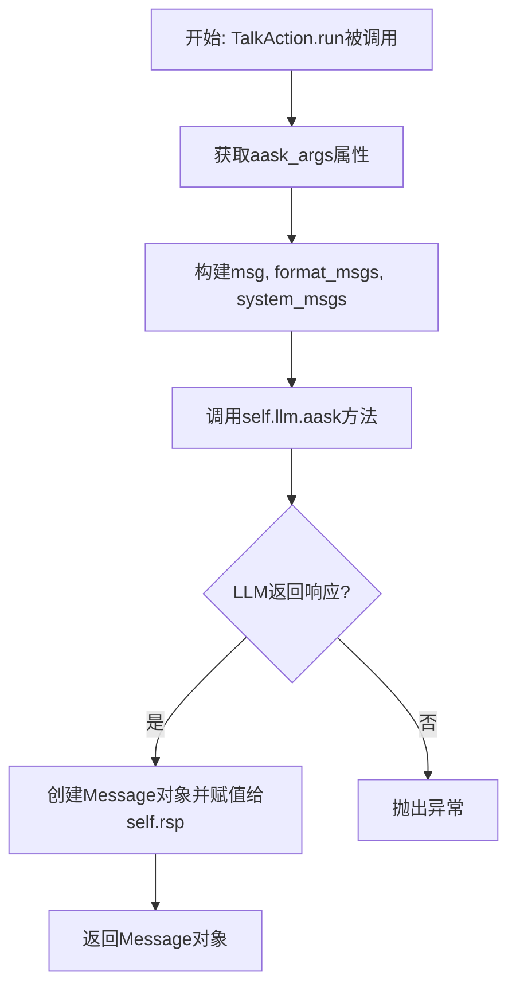
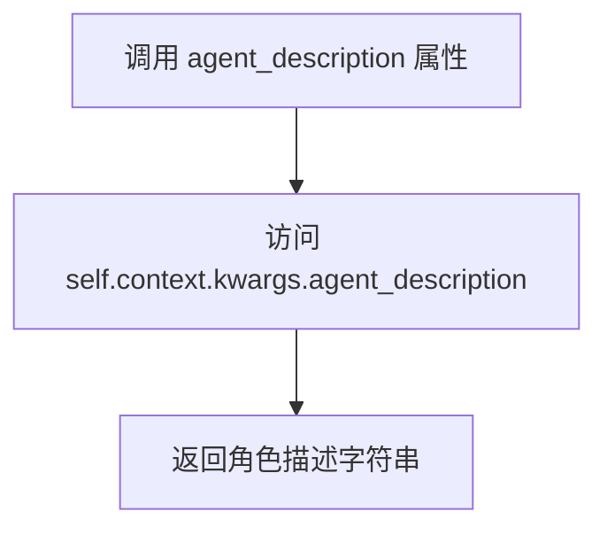
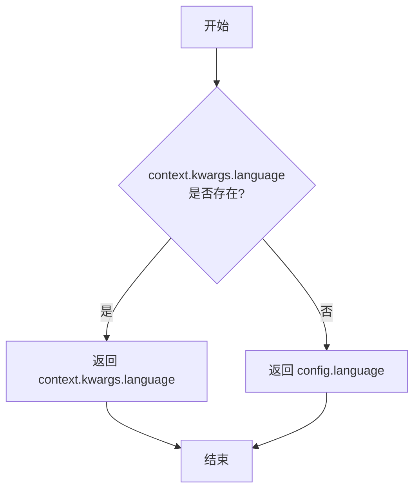
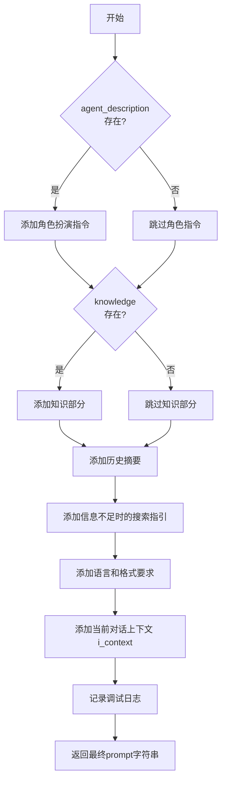
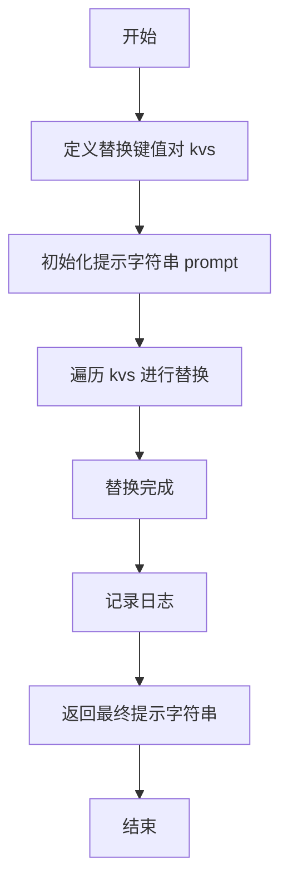
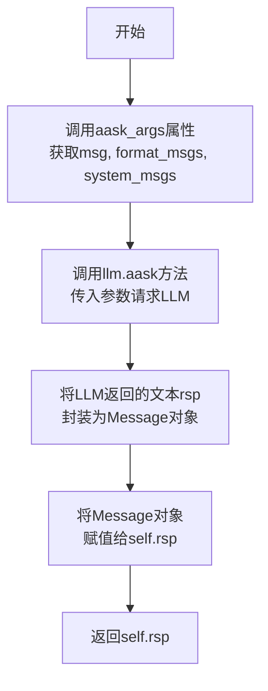

# `.\MetaGPT\metagpt\actions\talk_action.py` 详细设计文档

该代码定义了一个名为TalkAction的对话动作类，它继承自Action基类，用于根据给定的角色描述、历史摘要和知识库，构建特定的提示词（prompt），并通过大语言模型（LLM）生成符合角色设定的对话回复。它支持两种提示词格式（严格和宽松），并最终返回一个结构化的Message对象。

## 整体流程



## 类结构

```
Action (基类，来自metagpt.actions)
└── TalkAction
TalkActionPrompt (工具类，仅包含类属性)
```

## 全局变量及字段


### `FORMATION`
    
严格格式的对话提示词模板，定义了角色扮演的完整结构和约束条件。

类型：`str`
    


### `FORMATION_LOOSE`
    
宽松格式的对话提示词模板，相比FORMATION版本约束条件更少，用于生成更自然的对话。

类型：`str`
    


### `TalkAction.i_context`
    
当前对话的输入上下文或用户提问，是生成回复的核心依据。

类型：`str`
    


### `TalkAction.history_summary`
    
历史对话的摘要或关键信息，用于为当前对话提供上下文和连续性。

类型：`str`
    


### `TalkAction.knowledge`
    
与当前对话角色或话题相关的背景知识，用于增强回复的准确性和丰富性。

类型：`str`
    


### `TalkAction.rsp`
    
存储由大语言模型生成的回复消息对象，包含内容、角色和触发原因等信息。

类型：`Optional[Message]`
    
    

## 全局函数及方法

### `TalkAction.agent_description`

这是一个只读属性，用于获取当前代理（Agent）的角色描述信息。它从上下文（context）的关键字参数（kwargs）中提取`agent_description`字段的值，该字段定义了代理在对话中扮演的角色或身份。

参数：无

返回值：`str`，返回代理的角色描述字符串，如果未设置则可能返回空字符串或None。

#### 流程图



#### 带注释源码

```python
@property
def agent_description(self):
    # 这是一个属性（property）装饰器，将方法转换为只读属性。
    # 当访问 `self.agent_description` 时，会执行此方法。
    # 它从 `self.context` 对象的 `kwargs` 属性中获取 `agent_description` 的值。
    # `self.context` 通常是一个包含当前执行上下文信息的对象。
    # `kwargs` 是一个字典，存储了关键字参数。
    # 此属性用于定义或描述当前代理（AI角色）的身份或职责。
    return self.context.kwargs.agent_description
```

### `TalkAction.language`

该属性用于获取对话操作的语言设置。它首先尝试从上下文的关键字参数中获取语言设置，如果未设置，则回退到配置中的默认语言设置。

参数：

- 无显式参数（属性访问器）

返回值：`str`，返回用于对话的语言字符串

#### 流程图



#### 带注释源码

```python
@property
def language(self):
    # 尝试从上下文的关键字参数中获取语言设置
    # 如果未设置（None或空），则使用配置中的默认语言
    return self.context.kwargs.language or self.config.language
```


### `TalkAction.prompt`

`TalkAction.prompt` 是一个属性方法，用于构建与大型语言模型（LLM）交互的提示文本。它整合了角色描述、知识库、历史对话摘要、语言要求以及当前对话上下文，形成一个结构化的指令，引导AI以特定角色和风格进行回应。

参数：
-  `self`：`TalkAction` 类实例，用于访问实例属性如 `agent_description`、`knowledge`、`history_summary`、`language` 和 `i_context`。

返回值：`str`，返回一个格式化后的字符串，作为发送给LLM的完整提示。

#### 流程图



#### 带注释源码

```python
@property
def prompt(self):
    # 初始化提示字符串
    prompt = ""
    # 如果存在角色描述，则在提示开头添加角色扮演指令
    if self.agent_description:
        prompt = (
            f"You are {self.agent_description}. Your responses should align with the role-play agreement, "
            f"maintaining the character's persona and habits. When faced with unrelated questions, playfully "
            f"decline to answer without revealing your AI nature to preserve the character's image.\n\n"
        )
    # 如果存在知识库内容，则将其添加到提示中
    prompt += f"Knowledge:\n{self.knowledge}\n\n" if self.knowledge else ""
    # 添加历史对话摘要
    prompt += f"{self.history_summary}\n\n"
    # 添加指引：当信息不足时，可以从历史对话或知识库中搜索
    prompt += (
        "If the information is insufficient, you can search in the historical conversation or knowledge above.\n"
    )
    # 获取语言设置
    language = self.language
    # 添加语言和回答格式要求，并附上当前的对话上下文
    prompt += (
        f"Answer the following questions strictly in {language}, and the answers must follow the Markdown format.\n "
        f"{self.i_context}"
    )
    # 记录生成的完整提示到调试日志
    logger.debug(f"PROMPT: {prompt}")
    # 返回构建好的提示字符串
    return prompt
```


### `TalkAction.prompt_gpt4`

该方法用于生成一个结构化的提示字符串，用于与GPT-4模型进行对话。它通过替换预定义模板中的占位符来构建最终的提示，其中占位符的值来自类的属性。

参数：

- 无显式参数（该方法是一个属性，通过类属性获取数据）

返回值：`str`，返回一个格式化后的提示字符串，用于与GPT-4模型进行对话。

#### 流程图



#### 带注释源码

```python
@property
def prompt_gpt4(self):
    # 定义需要替换的键值对，键为模板中的占位符，值为对应的类属性值
    kvs = {
        "{role}": self.agent_description or "",  # 代理描述，如果不存在则用空字符串
        "{history}": self.history_summary or "",  # 历史摘要，如果不存在则用空字符串
        "{knowledge}": self.knowledge or "",  # 知识库内容，如果不存在则用空字符串
        "{language}": self.language,  # 语言设置
        "{ask}": self.i_context,  # 当前对话上下文
    }
    # 使用预定义的宽松格式模板
    prompt = TalkActionPrompt.FORMATION_LOOSE
    # 遍历键值对，将模板中的占位符替换为实际值
    for k, v in kvs.items():
        prompt = prompt.replace(k, v)
    # 记录生成的提示字符串到日志
    logger.info(f"PROMPT: {prompt}")
    # 返回最终的提示字符串
    return prompt
```

### `TalkAction.aask_args`

该方法用于构建与大型语言模型（LLM）进行对话所需的参数。它根据`TalkAction`类的内部状态（如角色描述、知识库、历史摘要和语言设置）生成一个结构化的三元组，包含用户消息、格式化的上下文消息（知识库和历史摘要）以及系统指令。这些参数可以直接传递给LLM的`aask`方法，以生成符合角色扮演设定的回答。

参数：

-  `self`：`TalkAction`，当前`TalkAction`类的实例。

返回值：`tuple`，一个包含三个元素的元组：
  1.  `msg`：`str`，用户输入的原始问题或上下文（`self.i_context`）。
  2.  `format_msgs`：`list`，一个字典列表，用于提供额外的上下文信息。每个字典包含`role`和`content`键，其中`role`固定为`"assistant"`，`content`为知识库或历史摘要的内容。
  3.  `system_msgs`：`list`，一个字符串列表，定义了LLM的系统级指令，包括角色描述、行为规范、信息检索策略和回答格式要求。

#### 流程图

```mermaid
flowchart TD
    A[开始] --> B[获取语言设置<br>language = self.language]
    B --> C[构建系统指令列表<br>system_msgs]
    C --> D[初始化格式消息列表<br>format_msgs = []]
    D --> E{知识库<br>self.knowledge 存在?}
    E -- 是 --> F[将知识库内容作为<br>assistant消息加入format_msgs]
    E -- 否 --> G{历史摘要<br>self.history_summary 存在?}
    F --> G
    G -- 是 --> H[将历史摘要内容作为<br>assistant消息加入format_msgs]
    G -- 否 --> I[返回三元组<br>self.i_context, format_msgs, system_msgs]
    H --> I
    I --> J[结束]
```

#### 带注释源码

```python
    @property
    def aask_args(self):
        # 获取当前配置的语言设置
        language = self.language
        # 构建系统指令列表，定义了LLM的角色和行为规范
        system_msgs = [
            f"You are {self.agent_description}.",  # 角色描述
            "Your responses should align with the role-play agreement, "
            "maintaining the character's persona and habits. When faced with unrelated questions, playfully "
            "decline to answer without revealing your AI nature to preserve the character's image.",  # 行为规范
            "If the information is insufficient, you can search in the context or knowledge.",  # 信息检索策略
            f"Answer the following questions strictly in {language}, and the answers must follow the Markdown format.",  # 回答格式要求
        ]
        # 初始化格式消息列表，用于提供额外的上下文
        format_msgs = []
        # 如果存在知识库内容，将其作为一条assistant角色的消息加入列表
        if self.knowledge:
            format_msgs.append({"role": "assistant", "content": self.knowledge})
        # 如果存在历史摘要内容，将其作为一条assistant角色的消息加入列表
        if self.history_summary:
            format_msgs.append({"role": "assistant", "content": self.history_summary})
        # 返回一个三元组：用户消息、格式消息列表、系统指令列表
        return self.i_context, format_msgs, system_msgs
```

### `TalkAction.run`

该方法执行对话动作，通过构建包含角色描述、历史摘要、知识库和当前问题的提示词，调用大语言模型生成符合角色设定的回答，并封装为消息对象返回。

参数：

- `with_message`：`Optional[Any]`，未在方法体中使用，可能为预留参数或用于未来扩展。
- `**kwargs`：`dict`，关键字参数，用于接收额外的配置或上下文信息。

返回值：`Message`，包含大语言模型生成的回答内容、角色信息（"assistant"）以及触发此动作的起因（`self`）。

#### 流程图



#### 带注释源码

```python
async def run(self, with_message=None, **kwargs) -> Message:
    # 1. 通过aask_args属性获取构建好的消息参数
    #    - msg: 当前要询问的问题 (self.i_context)
    #    - format_msgs: 格式化的历史消息和知识库消息列表
    #    - system_msgs: 系统提示词列表，定义角色行为规范
    msg, format_msgs, system_msgs = self.aask_args
    
    # 2. 异步调用大语言模型接口，传入构建好的参数，请求生成回答
    #    - stream=False 表示不使用流式输出
    rsp = await self.llm.aask(msg=msg, format_msgs=format_msgs, system_msgs=system_msgs, stream=False)
    
    # 3. 将大语言模型返回的文本内容(rsp)封装成一个Message对象
    #    - content: 回答内容
    #    - role: 角色设为“助手”
    #    - cause_by: 指明此消息是由当前TalkAction实例触发的
    self.rsp = Message(content=rsp, role="assistant", cause_by=self)
    
    # 4. 返回封装好的Message对象
    return self.rsp
```

## 关键组件


### TalkAction 类

TalkAction 类是 Action 的子类，负责根据给定的角色描述、历史对话摘要、知识库和当前问题，构建并执行与大语言模型（LLM）的对话，以生成符合角色设定的、格式化的回答。

### 提示词构建与模板

代码中包含了两种构建提示词（Prompt）的方式：一种是通过 `prompt` 属性动态拼接字符串，另一种是通过 `TalkActionPrompt` 类中预定义的模板（`FORMATION` 和 `FORMATION_LOOSE`）进行格式化替换。这提供了灵活性和可维护性，允许在严格和宽松的格式要求之间切换。

### 角色扮演与上下文管理

该组件通过 `agent_description`、`history_summary`、`knowledge` 和 `i_context` 等字段，管理对话的上下文。它强制 LLM 在回答时遵循特定的角色设定、语言风格（`language`）和格式要求（Markdown），并在信息不足时引导模型参考历史对话和知识库。

### 异步执行与消息封装

核心执行方法 `run` 是异步的，它调用底层的 `llm.aask` 方法与大语言模型交互。返回的结果被封装成 `Message` 对象，其中包含了回答内容、角色（`assistant`）以及触发此动作的原因（`cause_by`），这有助于在更复杂的对话流或代理系统中追踪消息的来源和上下文。


## 问题及建议


### 已知问题

-   **代码重复与不一致**：`TalkAction` 类中存在两个功能高度重叠的属性 `prompt` 和 `prompt_gpt4`，用于构建提示词。这导致了代码重复和维护负担。同时，`run` 方法使用的 `aask_args` 属性构建的参数与这两个属性构建的提示词逻辑不完全一致，存在潜在的逻辑分歧风险。
-   **未使用的遗留代码**：类中存在被注释掉的 `run_old` 方法，这属于无效代码，增加了代码库的复杂度和阅读负担。
-   **硬编码的提示词模板**：`TalkActionPrompt` 类中的 `FORMATION` 和 `FORMATION_LOOSE` 模板字符串直接硬编码在代码中。这使得模板的修改、国际化或根据不同场景动态切换模板变得困难。
-   **属性访问的潜在风险**：`agent_description` 和 `language` 属性通过 `self.context.kwargs` 访问，缺乏对 `context` 或 `kwargs` 可能为 `None` 的健壮性检查，可能导致运行时属性访问错误。
-   **职责不够单一**：`TalkAction` 类除了核心的 `run` 执行逻辑外，还承担了过多关于提示词构建和格式化的细节（通过多个属性和内部类），违反了单一职责原则，使得类变得臃肿且难以测试。

### 优化建议

-   **重构提示词构建逻辑**：建议将提示词构建逻辑统一。可以创建一个专门的 `PromptBuilder` 类或函数，接收 `agent_description`, `knowledge`, `history_summary`, `i_context`, `language` 等参数，并基于配置（如使用 `FORMATION` 或 `FORMATION_LOOSE` 模板）生成最终的提示词字符串或结构化消息列表。`TalkAction.run` 方法应调用这个统一的构建器。
-   **清理无效代码**：应立即删除被注释掉的 `run_old` 方法，以保持代码库的整洁。
-   **外部化配置提示词模板**：将 `TalkActionPrompt` 中的模板字符串移至配置文件（如 YAML、JSON）或数据库。这样可以在不修改代码的情况下调整提示词，并支持更灵活的多场景、多语言管理。
-   **增强属性访问的健壮性**：在 `agent_description` 和 `language` 属性的 getter 方法中，添加空值检查或提供默认值。例如，使用 `getattr(self.context, 'kwargs', None)` 和 `or` 操作符来安全地获取值。
-   **遵循单一职责原则进行重构**：考虑将 `TalkAction` 拆分为更细粒度的类。例如：
    -   `TalkAction`: 仅保留核心的 `run` 方法，负责调用 LLM 并返回结果。
    -   `TalkContext` 或 `TalkParameters`: 一个数据类，封装 `i_context`, `history_summary`, `knowledge`, `agent_description`, `language` 等输入参数。
    -   `TalkPromptStrategy`: 一个接口或基类，定义构建提示词的方法。可以有不同的实现，如 `FormationLoosePromptStrategy`, `FormationStrictPromptStrategy`，甚至是从配置文件加载的 `ConfigurablePromptStrategy`。`TalkAction` 依赖于此策略来获取提示词。
    这种重构将使各个类的职责更清晰，提高可测试性和可维护性。


## 其它


### 设计目标与约束

TalkAction 类的设计目标是提供一个可配置的、基于角色扮演的对话生成组件。它允许用户指定一个角色描述、历史对话摘要、相关知识库以及当前对话上下文，然后利用大语言模型（LLM）生成符合该角色设定和对话历史的自然语言回复。核心约束包括：1) 回复必须符合指定的角色人设和语言风格；2) 当遇到与角色无关的问题时，需要以符合角色设定的方式巧妙回避；3) 回复必须使用指定的语言并遵循 Markdown 格式；4) 回复中不能包含内部使用的标签（如 `[HISTORY_BEGIN]`）。

### 错误处理与异常设计

当前代码中显式的错误处理逻辑较少。主要依赖于 `metagpt` 框架底层的 `Action` 基类和 `llm.aask` 方法进行异常处理。潜在的错误点包括：1) `self.context.kwargs` 或 `self.config` 中可能缺少 `agent_description` 或 `language` 属性，导致属性访问异常；2) `self.llm.aask` 调用 LLM 服务时可能因网络、认证或模型问题而失败。目前这些异常会向上层调用者抛出，由调用方负责处理。建议在 `run` 方法中增加 `try-except` 块，捕获特定异常并记录日志，或返回一个包含错误信息的默认 `Message` 对象，以提高组件的健壮性。

### 数据流与状态机

数据流始于外部调用者通过构造函数或属性设置器为 `TalkAction` 实例提供输入数据（`i_context`, `history_summary`, `knowledge`）。当调用 `run` 方法时，内部逻辑通过 `aask_args` 属性方法将输入数据、系统提示词和格式化消息组装成 LLM 可接受的参数格式。然后，调用 `self.llm.aask` 方法将请求发送给 LLM 服务。LLM 返回的文本结果被封装成一个 `Message` 对象，存储在实例的 `rsp` 字段中，并作为 `run` 方法的返回值。整个过程是线性的，没有复杂的状态转换。`TalkAction` 实例本身主要作为数据容器和请求组装器，其状态（`rsp`）在每次 `run` 调用后被更新。

### 外部依赖与接口契约

1.  **父类依赖**：继承自 `metagpt.actions.Action`。依赖其提供的 `context`、`config`、`llm` 等属性以及可能的基类方法。这构成了与 `metagpt` 框架的核心契约。
2.  **LLM 服务依赖**：通过 `self.llm.aask` 方法调用大语言模型。依赖的接口契约是 `aask` 方法，它接受 `msg`、`format_msgs`、`system_msgs`、`stream` 等参数，并返回一个字符串格式的回复。具体的 LLM 提供商（如 OpenAI、Claude 等）由框架配置决定。
3.  **数据结构依赖**：使用了 `metagpt.schema.Message` 类作为输入/输出数据的载体。这要求调用者理解 `Message` 类的结构。
4.  **日志依赖**：使用 `metagpt.logs.logger` 进行日志记录，依赖于框架的日志配置。

### 配置管理与环境变量

`TalkAction` 的行为通过多个来源的配置共同决定：
1.  **实例字段**：`i_context`、`history_summary`、`knowledge` 是核心对话数据，由调用者在运行时提供。
2.  **上下文参数 (`context.kwargs`)**：用于获取 `agent_description` 和 `language`。这通常由创建 `TalkAction` 的上级组件（如某个 `Role`）传入，提供了运行时动态配置。
3.  **全局配置 (`self.config`)**：作为 `language` 属性的后备值。`self.config` 通常来自框架的全局配置文件或设置，提供了默认的静态配置。
这种分层配置机制（运行时参数 > 上下文参数 > 全局配置）提供了灵活性。但当前设计对 `context.kwargs` 的结构有隐含依赖，缺乏明确的配置项文档或验证。

### 安全与合规考虑

1.  **角色扮演与误导**：该组件设计用于生成符合特定虚构角色的回复。需要明确告知最终用户他们正在与一个扮演特定角色的 AI 交互，以防止对 AI 能力或身份的误解。
2.  **内容过滤**：代码本身未包含对 LLM 生成内容的安全过滤（如防止生成仇恨、暴力、色情或有害内容）。这部分责任依赖于底层 `llm.aask` 方法或其配置的 LLM 服务本身的安全策略。在敏感应用场景中，需要在 `run` 方法返回前或调用 `aask` 后增加额外的内容安全审查层。
3.  **数据隐私**：`history_summary` 和 `knowledge` 可能包含用户对话历史或自定义知识，在传输到外部 LLM 服务时需要确保符合相关的数据隐私法规（如 GDPR）。代码层面未体现加密或匿名化处理。
4.  **提示词注入**：`i_context`、`history_summary`、`knowledge` 等用户提供的内容被直接插入到提示词模板中。存在提示词注入的风险，即用户输入可能包含特殊指令，试图操纵 LLM 绕过角色设定或系统指令。虽然当前提示词结构有一定抵御能力，但对于高安全要求场景，需要对用户输入进行清洗或转义。

### 测试策略与用例

1.  **单元测试**：
    *   **属性测试**：测试 `agent_description`、`language`、`prompt`、`aask_args` 等属性在不同配置组合下的返回值是否正确。
    *   **`run` 方法测试**：使用 Mock 对象替换 `self.llm.aask`，验证其是否以正确的参数被调用，并正确返回封装好的 `Message` 对象。可以模拟 LLM 返回成功、返回空、抛出异常等场景。
2.  **集成测试**：
    *   将 `TalkAction` 与一个真实的或模拟的 `metagpt` 上下文及配置集成，测试完整的对话流程。
    *   测试不同 `language` 设置下，生成的提示词和预期的回复语言是否一致。
3.  **端到端测试**：
    *   在完整的角色扮演场景中，使用真实的 LLM 服务（或高级模拟），验证 `TalkAction` 生成的回复是否符合角色描述、历史、知识库的约束，格式是否正确。
4.  **负面测试**：
    *   测试当 `agent_description`、`language` 等关键配置缺失时，类的行为是否符合预期（如使用默认值或优雅失败）。
    *   测试输入包含潜在恶意或边界值（如超长字符串、特殊字符）时的处理。

### 部署与运维考量

1.  **资源依赖**：部署包含 `TalkAction` 的应用需要能够访问配置的 LLM 服务（如 OpenAI API），并确保网络连通性和 API 密钥的有效性。
2.  **性能监控**：需要监控 `llm.aask` 调用的延迟、成功率和令牌消耗，因为这是主要的性能瓶颈和成本中心。可以在 `run` 方法中增加计时和调用统计。
3.  **可观测性**：当前的 `logger.debug` 和 `logger.info` 记录了提示词，有助于调试。在生产环境中，可能需要调整日志级别，避免记录过长的提示词内容（可能包含用户隐私），同时确保关键错误和性能指标被记录。
4.  **扩展性**：`TalkAction` 本身是无状态的（除了临时的 `rsp`），可以轻松地进行水平扩展。主要扩展性限制来自 LLM 服务的并发限制和速率限制。
5.  **配置管理**：如何管理 `self.config` 中的默认语言等设置，以及如何将 `context.kwargs` 传递给 `TalkAction`，是上层应用架构需要解决的问题（如使用配置文件、环境变量或配置中心）。

    