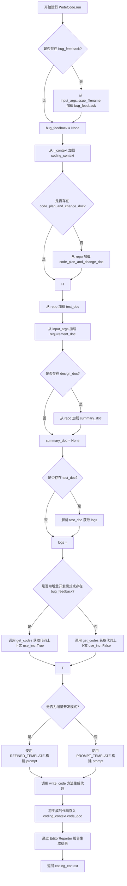
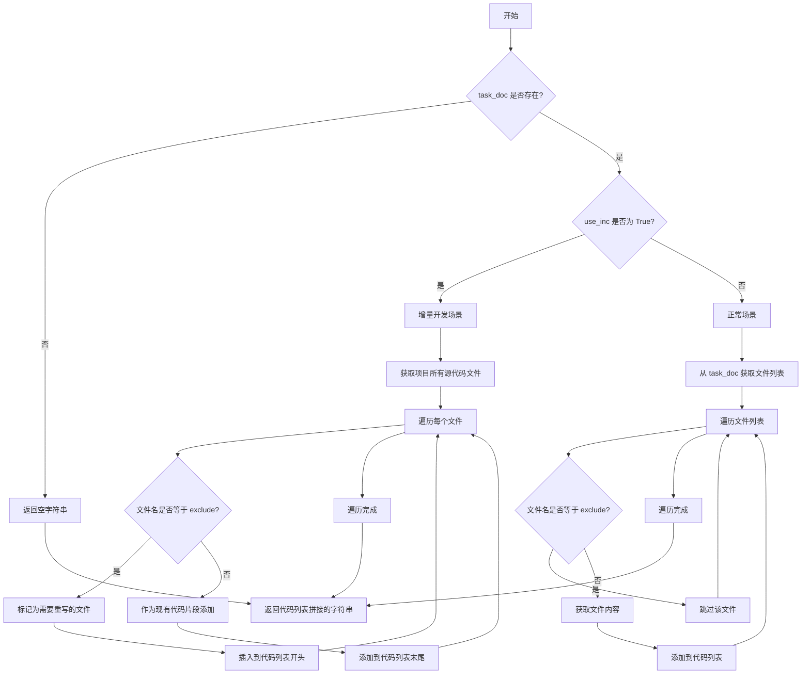

# `.\MetaGPT\metagpt\actions\write_code.py` 详细设计文档

该文件定义了一个名为 WriteCode 的 Action 类，其核心功能是基于给定的设计文档、任务描述、遗留代码、调试日志和错误反馈，使用大语言模型（LLM）生成或重写特定文件的代码。它支持增量开发和正常开发两种场景，能够根据上下文智能地获取相关代码片段作为提示词的一部分，并最终输出一个包含新生成代码的 CodingContext 对象。

## 整体流程

```mermaid
graph TD
    A[开始: WriteCode.run()] --> B{是否有输入参数?}
    B -- 是 --> C[加载错误反馈文档]
    B -- 否 --> D[加载 CodingContext]
    D --> E{是否存在代码计划变更文档?}
    E -- 否 --> F[从仓库获取代码计划变更文档]
    E -- 是 --> G[获取测试文档、需求文档、设计摘要文档]
    G --> H{是否为增量开发模式?}
    H -- 是 --> I[调用 get_codes(use_inc=True) 获取增量代码上下文]
    H -- 否 --> J[调用 get_codes(use_inc=False) 获取正常代码上下文]
    I --> K[使用 REFINED_TEMPLATE 构建提示词]
    J --> L[使用 PROMPT_TEMPLATE 构建提示词]
    K --> M[调用 write_code() 请求 LLM 生成代码]
    L --> M
    M --> N[使用 CodeParser 解析 LLM 返回的代码]
    N --> O[更新 CodingContext 中的代码文档]
    O --> P[通过 EditorReporter 报告生成结果]
    P --> Q[返回更新后的 CodingContext]
```

## 类结构

```
Action (元类)
└── WriteCode
    ├── 类字段: name, i_context, repo, input_args
    ├── 类方法: write_code, run, get_codes (静态方法)
```

## 全局变量及字段


### `PROMPT_TEMPLATE`
    
用于指导AI生成代码的多段式提示词模板，包含上下文、格式示例和具体指令。

类型：`str`
    


### `WriteCode.name`
    
动作的名称，固定为'WriteCode'，用于标识该动作。

类型：`str`
    


### `WriteCode.i_context`
    
输入上下文文档，包含生成代码所需的任务、设计等信息。

类型：`Document`
    


### `WriteCode.repo`
    
项目仓库对象，用于访问和管理项目中的源代码和文档。

类型：`Optional[ProjectRepo]`
    


### `WriteCode.input_args`
    
输入参数对象，包含运行任务所需的额外参数，如需求文件名。

类型：`Optional[BaseModel]`
    
    

## 全局函数及方法

### `WriteCode.write_code`

`WriteCode.write_code` 是一个异步方法，其核心功能是使用重试机制调用大语言模型（LLM）生成代码。它接收一个提示词（prompt）作为输入，通过 `_aask` 方法请求 LLM，然后使用 `CodeParser.parse_code` 从 LLM 的响应中提取并返回纯代码文本。该方法通过 `tenacity` 库实现了指数退避的重试逻辑，以增强在 LLM 服务不稳定时的鲁棒性。

参数：

- `prompt`：`str`，发送给大语言模型（LLM）的提示词文本，用于指导其生成代码。

返回值：`str`，从 LLM 响应中解析出的纯代码文本。

#### 流程图

```mermaid
graph TD
    A[开始: write_code(prompt)] --> B{调用 _aask(prompt) 请求 LLM};
    B --> C{请求成功?};
    C -- 是 --> D[获取 LLM 响应 code_rsp];
    C -- 否/异常 --> E[触发 tenacity 重试机制];
    E --> B;
    D --> F[使用 CodeParser.parse_code 解析响应];
    F --> G[返回解析后的纯代码 code];
    G --> H[结束];
```

#### 带注释源码

```python
    @retry(wait=wait_random_exponential(min=1, max=60), stop=stop_after_attempt(6)) # 装饰器：为该方法添加重试逻辑。等待时间在1到60秒之间随机且呈指数增长，最多重试6次后停止。
    async def write_code(self, prompt) -> str: # 异步方法定义，接收一个字符串参数prompt，返回字符串。
        code_rsp = await self._aask(prompt) # 调用父类Action的_aask方法，异步地向LLM发送提示词并获取响应文本。
        code = CodeParser.parse_code(text=code_rsp) # 使用CodeParser工具类解析LLM的响应，提取出其中的代码部分（例如，去除Markdown代码块标记等）。
        return code # 返回解析后的纯代码字符串。
```

### `WriteCode.run`

`WriteCode.run` 方法是 `WriteCode` 类的核心异步执行方法。它负责根据给定的上下文（如设计文档、任务描述、遗留代码、调试日志和错误反馈）生成或重写指定文件的代码。该方法首先收集并组织所有必要的输入信息，然后根据配置（是否为增量开发模式）选择合适的提示词模板，最后调用大语言模型生成代码，并将生成的代码封装到 `CodingContext` 对象中返回。

参数：

-  `*args`：`tuple`，可变位置参数，当前方法实现中未使用。
-  `**kwargs`：`dict`，可变关键字参数，当前方法实现中未使用。

返回值：`CodingContext`，一个包含生成的代码文档、设计文档、任务文档等完整编码上下文信息的对象。

#### 流程图



#### 带注释源码

```python
async def run(self, *args, **kwargs) -> CodingContext:
    # 1. 处理错误反馈：如果输入参数中包含问题文件名，则加载对应的错误反馈文档。
    bug_feedback = None
    if self.input_args and hasattr(self.input_args, "issue_filename"):
        bug_feedback = await Document.load(self.input_args.issue_filename)

    # 2. 加载并初始化编码上下文：从实例的 i_context 属性中加载 CodingContext 对象。
    coding_context = CodingContext.loads(self.i_context.content)
    # 如果上下文中没有代码计划和变更文档，则从项目仓库中加载。
    if not coding_context.code_plan_and_change_doc:
        coding_context.code_plan_and_change_doc = await self.repo.docs.code_plan_and_change.get(
            filename=coding_context.task_doc.filename
        )

    # 3. 收集其他必要文档：
    #    - 测试输出文档
    #    - 需求文档
    #    - 代码摘要文档（如果存在设计文档）
    test_doc = await self.repo.test_outputs.get(filename="test_" + coding_context.filename + ".json")
    requirement_doc = await Document.load(self.input_args.requirements_filename)
    summary_doc = None
    if coding_context.design_doc and coding_context.design_doc.filename:
        summary_doc = await self.repo.docs.code_summary.get(filename=coding_context.design_doc.filename)

    # 4. 提取调试日志：从测试结果中获取标准错误输出作为日志。
    logs = ""
    if test_doc:
        test_detail = RunCodeResult.loads(test_doc.content)
        logs = test_detail.stderr

    # 5. 获取相关代码片段：根据是否为增量开发模式或存在错误反馈，调用 get_codes 方法获取除目标文件外的其他代码。
    if self.config.inc or bug_feedback:
        code_context = await self.get_codes(
            coding_context.task_doc, exclude=self.i_context.filename, project_repo=self.repo, use_inc=True
        )
    else:
        code_context = await self.get_codes(
            coding_context.task_doc, exclude=self.i_context.filename, project_repo=self.repo
        )

    # 6. 构建提示词（Prompt）：根据配置选择使用增量开发模板或标准模板。
    if self.config.inc:
        prompt = REFINED_TEMPLATE.format(
            user_requirement=requirement_doc.content if requirement_doc else "",
            code_plan_and_change=coding_context.code_plan_and_change_doc.content
            if coding_context.code_plan_and_change_doc
            else "",
            design=coding_context.design_doc.content if coding_context.design_doc else "",
            task=coding_context.task_doc.content if coding_context.task_doc else "",
            code=code_context,
            logs=logs,
            feedback=bug_feedback.content if bug_feedback else "",
            filename=self.i_context.filename,
            demo_filename=Path(self.i_context.filename).stem,
            summary_log=summary_doc.content if summary_doc else "",
        )
    else:
        prompt = PROMPT_TEMPLATE.format(
            design=coding_context.design_doc.content if coding_context.design_doc else "",
            task=coding_context.task_doc.content if coding_context.task_doc else "",
            code=code_context,
            logs=logs,
            feedback=bug_feedback.content if bug_feedback else "",
            filename=self.i_context.filename,
            demo_filename=Path(self.i_context.filename).stem,
            summary_log=summary_doc.content if summary_doc else "",
        )

    # 7. 生成代码：记录日志，并通过 EditorReporter 报告开始生成代码。
    logger.info(f"Writing {coding_context.filename}..")
    async with EditorReporter(enable_llm_stream=True) as reporter:
        await reporter.async_report({"type": "code", "filename": coding_context.filename}, "meta")
        # 调用 write_code 方法（内部使用大语言模型）生成代码。
        code = await self.write_code(prompt)
        # 如果上下文中还没有代码文档对象，则创建一个新的。
        if not coding_context.code_doc:
            # avoid root_path pydantic ValidationError if use WriteCode alone
            coding_context.code_doc = Document(
                filename=coding_context.filename, root_path=str(self.repo.src_relative_path)
            )
        # 将生成的代码内容赋值给代码文档。
        coding_context.code_doc.content = code
        # 报告生成的代码文档。
        await reporter.async_report(coding_context.code_doc, "document")
    # 8. 返回包含新生成代码的完整编码上下文。
    return coding_context
```

### `WriteCode.get_codes`

`get_codes` 是一个静态方法，用于根据任务文档和项目仓库，获取生成指定文件所需的代码片段。它支持两种场景：正常场景和增量开发场景。在正常场景中，它从任务文档中指定的文件列表中获取代码，排除当前正在生成的文件；在增量开发场景中，它从项目源代码仓库中获取所有文件的代码，并对当前正在生成的文件进行特殊处理（标记为需要重写），其他文件则作为现有代码片段提供。

参数：

- `task_doc`：`Document`，任务文档对象，包含任务信息。
- `exclude`：`str`，要排除的文件名，即当前正在生成的文件。
- `project_repo`：`ProjectRepo`，项目仓库对象，用于访问源代码文件。
- `use_inc`：`bool`，指示是否为增量开发场景，默认为 `False`。

返回值：`str`，返回一个字符串，包含所有相关代码片段，格式化为 Markdown 代码块，每个代码块前有文件标题。

#### 流程图



#### 带注释源码

```python
@staticmethod
async def get_codes(task_doc: Document, exclude: str, project_repo: ProjectRepo, use_inc: bool = False) -> str:
    """
    Get codes for generating the exclude file in various scenarios.

    Attributes:
        task_doc (Document): Document object of the task file.
        exclude (str): The file to be generated. Specifies the filename to be excluded from the code snippets.
        project_repo (ProjectRepo): ProjectRepo object of the project.
        use_inc (bool): Indicates whether the scenario involves incremental development. Defaults to False.

    Returns:
        str: Codes for generating the exclude file.
    """
    # 如果任务文档不存在，返回空字符串
    if not task_doc:
        return ""
    # 如果任务文档内容为空，从项目仓库重新加载任务文档
    if not task_doc.content:
        task_doc = project_repo.docs.task.get(filename=task_doc.filename)
    # 解析任务文档内容为 JSON 对象
    m = json.loads(task_doc.content)
    # 根据 use_inc 选择任务列表键：正常场景使用 TASK_LIST.key，增量场景使用 REFINED_TASK_LIST.key
    code_filenames = m.get(TASK_LIST.key, []) if not use_inc else m.get(REFINED_TASK_LIST.key, [])
    codes = []  # 存储代码片段的列表
    src_file_repo = project_repo.srcs  # 源代码文件仓库

    # 增量开发场景
    if use_inc:
        # 遍历项目中的所有源代码文件
        for filename in src_file_repo.all_files:
            # 获取文件的 Markdown 代码块类型（如 python、javascript 等）
            code_block_type = get_markdown_code_block_type(filename)
            # 如果当前文件是正在生成的文件（exclude）
            if filename == exclude:
                # 如果文件不是 main.py，使用旧代码（标记为需要重写）
                if filename != "main.py":
                    doc = await src_file_repo.get(filename=filename)
                # 如果是 main.py，跳过（不包含在代码片段中）
                else:
                    continue
                # 将需要重写的文件代码插入到列表开头，并添加特殊标记
                codes.insert(
                    0, f"### The name of file to rewrite: `{filename}`\n```{code_block_type}\n{doc.content}```\n"
                )
                logger.info(f"Prepare to rewrite `{filename}`")
            # 其他文件作为现有代码片段添加
            else:
                doc = await src_file_repo.get(filename=filename)
                # 如果文件不存在，跳过
                if not doc:
                    continue
                # 将文件代码添加到列表末尾，格式化为 Markdown 代码块
                codes.append(f"### File Name: `{filename}`\n```{code_block_type}\n{doc.content}```\n\n")

    # 正常场景
    else:
        # 遍历任务文档中指定的文件列表
        for filename in code_filenames:
            # 跳过正在生成的文件（exclude）
            if filename == exclude:
                continue
            # 获取文件内容
            doc = await src_file_repo.get(filename=filename)
            # 如果文件不存在，跳过
            if not doc:
                continue
            # 获取文件的 Markdown 代码块类型
            code_block_type = get_markdown_code_block_type(filename)
            # 将文件代码添加到列表，格式化为 Markdown 代码块
            codes.append(f"### File Name: `{filename}`\n```{code_block_type}\n{doc.content}```\n\n")

    # 将代码列表拼接为一个字符串并返回
    return "\n".join(codes)
```

## 关键组件

### WriteCode 类

一个用于根据设计、任务、遗留代码和调试日志等上下文信息，生成或重写特定源代码文件的动作类。它封装了从项目仓库获取上下文、构建LLM提示词、调用LLM生成代码以及处理结果的核心逻辑。

### 代码上下文管理 (CodingContext)

用于封装和管理代码生成任务所需的所有上下文信息，包括设计文档、任务文档、代码计划变更文档、生成的代码文档以及相关的文件名。它作为`WriteCode.run`方法的输入和输出，统一了数据流。

### 项目仓库交互 (ProjectRepo)

作为项目文件系统的抽象层，提供了对源代码文件(`srcs`)、文档(`docs`)和测试输出(`test_outputs`)的统一访问接口。`WriteCode`类通过它与项目文件系统交互，读取现有代码和文档，并写入新生成的代码。

### 提示词模板 (PROMPT_TEMPLATE / REFINED_TEMPLATE)

定义了指导大型语言模型(LLM)生成代码的指令和上下文格式。`PROMPT_TEMPLATE`用于标准代码生成，`REFINED_TEMPLATE`用于增量开发场景。模板通过占位符动态注入设计、任务、遗留代码、调试日志和错误反馈等信息。

### 代码解析器 (CodeParser)

一个工具类，负责从LLM返回的文本响应中解析出结构化的代码块。`WriteCode.write_code`方法使用它来提取生成的纯代码，过滤掉模型可能返回的解释性文本。

### 任务列表管理 (TASK_LIST / REFINED_TASK_LIST)

定义了从任务文档(`task_doc`)中提取相关代码文件列表的键。`TASK_LIST.key`用于标准场景，`REFINED_TASK_LIST.key`用于增量开发场景。这决定了`get_codes`方法为构建上下文而收集哪些源文件。

### 增量开发支持 (use_inc 标志)

一个关键的业务逻辑开关，控制`WriteCode.get_codes`方法的行为。当启用时(`use_inc=True`)，它会收集项目`srcs`目录下的所有文件作为上下文，并特别标记出需要重写的文件(`exclude`)，用于在现有代码库基础上进行修改和优化。

### 编辑器报告器 (EditorReporter)

一个上下文管理器，用于在代码生成过程中报告进度和结果。它支持流式传输，可以将代码生成事件（如开始生成某个文件）和最终生成的代码文档(`Document`)报告给外部系统，便于监控和集成。

## 问题及建议


### 已知问题

-   **`WriteCode` 类职责过重**：`WriteCode` 类不仅负责生成代码，还承担了从项目仓库中加载多种文档（如设计、任务、测试结果、需求、代码总结等）、组装复杂提示词、处理增量开发逻辑以及报告生成等职责。这违反了单一职责原则，导致类变得臃肿，难以测试和维护。
-   **`run` 方法逻辑复杂且冗长**：`run` 方法包含了大量的条件判断、文档加载、字符串格式化以及上下文组装逻辑。这使得方法难以理解，且任何一处的修改都可能引发连锁错误。
-   **硬编码的提示词模板**：`PROMPT_TEMPLATE` 和 `REFINED_TEMPLATE` 作为字符串常量硬编码在类中。这使得模板的修改、版本管理、国际化或根据不同场景动态调整变得困难。
-   **潜在的循环导入风险**：提示词中的指令“AVOID circular import”表明系统意识到了循环导入问题，但当前代码结构（如`WriteCode`依赖多个外部模块和类）和静态的模板指令可能不足以完全规避此风险，尤其是在复杂的项目依赖中。
-   **错误处理不完善**：代码中多处使用了 `await self.repo.docs...get()` 和 `await Document.load()`，但未看到对这些操作可能失败的异常处理（如文件不存在、JSON解析错误）。这可能导致运行时错误未被捕获。
-   **`get_codes` 方法逻辑分支复杂**：该方法根据 `use_inc` 参数分为增量开发和普通开发两种场景，内部逻辑差异较大，且包含了对 `main.py` 的特殊处理。这种复杂性增加了理解和维护的难度。
-   **`i_context` 字段的默认值可能引发问题**：`i_context: Document = Field(default_factory=Document)` 使用了一个空的 `Document` 作为默认值。在 `run` 方法中，`coding_context = CodingContext.loads(self.i_context.content)` 可能会因为 `content` 为空而失败，或者加载出无效的上下文。
-   **`input_args` 字段的使用存在不确定性**：`input_args` 被定义为 `Optional[BaseModel]`，但在 `run` 方法中直接访问了其 `requirements_filename` 和 `issue_filename` 属性，没有进行空值或属性存在性检查，可能导致 `AttributeError`。

### 优化建议

-   **重构以遵循单一职责原则**：
    -   将文档加载逻辑（设计、任务、测试、需求、代码总结）提取到独立的服务类或函数中。
    -   将提示词模板的管理和组装逻辑提取到专门的 `PromptBuilder` 或 `ContextAssembler` 类中。
    -   将代码获取逻辑（`get_codes` 方法）提取到一个独立的 `CodeContextFetcher` 类中，并进一步拆分普通模式和增量模式的逻辑。
    -   让 `WriteCode` 类专注于协调这些服务并调用 LLM 生成代码。
-   **简化 `run` 方法**：通过上述职责拆分，`run` 方法应主要调用各个服务类来获取所需数据，组装执行上下文，然后调用 `write_code` 方法。其长度和复杂度应大幅降低。
-   **外部化提示词模板**：将 `PROMPT_TEMPLATE` 和 `REFINED_TEMPLATE` 移至配置文件（如 YAML、JSON）或数据库中。这样可以实现动态加载、环境特定配置和更便捷的版本控制。
-   **增强错误处理与健壮性**：
    -   在 `run` 方法中对所有文档加载操作（`await repo.get`, `await Document.load`）添加 `try-except` 块，记录错误并设置合理的默认值或抛出明确的业务异常。
    -   在使用 `input_args` 的属性前，检查其是否为 `None` 以及属性是否存在。
    -   验证 `CodingContext.loads(self.i_context.content)` 的结果是否有效。
-   **优化 `get_codes` 方法**：
    -   考虑将普通模式和增量模式拆分为两个独立的方法或类，以减少单个方法内的条件分支。
    -   将对 `main.py` 的特殊处理逻辑进行封装或添加清晰注释，说明其业务原因。
-   **改进字段初始化**：考虑移除 `i_context` 的默认值，或者提供一个更安全的初始化方式（例如，在 `__init__` 方法中确保其有效性），以避免在 `run` 方法开始时遇到无效状态。
-   **引入类型注解和验证**：虽然使用了 Pydantic，但可以进一步强化。例如，为 `run` 方法的参数和返回值添加更精确的类型提示。考虑使用 Pydantic 的 `validator` 来确保 `input_args` 在特定场景下必须包含某些属性。
-   **考虑性能优化**：`get_codes` 方法中可能会多次读取文件。如果项目很大，这可能成为性能瓶颈。可以考虑缓存机制或批量读取优化。同时，`write_code` 方法使用了重试机制，应确保其幂等性，避免因重试导致副作用（如重复报告）。
-   **提升可测试性**：通过上述重构，将外部依赖（如 `ProjectRepo`, `Document.load`）通过依赖注入的方式提供给 `WriteCode` 及其协作类，可以极大地提高单元测试的便利性，使用 Mock 对象来隔离测试。


## 其它


### 设计目标与约束

该代码模块的核心设计目标是实现一个基于LLM的代码生成动作（Action），能够根据给定的设计文档、任务描述、遗留代码、调试日志和错误反馈，生成符合Google风格、优雅、模块化、易于阅读和维护的代码。主要约束包括：
1.  **角色约束**：扮演专业工程师角色，输出代码需符合工程规范。
2.  **语言约束**：响应用户需求的语言，但代码和标题必须使用英文。
3.  **格式约束**：严格遵循`PROMPT_TEMPLATE`和`REFINED_TEMPLATE`定义的输出格式，使用`##`分割章节，并使用代码块包裹代码。
4.  **完整性约束**：生成的代码必须是完整、可靠、可重用的代码片段，作为整个项目的一部分。
5.  **设计遵循约束**：必须严格遵守上下文提供的“数据结构和接口”设计，不得更改任何设计或使用设计中不存在的公共成员函数。
6.  **单一文件约束**：每次调用`write_code`方法应专注于实现一个文件。
7.  **默认值与强类型**：设置默认值，使用强类型和显式变量，避免循环导入。
8.  **运行环境约束**：代码作为`metagpt`框架中`Action`子类运行，需遵循框架的异步执行、消息传递和文档管理机制。

### 错误处理与异常设计

1.  **重试机制**：`write_code`方法使用`tenacity`库装饰，在LLM调用失败时进行指数退避重试（最多6次），以提高在临时网络问题或API限制下的鲁棒性。
2.  **空值处理**：
    *   在`run`方法中，对`coding_context.design_doc`、`coding_context.task_doc`、`test_doc`、`summary_doc`、`bug_feedback`等可能为`None`的输入进行了条件判断，避免`AttributeError`。
    *   在`get_codes`静态方法中，对`task_doc`及其`content`进行空值检查，并尝试从`project_repo`重新加载。
    *   对从`src_file_repo.get`获取的文档进行空值检查，避免后续操作失败。
3.  **配置驱动**：通过`self.config.inc`标志区分“增量开发”和“正常”场景，使用不同的提示词模板（`REFINED_TEMPLATE`或`PROMPT_TEMPLATE`）和任务列表来源（`REFINED_TASK_LIST`或`TASK_LIST`），使行为可配置。
4.  **异常传播**：作为`Action.run`方法的实现，其抛出的异常（如重试耗尽后的异常、文档加载失败、JSON解析错误等）会向上层调用者（如`Role`）传播，由框架的统一错误处理机制处理。
5.  **输入验证**：依赖`pydantic`模型（`CodingContext`, `Document`, `RunCodeResult`）进行数据反序列化和验证，确保输入数据的结构正确性。

### 数据流与状态机

1.  **主要数据流**：
    *   **输入**：`CodingContext`对象（通过`self.i_context`传入），其中封装了任务、设计、代码计划等文档的引用。可选地，`self.input_args`可能包含错误反馈文件路径。
    *   **处理**：
        *   `run`方法从上下文中提取信息，并可能从项目仓库（`self.repo`）加载额外的文档（如测试结果、需求文档、代码总结）。
        *   根据配置（增量/正常）和场景，调用`get_codes`方法获取相关的遗留代码片段。
        *   组装完整的提示词（Prompt）并调用`write_code`方法请求LLM生成代码。
    *   **输出**：更新后的`CodingContext`对象，其`code_doc`属性被填充了新生成的代码内容。
2.  **状态变化**：
    *   `CodingContext`对象是核心状态载体。`run`方法执行后，其`code_doc`从可能为空变为包含新生成代码的`Document`对象。
    *   项目仓库（`ProjectRepo`）的状态在`WriteCode`动作中通常是只读的，`WriteCode`不直接修改仓库中的文件，而是将结果输出到`CodingContext`，由后续动作（如保存）负责持久化。
3.  **控制流**：
    *   动作的触发由框架调度，通常基于角色（Role）的规划。
    *   `run`方法是主要入口，其内部逻辑是顺序执行的，但包含条件分支（基于`config.inc`和`bug_feedback`）。
    *   `get_codes`方法根据`use_inc`参数和`exclude`文件名，决定收集哪些文件的代码以及如何格式化（如标记为“待重写”）。

### 外部依赖与接口契约

1.  **LLM服务**：通过继承的`_aask`方法（来自父类`Action`）与大型语言模型交互，这是生成代码的核心外部依赖。其接口契约是接收一个字符串提示词，返回一个字符串响应。
2.  **项目仓库（ProjectRepo）**：
    *   **依赖**：`self.repo`提供了访问项目源代码、文档、测试输出等资源的抽象。
    *   **契约**：`ProjectRepo`需提供`docs`、`srcs`、`test_outputs`等属性，以及`get`、`all_files`等方法，用于按文件名检索`Document`对象或文件列表。
3.  **文档系统（Document）**：
    *   **依赖**：`Document`类用于封装文件内容和元数据。
    *   **契约**：`Document`需有`filename`、`content`、`root_path`等字段，并支持`load`静态方法从文件加载。
4.  **配置系统**：
    *   **依赖**：`self.config`（来自父类`Action`）用于获取运行时配置（如`inc`标志）。
    *   **契约**：配置对象应提供相应属性的访问。
5.  **工具函数**：
    *   `CodeParser.parse_code`: 用于从LLM响应中解析出代码块。
    *   `get_markdown_code_block_type`: 根据文件名确定Markdown代码块的语言类型。
    *   `EditorReporter`: 用于在代码生成过程中报告进度和结果，可能涉及流式输出。
6.  **数据模型（Pydantic）**：
    *   `CodingContext`, `RunCodeResult`, `BaseModel`: 用于定义和验证结构化数据，确保组件间数据传递的一致性。
7.  **任务列表常量**：
    *   `TASK_LIST`, `REFINED_TASK_LIST`: 来自`project_management_an`模块，定义了JSON文档中用于标识任务列表的键名。
8.  **提示词模板**：
    *   `REFINED_TEMPLATE`: 来自`write_code_plan_and_change_an`模块，用于增量开发场景的专用提示词模板。

    