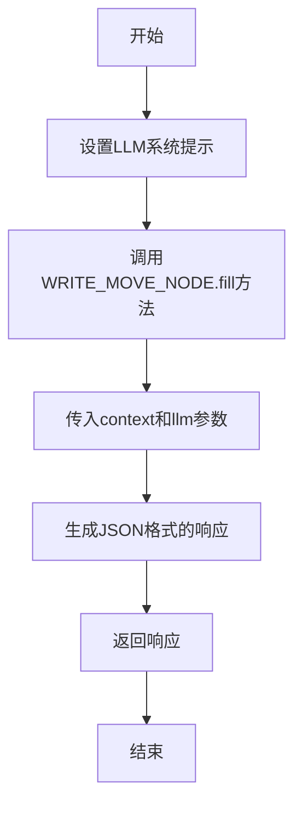
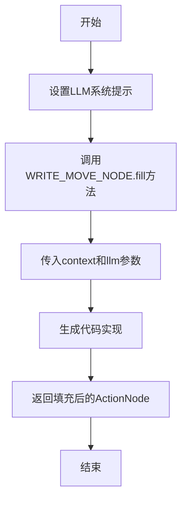

# `.\MetaGPT\metagpt\actions\write_code_an_draft.py` 详细设计文档

该代码是一个基于MetaGPT框架的代码审查与自动补全工具。它定义了多个ActionNode来结构化代码审查的流程（如Review、ReviewResult、NextSteps），并包含一个WriteCodeAN类，该类的run方法能根据给定的代码上下文（如一个未完全实现的游戏逻辑），调用LLM生成具体的代码实现（如补全move函数）。代码的核心功能是自动化地分析代码问题、提供审查意见，并生成或重写代码片段。

## 整体流程

```mermaid
graph TD
    A[开始: 调用WriteCodeAN.run] --> B[设置LLM系统提示]
    B --> C[调用WRITE_MOVE_NODE.fill]
    C --> D[LLM处理上下文]
    D --> E{生成结果?}
    E -- 是 --> F[返回结构化结果 (JSON)]
    E -- 否 --> G[返回错误或空结果]
    F --> H[结束]
    G --> H
```

## 类结构

```
Action (基类，来自metagpt.actions)
└── WriteCodeAN (代码审查与生成动作)
ActionNode (独立节点，定义审查步骤)
├── REVIEW
├── REVIEW_RESULT
├── NEXT_STEPS
├── WRITE_DRAFT
├── WRITE_FUNCTION
└── REWRITE_CODE
组合节点
├── WRITE_CODE_NODE (包含 REVIEW, REVIEW_RESULT, NEXT_STEPS)
└── WRITE_MOVE_NODE (包含 WRITE_DRAFT, WRITE_FUNCTION)
```

## 全局变量及字段


### `REVIEW`
    
用于生成代码评审意见的ActionNode，包含评审的具体指令和示例。

类型：`ActionNode`
    


### `REVIEW_RESULT`
    
用于生成代码评审结果的ActionNode，表示代码是否通过评审（LGTM/LBTM）。

类型：`ActionNode`
    


### `NEXT_STEPS`
    
用于生成基于评审结果的下一个步骤建议的ActionNode，包含具体的行动项。

类型：`ActionNode`
    


### `WRITE_DRAFT`
    
用于生成代码草稿的ActionNode，通常用于实现未完成的功能。

类型：`ActionNode`
    


### `WRITE_FUNCTION`
    
用于生成完整函数代码的ActionNode，用于实现缺失的函数。

类型：`ActionNode`
    


### `REWRITE_CODE`
    
用于基于评审意见和行动项重写代码的ActionNode。

类型：`ActionNode`
    


### `CODE_REVIEW_CONTEXT`
    
完整的代码评审上下文，包含系统设计、任务列表、代码文件等内容。

类型：`str`
    


### `CODE_REVIEW_SMALLEST_CONTEXT`
    
简化的代码评审上下文，仅包含待评审的代码片段。

类型：`str`
    


### `CODE_REVIEW_SAMPLE`
    
代码评审的示例输出，包含评审意见、行动项和评审结果。

类型：`str`
    


### `WRITE_CODE_NODE`
    
组合了REVIEW、REVIEW_RESULT和NEXT_STEPS的ActionNode，用于生成完整的代码评审。

类型：`ActionNode`
    


### `WRITE_MOVE_NODE`
    
组合了WRITE_DRAFT和WRITE_FUNCTION的ActionNode，用于生成move函数的实现代码。

类型：`ActionNode`
    


### `CR_FOR_MOVE_FUNCTION_BY_3`
    
针对move函数的代码评审意见，包含改进建议和潜在问题。

类型：`str`
    


### `WriteCodeAN.llm`
    
用于与语言模型交互的实例，负责生成代码评审或代码实现。

类型：`object`
    
    

## 全局函数及方法

### `WriteCodeAN.run`

该方法是一个异步方法，负责执行代码审查和代码生成任务。它首先设置语言模型的系统提示，然后使用预定义的 `WRITE_MOVE_NODE` ActionNode 来填充和生成代码审查结果或代码实现。该方法接收一个上下文参数，该参数包含了需要审查或实现的代码信息，并返回一个 JSON 格式的响应。

参数：

- `context`：`str`，包含需要审查或实现的代码的上下文信息。

返回值：`str`，返回一个 JSON 格式的字符串，包含了代码审查的结果或生成的代码实现。

#### 流程图



#### 带注释源码

```python
async def run(self, context):
    # 设置语言模型的系统提示，指定其为优秀的工程师，能够实现任何代码
    self.llm.system_prompt = "You are an outstanding engineer and can implement any code"
    
    # 调用WRITE_MOVE_NODE的fill方法，传入上下文、语言模型和期望的响应格式（JSON）
    # 该方法将根据上下文生成代码审查结果或代码实现
    return await WRITE_MOVE_NODE.fill(req=context, llm=self.llm, schema="json")
```

### `WriteCodeAN.run`

该方法是一个异步方法，属于`WriteCodeAN`类，用于执行代码审查和生成代码实现。它接收一个上下文参数，调用`WRITE_MOVE_NODE`的`fill`方法，基于给定的上下文生成代码实现，并返回结果。

参数：

- `context`：`str`，包含需要审查和实现的代码上下文信息。

返回值：`ActionNode`，返回填充后的`WRITE_MOVE_NODE`对象，其中包含生成的代码实现。

#### 流程图



#### 带注释源码

```python
async def run(self, context):
    # 设置语言模型（LLM）的系统提示，指定其为优秀的工程师，能够实现任何代码
    self.llm.system_prompt = "You are an outstanding engineer and can implement any code"
    
    # 调用WRITE_MOVE_NODE的fill方法，传入上下文、语言模型和schema参数
    # 该方法基于给定的上下文生成代码实现，并返回填充后的ActionNode对象
    return await WRITE_MOVE_NODE.fill(req=context, llm=self.llm, schema="json")
```

## 关键组件

### ActionNode 组件

用于定义和构建代码审查与代码生成流程中的结构化节点。每个节点代表一个特定的任务或输出，如生成审查意见、给出审查结果、建议后续步骤或编写代码草稿。

### 代码审查流程组件

定义了从代码审查到代码重写的完整工作流。该组件通过组合多个 `ActionNode` 来构建一个有序的决策和执行链，用于自动化处理代码质量评估和改进任务。

### 代码生成与重写组件

负责根据审查反馈生成新的代码草稿、实现未完成的函数或重写现有代码。该组件将自然语言指令和审查结果转化为具体的、可执行的代码变更。

## 问题及建议

### 已知问题

-   **`move` 方法未完全实现**：`Game` 类中的 `move` 方法仅调用了 `addRandomTile` 来模拟移动，并未实现实际的方块移动、合并逻辑以及分数更新。这使得游戏的核心功能缺失。
-   **`Storage` 类未集成**：`Game` 类虽然定义了 `bestScore` 字段和 `setBestScore` 方法，但在 `startGame` 和 `setBestScore` 方法中并未实际调用 `Storage` 类的方法来持久化最高分，导致最高分功能不完整。
-   **代码中存在硬编码**：多处使用了硬编码的数字（如 `4` 表示棋盘大小），降低了代码的可维护性和可读性。
-   **缺乏错误处理**：代码中没有对潜在的错误情况进行处理，例如 `move` 方法接收无效方向参数时，或者 `localStorage` 操作失败时。
-   **`CODE_REVIEW_SAMPLE` 中的示例代码不完整**：提供的 `move` 方法示例仅实现了 `'up'` 方向的逻辑，缺少 `'down'`, `'left'`, `'right'` 方向的实现，且示例中的合并逻辑可能存在索引越界风险（`tiles[i + 1]`）。

### 优化建议

-   **实现完整的 `move` 方法**：应按照 2048 游戏规则，完整实现四个方向（上、下、左、右）的方块移动与合并逻辑，并正确更新 `score`。
-   **集成 `Storage` 类**：在 `Game` 类的 `startGame` 方法中，应通过 `Storage` 实例读取最高分；在 `setBestScore` 方法中，应在更新内存值后调用 `Storage` 实例保存到 `localStorage`。
-   **使用常量定义魔法数字**：将棋盘大小（4）、初始数字（2, 4）及其出现概率（0.9）等定义为类常量或模块级常量，提高代码可读性和可维护性。
-   **增加输入验证和错误处理**：在 `move` 方法中验证 `direction` 参数的有效性；考虑 `localStorage` 可能被禁用或操作失败的情况，并添加适当的回退或错误提示。
-   **重构 `move` 方法逻辑**：将移动、合并等子逻辑抽取为独立的私有方法（如 `_moveUp`, `_mergeRow`），以减少 `move` 方法的复杂度，提高代码可测试性和可读性。
-   **完善代码审查示例**：确保提供的示例代码（如 `CODE_REVIEW_SAMPLE` 中的 `move` 方法片段）是完整、正确且安全的，避免误导开发者。
-   **考虑添加游戏状态检查**：实现方法检查游戏是否结束（无空位且无法合并），并在 `move` 方法后或UI层进行相应处理。

## 其它

### 设计目标与约束

该代码是一个基于MetaGPT框架的代码审查与自动补全工具。其核心设计目标是自动化代码审查流程，通过预定义的审查节点（ActionNode）引导大语言模型（LLM）对目标代码进行结构化分析、评估和生成改进建议或补全代码。主要约束包括：依赖外部LLM服务进行内容生成；审查逻辑和输出格式由预定义的ActionNode结构严格限定；代码补全功能主要针对特定上下文（如`game.js`中的`move`方法）进行，不具备通用性。

### 错误处理与异常设计

当前代码中显式的错误处理机制较为有限。主要依赖于Python的默认异常处理以及`asyncio`运行时可能抛出的异常。`WriteCodeAN`类的`run`方法在执行`ActionNode.fill`时，其内部可能因LLM调用失败、网络问题或上下文解析错误而抛出异常，这些异常会直接向上传播给调用者（如`main`函数）。代码未包含针对特定错误场景（如LLM返回格式错误、上下文不完整）的重试或降级逻辑。全局的`asyncio.run(main())`调用是标准的异步入口点，其异常将被捕获并导致程序非正常退出。

### 数据流与状态机

1.  **数据流**：
    *   **输入**：核心输入是`CODE_REVIEW_SMALLEST_CONTEXT`或`CODE_REVIEW_CONTEXT`字符串，其中包含了待审查的代码（`game.js`）及其相关上下文（系统设计、任务列表等）。
    *   **处理**：输入数据被传递给`WriteCodeAN`动作的`run`方法。该方法设置LLM系统提示，并调用`WRITE_MOVE_NODE`（一个由`WRITE_DRAFT`和`WRITE_FUNCTION`子节点组成的`ActionNode`）的`fill`方法。`fill`方法将输入上下文与节点定义的指令、示例等模板结合，构造出给LLM的提示词（Prompt），发起请求并获取响应。
    *   **输出**：`fill`方法的返回值（即LLM的响应）被解析并结构化，最终作为`run`方法的返回值。对于`WRITE_MOVE_NODE`，预期输出是一个包含`WriteDraft`和`WriteFunction`键的JSON对象，分别对应草稿代码和具体函数实现。
2.  **状态机**：代码本身不包含复杂的状态机。其执行流程是线性的：初始化动作 -> 设置LLM -> 填充审查节点 -> 返回结果。`ActionNode`体系结构隐含了一种状态流转，即从“待填充”到“已填充并包含结果”，但此状态由节点对象内部管理，对外不可见。

### 外部依赖与接口契约

1.  **外部依赖**：
    *   **MetaGPT框架**：核心依赖，特别是`metagpt.actions.Action`基类和`metagpt.actions.action_node.ActionNode`类。它们提供了动作执行和结构化提示词构建的基础设施。
    *   **大语言模型（LLM）服务**：通过`self.llm`属性（在`Action`基类中定义）进行交互，是生成所有审查意见和代码内容的核心依赖。具体的LLM提供商（如OpenAI、Azure OpenAI等）由运行环境配置决定。
    *   **Python标准库**：`asyncio`用于异步执行，`typing`用于类型注解。
2.  **接口契约**：
    *   `Action.run(self, context)`：必须实现的异步方法。接受一个`context`（字符串）作为输入，返回处理结果（字符串或字典）。在本实现中，它返回`WRITE_MOVE_NODE.fill`的结果。
    *   `ActionNode.fill(req, llm, schema)`：静态或类方法。契约要求传入请求上下文`req`、LLM实例`llm`和可选的输出模式`schema`。它负责与LLM通信，并返回根据`schema`（默认为`"json"`）解析后的结构化数据。
    *   `llm` 对象：需要实现与`ActionNode.fill`兼容的异步调用接口，以完成实际的LLM请求。
    