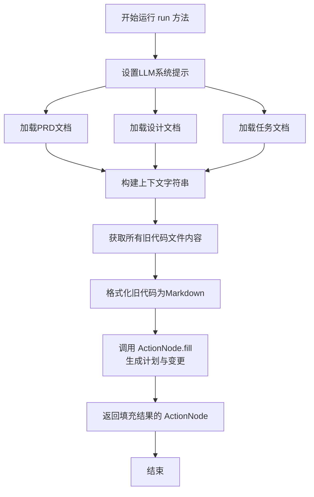
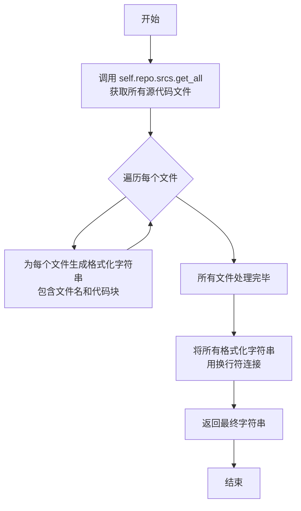

# `.\MetaGPT\metagpt\actions\write_code_plan_and_change_an.py` 详细设计文档

该代码定义了一个名为 `WriteCodePlanAndChange` 的 Action 类，其核心功能是接收用户需求、PRD、设计、任务列表和现有代码库作为输入，通过 LLM 生成一个详细的、分步的增量开发计划（Development Plan）以及具体的代码变更草案（Incremental Change），以指导后续的代码实现或重构。

## 整体流程

```mermaid
graph TD
    A[开始: WriteCodePlanAndChange.run()] --> B[加载PRD、设计、任务文档]
    B --> C[获取现有代码库内容]
    C --> D[格式化上下文信息]
    D --> E[调用ActionNode: WRITE_CODE_PLAN_AND_CHANGE_NODE]
    E --> F{LLM处理}
    F --> G[生成JSON格式的增量计划和变更]
    G --> H[返回结果]
```

## 类结构

```
Action (基类)
└── WriteCodePlanAndChange (具体Action类)
```

## 全局变量及字段


### `DEVELOPMENT_PLAN`
    
定义开发计划节点的ActionNode实例，用于生成详细的增量开发计划步骤。

类型：`ActionNode`
    


### `INCREMENTAL_CHANGE`
    
定义增量变更节点的ActionNode实例，用于生成符合git diff格式的代码变更草案。

类型：`ActionNode`
    


### `CODE_PLAN_AND_CHANGE_CONTEXT`
    
代码计划和变更上下文的模板字符串，用于整合用户需求、问题、PRD、设计、任务和遗留代码等信息。

类型：`str`
    


### `REFINED_TEMPLATE`
    
代码生成或重写的精炼模板，包含详细的指令和格式示例，用于指导LLM生成最终代码。

类型：`str`
    


### `CODE_PLAN_AND_CHANGE`
    
包含DEVELOPMENT_PLAN和INCREMENTAL_CHANGE的列表，用于构建完整的代码计划和变更节点。

类型：`List[ActionNode]`
    


### `WRITE_CODE_PLAN_AND_CHANGE_NODE`
    
从CODE_PLAN_AND_CHANGE列表创建的父ActionNode，用于统一执行代码计划和变更的生成流程。

类型：`ActionNode`
    


### `WriteCodePlanAndChange.name`
    
动作的名称，固定为'WriteCodePlanAndChange'，用于标识该动作的用途。

类型：`str`
    


### `WriteCodePlanAndChange.i_context`
    
代码计划和变更的上下文信息，包含PRD、设计、任务等文档的文件名和用户需求。

类型：`CodePlanAndChangeContext`
    


### `WriteCodePlanAndChange.repo`
    
项目仓库的引用，用于获取遗留代码文件，默认值为None且被排除在序列化之外。

类型：`Optional[ProjectRepo]`
    


### `WriteCodePlanAndChange.input_args`
    
可选的输入参数，用于传递额外的运行参数，默认值为None且被排除在序列化之外。

类型：`Optional[BaseModel]`
    
    

## 全局函数及方法

### `WriteCodePlanAndChange.run`

该方法作为`WriteCodePlanAndChange`动作的核心执行方法，负责整合项目上下文信息（如需求、设计、任务和现有代码），并调用AI模型生成一个详细的增量开发计划（Development Plan）和对应的代码变更草案（Incremental Change）。它通过构建一个结构化的提示词上下文，引导模型基于旧代码和新的开发任务，输出分步实施计划和符合`git diff`格式的代码变更。

参数：

-  `*args`：`tuple`，可变位置参数，在此方法中未使用。
-  `**kwargs`：`dict`，可变关键字参数，在此方法中未使用。

返回值：`ActionNode`，返回一个填充了AI模型响应的`ActionNode`对象，该节点包含了生成的“Development Plan”和“Incremental Change”内容。

#### 流程图



#### 带注释源码

```python
async def run(self, *args, **kwargs):
    # 1. 设置语言模型（LLM）的系统提示，定义其角色为专业的软件工程师，专注于制定增量开发计划。
    self.llm.system_prompt = "You are a professional software engineer, your primary responsibility is to " \
                             "meticulously craft comprehensive incremental development plan and deliver detailed incremental change"

    # 2. 异步加载项目相关的三个核心文档：产品需求文档（PRD）、设计文档和任务列表文档。
    prd_doc = await Document.load(filename=self.i_context.prd_filename)
    design_doc = await Document.load(filename=self.i_context.design_filename)
    task_doc = await Document.load(filename=self.i_context.task_filename)

    # 3. 构建一个结构化的上下文字符串，用于后续提示AI模型。
    #    该上下文整合了用户新需求、问题描述、以及加载的PRD、设计、任务文档内容。
    #    同时，通过调用 `get_old_codes` 方法获取并格式化所有现有的源代码。
    context = CODE_PLAN_AND_CHANGE_CONTEXT.format(
        requirement=f"```text\n{self.i_context.requirement}\n```",
        issue=f"```text\n{self.i_context.issue}\n```",
        prd=prd_doc.content,
        design=design_doc.content,
        task=task_doc.content,
        code=await self.get_old_codes(),  # 获取并嵌入旧代码
    )

    # 4. 记录日志，表示开始生成代码计划和变更。
    logger.info("Writing code plan and change..")

    # 5. 调用预定义的 ActionNode `WRITE_CODE_PLAN_AND_CHANGE_NODE` 的 `fill` 方法。
    #    该方法将构建好的上下文（`context`）和当前动作的LLM实例（`self.llm`）传递给AI模型，
    #    请求其生成“Development Plan”和“Incremental Change”，并以JSON格式返回结果。
    #    最终返回填充了模型响应的 ActionNode 对象。
    return await WRITE_CODE_PLAN_AND_CHANGE_NODE.fill(req=context, llm=self.llm, schema="json")
```

### `WriteCodePlanAndChange.get_old_codes`

该方法用于从项目仓库中获取所有源代码文件的内容，并将其格式化为一个包含文件名和代码块的字符串，以便在生成代码计划和变更时作为“旧代码”上下文使用。

参数：

-  `self`：`WriteCodePlanAndChange`，当前`WriteCodePlanAndChange`类的实例。

返回值：`str`，一个格式化的字符串，其中包含项目中所有源代码文件的文件名和内容。每个文件都以Markdown代码块的形式呈现，并带有相应的语言标识。

#### 流程图



#### 带注释源码

```python
async def get_old_codes(self) -> str:
    # 从项目仓库中获取所有源代码文件对象列表
    old_codes = await self.repo.srcs.get_all()
    # 遍历每个文件对象，生成格式化的字符串
    # 格式为：### File Name: `{filename}`\n```{language}\n{content}```\n
    codes = [
        f"### File Name: `{code.filename}`\n```{get_markdown_code_block_type(code.filename)}\n{code.content}```\n"
        for code in old_codes
    ]
    # 将所有文件的格式化字符串用换行符连接成一个完整的字符串并返回
    return "\n".join(codes)
```

## 关键组件

### ActionNode 组件

用于定义和填充结构化的动作节点，这些节点封装了特定的任务（如制定开发计划、生成增量变更），并通过大语言模型（LLM）来生成符合预期格式和内容要求的输出。

### 代码计划与变更上下文模板

一个预定义的字符串模板，用于整合用户需求、问题、PRD、设计、任务列表和遗留代码，为生成开发计划和增量变更提供完整的上下文信息。

### WriteCodePlanAndChange 动作类

一个具体的动作执行类，负责协调资源（如加载相关文档、获取遗留代码），并利用 ActionNode 组件和上下文模板，通过 LLM 生成结构化的增量开发计划和代码变更草案。

## 问题及建议

### 已知问题

-   **硬编码的上下文模板**：`CODE_PLAN_AND_CHANGE_CONTEXT` 模板字符串被硬编码在类定义中，这使得模板难以根据不同的项目需求或格式进行调整和维护。
-   **缺乏输入验证**：`run` 方法在加载文档（如 `prd_doc`, `design_doc`, `task_doc`）时，没有验证这些文档是否存在或其内容是否有效，可能导致运行时错误。
-   **潜在的循环导入风险**：`get_old_codes` 方法中使用了 `get_markdown_code_block_type` 函数来推断代码块的语言类型，但该函数可能无法覆盖所有文件类型，导致生成的 Markdown 格式不正确。
-   **`ActionNode` 示例代码过长**：`INCREMENTAL_CHANGE` 节点的 `example` 字段包含了非常长的示例代码字符串，这降低了代码的可读性，且难以维护和更新。
-   **`i_context` 字段的默认值**：`i_context` 字段使用 `default_factory=CodePlanAndChangeContext`，但如果 `CodePlanAndChangeContext` 的初始化需要参数，此处可能引发错误，且缺乏清晰的文档说明。
-   **`repo` 和 `input_args` 字段的初始化**：`repo` 和 `input_args` 字段被标记为 `exclude=True`，但它们的默认值设置为 `None`，这可能导致在后续使用中需要额外的空值检查，增加了代码的复杂性。

### 优化建议

-   **将模板配置化**：考虑将 `CODE_PLAN_AND_CHANGE_CONTEXT` 和 `REFINED_TEMPLATE` 模板字符串移至配置文件或从外部资源加载，以提高灵活性和可维护性。
-   **增强输入验证**：在 `run` 方法中，添加对加载文档的验证逻辑，例如检查文件是否存在、内容是否为空或格式是否符合预期，并提供清晰的错误信息。
-   **优化示例代码管理**：将 `INCREMENTAL_CHANGE` 节点中的长示例代码提取到外部文件（如 `.txt` 或 `.md` 文件）中，并在运行时加载，以提高代码的可读性和可维护性。
-   **明确上下文初始化要求**：为 `i_context` 字段提供更详细的文档，说明 `CodePlanAndChangeContext` 的初始化要求，或考虑在 `__init__` 方法中添加验证逻辑。
-   **简化字段设计**：重新评估 `repo` 和 `input_args` 字段的设计，考虑是否可以通过依赖注入或在方法参数中传递，以避免使用 `Optional` 类型和空值检查。
-   **改进错误处理与日志**：在 `run` 和 `get_old_codes` 方法中添加更详细的异常捕获和日志记录，特别是在文件加载和模板格式化过程中，以便于调试和问题追踪。
-   **考虑性能优化**：`get_old_codes` 方法会加载所有源代码文件，对于大型项目可能影响性能。可以考虑按需加载或缓存机制来优化。

## 其它

### 设计目标与约束

该代码模块的核心设计目标是实现一个能够根据用户新需求、现有代码库（Legacy Code）以及项目文档（PRD、设计、任务列表），自动生成详细的、分步的增量开发计划（Development Plan）和具体的代码变更草案（Incremental Change）的智能体（Action）。其核心约束包括：1）必须严格遵循给定的上下文信息（如PRD、设计）来制定计划，不能随意更改设计。2）生成的代码变更必须符合`git diff`的格式规范，使用`+`和`-`符号清晰地标识增删。3）在最终生成代码的指令中，强调必须合并“增量变更”到目标文件中，并确保代码的完整性、强类型和默认值设置，避免循环导入。

### 错误处理与异常设计

当前代码中的错误处理主要依赖于外部的`ActionNode.fill`方法和`Document.load`方法的异常传播。`run`方法内部没有显式的`try-catch`块，这意味着任何在加载文档、格式化上下文或调用LLM过程中发生的异常（如文件未找到、网络错误、LLM API错误）都将直接向上层调用者抛出。这是一种“快速失败”的策略，依赖于外部的监控和重试机制。在`get_old_codes`方法中，如果`self.repo.srcs.get_all()`调用失败，异常也会直接抛出。缺乏对特定错误（如上下文格式错误、LLM返回结果解析失败）的细粒度捕获和处理，是潜在的风险点。

### 数据流与状态机

1.  **输入数据流**：流程始于`run`方法被调用。输入数据来源于`self.i_context`（`CodePlanAndChangeContext`对象），其中包含了需求、问题、各文档文件名等。通过异步加载`prd_filename`、`design_filename`、`task_filename`对应的`Document`对象，并结合`get_old_codes`获取的旧代码字符串，共同组装成完整的`context`字符串。
2.  **处理与状态转换**：`context`作为请求（`req`）传递给`WRITE_CODE_PLAN_AND_CHANGE_NODE.fill`方法。此节点内部包含`DEVELOPMENT_PLAN`和`INCREMENTAL_CHANGE`两个子节点，它们将`context`作为提示词的一部分发送给大语言模型（LLM）。LLM的处理是一个黑盒状态，其输出决定了节点的填充结果。
3.  **输出数据流**：`fill`方法返回一个结构化的结果（格式为`json`），该结果包含了`Development Plan`（字符串列表）和`Incremental Change`（字符串列表）。这个结果作为`run`方法的返回值，传递给该Action的调用者，从而完成从原始需求到具体开发计划和代码变更草案的数据流转。整个流程是无状态的，每次运行都是独立的。

### 外部依赖与接口契约

1.  **LLM服务**：核心依赖是大语言模型服务，通过`self.llm`属性（继承自父类`Action`）进行交互。契约是`llm`对象必须提供响应提示词并返回文本或结构化数据的能力。`ActionNode.fill`方法内部调用了`llm.aask`或类似方法。
2.  **项目仓库（ProjectRepo）**：通过`self.repo`依赖`ProjectRepo`类来获取旧代码。契约是`repo.srcs.get_all()`方法应返回一个包含`CodeBlock`（或类似结构，具有`filename`和`content`属性）的列表。
3.  **文档系统**：依赖`Document.load`静态方法来异步加载指定文件名的文档内容。契约是该方法需要正确的文件路径和访问权限。
4.  **Pydantic**：用于数据验证和序列化，`CodePlanAndChangeContext`、`WriteCodePlanAndChange`类的字段定义都依赖于`BaseModel`和`Field`。
5.  **父类Action**：`WriteCodePlanAndChange`继承自`Action`，必须满足其接口契约，特别是实现异步的`run`方法作为主要执行入口。
6.  **ActionNode**：定义了结构化提示和解析LLM响应的模板。`WRITE_CODE_PLAN_AND_CHANGE_NODE`是预定义的节点结构，其`fill`方法的行为构成了一个关键的外部契约。
    