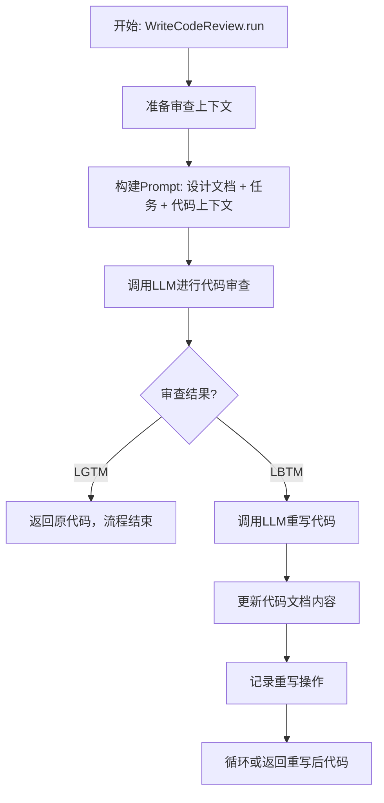
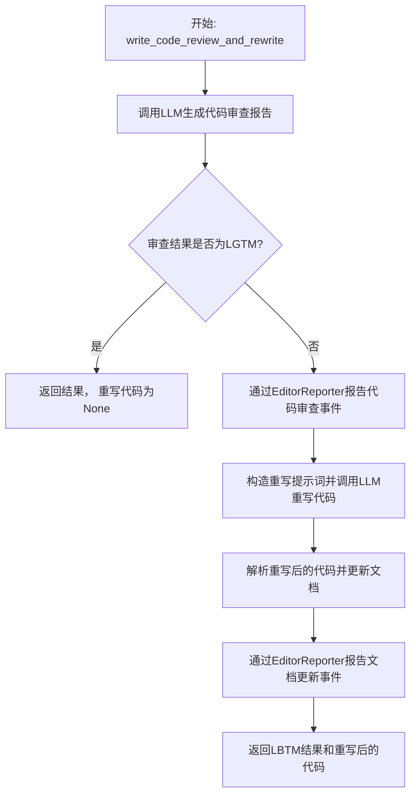
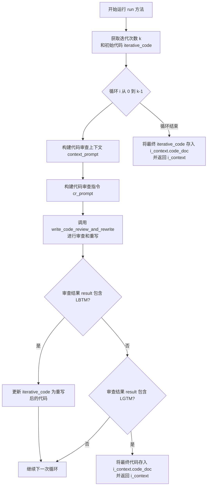
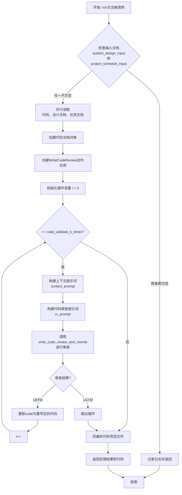
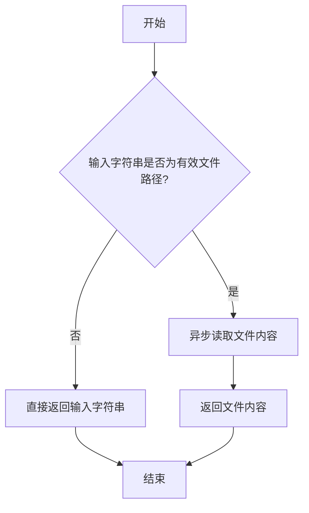
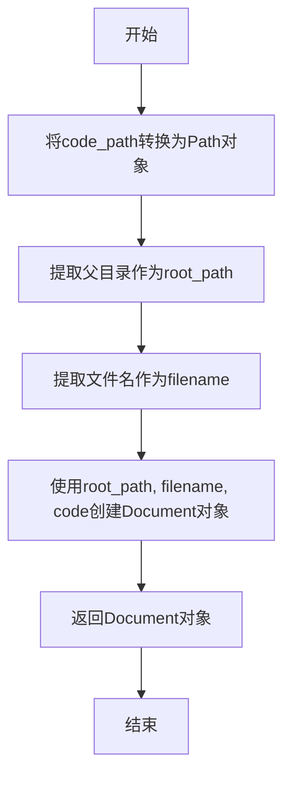

# `.\MetaGPT\metagpt\actions\write_code_review.py` 详细设计文档

该代码实现了一个代码审查与重写系统，核心功能是作为MetaGPT框架中的一个Action，通过LLM对指定代码文件进行自动化审查，根据审查结果（LGTM/LBTM）决定是否需要重写代码，以确保代码符合设计要求、逻辑正确且遵循最佳实践。

## 整体流程



## 类结构

```
Action (基类)
├── WriteCodeReview
└── ValidateAndRewriteCode
```

## 全局变量及字段


### `PROMPT_TEMPLATE`
    
用于构建代码审查请求的提示词模板，包含系统角色、上下文和待审查代码的占位符。

类型：`str`
    


### `EXAMPLE_AND_INSTRUCTION`
    
包含代码审查格式示例和具体审查指令的模板，指导审查者按步骤评估代码。

类型：`str`
    


### `FORMAT_EXAMPLE`
    
提供两种代码审查结果（LGTM和LBTM）的完整格式示例，作为审查报告的参考模板。

类型：`str`
    


### `REWRITE_CODE_TEMPLATE`
    
当代码审查结果为LBTM时，用于指导重写代码的提示词模板，要求优化单个文件。

类型：`str`
    


### `WriteCodeReview.name`
    
动作的名称，固定为'WriteCodeReview'，用于标识该动作类型。

类型：`str`
    


### `WriteCodeReview.i_context`
    
编码上下文对象，包含任务、设计、代码文档等执行代码审查所需的所有输入信息。

类型：`CodingContext`
    


### `WriteCodeReview.repo`
    
项目仓库的可选引用，用于在增量模式下获取相关代码文件以构建更完整的审查上下文。

类型：`Optional[ProjectRepo]`
    


### `WriteCodeReview.input_args`
    
可选的输入参数对象，在增量模式下用于传递如新需求文件名等额外参数。

类型：`Optional[BaseModel]`
    


### `ValidateAndRewriteCode.name`
    
工具化动作的名称，固定为'ValidateAndRewriteCode'，用于在工具注册表中标识。

类型：`str`
    
    

## 全局函数及方法

### `WriteCodeReview.write_code_review_and_rewrite`

该方法负责执行代码审查（Code Review）流程，并根据审查结果决定是否重写代码。它首先通过LLM生成代码审查报告，如果报告结果为"LGTM"（Looks Good To Me），则直接返回原代码；如果结果为"LBTM"（Looks Bad To Me），则触发代码重写流程，生成优化后的代码并更新文档。

参数：

- `context_prompt`：`str`，包含系统设计、任务描述、相关代码文件等上下文信息的提示词模板。
- `cr_prompt`：`str`，包含代码审查格式示例和具体指令的提示词模板。
- `doc`：`Document`，表示待审查代码的文档对象，包含文件名、路径和代码内容。

返回值：`tuple[str, Optional[str]]`，返回一个元组，第一个元素是代码审查结果（"LGTM"或"LBTM"），第二个元素是重写后的代码（如果结果为"LGTM"则为`None`）。

#### 流程图



#### 带注释源码

```python
@retry(wait=wait_random_exponential(min=1, max=60), stop=stop_after_attempt(6))
async def write_code_review_and_rewrite(self, context_prompt, cr_prompt, doc):
    # 从文档对象中获取待审查的文件名
    filename = doc.filename
    # 组合上下文提示词和审查提示词，调用LLM生成代码审查报告
    cr_rsp = await self._aask(context_prompt + cr_prompt)
    # 从LLM响应中解析出"Code Review Result"部分
    result = CodeParser.parse_block("Code Review Result", cr_rsp)
    # 如果审查结果是"LGTM"，则直接返回结果，无需重写代码
    if "LGTM" in result:
        return result, None

    # 如果审查结果是"LBTM"，则进入代码重写流程
    # 使用EditorReporter上下文管理器，用于报告代码审查和重写事件
    async with EditorReporter(enable_llm_stream=True) as reporter:
        # 报告代码审查事件，包含文件名和路径信息
        await reporter.async_report(
            {"type": "code", "filename": filename, "src_path": doc.root_relative_path}, "meta"
        )
        # 组合上下文、审查报告和重写指令，构造重写提示词
        rewrite_prompt = f"{context_prompt}\n{cr_rsp}\n{REWRITE_CODE_TEMPLATE.format(filename=filename)}"
        # 调用LLM生成重写后的代码
        code_rsp = await self._aask(rewrite_prompt)
        # 从LLM响应中解析出代码块
        code = CodeParser.parse_code(text=code_rsp)
        # 用重写后的代码更新文档内容
        doc.content = code
        # 报告文档更新事件
        await reporter.async_report(doc, "document")
    # 返回LBTM结果和重写后的代码
    return result, code
```

### `WriteCodeReview.run`

`WriteCodeReview.run` 方法是 `WriteCodeReview` 类的核心异步执行方法。它负责执行代码审查和重写流程。该方法会基于给定的设计文档、任务文档和代码上下文，生成一个包含代码审查提示的完整上下文，然后调用 `write_code_review_and_rewrite` 方法进行实际的审查和重写操作。根据配置的迭代次数 `k`，该方法会多次尝试审查和重写代码，直到代码通过审查（返回 LGTM）或达到最大迭代次数。最终，它会更新 `CodingContext` 中的代码文档内容并返回该上下文。

参数：

-  `*args`：`tuple`，可变位置参数，当前方法中未使用。
-  `**kwargs`：`dict`，可变关键字参数，当前方法中未使用。

返回值：`CodingContext`，包含更新后的代码文档内容及其他相关信息的上下文对象。

#### 流程图



#### 带注释源码

```python
async def run(self, *args, **kwargs) -> CodingContext:
    # 获取当前迭代的代码内容
    iterative_code = self.i_context.code_doc.content
    # 从配置中获取代码验证的最大迭代次数，默认为1
    k = self.context.config.code_validate_k_times or 1

    # 循环进行最多 k 次代码审查和重写
    for i in range(k):
        # 格式化示例，将文件名填入模板
        format_example = FORMAT_EXAMPLE.format(filename=self.i_context.code_doc.filename)
        # 获取任务文档内容，如果不存在则为空字符串
        task_content = self.i_context.task_doc.content if self.i_context.task_doc else ""
        # 获取除当前文件外的其他相关代码上下文
        code_context = await WriteCode.get_codes(
            self.i_context.task_doc,
            exclude=self.i_context.filename,
            project_repo=self.repo,
            use_inc=self.config.inc,
        )

        # 构建上下文列表，包含系统设计、任务和其他代码文件
        ctx_list = [
            "## System Design\n" + str(self.i_context.design_doc) + "\n",
            "## Task\n" + task_content + "\n",
            "## Code Files\n" + code_context + "\n",
        ]
        # 如果启用了增量模式（inc），则插入新的用户需求和代码变更计划
        if self.config.inc:
            requirement_doc = await Document.load(filename=self.input_args.requirements_filename)
            insert_ctx_list = [
                "## User New Requirements\n" + str(requirement_doc) + "\n",
                "## Code Plan And Change\n" + str(self.i_context.code_plan_and_change_doc) + "\n",
            ]
            ctx_list = insert_ctx_list + ctx_list

        # 使用模板构建完整的上下文提示
        context_prompt = PROMPT_TEMPLATE.format(
            context="\n".join(ctx_list),
            code=iterative_code,
            filename=self.i_context.code_doc.filename,
        )
        # 构建代码审查指令提示
        cr_prompt = EXAMPLE_AND_INSTRUCTION.format(
            format_example=format_example,
            filename=self.i_context.code_doc.filename,
        )
        # 记录日志，显示当前审查轮次和代码长度
        len1 = len(iterative_code) if iterative_code else 0
        len2 = len(self.i_context.code_doc.content) if self.i_context.code_doc.content else 0
        logger.info(
            f"Code review and rewrite {self.i_context.code_doc.filename}: {i + 1}/{k} | len(iterative_code)={len1}, "
            f"len(self.i_context.code_doc.content)={len2}"
        )
        # 调用内部方法执行实际的代码审查和重写
        result, rewrited_code = await self.write_code_review_and_rewrite(
            context_prompt, cr_prompt, self.i_context.code_doc
        )
        # 如果审查结果为 LBTM（需要重写），则用重写后的代码更新迭代代码
        if "LBTM" in result:
            iterative_code = rewrited_code
        # 如果审查结果为 LGTM（通过），则将当前迭代代码存入上下文并返回
        elif "LGTM" in result:
            self.i_context.code_doc.content = iterative_code
            return self.i_context
    # 循环结束后（达到最大迭代次数或中途返回），将最终的迭代代码存入上下文
    self.i_context.code_doc.content = iterative_code
    return self.i_context
```

### `ValidateAndRewriteCode.run`

`ValidateAndRewriteCode.run` 方法是 `ValidateAndRewriteCode` 类的核心异步方法。它负责根据提供的系统设计和项目计划文档，对指定路径的代码进行验证和重写。该方法会读取代码文件，结合设计文档和任务文档，通过多次迭代的代码审查（Code Review）过程，确保代码的完整性、正确性，并符合设计规范。如果审查发现问题（LBTM），则会重写代码；如果审查通过（LGTM），则保留原代码。最终，将验证或重写后的代码写回原文件，并返回处理结果。

参数：

- `code_path`：`str`，待验证和重写的代码文件路径。
- `system_design_input`：`str`，系统设计文档的内容或文件路径。用于提供代码的架构上下文。
- `project_schedule_input`：`str`，项目计划/任务文档的内容或文件路径。用于描述代码的功能需求。
- `code_validate_k_times`：`int`，可选，代码验证和重写的迭代次数，默认为2。

返回值：`str`，返回一个字符串，包含处理完成的提示信息以及最终验证或重写后的代码内容。

#### 流程图



#### 带注释源码

```python
async def run(
    self,
    code_path: str,
    system_design_input: str = "",
    project_schedule_input: str = "",
    code_validate_k_times: int = 2,
) -> str:
    """Validates the provided code based on the accompanying system design and project schedule documentation, return the complete and correct code.

    Read the code from code_path, and write the final code to code_path.
    If both system_design_input and project_schedule_input are absent, it will return and do nothing.

    Args:
        code_path (str): The file path of the code snippet to be validated. This should be a string containing the path to the source code file.
        system_design_input (str): Content or file path of the design document associated with the code. This should describe the system architecture, used in the code. It helps provide context for the validation process.
        project_schedule_input (str): Content or file path of the task document describing what the code is intended to accomplish. This should outline the functional requirements or objectives of the code.
        code_validate_k_times (int, optional): The number of iterations for validating and potentially rewriting the code. Defaults to 2.

    Returns:
        str: The potentially corrected or approved code after validation.

    Example Usage:
        # Example of how to call the run method with a code snippet and documentation
        await ValidateAndRewriteCode().run(
            code_path="/tmp/game.js",
            system_design_input="/tmp/system_design.json",
            project_schedule_input="/tmp/project_task_list.json"
        )
    """
    # 1. 输入检查：如果设计和任务文档都为空，则直接返回，不执行任何操作。
    if not system_design_input and not project_schedule_input:
        logger.info(
            "Both `system_design_input` and `project_schedule_input` are absent, ValidateAndRewriteCode will do nothing."
        )
        return

    # 2. 并行读取：异步读取代码文件、设计文档和任务文档。
    #    `_try_aread` 方法会判断输入是文件路径还是直接的内容字符串。
    code, design_doc, task_doc = await asyncio.gather(
        aread(code_path), self._try_aread(system_design_input), self._try_aread(project_schedule_input)
    )
    # 3. 创建代码文档对象：将代码内容封装成 Document 对象，便于后续处理。
    code_doc = self._create_code_doc(code_path=code_path, code=code)
    # 4. 创建代码审查动作：实例化 WriteCodeReview 类，准备执行审查。
    review_action = WriteCodeReview(i_context=CodingContext(filename=code_doc.filename))

    # 5. 构建审查上下文：将设计文档和任务文档内容拼接成提示词的一部分。
    context = "\n".join(
        [
            "## System Design\n" + design_doc + "\n",
            "## Task\n" + task_doc + "\n",
        ]
    )

    # 6. 迭代审查与重写：循环最多 `code_validate_k_times` 次。
    for i in range(code_validate_k_times):
        # 6.1 构建完整的提示词：包含上下文、待审查代码和文件名。
        context_prompt = PROMPT_TEMPLATE.format(context=context, code=code, filename=code_path)
        # 6.2 构建审查指令和示例提示词。
        cr_prompt = EXAMPLE_AND_INSTRUCTION.format(
            format_example=FORMAT_EXAMPLE.format(filename=code_path),
        )
        # 6.3 记录当前迭代日志。
        logger.info(f"The {i+1}th time to CodeReview: {code_path}.")
        # 6.4 执行核心审查与重写逻辑，返回审查结果和可能的重写代码。
        result, rewrited_code = await review_action.write_code_review_and_rewrite(
            context_prompt, cr_prompt, doc=code_doc
        )

        # 6.5 处理审查结果：
        #     - 如果结果为 LBTM (Looks Bad To Me)，说明有问题，用重写后的代码更新当前代码变量。
        if "LBTM" in result:
            code = rewrited_code
        #     - 如果结果为 LGTM (Looks Good To Me)，说明审查通过，跳出循环。
        elif "LGTM" in result:
            break

    # 7. 写回文件：将最终确定的代码（可能是原代码或重写后的代码）异步写回原文件路径。
    await awrite(filename=code_path, data=code)

    # 8. 返回结果：构造一个包含处理完成信息和最终代码内容的字符串。
    return (
        f"The review and rewriting of the code in the file '{os.path.basename(code_path)}' has been completed."
        + code
    )
```

### `ValidateAndRewriteCode._try_aread`

这是一个静态方法，用于尝试从输入字符串中读取内容。如果输入字符串是一个有效的文件路径，则异步读取该文件的内容并返回；否则，直接返回输入字符串本身。

参数：

- `input`：`str`，输入字符串，可能是一个文件路径，也可能是直接的文本内容。

返回值：`str`，返回读取到的文件内容或直接返回输入字符串。

#### 流程图



#### 带注释源码

```python
@staticmethod
async def _try_aread(input: str) -> str:
    """Try to read from the path if it's a file; return input directly if not."""

    # 检查输入字符串是否是一个有效的文件路径
    if os.path.exists(input):
        # 如果是文件路径，则异步读取文件内容
        return await aread(input)

    # 如果不是文件路径，直接返回输入字符串
    return input
```

### `ValidateAndRewriteCode._create_code_doc`

这是一个静态方法，用于根据给定的代码文件路径和代码内容，创建一个`Document`对象来表示代码文档。该方法主要用于封装代码信息，以便在后续的代码审查和重写流程中统一处理。

参数：

- `code_path`：`str`，代码文件的路径，用于提取文件名和父目录路径。
- `code`：`str`，代码文件的内容，将作为`Document`对象的内容。

返回值：`Document`，返回一个`Document`对象，其中包含代码的根路径、文件名和内容。

#### 流程图



#### 带注释源码

```python
@staticmethod
def _create_code_doc(code_path: str, code: str) -> Document:
    """Create a Document to represent the code doc."""

    # 将传入的代码文件路径字符串转换为Path对象，以便于操作文件路径
    path = Path(code_path)

    # 使用Path对象的父目录作为根路径，文件名作为文件名，以及传入的代码内容，创建一个Document对象
    # Document对象用于在系统中统一表示文档，包含路径、文件名和内容等信息
    return Document(root_path=str(path.parent), filename=path.name, content=code)
```

## 关键组件

### WriteCodeReview 类

一个用于执行代码审查和重写的动作类，它继承自 Action 基类，通过 LLM 分析代码，并根据审查结果决定是否重写代码。

### 代码审查与重写流程

一个包含重试机制的异步方法，负责调用 LLM 进行代码审查。如果审查结果为 LBTM（Looks Bad To Me），则生成重写提示，再次调用 LLM 重写代码，并更新文档内容。

### 提示词模板系统

一组用于构建 LLM 提示词的模板字符串，包括系统角色定义、上下文构建、代码审查指令、格式示例和代码重写指令，用于引导 LLM 进行结构化的代码审查和重写。

### 验证与重写工具类 (ValidateAndRewriteCode)

一个注册为工具的 Action 子类，提供了从文件路径读取代码和设计文档、进行多轮验证和重写、并将最终结果写回文件的端到端功能，可作为独立工具使用。

### 项目仓库与文档管理

利用 `ProjectRepo` 和 `Document` 类来管理代码文件和设计文档，支持从项目上下文中获取相关代码文件，以提供更全面的审查背景。

### 异步报告机制

通过 `EditorReporter` 在代码重写过程中异步报告状态，支持实时流式输出，增强了操作的可观察性和用户体验。

### 配置驱动的迭代控制

通过配置文件中的 `code_validate_k_times` 参数控制代码审查和重写的最大迭代次数，提供了灵活的质量控制机制。

## 问题及建议

### 已知问题

-   **`WriteCodeReview` 类的 `run` 方法逻辑存在冗余和潜在错误**：方法中使用了 `iterative_code` 和 `self.i_context.code_doc.content` 两个变量来追踪代码内容，并在循环中多次比较它们的长度。在 `write_code_review_and_rewrite` 方法内部，如果代码被重写，会直接修改传入的 `doc` 对象（即 `self.i_context.code_doc`）的 `content` 属性。然而，`run` 方法在循环结束后，无论结果如何，都会将 `iterative_code` 赋值给 `self.i_context.code_doc.content`。如果最后一次迭代结果为 `LBTM`，`iterative_code` 会被更新为重写后的代码，这没有问题。但如果最后一次迭代结果为 `LGTM`，`iterative_code` 并未被更新，此时将 `iterative_code` 赋值回去可能会覆盖掉 `doc.content` 在 `write_code_review_and_rewrite` 方法中可能发生的正确更新（尽管在 `LGTM` 分支下 `doc.content` 未改变），逻辑上显得不清晰且存在风险。此外，循环结束后注释掉的代码 `# code_rsp = await self._aask_v1(prompt, "code_rsp", OUTPUT_MAPPING)` 是无效代码，应删除。
-   **`ValidateAndRewriteCode` 类的 `run` 方法存在资源泄漏风险**：`WriteCodeReview` 实例 `review_action` 在循环中被创建，但其持有的 `i_context` 包含了 `CodingContext`，而 `CodingContext` 可能包含对 `ProjectRepo` 等资源的引用。该实例在方法结束后未被显式清理。虽然Python有垃圾回收，但对于可能持有文件句柄或网络连接的对象，最佳实践是使用上下文管理器或显式关闭。
-   **`WriteCodeReview` 类的 `write_code_review_and_rewrite` 方法职责过重**：该方法同时负责代码评审（调用LLM）和代码重写（再次调用LLM），并将结果报告逻辑耦合其中。这违反了单一职责原则，使得方法难以测试、理解和维护。特别是当需要修改报告逻辑或重写策略时，需要修改这个复杂的方法。
-   **硬编码的提示词模板和格式示例**：`PROMPT_TEMPLATE`, `EXAMPLE_AND_INSTRUCTION`, `FORMAT_EXAMPLE`, `REWRITE_CODE_TEMPLATE` 等模板字符串直接嵌入在代码中。这使得难以根据不同的项目需求、编码规范或LLM特性进行调整，缺乏灵活性和可配置性。
-   **`WriteCodeReview` 对 `ProjectRepo` 的依赖管理不清晰**：`WriteCodeReview` 类有一个 `repo: Optional[ProjectRepo]` 字段，但在其 `run` 方法中，它通过 `WriteCode.get_codes(...)` 使用这个 `repo`。然而，`repo` 字段被标记为 `exclude=True`（可能用于序列化），并且没有在类的初始化或 `run` 方法中明确检查其有效性。如果 `repo` 为 `None` 且 `config.inc` 为 `True`，`WriteCode.get_codes` 的调用可能会失败或行为异常。
-   **`ValidateAndRewriteCode.run` 方法的错误处理不完善**：当 `system_design_input` 和 `project_schedule_input` 都为空时，方法记录日志并 `return`，但没有返回一个明确的值（如空字符串或特定标记），调用方可能无法区分“无事可做”和“执行失败”。此外，对于 `aread` 或 `_try_aread` 可能抛出的文件读取异常，没有进行捕获和处理。
-   **`WriteCodeReview` 的 `input_args` 字段用途模糊**：`input_args` 字段类型为 `Optional[BaseModel]`，仅在 `config.inc` 为 `True` 时，用于加载 `requirements_filename`。这个字段的命名和用途不够清晰，且其依赖关系（仅在特定配置下使用）增加了代码的复杂性。

### 优化建议

-   **重构 `WriteCodeReview.run` 方法的循环和状态管理**：简化循环内的状态追踪。可以只使用 `self.i_context.code_doc.content` 作为当前代码版本。在每次迭代中，直接将其传递给评审/重写逻辑。如果评审结果为 `LBTM`，则用重写后的代码更新 `self.i_context.code_doc.content`；如果为 `LGTM`，则跳出循环。删除 `iterative_code` 变量和循环结束后的冗余赋值。同时，清理无效的注释代码。
-   **为 `WriteCodeReview` 实现资源管理协议或提供清理方法**：考虑让 `WriteCodeReview` 实现 `__aenter__` 和 `__aexit__` 方法，确保其持有的资源（如通过 `repo` 可能打开的文件）能被正确清理。或者在 `ValidateAndRewriteCode.run` 方法中，确保在不再需要 `review_action` 后，调用其清理方法（如果存在）。
-   **拆分 `write_code_review_and_rewrite` 方法**：将其拆分为至少三个独立的方法：1) `_review_code`: 负责生成评审提示、调用LLM、解析评审结果。2) `_rewrite_code`: 负责生成重写提示、调用LLM、解析重写后的代码。3) `_report_progress`: 负责通过 `EditorReporter` 报告进度。原方法则协调这三个步骤。这将提高代码的模块化和可测试性。
-   **将提示词模板外部化或配置化**：将这些模板字符串移出代码，放入配置文件（如JSON、YAML）或数据库中。可以创建一个 `PromptTemplates` 配置类来管理它们，并通过依赖注入或配置对象提供给 `WriteCodeReview` 类。这样便于维护、A/B测试和适应不同场景。
-   **明确 `ProjectRepo` 的依赖和生命周期**：在 `WriteCodeReview` 的 `run` 方法开始处，检查 `repo` 的有效性，特别是当 `config.inc` 为 `True` 时。可以考虑将 `repo` 作为 `run` 方法的参数传入，而不是作为类字段，以更清晰地管理其生命周期和依赖关系。或者，在类初始化时强制要求提供有效的 `repo`。
-   **增强 `ValidateAndRewriteCode.run` 方法的健壮性和明确性**：当输入参数都为空时，可以返回一个明确的字符串常量（如 `"NO_ACTION_REQUIRED"`）或抛出一个自定义的、易于识别的异常（如 `ValidationSkippedError`），让调用方能够明确处理这种情况。同时，使用 `try...except` 块包裹文件读取和LLM调用等可能失败的操作，并记录或抛出适当的异常。
-   **重命名或重构 `input_args` 字段**：将其重命名为更具描述性的名称，如 `incremental_context_args` 或 `inc_args`。或者，考虑将其包含的信息直接整合到 `i_context` 中，避免增加额外的、条件性使用的字段。如果必须保留，应在文档中明确说明其使用条件和目的。

## 其它

### 设计目标与约束

该代码模块的核心设计目标是提供一个自动化的代码审查与重写机制，旨在通过结合系统设计文档、任务需求以及现有代码上下文，利用大语言模型（LLM）对指定代码文件进行审查。若审查不通过（LBTM），则自动生成修正后的代码。其核心约束包括：必须遵循给定的结构化提示词模板以确保审查和重写过程的标准化；审查过程需考虑代码的功能完整性、逻辑正确性、接口一致性、依赖完整性以及代码复用性；重写过程需在单文件层面进行优化，并确保输出格式符合要求。此外，代码执行需具备容错重试机制，并支持可配置的迭代审查次数。

### 错误处理与异常设计

代码中显式的错误处理主要通过`tenacity`库提供的`@retry`装饰器实现，该装饰器被应用于`write_code_review_and_rewrite`方法，使其在遇到可重试的异常（如网络超时、LLM API调用失败）时，能够以指数退避策略自动重试最多6次。对于文件读写操作（如`aread`, `awrite`），依赖的底层函数应包含自身的异常处理逻辑。在`ValidateAndRewriteCode.run`方法中，通过检查输入参数是否为空来避免不必要的操作，这是一种防御性编程。然而，代码中缺乏对`_aask`方法调用可能抛出的特定异常（如解析失败、内容不符合预期格式）的细粒度捕获和处理，这可能导致流程在非预期状态下中断。整体异常处理策略偏向于乐观重试，而非详尽的错误分类与恢复。

### 数据流与状态机

该模块的核心数据流始于外部输入（代码文件路径、设计文档、任务文档），经过`WriteCodeReview`或`ValidateAndRewriteCode`类的处理，最终输出审查结果和/或重写后的代码。在`WriteCodeReview.run`方法中，状态围绕`iterative_code`（当前迭代的代码内容）和`self.i_context.code_doc.content`（最终的代码文档内容）演变。流程本质上是一个最多执行`k`次的循环状态机：
1.  **初始状态**：载入初始代码、设计、任务等上下文。
2.  **审查状态**：组合提示词，调用LLM进行审查，获得`LGTM`或`LBTM`结果。
3.  **决策状态**：
    *   若结果为`LGTM`，则跳出循环，将当前`iterative_code`存入上下文并返回，流程结束。
    *   若结果为`LBTM`，则进入**重写状态**，调用LLM生成新代码，更新`iterative_code`，并返回循环起点进行下一次审查。
4.  **终止状态**：达到最大迭代次数`k`后，无论结果如何，都将当前的`iterative_code`作为最终结果返回。
`ValidateAndRewriteCode.run`方法封装了类似的数据流，但输入输出接口更面向独立工具调用。

### 外部依赖与接口契约

1.  **大语言模型（LLM）服务**：通过父类`Action`的`_aask`方法（或其变体）进行交互。这是最核心的外部依赖，其接口契约是接收一个字符串提示词（prompt），并返回一个格式符合预期的文本响应。代码的健壮性严重依赖于LLM对复杂提示词模板的理解和遵守。
2.  **项目仓库（ProjectRepo）**：`WriteCodeReview`类中的`repo`字段是对`ProjectRepo`对象的可选依赖。它通过`WriteCode.get_codes`方法被用于获取项目中除当前文件外的其他代码文件内容，以提供更丰富的审查上下文。其接口契约是提供按路径读取代码内容的能力。
3.  **文件系统**：通过`aread`、`awrite`以及`os.path.exists`、`Path`进行操作。依赖契约是能够正常读写指定路径的文件。
4.  **日志系统**：通过`metagpt.logs.logger`进行信息、警告和错误的记录。这是可观察性的关键依赖。
5.  **工具注册表**：`ValidateAndRewriteCode`类使用`@register_tool`装饰器，表明它预期被注册到某个更大的工具框架或平台中，以便被外部发现和调用。这定义了其作为可调用工具的对外接口契约。
6.  **配置系统**：`WriteCodeReview.run`方法中通过`self.context.config`访问配置（如`code_validate_k_times`, `inc`），这依赖于外部的配置管理机制。
    