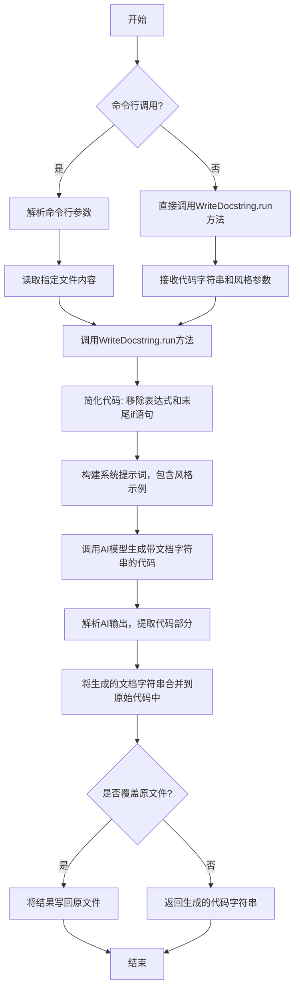
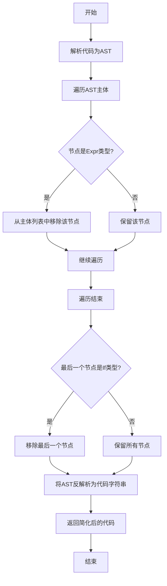
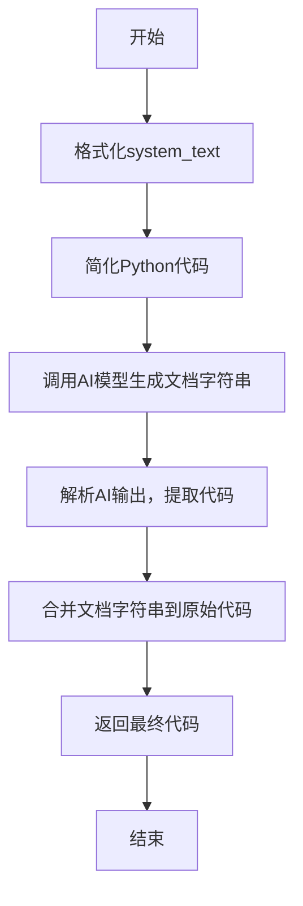
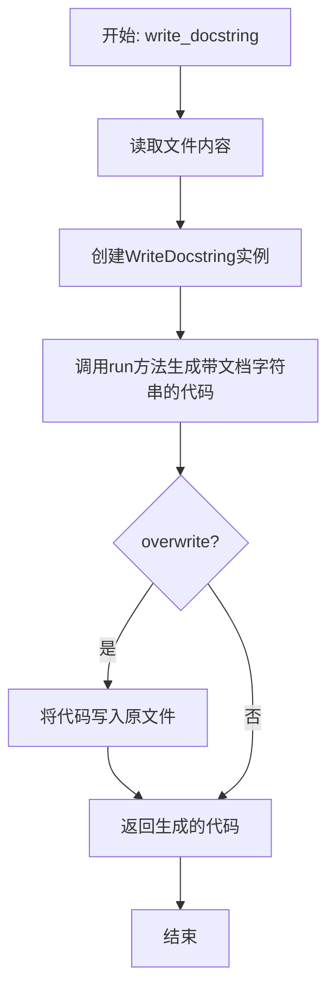

# `.\MetaGPT\metagpt\actions\write_docstring.py` 详细设计文档

该代码是一个Python文档字符串生成工具，它能够自动为给定的Python代码生成指定风格（Google、NumPy或Sphinx）的文档字符串。它通过解析代码结构，使用AI模型生成符合规范的文档字符串，并支持将结果写回原文件或输出到控制台。

## 整体流程



## 类结构

```
WriteDocstring (Action)
├── 类字段: desc, i_context
├── 类方法: run, write_docstring (静态方法)
└── 全局函数: _simplify_python_code
```

## 全局变量及字段


### `PYTHON_DOCSTRING_SYSTEM`
    
用于指导大语言模型生成文档字符串的系统提示词模板，包含占位符以适配不同的文档风格。

类型：`str`
    


### `PYTHON_DOCSTRING_EXAMPLE_GOOGLE`
    
展示符合Google风格文档字符串格式的示例代码。

类型：`str`
    


### `PYTHON_DOCSTRING_EXAMPLE_NUMPY`
    
展示符合NumPy风格文档字符串格式的示例代码。

类型：`str`
    


### `PYTHON_DOCSTRING_EXAMPLE_SPHINX`
    
展示符合Sphinx风格文档字符串格式的示例代码。

类型：`str`
    


### `_python_docstring_style`
    
一个字典，将文档风格名称（'google', 'numpy', 'sphinx'）映射到对应的示例代码字符串。

类型：`dict[str, str]`
    


### `WriteDocstring.desc`
    
描述此Action类功能的字符串，用于元信息或日志记录。

类型：`str`
    


### `WriteDocstring.i_context`
    
可选的上下文信息字符串，可能用于存储或传递与当前文档生成任务相关的额外信息。

类型：`Optional[str]`
    
    

## 全局函数及方法

### `_simplify_python_code`

该函数用于简化给定的Python代码字符串。它通过解析代码的抽象语法树（AST），移除所有表达式节点（如独立的字符串、数字等）以及最后一个`if`语句（如果存在），从而生成一个更简洁的代码版本，通常用于生成文档字符串时减少不必要的信息。

参数：
- `code`：`str`，需要被简化的原始Python代码字符串。

返回值：`str`，简化后的Python代码字符串。

#### 流程图



#### 带注释源码

```python
def _simplify_python_code(code: str) -> str:
    """Simplifies the given Python code by removing expressions and the last if statement.

    Args:
        code: A string of Python code.

    Returns:
        The simplified Python code.
    """
    # 1. 使用ast.parse将输入的代码字符串解析为抽象语法树（AST）对象。
    code_tree = ast.parse(code)

    # 2. 过滤AST的body列表，移除所有类型为ast.Expr的节点。
    #    ast.Expr通常代表独立的表达式，如文档字符串、字面量等，这些在生成文档时通常不需要。
    code_tree.body = [i for i in code_tree.body if not isinstance(i, ast.Expr)]

    # 3. 检查过滤后的body列表的最后一个元素是否为ast.If类型。
    #    如果是，则将其移除。这通常用于处理脚本末尾的`if __name__ == "__main__":`块。
    if isinstance(code_tree.body[-1], ast.If):
        code_tree.body.pop()

    # 4. 使用ast.unparse将简化后的AST对象转换回Python代码字符串并返回。
    return ast.unparse(code_tree)
```

### `WriteDocstring.run`

该方法用于为给定的Python代码生成指定风格的文档字符串（docstring）。它通过简化输入代码、调用AI模型生成文档字符串，然后将生成的文档字符串与原始代码合并，最终返回包含文档字符串的完整代码。

参数：

- `code`：`str`，需要生成文档字符串的Python代码字符串。
- `system_text`：`str`，用于指导AI模型生成文档字符串的系统提示文本，默认为`PYTHON_DOCSTRING_SYSTEM`。
- `style`：`Literal["google", "numpy", "sphinx"]`，指定生成的文档字符串风格，可选值为'google'、'numpy'或'sphinx'，默认为'google'。

返回值：`str`，返回添加了文档字符串的Python代码字符串。

#### 流程图



#### 带注释源码

```python
async def run(
    self,
    code: str,
    system_text: str = PYTHON_DOCSTRING_SYSTEM,
    style: Literal["google", "numpy", "sphinx"] = "google",
) -> str:
    """Writes docstrings for the given code and system text in the specified style.

    Args:
        code: A string of Python code.
        system_text: A string of system text.
        style: A string specifying the style of the docstring. Can be 'google', 'numpy', or 'sphinx'.

    Returns:
        The Python code with docstrings added.
    """
    # 1. 格式化系统提示文本，插入指定的风格和示例
    system_text = system_text.format(style=style, example=_python_docstring_style[style])
    
    # 2. 简化输入的Python代码，移除表达式和最后的if语句
    simplified_code = _simplify_python_code(code)
    
    # 3. 调用AI模型，传入简化后的代码和系统提示，生成包含文档字符串的代码
    documented_code = await self._aask(f"```python\n{simplified_code}\n```", [system_text])
    
    # 4. 解析AI模型的输出，提取Python代码部分
    documented_code = OutputParser.parse_python_code(documented_code)
    
    # 5. 将生成的文档字符串合并到原始代码中，返回最终结果
    return merge_docstring(code, documented_code)
```

### `WriteDocstring.write_docstring`

这是一个静态方法，用于为指定的Python文件生成并写入符合指定风格的文档字符串（docstring）。它读取文件内容，调用`WriteDocstring`类的`run`方法生成带文档字符串的代码，并根据`overwrite`参数决定是覆盖原文件还是仅返回生成的代码字符串。

参数：

- `filename`：`str | Path`，需要生成文档字符串的Python文件的路径。
- `overwrite`：`bool`，默认为`False`。如果为`True`，则将生成的带文档字符串的代码写回原文件；如果为`False`，则仅返回生成的代码字符串。
- `style`：`Literal["google", "numpy", "sphinx"]`，默认为`"google"`。指定生成文档字符串的风格，可选值为`'google'`、`'numpy'`或`'sphinx'`。

返回值：`str`，生成的、包含文档字符串的Python代码字符串。

#### 流程图



#### 带注释源码

```python
    @staticmethod
    async def write_docstring(
        filename: str | Path, # 参数：需要处理的Python文件路径
        overwrite: bool = False, # 参数：是否覆盖原文件
        style: Literal["google", "numpy", "sphinx"] = "google" # 参数：文档字符串风格
    ) -> str: # 返回值：生成的带文档字符串的代码
        # 异步读取指定文件的内容
        data = await aread(str(filename))
        # 创建WriteDocstring类实例，并调用其run方法生成带文档字符串的代码
        code = await WriteDocstring().run(data, style=style)
        # 根据overwrite参数决定是否将生成的代码写回原文件
        if overwrite:
            await awrite(filename, code)
        # 返回生成的代码字符串
        return code
```

## 关键组件

### WriteDocstring 类

该类是 Action 的子类，负责为给定的 Python 代码生成指定风格的文档字符串（docstring）。它通过调用 LLM 来理解代码结构并生成符合 Google、NumPy 或 Sphinx 风格的文档字符串，然后将其合并回原始代码中。

### 文档字符串风格模板系统

该系统定义了三种主流的 Python 文档字符串风格（Google、NumPy、Sphinx）的模板和示例。它通过 `PYTHON_DOCSTRING_SYSTEM` 系统提示词和 `_python_docstring_style` 字典来配置和提供不同风格的示例，确保生成的文档字符串格式规范、统一。

### 代码简化函数 `_simplify_python_code`

该函数使用 Python 的 `ast` 模块解析代码，移除所有表达式节点（如独立的字符串，通常是已有的文档字符串）和文件末尾的 `if __name__ == "__main__":` 语句块。其目的是清理代码，只保留类、函数等核心结构定义，以减少输入给 LLM 的上下文长度和干扰信息。

### 文档字符串合并函数 `merge_docstring`

该函数（虽然实现在导入的 `metagpt.utils.pycst` 模块中，但它是本功能的关键组件）负责将新生成的、包含文档字符串的代码与原始代码进行智能合并。它需要精确地识别出函数、类等代码块的位置，并用新的、带有文档字符串的版本替换旧版本，同时保持原始代码的其他部分（如实现逻辑、注释、格式）不变。

### 命令行接口

通过 `fire` 库实现，提供了 `WriteDocstring.write_docstring` 静态方法的命令行调用方式。用户可以通过命令行指定文件路径、是否覆盖原文件以及文档字符串风格，使得该工具可以方便地集成到开发流程或脚本中。

## 问题及建议


### 已知问题

-   **`_simplify_python_code` 函数存在逻辑缺陷**：该函数在移除 `ast.Expr` 节点后，直接假设列表最后一个元素是 `ast.If` 类型并进行移除。如果最后一个元素不是 `if` 语句（例如，是一个函数或类定义），此操作将引发 `IndexError` 异常。此外，如果 `code_tree.body` 在处理后变为空列表，`code_tree.body[-1]` 的访问同样会引发 `IndexError`。
-   **`_simplify_python_code` 函数返回类型标注错误**：函数签名中声明的返回类型为 `None`，但函数实际返回的是 `ast.unparse(code_tree)` 的结果，这是一个 `str` 类型，导致类型声明与实际行为不符。
-   **`PYTHON_DOCSTRING_SYSTEM` 提示词模板存在潜在风险**：模板中要求“将函数体替换为 Ellipsis 对象(...)以减少输出”，这可能导致生成的代码片段 (`documented_code`) 中函数体信息丢失。虽然后续的 `merge_docstring` 函数旨在合并文档字符串和原始代码体，但如果合并逻辑不健壮或原始代码结构复杂，可能引发合并错误或信息丢失。
-   **`run` 方法对 `system_text` 参数的默认值使用不当**：`system_text` 参数默认值为 `PYTHON_DOCSTRING_SYSTEM`，但在方法内部会对其进行格式化 (`system_text.format(...)`)。如果调用者传入一个自定义的、不包含 `{style}` 和 `{example}` 占位符的字符串，`format` 方法将抛出 `KeyError` 异常。这限制了该参数的灵活使用。
-   **缺乏输入验证与错误处理**：代码未对输入参数（如 `code` 字符串是否为有效的 Python 语法，`style` 参数是否为有效值）进行充分验证。`ast.parse` 在解析无效代码时会抛出 `SyntaxError`，但此异常未被捕获和处理。`merge_docstring` 函数也可能因代码结构不匹配而失败。
-   **潜在的代码合并冲突**：`merge_docstring` 函数（虽然未在此文件中定义）的可靠性是整个功能的核心。如果它无法正确处理所有边缘情况（例如，嵌套函数、装饰器、带有复杂语句的函数体等），则生成的最终代码可能不正确。

### 优化建议

-   **修复 `_simplify_python_code` 函数**：
    1.  修正返回类型注解为 `-> str`。
    2.  在尝试访问 `code_tree.body[-1]` 之前，先检查列表是否为空 (`if code_tree.body and isinstance(code_tree.body[-1], ast.If):`)。
-   **增强 `run` 方法的健壮性**：
    1.  在调用 `_simplify_python_code` 和 `ast.parse` 的地方添加 `try-except` 块，捕获 `SyntaxError` 等异常，并返回有意义的错误信息。
    2.  考虑移除 `system_text` 参数的默认值，或改为在方法内部根据 `style` 参数动态构造系统提示词，以避免对调用者传入的 `system_text` 进行格式化时可能引发的异常。
-   **改进提示词策略**：重新评估 `PYTHON_DOCSTRING_SYSTEM` 中要求替换函数体为 `...` 的指令。可以考虑改为要求模型“保持函数体原样”或“仅输出需要添加/修改文档字符串的部分”，以降低后续代码合并的复杂度和风险。
-   **添加输入验证**：在 `run` 方法开始时，验证 `style` 参数是否在 `_python_docstring_style` 字典的键中。验证 `code` 参数是否非空。
-   **提高 `write_docstring` 静态方法的健壮性**：在读取文件 (`aread`) 和写入文件 (`awrite`) 时，应考虑文件不存在、权限错误等IO异常，并进行适当处理。
-   **增加日志记录**：在关键步骤（如开始处理、调用大模型、合并代码、写入文件）添加日志输出，便于调试和监控工具的运行状态。
-   **考虑性能优化**：如果处理非常大的源文件，当前的 `ast` 解析和合并操作可能会成为瓶颈。虽然对于典型用途可能足够，但可以评估是否有必要进行性能剖析和优化。
-   **完善单元测试**：为 `_simplify_python_code` 函数和 `WriteDocstring` 类的 `run` 方法编写全面的单元测试，覆盖各种边界情况（空代码、无效语法、只有 `if` 语句的代码、没有 `if` 语句的代码等），以确保修复和优化后的代码行为正确。


## 其它


### 设计目标与约束

1.  **核心目标**：为输入的Python代码自动生成符合指定风格（Google、NumPy、Sphinx）的文档字符串（docstring）。
2.  **功能约束**：
    *   支持对模块、类、函数/方法级别的代码生成docstring。
    *   当函数/方法已包含类型注解时，生成的docstring应避免重复包含类型信息。
    *   生成的docstring必须与原始代码的语法结构正确合并，不能破坏原有代码逻辑。
    *   提供命令行接口，支持指定输入文件、输出方式（覆盖或返回）及文档风格。
3.  **非功能约束**：
    *   **可用性**：提供清晰的命令行使用说明和错误提示。
    *   **可维护性**：代码结构清晰，将核心逻辑（`WriteDocstring`类）、工具函数（`_simplify_python_code`）和配置（风格示例）分离。
    *   **可扩展性**：通过`_python_docstring_style`字典管理不同风格模板，便于未来添加新的docstring风格。

### 错误处理与异常设计

1.  **输入验证**：
    *   `WriteDocstring.run` 方法依赖调用方传入有效的`code`字符串和`style`参数。`style`参数通过`Literal`类型进行约束。
    *   `WriteDocstring.write_docstring` 方法通过`aread`读取文件，若文件不存在或无法读取，将抛出底层IO异常。
2.  **处理过程错误**：
    *   `_simplify_python_code` 函数使用`ast.parse`解析代码。如果输入的`code`不是有效的Python语法，将抛出`SyntaxError`。
    *   `OutputParser.parse_python_code` 在解析大模型返回的代码时，如果返回内容不包含有效的代码块，可能返回空字符串或引发解析异常。
    *   `merge_docstring` 函数在执行代码合并时，如果新旧代码的AST结构不匹配（例如，大模型返回的代码结构与简化后的代码结构差异过大），合并可能失败或产生错误结果。
3.  **异常传播**：当前设计未显式捕获和处理上述大部分异常。异常将向上层调用者（如命令行用户或调用`run`方法的其他组件）传播。在命令行场景下，`fire`库会捕获异常并打印错误信息。

### 数据流与状态机

1.  **核心数据流（`WriteDocstring.run` 方法）**：
    *   **输入**：原始代码字符串 (`code`)、系统提示词模板 (`system_text`)、文档风格 (`style`)。
    *   **处理**：
        1.  **格式化提示词**：将`style`和对应示例填入`system_text`模板。
        2.  **代码简化**：调用`_simplify_python_code`，移除表达式和末尾的`if __name__ == "__main__"`语句块，生成`simplified_code`。
        3.  **大模型请求**：将`simplified_code`和格式化后的`system_text`发送给大模型 (`_aask`)，请求生成带docstring的代码。
        4.  **代码解析**：使用`OutputParser.parse_python_code`从大模型响应中提取代码块，得到`documented_code`。
        5.  **代码合并**：调用`merge_docstring`，将`documented_code`中的docstring合并到原始`code`中，保留原始代码的函数体等实现细节。
    *   **输出**：合并后的、包含新docstring的完整代码字符串。
2.  **状态机**：本模块主要是一个无状态的工具类。`WriteDocstring`类的`run`方法是纯函数式的，输出完全由输入决定。`write_docstring`静态方法封装了“读取文件->生成docstring->（可选）写回文件”的流程。

### 外部依赖与接口契约

1.  **外部库依赖**：
    *   `ast` (Python标准库)：用于解析和操作Python抽象语法树。
    *   `fire`：用于构建命令行接口。
    *   `metagpt.actions.action.Action`：父类，可能提供了`_aask`等方法与大模型交互的基础设施。
    *   `metagpt.utils.common.OutputParser`：提供从大模型文本响应中解析Python代码的功能。
    *   `metagpt.utils.common.aread` / `awrite`：异步文件读写工具函数。
    *   `metagpt.utils.pycst.merge_docstring`：使用`libcst`库进行精确的源代码级别合并，是保证合并正确性的关键组件。
2.  **接口契约**：
    *   `WriteDocstring.run` 接口：期望接收有效的Python代码字符串。其成功执行依赖于父类`Action`提供的`_aask`方法能正常工作并返回预期格式的响应。
    *   `merge_docstring` 函数：是本模块的核心外部契约。它接收原始代码和带新docstring的代码，返回合并后的代码。本模块的正确性严重依赖于该函数能正确处理各种代码结构。
    *   大模型服务：通过`_aask`调用，是本模块功能的“智能”核心。其响应的质量和格式直接影响最终结果。

    